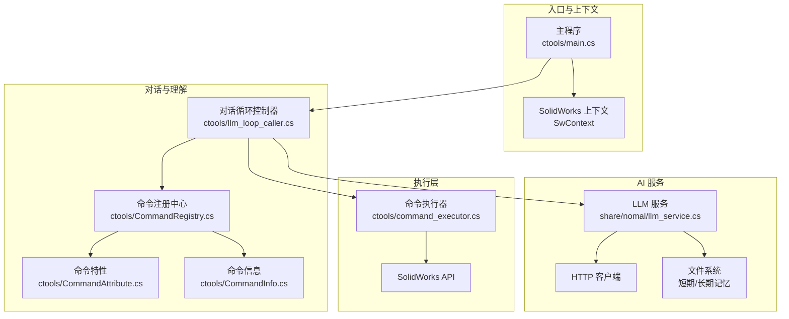
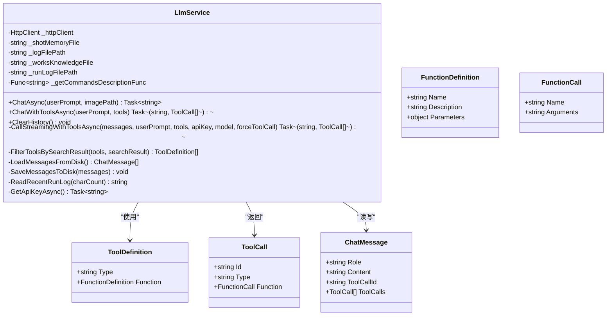
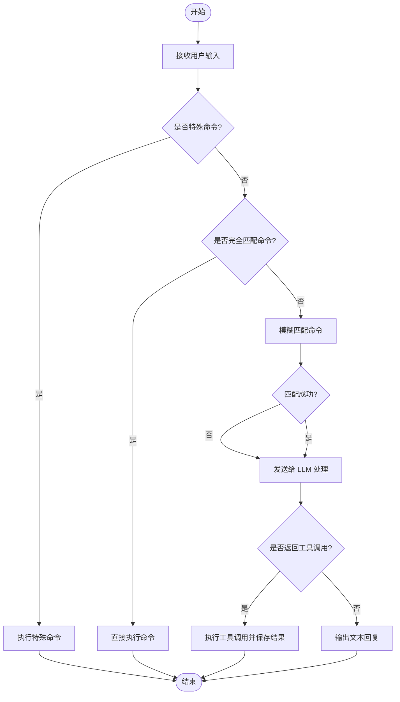
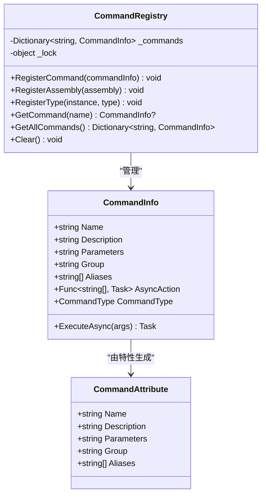
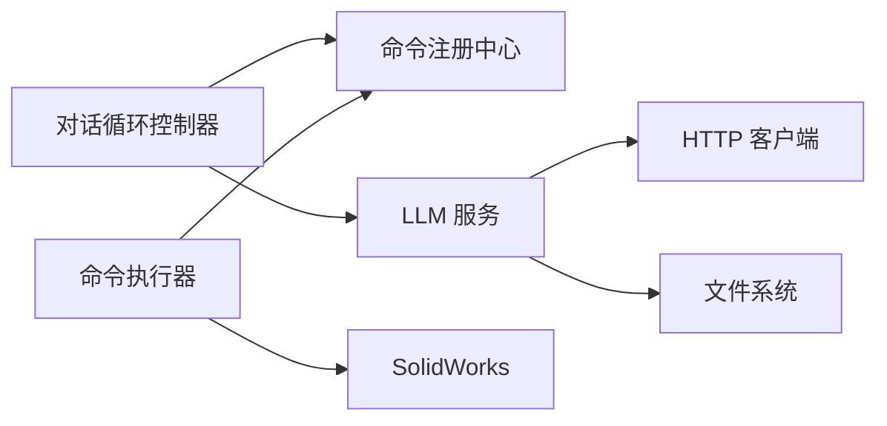

# AI 集成模块

<cite>
**本文档引用的文件**
- [llm_service.cs](file://share/nomal/llm_service.cs)
- [llm_loop_caller.cs](file://ctools/llm_loop_caller.cs)
- [command_executor.cs](file://ctools/command_executor.cs)
- [CommandRegistry.cs](file://ctools/CommandRegistry.cs)
- [CommandAttribute.cs](file://ctools/CommandAttribute.cs)
- [CommandInfo.cs](file://ctools/CommandInfo.cs)
- [main.cs](file://ctools/main.cs)
</cite>

## 目录
1. [简介](#简介)
2. [项目结构](#项目结构)
3. [核心组件](#核心组件)
4. [架构总览](#架构总览)
5. [详细组件分析](#详细组件分析)
6. [依赖关系分析](#依赖关系分析)
7. [性能考虑](#性能考虑)
8. [故障排除指南](#故障排除指南)
9. [结论](#结论)
10. [附录](#附录)

## 简介
本文件面向开发者，系统化阐述 AI 集成模块的技术实现，重点覆盖以下方面：
- LLM 对话循环控制器的工作机制：对话状态管理、历史记录维护、上下文理解与增强
- DashScope 通义千问 API 的集成方式与配置选项
- 自然语言理解流程：意图识别、工具调用模式、命令解析
- 长期/短期记忆管理与工作知识库的集成策略
- AI 服务配置指南与故障排除方法
- 性能优化建议与 API 使用限制说明

## 项目结构
该模块围绕“对话循环控制器 + LLM 服务 + 命令执行器 + 命令注册中心”展开，形成清晰的分层架构：
- 顶层入口负责注册命令、连接 SolidWorks 并启动交互循环
- 对话循环控制器负责用户输入处理、意图识别、工具调用与执行、历史记录与记忆管理
- LLM 服务封装 DashScope API 调用、消息历史、系统提示与工具定义
- 命令执行器负责将工具调用转换为具体命令并执行
- 命令注册中心统一管理命令元数据与动态发现



**图表来源**
- [main.cs:54-109](file://ctools/main.cs#L54-L109)
- [llm_loop_caller.cs:44-67](file://ctools/llm_loop_caller.cs#L44-L67)
- [llm_service.cs:18-53](file://share/nomal/llm_service.cs#L18-L53)
- [CommandRegistry.cs:12-27](file://ctools/CommandRegistry.cs#L12-L27)
- [CommandAttribute.cs:5-18](file://ctools/CommandAttribute.cs#L5-L18)
- [CommandInfo.cs:17-39](file://ctools/CommandInfo.cs#L17-L39)
- [command_executor.cs:12-26](file://ctools/command_executor.cs#L12-L26)

**章节来源**
- [main.cs:54-109](file://ctools/main.cs#L54-L109)
- [llm_loop_caller.cs:44-67](file://ctools/llm_loop_caller.cs#L44-L67)
- [llm_service.cs:18-53](file://share/nomal/llm_service.cs#L18-L53)
- [CommandRegistry.cs:12-27](file://ctools/CommandRegistry.cs#L12-L27)
- [CommandAttribute.cs:5-18](file://ctools/CommandAttribute.cs#L5-L18)
- [CommandInfo.cs:17-39](file://ctools/CommandInfo.cs#L17-L39)
- [command_executor.cs:12-26](file://ctools/command_executor.cs#L12-L26)

## 核心组件
- LLM 服务（DashScope 集成）
  - 负责 API Key 获取、系统提示构建、消息历史加载/保存、工具定义过滤、流式/非流式调用、长期记忆日志
  - 关键接口：ChatAsync、ChatWithToolsAsync、CallStreamingWithToolsAsync、ClearHistory
- 对话循环控制器
  - 负责用户输入处理、特殊命令识别、模糊命令匹配、工具调用执行、历史与记忆管理、模式切换
  - 关键接口：InteractiveLoopAsync、ExecuteToolCallAsync、FindFuzzyCommand、SaveToolResultsToMemory
- 命令执行器
  - 负责命令解析、SolidWorks 连接校验、模型上下文更新、异步/同步命令执行
  - 关键接口：ExecuteCommandAsync
- 命令注册中心
  - 统一注册与发现命令，支持批量反射注册、别名映射、线程安全访问
  - 关键接口：RegisterAssembly、RegisterType、GetCommand、GetAllCommands

**章节来源**
- [llm_service.cs:485-614](file://share/nomal/llm_service.cs#L485-L614)
- [llm_loop_caller.cs:493-726](file://ctools/llm_loop_caller.cs#L493-L726)
- [command_executor.cs:32-113](file://ctools/command_executor.cs#L32-L113)
- [CommandRegistry.cs:32-142](file://ctools/CommandRegistry.cs#L32-L142)

## 架构总览
整体采用“对话循环控制器驱动 LLM 服务”的模式，LLM 服务负责与 DashScope 通信并维护对话历史；对话循环控制器负责将自然语言意图转化为工具调用，并通过命令执行器执行 SolidWorks 操作。

```mermaid
sequenceDiagram
participant U as "用户"
participant LOOP as "对话循环控制器"
participant LLM as "LLM 服务"
participant REG as "命令注册中心"
participant EXEC as "命令执行器"
participant SW as "SolidWorks"
U->>LOOP : 输入自然语言/命令
LOOP->>REG : 获取命令集合
REG-->>LOOP : 返回命令定义
LOOP->>LLM : ChatWithToolsAsync(用户输入, 工具列表)
LLM-->>LOOP : 返回工具调用/文本回复
alt 工具有调用
LOOP->>EXEC : ExecuteToolCallAsync(工具调用)
EXEC->>SW : 执行 SolidWorks 命令
SW-->>EXEC : 返回执行结果
EXEC-->>LOOP : 返回执行结果
LOOP->>LOOP : 保存工具调用结果到短期记忆
else 文本回复
LOOP-->>U : 直接输出回复
end
```

**图表来源**
- [llm_loop_caller.cs:666-726](file://ctools/llm_loop_caller.cs#L666-L726)
- [llm_service.cs:547-614](file://share/nomal/llm_service.cs#L547-L614)
- [command_executor.cs:32-113](file://ctools/command_executor.cs#L32-L113)
- [CommandRegistry.cs:136-142](file://ctools/CommandRegistry.cs#L136-L142)

## 详细组件分析

### LLM 服务（DashScope 集成）
- API 配置与认证
  - 默认模型：qwen3.5-flash
  - API 地址：兼容 OpenAI 格式的 DashScope 接口
  - 认证方式：优先从环境变量读取 DASHSCOPE_API_KEY，否则交互式输入
- 对话接口
  - ChatAsync：支持文本与图像（VLM）的流式对话
  - ChatWithToolsAsync：强制工具调用模式，结合命令搜索结果过滤工具列表
- 历史与记忆
  - 短期记忆：本地 JSON 文件，最多保留最近 10 条消息（5 轮）
  - 长期记忆：运行日志追加，便于上下文增强
- 工具调用
  - CallStreamingWithToolsAsync：构建工具定义、参数结构、必要时强制工具调用
  - 工具过滤：根据搜索结果提取匹配命令名，仅传递相关工具
- 错误处理
  - 非 200 响应抛出异常，包含错误体
  - 流式响应解析失败忽略，避免中断



**图表来源**
- [llm_service.cs:18-53](file://share/nomal/llm_service.cs#L18-L53)
- [llm_service.cs:988-1144](file://share/nomal/llm_service.cs#L988-L1144)
- [llm_service.cs:1186-1281](file://share/nomal/llm_service.cs#L1186-L1281)

**章节来源**
- [llm_service.cs:20-53](file://share/nomal/llm_service.cs#L20-L53)
- [llm_service.cs:461-480](file://share/nomal/llm_service.cs#L461-L480)
- [llm_service.cs:485-542](file://share/nomal/llm_service.cs#L485-L542)
- [llm_service.cs:547-614](file://share/nomal/llm_service.cs#L547-L614)
- [llm_service.cs:619-701](file://share/nomal/llm_service.cs#L619-L701)
- [llm_service.cs:988-1144](file://share/nomal/llm_service.cs#L988-L1144)
- [llm_service.cs:1149-1180](file://share/nomal/llm_service.cs#L1149-L1180)

### 对话循环控制器（意图识别与工具调用）
- 用户输入处理
  - 特殊命令：quit/exit/clear/mode/history/last/llm
  - 直接命令：完全匹配或模糊匹配，支持别名
- 模糊匹配算法
  - 命令名、别名、描述三路相似度计算，字符集重叠度融合
  - Levenshtein 距离作为兜底
- 工具调用执行
  - 从工具调用中解析函数名与参数，拼装完整命令
  - 可选确认模式（y/n/auto），拦截 Console 输出并保存到短期记忆
- 历史与记忆
  - 保存工具调用结果为 user 消息，便于后续上下文理解
  - 支持查看短期记忆文件



**图表来源**
- [llm_loop_caller.cs:493-726](file://ctools/llm_loop_caller.cs#L493-L726)
- [llm_loop_caller.cs:388-488](file://ctools/llm_loop_caller.cs#L388-L488)
- [llm_loop_caller.cs:177-288](file://ctools/llm_loop_caller.cs#L177-L288)
- [llm_loop_caller.cs:729-777](file://ctools/llm_loop_caller.cs#L729-L777)

**章节来源**
- [llm_loop_caller.cs:493-726](file://ctools/llm_loop_caller.cs#L493-L726)
- [llm_loop_caller.cs:388-488](file://ctools/llm_loop_caller.cs#L388-L488)
- [llm_loop_caller.cs:177-288](file://ctools/llm_loop_caller.cs#L177-L288)
- [llm_loop_caller.cs:729-777](file://ctools/llm_loop_caller.cs#L729-L777)

### 命令执行器（SolidWorks 集成）
- 命令解析
  - 支持“命令名 + 参数”格式，自动拆分参数
  - 校验命令存在性与 SolidWorks 连接状态
- 执行流程
  - 获取当前激活模型，更新上下文
  - 根据命令类型（同步/异步）执行对应 Action
- 错误处理
  - 捕获 TargetInvocationException 与一般异常，输出友好提示

```mermaid
sequenceDiagram
participant LOOP as "对话循环控制器"
participant EXEC as "命令执行器"
participant REG as "命令注册中心"
participant SW as "SolidWorks"
LOOP->>EXEC : ExecuteCommandAsync(完整命令)
EXEC->>REG : GetCommand(命令名)
REG-->>EXEC : CommandInfo
EXEC->>SW : 获取 ActiveDoc/IActiveDoc2
EXEC->>EXEC : 根据命令类型执行 Action(args)
EXEC-->>LOOP : 返回执行结果
```

**图表来源**
- [command_executor.cs:32-113](file://ctools/command_executor.cs#L32-L113)
- [CommandRegistry.cs:113-131](file://ctools/CommandRegistry.cs#L113-L131)

**章节来源**
- [command_executor.cs:32-113](file://ctools/command_executor.cs#L32-L113)
- [CommandRegistry.cs:113-131](file://ctools/CommandRegistry.cs#L113-L131)

### 命令注册中心（动态命令发现）
- 注册方式
  - 批量反射注册：扫描程序集中的 [Command] 特性方法
  - 实例方法注册：支持插件等场景
- 数据结构
  - 命令名 -> CommandInfo 映射，支持别名注册
- 线程安全
  - 使用锁保护命令字典的并发访问



**图表来源**
- [CommandRegistry.cs:12-27](file://ctools/CommandRegistry.cs#L12-L27)
- [CommandRegistry.cs:32-142](file://ctools/CommandRegistry.cs#L32-L142)
- [CommandInfo.cs:17-39](file://ctools/CommandInfo.cs#L17-L39)
- [CommandAttribute.cs:5-18](file://ctools/CommandAttribute.cs#L5-L18)

**章节来源**
- [CommandRegistry.cs:32-142](file://ctools/CommandRegistry.cs#L32-L142)
- [CommandInfo.cs:17-39](file://ctools/CommandInfo.cs#L17-L39)
- [CommandAttribute.cs:5-18](file://ctools/CommandAttribute.cs#L5-L18)

## 依赖关系分析
- 组件耦合
  - 对话循环控制器依赖命令注册中心与 LLM 服务
  - LLM 服务依赖命令描述委托与文件系统
  - 命令执行器依赖命令注册中心与 SolidWorks 实例解析器
- 外部依赖
  - DashScope API（HTTP）
  - SolidWorks Interop
  - 文件系统（JSON/文本）



**图表来源**
- [llm_loop_caller.cs:44-67](file://ctools/llm_loop_caller.cs#L44-L67)
- [llm_service.cs:25-50](file://share/nomal/llm_service.cs#L25-L50)
- [command_executor.cs:14-26](file://ctools/command_executor.cs#L14-L26)

**章节来源**
- [llm_loop_caller.cs:44-67](file://ctools/llm_loop_caller.cs#L44-L67)
- [llm_service.cs:25-50](file://share/nomal/llm_service.cs#L25-L50)
- [command_executor.cs:14-26](file://ctools/command_executor.cs#L14-L26)

## 性能考虑
- 流式响应
  - LLM 服务使用流式读取，边到边输出，降低首字延迟
- 工具调用
  - ChatWithToolsAsync 默认关闭流式，提高工具调用稳定性
  - 强制工具调用模式可减少歧义，提升执行效率
- 历史截断
  - 短期记忆最多保留 10 条，避免上下文膨胀
- 模糊匹配
  - 命令匹配阈值与 Top-K 控制，减少无关候选
- I/O 优化
  - 文件读写采用 UTF-8 编码与缓冲区策略，避免大文件一次性读取

[本节为通用指导，无需特定文件引用]

## 故障排除指南
- API Key 问题
  - 环境变量未设置：交互式提示输入；为空则抛出异常
  - 建议：在系统环境变量中设置 DASHSCOPE_API_KEY
- HTTP 请求异常
  - 非 200 响应：打印错误体并抛出异常
  - 超时/取消：捕获 TaskCanceledException 并提示
- 工具调用失败
  - 检查命令是否存在、参数是否正确
  - 查看短期记忆中工具调用结果，定位执行问题
- SolidWorks 连接问题
  - 命令执行器会检测连接状态并提示未连接
- 日志与调试
  - LLM 服务与对话循环控制器大量输出调试信息
  - 工具请求 JSON 保存至 debug_tool_request.json，便于排查

**章节来源**
- [llm_service.cs:461-480](file://share/nomal/llm_service.cs#L461-L480)
- [llm_service.cs:792-813](file://share/nomal/llm_service.cs#L792-L813)
- [llm_service.cs:1070-1075](file://share/nomal/llm_service.cs#L1070-L1075)
- [command_executor.cs:61-66](file://ctools/command_executor.cs#L61-L66)

## 结论
本模块通过“对话循环控制器 + LLM 服务 + 命令执行器 + 命令注册中心”的分层设计，实现了从自然语言到 SolidWorks 命令的闭环执行。其优势在于：
- 基于 DashScope 的稳定 API 集成与灵活的工具调用模式
- 完整的记忆与历史管理，支持上下文增强
- 动态命令发现与别名支持，便于扩展
- 丰富的调试与日志输出，便于问题定位

建议在生产环境中：
- 明确配置 API Key 与网络访问策略
- 合理设置工具调用阈值与 Top-K，平衡准确与召回
- 监控长期记忆大小，定期归档或清理

[本节为总结，无需特定文件引用]

## 附录

### DashScope 通义千问 API 集成要点
- 模型与接口
  - 默认模型：qwen3.5-flash
  - 接口：兼容 OpenAI 格式的 chat/completions
- 认证
  - 优先从环境变量读取 DASHSCOPE_API_KEY
- 请求体
  - 支持 messages、tools、tool_choice 等字段
  - 工具调用时可强制 tool_choice 为 required

**章节来源**
- [llm_service.cs:20-24](file://share/nomal/llm_service.cs#L20-L24)
- [llm_service.cs:461-480](file://share/nomal/llm_service.cs#L461-L480)
- [llm_service.cs:1006-1037](file://share/nomal/llm_service.cs#L1006-L1037)

### 自然语言理解与命令解析流程
- 意图识别
  - 搜索相关命令（基于命令描述内容），过滤工具列表
  - 若未找到匹配命令，注入提示工具引导 AI
- 命令解析
  - 模糊匹配：命令名/别名/描述三路相似度融合
  - 完全匹配：直接执行；模糊匹配：交由 LLM 确认
- 工具调用
  - 从工具调用中解析函数名与参数，拼装完整命令
  - 可选确认模式，拦截 Console 输出并保存到短期记忆

**章节来源**
- [llm_service.cs:139-164](file://share/nomal/llm_service.cs#L139-L164)
- [llm_service.cs:619-701](file://share/nomal/llm_service.cs#L619-L701)
- [llm_loop_caller.cs:388-488](file://ctools/llm_loop_caller.cs#L388-L488)
- [llm_loop_caller.cs:177-288](file://ctools/llm_loop_caller.cs#L177-L288)

### 长短期记忆与工作知识库
- 短期记忆
  - shot_memory.json：最多 10 条消息，自动截断
- 长期记忆
  - longterm_memory.txt：追加式日志，包含 LLM 回复与工具调用结果摘要
- 工作知识库
  - works_knowledge.txt：工作相关知识片段，参与系统提示构建
- 运行日志
  - run_log.txt：最近运行日志片段，参与系统提示构建

**章节来源**
- [llm_service.cs:46-49](file://share/nomal/llm_service.cs#L46-L49)
- [llm_service.cs:58-114](file://share/nomal/llm_service.cs#L58-L114)
- [llm_service.cs:119-134](file://share/nomal/llm_service.cs#L119-L134)
- [llm_service.cs:395-456](file://share/nomal/llm_service.cs#L395-L456)
- [llm_service.cs:1149-1161](file://share/nomal/llm_service.cs#L1149-L1161)

### 配置指南与最佳实践
- 环境变量
  - DASHSCOPE_API_KEY：DashScope API Key
- 目录结构
  - llm/ 目录存放短期记忆、长期记忆、工作知识库与运行日志
- 模式切换
  - 确认模式（y/n/auto）与自动模式，平衡安全性与效率
- 命令扩展
  - 通过 [Command] 特性标注方法，自动注册到命令注册中心
  - 支持别名与分组，便于组织命令生态

**章节来源**
- [llm_service.cs:461-480](file://share/nomal/llm_service.cs#L461-L480)
- [llm_loop_caller.cs:534-539](file://ctools/llm_loop_caller.cs#L534-L539)
- [CommandAttribute.cs:5-18](file://ctools/CommandAttribute.cs#L5-L18)
- [CommandRegistry.cs:61-83](file://ctools/CommandRegistry.cs#L61-L83)