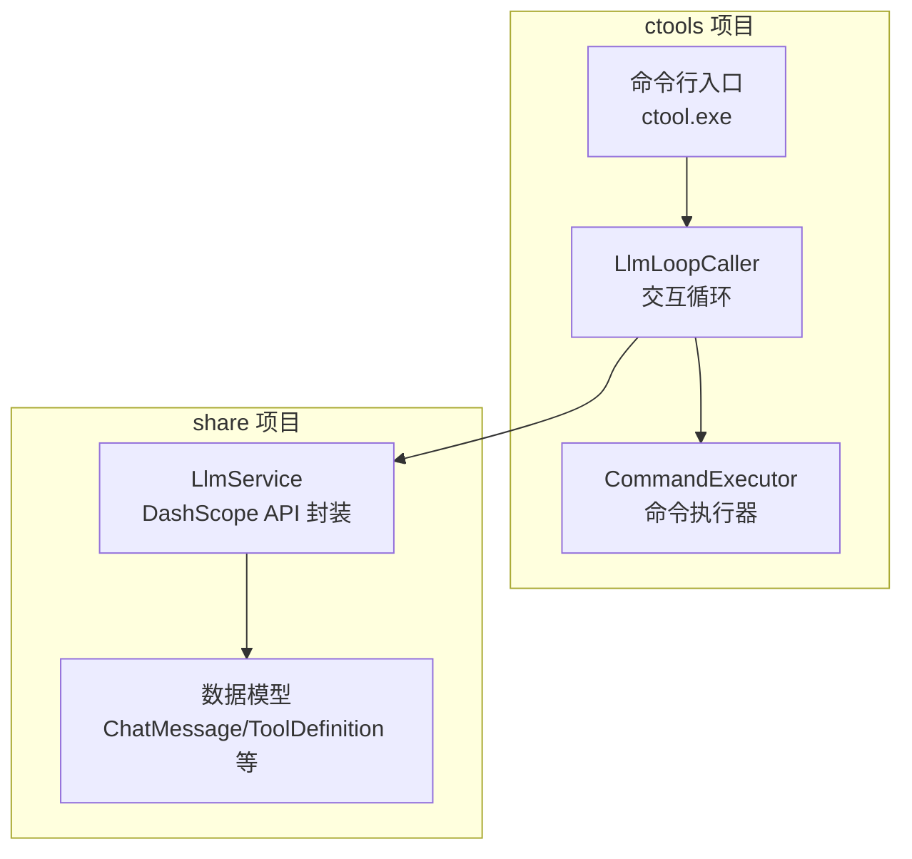
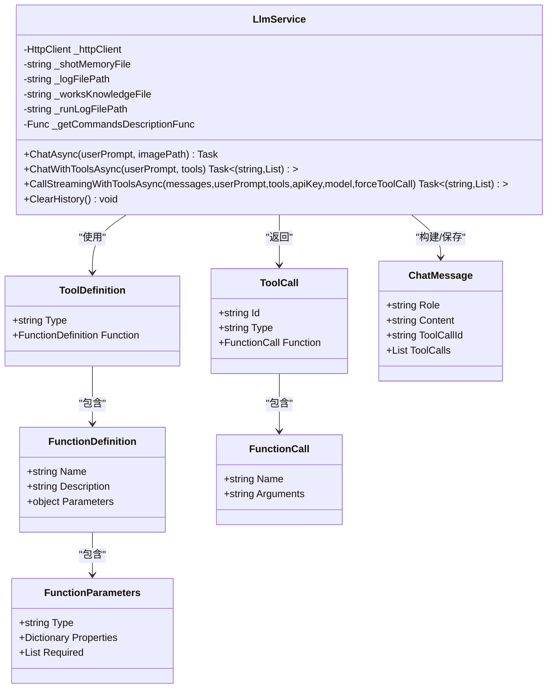
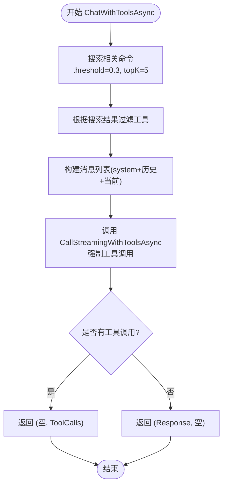
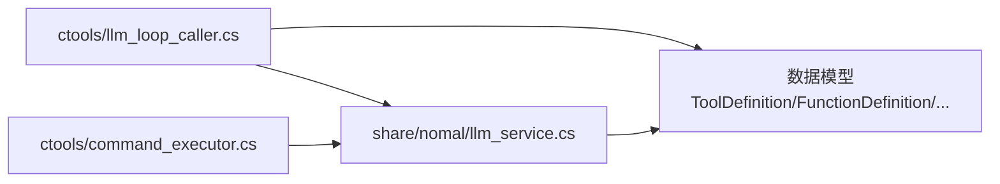

# LLM 服务集成

<cite>
**本文档引用的文件**
- [llm_service.cs](file://share/nomal/llm_service.cs)
- [llm_loop_caller.cs](file://ctools/llm_loop_caller.cs)
- [command_executor.cs](file://ctools/command_executor.cs)
- [ctool.csproj](file://ctools/ctool.csproj)
- [share.csproj](file://share/share.csproj)
</cite>

## 目录
1. [简介](#简介)
2. [项目结构](#项目结构)
3. [核心组件](#核心组件)
4. [架构总览](#架构总览)
5. [详细组件分析](#详细组件分析)
6. [依赖关系分析](#依赖关系分析)
7. [性能考虑](#性能考虑)
8. [故障排除指南](#故障排除指南)
9. [结论](#结论)
10. [附录](#附录)

## 简介
本文件面向需要在 SolidWorks 环境中集成 DashScope 通义千问 API 的开发者，系统性阐述 LLM 服务的初始化、配置、请求构建、响应处理、工具调用模式（Function Calling）、消息传递协议、连接管理与错误处理策略。文档同时提供 ChatWithToolsAsync 方法的工作原理详解、API 配置选项、超时设置与重试机制说明，并给出实际调用示例与常见问题解决方案及性能优化建议。

## 项目结构
该项目采用分层设计：
- share 项目：通用能力封装，包含 LLM 服务、数据模型与工具定义等。
- ctools 项目：SolidWorks 插件入口与交互逻辑，负责命令解析、工具构建与执行。



图表来源
- [ctool.csproj:1-55](file://ctools/ctool.csproj#L1-L55)
- [share.csproj:1-40](file://share/share.csproj#L1-L40)

章节来源
- [ctool.csproj:1-55](file://ctools/ctool.csproj#L1-L55)
- [share.csproj:1-40](file://share/share.csproj#L1-L40)

## 核心组件
- LlmService：DashScope 通义千问 API 的统一封装，支持文本对话、图像分析（VLM）与工具调用（Function Calling）。内置短期/长期记忆、工作知识注入、运行日志读取与 API Key 获取。
- LlmLoopCaller：交互式循环调用器，负责将用户输入转换为工具定义，调用 LlmService 的 ChatWithToolsAsync 并驱动 CommandExecutor 执行命令。
- CommandExecutor：命令解析与执行器，对接 SolidWorks，负责参数解析、模型上下文获取与命令异步执行。

章节来源
- [llm_service.cs:18-1282](file://share/nomal/llm_service.cs#L18-L1282)
- [llm_loop_caller.cs:19-116](file://ctools/llm_loop_caller.cs#L19-L116)
- [command_executor.cs:12-116](file://ctools/command_executor.cs#L12-L116)

## 架构总览
整体调用链路如下：
- 用户输入通过 LlmLoopCaller 进入交互循环。
- LlmLoopCaller 构建工具定义列表，调用 LlmService.ChatWithToolsAsync。
- LlmService 根据搜索结果过滤工具，构建消息列表与请求体，调用 DashScope API。
- API 返回工具调用请求或文本回复；若为工具调用，LlmLoopCaller 调用 CommandExecutor 执行命令并回传结果至 LlmService，形成多轮对话。

```mermaid
sequenceDiagram
participant U as "用户"
participant Loop as "LlmLoopCaller"
participant Svc as "LlmService"
participant API as "DashScope API"
participant Exec as "CommandExecutor"
U->>Loop : 输入自然语言/命令
Loop->>Loop : 构建工具定义列表
Loop->>Svc : ChatWithToolsAsync(用户输入, 工具列表)
Svc->>Svc : 过滤工具(基于搜索结果)
Svc->>API : POST /compatible-mode/v1/chat/completions
API-->>Svc : 返回工具调用/文本回复
alt 工具调用
Svc-->>Loop : ToolCalls
Loop->>Exec : ExecuteCommandAsync(命令+参数)
Exec-->>Loop : 执行结果
Loop->>Svc : 回传工具执行结果(短期记忆)
Svc-->>Loop : 继续对话直至完成
else 文本回复
Svc-->>Loop : 文本回复
Loop-->>U : 输出回复
end
```

图表来源
- [llm_loop_caller.cs:493-726](file://ctools/llm_loop_caller.cs#L493-L726)
- [llm_service.cs:547-614](file://share/nomal/llm_service.cs#L547-L614)
- [llm_service.cs:988-1144](file://share/nomal/llm_service.cs#L988-L1144)

## 详细组件分析

### LlmService：DashScope API 集成
- API 配置
  - 默认模型：qwen3.5-flash
  - 请求地址：https://dashscope.aliyuncs.com/compatible-mode/v1/chat/completions
  - 超时：HttpClient.Timeout = 5 分钟
  - API Key：优先从环境变量 DASHSCOPE_API_KEY 读取，不存在时交互式提示输入
- 请求构建
  - 文本对话：messages 数组，role/content 结构
  - VLM 图像分析：messages 数组中 user 消息包含 text 与 image_url 两部分
  - 工具调用：在请求体中附加 tools 数组与 tool_choice（可选 required）
- 响应处理
  - 流式文本：SSE 格式解析，逐块拼接
  - 工具调用：解析 choices[0].message.tool_calls
  - 错误处理：非 2xx 状态码读取错误体并抛出异常
- 记忆与日志
  - 短期记忆：shot_memory.json，最多保留最近 10 条（5 轮对话），过滤非法 role
  - 长期记忆：longterm_memory.txt，追加时间戳内容
  - 工作知识：works_knowledge.txt 注入到 system prompt
  - 运行日志：run_log.txt 从文件末尾读取最近 N 字符用于上下文增强
- 关键方法
  - ChatAsync：文本/VLM 对话入口
  - ChatWithToolsAsync：工具调用入口，强制工具调用模式
  - CallStreamingWithToolsAsync：构建工具调用请求并解析响应
  - CallStreamingCoreAsync：SSE 流式响应解析核心



图表来源
- [llm_service.cs:1186-1282](file://share/nomal/llm_service.cs#L1186-L1282)

章节来源
- [llm_service.cs:20-53](file://share/nomal/llm_service.cs#L20-L53)
- [llm_service.cs:461-480](file://share/nomal/llm_service.cs#L461-L480)
- [llm_service.cs:485-542](file://share/nomal/llm_service.cs#L485-L542)
- [llm_service.cs:547-614](file://share/nomal/llm_service.cs#L547-L614)
- [llm_service.cs:909-983](file://share/nomal/llm_service.cs#L909-L983)
- [llm_service.cs:988-1144](file://share/nomal/llm_service.cs#L988-L1144)
- [llm_service.cs:1149-1180](file://share/nomal/llm_service.cs#L1149-L1180)

### ChatWithToolsAsync 方法工作原理
- 输入：用户自然语言 + 已构建的工具定义列表
- 过程：
  - 使用 SearchCommands 基于关键词阈值与 topK 过滤工具
  - 构建 system prompt（包含角色设定与工作知识片段）
  - 组装消息列表（历史 + system + 当前对话）
  - 调用 CallStreamingWithToolsAsync，强制工具调用（tool_choice: required）
  - 解析响应：若返回 tool_calls 则交由 LlmLoopCaller 执行；否则返回文本回复
- 输出：(文本回复, 工具调用列表) 或 (空, 工具调用列表)



图表来源
- [llm_service.cs:547-614](file://share/nomal/llm_service.cs#L547-L614)
- [llm_service.cs:619-701](file://share/nomal/llm_service.cs#L619-L701)
- [llm_service.cs:988-1144](file://share/nomal/llm_service.cs#L988-L1144)

章节来源
- [llm_service.cs:547-614](file://share/nomal/llm_service.cs#L547-L614)
- [llm_service.cs:619-701](file://share/nomal/llm_service.cs#L619-L701)

### LlmLoopCaller：工具调用模式与消息传递协议
- 工具定义构建：遍历 CommandRegistry，为每个命令与别名生成 ToolDefinition，函数名为 execute_xxx
- 工具调用执行：解析 ToolCall.Function.Arguments，构造完整命令字符串，调用 CommandExecutor.ExecuteCommandAsync
- 确认模式：支持 y/n/auto 三种确认方式，auto 模式下自动执行
- 消息传递协议：
  - 工具调用结果以 user 角色消息写入短期记忆，便于 LLM 二次推理
  - 上次执行命令持久化到 last_command.txt，支持 last 命令重复执行
  - 命令执行产生的 Console 输出被捕获并回传给 LLM

```mermaid
sequenceDiagram
participant Loop as "LlmLoopCaller"
participant Svc as "LlmService"
participant Exec as "CommandExecutor"
Loop->>Svc : ChatWithToolsAsync(用户输入, 工具列表)
Svc-->>Loop : (空, ToolCalls)
loop 遍历 ToolCalls
Loop->>Loop : 解析函数名与参数
Loop->>Exec : ExecuteCommandAsync(命令+参数)
Exec-->>Loop : 执行结果 + Console 输出
Loop->>Svc : 保存工具执行结果到短期记忆
end
Svc-->>Loop : 继续对话直至完成
```

图表来源
- [llm_loop_caller.cs:177-288](file://ctools/llm_loop_caller.cs#L177-L288)
- [llm_loop_caller.cs:666-726](file://ctools/llm_loop_caller.cs#L666-L726)
- [llm_loop_caller.cs:729-777](file://ctools/llm_loop_caller.cs#L729-L777)

章节来源
- [llm_loop_caller.cs:117-172](file://ctools/llm_loop_caller.cs#L117-L172)
- [llm_loop_caller.cs:177-288](file://ctools/llm_loop_caller.cs#L177-L288)
- [llm_loop_caller.cs:729-777](file://ctools/llm_loop_caller.cs#L729-L777)

### CommandExecutor：SolidWorks 命令执行
- 参数解析：按空格拆分命令名与参数数组
- 连接检查：确保 SolidWorks 应用实例存在
- 模型上下文：每次执行前获取当前激活文档
- 异步执行：调用 CommandInfo.AsyncAction(args)，等待完成
- 错误处理：捕获异常并返回友好提示

章节来源
- [command_executor.cs:32-116](file://ctools/command_executor.cs#L32-L116)

## 依赖关系分析
- 项目依赖
  - ctools 依赖 share（LlmService、数据模型）
  - share 引用 System.Net.Http、Newtonsoft.Json、SQLite
  - ctools 引用 SolidWorks Interop 与 AutoCAD Interop
- 数据模型依赖
  - LlmService 定义 ToolDefinition/FunctionDefinition/FunctionParameters/ToolCall/FunctionCall/ChatMessage
  - LlmLoopCaller 与 CommandExecutor 通过这些模型进行序列化/反序列化与消息传递



图表来源
- [ctool.csproj:25-26](file://ctools/ctool.csproj#L25-L26)
- [share.csproj:27-30](file://share/share.csproj#L27-L30)

章节来源
- [ctool.csproj:25-26](file://ctools/ctool.csproj#L25-L26)
- [share.csproj:27-30](file://share/share.csproj#L27-L30)

## 性能考虑
- 流式响应：SSE 流式读取，边到边输出，降低首字延迟
- 工具过滤：基于关键词阈值与 topK 限制工具数量，减少上下文开销
- 记忆截断：短期记忆最多保留 10 条，避免上下文膨胀
- 超时设置：HttpClient 默认 5 分钟，适合长对话与大模型推理
- I/O 优化：VLM 图像读取使用异步 FileStream + MemoryStream，避免阻塞
- 日志与知识注入：仅在必要时读取文件，避免频繁磁盘访问

## 故障排除指南
- API Key 为空
  - 现象：抛出参数异常
  - 处理：设置环境变量 DASHSCOPE_API_KEY 或交互式输入
- 请求超时/取消
  - 现象：TaskCanceledException，内因为 TimeoutException
  - 处理：检查网络连通性与代理设置；适当增加 HttpClient.Timeout
- 非 2xx 响应
  - 现象：读取错误体并抛出 HttpRequestException
  - 处理：检查模型名、工具定义格式、API 配额与权限
- 工具调用未返回
  - 现象：强制工具调用模式下返回文本而非工具调用
  - 处理：调整 system prompt 与工具描述，提高模型调用意愿
- 记忆文件损坏
  - 现象：JSON 反序列化失败或非法 role 被过滤
  - 处理：删除 shot_memory.json 重建短期记忆；检查文件编码为 UTF-8

章节来源
- [llm_service.cs:461-480](file://share/nomal/llm_service.cs#L461-L480)
- [llm_service.cs:770-790](file://share/nomal/llm_service.cs#L770-L790)
- [llm_service.cs:798-813](file://share/nomal/llm_service.cs#L798-L813)
- [llm_service.cs:1135-1141](file://share/nomal/llm_service.cs#L1135-L1141)
- [llm_service.cs:58-114](file://share/nomal/llm_service.cs#L58-L114)

## 结论
该实现以 LlmService 为核心，结合 LlmLoopCaller 的工具调用模式与 CommandExecutor 的 SolidWorks 命令执行，形成了从自然语言到自动化操作的闭环。通过短期/长期记忆、工作知识注入与运行日志增强，系统具备良好的上下文理解与持续学习能力。建议在生产环境中进一步完善重试与熔断策略、监控与日志采集，以及针对不同模型的参数适配。

## 附录

### API 配置选项与超时设置
- API 地址：https://dashscope.aliyuncs.com/compatible-mode/v1/chat/completions
- 默认模型：qwen3.5-flash
- 超时：HttpClient.Timeout = 5 分钟
- 请求头：Authorization: Bearer {API Key}

章节来源
- [llm_service.cs:21-37](file://share/nomal/llm_service.cs#L21-L37)
- [llm_service.cs:724-725](file://share/nomal/llm_service.cs#L724-L725)

### 重试机制说明
- 当前实现未内置自动重试逻辑；建议在网络异常或 5xx 响应时进行指数退避重试，并记录重试次数与原因。

### 实际调用示例（步骤说明）
- 步骤 1：准备工具定义
  - 通过 LlmLoopCaller.BuildToolDefinitions 从 CommandRegistry 生成工具列表
- 步骤 2：调用 ChatWithToolsAsync
  - 传入用户输入与工具列表，得到 (response, toolCalls)
- 步骤 3：执行工具调用
  - 若 toolCalls 非空，遍历调用 LlmLoopCaller.ExecuteToolCallAsync
- 步骤 4：回传执行结果
  - 将工具执行结果以 user 角色消息写入短期记忆，继续对话

章节来源
- [llm_loop_caller.cs:117-172](file://ctools/llm_loop_caller.cs#L117-L172)
- [llm_loop_caller.cs:666-726](file://ctools/llm_loop_caller.cs#L666-L726)
- [llm_loop_caller.cs:729-777](file://ctools/llm_loop_caller.cs#L729-L777)