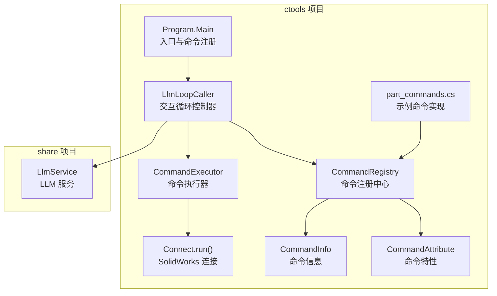
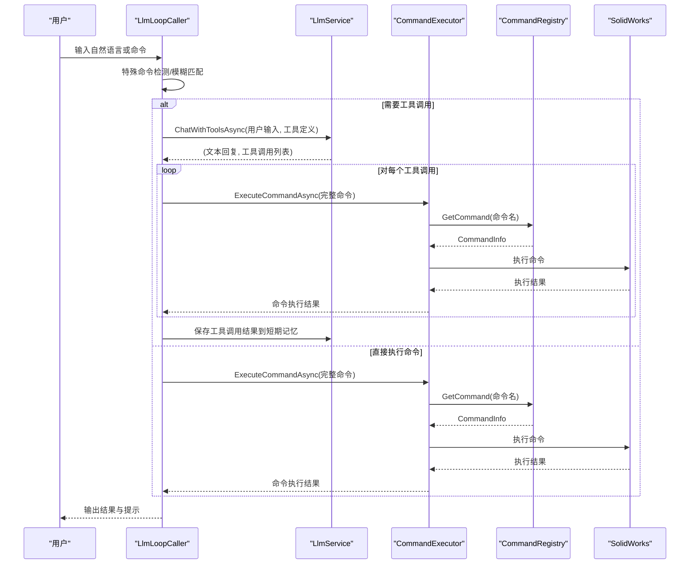
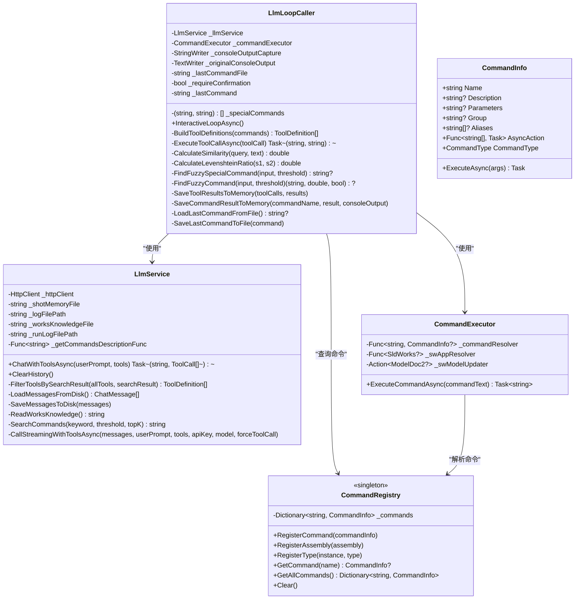
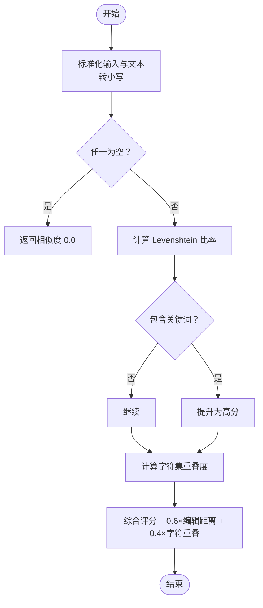
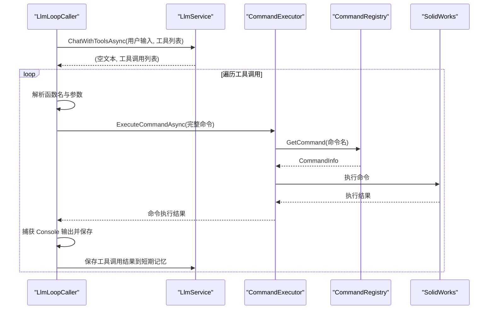
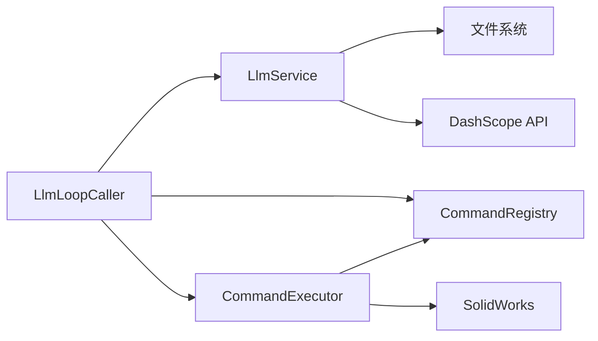

# 对话循环控制器

<cite>
**本文档引用的文件**
- [llm_loop_caller.cs](file://ctools/llm_loop_caller.cs)
- [main.cs](file://ctools/main.cs)
- [llm_service.cs](file://share/nomal/llm_service.cs)
- [command_executor.cs](file://ctools/command_executor.cs)
- [CommandRegistry.cs](file://ctools/CommandRegistry.cs)
- [CommandInfo.cs](file://ctools/CommandInfo.cs)
- [CommandAttribute.cs](file://ctools/CommandAttribute.cs)
- [part_commands.cs](file://ctools/solidworks_commands/part_commands.cs)
- [connect.cs](file://ctools/connect.cs)
</cite>

## 目录
1. [简介](#简介)
2. [项目结构](#项目结构)
3. [核心组件](#核心组件)
4. [架构总览](#架构总览)
5. [详细组件分析](#详细组件分析)
6. [依赖关系分析](#依赖关系分析)
7. [性能考虑](#性能考虑)
8. [故障排除指南](#故障排除指南)
9. [结论](#结论)
10. [附录](#附录)

## 简介
本文件面向“对话循环控制器”的综合技术文档，重点围绕 LlmLoopCaller 类的设计架构与核心功能实现，涵盖以下主题：
- 交互式循环模式的管理与用户输入处理
- 对话状态跟踪与历史记录管理
- 工具调用模式（Tool 调用）的定义、解析与执行流程
- 特殊命令系统（quit、exit、clear、mode、history、last）的实现与使用
- 模糊匹配算法（Levenshtein 距离与字符集重叠度）的实现细节
- 命令确认机制、自动模式切换与历史记录管理
- 完整使用示例与故障排除指南

## 项目结构
该项目采用模块化设计，核心入口位于 ctools 项目，通过命令注册中心统一管理命令，LLM 服务负责与大模型通信，命令执行器负责在 SolidWorks 环境中执行具体操作。

图表来源
- [main.cs:54-109](file://ctools/main.cs#L54-L109)
- [llm_loop_caller.cs:44-67](file://ctools/llm_loop_caller.cs#L44-L67)
- [command_executor.cs:18-26](file://ctools/command_executor.cs#L18-L26)
- [CommandRegistry.cs:14-27](file://ctools/CommandRegistry.cs#L14-L27)
- [CommandAttribute.cs:5-18](file://ctools/CommandAttribute.cs#L5-L18)
- [CommandInfo.cs:17-39](file://ctools/CommandInfo.cs#L17-L39)
- [part_commands.cs:11-149](file://ctools/solidworks_commands/part_commands.cs#L11-L149)
- [connect.cs:11-51](file://ctools/connect.cs#L11-L51)

章节来源
- [main.cs:54-109](file://ctools/main.cs#L54-L109)
- [llm_loop_caller.cs:44-67](file://ctools/llm_loop_caller.cs#L44-L67)

## 核心组件
- LlmLoopCaller：交互式循环控制器，负责用户输入处理、特殊命令解析、模糊匹配、工具调用模式与对话状态管理。
- LlmService：封装 DashScope API 的 LLM 服务，支持普通对话与工具调用模式，维护短期与长期记忆。
- CommandExecutor：命令执行器，负责解析命令文本、定位命令信息、连接 SolidWorks 并执行命令。
- CommandRegistry：全局命令注册中心，单例模式，支持从程序集批量注册命令及别名映射。
- CommandInfo/CommandAttribute：命令元数据与特性，描述命令名称、描述、参数、分组、别名与执行动作。
- 示例命令：如导出、获取厚度、打开文档等，通过 CommandAttribute 标注并通过注册中心集中管理。

章节来源
- [llm_loop_caller.cs:19-67](file://ctools/llm_loop_caller.cs#L19-L67)
- [llm_service.cs:18-53](file://share/nomal/llm_service.cs#L18-L53)
- [command_executor.cs:12-26](file://ctools/command_executor.cs#L12-L26)
- [CommandRegistry.cs:12-27](file://ctools/CommandRegistry.cs#L12-L27)
- [CommandInfo.cs:17-39](file://ctools/CommandInfo.cs#L17-L39)
- [CommandAttribute.cs:5-18](file://ctools/CommandAttribute.cs#L5-L18)

## 架构总览
LlmLoopCaller 作为交互式循环的核心，串联以下流程：
- 用户输入 → 特殊命令检测 → 模糊匹配 → 工具调用模式（ChatWithToolsAsync）→ 执行工具调用 → 结果反馈与历史记录保存
- 命令执行器负责在 SolidWorks 环境中执行具体命令，支持同步与异步命令类型

图表来源
- [llm_loop_caller.cs:493-726](file://ctools/llm_loop_caller.cs#L493-L726)
- [llm_service.cs:547-614](file://share/nomal/llm_service.cs#L547-L614)
- [command_executor.cs:32-113](file://ctools/command_executor.cs#L32-L113)
- [CommandRegistry.cs:113-131](file://ctools/CommandRegistry.cs#L113-L131)

## 详细组件分析

### LlmLoopCaller 类设计与实现
- 交互式循环模式管理
  - 提供 InteractiveLoopAsync 方法，持续读取用户输入，支持 quit/exit 退出、clear 清空历史、mode 切换确认/自动模式、history 查看历史、last 重复上一次命令、llm 进入纯对话模式。
  - 在循环中优先处理特殊命令，其次进行模糊匹配，最后通过 LLM 的工具调用模式识别并执行命令。
- 对话状态跟踪与历史记录
  - 通过 LlmService 的短期记忆文件管理对话历史，限制最多 10 条消息，自动截断保留最近消息。
  - 保存工具调用结果到短期记忆，作为后续对话的上下文。
  - 保存上一次执行的命令到 llm/last_command.txt，支持 last 命令重复执行。
- 工具调用模式
  - BuildToolDefinitions：从 CommandRegistry 获取所有命令，构建 ToolDefinition 列表，主命令名与别名均生成对应的工具定义。
  - ExecuteToolCallAsync：解析工具调用函数名与参数，拦截 Console 输出，支持用户确认（y/n/auto），执行后恢复输出并保存结果。
  - SaveToolResultsToMemory：将工具调用结果（含 Console 输出）保存为 user 角色消息，增强 LLM 的上下文理解。
- 用户输入处理与模糊匹配
  - FindFuzzyCommand：先尝试“命令名 + 参数”完全匹配；若未命中，进行基于名称、别名与描述的模糊匹配，结合 Levenshtein 距离与字符集重叠度综合评分。
  - FindFuzzySpecialCommand：对特殊命令进行模糊匹配，避免误判。
  - CalculateSimilarity/CalculateLevenshteinRatio：实现 Levenshtein 距离比率与字符集重叠度评估，阈值可调。
- 命令确认机制与自动模式切换
  - _requireConfirmation 控制是否需要用户确认；输入 mode 切换模式；输入 auto 可在确认阶段切换为自动模式。
  - last 命令支持二次确认，防止误执行。

图表来源
- [llm_loop_caller.cs:19-172](file://ctools/llm_loop_caller.cs#L19-L172)
- [llm_service.cs:18-1283](file://share/nomal/llm_service.cs#L18-L1283)
- [command_executor.cs:12-116](file://ctools/command_executor.cs#L12-L116)
- [CommandRegistry.cs:12-242](file://ctools/CommandRegistry.cs#L12-L242)
- [CommandInfo.cs:17-41](file://ctools/CommandInfo.cs#L17-L41)

章节来源
- [llm_loop_caller.cs:493-726](file://ctools/llm_loop_caller.cs#L493-L726)
- [llm_loop_caller.cs:117-172](file://ctools/llm_loop_caller.cs#L117-L172)
- [llm_loop_caller.cs:177-288](file://ctools/llm_loop_caller.cs#L177-L288)
- [llm_loop_caller.cs:294-355](file://ctools/llm_loop_caller.cs#L294-L355)
- [llm_loop_caller.cs:388-488](file://ctools/llm_loop_caller.cs#L388-L488)

### 特殊命令系统实现与使用
- 特殊命令列表：quit/exit（退出）、clear（清空历史）、mode（切换确认/自动模式）、history（查看历史）、last（重复上一次命令）、llm（进入纯对话模式）。
- 实现要点：
  - 在循环开始时打印帮助信息。
  - 输入处理阶段优先判断特殊命令，再进行模糊匹配与工具调用。
  - mode 切换 _requireConfirmation；clear 调用 LlmService.ClearHistory；last 读取 llm/last_command.txt 并二次确认执行。
- 使用方法：
  - 直接输入命令名或自然语言描述需求。
  - 输入 clear/history/last/quit/exit/mode/llm 进行相应操作。
  - 在工具调用前可输入 auto 进入自动模式，跳过每次确认。

章节来源
- [llm_loop_caller.cs:34-42](file://ctools/llm_loop_caller.cs#L34-L42)
- [llm_loop_caller.cs:521-578](file://ctools/llm_loop_caller.cs#L521-L578)
- [llm_loop_caller.cs:541-545](file://ctools/llm_loop_caller.cs#L541-L545)
- [llm_loop_caller.cs:534-539](file://ctools/llm_loop_caller.cs#L534-L539)
- [llm_loop_caller.cs:574-578](file://ctools/llm_loop_caller.cs#L574-L578)

### 模糊匹配算法实现细节
- 综合评分公式：0.6 × Levenshtein 比率 + 0.4 × 字符集重叠度
- Levenshtein 距离计算：使用动态规划矩阵，时间复杂度 O(nm)，空间复杂度 O(nm)
- 字符集重叠度：计算 query 与 text 的字符集合交集除以较大集合的大小
- 匹配策略：
  - 先尝试“命令名 + 参数”的完全匹配，命中即直接执行。
  - 若未命中，对命令名、别名与描述分别计算相似度，取最大值作为最终得分。
  - 支持阈值过滤，默认 0.5（命令）与 0.6（特殊命令）。

图表来源
- [llm_loop_caller.cs:294-319](file://ctools/llm_loop_caller.cs#L294-L319)
- [llm_loop_caller.cs:324-355](file://ctools/llm_loop_caller.cs#L324-L355)

章节来源
- [llm_loop_caller.cs:294-355](file://ctools/llm_loop_caller.cs#L294-L355)
- [llm_loop_caller.cs:388-488](file://ctools/llm_loop_caller.cs#L388-L488)

### 命令确认机制与自动模式切换
- 确认流程：当工具调用被触发时，若处于确认模式，会提示 y/n/auto；输入 auto 将切换为自动模式，后续命令无需确认。
- 模式切换：输入 mode 切换 _requireConfirmation 状态，并输出当前模式。
- last 命令：读取上次执行命令，二次确认后执行；若无上次命令，提示“还没有执行过任何命令”。

章节来源
- [llm_loop_caller.cs:218-240](file://ctools/llm_loop_caller.cs#L218-L240)
- [llm_loop_caller.cs:534-539](file://ctools/llm_loop_caller.cs#L534-L539)
- [llm_loop_caller.cs:547-572](file://ctools/llm_loop_caller.cs#L547-L572)

### 历史记录管理
- 短期记忆：保存为 llm/shot_memory.json，最多 10 条消息，自动截断最近 10 条。
- 长期记忆：保存为 llm/longterm_memory.txt，追加模式记录 LLM 回复与工具调用摘要。
- 历史查看：history 命令触发查看（由 LlmLoopCaller 调用 LlmService 查看历史）。
- 清空历史：clear 命令调用 LlmService.ClearHistory 删除短期记忆文件。

章节来源
- [llm_service.cs:58-114](file://share/nomal/llm_service.cs#L58-L114)
- [llm_service.cs:1166-1180](file://share/nomal/llm_service.cs#L1166-L1180)
- [llm_loop_caller.cs:529](file://ctools/llm_loop_caller.cs#L529)

### 工具调用模式工作流程
- 工具定义构建：遍历所有命令，为主命令名与别名生成 ToolDefinition，参数定义为单个字符串参数“argument”。
- LLM 调用：调用 ChatWithToolsAsync，传入用户输入与工具列表，强制要求工具调用（tool_choice: required）。
- 工具调用解析与执行：遍历工具调用列表，解析函数名与参数，去除“execute_”前缀，构造完整命令，交由 CommandExecutor 执行。
- 结果处理：捕获 Console 输出，保存到短期记忆，记录最后执行命令。

图表来源
- [llm_loop_caller.cs:177-288](file://ctools/llm_loop_caller.cs#L177-L288)
- [llm_service.cs:547-614](file://share/nomal/llm_service.cs#L547-L614)
- [command_executor.cs:32-113](file://ctools/command_executor.cs#L32-L113)

章节来源
- [llm_loop_caller.cs:117-172](file://ctools/llm_loop_caller.cs#L117-L172)
- [llm_loop_caller.cs:177-288](file://ctools/llm_loop_caller.cs#L177-L288)
- [llm_service.cs:988-1144](file://share/nomal/llm_service.cs#L988-L1144)

### 示例命令与命令注册
- 示例命令：导出、获取厚度、打开文档、关闭文档、获取当前文档名等，通过 CommandAttribute 标注，包含名称、描述、参数、分组与别名。
- 注册流程：Program.Main 中注册命令，CommandRegistry 从程序集扫描并注册，支持别名映射。
- 执行流程：CommandExecutor 根据命令名获取 CommandInfo，连接 SolidWorks 并执行对应方法。

章节来源
- [part_commands.cs:11-149](file://ctools/solidworks_commands/part_commands.cs#L11-L149)
- [main.cs:170-253](file://ctools/main.cs#L170-L253)
- [CommandRegistry.cs:61-83](file://ctools/CommandRegistry.cs#L61-L83)
- [command_executor.cs:54-101](file://ctools/command_executor.cs#L54-L101)

## 依赖关系分析
- LlmLoopCaller 依赖 LlmService（工具调用与历史管理）、CommandExecutor（命令执行）、CommandRegistry（命令解析）。
- LlmService 依赖 HttpClient、文件系统（短期/长期记忆）、DashScope API。
- CommandExecutor 依赖 CommandRegistry、SolidWorks COM 接口。
- CommandRegistry 依赖反射扫描与线程安全锁。

图表来源
- [llm_loop_caller.cs:44-67](file://ctools/llm_loop_caller.cs#L44-L67)
- [llm_service.cs:32-53](file://share/nomal/llm_service.cs#L32-L53)
- [command_executor.cs:18-26](file://ctools/command_executor.cs#L18-L26)
- [CommandRegistry.cs:14-27](file://ctools/CommandRegistry.cs#L14-L27)

章节来源
- [llm_loop_caller.cs:44-67](file://ctools/llm_loop_caller.cs#L44-L67)
- [llm_service.cs:32-53](file://share/nomal/llm_service.cs#L32-L53)
- [command_executor.cs:18-26](file://ctools/command_executor.cs#L18-L26)
- [CommandRegistry.cs:14-27](file://ctools/CommandRegistry.cs#L14-L27)

## 性能考虑
- 模糊匹配：Levenshtein 距离计算为 O(nm)，在命令量较大时建议：
  - 限制搜索范围（如仅对候选命令集计算相似度）
  - 使用缓存存储常用命令的相似度结果
  - 调整阈值以减少无效匹配
- 工具调用：批量工具调用时串行执行，建议：
  - 对独立命令进行并发执行（注意 SolidWorks 线程安全）
  - 合理设置 Console 输出捕获与恢复，避免阻塞
- LLM 调用：流式响应已实现，建议：
  - 控制工具数量，避免请求体过大
  - 适当截断历史消息，保持上下文简洁
- 文件 I/O：短期记忆文件读写频繁，建议：
  - 批量写入或延迟写入
  - 使用异步文件操作减少阻塞

## 故障排除指南
- API Key 问题
  - 现象：调用 LLM 失败，提示未找到 DASHSCOPE_API_KEY
  - 处理：设置环境变量 DASHSCOPE_API_KEY，或在运行时输入临时 API Key
- SolidWorks 连接失败
  - 现象：CommandExecutor 报告未连接到 SolidWorks
  - 处理：确保 SolidWorks 已启动；检查 Connect.run() 返回值；确认 COM 组件可用
- 命令不存在
  - 现象：执行命令时报“未找到命令”
  - 处理：确认命令已通过 CommandAttribute 标注并注册到 CommandRegistry；检查命令名与别名
- 工具调用未触发
  - 现象：用户意图明确但未触发工具调用
  - 处理：检查 LLM 的 system prompt 与工具定义；适当提高相似度阈值或调整自然语言描述
- 历史记录异常
  - 现象：历史文件损坏或角色非法
  - 处理：调用 ClearHistory 清空短期记忆；检查消息角色合法性
- Console 输出异常
  - 现象：命令执行时输出丢失或乱码
  - 处理：确认 Console 输出重定向与恢复逻辑；检查编码设置（UTF-8）

章节来源
- [llm_service.cs:461-480](file://share/nomal/llm_service.cs#L461-L480)
- [command_executor.cs:61-66](file://ctools/command_executor.cs#L61-L66)
- [llm_service.cs:792-813](file://share/nomal/llm_service.cs#L792-L813)
- [llm_service.cs:58-87](file://share/nomal/llm_service.cs#L58-L87)

## 结论
LlmLoopCaller 通过“特殊命令 + 模糊匹配 + 工具调用模式”的组合，实现了对自然语言与命令的智能识别与执行。其设计强调：
- 可扩展的命令体系（CommandRegistry + CommandAttribute）
- 可靠的对话状态管理（短期/长期记忆）
- 灵活的交互模式（确认/自动、历史查看、重复执行）
- 高效的模糊匹配与工具调用解析
在实际使用中，建议合理设置阈值、控制工具数量、优化历史记录与输出捕获，以获得更佳的用户体验与稳定性。

## 附录
- 使用示例
  - 启动交互式循环：ctool.exe
  - 直接执行命令：exportdxf
  - 自然语言描述：导出当前零件为 DWG
  - 特殊命令：clear、history、mode、last、quit/exit、llm
- 常见问题
  - 如何添加新命令：通过 CommandAttribute 标注方法并注册到 CommandRegistry
  - 如何修改工具定义：调整 BuildToolDefinitions 的参数定义与描述
  - 如何优化性能：降低命令数量、缓存相似度、批量写入历史