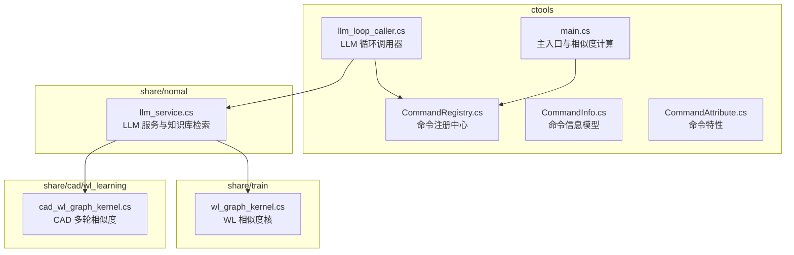
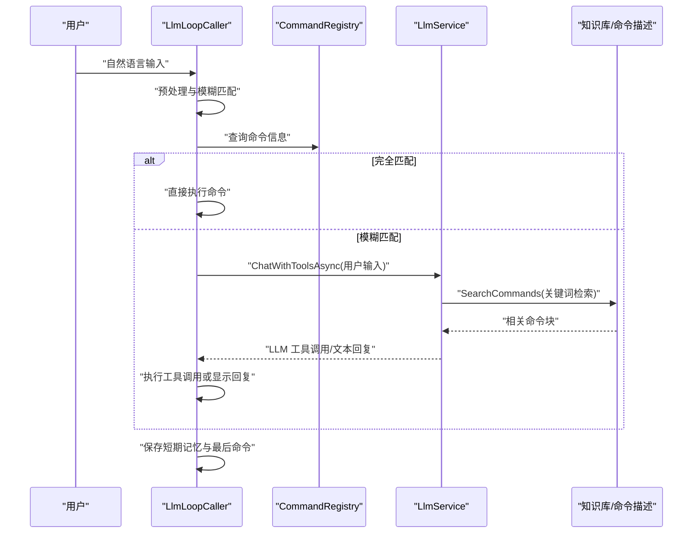
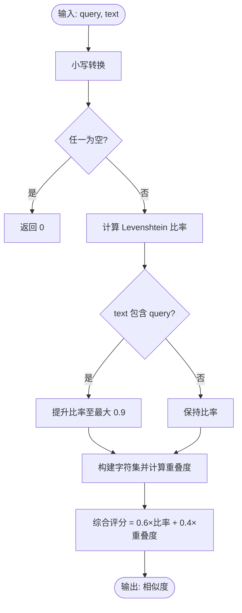
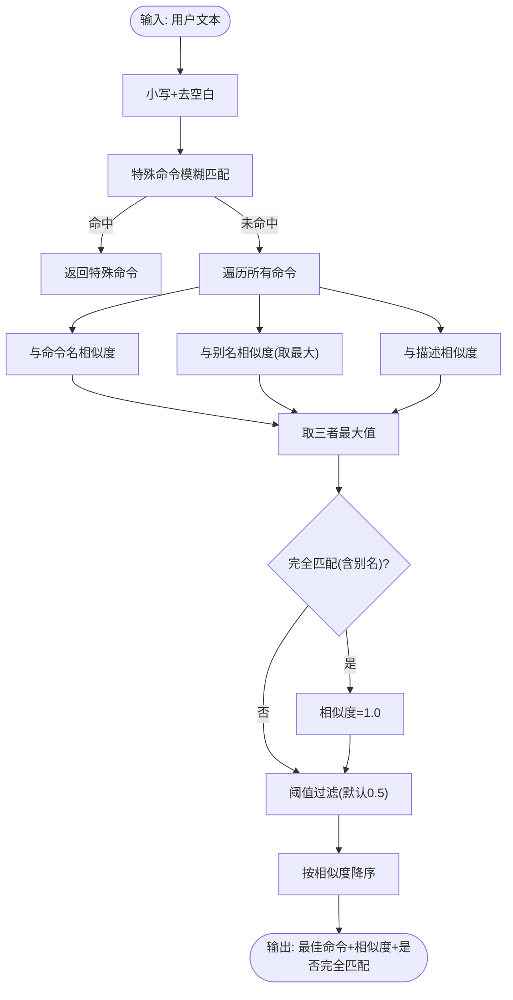
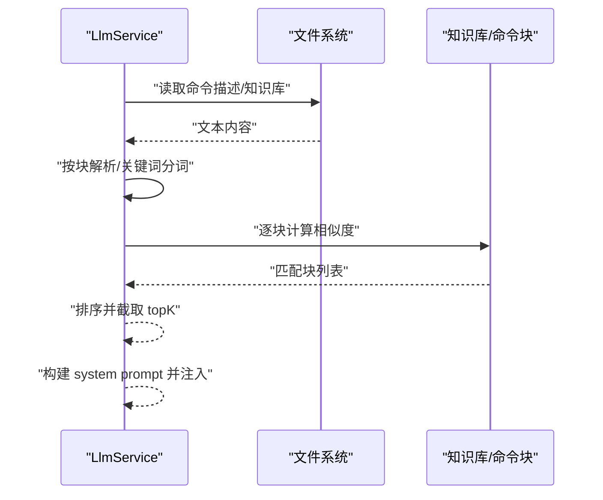
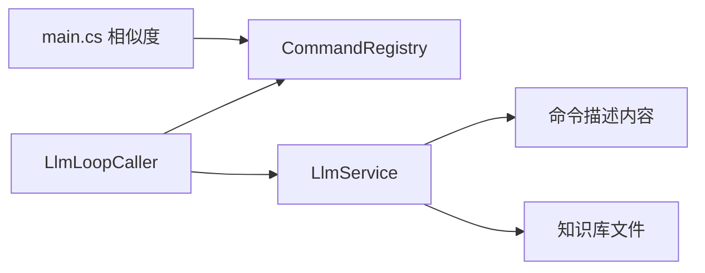

# 自然语言处理

<cite>
**本文引用的文件**
- [llm_loop_caller.cs](file://ctools/llm_loop_caller.cs)
- [llm_service.cs](file://share/nomal/llm_service.cs)
- [CommandRegistry.cs](file://ctools/CommandRegistry.cs)
- [CommandInfo.cs](file://ctools/CommandInfo.cs)
- [CommandAttribute.cs](file://ctools/CommandAttribute.cs)
- [main.cs](file://ctools/main.cs)
- [cad_wl_graph_kernel.cs](file://share/cad/wl_learning/cad_wl_graph_kernel.cs)
- [wl_graph_kernel.cs](file://share/train/wl_graph_kernel.cs)
</cite>

## 目录
1. [简介](#简介)
2. [项目结构](#项目结构)
3. [核心组件](#核心组件)
4. [架构总览](#架构总览)
5. [详细组件分析](#详细组件分析)
6. [依赖关系分析](#依赖关系分析)
7. [性能考量](#性能考量)
8. [故障排查指南](#故障排查指南)
9. [结论](#结论)
10. [附录](#附录)

## 简介
本文件面向自然语言处理（NLP）模块的技术文档，聚焦以下目标：
- 模糊匹配算法实现原理：字符串相似度计算、Levenshtein 距离算法、字符集重叠度评估
- 命令识别与解析机制：完全匹配、别名匹配、描述匹配的处理逻辑
- 用户输入预处理流程：大小写标准化、空白字符处理、特殊字符过滤
- 上下文理解机制与工作知识库的集成策略
- 相似度阈值调整、匹配精度优化与性能调优的实践指南
- 提供算法实现代码片段路径与测试建议，便于开发者理解与扩展

## 项目结构
该模块主要分布在 ctools 与 share 子目录中：
- ctools：命令注册、命令执行、LLM 循环调用器、主入口与相似度计算
- share/nomal：LLM 服务封装、工作知识库读取与检索、分词与相似度匹配
- share/train 与 share/cad/wl_learning：扩展的相似度核函数与多轮迭代相似度计算

**图表来源**
- [llm_loop_caller.cs](file://ctools/llm_loop_caller.cs)
- [main.cs](file://ctools/main.cs)
- [CommandRegistry.cs](file://ctools/CommandRegistry.cs)
- [llm_service.cs](file://share/nomal/llm_service.cs)
- [wl_graph_kernel.cs](file://share/train/wl_graph_kernel.cs)
- [cad_wl_graph_kernel.cs](file://share/cad/wl_learning/cad_wl_graph_kernel.cs)

**章节来源**
- [llm_loop_caller.cs](file://ctools/llm_loop_caller.cs)
- [main.cs](file://ctools/main.cs)
- [CommandRegistry.cs](file://ctools/CommandRegistry.cs)
- [llm_service.cs](file://share/nomal/llm_service.cs)
- [wl_graph_kernel.cs](file://share/train/wl_graph_kernel.cs)
- [cad_wl_graph_kernel.cs](file://share/cad/wl_learning/cad_wl_graph_kernel.cs)

## 核心组件
- 命令注册与解析
  - 命令注册中心负责收集命令元数据（名称、别名、描述、分组、参数），并提供查询接口
  - 命令信息模型承载命令的执行动作与类型（同步/异步）
  - 命令特性用于声明命令的元信息
- 模糊匹配与相似度计算
  - 综合评分：编辑距离占比 60% + 字符集重叠占比 40%
  - Levenshtein 距离矩阵动态规划实现
  - 字符集重叠度使用集合交集计算
- 上下文理解与知识库集成
  - LLM 服务在对话前先进行“命令检索”（基于相似度），仅将相关命令与近期日志注入上下文
  - 工作知识库（works_knowledge.txt）作为外部知识源参与检索
- 交互式循环与工具调用
  - LLM 循环调用器在检测到模糊匹配时，将请求交给 LLM 进一步确认；否则直接执行完全匹配命令

**章节来源**
- [CommandRegistry.cs](file://ctools/CommandRegistry.cs)
- [CommandInfo.cs](file://ctools/CommandInfo.cs)
- [CommandAttribute.cs](file://ctools/CommandAttribute.cs)
- [llm_loop_caller.cs](file://ctools/llm_loop_caller.cs)
- [llm_service.cs](file://share/nomal/llm_service.cs)

## 架构总览
整体流程：用户输入 → 命令预处理与模糊匹配 → 命令识别与解析 → 上下文构建与检索 → LLM 工具调用或直接执行 → 结果反馈与记忆持久化。

**图表来源**
- [llm_loop_caller.cs](file://ctools/llm_loop_caller.cs)
- [llm_service.cs](file://share/nomal/llm_service.cs)
- [CommandRegistry.cs](file://ctools/CommandRegistry.cs)

## 详细组件分析

### 模糊匹配与相似度计算
- 综合相似度评分
  - 编辑距离比率：基于 Levenshtein 距离，归一化到 [0,1]
  - 字符集重叠度：对小写后的字符集合求交集大小除以较大集合大小
  - 最终评分 = 0.6 × 编辑距离比率 + 0.4 × 字符集重叠度
- 预处理策略
  - 输入统一转为小写
  - 若文本包含关键词，额外提升相似度上限
  - 字符集重叠度避免除零，使用 Math.Max(querySet.Count, 1)
- 关键实现位置
  - [CalculateSimilarity](file://ctools/llm_loop_caller.cs)
  - [CalculateLevenshteinRatio](file://ctools/llm_loop_caller.cs)
  - [CalculateSimilarity](file://ctools/main.cs)
  - [CalculateLevenshteinRatio](file://ctools/main.cs)

**图表来源**
- [llm_loop_caller.cs](file://ctools/llm_loop_caller.cs)
- [main.cs](file://ctools/main.cs)

**章节来源**
- [llm_loop_caller.cs](file://ctools/llm_loop_caller.cs)
- [main.cs](file://ctools/main.cs)

### 命令识别与解析机制
- 完全匹配
  - 优先检测“命令名 + 参数”或“别名 + 参数”的前缀匹配
  - 匹配成功即直接执行，相似度设为 1.0
- 别名匹配
  - 遍历命令别名，取最高相似度
- 描述匹配
  - 对命令描述进行相似度计算，取最高分
- 阈值与排序
  - 低于阈值（默认 0.5）的候选被过滤
  - 按相似度降序取最优结果
- 关键实现位置
  - [FindFuzzyCommand](file://ctools/llm_loop_caller.cs)

**图表来源**
- [llm_loop_caller.cs](file://ctools/llm_loop_caller.cs)
- [CommandRegistry.cs](file://ctools/CommandRegistry.cs)

**章节来源**
- [llm_loop_caller.cs](file://ctools/llm_loop_caller.cs)
- [CommandRegistry.cs](file://ctools/CommandRegistry.cs)

### 用户输入预处理流程
- 大小写标准化：统一转为小写
- 空白字符处理：去除首尾空白
- 特殊字符过滤：在相似度计算中通过字符集重叠与 Levenshtein 比率共同影响，无需显式移除
- 关键实现位置
  - [FindFuzzyCommand](file://ctools/llm_loop_caller.cs)
  - [SearchInContent](file://share/nomal/llm_service.cs)

**章节来源**
- [llm_loop_caller.cs](file://ctools/llm_loop_caller.cs)
- [llm_service.cs](file://share/nomal/llm_service.cs)

### 上下文理解与工作知识库集成
- 检索流程
  - LLM 服务在对话前调用 SearchCommands，基于关键词在命令描述块中进行匹配
  - 命令块按“标题行（包含命令名）”划分，支持整块包含关键词的快速高分匹配
  - 中文长句采用字符级切分（2-4 字词），提高匹配覆盖率
  - 编辑距离作为兜底策略
- 上下文注入
  - 将相关命令与近期运行日志注入 LLM 的 system prompt，减少幻觉与无关输出
- 关键实现位置
  - [SearchCommands](file://share/nomal/llm_service.cs)
  - [SearchInContent](file://share/nomal/llm_service.cs)

**图表来源**
- [llm_service.cs](file://share/nomal/llm_service.cs)

**章节来源**
- [llm_service.cs](file://share/nomal/llm_service.cs)

### 扩展相似度核与多轮迭代
- WL 相似度核
  - 基于词频向量的点积与范数归一化，支持余弦相似度
- 多轮迭代相似度
  - 对多轮词频序列按衰减因子加权聚合，平滑波动
- 关键实现位置
  - [CalculateSimilarity](file://share/train/wl_graph_kernel.cs)
  - [CalculateMultiIterationSimilarity](file://share/cad/wl_learning/cad_wl_graph_kernel.cs)

**章节来源**
- [wl_graph_kernel.cs](file://share/train/wl_graph_kernel.cs)
- [cad_wl_graph_kernel.cs](file://share/cad/wl_learning/cad_wl_graph_kernel.cs)

## 依赖关系分析
- 组件耦合
  - LlmLoopCaller 依赖 CommandRegistry 与 LlmService
  - LlmService 依赖命令描述内容与知识库文件
  - main.cs 中的相似度计算可独立复用
- 外部依赖
  - DashScope API（通过 LlmService 调用）
  - 文件系统（短期记忆、长期日志、知识库）

**图表来源**
- [llm_loop_caller.cs](file://ctools/llm_loop_caller.cs)
- [CommandRegistry.cs](file://ctools/CommandRegistry.cs)
- [llm_service.cs](file://share/nomal/llm_service.cs)
- [main.cs](file://ctools/main.cs)

**章节来源**
- [llm_loop_caller.cs](file://ctools/llm_loop_caller.cs)
- [CommandRegistry.cs](file://ctools/CommandRegistry.cs)
- [llm_service.cs](file://share/nomal/llm_service.cs)
- [main.cs](file://ctools/main.cs)

## 性能考量
- 时间复杂度
  - Levenshtein 比率：O(|s1|×|s2|)，适合短文本；对长文本可考虑阈值提前剪枝
  - 字符集重叠度：O(|s1|+|s2|)，线性开销较小
  - 命令遍历：O(N)，N 为已注册命令数；可通过分组/命名空间缩小候选集
- 空间复杂度
  - 矩阵存储：O(|s1|×|s2|)，可按需优化为滚动数组（见下方优化建议）
- 优化建议
  - 预过滤：先做“包含关系”快速判定，再计算编辑距离
  - 缓存：对常用命令与高频关键词建立缓存
  - 分词策略：中文采用 2-4 字词粒度，兼顾召回与性能
  - 衰减核：多轮相似度使用指数衰减，降低远期噪声影响
  - 工具过滤：仅向 LLM 传递检索到的相关工具，减少无效调用

[本节为通用指导，无需列出具体文件来源]

## 故障排查指南
- API 调用失败
  - 检查 DASHSCOPE_API_KEY 环境变量或交互输入
  - 关注 HTTP 状态码与错误响应体
  - 参考：[CallStreamingCoreAsync](file://share/nomal/llm_service.cs)
- 命令未识别
  - 确认命令已在 CommandRegistry 注册且别名正确
  - 检查输入是否包含命令名或别名前缀
  - 参考：[FindFuzzyCommand](file://ctools/llm_loop_caller.cs)
- 相似度过低
  - 调整阈值（默认 0.5 或 0.3），或放宽权重比例
  - 参考：[CalculateSimilarity](file://ctools/llm_loop_caller.cs)
- 中文分词效果差
  - 检查分词边界与最小词长（2-4 字）
  - 参考：[SearchInContent](file://share/nomal/llm_service.cs)

**章节来源**
- [llm_service.cs](file://share/nomal/llm_service.cs)
- [llm_loop_caller.cs](file://ctools/llm_loop_caller.cs)
- [llm_service.cs](file://share/nomal/llm_service.cs)

## 结论
本模块通过“编辑距离 + 字符集重叠 + 描述检索”的多维融合策略，实现了稳健的自然语言到命令的映射。结合工作知识库与近期日志的上下文注入，显著提升了 LLM 的工具调用准确性与稳定性。建议在生产环境中配合缓存、分词优化与阈值调参，持续提升匹配精度与响应速度。

[本节为总结性内容，无需列出具体文件来源]

## 附录

### 算法实现代码片段路径
- 综合相似度与 Levenshtein 比率
  - [CalculateSimilarity](file://ctools/llm_loop_caller.cs)
  - [CalculateLevenshteinRatio](file://ctools/llm_loop_caller.cs)
  - [CalculateSimilarity](file://ctools/main.cs)
  - [CalculateLevenshteinRatio](file://ctools/main.cs)
- 命令识别与解析
  - [FindFuzzyCommand](file://ctools/llm_loop_caller.cs)
- 上下文检索与分词
  - [SearchCommands](file://share/nomal/llm_service.cs)
  - [SearchInContent](file://share/nomal/llm_service.cs)
- 扩展相似度核
  - [CalculateSimilarity](file://share/train/wl_graph_kernel.cs)
  - [CalculateMultiIterationSimilarity](file://share/cad/wl_learning/cad_wl_graph_kernel.cs)

### 测试建议
- 单元测试要点
  - 相似度边界：空串、完全相同、完全相反、部分包含
  - 中文分词：长句切片、重叠词、标点过滤
  - 命令匹配：完全匹配、别名匹配、描述匹配、阈值边界
- 集成测试要点
  - LLM 循环调用器与命令执行器的端到端流程
  - 知识库文件变更对检索结果的影响
  - 工具过滤与强制工具调用的行为一致性

[本节为通用指导，无需列出具体文件来源]