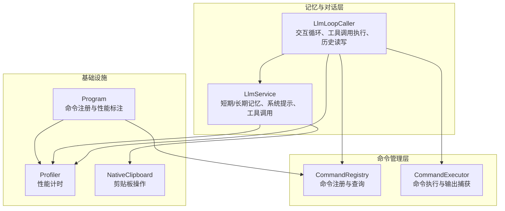
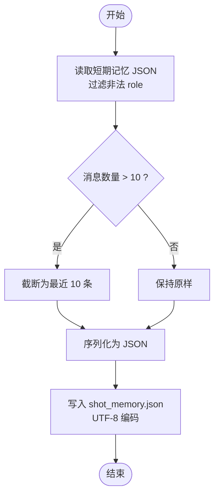
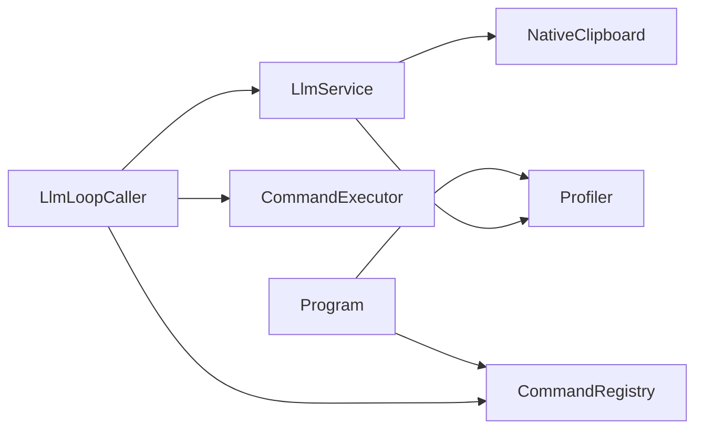

# 记忆与上下文管理

<cite>
**本文档引用的文件**
- [llm_service.cs](file://share/nomal/llm_service.cs)
- [llm_loop_caller.cs](file://ctools/llm_loop_caller.cs)
- [CommandRegistry.cs](file://ctools/CommandRegistry.cs)
- [command_executor.cs](file://ctools/command_executor.cs)
- [Profiler.cs](file://share/nomal/Profiler.cs)
- [main.cs](file://ctools/main.cs)
- [Clipboard.cs](file://share/nomal/Clipboard.cs)
</cite>

## 目录
1. [简介](#简介)
2. [项目结构](#项目结构)
3. [核心组件](#核心组件)
4. [架构总览](#架构总览)
5. [详细组件分析](#详细组件分析)
6. [依赖关系分析](#依赖关系分析)
7. [性能考虑](#性能考虑)
8. [故障排除指南](#故障排除指南)
9. [结论](#结论)
10. [附录](#附录)

## 简介
本文件面向“记忆与上下文管理系统”的技术文档，聚焦短期记忆与长期记忆的实现机制，涵盖以下方面：
- 对话历史的存储结构、消息序列化与持久化策略
- 记忆数据的加载与保存机制（文件系统操作、编码处理、错误恢复）
- 上下文窗口管理、消息截断策略与重要性排序思路
- 工作知识库的集成方式（知识注入、查询检索与更新机制）
- 内存优化策略、缓存管理与性能监控的实现细节
- 完整的 API 使用示例、配置选项说明与最佳实践指南

## 项目结构
围绕记忆与上下文管理的关键模块如下：
- 记忆与对话服务：负责短期记忆（JSON 文件）、长期记忆（日志文件）与系统提示构建
- 交互循环器：支持 Tool 调用模式的交互式循环，负责命令识别、工具过滤与执行结果回写
- 命令注册中心：集中管理命令元数据，供检索与工具定义生成
- 命令执行器：执行具体命令，捕获控制台输出并回传
- 性能监控：提供通用的性能计时工具
- 主程序入口：统一命令注册与性能标注



**图表来源**
- [llm_service.cs](file://share/nomal/llm_service.cs)
- [llm_loop_caller.cs](file://ctools/llm_loop_caller.cs)
- [CommandRegistry.cs](file://ctools/CommandRegistry.cs)
- [command_executor.cs](file://ctools/command_executor.cs)
- [Profiler.cs](file://share/nomal/Profiler.cs)
- [main.cs](file://ctools/main.cs)
- [Clipboard.cs](file://share/nomal/Clipboard.cs)

**章节来源**
- [llm_service.cs](file://share/nomal/llm_service.cs)
- [llm_loop_caller.cs](file://ctools/llm_loop_caller.cs)
- [CommandRegistry.cs](file://ctools/CommandRegistry.cs)
- [command_executor.cs](file://ctools/command_executor.cs)
- [Profiler.cs](file://share/nomal/Profiler.cs)
- [main.cs](file://ctools/main.cs)
- [Clipboard.cs](file://share/nomal/Clipboard.cs)

## 核心组件
- LlmService：提供短期记忆（JSON）与长期记忆（日志）的读写、系统提示构建、工具调用、流式响应处理与错误处理
- LlmLoopCaller：交互式循环调用器，负责命令识别、工具过滤、工具调用执行、执行结果回写短期记忆
- CommandRegistry：全局命令注册中心，提供命令查询与遍历能力
- CommandExecutor：命令执行器，封装命令执行逻辑与控制台输出捕获
- Profiler：通用性能计时工具，支持方法执行时间统计
- Program：主程序入口，负责命令注册与性能标注

**章节来源**
- [llm_service.cs](file://share/nomal/llm_service.cs)
- [llm_loop_caller.cs](file://ctools/llm_loop_caller.cs)
- [CommandRegistry.cs](file://ctools/CommandRegistry.cs)
- [command_executor.cs](file://ctools/command_executor.cs)
- [Profiler.cs](file://share/nomal/Profiler.cs)
- [main.cs](file://ctools/main.cs)

## 架构总览
系统采用“服务-循环-执行”三层协作：
- LlmService 负责与大模型交互、上下文构建与记忆持久化
- LlmLoopCaller 负责用户输入处理、命令识别与工具调用执行
- CommandRegistry 与 CommandExecutor 提供命令元数据与执行能力
- Profiler 与 Program 提供性能监控与标注

```mermaid
sequenceDiagram
participant U as "用户"
participant Loop as "LlmLoopCaller"
participant Svc as "LlmService"
participant Reg as "CommandRegistry"
participant Exec as "CommandExecutor"
U->>Loop : 输入问题/命令
alt 直接命令
Loop->>Exec : 执行命令
Exec-->>Loop : 结果 + 控制台输出
Loop->>Svc : 保存执行结果到短期记忆
else 需要工具调用
Loop->>Svc : ChatWithToolsAsync(构建上下文)
Svc-->>Loop : 返回工具调用列表
loop 逐个工具调用
Loop->>Exec : 执行工具调用
Exec-->>Loop : 结果 + 控制台输出
end
Loop->>Svc : 保存工具调用结果到短期记忆
end
Svc-->>U : 文本回复/提示
```

**图表来源**
- [llm_loop_caller.cs](file://ctools/llm_loop_caller.cs)
- [llm_service.cs](file://share/nomal/llm_service.cs)
- [CommandRegistry.cs](file://ctools/CommandRegistry.cs)
- [command_executor.cs](file://ctools/command_executor.cs)

## 详细组件分析

### LlmService：短期记忆与长期记忆
- 存储位置与文件命名
  - 短期记忆：llm/shot_memory.json（UTF-8 编码）
  - 长期记忆：llm/longterm_memory.txt（追加写入，含时间戳）
  - 工作知识：llm/works_knowledge.txt（读取）
  - 运行日志：llm/run_log.txt（读取最近片段）
- 数据结构
  - ChatMessage：包含 role、content、可选 tool_call_id、tool_calls
  - ToolDefinition/FunctionDefinition/FunctionParameters/PropertyDefinition：工具定义与参数
  - ToolCall/FunctionCall：工具调用响应
- 加载与保存策略
  - 加载：读取 JSON，过滤非法 role，返回历史消息列表
  - 保存：仅保留合法 role，超过 10 条自动截断为最近 10 条（约 5 轮对话）
  - 错误恢复：捕获异常并输出提示，保证流程继续
- 上下文构建
  - 构建系统提示（含角色设定与规则）
  - 搜索相关命令并注入到系统提示
  - 读取最近运行日志片段增强上下文
- 流式响应与工具调用
  - 支持纯文本流式响应与带图像的 VLM
  - 支持工具调用（可强制要求工具调用）
  - 保存长期记忆（文本或工具调用 JSON）



**图表来源**
- [llm_service.cs](file://share/nomal/llm_service.cs)

**章节来源**
- [llm_service.cs](file://share/nomal/llm_service.cs)

### LlmLoopCaller：交互循环与工具调用执行
- 交互循环
  - 支持 quit/exit/clear/mode/history/last 等特殊命令
  - 命令识别：完全匹配优先，其次模糊匹配；支持别名与描述相似度
  - 模式切换：确认模式与自动模式
- 工具调用执行
  - 构建工具定义（基于 CommandRegistry）
  - 过滤工具：根据搜索结果匹配命令名
  - 执行前拦截 Console 输出，支持用户确认
  - 保存工具调用结果到短期记忆（以 user 角色）
- 历史读写
  - 从磁盘加载/保存短期记忆（排除 system 消息）
  - 截断策略与 LlmService 一致

```mermaid
sequenceDiagram
participant U as "用户"
participant Loop as "LlmLoopCaller"
participant Svc as "LlmService"
participant Reg as "CommandRegistry"
participant Exec as "CommandExecutor"
U->>Loop : 输入命令
alt 完全匹配
Loop->>Exec : 执行命令
Exec-->>Loop : 返回结果
Loop->>Svc : 保存结果到短期记忆
else 模糊匹配
Loop->>Svc : ChatWithToolsAsync
Svc-->>Loop : 工具调用列表
loop 逐个工具调用
Loop->>Exec : 执行工具调用
Exec-->>Loop : 返回结果
end
Loop->>Svc : 保存工具调用结果到短期记忆
end
```

**图表来源**
- [llm_loop_caller.cs](file://ctools/llm_loop_caller.cs)
- [llm_service.cs](file://share/nomal/llm_service.cs)
- [CommandRegistry.cs](file://ctools/CommandRegistry.cs)
- [command_executor.cs](file://ctools/command_executor.cs)

**章节来源**
- [llm_loop_caller.cs](file://ctools/llm_loop_caller.cs)

### CommandRegistry：命令注册与查询
- 单例模式，线程安全注册与查询
- 支持命令别名注册与查询
- 提供 getAllCommands 以构建工具定义

**章节来源**
- [CommandRegistry.cs](file://ctools/CommandRegistry.cs)

### CommandExecutor：命令执行与输出捕获
- 执行同步/异步命令
- 捕获 Console 输出并回传
- 异常处理与返回结果

**章节来源**
- [command_executor.cs](file://ctools/command_executor.cs)

### Profiler：性能监控
- 提供 Time(Action)/Time(Func<T>) 两种重载
- 输出方法执行耗时（毫秒）

**章节来源**
- [Profiler.cs](file://share/nomal/Profiler.cs)

### Program：命令注册与性能标注
- 统一注册命令字典与 SolidWorks 实例
- 支持 [Profiled] 属性的性能标注

**章节来源**
- [main.cs](file://ctools/main.cs)

### Clipboard：剪贴板操作
- 提供 SetText 方法，使用 Win32 API 写入 Unicode 文本

**章节来源**
- [Clipboard.cs](file://share/nomal/Clipboard.cs)

## 依赖关系分析
- LlmLoopCaller 依赖 LlmService、CommandRegistry、CommandExecutor
- LlmService 依赖 HttpClient、Newtonsoft.Json、文件系统
- CommandRegistry 为全局单例，被 LlmLoopCaller 与 LlmService 使用
- Profiler 与 Program 为基础设施，贯穿各组件



**图表来源**
- [llm_loop_caller.cs](file://ctools/llm_loop_caller.cs)
- [llm_service.cs](file://share/nomal/llm_service.cs)
- [CommandRegistry.cs](file://ctools/CommandRegistry.cs)
- [command_executor.cs](file://ctools/command_executor.cs)
- [Profiler.cs](file://share/nomal/Profiler.cs)
- [main.cs](file://ctools/main.cs)
- [Clipboard.cs](file://share/nomal/Clipboard.cs)

**章节来源**
- [llm_loop_caller.cs](file://ctools/llm_loop_caller.cs)
- [llm_service.cs](file://share/nomal/llm_service.cs)
- [CommandRegistry.cs](file://ctools/CommandRegistry.cs)
- [command_executor.cs](file://ctools/command_executor.cs)
- [Profiler.cs](file://share/nomal/Profiler.cs)
- [main.cs](file://ctools/main.cs)
- [Clipboard.cs](file://share/nomal/Clipboard.cs)

## 性能考虑
- 流式响应：使用流式读取与增量拼接，减少内存占用
- 截断策略：短期记忆限制为最近 10 条，避免上下文膨胀
- 编码处理：统一 UTF-8，避免跨平台编码问题
- IO 优化：文件读写采用缓冲与异步流式处理
- 性能监控：Profiler 提供方法级耗时统计，便于定位瓶颈

[本节为通用指导，无需特定文件分析]

## 故障排除指南
- API Key 缺失：若环境变量未设置，程序会提示输入临时 API Key
- HTTP 请求异常：捕获 HttpRequestException 与 TaskCanceledException，输出详细异常信息
- 文件读写异常：捕获异常并输出提示，确保流程继续
- 历史清空：提供 ClearHistory 方法删除短期记忆文件

**章节来源**
- [llm_service.cs](file://share/nomal/llm_service.cs)

## 结论
本系统通过 LlmService 与 LlmLoopCaller 的协同，实现了：
- 短期记忆的可靠持久化与截断策略
- 长期记忆的日志化记录与时间戳管理
- 基于命令检索的上下文增强与工具调用
- 命令注册与执行的解耦与可扩展性
- 性能监控与错误恢复机制

[本节为总结，无需特定文件分析]

## 附录

### API 使用示例与配置选项
- LlmService.ChatAsync(userPrompt, imagePath?)
  - 功能：纯文本或带图像的对话
  - 行为：构建系统提示、注入相关命令与运行日志、保存短期与长期记忆
- LlmService.ChatWithToolsAsync(userPrompt, tools)
  - 功能：工具调用模式，可强制要求工具调用
  - 行为：搜索命令、过滤工具、执行工具调用、回写执行结果
- LlmLoopCaller.InteractiveLoopAsync()
  - 功能：交互式循环，支持特殊命令与模式切换
- 配置项
  - API Key：通过环境变量 DASHSCOPE_API_KEY 或控制台输入
  - 文件路径：llm 目录下各文件（短期记忆、长期记忆、工作知识、运行日志）
  - 截断阈值：短期记忆超过 10 条自动截断

**章节来源**
- [llm_service.cs](file://share/nomal/llm_service.cs)
- [llm_loop_caller.cs](file://ctools/llm_loop_caller.cs)

### 最佳实践指南
- 保持短期记忆条目数量在合理范围（建议不超过 10 条）
- 使用系统提示明确角色与规则，提升工具调用准确性
- 对工具参数进行最小化设计，降低复杂度
- 使用 Profiler 标注关键路径，持续监控性能
- 对异常进行分级处理，避免中断用户流程

[本节为通用指导，无需特定文件分析]