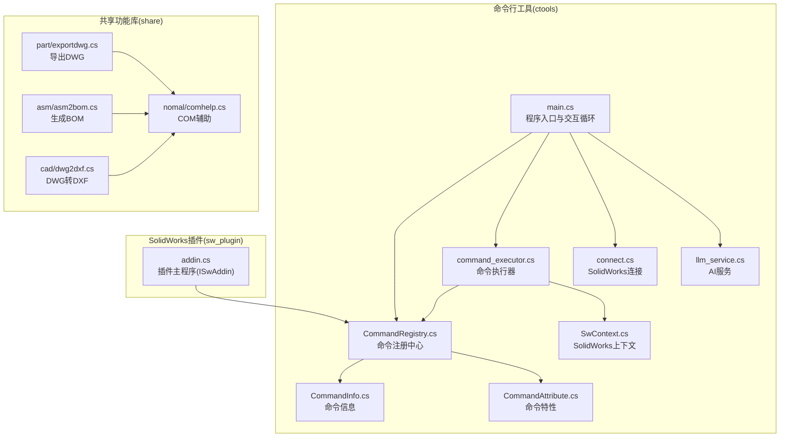
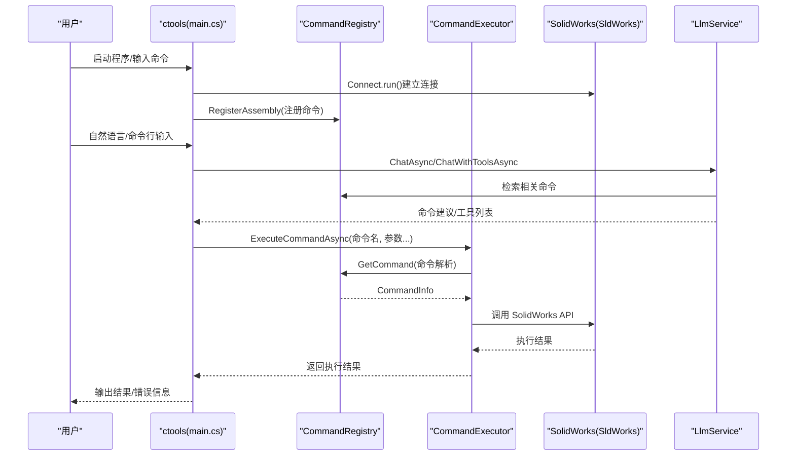
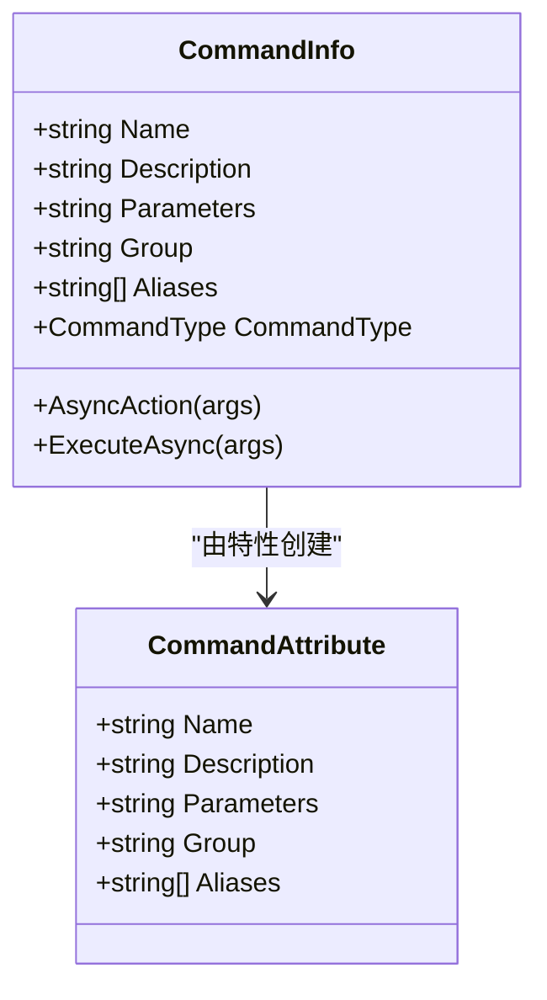
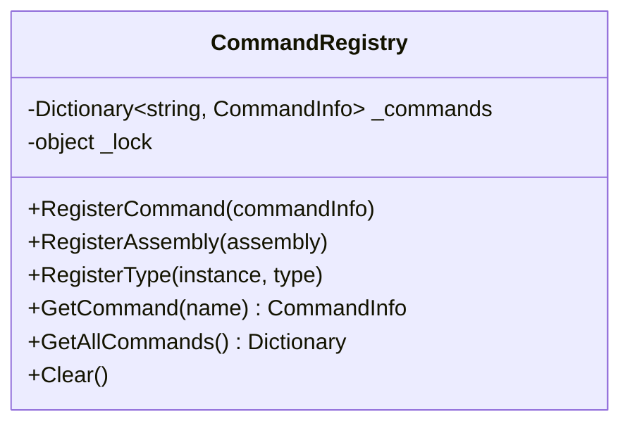
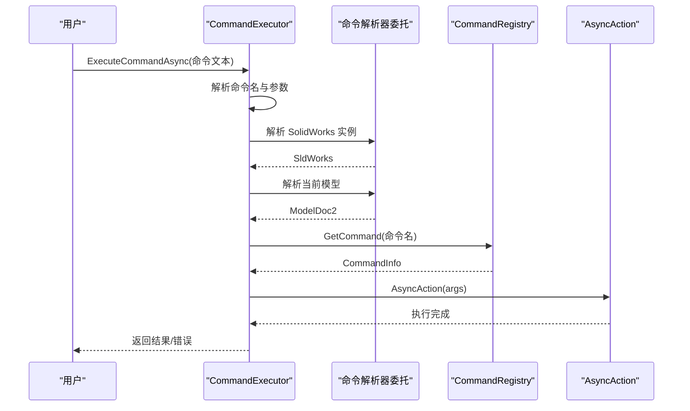
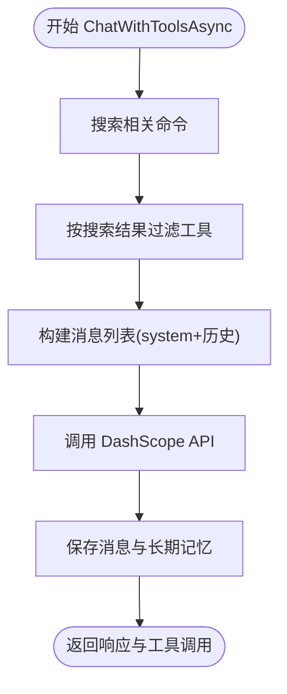
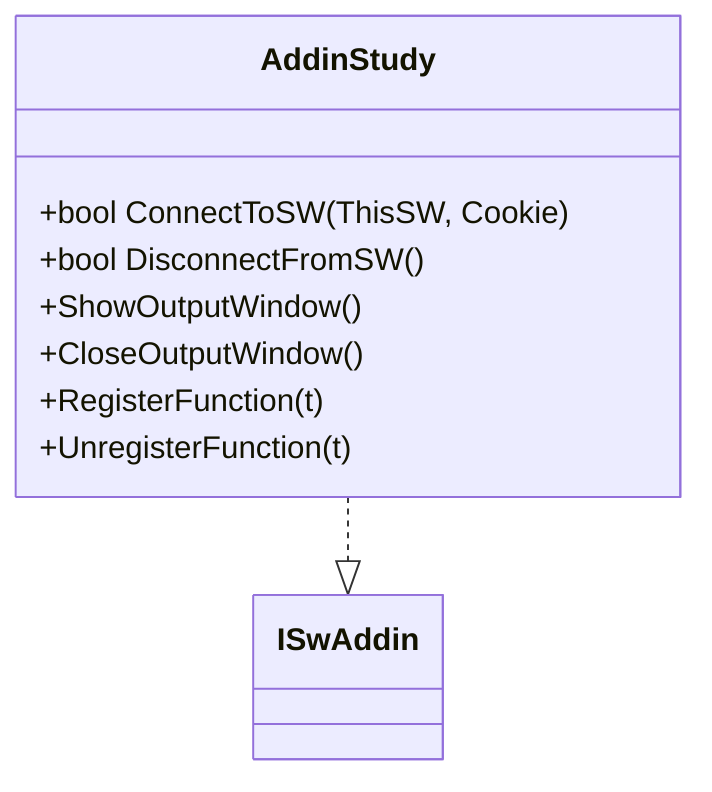
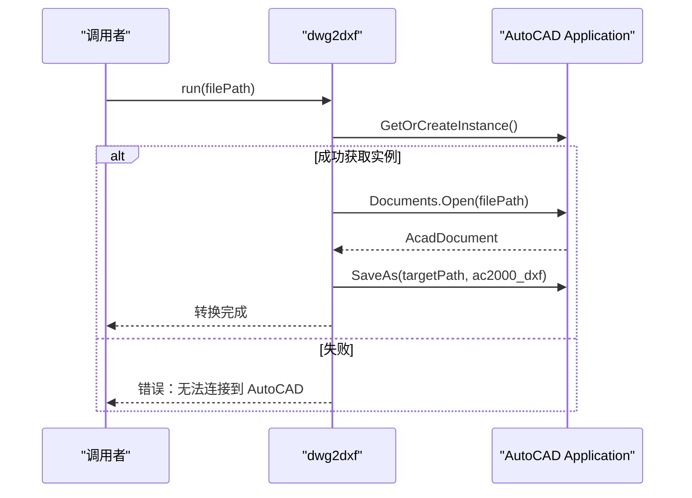
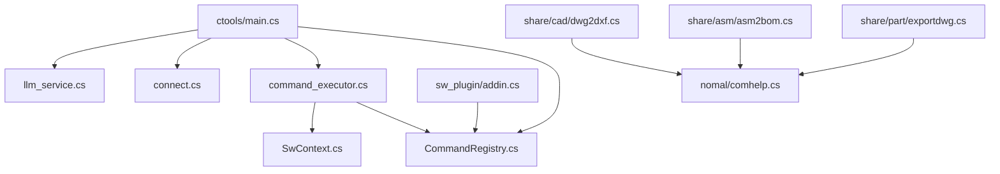

# API 参考文档

<cite>
**本文档引用的文件**
- [README.md](file://README.md)
- [main.cs](file://ctools/main.cs)
- [connect.cs](file://ctools/connect.cs)
- [CommandAttribute.cs](file://ctools/CommandAttribute.cs)
- [CommandInfo.cs](file://ctools/CommandInfo.cs)
- [CommandRegistry.cs](file://ctools/CommandRegistry.cs)
- [command_executor.cs](file://ctools/command_executor.cs)
- [SwContext.cs](file://ctools/SwContext.cs)
- [llm_service.cs](file://share/nomal/llm_service.cs)
- [addin.cs](file://sw_plugin/addin.cs)
- [exportdwg.cs](file://share/part/exportdwg.cs)
- [asm2bom.cs](file://share/asm/asm2bom.cs)
- [dwg2dxf.cs](file://share/cad/dwg2dxf.cs)
- [comhelp.cs](file://share/nomal/comhelp.cs)
</cite>

## 目录
1. [简介](#简介)
2. [项目结构](#项目结构)
3. [核心组件](#核心组件)
4. [架构总览](#架构总览)
5. [详细组件分析](#详细组件分析)
6. [依赖关系分析](#依赖关系分析)
7. [性能考虑](#性能考虑)
8. [故障排除指南](#故障排除指南)
9. [结论](#结论)

## 简介
本参考文档面向开发者，系统化梳理 my_ai 项目的公开 API，覆盖命令行工具 API、AI 对话接口、SolidWorks 插件接口以及 CAD 文件处理接口。文档提供接口规范、参数定义、返回值说明、错误处理策略与最佳实践，帮助开发者准确理解并高效使用所有公开接口。

## 项目结构
项目采用分层与功能域结合的组织方式：
- ctools：命令行工具与 AI 对话核心，负责命令注册、执行与与 SolidWorks 的连接
- share：共享功能库，按领域划分（part/asm/drw/cad/train/nomal）
- sw_plugin：SolidWorks 插件，提供菜单集成与右键菜单
- cad_plugin：AutoCAD 插件（概念性说明，实际文件位于 cad_plugin 目录）

**图表来源**
- [main.cs:54-109](file://ctools/main.cs#L54-L109)
- [CommandRegistry.cs:12-27](file://ctools/CommandRegistry.cs#L12-L27)
- [command_executor.cs:12-26](file://ctools/command_executor.cs#L12-L26)
- [connect.cs:9-51](file://ctools/connect.cs#L9-L51)
- [llm_service.cs:18-53](file://share/nomal/llm_service.cs#L18-L53)
- [addin.cs:18-24](file://sw_plugin/addin.cs#L18-L24)
- [exportdwg.cs:9-12](file://share/part/exportdwg.cs#L9-L12)
- [asm2bom.cs:10-12](file://share/asm/asm2bom.cs#L10-L12)
- [dwg2dxf.cs:5-7](file://share/cad/dwg2dxf.cs#L5-L7)
- [comhelp.cs:6-17](file://share/nomal/comhelp.cs#L6-L17)

**章节来源**
- [README.md:193-249](file://README.md#L193-L249)

## 核心组件
本节概述所有公开 API 的职责与交互关系。

- 命令系统
  - 命令特性与信息：通过特性标记命令元数据，CommandInfo 描述命令行为
  - 命令注册中心：集中注册与查询命令，支持别名映射
  - 命令执行器：解析用户输入，解析命令与参数，调用对应命令 Action
  - 命令上下文：提供全局 SolidWorks 应用与当前文档实例

- AI 对话服务
  - DashScope 通义千问集成，支持文本与图像（VLM）对话
  - 命令检索与过滤：基于用户输入动态检索相关命令，减少上下文噪声
  - 历史与记忆：短期对话历史与长期运行日志持久化

- SolidWorks 插件
  - ISwAddin 接口实现，提供菜单、右键菜单与控制台输出窗口
  - COM 注册与卸载：通过注册表键管理插件生命周期

- CAD 文件处理
  - AutoCAD 互操作：通过 AutoCAD Interop 执行 DWG 转 DXF
  - COM 辅助：跨平台获取活动 COM 对象

**章节来源**
- [CommandAttribute.cs:5-17](file://ctools/CommandAttribute.cs#L5-L17)
- [CommandInfo.cs:17-39](file://ctools/CommandInfo.cs#L17-L39)
- [CommandRegistry.cs:12-56](file://ctools/CommandRegistry.cs#L12-L56)
- [command_executor.cs:12-26](file://ctools/command_executor.cs#L12-L26)
- [SwContext.cs:9-24](file://ctools/SwContext.cs#L9-L24)
- [llm_service.cs:18-53](file://share/nomal/llm_service.cs#L18-L53)
- [addin.cs:18-24](file://sw_plugin/addin.cs#L18-L24)
- [dwg2dxf.cs:5-7](file://share/cad/dwg2dxf.cs#L5-L7)
- [comhelp.cs:6-17](file://share/nomal/comhelp.cs#L6-L17)

## 架构总览
ctools 作为 CLI 与 AI 对话入口，负责：
- 启动交互循环，连接 SolidWorks
- 注册命令到全局注册中心
- 解析用户输入，调用命令执行器
- 通过 LLM 服务进行自然语言到命令的映射与执行

**图表来源**
- [main.cs:54-109](file://ctools/main.cs#L54-L109)
- [CommandRegistry.cs:61-83](file://ctools/CommandRegistry.cs#L61-L83)
- [command_executor.cs:32-101](file://ctools/command_executor.cs#L32-L101)
- [connect.cs:11-51](file://ctools/connect.cs#L11-L51)
- [llm_service.cs:485-542](file://share/nomal/llm_service.cs#L485-L542)

## 详细组件分析

### 命令系统 API

#### 命令特性与信息
- CommandAttribute
  - 字段：Name、Description、Parameters、Group、Aliases
  - 用途：为静态方法添加命令元数据，支持别名
- CommandInfo
  - 字段：Name、Description、Parameters、Group、Aliases、CommandType、AsyncAction
  - 方法：ExecuteAsync(args) 执行命令

**图表来源**
- [CommandAttribute.cs:5-17](file://ctools/CommandAttribute.cs#L5-L17)
- [CommandInfo.cs:17-39](file://ctools/CommandInfo.cs#L17-L39)

**章节来源**
- [CommandAttribute.cs:5-17](file://ctools/CommandAttribute.cs#L5-L17)
- [CommandInfo.cs:17-39](file://ctools/CommandInfo.cs#L17-L39)

#### 命令注册中心
- 单例模式，提供线程安全的命令注册与查询
- 支持从程序集批量注册、从类型实例注册
- 支持别名注册与查询
- 提供清空与复制能力

**图表来源**
- [CommandRegistry.cs:12-56](file://ctools/CommandRegistry.cs#L12-L56)

**章节来源**
- [CommandRegistry.cs:12-154](file://ctools/CommandRegistry.cs#L12-L154)

#### 命令执行器
- 职责：解析命令文本，分离命令名与参数，调用 CommandRegistry 查找命令，执行 AsyncAction
- 依赖：命令解析器委托、SolidWorks 应用解析器、当前模型更新器
- 错误处理：未找到命令、未连接 SolidWorks、ActiveDoc 为空等

**图表来源**
- [command_executor.cs:32-101](file://ctools/command_executor.cs#L32-L101)
- [CommandRegistry.cs:113-131](file://ctools/CommandRegistry.cs#L113-L131)

**章节来源**
- [command_executor.cs:12-115](file://ctools/command_executor.cs#L12-L115)

#### 命令上下文
- SwContext 单例，提供全局 SldWorks 与 ModelDoc2 访问
- Initialize/Clear 生命周期管理

**章节来源**
- [SwContext.cs:9-85](file://ctools/SwContext.cs#L9-L85)

### AI 对话服务 API

#### LlmService
- 支持 DashScope 通义千问（默认模型 qwen3.5-flash）
- 接口：
  - ChatAsync(userPrompt, imagePath=null)：纯文本或带图像的对话
  - ChatWithToolsAsync(userPrompt, tools)：带工具调用的对话
- 内部机制：
  - 命令检索：根据用户输入搜索相关命令，动态注入到 system prompt
  - 历史管理：短期记忆 JSON 与长期运行日志
  - 流式调用：统一请求体构建与响应处理
  - 工具过滤：根据搜索结果筛选可用工具

**图表来源**
- [llm_service.cs:547-614](file://share/nomal/llm_service.cs#L547-L614)

**章节来源**
- [llm_service.cs:18-1283](file://share/nomal/llm_service.cs#L18-L1283)

### SolidWorks 插件 API

#### 插件主程序
- 实现 ISwAddin 接口，提供连接/断开回调
- 通过注册表键管理插件加载与启动
- 提供控制台输出窗口与欢迎界面

**图表来源**
- [addin.cs:18-24](file://sw_plugin/addin.cs#L18-L24)
- [addin.cs:96-120](file://sw_plugin/addin.cs#L96-L120)

**章节来源**
- [addin.cs:18-339](file://sw_plugin/addin.cs#L18-L339)

### CAD 文件处理 API

#### AutoCAD 互操作（DWG 转 DXF）
- 通过 AutoCAD Interop 获取应用实例
- 打开源文件并另存为 DXF 格式
- 错误处理：应用不可用、文件已存在、保存异常

**图表来源**
- [dwg2dxf.cs:7-38](file://share/cad/dwg2dxf.cs#L7-L38)

**章节来源**
- [dwg2dxf.cs:5-40](file://share/cad/dwg2dxf.cs#L5-L40)

#### COM 辅助
- 提供 GetActiveObject 的替代实现，支持 .NET Core/.NET 5+
- 支持通过 ProgID 或 CLSID 获取活动 COM 对象

**章节来源**
- [comhelp.cs:6-59](file://share/nomal/comhelp.cs#L6-L59)

### 具体命令示例（API 规范）

#### 导出 DWG（exportdwg）
- 适用文档类型：SolidWorks 零件(.sldprt)
- 参数：无（内部使用当前激活模型）
- 行为：检查文档保存状态与类型，创建输出目录，调用 ExportToDWG
- 返回：生成文件路径或空字符串
- 错误：未运行 SolidWorks、文档未保存、类型不符

**章节来源**
- [exportdwg.cs:12-77](file://share/part/exportdwg.cs#L12-L77)

#### 生成 BOM（asm2bom）
- 适用文档类型：SolidWorks 装配体(.sldasm)
- 参数：issheetmeet（是否处理钣金）
- 行为：插入缩进式 BOM 表，调整列、填充数量与尺寸信息，保存为 Excel 并启动
- 返回：执行状态码（0 成功，负数失败）
- 错误：非装配体、无法插入 BOM、保存失败

**章节来源**
- [asm2bom.cs:12-359](file://share/asm/asm2bom.cs#L12-L359)

## 依赖关系分析

**图表来源**
- [main.cs:54-109](file://ctools/main.cs#L54-L109)
- [CommandRegistry.cs:61-83](file://ctools/CommandRegistry.cs#L61-L83)
- [command_executor.cs:18-26](file://ctools/command_executor.cs#L18-L26)
- [connect.cs:11-51](file://ctools/connect.cs#L11-L51)
- [llm_service.cs:32-53](file://share/nomal/llm_service.cs#L32-L53)
- [addin.cs:96-120](file://sw_plugin/addin.cs#L96-L120)
- [exportdwg.cs:12-12](file://share/part/exportdwg.cs#L12-L12)
- [asm2bom.cs:12-12](file://share/asm/asm2bom.cs#L12-L12)
- [dwg2dxf.cs:7-7](file://share/cad/dwg2dxf.cs#L7-L7)
- [comhelp.cs:17-46](file://share/nomal/comhelp.cs#L17-L46)

**章节来源**
- [main.cs:54-109](file://ctools/main.cs#L54-L109)
- [CommandRegistry.cs:61-83](file://ctools/CommandRegistry.cs#L61-L83)
- [command_executor.cs:18-26](file://ctools/command_executor.cs#L18-L26)
- [connect.cs:11-51](file://ctools/connect.cs#L11-L51)
- [llm_service.cs:32-53](file://share/nomal/llm_service.cs#L32-L53)
- [addin.cs:96-120](file://sw_plugin/addin.cs#L96-L120)
- [exportdwg.cs:12-12](file://share/part/exportdwg.cs#L12-L12)
- [asm2bom.cs:12-12](file://share/asm/asm2bom.cs#L12-L12)
- [dwg2dxf.cs:7-7](file://share/cad/dwg2dxf.cs#L7-L7)
- [comhelp.cs:17-46](file://share/nomal/comhelp.cs#L17-L46)

## 性能考虑
- 命令执行性能
  - 可选性能标注属性，对带标注的命令在执行后输出耗时统计
  - 异步命令优先，避免阻塞 UI 线程
- AI 对话性能
  - 命令检索与工具过滤减少上下文规模，降低延迟
  - 短期记忆截断（最多 10 条），避免历史过长导致性能下降
- SolidWorks 操作
  - 批量操作前后尽量减少重建次数，避免频繁 EditRebuild
  - 合理使用 ActiveDoc 与 IActiveDoc2 获取当前模型，避免重复查询

[本节为通用指导，无需列出具体文件来源]

## 故障排除指南
- 插件注册失败
  - 确保以管理员身份运行注册脚本
  - 检查 DLL 是否存在于发布目录
  - 确认 SolidWorks 版本兼容性
- 无法连接 SolidWorks
  - 确保 SolidWorks 已启动且存在激活文档
  - 以管理员身份运行 ctool.exe
  - 检查 COM 对象获取是否成功
- 命令执行无响应
  - 查看控制台输出与 SolidWorks 错误提示
  - 确认当前文档类型与命令要求一致
- AI 对话无法识别命令
  - 使用更明确的命令描述
  - 使用 search 命令查看可用命令列表
  - 切换到直接命令模式

**章节来源**
- [README.md:281-340](file://README.md#L281-L340)

## 结论
本文档系统化梳理了 my_ai 项目的公开 API，涵盖命令系统、AI 对话、SolidWorks 插件与 CAD 文件处理。通过清晰的接口规范、参数定义、返回值说明与错误处理策略，开发者可以准确理解并高效使用这些接口。建议在生产环境中遵循性能与稳定性最佳实践，合理使用异步与缓存机制，确保自动化流程的可靠性与可维护性。