# AutoCAD .NET 接口

<cite>
**本文档引用的文件**
- [cad_plugin.csproj](file://cad_plugin/cad_plugin.csproj)
- [cad_addin.cs](file://cad_plugin/cad_addin.cs)
- [CadCommands.cs](file://cad_plugin/CadCommands.cs)
- [CommandAttribute.cs](file://ctools/CommandAttribute.cs)
- [CommandRegistry.cs](file://ctools/CommandRegistry.cs)
- [CommandInfo.cs](file://ctools/CommandInfo.cs)
- [command_executor.cs](file://ctools/command_executor.cs)
- [register.ps1](file://cad_plugin/register.ps1)
- [unregister.ps1](file://cad_plugin/unregister.ps1)
- [connect.cs](file://share/cad/connect.cs)
- [comhelp.cs](file://share/nomal/comhelp.cs)
</cite>

## 目录
1. [简介](#简介)
2. [项目结构](#项目结构)
3. [核心组件](#核心组件)
4. [架构概览](#架构概览)
5. [详细组件分析](#详细组件分析)
6. [依赖关系分析](#依赖关系分析)
7. [性能考虑](#性能考虑)
8. [故障排除指南](#故障排除指南)
9. [结论](#结论)

## 简介

本项目是一个基于 .NET 的 AutoCAD 插件开发框架，提供了完整的 AutoCAD 扩展机制实现。该框架实现了 IExtensionApplication 接口，支持命令注册和管理，包含 CAD 连接管理器，并提供了 .NET 与 AutoCAD 互操作性的最佳实践指南。

该插件框架具有以下特点：
- 支持 AutoCAD 应用程序生命周期管理
- 提供命令系统和参数处理机制
- 实现 CAD 连接管理器功能
- 包含完整的插件注册和配置机制
- 支持 COM 互操作性和 .NET 托管代码集成

## 项目结构

项目采用模块化设计，主要分为以下几个核心部分：

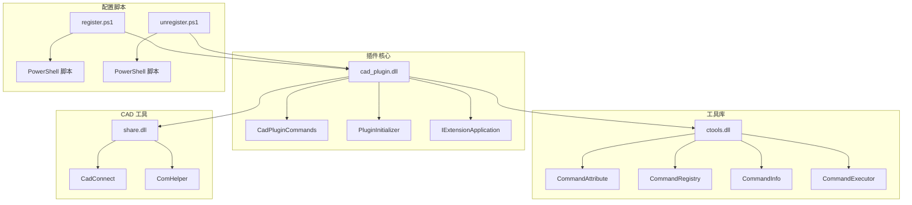

**图表来源**
- [cad_plugin.csproj:1-46](file://cad_plugin/cad_plugin.csproj#L1-L46)
- [cad_addin.cs:1-103](file://cad_plugin/cad_addin.cs#L1-L103)
- [CommandRegistry.cs:1-242](file://ctools/CommandRegistry.cs#L1-L242)

**章节来源**
- [cad_plugin.csproj:1-46](file://cad_plugin/cad_plugin.csproj#L1-L46)
- [cad_addin.cs:1-103](file://cad_plugin/cad_addin.cs#L1-L103)

## 核心组件

### IExtensionApplication 接口实现

插件框架的核心是实现了 AutoCAD 的 IExtensionApplication 接口，提供应用程序生命周期管理：

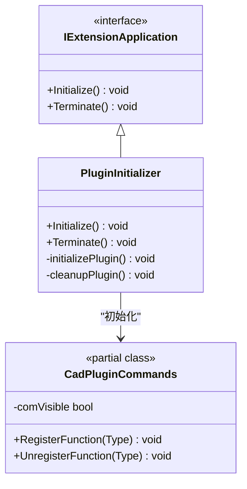

**图表来源**
- [cad_addin.cs:84-103](file://cad_plugin/cad_addin.cs#L84-L103)
- [cad_addin.cs:13-81](file://cad_plugin/cad_addin.cs#L13-L81)

### 命令系统架构

插件框架实现了完整的命令注册和管理系统：

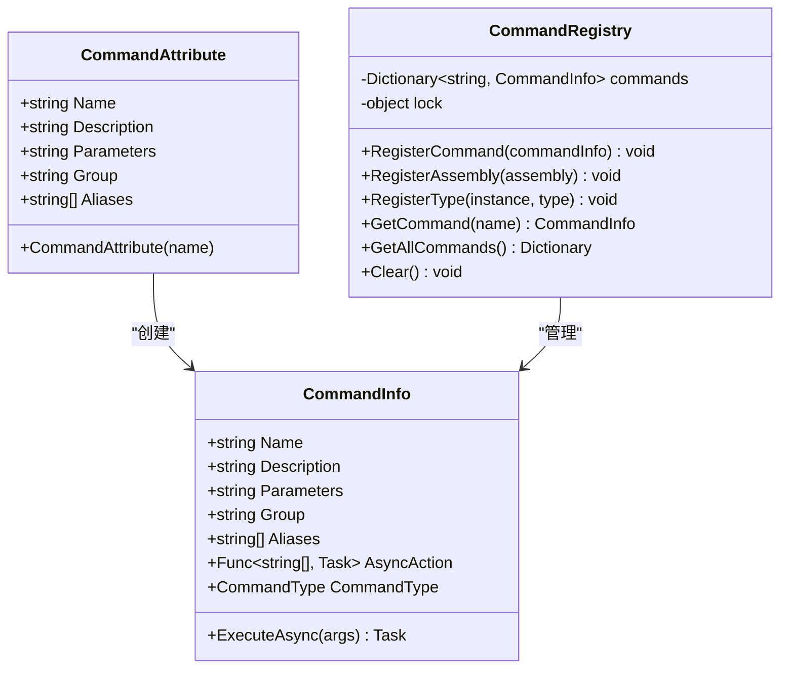

**图表来源**
- [CommandAttribute.cs:1-20](file://ctools/CommandAttribute.cs#L1-L20)
- [CommandInfo.cs:1-41](file://ctools/CommandInfo.cs#L1-L41)
- [CommandRegistry.cs:12-242](file://ctools/CommandRegistry.cs#L12-L242)

**章节来源**
- [cad_addin.cs:84-103](file://cad_plugin/cad_addin.cs#L84-L103)
- [CommandAttribute.cs:1-20](file://ctools/CommandAttribute.cs#L1-L20)
- [CommandRegistry.cs:1-242](file://ctools/CommandRegistry.cs#L1-L242)

## 架构概览

插件系统采用分层架构设计，实现了清晰的关注点分离：

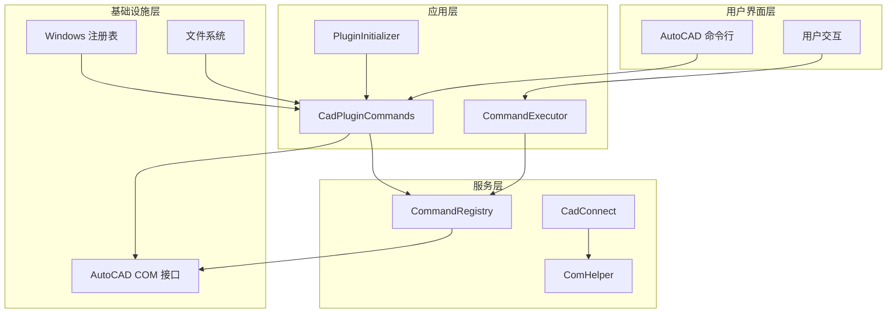

**图表来源**
- [cad_addin.cs:84-103](file://cad_plugin/cad_addin.cs#L84-L103)
- [CommandRegistry.cs:12-242](file://ctools/CommandRegistry.cs#L12-L242)
- [connect.cs:11-200](file://share/cad/connect.cs#L11-L200)

## 详细组件分析

### 插件生命周期管理

插件实现了完整的生命周期管理，包括初始化和终止过程：

#### 初始化流程

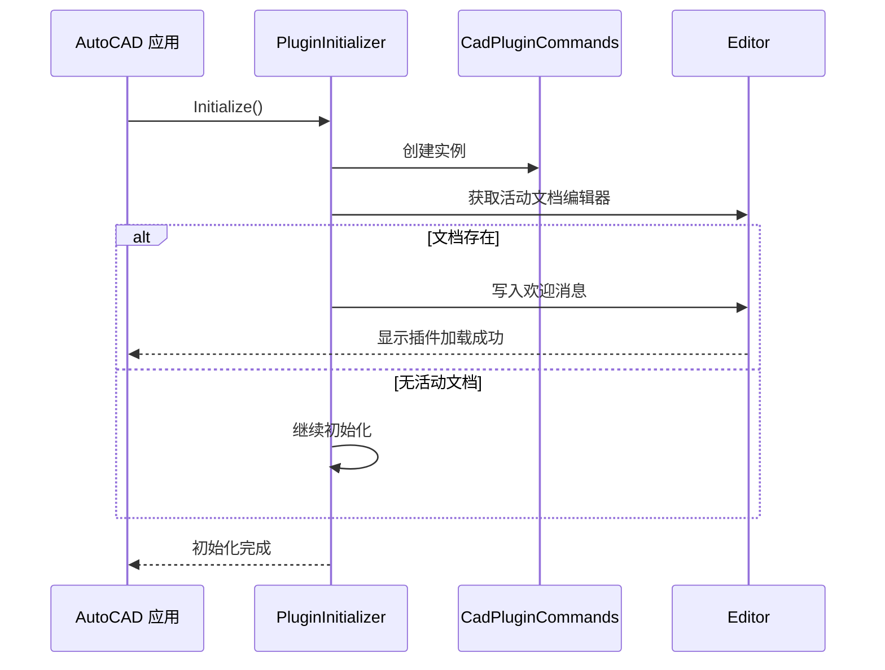

**图表来源**
- [cad_addin.cs:86-96](file://cad_plugin/cad_addin.cs#L86-L96)

#### 终止流程

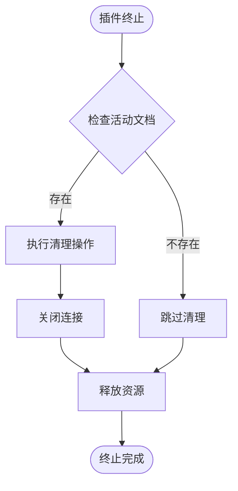

**图表来源**
- [cad_addin.cs:99-102](file://cad_plugin/cad_addin.cs#L99-L102)

**章节来源**
- [cad_addin.cs:84-103](file://cad_plugin/cad_addin.cs#L84-L103)

### 命令系统实现

#### 命令注册机制

命令系统通过特性驱动的方式实现动态注册：

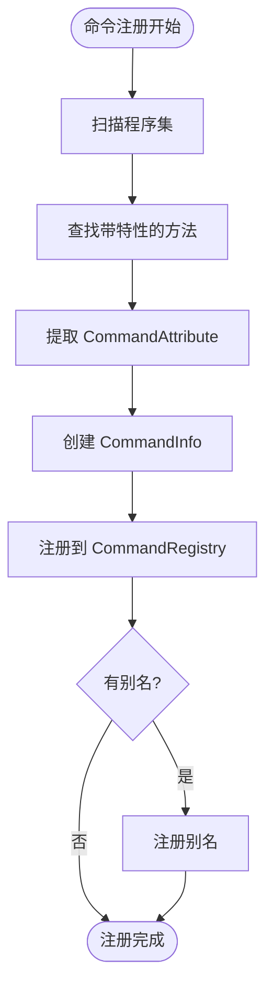

**图表来源**
- [CommandRegistry.cs:61-83](file://ctools/CommandRegistry.cs#L61-L83)
- [CommandRegistry.cs:158-196](file://ctools/CommandRegistry.cs#L158-L196)

#### 命令执行流程

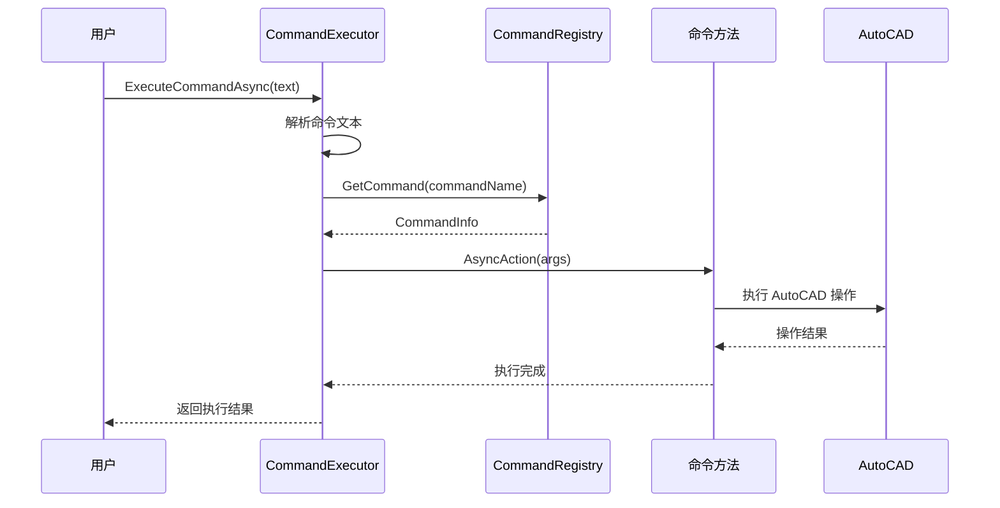

**图表来源**
- [command_executor.cs:32-113](file://ctools/command_executor.cs#L32-L113)
- [CommandInfo.cs:30-38](file://ctools/CommandInfo.cs#L30-L38)

**章节来源**
- [CommandRegistry.cs:1-242](file://ctools/CommandRegistry.cs#L1-L242)
- [command_executor.cs:1-116](file://ctools/command_executor.cs#L1-L116)

### CAD 连接管理器

#### 连接建立流程

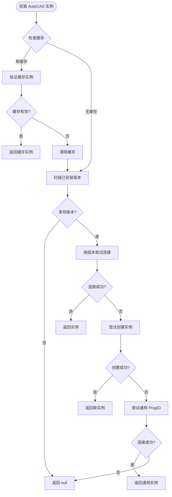

**图表来源**
- [connect.cs:19-125](file://share/cad/connect.cs#L19-L125)

#### 版本检测机制

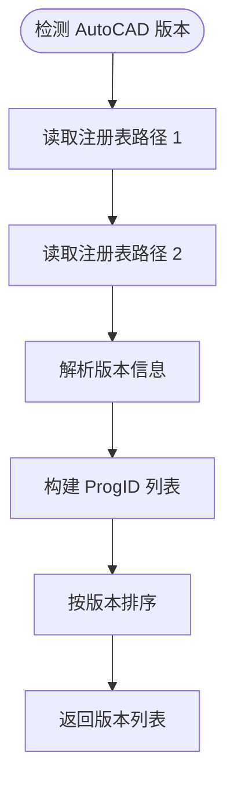

**图表来源**
- [connect.cs:138-198](file://share/cad/connect.cs#L138-L198)

**章节来源**
- [connect.cs:1-200](file://share/cad/connect.cs#L1-L200)
- [comhelp.cs:1-59](file://share/nomal/comhelp.cs#L1-L59)

### 插件注册和配置

#### 注册机制

插件使用 PowerShell 脚本进行自动化注册，避免了 COM 注册的复杂性：

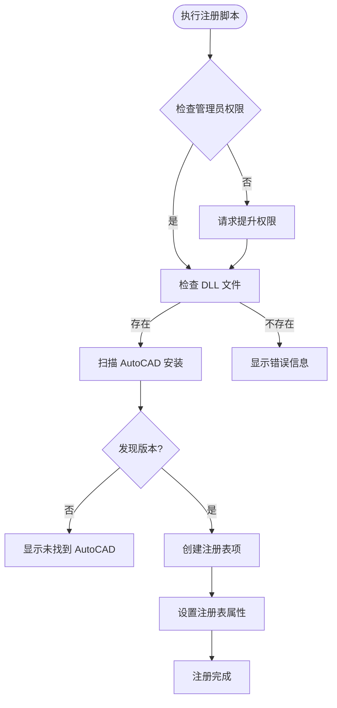

**图表来源**
- [register.ps1:6-93](file://cad_plugin/register.ps1#L6-L93)

#### 注销机制

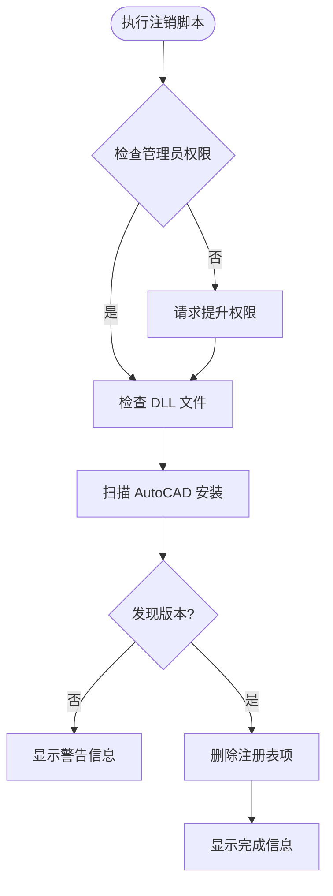

**图表来源**
- [unregister.ps1:6-92](file://cad_plugin/unregister.ps1#L6-L92)

**章节来源**
- [register.ps1:1-93](file://cad_plugin/register.ps1#L1-L93)
- [unregister.ps1:1-92](file://cad_plugin/unregister.ps1#L1-L92)

## 依赖关系分析

### 外部依赖

插件框架依赖于以下外部组件：

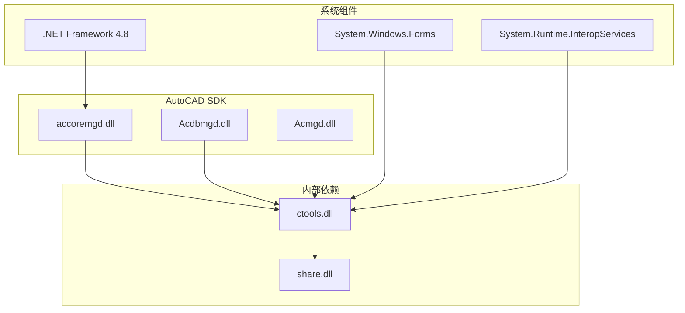

**图表来源**
- [cad_plugin.csproj:24-44](file://cad_plugin/cad_plugin.csproj#L24-L44)

### 内部模块依赖

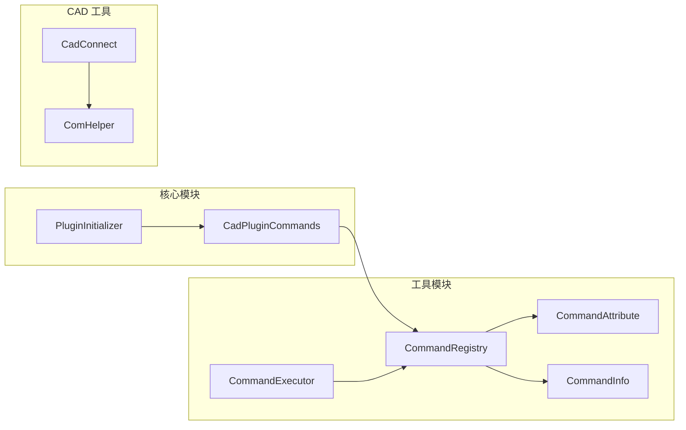

**图表来源**
- [CommandRegistry.cs:12-242](file://ctools/CommandRegistry.cs#L12-L242)
- [connect.cs:11-200](file://share/cad/connect.cs#L11-L200)

**章节来源**
- [cad_plugin.csproj:1-46](file://cad_plugin/cad_plugin.csproj#L1-L46)
- [CommandRegistry.cs:1-242](file://ctools/CommandRegistry.cs#L1-L242)

## 性能考虑

### 连接管理优化

1. **实例缓存策略**：CAD 连接管理器实现了智能缓存机制，避免重复创建 COM 对象
2. **版本优先级**：按版本号降序排列，优先连接最新版本的 AutoCAD
3. **连接验证**：定期验证缓存的连接有效性，防止使用已失效的实例

### 命令执行优化

1. **异步执行**：支持异步命令执行，避免阻塞 AutoCAD 主线程
2. **参数解析**：高效的命令参数解析算法，支持空格和制表符分割
3. **错误处理**：完善的异常处理机制，确保命令执行的稳定性

### 资源管理

1. **内存管理**：及时释放 COM 对象引用，防止内存泄漏
2. **连接池**：合理管理 AutoCAD 连接，避免过多并发连接
3. **文件操作**：优化文件操作，减少磁盘 I/O 开销

## 故障排除指南

### 常见问题及解决方案

#### 插件无法加载

**问题症状**：AutoCAD 启动时插件不显示或报错

**可能原因**：
1. DLL 文件路径不正确
2. 注册表项缺失或损坏
3. 权限不足

**解决步骤**：
1. 检查 DLL 文件是否存在
2. 运行注册脚本重新注册
3. 以管理员身份运行 AutoCAD

#### 命令不可用

**问题症状**：输入命令后无响应或提示命令不存在

**可能原因**：
1. 命令未正确注册
2. 命令名称拼写错误
3. 命令参数不正确

**解决步骤**：
1. 检查命令注册日志
2. 验证命令名称和参数
3. 重启 AutoCAD

#### CAD 连接失败

**问题症状**：插件无法连接到 AutoCAD 实例

**可能原因**：
1. AutoCAD 未启动
2. COM 组件注册问题
3. 版本兼容性问题

**解决步骤**：
1. 确保 AutoCAD 已启动
2. 重新注册 COM 组件
3. 检查版本兼容性

**章节来源**
- [cad_addin.cs:24-80](file://cad_plugin/cad_addin.cs#L24-L80)
- [connect.cs:122-125](file://share/cad/connect.cs#L122-L125)

## 结论

本 AutoCAD .NET 插件框架提供了完整的扩展机制实现，具有以下优势：

1. **完整的生命周期管理**：通过 IExtensionApplication 接口实现插件的完整生命周期控制
2. **灵活的命令系统**：基于特性驱动的命令注册机制，支持动态命令管理和参数处理
3. **强大的 CAD 连接能力**：智能的 CAD 连接管理器，支持多版本 AutoCAD 自动检测和连接
4. **可靠的注册机制**：使用 PowerShell 脚本实现自动化注册，简化部署流程
5. **良好的性能表现**：优化的连接管理和异步执行机制，确保插件的高效运行

该框架为 AutoCAD .NET 扩展开发提供了坚实的基础，开发者可以在此基础上快速构建功能丰富的 AutoCAD 插件应用。