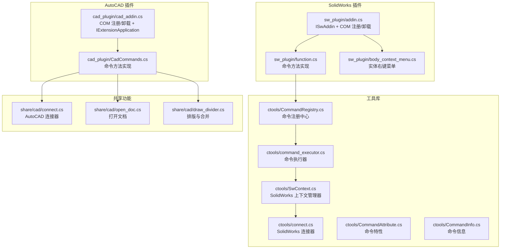
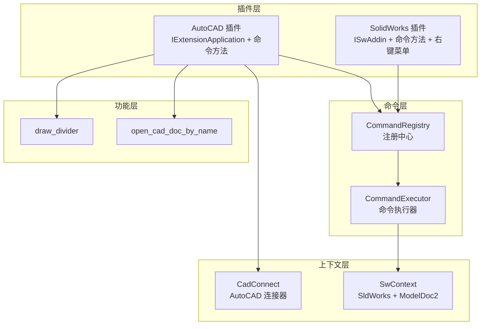
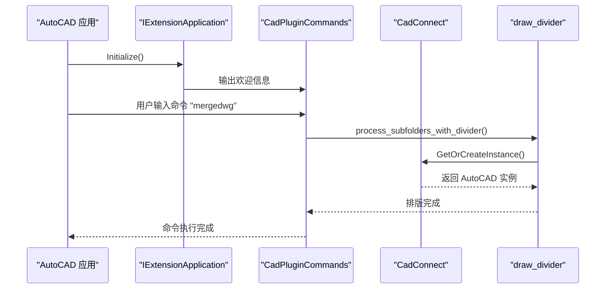
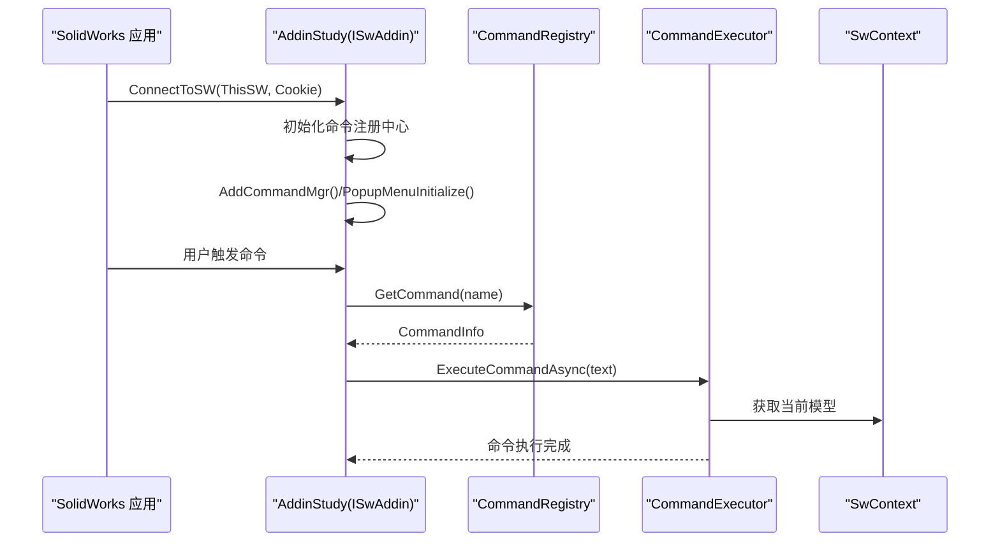
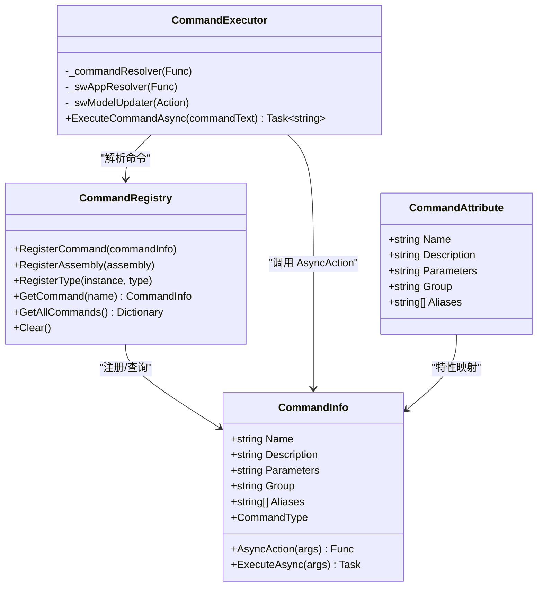
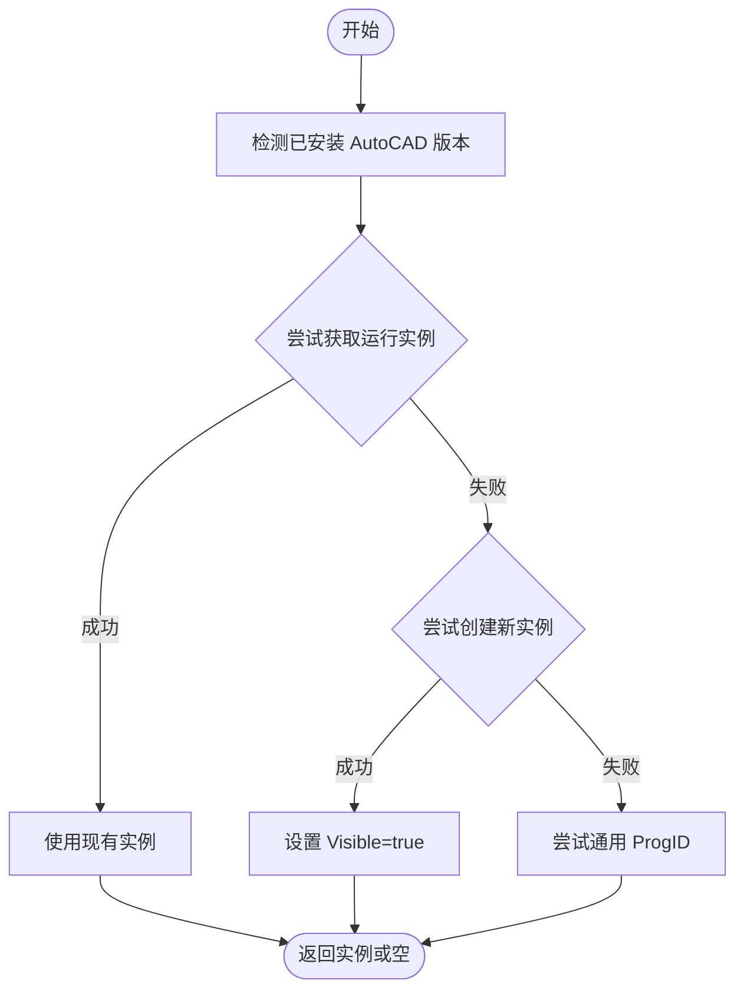
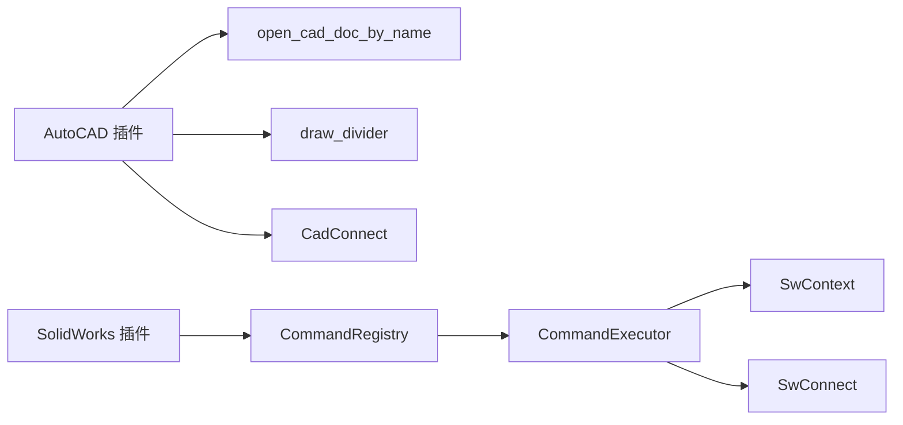

# CAD API

<cite>
**本文引用的文件**
- [cad_plugin/cad_addin.cs](file://cad_plugin/cad_addin.cs)
- [cad_plugin/CadCommands.cs](file://cad_plugin/CadCommands.cs)
- [sw_plugin/addin.cs](file://sw_plugin/addin.cs)
- [sw_plugin/function.cs](file://sw_plugin/function.cs)
- [sw_plugin/body_context_menu.cs](file://sw_plugin/body_context_menu.cs)
- [ctools/SwContext.cs](file://ctools/SwContext.cs)
- [ctools/connect.cs](file://ctools/connect.cs)
- [ctools/command_executor.cs](file://ctools/command_executor.cs)
- [ctools/CommandRegistry.cs](file://ctools/CommandRegistry.cs)
- [ctools/CommandAttribute.cs](file://ctools/CommandAttribute.cs)
- [ctools/CommandInfo.cs](file://ctools/CommandInfo.cs)
- [share/cad/connect.cs](file://share/cad/connect.cs)
- [share/cad/open_doc.cs](file://share/cad/open_doc.cs)
- [share/cad/draw_divider.cs](file://share/cad/draw_divider.cs)
</cite>

## 目录
1. [简介](#简介)
2. [项目结构](#项目结构)
3. [核心组件](#核心组件)
4. [架构总览](#架构总览)
5. [详细组件分析](#详细组件分析)
6. [依赖关系分析](#依赖关系分析)
7. [性能考量](#性能考量)
8. [故障排除指南](#故障排除指南)
9. [结论](#结论)
10. [附录](#附录)

## 简介
本文件面向 CAD API 的综合技术文档，覆盖 SolidWorks 与 AutoCAD 插件的 COM/.NET 接口规范、插件生命周期管理、命令集成机制、CAD 上下文管理器、文档与实体操作、几何建模接口、互操作性与集成最佳实践、性能优化建议以及故障排除指南。文档同时提供基于仓库源码的使用示例与流程图，帮助开发者快速理解并正确使用本项目的 CAD API。

## 项目结构
该项目采用分层与模块化组织方式：
- cad_plugin：AutoCAD 插件入口与命令实现，包含 COM 注册与卸载、IExtensionApplication 生命周期管理、基础命令方法。
- sw_plugin：SolidWorks 插件入口与命令实现，包含 ISwAddin 生命周期、COM 注册/卸载、命令注册中心、右键菜单集成。
- ctools：跨 CAD 平台的工具库，提供命令注册中心、命令执行器、SolidWorks 上下文管理器、连接器等。
- share：共享功能模块，包含 AutoCAD 与 SolidWorks 的具体业务命令（如打开文档、排版、导出等）。

**图表来源**
- [cad_plugin/cad_addin.cs:13-103](file://cad_plugin/cad_addin.cs#L13-L103)
- [cad_plugin/CadCommands.cs:12-106](file://cad_plugin/CadCommands.cs#L12-L106)
- [sw_plugin/addin.cs:18-339](file://sw_plugin/addin.cs#L18-L339)
- [sw_plugin/function.cs:29-663](file://sw_plugin/function.cs#L29-L663)
- [sw_plugin/body_context_menu.cs:141-173](file://sw_plugin/body_context_menu.cs#L141-L173)
- [ctools/CommandRegistry.cs:12-242](file://ctools/CommandRegistry.cs#L12-L242)
- [ctools/command_executor.cs:12-116](file://ctools/command_executor.cs#L12-L116)
- [ctools/SwContext.cs:9-87](file://ctools/SwContext.cs#L9-L87)
- [ctools/connect.cs:9-56](file://ctools/connect.cs#L9-L56)
- [share/cad/connect.cs:11-200](file://share/cad/connect.cs#L11-L200)
- [share/cad/open_doc.cs:5-36](file://share/cad/open_doc.cs#L5-L36)
- [share/cad/draw_divider.cs:9-244](file://share/cad/draw_divider.cs#L9-L244)

**章节来源**
- [cad_plugin/cad_addin.cs:13-103](file://cad_plugin/cad_addin.cs#L13-L103)
- [sw_plugin/addin.cs:18-339](file://sw_plugin/addin.cs#L18-L339)

## 核心组件
- AutoCAD 插件生命周期与命令集成
  - COM 注册/卸载：通过 [RegisterFunction]/[UnregisterFunction] 完成插件注册与卸载，卸载逻辑直接操作注册表。
  - IExtensionApplication：Initialize/Terminate 生命周期钩子，插件加载时自动初始化。
  - 命令方法：通过 [CommandMethod] 标注命令，如 HELLO、mergedwg、COPYFILE。
- SolidWorks 插件生命周期与命令集成
  - ISwAddin：ConnectToSW/DisconnectFromSW 生命周期；通过 [SwAddin] 特性声明插件元数据。
  - COM 注册/卸载：[ComRegisterFunction]/[ComUnregisterFunction] 写入/删除注册表项。
  - 命令注册：通过 [Command] 特性标注命令方法，由 CommandRegistry 自动扫描注册。
  - 右键菜单：PopupMenuInitialize 为 FeatureManager 设计树中的实体添加右键菜单项。
- 命令系统
  - CommandRegistry：单例注册中心，支持从静态方法与实例方法反射注册命令，支持别名。
  - CommandExecutor：解析命令文本、解析参数、校验连接状态、更新当前模型、异步执行命令。
  - CommandAttribute/CommandInfo：命令特性与命令信息封装，区分同步/异步命令。
- CAD 上下文管理器
  - SwContext：单例模式，提供全局可访问的 SldWorks 应用实例与当前 ModelDoc2 文档，并提供 Initialize/Clear。
  - CadConnect：AutoCAD 连接器，自动检测并连接最新版本 AutoCAD，支持缓存与注册表查询。
- 共享功能
  - open_cad_doc_by_name：通过 CadConnect 打开指定路径的 DWG/DWG 文档。
  - draw_divider：按层级递归处理文件夹，将 DWG 合并到当前文档并绘制文件夹标题。

**章节来源**
- [cad_plugin/cad_addin.cs:13-103](file://cad_plugin/cad_addin.cs#L13-L103)
- [cad_plugin/CadCommands.cs:12-106](file://cad_plugin/CadCommands.cs#L12-L106)
- [sw_plugin/addin.cs:18-339](file://sw_plugin/addin.cs#L18-L339)
- [sw_plugin/function.cs:29-663](file://sw_plugin/function.cs#L29-L663)
- [sw_plugin/body_context_menu.cs:141-173](file://sw_plugin/body_context_menu.cs#L141-L173)
- [ctools/CommandRegistry.cs:12-242](file://ctools/CommandRegistry.cs#L12-L242)
- [ctools/command_executor.cs:12-116](file://ctools/command_executor.cs#L12-L116)
- [ctools/CommandAttribute.cs:5-20](file://ctools/CommandAttribute.cs#L5-L20)
- [ctools/CommandInfo.cs:17-41](file://ctools/CommandInfo.cs#L17-L41)
- [ctools/SwContext.cs:9-87](file://ctools/SwContext.cs#L9-L87)
- [ctools/connect.cs:9-56](file://ctools/connect.cs#L9-L56)
- [share/cad/connect.cs:11-200](file://share/cad/connect.cs#L11-L200)
- [share/cad/open_doc.cs:5-36](file://share/cad/open_doc.cs#L5-L36)
- [share/cad/draw_divider.cs:9-244](file://share/cad/draw_divider.cs#L9-L244)

## 架构总览
本项目采用“插件 + 命令系统 + 上下文管理器”的分层架构：
- 插件层：AutoCAD 与 SolidWorks 插件分别实现各自生命周期与命令入口。
- 命令层：CommandRegistry 统一注册命令，CommandExecutor 统一解析与执行命令。
- 上下文层：SwContext 提供 SolidWorks 全局上下文；CadConnect 提供 AutoCAD 全局连接。
- 功能层：共享模块提供具体业务能力（打开文档、排版、导出等）。

**图表来源**
- [cad_plugin/cad_addin.cs:84-103](file://cad_plugin/cad_addin.cs#L84-L103)
- [sw_plugin/addin.cs:96-120](file://sw_plugin/addin.cs#L96-L120)
- [ctools/CommandRegistry.cs:12-242](file://ctools/CommandRegistry.cs#L12-L242)
- [ctools/command_executor.cs:12-116](file://ctools/command_executor.cs#L12-L116)
- [ctools/SwContext.cs:9-87](file://ctools/SwContext.cs#L9-L87)
- [share/cad/connect.cs:11-200](file://share/cad/connect.cs#L11-L200)
- [share/cad/open_doc.cs:5-36](file://share/cad/open_doc.cs#L5-L36)
- [share/cad/draw_divider.cs:9-244](file://share/cad/draw_divider.cs#L9-L244)

## 详细组件分析

### AutoCAD 插件：生命周期与命令集成
- COM 注册/卸载
  - [RegisterFunction]：在 regasm 注册时被调用，但因 AutoCAD 未运行，注册逻辑移至脚本。
  - [UnregisterFunction]：遍历注册表版本分支，删除插件注册项，带错误处理与用户提示。
- IExtensionApplication
  - Initialize：插件加载时输出欢迎信息与可用命令列表。
  - Terminate：插件卸载时的清理钩子。
- 命令方法
  - HELLO：向编辑器输出消息。
  - mergedwg：调用 draw_divider.process_subfolders_with_divider 执行排版。
  - COPYFILE：保存当前文档，复制文件路径到剪贴板。

**图表来源**
- [cad_plugin/cad_addin.cs:84-103](file://cad_plugin/cad_addin.cs#L84-L103)
- [cad_plugin/CadCommands.cs:14-77](file://cad_plugin/CadCommands.cs#L14-L77)
- [share/cad/connect.cs:19-125](file://share/cad/connect.cs#L19-L125)
- [share/cad/draw_divider.cs:181-240](file://share/cad/draw_divider.cs#L181-L240)

**章节来源**
- [cad_plugin/cad_addin.cs:13-103](file://cad_plugin/cad_addin.cs#L13-L103)
- [cad_plugin/CadCommands.cs:12-106](file://cad_plugin/CadCommands.cs#L12-L106)
- [share/cad/draw_divider.cs:9-244](file://share/cad/draw_divider.cs#L9-L244)

### SolidWorks 插件：生命周期与命令集成
- ISwAddin
  - ConnectToSW：建立与 SolidWorks 的连接，初始化命令注册中心与命令管理器，显示欢迎图片。
  - DisconnectFromSW：插件卸载时的日志输出。
- COM 注册/卸载
  - [ComRegisterFunction]/[ComUnregisterFunction]：写入/删除 HKLM/HKCU 注册表项。
- 命令注册与实现
  - 通过 [Command] 特性标注命令方法，如导出展开、工程图转 DWG、新建工程图、装配体 BOM 导出、STEP 批量导出、复制文件到剪贴板、装配体排版、折弯尺寸标注等。
- 右键菜单
  - PopupMenuInitialize：为特征树中的面添加“新建工程图”“导出 STEP”等右键菜单项。

**图表来源**
- [sw_plugin/addin.cs:96-120](file://sw_plugin/addin.cs#L96-L120)
- [sw_plugin/addin.cs:262-333](file://sw_plugin/addin.cs#L262-L333)
- [sw_plugin/function.cs:29-663](file://sw_plugin/function.cs#L29-L663)
- [ctools/CommandRegistry.cs:113-131](file://ctools/CommandRegistry.cs#L113-L131)
- [ctools/command_executor.cs:32-113](file://ctools/command_executor.cs#L32-L113)
- [ctools/SwContext.cs:71-84](file://ctools/SwContext.cs#L71-L84)

**章节来源**
- [sw_plugin/addin.cs:18-339](file://sw_plugin/addin.cs#L18-L339)
- [sw_plugin/function.cs:29-663](file://sw_plugin/function.cs#L29-L663)
- [sw_plugin/body_context_menu.cs:141-173](file://sw_plugin/body_context_menu.cs#L141-L173)
- [ctools/CommandRegistry.cs:12-242](file://ctools/CommandRegistry.cs#L12-L242)
- [ctools/command_executor.cs:12-116](file://ctools/command_executor.cs#L12-L116)
- [ctools/SwContext.cs:9-87](file://ctools/SwContext.cs#L9-L87)

### 命令系统：注册中心与执行器
- CommandRegistry
  - 支持从静态方法与实例方法反射注册命令，自动识别 [Command] 特性，支持别名注册。
  - 提供 GetCommand、GetAllCommands、Clear 等查询与管理方法。
- CommandExecutor
  - 解析命令文本，提取命令名与参数，校验命令存在性与 SolidWorks 连接状态。
  - 每次执行前重新获取当前激活模型，更新 SwModel，异步执行 CommandInfo.AsyncAction。
- CommandAttribute/CommandInfo
  - CommandAttribute：定义命令名称、描述、参数、分组、别名等。
  - CommandInfo：封装命令类型（同步/异步）、执行委托与执行方法。

**图表来源**
- [ctools/CommandRegistry.cs:12-242](file://ctools/CommandRegistry.cs#L12-L242)
- [ctools/command_executor.cs:12-116](file://ctools/command_executor.cs#L12-L116)
- [ctools/CommandAttribute.cs:5-20](file://ctools/CommandAttribute.cs#L5-L20)
- [ctools/CommandInfo.cs:17-41](file://ctools/CommandInfo.cs#L17-L41)

**章节来源**
- [ctools/CommandRegistry.cs:12-242](file://ctools/CommandRegistry.cs#L12-L242)
- [ctools/command_executor.cs:12-116](file://ctools/command_executor.cs#L12-L116)
- [ctools/CommandAttribute.cs:5-20](file://ctools/CommandAttribute.cs#L5-L20)
- [ctools/CommandInfo.cs:17-41](file://ctools/CommandInfo.cs#L17-L41)

### CAD 上下文管理器：文档与实体操作
- SwContext（单例）
  - 提供 SwApp 与 SwModel 的线程安全访问，支持 Initialize/Clear。
- CadConnect（AutoCAD）
  - 自动检测已安装版本，优先连接运行实例，否则创建新实例，确保 Visible=true。
  - 支持缓存与注册表查询，提供 ClearCache 强制重建连接。
- 典型操作
  - 打开文档：open_cad_doc_by_name.run(filePath)。
  - 排版合并：draw_divider.process_subfolders_with_divider(folderPath)。

**图表来源**
- [share/cad/connect.cs:19-125](file://share/cad/connect.cs#L19-L125)

**章节来源**
- [ctools/SwContext.cs:9-87](file://ctools/SwContext.cs#L9-L87)
- [ctools/connect.cs:9-56](file://ctools/connect.cs#L9-L56)
- [share/cad/connect.cs:11-200](file://share/cad/connect.cs#L11-L200)
- [share/cad/open_doc.cs:5-36](file://share/cad/open_doc.cs#L5-L36)
- [share/cad/draw_divider.cs:9-244](file://share/cad/draw_divider.cs#L9-L244)

## 依赖关系分析
- 插件对命令系统的依赖
  - AutoCAD 插件直接调用共享功能（排版、打开文档）。
  - SolidWorks 插件通过 CommandRegistry 与 CommandExecutor 统一管理命令。
- 命令系统对上下文的依赖
  - CommandExecutor 依赖 SwContext 获取当前模型，依赖 SwConnect 获取 SldWorks 实例。
- AutoCAD 连接器对共享功能的依赖
  - draw_divider 与 open_doc 依赖 CadConnect 获取 AutoCAD 实例。

**图表来源**
- [cad_plugin/CadCommands.cs:12-106](file://cad_plugin/CadCommands.cs#L12-L106)
- [sw_plugin/function.cs:29-663](file://sw_plugin/function.cs#L29-L663)
- [ctools/CommandRegistry.cs:12-242](file://ctools/CommandRegistry.cs#L12-L242)
- [ctools/command_executor.cs:12-116](file://ctools/command_executor.cs#L12-L116)
- [ctools/SwContext.cs:9-87](file://ctools/SwContext.cs#L9-L87)
- [ctools/connect.cs:9-56](file://ctools/connect.cs#L9-L56)
- [share/cad/connect.cs:11-200](file://share/cad/connect.cs#L11-L200)
- [share/cad/open_doc.cs:5-36](file://share/cad/open_doc.cs#L5-L36)
- [share/cad/draw_divider.cs:9-244](file://share/cad/draw_divider.cs#L9-L244)

**章节来源**
- [cad_plugin/CadCommands.cs:12-106](file://cad_plugin/CadCommands.cs#L12-L106)
- [sw_plugin/function.cs:29-663](file://sw_plugin/function.cs#L29-L663)
- [ctools/CommandRegistry.cs:12-242](file://ctools/CommandRegistry.cs#L12-L242)
- [ctools/command_executor.cs:12-116](file://ctools/command_executor.cs#L12-L116)
- [ctools/SwContext.cs:9-87](file://ctools/SwContext.cs#L9-L87)
- [ctools/connect.cs:9-56](file://ctools/connect.cs#L9-L56)
- [share/cad/connect.cs:11-200](file://share/cad/connect.cs#L11-L200)
- [share/cad/open_doc.cs:5-36](file://share/cad/open_doc.cs#L5-L36)
- [share/cad/draw_divider.cs:9-244](file://share/cad/draw_divider.cs#L9-L244)

## 性能考量
- 连接复用与缓存
  - CadConnect 提供实例缓存，首次连接失败会尝试多种策略，避免重复创建实例。
  - SwContext 使用锁保护 SwApp/SwModel 的并发访问，减少线程竞争。
- 命令执行优化
  - CommandExecutor 每次执行前重新获取 ActiveDoc/IActiveDoc2，确保模型一致性。
  - 异步命令通过 Task 执行，避免阻塞主 UI 线程。
- 文件操作与 I/O
  - draw_divider 递归处理文件夹，合理设置间距与文字高度，减少重绘次数。
  - open_cad_doc_by_name 仅在文件存在时打开，避免无效 I/O。

[本节为通用性能建议，不直接分析具体文件]

## 故障排除指南
- AutoCAD 无法连接
  - 现象：返回 null 或异常。
  - 排查：确认已安装目标版本 AutoCAD；检查注册表路径；尝试手动启动 AutoCAD；使用 CadConnect.ClearCache() 清理缓存后重试。
- SolidWorks 未连接
  - 现象：CommandExecutor 报告未连接。
  - 排查：确认 SolidWorks 已启动；检查 SwConnect 是否能获取运行实例或创建新实例；查看 SwContext.Initialize 是否正确设置。
- 命令未找到
  - 现象：ExecuteCommandAsync 返回“未找到命令”。
  - 排查：确认命令已通过 [Command] 特性标注并通过 CommandRegistry.RegisterAssembly/RegisterType 注册；检查命令名大小写与别名。
- 权限与注册问题
  - AutoCAD：卸载时需管理员权限，确保 UnregisterFunction 能删除注册表项。
  - SolidWorks：确认 HKLM/HKCU 写入权限，检查 [ComRegisterFunction]/[ComUnregisterFunction] 输出日志。

**章节来源**
- [share/cad/connect.cs:19-125](file://share/cad/connect.cs#L19-L125)
- [ctools/connect.cs:21-51](file://ctools/connect.cs#L21-L51)
- [ctools/command_executor.cs:60-113](file://ctools/command_executor.cs#L60-L113)
- [ctools/CommandRegistry.cs:61-108](file://ctools/CommandRegistry.cs#L61-L108)
- [cad_plugin/cad_addin.cs:24-80](file://cad_plugin/cad_addin.cs#L24-L80)
- [sw_plugin/addin.cs:262-333](file://sw_plugin/addin.cs#L262-L333)

## 结论
本项目提供了完整的 CAD API 能力：AutoCAD 与 SolidWorks 插件的生命周期管理、命令系统、上下文管理与共享功能模块。通过统一的命令注册与执行机制，结合稳健的 COM 互操作与 .NET 集成，开发者可以快速扩展 CAD 自动化能力。建议在生产环境中遵循本文的互操作性与性能优化建议，并结合故障排除指南进行部署与维护。

[本节为总结性内容，不直接分析具体文件]

## 附录
- 使用示例（步骤说明）
  - AutoCAD 插件注册与命令执行
    - 步骤：使用 [RegisterFunction]/[UnregisterFunction] 完成注册/卸载；在 Initialize 中输出欢迎信息；通过 [CommandMethod] 定义命令；在命令中调用共享功能（如排版、打开文档）。
    - 参考：[cad_plugin/cad_addin.cs:13-103](file://cad_plugin/cad_addin.cs#L13-L103)、[cad_plugin/CadCommands.cs:12-106](file://cad_plugin/CadCommands.cs#L12-L106)、[share/cad/draw_divider.cs:181-240](file://share/cad/draw_divider.cs#L181-L240)、[share/cad/open_doc.cs:5-36](file://share/cad/open_doc.cs#L5-L36)
  - SolidWorks 插件注册与命令执行
    - 步骤：通过 [SwAddin] 声明插件元数据；在 ConnectToSW 中初始化命令注册中心与命令管理器；通过 [Command] 标注命令方法；在命令中调用共享功能（如导出、排版、复制文件）。
    - 参考：[sw_plugin/addin.cs:18-120](file://sw_plugin/addin.cs#L18-L120)、[sw_plugin/addin.cs:262-333](file://sw_plugin/addin.cs#L262-L333)、[sw_plugin/function.cs:29-663](file://sw_plugin/function.cs#L29-L663)、[ctools/CommandRegistry.cs:12-242](file://ctools/CommandRegistry.cs#L12-L242)
  - CAD 上下文管理
    - 步骤：使用 CadConnect 获取 AutoCAD 实例；使用 SwContext 获取 SolidWorks 应用与当前文档；在命令执行前后更新上下文。
    - 参考：[share/cad/connect.cs:19-125](file://share/cad/connect.cs#L19-L125)、[ctools/SwContext.cs:71-84](file://ctools/SwContext.cs#L71-L84)、[ctools/connect.cs:11-56](file://ctools/connect.cs#L11-L56)

**章节来源**
- [cad_plugin/cad_addin.cs:13-103](file://cad_plugin/cad_addin.cs#L13-L103)
- [cad_plugin/CadCommands.cs:12-106](file://cad_plugin/CadCommands.cs#L12-L106)
- [sw_plugin/addin.cs:18-120](file://sw_plugin/addin.cs#L18-L120)
- [sw_plugin/addin.cs:262-333](file://sw_plugin/addin.cs#L262-L333)
- [sw_plugin/function.cs:29-663](file://sw_plugin/function.cs#L29-L663)
- [ctools/CommandRegistry.cs:12-242](file://ctools/CommandRegistry.cs#L12-L242)
- [share/cad/connect.cs:19-125](file://share/cad/connect.cs#L19-L125)
- [ctools/SwContext.cs:71-84](file://ctools/SwContext.cs#L71-L84)
- [ctools/connect.cs:11-56](file://ctools/connect.cs#L11-L56)