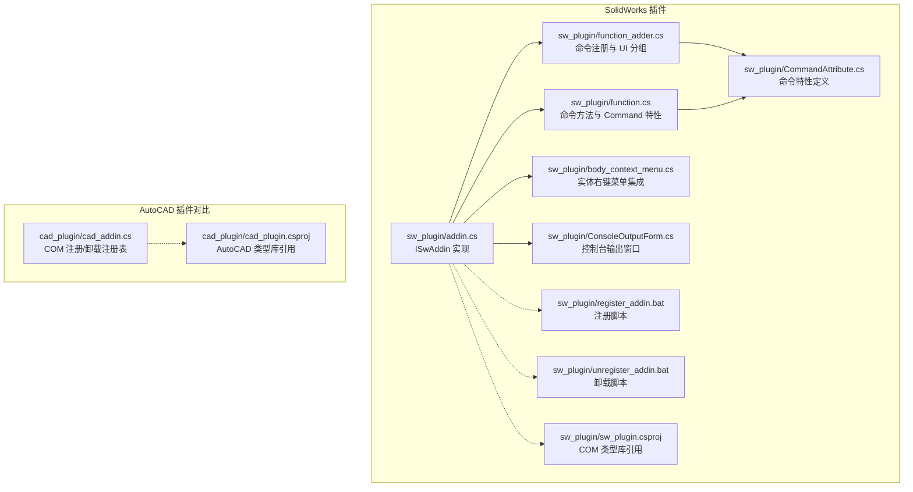
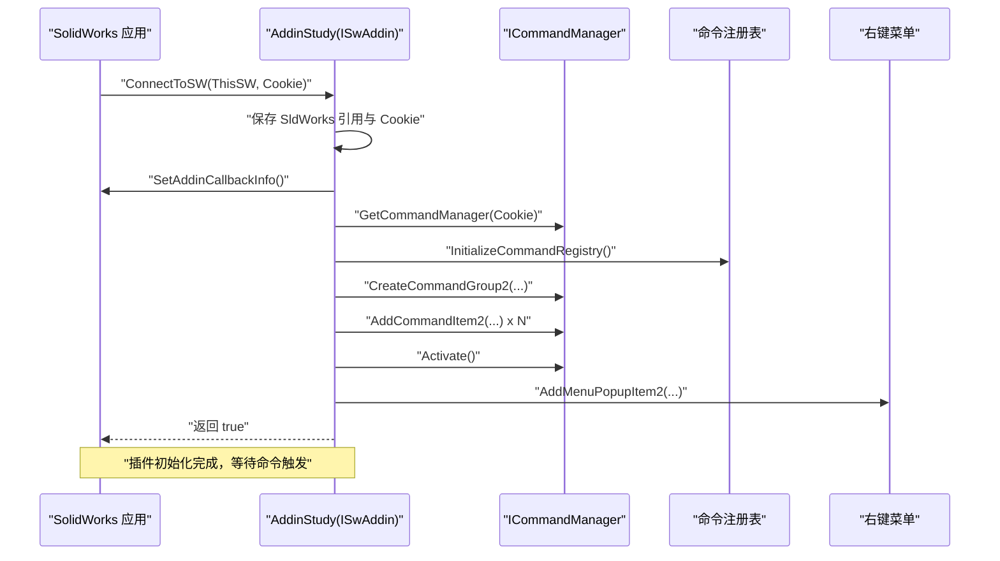
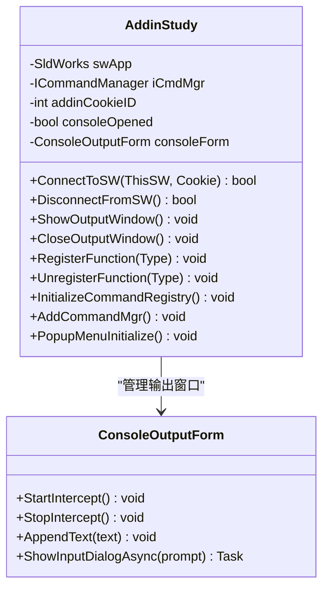
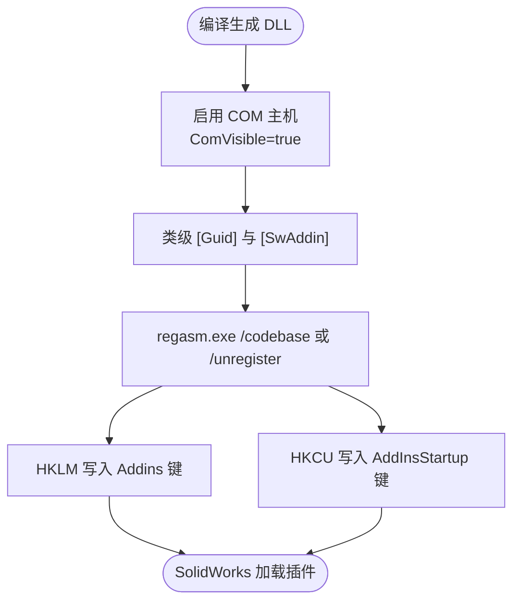
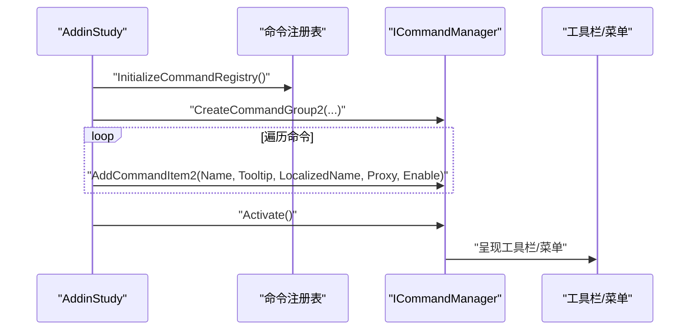
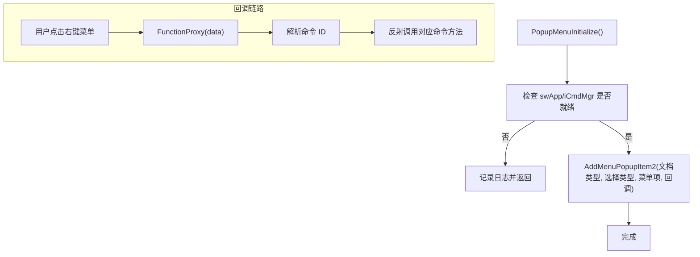
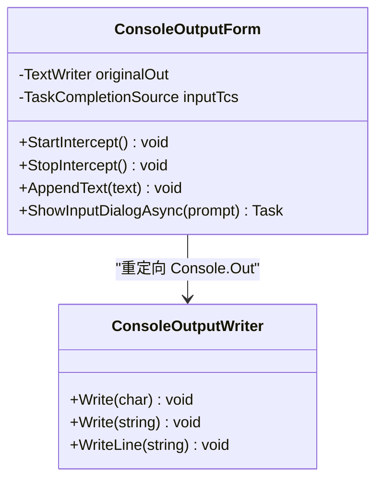
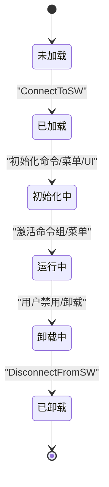
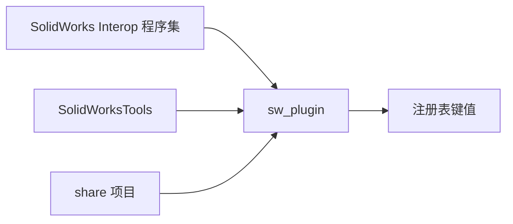

# SolidWorks COM 接口

<cite>
**本文引用的文件**
- [sw_plugin\addin.cs](file://sw_plugin/addin.cs)
- [sw_plugin\body_context_menu.cs](file://sw_plugin/body_context_menu.cs)
- [sw_plugin\function_adder.cs](file://sw_plugin/function_adder.cs)
- [sw_plugin\function.cs](file://sw_plugin/function.cs)
- [sw_plugin\CommandAttribute.cs](file://sw_plugin/CommandAttribute.cs)
- [sw_plugin\ConsoleOutputForm.cs](file://sw_plugin/ConsoleOutputForm.cs)
- [sw_plugin\register_addin.bat](file://sw_plugin/register_addin.bat)
- [sw_plugin\unregister_addin.bat](file://sw_plugin/unregister_addin.bat)
- [sw_plugin\sw_plugin.csproj](file://sw_plugin/sw_plugin.csproj)
- [cad_plugin\cad_addin.cs](file://cad_plugin/cad_addin.cs)
- [cad_plugin\cad_plugin.csproj](file://cad_plugin/cad_plugin.csproj)
</cite>

## 目录
1. [简介](#简介)
2. [项目结构](#项目结构)
3. [核心组件](#核心组件)
4. [架构总览](#架构总览)
5. [详细组件分析](#详细组件分析)
6. [依赖关系分析](#依赖关系分析)
7. [性能考虑](#性能考虑)
8. [故障排除指南](#故障排除指南)
9. [结论](#结论)
10. [附录](#附录)

## 简介
本文件系统化记录 SolidWorks 插件的 COM 接口实现规范，重点覆盖以下方面：
- ISwAddin 接口的完整实现规范，包括 ConnectToSW 与 DisconnectFromSW 的使用方式与生命周期管理
- COM 组件注册机制，涵盖 [ComRegisterFunction]/[ComUnregisterFunction] 的应用与注册表写入策略
- 插件生命周期管理：插件加载、初始化、命令注册、右键菜单集成与卸载流程
- 实体右键菜单集成：菜单项添加、事件回调与上下文选择处理
- 控制台输出窗口的实现与管理：文本拦截、UI 展示与交互输入
- COM 互操作性、类型库引用与版本兼容性的最佳实践

## 项目结构
本仓库包含两个主要插件工程：
- sw_plugin：SolidWorks 插件，实现 ISwAddin、命令注册、右键菜单与输出窗口
- cad_plugin：AutoCAD 插件（作为对比参考），展示 COM 注册与卸载的注册表操作

**图表来源**
- [sw_plugin/addin.cs:1-339](file://sw_plugin/addin.cs#L1-L339)
- [sw_plugin/function_adder.cs:1-206](file://sw_plugin/function_adder.cs#L1-L206)
- [sw_plugin/function.cs:1-663](file://sw_plugin/function.cs#L1-L663)
- [sw_plugin/body_context_menu.cs:1-174](file://sw_plugin/body_context_menu.cs#L1-L174)
- [sw_plugin/ConsoleOutputForm.cs:1-172](file://sw_plugin/ConsoleOutputForm.cs#L1-L172)
- [sw_plugin/CommandAttribute.cs:1-27](file://sw_plugin/CommandAttribute.cs#L1-L27)
- [sw_plugin/register_addin.bat:1-10](file://sw_plugin/register_addin.bat#L1-L10)
- [sw_plugin/unregister_addin.bat:1-11](file://sw_plugin/unregister_addin.bat#L1-L11)
- [sw_plugin/sw_plugin.csproj:1-74](file://sw_plugin/sw_plugin.csproj#L1-L74)
- [cad_plugin/cad_addin.cs:1-103](file://cad_plugin/cad_addin.cs#L1-L103)
- [cad_plugin/cad_plugin.csproj:1-46](file://cad_plugin/cad_plugin.csproj#L1-L46)

**章节来源**
- [sw_plugin/addin.cs:1-339](file://sw_plugin/addin.cs#L1-L339)
- [sw_plugin/sw_plugin.csproj:24-42](file://sw_plugin/sw_plugin.csproj#L24-L42)

## 核心组件
- ISwAddin 实现类：负责与 SolidWorks 应用建立连接、初始化命令与菜单、处理插件生命周期
- 命令注册与代理：基于特性驱动的命令注册、命令组与工具栏/菜单的创建、命令回调代理
- 实体右键菜单：针对面选择添加菜单项，绑定具体业务方法
- 输出窗口：拦截 Console 输出，提供可置顶、可滚动的实时输出窗，支持简单交互输入
- COM 注册脚本：使用 regasm 完成 COM 暴露与注册表写入；卸载脚本反向清理

**章节来源**
- [sw_plugin/addin.cs:24-120](file://sw_plugin/addin.cs#L24-L120)
- [sw_plugin/function_adder.cs:26-204](file://sw_plugin/function_adder.cs#L26-L204)
- [sw_plugin/body_context_menu.cs:141-166](file://sw_plugin/body_context_menu.cs#L141-L166)
- [sw_plugin/ConsoleOutputForm.cs:10-172](file://sw_plugin/ConsoleOutputForm.cs#L10-L172)
- [sw_plugin/register_addin.bat:1-10](file://sw_plugin/register_addin.bat#L1-L10)
- [sw_plugin/unregister_addin.bat:1-11](file://sw_plugin/unregister_addin.bat#L1-L11)

## 架构总览
SolidWorks 插件采用“特性驱动 + 命令代理”的架构模式：
- 通过 [SwAddin] 特性声明插件元数据，使用 [ComRegisterFunction]/[ComUnregisterFunction] 自动写入注册表
- ConnectToSW 建立与 SldWorks 的连接，初始化命令注册表、命令组、工具栏/菜单与右键菜单
- FunctionProxy 作为统一回调入口，根据命令 ID 调用对应方法，必要时自动弹出输出窗口
- 右键菜单通过 AddMenuPopupItem2 为不同文档类型添加实体级菜单项

**图表来源**
- [sw_plugin/addin.cs:96-120](file://sw_plugin/addin.cs#L96-L120)
- [sw_plugin/function_adder.cs:75-204](file://sw_plugin/function_adder.cs#L75-L204)
- [sw_plugin/body_context_menu.cs:141-166](file://sw_plugin/body_context_menu.cs#L141-L166)

## 详细组件分析

### ISwAddin 生命周期与接口实现
- ConnectToSW：保存 SldWorks 引用、设置回调、获取命令管理器、初始化命令注册表、创建命令组与 UI、显示欢迎图、初始化右键菜单
- DisconnectFromSW：插件卸载时的清理入口（当前为空实现）
- COM 注册：通过 [SwAddin] 特性与 [ComRegisterFunction]/[ComUnregisterFunction] 写入注册表，分别写入 Addins 与 AddInsStartup 键值

**图表来源**
- [sw_plugin/addin.cs:24-120](file://sw_plugin/addin.cs#L24-L120)
- [sw_plugin/addin.cs:262-333](file://sw_plugin/addin.cs#L262-L333)
- [sw_plugin/ConsoleOutputForm.cs:10-172](file://sw_plugin/ConsoleOutputForm.cs#L10-L172)

**章节来源**
- [sw_plugin/addin.cs:96-120](file://sw_plugin/addin.cs#L96-L120)
- [sw_plugin/addin.cs:211-218](file://sw_plugin/addin.cs#L211-L218)
- [sw_plugin/addin.cs:262-333](file://sw_plugin/addin.cs#L262-L333)

### COM 组件注册机制与版本兼容
- 启用 COM 主机：项目属性启用 EnableComHosting 并设置 ComVisible=true
- 类级别特性：[Guid] 与 [SwAddin] 提供插件标识与元数据
- 注册函数：[ComRegisterFunction] 写入 HKLM SOFTWARE\SolidWorks\Addins 与 HKCU Software\SolidWorks\AddInsStartup
- 卸载函数：[ComUnregisterFunction] 删除上述键值
- 类型库引用：通过显式引用 SolidWorks Interop 程序集与 SolidWorksTools
- 版本兼容：目标框架 .NET Framework 4.8，平台 x64，避免跨版本互操作问题

**图表来源**
- [sw_plugin/sw_plugin.csproj:1-14](file://sw_plugin/sw_plugin.csproj#L1-L14)
- [sw_plugin/sw_plugin.csproj:28-42](file://sw_plugin/sw_plugin.csproj#L28-L42)
- [sw_plugin/addin.cs:18-23](file://sw_plugin/addin.cs#L18-L23)
- [sw_plugin/addin.cs:262-333](file://sw_plugin/addin.cs#L262-L333)

**章节来源**
- [sw_plugin/sw_plugin.csproj:1-14](file://sw_plugin/sw_plugin.csproj#L1-L14)
- [sw_plugin/sw_plugin.csproj:28-42](file://sw_plugin/sw_plugin.csproj#L28-L42)
- [sw_plugin/addin.cs:18-23](file://sw_plugin/addin.cs#L18-L23)
- [sw_plugin/addin.cs:262-333](file://sw_plugin/addin.cs#L262-L333)

### 命令注册与代理机制
- 命令特性：CommandAttribute 定义命令 ID、名称、提示、本地化名称、适用文档类型与是否显示输出窗口
- 命令注册：扫描当前实例中带 Command 特性的非公开方法，填充命令注册表
- 命令代理：FunctionProxy 根据 data（命令 ID 字符串）解析后反射调用对应方法；若特性要求则先弹出输出窗口
- 命令组与 UI：CreateCommandGroup2 创建命令组，AddCommandItem2 添加命令项，按文档类型分组创建工具栏/菜单

**图表来源**
- [sw_plugin/CommandAttribute.cs:8-27](file://sw_plugin/CommandAttribute.cs#L8-L27)
- [sw_plugin/function_adder.cs:26-204](file://sw_plugin/function_adder.cs#L26-L204)
- [sw_plugin/function.cs:29-663](file://sw_plugin/function.cs#L29-L663)

**章节来源**
- [sw_plugin/CommandAttribute.cs:8-27](file://sw_plugin/CommandAttribute.cs#L8-L27)
- [sw_plugin/function_adder.cs:26-204](file://sw_plugin/function_adder.cs#L26-L204)
- [sw_plugin/function.cs:29-663](file://sw_plugin/function.cs#L29-L663)

### 实体右键菜单集成
- 菜单初始化：PopupMenuInitialize 为 PART/ASSEMBLY 文档类型、面选择添加菜单项
- 回调绑定：菜单项回调指向 FunctionProxy，内部再路由到具体命令方法
- 选择处理：get_select_body 获取当前选中面所属实体，必要时切换到组件对应的模型

**图表来源**
- [sw_plugin/body_context_menu.cs:141-166](file://sw_plugin/body_context_menu.cs#L141-L166)
- [sw_plugin/function_adder.cs:44-74](file://sw_plugin/function_adder.cs#L44-L74)
- [sw_plugin/body_context_menu.cs:119-133](file://sw_plugin/body_context_menu.cs#L119-L133)

**章节来源**
- [sw_plugin/body_context_menu.cs:141-166](file://sw_plugin/body_context_menu.cs#L141-L166)
- [sw_plugin/body_context_menu.cs:119-133](file://sw_plugin/body_context_menu.cs#L119-L133)
- [sw_plugin/function_adder.cs:44-74](file://sw_plugin/function_adder.cs#L44-L74)

### 控制台输出窗口实现与管理
- 窗口管理：ShowOutputWindow/CloseOutputWindow 控制窗口显示、置顶与拦截停止
- 输出拦截：StartIntercept/StopIntercept 将 Console.Out 重定向到自定义 TextWriter
- UI 交互：支持显示输入框、回车提交、Esc 取消，异步等待用户输入
- 位置与样式：窗口停靠在屏幕右上角，等宽字体，自动滚动到底部

**图表来源**
- [sw_plugin/ConsoleOutputForm.cs:10-172](file://sw_plugin/ConsoleOutputForm.cs#L10-L172)

**章节来源**
- [sw_plugin/ConsoleOutputForm.cs:18-172](file://sw_plugin/ConsoleOutputForm.cs#L18-L172)

### 插件生命周期管理
- 加载：SolidWorks 启动时根据 AddInsStartup 键加载插件，调用 ConnectToSW
- 初始化：建立上下文、注册命令、创建 UI、初始化菜单
- 运行：响应命令回调、处理用户交互、更新输出窗口
- 卸载：SolidWorks 卸载或用户禁用插件时调用 DisconnectFromSW

**图表来源**
- [sw_plugin/addin.cs:96-120](file://sw_plugin/addin.cs#L96-L120)
- [sw_plugin/addin.cs:211-218](file://sw_plugin/addin.cs#L211-L218)

**章节来源**
- [sw_plugin/addin.cs:96-120](file://sw_plugin/addin.cs#L96-L120)
- [sw_plugin/addin.cs:211-218](file://sw_plugin/addin.cs#L211-L218)

## 依赖关系分析
- 类型库引用：SolidWorks Interop 程序集与 SolidWorksTools
- 项目引用：共享工具模块 share
- COM 互操作：启用 COM 主机，暴露 ComVisible 类型
- 平台与框架：x64 平台，.NET Framework 4.8

**图表来源**
- [sw_plugin/sw_plugin.csproj:28-42](file://sw_plugin/sw_plugin.csproj#L28-L42)
- [sw_plugin/sw_plugin.csproj:24-26](file://sw_plugin/sw_plugin.csproj#L24-L26)

**章节来源**
- [sw_plugin/sw_plugin.csproj:24-42](file://sw_plugin/sw_plugin.csproj#L24-L42)

## 性能考虑
- 命令组与 UI 创建：尽量一次性创建，避免重复创建导致 UI 抖动
- 反射调用：命令代理使用反射，建议缓存 MethodInfo 与特性信息
- 输出窗口：大量日志写入时注意 UI 刷新频率，避免阻塞主线程
- 选择处理：实体右键菜单仅在需要时解析选择，减少不必要的 COM 对象查询

## 故障排除指南
- 注册失败：确认以管理员权限运行注册脚本；检查 regasm 路径与 .NET Framework 版本
- 未显示菜单：确认命令组已激活且文档类型匹配；检查命令特性中的 DocumentTypes
- 输出窗口无内容：确认已调用 StartIntercept；检查 Console 重定向是否被其他组件覆盖
- 右键菜单不生效：确认 swApp/iCmdMgr 已初始化；检查选择类型与文档类型参数

**章节来源**
- [sw_plugin/register_addin.bat:1-10](file://sw_plugin/register_addin.bat#L1-L10)
- [sw_plugin/unregister_addin.bat:1-11](file://sw_plugin/unregister_addin.bat#L1-L11)
- [sw_plugin/function_adder.cs:75-204](file://sw_plugin/function_adder.cs#L75-L204)
- [sw_plugin/ConsoleOutputForm.cs:134-146](file://sw_plugin/ConsoleOutputForm.cs#L134-L146)
- [sw_plugin/body_context_menu.cs:141-166](file://sw_plugin/body_context_menu.cs#L141-L166)

## 结论
本实现遵循 SolidWorks 插件标准接口 ISwAddin，结合特性驱动的命令注册与统一代理回调，提供了完整的生命周期管理、UI 集成与输出窗口能力。通过 COM 注册函数与注册脚本，实现了稳定的安装与卸载流程。建议在生产环境中进一步优化反射性能、增强异常处理与日志记录，并持续关注 SolidWorks 版本升级对类型库的影响。

## 附录
- AutoCAD 插件对比：展示了基于 [ComRegisterFunction]/[ComUnregisterFunction] 的注册表操作方式，便于理解不同 CAD 平台的 COM 注册差异

**章节来源**
- [cad_plugin/cad_addin.cs:16-80](file://cad_plugin/cad_addin.cs#L16-L80)
- [cad_plugin/cad_plugin.csproj:24-40](file://cad_plugin/cad_plugin.csproj#L24-L40)