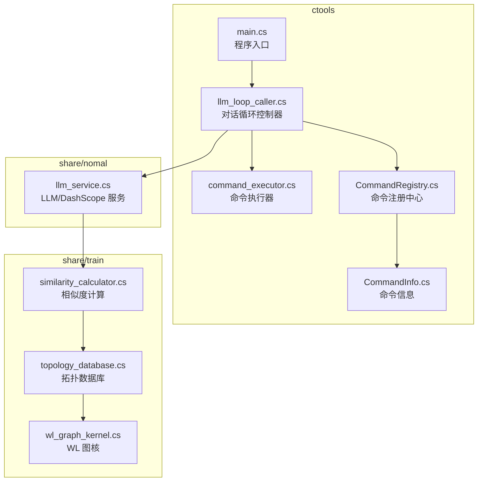
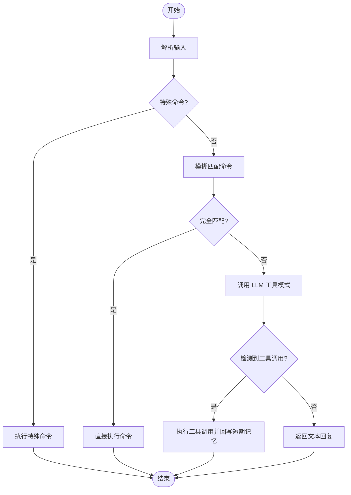
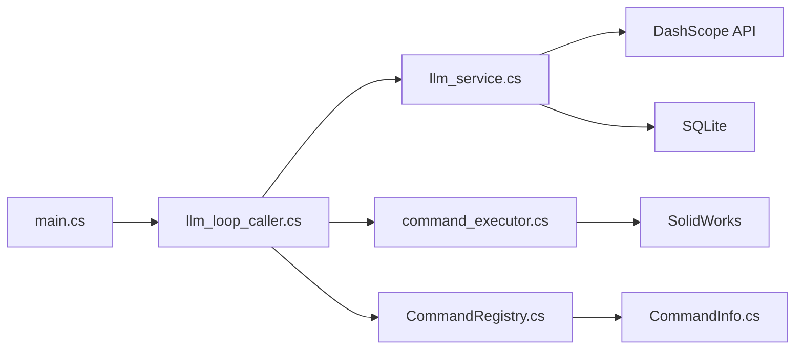

# LLM API

<cite>
**本文引用的文件**
- [README.md](file://README.md)
- [llm_service.cs](file://share/nomal/llm_service.cs)
- [llm_loop_caller.cs](file://ctools/llm_loop_caller.cs)
- [command_executor.cs](file://ctools/command_executor.cs)
- [CommandRegistry.cs](file://ctools/CommandRegistry.cs)
- [CommandInfo.cs](file://ctools/CommandInfo.cs)
- [main.cs](file://ctools/main.cs)
- [similarity_calculator.cs](file://share/train/similarity_calculator.cs)
- [topology_database.cs](file://share/train/topology_database.cs)
- [wl_graph_kernel.cs](file://share/train/wl_graph_kernel.cs)
</cite>

## 目录
1. [简介](#简介)
2. [项目结构](#项目结构)
3. [核心组件](#核心组件)
4. [架构总览](#架构总览)
5. [详细组件分析](#详细组件分析)
6. [依赖关系分析](#依赖关系分析)
7. [性能考量](#性能考量)
8. [故障排查指南](#故障排查指南)
9. [结论](#结论)
10. [附录](#附录)

## 简介
本文件面向 LLM API 的集成与使用，聚焦于 DashScope 通义千问 API 的对接、请求与响应格式、工具调用（Function Calling）协议、对话循环控制器的交互与记忆管理，以及 AI 对话的上下文管理、相似度匹配与模糊命令识别能力。文档同时提供普通对话、工具调用与混合模式的使用示例，并总结错误处理策略、性能优化建议与最佳实践。

## 项目结构
该项目围绕“命令行工具 + SolidWorks 插件 + AI 对话”展开，其中与 LLM API 直接相关的核心位于 share/nomal 与 ctools 目录：
- share/nomal/llm_service.cs：封装 DashScope API 调用、消息历史、系统提示、工具定义与流式响应处理。
- ctools/llm_loop_caller.cs：对话循环控制器，负责命令识别、模糊匹配、工具调用执行与历史/记忆管理。
- ctools/command_executor.cs：命令执行器，负责将工具调用映射到具体 SolidWorks 命令。
- ctools/CommandRegistry.cs 与 ctools/CommandInfo.cs：命令注册与元数据，支撑工具定义与命令解析。
- ctools/main.cs：程序入口，负责命令注册、上下文初始化与交互循环启动。
- share/train/*：拓扑相似度与图核算法相关，用于 AI 的上下文增强与知识库检索。



图表来源
- [main.cs:53-109](file://ctools/main.cs#L53-L109)
- [llm_loop_caller.cs:44-67](file://ctools/llm_loop_caller.cs#L44-L67)
- [llm_service.cs:18-54](file://share/nomal/llm_service.cs#L18-L54)
- [similarity_calculator.cs:16-83](file://share/train/similarity_calculator.cs#L16-L83)
- [topology_database.cs:50-61](file://share/train/topology_database.cs#L50-L61)
- [wl_graph_kernel.cs:12-77](file://share/train/wl_graph_kernel.cs#L12-L77)

章节来源
- [README.md:193-249](file://README.md#L193-L249)

## 核心组件
- LLM/DashScope 服务（llm_service.cs）
  - 支持普通对话与 VLM 图像分析，提供流式响应与非流式响应两种调用方式。
  - 内置短期/长期记忆文件管理，支持历史消息加载与保存。
  - 支持工具调用（Function Calling），可强制要求工具调用。
  - 提供系统提示构建、命令搜索与工作知识注入。
- 对话循环控制器（llm_loop_caller.cs）
  - 交互式循环模式，支持 Tool 调用模式与纯文本模式。
  - 命令识别与模糊匹配，支持完全匹配与模糊匹配。
  - 工具调用执行与结果回写短期记忆，支持确认/自动模式。
  - 历史与记忆管理，支持清空、查看历史、重复上次命令等。
- 命令执行器（command_executor.cs）
  - 将工具调用映射为具体命令执行，连接 SolidWorks 并执行异步动作。
- 命令注册与信息（CommandRegistry.cs、CommandInfo.cs）
  - 命令注册中心，支持批量注册与别名映射。
  - 命令信息模型，包含名称、描述、参数、分组、异步/同步类型等。
- 程序入口（main.cs）
  - 初始化 SolidWorks 连接与上下文，启动交互循环。
  - 提供命令描述内容生成，供 LLM 服务动态注入上下文。
- 拓扑相似度与图核（similarity_calculator.cs、topology_database.cs、wl_graph_kernel.cs）
  - 为 AI 上下文提供拓扑相似度与标注检索能力，支持数据库持久化与查询。

章节来源
- [llm_service.cs:18-1283](file://share/nomal/llm_service.cs#L18-L1283)
- [llm_loop_caller.cs:19-726](file://ctools/llm_loop_caller.cs#L19-L726)
- [command_executor.cs:12-116](file://ctools/command_executor.cs#L12-L116)
- [CommandRegistry.cs:12-242](file://ctools/CommandRegistry.cs#L12-L242)
- [CommandInfo.cs:17-40](file://ctools/CommandInfo.cs#L17-L40)
- [main.cs:34-109](file://ctools/main.cs#L34-L109)
- [similarity_calculator.cs:11-228](file://share/train/similarity_calculator.cs#L11-L228)
- [topology_database.cs:50-806](file://share/train/topology_database.cs#L50-L806)
- [wl_graph_kernel.cs:12-434](file://share/train/wl_graph_kernel.cs#L12-L434)

## 架构总览
下图展示 LLM API 在系统中的调用链路与数据流，包括 DashScope API 调用、工具定义生成、命令执行与记忆管理。

```mermaid
sequenceDiagram
participant User as "用户"
participant Loop as "对话循环控制器"
participant LLM as "LLM/DashScope 服务"
participant Exec as "命令执行器"
participant SW as "SolidWorks 应用"
User->>Loop : 输入自然语言/命令
Loop->>Loop : 命令识别/模糊匹配
alt 工具调用模式
Loop->>LLM : ChatWithToolsAsync(消息, 工具定义)
LLM-->>Loop : 返回工具调用列表
loop 逐个工具调用
Loop->>Exec : ExecuteToolCallAsync(工具调用)
Exec->>SW : 执行具体命令
SW-->>Exec : 返回执行结果
Exec-->>Loop : 返回结果与控制台输出
Loop->>LLM : 将执行结果写入短期记忆
end
else 纯文本模式
Loop->>LLM : ChatAsync(消息)
LLM-->>Loop : 返回文本回复
end
Loop-->>User : 输出回复/执行结果
```

图表来源
- [llm_loop_caller.cs:493-726](file://ctools/llm_loop_caller.cs#L493-L726)
- [llm_service.cs:547-614](file://share/nomal/llm_service.cs#L547-L614)
- [command_executor.cs:32-113](file://ctools/command_executor.cs#L32-L113)

## 详细组件分析

### LLM/DashScope 服务（llm_service.cs）
- 功能要点
  - API 基础配置：默认模型、请求地址、HTTP 客户端超时。
  - 消息历史管理：短期记忆 JSON 文件，最多保留最近 10 条，自动截断；支持加载/保存。
  - 系统提示构建：动态注入命令搜索结果与近期运行日志。
  - 对话接口
    - ChatAsync：普通对话，支持文本与 VLM 图像分析。
    - ChatWithToolsAsync：工具调用模式，支持强制工具调用。
  - 工具调用
    - CallStreamingWithToolsAsync：构建 OpenAI 兼容的工具定义与请求体，支持 tool_choice。
    - 工具过滤：根据搜索结果筛选工具，未匹配时注入提示工具。
  - 错误处理：HTTP 请求异常、超时、非 200 响应、流式解析异常均有处理。
  - 记忆与日志：长期记忆日志文件追加，便于后续检索与审计。
- 请求与响应
  - 请求体：OpenAI 兼容格式，支持 messages 数组与 tools 数组（工具调用模式）。
  - 流式响应：SSE 格式，逐块解析 delta.content，拼接完整文本。
  - 工具调用响应：choices[0].message.tool_calls 返回工具调用列表。
- 上下文增强
  - 命令搜索：基于命令描述内容进行相似度匹配，提取相关命令并注入系统提示。
  - 工作知识：从文件读取工作知识注入系统提示，提升任务相关性。

章节来源
- [llm_service.cs:20-54](file://share/nomal/llm_service.cs#L20-L54)
- [llm_service.cs:58-114](file://share/nomal/llm_service.cs#L58-L114)
- [llm_service.cs:139-311](file://share/nomal/llm_service.cs#L139-L311)
- [llm_service.cs:375-390](file://share/nomal/llm_service.cs#L375-L390)
- [llm_service.cs:485-542](file://share/nomal/llm_service.cs#L485-L542)
- [llm_service.cs:547-614](file://share/nomal/llm_service.cs#L547-L614)
- [llm_service.cs:619-701](file://share/nomal/llm_service.cs#L619-L701)
- [llm_service.cs:706-904](file://share/nomal/llm_service.cs#L706-L904)
- [llm_service.cs:909-983](file://share/nomal/llm_service.cs#L909-L983)
- [llm_service.cs:988-1144](file://share/nomal/llm_service.cs#L988-L1144)
- [llm_service.cs:1149-1181](file://share/nomal/llm_service.cs#L1149-L1181)
- [llm_service.cs:1186-1281](file://share/nomal/llm_service.cs#L1186-L1281)

### 对话循环控制器（llm_loop_caller.cs）
- 功能要点
  - 交互式循环：支持 quit/exit、clear、mode、history、last、llm 等特殊命令。
  - 命令构建：从命令注册中心构建工具定义，支持别名扩展。
  - 命令识别与模糊匹配：支持完全匹配与模糊匹配，阈值可调。
  - 工具调用执行：拦截 Console 输出，支持确认/自动模式，执行后回写短期记忆。
  - 历史与记忆：支持清空历史、查看历史、重复上次命令、保存工具结果到短期记忆。
- 模糊匹配算法
  - 综合相似度：编辑距离比率与字符集重叠度加权（编辑距离占比 60%，字符重叠 40%）。
  - 命令 + 参数格式优先：若输入以命令名或别名开头，优先完全匹配。
  - 描述与别名相似度：对命令描述与别名分别计算相似度，取最大值。
- 工具调用执行流程
  - 解析工具调用：解析函数名与参数，构造完整命令。
  - 用户确认：在确认模式下等待 y/n/auto。
  - 执行命令：通过 CommandExecutor 执行，捕获 Console 输出并回写短期记忆。



图表来源
- [llm_loop_caller.cs:493-726](file://ctools/llm_loop_caller.cs#L493-L726)
- [llm_loop_caller.cs:291-355](file://ctools/llm_loop_caller.cs#L291-L355)
- [llm_loop_caller.cs:358-488](file://ctools/llm_loop_caller.cs#L358-L488)
- [llm_loop_caller.cs:177-288](file://ctools/llm_loop_caller.cs#L177-L288)

章节来源
- [llm_loop_caller.cs:19-726](file://ctools/llm_loop_caller.cs#L19-L726)

### 命令执行器（command_executor.cs）
- 功能要点
  - 解析命令文本，拆分命令名与参数。
  - 通过命令注册中心解析命令信息，检查 SolidWorks 连接状态。
  - 执行异步命令，捕获异常并返回友好错误信息。
  - 更新当前激活模型上下文，确保命令在正确文档中执行。
- 错误处理
  - 命令不存在、未连接 SolidWorks、ActiveDoc 为空等场景均有明确提示。

章节来源
- [command_executor.cs:12-116](file://ctools/command_executor.cs#L12-L116)

### 命令注册与信息（CommandRegistry.cs、CommandInfo.cs）
- 功能要点
  - 单例注册中心，支持批量注册与别名映射。
  - 从特性扫描（CommandAttribute）创建 CommandInfo，区分同步/异步命令。
  - 提供命令查找、获取全部命令、清空注册等能力。
- 数据模型
  - CommandInfo：包含名称、描述、参数、分组、别名、异步动作与命令类型。

章节来源
- [CommandRegistry.cs:12-242](file://ctools/CommandRegistry.cs#L12-L242)
- [CommandInfo.cs:17-40](file://ctools/CommandInfo.cs#L17-L40)

### 程序入口（main.cs）
- 功能要点
  - 初始化 SolidWorks 连接与上下文，注册命令到全局注册中心。
  - 启动交互循环，注入命令描述内容生成委托，供 LLM 服务动态注入。
  - 提供命令描述内容生成方法，汇总命令分组、描述与参数。
- 模糊匹配与搜索
  - 提供命令搜索方法，支持相似度阈值与 Top-K 返回。

章节来源
- [main.cs:34-109](file://ctools/main.cs#L34-L109)
- [main.cs:114-145](file://ctools/main.cs#L114-L145)
- [main.cs:313-374](file://ctools/main.cs#L313-L374)

### 拓扑相似度与图核（similarity_calculator.cs、topology_database.cs、wl_graph_kernel.cs）
- 功能要点
  - SimilarityCalculator：从文件夹或已打开文档加载零件，构建图结构并计算相似度矩阵。
  - TopologyDatabase：SQLite 存储 WL 结果与标注，支持增删改查与唯一性约束。
  - WLGraphKernel：Weisfeiler-Lehman 图核实现，支持多次迭代与指数衰减权重的综合相似度计算。
- 应用价值
  - 为 AI 上下文提供拓扑相似度检索与标注回填，增强任务相关性与准确性。

章节来源
- [similarity_calculator.cs:11-228](file://share/train/similarity_calculator.cs#L11-L228)
- [topology_database.cs:50-806](file://share/train/topology_database.cs#L50-L806)
- [wl_graph_kernel.cs:12-434](file://share/train/wl_graph_kernel.cs#L12-L434)

## 依赖关系分析
- 组件耦合
  - llm_loop_caller 依赖 LlmService、CommandExecutor、CommandRegistry。
  - LlmService 依赖命令描述内容生成委托，间接依赖 CommandRegistry。
  - CommandRegistry 与 CommandInfo 为命令系统基础设施，被多个组件共享。
  - main.cs 作为入口，负责初始化上下文并启动交互循环。
- 外部依赖
  - DashScope API（HTTP 请求与 SSE 流式响应）。
  - SolidWorks Interop（命令执行与文档上下文）。
  - SQLite（拓扑数据库持久化）。



图表来源
- [main.cs:53-109](file://ctools/main.cs#L53-L109)
- [llm_loop_caller.cs:44-67](file://ctools/llm_loop_caller.cs#L44-L67)
- [llm_service.cs:23-24](file://share/nomal/llm_service.cs#L23-L24)
- [command_executor.cs:14-26](file://ctools/command_executor.cs#L14-L26)
- [topology_database.cs:58-59](file://share/train/topology_database.cs#L58-L59)

章节来源
- [main.cs:34-109](file://ctools/main.cs#L34-L109)
- [llm_loop_caller.cs:19-67](file://ctools/llm_loop_caller.cs#L19-L67)
- [llm_service.cs:18-54](file://share/nomal/llm_service.cs#L18-L54)

## 性能考量
- 流式响应与延迟
  - 流式响应可降低首字节延迟，适合实时对话体验；非流式响应在工具调用模式下更稳定。
- 消息历史截断
  - 短期记忆最多保留最近 10 条，避免上下文过长导致性能下降。
- 搜索与过滤
  - 工具调用前先进行命令搜索与过滤，减少无关工具数量，提高 LLM 选择准确率。
- 模糊匹配阈值
  - 合理设置阈值与 Top-K，平衡召回与精度。
- 数据库与 IO
  - SQLite 操作建议在事务中批量执行，减少磁盘 IO。
- 网络与超时
  - HTTP 客户端超时设置合理，避免长时间阻塞；对流式响应进行异常保护。

[本节为通用指导，无需列出具体文件来源]

## 故障排查指南
- API Key 问题
  - 若未设置环境变量 DASHSCOPE_API_KEY，程序会提示输入临时 Key；请确保 Key 有效且有权限。
- HTTP 请求异常
  - 检查网络连通性、代理设置与 DashScope 服务状态；关注非 200 响应与错误体。
- 超时与取消
  - 超时通常由 HttpClient.Timeout 或网络中断引起；适当增加超时或重试。
- 工具调用未返回
  - 强制工具调用模式下若返回文本，检查工具定义与参数是否匹配；必要时放宽阈值或调整系统提示。
- 命令执行失败
  - 检查 SolidWorks 是否连接、当前文档类型是否符合命令要求；查看控制台输出与异常堆栈。
- 模糊匹配不准确
  - 调整相似度阈值与权重；确保命令描述清晰、别名完整。

章节来源
- [llm_service.cs:461-480](file://share/nomal/llm_service.cs#L461-L480)
- [llm_service.cs:792-813](file://share/nomal/llm_service.cs#L792-L813)
- [llm_service.cs:897-904](file://share/nomal/llm_service.cs#L897-L904)
- [llm_loop_caller.cs:218-240](file://ctools/llm_loop_caller.cs#L218-L240)
- [command_executor.cs:60-113](file://ctools/command_executor.cs#L60-L113)

## 结论
本 LLM API 集成以 DashScope 为基础，结合命令系统与对话循环控制器，实现了从自然语言到 SolidWorks 命令的高效转换。通过工具调用、模糊匹配与记忆管理，系统在易用性与准确性之间取得良好平衡。配合拓扑相似度与标注数据库，AI 上下文得到进一步增强。建议在生产环境中合理设置阈值与超时、优化工具定义与系统提示，并持续完善命令描述与别名体系。

[本节为总结性内容，无需列出具体文件来源]

## 附录

### 使用示例（步骤说明）
- 普通对话模式
  - 启动交互循环，输入自然语言描述需求，LLM 返回文本回复。
  - 参考：[llm_service.cs:485-542](file://share/nomal/llm_service.cs#L485-L542)
- 工具调用模式
  - 输入自然语言，系统自动识别并调用工具；必要时进行用户确认。
  - 参考：[llm_loop_caller.cs:666-701](file://ctools/llm_loop_caller.cs#L666-L701)、[llm_service.cs:547-614](file://share/nomal/llm_service.cs#L547-L614)
- 混合模式
  - 先进行命令搜索与工具过滤，再调用 LLM；若未触发工具调用，提示用户明确需求。
  - 参考：[llm_service.cs:619-701](file://share/nomal/llm_service.cs#L619-L701)
- 图像分析（VLM）
  - 传入图像路径，系统自动编码并调用 DashScope VLM 模型。
  - 参考：[llm_service.cs:928-983](file://share/nomal/llm_service.cs#L928-L983)

### 请求与响应规范（摘要）
- 请求体（OpenAI 兼容）
  - 普通对话：messages 数组（role/content）。
  - 工具调用：messages 数组 + tools 数组（function/name/description/parameters）。
  - 可选：tool_choice="required" 强制工具调用。
- 响应体
  - 流式：SSE，逐块解析 delta.content。
  - 非流式：choices[0].message.content 或 choices[0].message.tool_calls。
- 工具调用参数
  - 采用统一的函数调用协议，参数以 JSON 字符串形式传递。
  - 参考：[llm_service.cs:1186-1281](file://share/nomal/llm_service.cs#L1186-L1281)

### 上下文管理与记忆
- 短期记忆：JSON 文件，最多 10 条，自动截断。
- 长期记忆：文本日志文件，追加最近运行日志。
- 历史管理：清空、查看、重复上次命令等。
- 参考：[llm_service.cs:58-114](file://share/nomal/llm_service.cs#L58-L114)、[llm_loop_caller.cs:729-777](file://ctools/llm_loop_caller.cs#L729-L777)

### 相似度匹配与模糊命令识别
- 算法：编辑距离比率 + 字符集重叠度加权。
- 命令 + 参数优先：若输入以命令名/别名开头，优先完全匹配。
- 描述与别名：分别计算相似度，取最大值。
- 参考：[llm_loop_caller.cs:291-355](file://ctools/llm_loop_caller.cs#L291-L355)、[llm_loop_caller.cs:358-488](file://ctools/llm_loop_caller.cs#L358-L488)

### 错误处理策略
- API Key：环境变量缺失时提示输入；为空抛出异常。
- HTTP：非 200 响应读取错误体并抛出异常；流式解析异常忽略无效片段。
- 工具调用：强制模式下若返回文本，记录警告；解析失败时返回空响应。
- 命令执行：连接检查、ActiveDoc 状态检查、异常捕获与友好提示。
- 参考：[llm_service.cs:461-480](file://share/nomal/llm_service.cs#L461-L480)、[llm_service.cs:792-813](file://share/nomal/llm_service.cs#L792-L813)、[command_executor.cs:60-113](file://ctools/command_executor.cs#L60-L113)

### 性能优化建议
- 合理设置阈值与 Top-K，减少无关工具数量。
- 使用流式响应提升首字节速度，非流式响应用于工具调用稳定性。
- 在事务中批量写入数据库，减少磁盘 IO。
- 保持命令描述简洁清晰，提升搜索与匹配效果。
- 参考：[llm_service.cs:547-614](file://share/nomal/llm_service.cs#L547-L614)、[topology_database.cs:261-326](file://share/train/topology_database.cs#L261-L326)