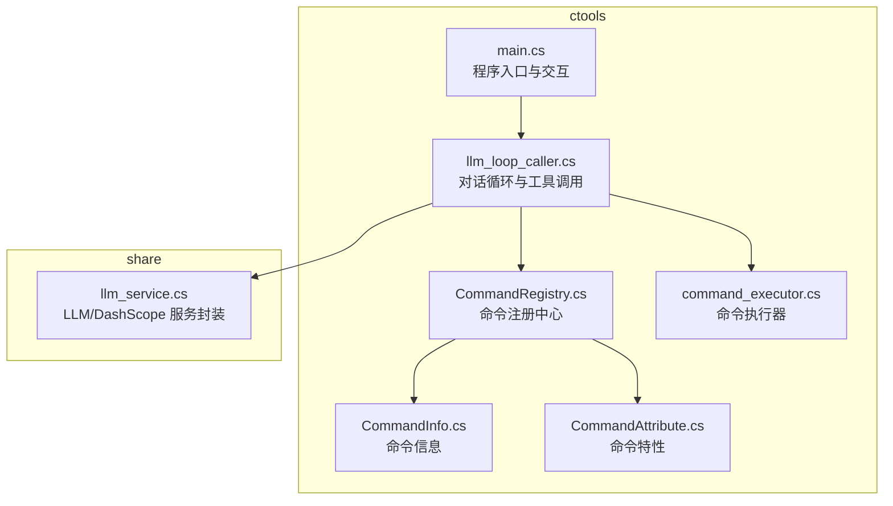
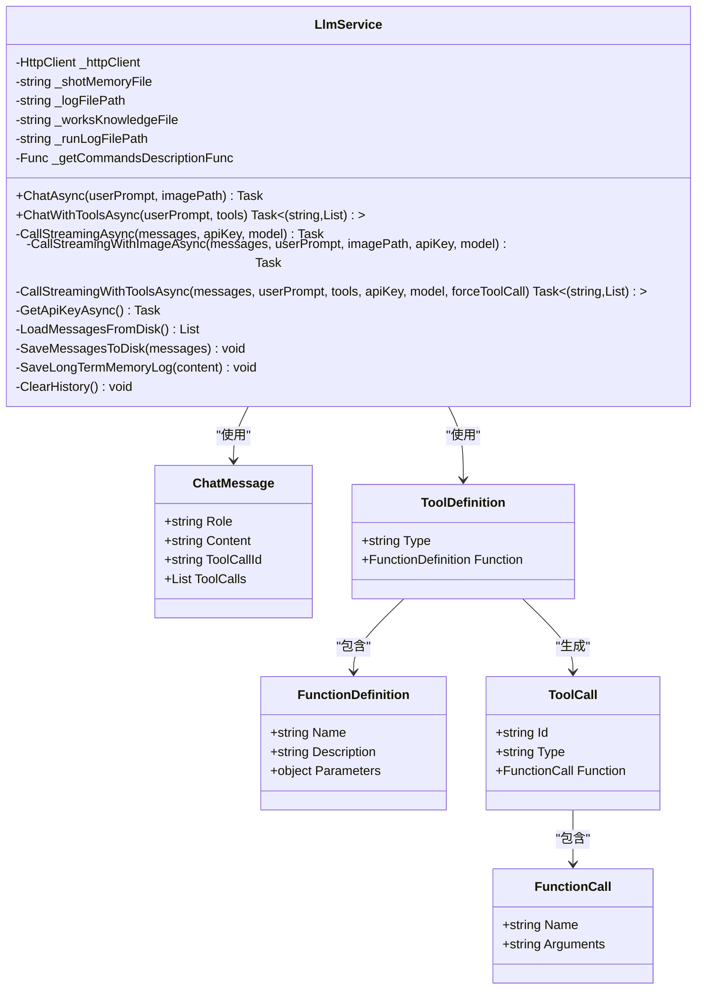
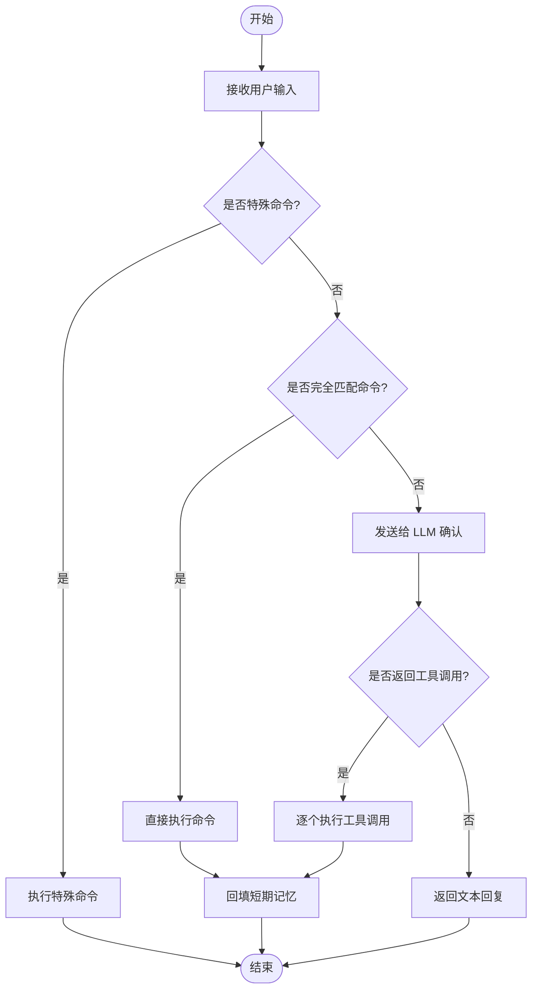
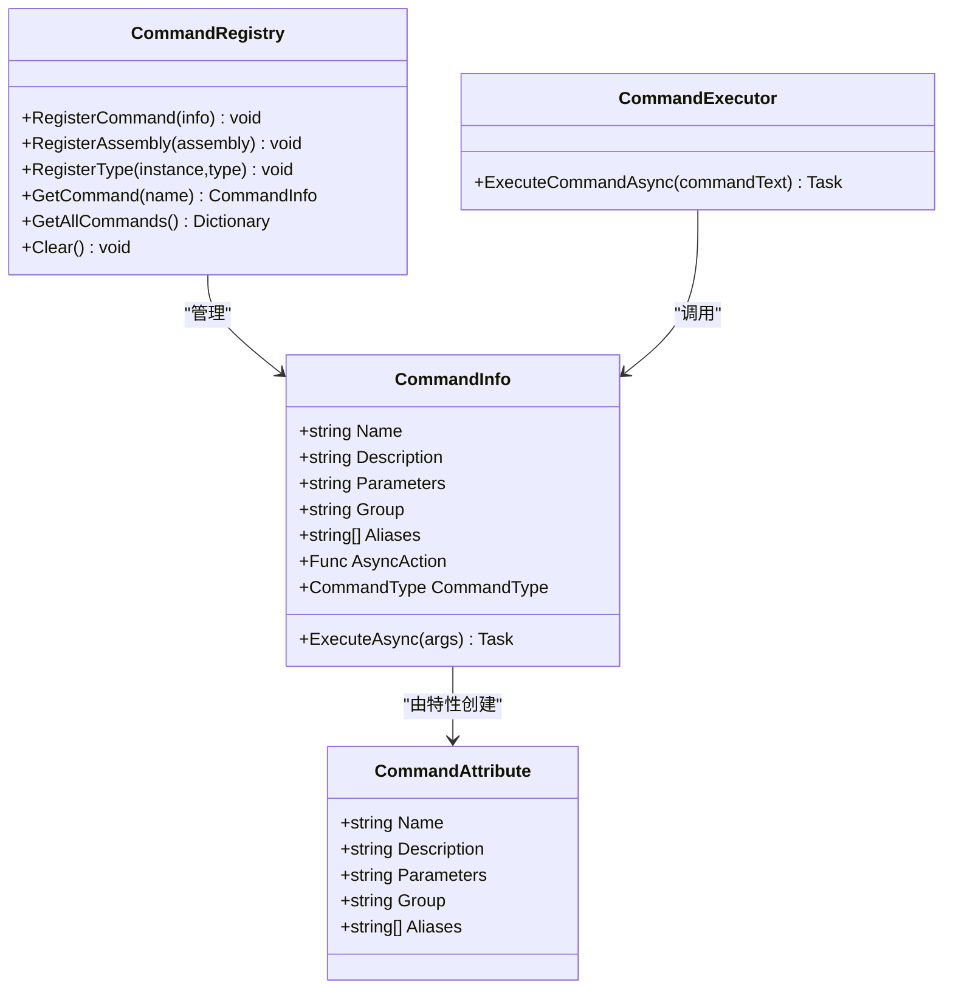
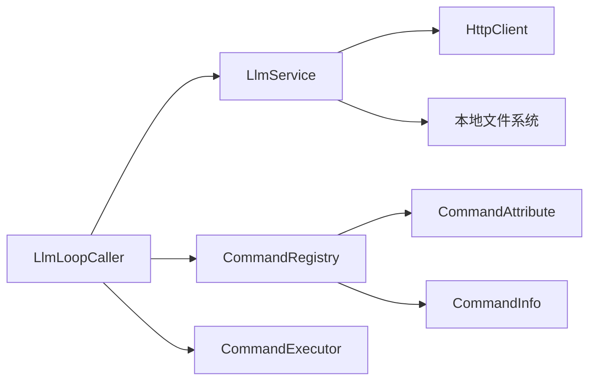

# LLM 服务集成

<cite>
**本文引用的文件**
- [llm_service.cs](file://share/nomal/llm_service.cs)
- [llm_loop_caller.cs](file://ctools/llm_loop_caller.cs)
- [main.cs](file://ctools/main.cs)
- [CommandInfo.cs](file://ctools/CommandInfo.cs)
- [CommandAttribute.cs](file://ctools/CommandAttribute.cs)
- [CommandRegistry.cs](file://ctools/CommandRegistry.cs)
- [command_executor.cs](file://ctools/command_executor.cs)
- [part_commands.cs](file://ctools/solidworks_commands/part_commands.cs)
- [README.md](file://README.md)
</cite>

## 目录
1. [简介](#简介)
2. [项目结构](#项目结构)
3. [核心组件](#核心组件)
4. [架构总览](#架构总览)
5. [详细组件分析](#详细组件分析)
6. [依赖关系分析](#依赖关系分析)
7. [性能考量](#性能考量)
8. [故障排查指南](#故障排查指南)
9. [结论](#结论)
10. [附录](#附录)

## 简介
本文件面向开发者，系统化说明基于 DashScope（阿里云通义千问）的 LLM 服务集成规范，涵盖认证配置、请求格式、响应处理、消息格式与角色定义、参数配置、错误处理与重试策略、API 密钥管理、请求超时设置与网络异常处理策略，并提供可落地的集成示例与配置指南，帮助快速正确地在 SolidWorks 生态中集成 LLM 能力。

## 项目结构
本项目围绕“ctools”命令行工具与“share”功能库组织，其中 LLM 服务集成集中在 share/nomal/llm_service.cs，对话循环与工具调用由 ctools/llm_loop_caller.cs 驱动，命令注册与解析由 ctools/CommandRegistry.cs、CommandInfo.cs、CommandAttribute.cs 等组件支撑，最终通过 command_executor.cs 与 SolidWorks 交互。



图表来源
- [main.cs:54-109](file://ctools/main.cs#L54-L109)
- [llm_loop_caller.cs:44-67](file://ctools/llm_loop_caller.cs#L44-L67)
- [llm_service.cs:18-53](file://share/nomal/llm_service.cs#L18-L53)
- [CommandRegistry.cs:12-27](file://ctools/CommandRegistry.cs#L12-L27)
- [CommandInfo.cs:17-40](file://ctools/CommandInfo.cs#L17-L40)
- [CommandAttribute.cs:5-18](file://ctools/CommandAttribute.cs#L5-L18)
- [command_executor.cs:12-26](file://ctools/command_executor.cs#L12-L26)

章节来源
- [README.md:193-249](file://README.md#L193-L249)

## 核心组件
- LlmService：封装 DashScope API 调用，支持纯文本对话、图像理解（VLM）与工具调用（Function Calling）。负责认证、请求构建、流式/非流式响应解析、消息历史与长期记忆管理。
- LlmLoopCaller：交互式对话循环，将自然语言转换为工具调用或直接命令执行，支持确认模式、历史查看、重复执行等。
- CommandRegistry/CommandInfo/CommandAttribute：命令注册与元数据管理，支持命令别名、分组、参数描述与异步/同步类型。
- CommandExecutor：解析命令文本，解析参数，调用对应命令实现，与 SolidWorks 交互。
- main.cs：程序入口，负责注册命令、连接 SolidWorks、启动交互式对话循环。

章节来源
- [llm_service.cs:18-1181](file://share/nomal/llm_service.cs#L18-L1181)
- [llm_loop_caller.cs:19-726](file://ctools/llm_loop_caller.cs#L19-L726)
- [CommandRegistry.cs:12-242](file://ctools/CommandRegistry.cs#L12-L242)
- [CommandInfo.cs:17-40](file://ctools/CommandInfo.cs#L17-L40)
- [CommandAttribute.cs:5-18](file://ctools/CommandAttribute.cs#L5-L18)
- [command_executor.cs:12-116](file://ctools/command_executor.cs#L12-L116)
- [main.cs:54-109](file://ctools/main.cs#L54-L109)

## 架构总览
整体流程：用户输入 → LlmLoopCaller 解析/路由 → LlmService 调用 DashScope API → 流式/非流式响应解析 → 结果回传；若检测到工具调用，则由 LlmLoopCaller 调用 CommandExecutor 执行 SolidWorks 命令。

```mermaid
sequenceDiagram
participant U as "用户"
participant LOOP as "LlmLoopCaller"
participant LLM as "LlmService"
participant DS as "DashScope API"
participant EX as "CommandExecutor"
U->>LOOP : 输入自然语言/命令
alt 工具调用模式
LOOP->>LLM : ChatWithToolsAsync(消息, 工具列表)
LLM->>DS : POST /compatible-mode/v1/chat/completions
DS-->>LLM : choices[0].message.tool_calls
LLM-->>LOOP : (工具调用列表)
loop 逐个工具调用
LOOP->>EX : ExecuteCommandAsync(命令名, 参数)
EX-->>LOOP : 执行结果
end
LOOP-->>U : 工具执行结果汇总
else 纯文本模式
LOOP->>LLM : ChatAsync(消息)
LLM->>DS : POST /compatible-mode/v1/chat/completions
DS-->>LLM : 流式/非流式文本
LLM-->>LOOP : 文本回复
LOOP-->>U : 文本回复
end
```

图表来源
- [llm_loop_caller.cs:666-726](file://ctools/llm_loop_caller.cs#L666-L726)
- [llm_service.cs:988-1144](file://share/nomal/llm_service.cs#L988-L1144)
- [command_executor.cs:32-113](file://ctools/command_executor.cs#L32-L113)

## 详细组件分析

### LlmService（DashScope 集成）
- 认证配置
  - 优先从环境变量读取 API Key（DASHSCOPE_API_KEY），未设置时提示用户输入，为空则抛出异常。
  - 请求头统一设置 Authorization: Bearer {apiKey}。
- 请求格式
  - 默认模型：qwen3.5-flash。
  - 请求 URL：/compatible-mode/v1/chat/completions（OpenAI 兼容格式）。
  - 消息结构：role（system/user/assistant/tool/function）、content（文本或工具调用信息）。
  - 工具调用：tools 数组 + tool_choice（可选 required）。
  - 图像请求：messages 中 user 消息的 content 为包含 text 与 image_url 的数组。
- 响应处理
  - 流式响应：逐行解析 data: 开头的 JSON，提取 choices[0].delta.content，遇到 [DONE] 结束。
  - 非流式响应：解析 choices[0].message.tool_calls 或 content。
  - 错误处理：非 200 状态码读取响应体并抛出异常；网络异常捕获 HttpRequestException/TaskCanceledException。
- 消息历史与记忆
  - 短期记忆：本地 JSON 文件，最多保留最近 10 条，过滤非法 role。
  - 长期记忆：文本日志文件，追加保存。
- 超时与重试
  - HttpClient.Timeout 默认 5 分钟；未实现自动重试逻辑，建议调用方在业务层实现指数退避重试。



图表来源
- [llm_service.cs:18-1181](file://share/nomal/llm_service.cs#L18-L1181)

章节来源
- [llm_service.cs:20-53](file://share/nomal/llm_service.cs#L20-L53)
- [llm_service.cs:461-480](file://share/nomal/llm_service.cs#L461-L480)
- [llm_service.cs:909-923](file://share/nomal/llm_service.cs#L909-L923)
- [llm_service.cs:928-983](file://share/nomal/llm_service.cs#L928-L983)
- [llm_service.cs:988-1144](file://share/nomal/llm_service.cs#L988-L1144)
- [llm_service.cs:1186-1281](file://share/nomal/llm_service.cs#L1186-L1281)

### LlmLoopCaller（对话循环与工具调用）
- 交互式循环：支持 quit/exit、clear、mode、history、last、llm 等特殊命令；模糊匹配命令名与别名；完全匹配直接执行，模糊匹配交给 LLM 确认。
- 工具调用：从 CommandRegistry 获取命令集合，构建 ToolDefinition 列表；调用 LlmService.ChatWithToolsAsync；执行 ToolCall 并将结果回填短期记忆。
- 命令执行：通过 CommandExecutor 执行命令，拦截 Console 输出，支持确认模式与自动模式切换。



图表来源
- [llm_loop_caller.cs:493-726](file://ctools/llm_loop_caller.cs#L493-L726)

章节来源
- [llm_loop_caller.cs:44-67](file://ctools/llm_loop_caller.cs#L44-L67)
- [llm_loop_caller.cs:117-172](file://ctools/llm_loop_caller.cs#L117-L172)
- [llm_loop_caller.cs:177-288](file://ctools/llm_loop_caller.cs#L177-L288)
- [llm_loop_caller.cs:493-726](file://ctools/llm_loop_caller.cs#L493-L726)

### 命令系统（注册与执行）
- 命令特性：CommandAttribute 定义命令名称、描述、参数、分组与别名。
- 注册中心：CommandRegistry 单例，支持从程序集反射注册命令，维护命令名与别名映射。
- 命令信息：CommandInfo 包含名称、描述、参数、分组、别名、异步/同步类型及执行方法。
- 执行器：CommandExecutor 解析命令文本与参数，调用 CommandInfo.AsyncAction，与 SolidWorks 交互。



图表来源
- [CommandAttribute.cs:5-18](file://ctools/CommandAttribute.cs#L5-L18)
- [CommandInfo.cs:17-40](file://ctools/CommandInfo.cs#L17-L40)
- [CommandRegistry.cs:12-242](file://ctools/CommandRegistry.cs#L12-L242)
- [command_executor.cs:12-116](file://ctools/command_executor.cs#L12-L116)

章节来源
- [CommandAttribute.cs:5-18](file://ctools/CommandAttribute.cs#L5-L18)
- [CommandInfo.cs:17-40](file://ctools/CommandInfo.cs#L17-L40)
- [CommandRegistry.cs:12-242](file://ctools/CommandRegistry.cs#L12-L242)
- [command_executor.cs:12-116](file://ctools/command_executor.cs#L12-L116)

### 程序入口与集成
- main.cs：启动交互式对话模式，连接 SolidWorks，初始化全局命令注册中心，创建 LlmLoopCaller 并运行交互循环。
- 示例命令：exportdxf、get_thickness 等，展示命令注册与执行方式。

章节来源
- [main.cs:54-109](file://ctools/main.cs#L54-L109)
- [part_commands.cs:11-149](file://ctools/solidworks_commands/part_commands.cs#L11-L149)

## 依赖关系分析
- LlmLoopCaller 依赖 LlmService（LLM/DashScope 调用）、CommandRegistry（命令发现）、CommandExecutor（命令执行）。
- LlmService 依赖 HttpClient、Newtonsoft.Json、本地文件系统（短期/长期记忆）。
- 命令系统相互独立，通过 CommandRegistry 协同。



图表来源
- [llm_loop_caller.cs:44-67](file://ctools/llm_loop_caller.cs#L44-L67)
- [llm_service.cs:25-53](file://share/nomal/llm_service.cs#L25-L53)
- [CommandRegistry.cs:12-27](file://ctools/CommandRegistry.cs#L12-L27)
- [CommandInfo.cs:17-40](file://ctools/CommandInfo.cs#L17-L40)
- [CommandAttribute.cs:5-18](file://ctools/CommandAttribute.cs#L5-L18)
- [command_executor.cs:12-26](file://ctools/command_executor.cs#L12-L26)

## 性能考量
- 流式响应：逐行解析，边到边输出，降低首字延迟。
- 消息截断：短期记忆最多 10 条，避免上下文过长影响性能。
- 超时设置：HttpClient.Timeout 默认 5 分钟，适合长对话与大模型推理。
- 建议：在调用方实现指数退避重试；对高频工具调用进行并发限制；对图像请求进行尺寸与格式校验以减少带宽。

[本节为通用指导，无需列出章节来源]

## 故障排查指南
- API Key 未设置
  - 现象：启动即提示未找到 DASHSCOPE_API_KEY，要求输入临时 Key。
  - 处理：设置环境变量 DASHSCOPE_API_KEY 或在交互中输入。
- 网络异常
  - 现象：HttpRequestException/TaskCanceledException，可能因超时或 DNS 失败。
  - 处理：检查网络连通性、代理设置；增加重试与超时时间。
- 非 200 响应
  - 现象：读取响应体并抛出异常，包含错误信息。
  - 处理：根据错误信息调整请求参数或模型。
- 工具调用未返回
  - 现象：强制工具调用模式下返回文本而非 tool_calls。
  - 处理：调整提示词与工具定义，确保模型理解意图。

章节来源
- [llm_service.cs:461-480](file://share/nomal/llm_service.cs#L461-L480)
- [llm_service.cs:757-790](file://share/nomal/llm_service.cs#L757-L790)
- [llm_service.cs:800-813](file://share/nomal/llm_service.cs#L800-L813)
- [llm_service.cs:1135-1141](file://share/nomal/llm_service.cs#L1135-L1141)

## 结论
本项目以 LlmService 为核心，结合 LlmLoopCaller 的对话与工具调用能力，实现了与 DashScope 的稳定集成。通过命令注册与执行体系，将自然语言与工具调用无缝衔接至 SolidWorks 操作，具备良好的扩展性与可维护性。建议在生产环境中补充完善的重试与熔断策略、密钥轮换与审计日志，以提升稳定性与安全性。

[本节为总结性内容，无需列出章节来源]

## 附录

### API 规范摘要
- 服务端点
  - URL：/compatible-mode/v1/chat/completions
  - 方法：POST
  - 头部：Authorization: Bearer {apiKey}
- 请求体字段
  - model：模型名称（默认 qwen3.5-flash）
  - stream：是否流式（true/false）
  - messages：消息数组（role/content）
  - tools：工具定义数组（可选）
  - tool_choice：工具选择策略（可选 required）
  - image 请求：messages 中 user 消息的 content 为包含 text 与 image_url 的数组
- 响应字段
  - choices[0].delta.content（流式）
  - choices[0].message.tool_calls（工具调用）
  - choices[0].message.content（文本回复）
  - error.message（错误信息）

章节来源
- [llm_service.cs:23](file://share/nomal/llm_service.cs#L23)
- [llm_service.cs:909-923](file://share/nomal/llm_service.cs#L909-L923)
- [llm_service.cs:928-983](file://share/nomal/llm_service.cs#L928-L983)
- [llm_service.cs:988-1144](file://share/nomal/llm_service.cs#L988-L1144)

### 消息格式与角色定义
- 角色
  - system：系统提示词，用于设定行为与规则
  - user：用户输入
  - assistant：模型回复
  - tool/function：工具调用或函数定义
- 内容结构
  - 文本：字符串
  - 工具调用：包含 id、type、function.name/arguments
  - 图像：content 为包含 text 与 image_url 的数组

章节来源
- [llm_service.cs:1267-1281](file://share/nomal/llm_service.cs#L1267-L1281)
- [llm_service.cs:1186-1262](file://share/nomal/llm_service.cs#L1186-L1262)

### 参数配置与最佳实践
- API 密钥管理
  - 优先使用环境变量 DASHSCOPE_API_KEY；未设置时交互输入。
  - 建议在部署环境配置密钥，避免硬编码。
- 请求超时
  - HttpClient.Timeout 默认 5 分钟；根据模型与网络状况调整。
- 错误处理与重试
  - 未内置自动重试；建议在调用方实现指数退避重试。
- 网络异常处理
  - 捕获 HttpRequestException/TaskCanceledException 并记录详细日志。
- 工具调用
  - 使用 tool_choice: required 强制工具调用；确保工具定义与参数描述准确。
  - 将工具执行结果回填短期记忆，增强上下文连贯性。

章节来源
- [llm_service.cs:461-480](file://share/nomal/llm_service.cs#L461-L480)
- [llm_service.cs:757-790](file://share/nomal/llm_service.cs#L757-L790)
- [llm_service.cs:1070-1075](file://share/nomal/llm_service.cs#L1070-L1075)
- [llm_loop_caller.cs:686-701](file://ctools/llm_loop_caller.cs#L686-L701)

### 集成示例与配置指南
- 启动交互式对话
  - 运行 ctool.exe，自动连接 SolidWorks，进入交互循环。
  - 支持直接命令执行与自然语言模式。
- 注册命令
  - 使用 [Command] 特性标注静态方法，自动注册到 CommandRegistry。
  - 示例：exportdxf、get_thickness 等。
- 工具调用
  - LlmLoopCaller 将命令集合转换为 ToolDefinition 列表，交由 LlmService 调用 DashScope。
  - 工具执行结果回填短期记忆，便于后续对话。

章节来源
- [main.cs:54-109](file://ctools/main.cs#L54-L109)
- [part_commands.cs:11-149](file://ctools/solidworks_commands/part_commands.cs#L11-L149)
- [llm_loop_caller.cs:504-507](file://ctools/llm_loop_caller.cs#L504-L507)
- [llm_loop_caller.cs:666-726](file://ctools/llm_loop_caller.cs#L666-L726)