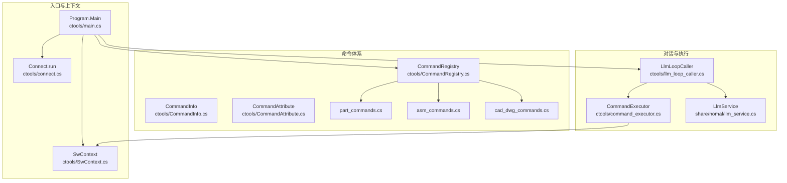
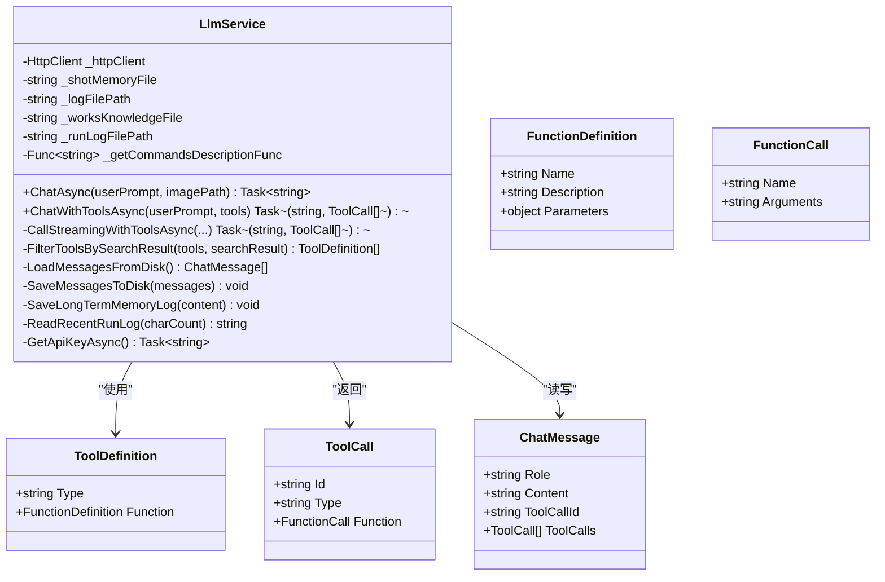
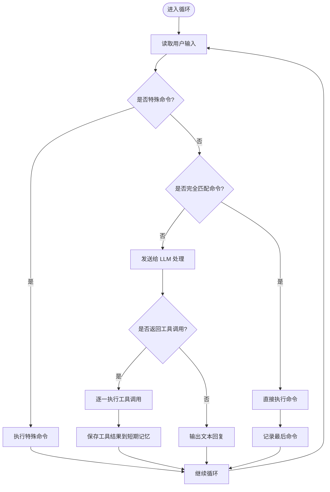
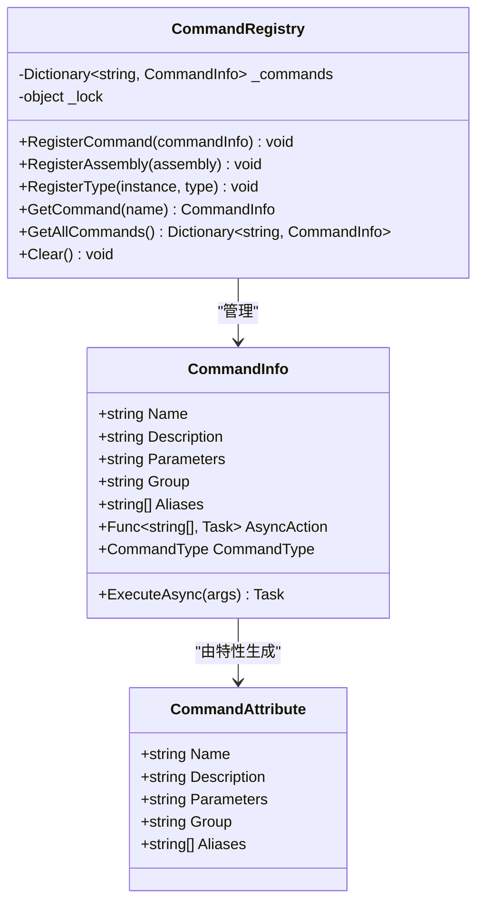
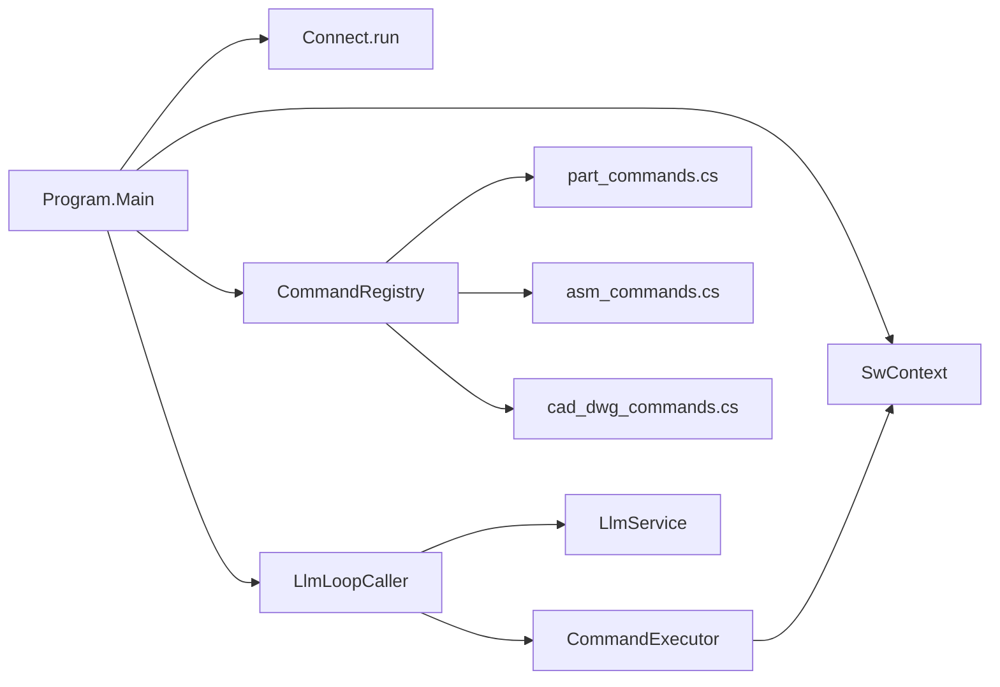

# 对话管理

<cite>
**本文引用的文件**
- [llm_service.cs](file://share/nomal/llm_service.cs)
- [llm_loop_caller.cs](file://ctools/llm_loop_caller.cs)
- [command_executor.cs](file://ctools/command_executor.cs)
- [CommandRegistry.cs](file://ctools/CommandRegistry.cs)
- [CommandInfo.cs](file://ctools/CommandInfo.cs)
- [CommandAttribute.cs](file://ctools/CommandAttribute.cs)
- [main.cs](file://ctools/main.cs)
- [SwContext.cs](file://ctools/SwContext.cs)
- [connect.cs](file://ctools/connect.cs)
- [part_commands.cs](file://ctools/solidworks_commands/part_commands.cs)
- [asm_commands.cs](file://ctools/solidworks_commands/asm_commands.cs)
- [cad_dwg_commands.cs](file://ctools/cad_dwg_commands.cs)
- [Clipboard.cs](file://share/nomal/Clipboard.cs)
- [Profiler.cs](file://share/nomal/Profiler.cs)
</cite>

## 目录
1. [简介](#简介)
2. [项目结构](#项目结构)
3. [核心组件](#核心组件)
4. [架构总览](#架构总览)
5. [详细组件分析](#详细组件分析)
6. [依赖关系分析](#依赖关系分析)
7. [性能考量](#性能考量)
8. [故障排查指南](#故障排查指南)
9. [结论](#结论)
10. [附录](#附录)

## 简介
本文件系统化阐述对话管理系统的 API 规范与实现机制，覆盖以下要点：
- 交互式循环模式：用户输入处理、对话历史管理、状态维护与特殊命令系统
- 对话上下文管理：短期记忆（本地 JSON）、长期存储（日志文件）、上下文窗口管理
- 对话安全机制：API Key 获取与校验、输入合法性检查、异常隔离
- 会话管理与性能优化：并发控制、流式响应、缓存与截断策略
- 历史记录持久化、会话恢复与并发控制：文件锁与线程安全

## 项目结构
该系统围绕“命令注册中心 + LLM 循环调用器 + LLM 服务 + 命令执行器”的分层设计组织，入口程序负责连接 SolidWorks、注册命令并启动交互式循环。



**图表来源**
- [main.cs:54-109](file://ctools/main.cs#L54-L109)
- [SwContext.cs:9-85](file://ctools/SwContext.cs#L9-L85)
- [connect.cs:9-55](file://ctools/connect.cs#L9-L55)
- [CommandRegistry.cs:12-241](file://ctools/CommandRegistry.cs#L12-L241)
- [CommandInfo.cs:17-40](file://ctools/CommandInfo.cs#L17-L40)
- [CommandAttribute.cs:5-19](file://ctools/CommandAttribute.cs#L5-L19)
- [part_commands.cs:11-149](file://ctools/solidworks_commands/part_commands.cs#L11-L149)
- [asm_commands.cs:11-158](file://ctools/solidworks_commands/asm_commands.cs#L11-L158)
- [cad_dwg_commands.cs:9-78](file://ctools/cad_dwg_commands.cs#L9-L78)
- [llm_loop_caller.cs:19-67](file://ctools/llm_loop_caller.cs#L19-L67)
- [command_executor.cs:12-26](file://ctools/command_executor.cs#L12-L26)
- [llm_service.cs:18-53](file://share/nomal/llm_service.cs#L18-L53)

**章节来源**
- [main.cs:54-109](file://ctools/main.cs#L54-L109)
- [CommandRegistry.cs:12-241](file://ctools/CommandRegistry.cs#L12-L241)
- [llm_loop_caller.cs:19-67](file://ctools/llm_loop_caller.cs#L19-L67)
- [llm_service.cs:18-53](file://share/nomal/llm_service.cs#L18-L53)

## 核心组件
- LlmService：封装 DashScope API 调用、流式响应、工具调用、短期/长期记忆持久化、系统提示构建与运行日志读取。
- LlmLoopCaller：交互式循环模式的控制器，负责特殊命令解析、模糊匹配、工具调用执行、历史记录查看与模式切换。
- CommandRegistry：全局命令注册中心，支持特性扫描注册、别名映射、并发安全访问。
- CommandExecutor：命令执行器，解析命令与参数、连接 SolidWorks、执行命令并捕获控制台输出。
- Program.Main：应用入口，负责连接 SolidWorks、注册命令、初始化上下文并启动交互循环。

**章节来源**
- [llm_service.cs:18-1181](file://share/nomal/llm_service.cs#L18-L1181)
- [llm_loop_caller.cs:19-1029](file://ctools/llm_loop_caller.cs#L19-L1029)
- [CommandRegistry.cs:12-241](file://ctools/CommandRegistry.cs#L12-L241)
- [command_executor.cs:12-116](file://ctools/command_executor.cs#L12-L116)
- [main.cs:54-109](file://ctools/main.cs#L54-L109)

## 架构总览
对话管理采用“命令驱动 + LLM 辅助”的双通道模式：
- 命令通道：完全匹配或模糊匹配后直接执行，适合确定性操作。
- LLM 通道：自然语言输入经系统提示与工具列表增强后，由模型决定是否调用工具或返回文本。

```mermaid
sequenceDiagram
participant U as "用户"
participant Loop as "LlmLoopCaller"
participant Reg as "CommandRegistry"
participant Exec as "CommandExecutor"
participant LLM as "LlmService"
participant API as "DashScope API"
U->>Loop : 输入问题/命令
alt 特殊命令
Loop->>Loop : 解析并执行特殊命令
else 命令完全匹配
Loop->>Exec : 执行命令
Exec-->>Loop : 结果+控制台输出
else LLM 工具调用
Loop->>LLM : ChatWithToolsAsync(消息+工具)
LLM->>API : 流式/非流式请求
API-->>LLM : 响应(文本/工具调用)
LLM-->>Loop : (文本, 工具调用列表)
loop 对每个工具调用
Loop->>Exec : ExecuteToolCallAsync
Exec-->>Loop : 结果+控制台输出
end
end
Loop->>Loop : 更新短期记忆/长期日志
Loop-->>U : 输出结果
```

**图表来源**
- [llm_loop_caller.cs:493-726](file://ctools/llm_loop_caller.cs#L493-L726)
- [llm_service.cs:547-614](file://share/nomal/llm_service.cs#L547-L614)
- [command_executor.cs:32-113](file://ctools/command_executor.cs#L32-L113)
- [CommandRegistry.cs:113-142](file://ctools/CommandRegistry.cs#L113-L142)

## 详细组件分析

### LlmService：对话与记忆管理
- 对话接口
  - ChatAsync：纯文本对话，支持流式输出；构建系统提示（含相关命令与最近运行日志），追加用户与助手消息至短期记忆并持久化。
  - ChatWithToolsAsync：工具调用模式，先检索相关命令，再筛选工具列表，强制工具调用或返回文本。
- 工具调用
  - CallStreamingWithToolsAsync：构造工具定义与参数结构，发送请求并解析 choices/message/tool_calls。
  - FilterToolsBySearchResult：基于搜索结果提取匹配命令名，必要时注入“未匹配到命令”的提示工具。
- 记忆与日志
  - LoadMessagesFromDisk/SaveMessagesToDisk：短期记忆 JSON，最多保留最近 10 条消息（5 轮）。
  - SaveLongTermMemoryLog：长期日志文件，追加带时间戳的内容。
  - ReadRecentRunLog：从运行日志文件末尾读取指定字符数内容，用于系统提示增强。
- 安全与健壮性
  - GetApiKeyAsync：优先从环境变量读取，否则提示输入；空值抛出异常。
  - 流式响应处理：逐行解析 data: ... 与 [DONE]，异常时抛出并记录错误。
  - 严格角色过滤：仅保留 user/assistant/tool/function 合法角色。



**图表来源**
- [llm_service.cs:18-1181](file://share/nomal/llm_service.cs#L18-L1181)

**章节来源**
- [llm_service.cs:547-614](file://share/nomal/llm_service.cs#L547-L614)
- [llm_service.cs:988-1144](file://share/nomal/llm_service.cs#L988-L1144)
- [llm_service.cs:58-114](file://share/nomal/llm_service.cs#L58-L114)
- [llm_service.cs:1149-1161](file://share/nomal/llm_service.cs#L1149-L1161)
- [llm_service.cs:395-456](file://share/nomal/llm_service.cs#L395-L456)
- [llm_service.cs:461-480](file://share/nomal/llm_service.cs#L461-L480)

### LlmLoopCaller：交互循环与特殊命令
- 交互循环
  - InteractiveLoopAsync：持续读取用户输入，支持 quit/exit、clear、mode、history、last、llm 等特殊命令；对完全匹配命令直接执行，模糊匹配交由 LLM 处理。
- 特殊命令系统
  - 退出：quit/exit
  - 清空：clear（委托 LlmService 清空短期记忆）
  - 模式切换：mode（确认/自动）
  - 查看历史：history（读取并打印短期记忆）
  - 重复上次命令：last（读取 last_command.txt 并二次确认）
  - 纯 LLM 模式：llm（进入 ChatAsync 循环）
- 工具调用执行
  - ExecuteToolCallAsync：解析函数名与参数，拦截 Console 输出，按需等待用户确认，执行后记录结果与最后命令。
- 命令匹配
  - FindFuzzyCommand：优先“命令名+参数”完全匹配，其次基于名称/别名/描述的模糊匹配，结合相似度阈值与字符集重叠评分。
- 历史与状态
  - ViewHistory：读取 shot_memory.json 并格式化输出。
  - LoadMessagesFromDisk/SaveMessagesToDisk：与 LlmService 共享短期记忆文件。
  - SaveToolResultsToMemory：将工具调用结果以 user 消息形式写入短期记忆，便于后续上下文补充。



**图表来源**
- [llm_loop_caller.cs:493-726](file://ctools/llm_loop_caller.cs#L493-L726)
- [llm_loop_caller.cs:177-288](file://ctools/llm_loop_caller.cs#L177-L288)
- [llm_loop_caller.cs:580-661](file://ctools/llm_loop_caller.cs#L580-L661)

**章节来源**
- [llm_loop_caller.cs:493-726](file://ctools/llm_loop_caller.cs#L493-L726)
- [llm_loop_caller.cs:177-288](file://ctools/llm_loop_caller.cs#L177-L288)
- [llm_loop_caller.cs:580-661](file://ctools/llm_loop_caller.cs#L580-L661)
- [llm_loop_caller.cs:922-963](file://ctools/llm_loop_caller.cs#L922-L963)

### CommandRegistry 与命令体系
- 注册与发现
  - RegisterAssembly/.RegisterType：扫描 [Command] 特性，动态构建 CommandInfo，支持同步/异步方法。
  - GetCommand/GetAllCommands：线程安全的命令查询与导出。
  - RegisterCommand：支持别名注册，统一映射到同一 CommandInfo。
- 命令元信息
  - CommandInfo：包含名称、描述、参数、分组、别名、执行委托与类型。
  - CommandAttribute：声明命令元信息（名称、描述、参数、分组、别名）。



**图表来源**
- [CommandRegistry.cs:12-241](file://ctools/CommandRegistry.cs#L12-L241)
- [CommandInfo.cs:17-40](file://ctools/CommandInfo.cs#L17-L40)
- [CommandAttribute.cs:5-19](file://ctools/CommandAttribute.cs#L5-L19)

**章节来源**
- [CommandRegistry.cs:12-241](file://ctools/CommandRegistry.cs#L12-L241)
- [CommandInfo.cs:17-40](file://ctools/CommandInfo.cs#L17-L40)
- [CommandAttribute.cs:5-19](file://ctools/CommandAttribute.cs#L5-L19)

### CommandExecutor：命令执行器
- 解析与执行
  - ExecuteCommandAsync：拆分命令与参数，解析 CommandInfo，连接 SolidWorks，执行异步动作，捕获控制台输出并返回结果。
- 安全与健壮性
  - 空输入与未知命令检测。
  - SolidWorks 连接状态检查与活动文档刷新。
  - 异常捕获与堆栈输出。

**章节来源**
- [command_executor.cs:32-113](file://ctools/command_executor.cs#L32-L113)

### Program.Main：入口与上下文
- 入口流程
  - 连接 SolidWorks，初始化 SwContext，注册命令（反射扫描 + 全局注册中心），启动 LlmLoopCaller 交互循环。
- 命令描述生成
  - GetCommandsDescriptionContent：实时生成命令列表与分组、参数说明，供 LLM 检索增强。

**章节来源**
- [main.cs:54-109](file://ctools/main.cs#L54-L109)
- [main.cs:114-145](file://ctools/main.cs#L114-L145)

### SwContext 与 Connect：会话与连接
- SwContext：全局单例，持有 SldWorks 与当前 ModelDoc2，提供线程安全的读写访问。
- Connect.run：跨平台检查，尝试获取已运行实例或创建新实例，异常时输出错误信息。

**章节来源**
- [SwContext.cs:9-85](file://ctools/SwContext.cs#L9-L85)
- [connect.cs:9-55](file://ctools/connect.cs#L9-L55)

### 示例：多轮对话与状态保持
- 场景目标：用户通过自然语言表达需求，系统自动识别并调用命令；同时支持直接输入命令名或参数。
- 关键步骤
  - 用户输入自然语言 → LlmLoopCaller 模糊匹配 → 若未完全匹配 → LlmService.ChatWithToolsAsync → DashScope 返回工具调用 → LlmLoopCaller.ExecuteToolCallAsync → CommandExecutor 执行 → 结果写入短期记忆 → 输出反馈。
  - 用户输入命令名 → LlmLoopCaller.FindFuzzyCommand → 完全匹配 → 直接执行 → 记录最后命令与短期记忆。
  - 用户输入 clear/history/mode/last → LlmLoopCaller 内部处理，不进入 LLM 流程。

```mermaid
sequenceDiagram
participant U as "用户"
participant Loop as "LlmLoopCaller"
participant LLM as "LlmService"
participant Exec as "CommandExecutor"
participant REG as "CommandRegistry"
U->>Loop : "导出当前零件"
Loop->>REG : 查找命令
REG-->>Loop : 命令信息
alt 完全匹配
Loop->>Exec : ExecuteCommandAsync
Exec-->>Loop : 结果
else 模糊匹配
Loop->>LLM : ChatWithToolsAsync
LLM-->>Loop : 工具调用
Loop->>Exec : ExecuteToolCallAsync
Exec-->>Loop : 结果
end
Loop->>Loop : 保存短期记忆/最后命令
Loop-->>U : 输出结果
```

**图表来源**
- [llm_loop_caller.cs:580-726](file://ctools/llm_loop_caller.cs#L580-L726)
- [llm_service.cs:547-614](file://share/nomal/llm_service.cs#L547-L614)
- [command_executor.cs:32-113](file://ctools/command_executor.cs#L32-L113)
- [CommandRegistry.cs:113-142](file://ctools/CommandRegistry.cs#L113-L142)

## 依赖关系分析
- 组件耦合
  - LlmLoopCaller 依赖 LlmService（对话）、CommandRegistry（命令发现）、CommandExecutor（执行）。
  - CommandExecutor 依赖 SwContext（SolidWorks 实例与模型）。
  - Program.Main 负责装配上述组件并启动循环。
- 外部依赖
  - DashScope API（兼容 OpenAI 格式）。
  - SolidWorks COM 接口。
  - 文件系统（短期记忆 JSON、长期日志、最后命令文件）。



**图表来源**
- [main.cs:54-109](file://ctools/main.cs#L54-L109)
- [llm_loop_caller.cs:19-67](file://ctools/llm_loop_caller.cs#L19-L67)
- [command_executor.cs:12-26](file://ctools/command_executor.cs#L12-L26)
- [SwContext.cs:9-85](file://ctools/SwContext.cs#L9-L85)
- [CommandRegistry.cs:12-241](file://ctools/CommandRegistry.cs#L12-L241)
- [part_commands.cs:11-149](file://ctools/solidworks_commands/part_commands.cs#L11-L149)
- [asm_commands.cs:11-158](file://ctools/solidworks_commands/asm_commands.cs#L11-L158)
- [cad_dwg_commands.cs:9-78](file://ctools/cad_dwg_commands.cs#L9-L78)

**章节来源**
- [main.cs:54-109](file://ctools/main.cs#L54-L109)
- [llm_loop_caller.cs:19-67](file://ctools/llm_loop_caller.cs#L19-L67)
- [command_executor.cs:12-26](file://ctools/command_executor.cs#L12-L26)
- [SwContext.cs:9-85](file://ctools/SwContext.cs#L9-L85)
- [CommandRegistry.cs:12-241](file://ctools/CommandRegistry.cs#L12-L241)

## 性能考量
- 流式响应：LlmService.CallStreamingCoreAsync 逐行解析流式数据，边接收边输出，降低首字延迟。
- 工具调用优化：ChatWithToolsAsync 强制工具调用，减少无效文本往返；仅传递匹配工具集合，缩小上下文。
- 截断与窗口管理：短期记忆最多 10 条（5 轮），避免上下文过长影响成本与速度。
- 并发与线程安全：CommandRegistry 使用锁保护命令字典；SwContext 使用锁保护全局实例。
- 性能监控：Profiler 工具用于方法耗时统计，配合 [Profiled] 特性标注。

**章节来源**
- [llm_service.cs:815-896](file://share/nomal/llm_service.cs#L815-L896)
- [llm_service.cs:988-1144](file://share/nomal/llm_service.cs#L988-L1144)
- [llm_service.cs:92-114](file://share/nomal/llm_service.cs#L92-L114)
- [CommandRegistry.cs:34-55](file://ctools/CommandRegistry.cs#L34-L55)
- [SwContext.cs:33-44](file://ctools/SwContext.cs#L33-L44)
- [Profiler.cs:6-27](file://share/nomal/Profiler.cs#L6-L27)

## 故障排查指南
- API Key 问题
  - 现象：请求失败或提示为空。
  - 处理：确保设置 DASHSCOPE_API_KEY 环境变量；若缺失，按提示输入临时 Key。
- 连接 SolidWorks 失败
  - 现象：CommandExecutor 报告未连接或 ActiveDoc 为空。
  - 处理：确认 SolidWorks 已启动；检查 Connect.run 返回值；必要时重启应用。
- 命令未找到
  - 现象：返回“未找到命令”。
  - 处理：使用 search 命令或 llm 模式重新描述；确认命令已在 CommandRegistry 注册。
- 流式响应异常
  - 现象：无输出或中途报错。
  - 处理：检查网络与 API 状态；查看错误响应体；关注 [DONE] 结束标志。
- 历史读写失败
  - 现象：清空/读取历史失败。
  - 处理：检查 llm 目录权限与文件占用；避免并发写入冲突。

**章节来源**
- [llm_service.cs:461-480](file://share/nomal/llm_service.cs#L461-L480)
- [command_executor.cs:61-94](file://ctools/command_executor.cs#L61-L94)
- [llm_service.cs:800-813](file://share/nomal/llm_service.cs#L800-L813)
- [llm_service.cs:1166-1180](file://share/nomal/llm_service.cs#L1166-L1180)

## 结论
该对话管理系统通过“命令通道 + LLM 通道”的双轨机制，在确定性操作与自然语言理解之间取得平衡。短期记忆与长期日志相结合，既保证上下文连贯，又便于审计与复盘。通过严格的输入校验、异常处理与并发控制，系统在复杂工程场景下具备良好的稳定性与可扩展性。

## 附录

### API 规范（概要）
- LlmService.ChatAsync
  - 输入：用户提示（可选图像路径）
  - 输出：模型文本响应
  - 行为：构建系统提示（含相关命令与运行日志），追加消息并持久化
- LlmService.ChatWithToolsAsync
  - 输入：用户提示、工具定义列表
  - 输出：(文本响应, 工具调用列表)
  - 行为：检索相关命令，筛选工具，强制工具调用或返回文本
- LlmLoopCaller.InteractiveLoopAsync
  - 输入：用户文本/特殊命令
  - 输出：命令执行结果或 LLM 回复
  - 行为：特殊命令处理、模糊匹配、工具调用执行、历史查看与模式切换
- CommandExecutor.ExecuteCommandAsync
  - 输入：命令文本（命令名 + 参数）
  - 输出：执行结果字符串
  - 行为：解析命令与参数，连接 SolidWorks，执行异步动作

**章节来源**
- [llm_service.cs:485-542](file://share/nomal/llm_service.cs#L485-L542)
- [llm_service.cs:547-614](file://share/nomal/llm_service.cs#L547-L614)
- [llm_loop_caller.cs:493-726](file://ctools/llm_loop_caller.cs#L493-L726)
- [command_executor.cs:32-113](file://ctools/command_executor.cs#L32-L113)

### 对话上下文管理策略
- 短期记忆（JSON）：最多 10 条消息，自动截断，保留最近对话轮次
- 长期存储（日志）：带时间戳的文本日志，用于系统提示增强
- 上下文窗口：通过截断与工具调用减少上下文长度，提升成本与速度

**章节来源**
- [llm_service.cs:92-114](file://share/nomal/llm_service.cs#L92-L114)
- [llm_service.cs:1149-1161](file://share/nomal/llm_service.cs#L1149-L1161)
- [llm_service.cs:395-456](file://share/nomal/llm_service.cs#L395-L456)

### 特殊命令一览
- 退出：quit / exit
- 清空：clear
- 模式：mode（切换确认/自动）
- 历史：history
- 重复上次：last
- 纯 LLM：llm

**章节来源**
- [llm_loop_caller.cs:34-42](file://ctools/llm_loop_caller.cs#L34-L42)
- [llm_loop_caller.cs:521-578](file://ctools/llm_loop_caller.cs#L521-L578)

### 历史记录持久化与会话恢复
- 短期记忆：shot_memory.json（每次写入前截断至最近 10 条）
- 最后命令：last_command.txt（用于 last 命令快速重放）
- 会话恢复：启动时自动加载短期记忆与最后命令

**章节来源**
- [llm_service.cs:92-114](file://share/nomal/llm_service.cs#L92-L114)
- [llm_loop_caller.cs:72-112](file://ctools/llm_loop_caller.cs#L72-L112)
- [llm_loop_caller.cs:858-901](file://ctools/llm_loop_caller.cs#L858-L901)

### 并发控制机制
- 命令注册中心：注册与查询均使用锁保护
- 上下文管理：SwContext 使用锁保护全局实例
- 文件 IO：短期记忆与最后命令文件写入前截断，避免越界

**章节来源**
- [CommandRegistry.cs:34-55](file://ctools/CommandRegistry.cs#L34-L55)
- [SwContext.cs:33-44](file://ctools/SwContext.cs#L33-L44)
- [llm_service.cs:92-114](file://share/nomal/llm_service.cs#L92-L114)