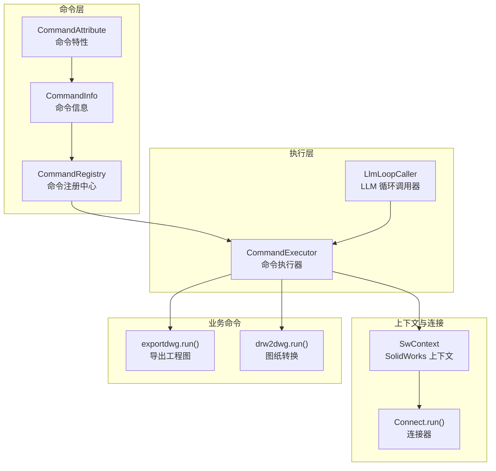
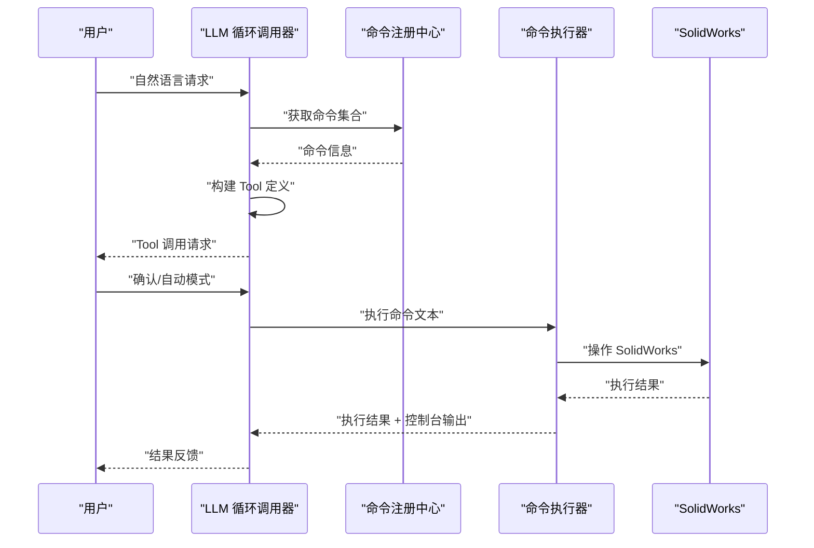
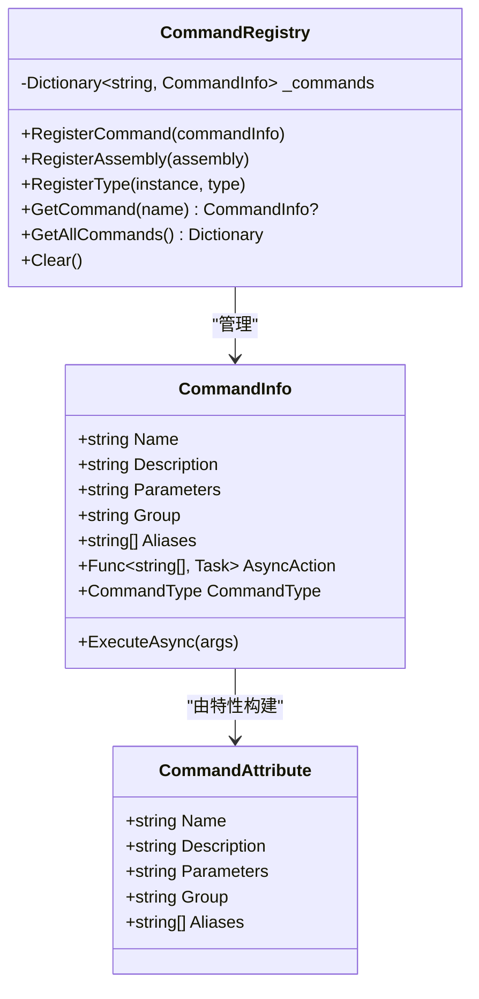
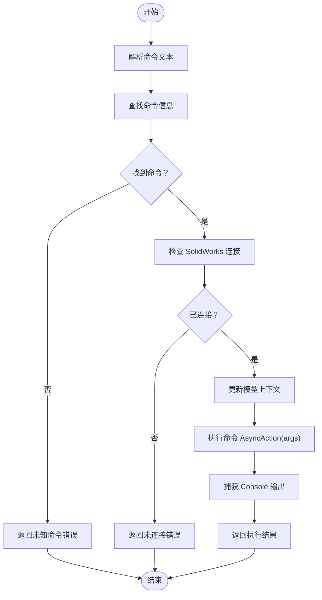
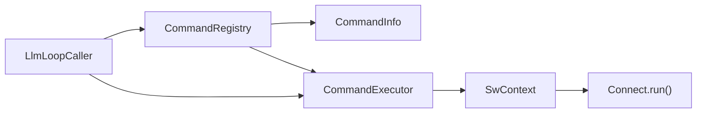

# 工具调用接口

<cite>
**本文档引用的文件**
- [CommandAttribute.cs](file://ctools/CommandAttribute.cs)
- [CommandInfo.cs](file://ctools/CommandInfo.cs)
- [CommandRegistry.cs](file://ctools/CommandRegistry.cs)
- [command_executor.cs](file://ctools/command_executor.cs)
- [SwContext.cs](file://ctools/SwContext.cs)
- [main.cs](file://ctools/main.cs)
- [connect.cs](file://ctools/connect.cs)
- [llm_loop_caller.cs](file://ctools/llm_loop_caller.cs)
- [exportdwg.cs](file://share/part/exportdwg.cs)
- [drw2dwg.cs](file://share/drw/drw2dwg.cs)
</cite>

## 目录
1. [简介](#简介)
2. [项目结构](#项目结构)
3. [核心组件](#核心组件)
4. [架构总览](#架构总览)
5. [详细组件分析](#详细组件分析)
6. [依赖关系分析](#依赖关系分析)
7. [性能考虑](#性能考虑)
8. [故障排除指南](#故障排除指南)
9. [结论](#结论)
10. [附录](#附录)

## 简介
本文件面向工具调用接口的使用者与维护者，系统性阐述基于 Tool 调用模式的实现原理与使用方法。内容涵盖工具定义格式、函数调用协议、参数传递机制、生命周期管理、安全与权限控制、错误处理策略，以及完整的使用示例与最佳实践。该系统以命令注册中心为核心，结合 LLM 的 Tool 调用能力，实现从自然语言到 SolidWorks 操作的自动化执行。

## 项目结构
该项目围绕命令注册与执行两大核心模块展开，并通过上下文管理器与连接器实现与 SolidWorks 的集成。LLM 循环调用器负责将自然语言意图转化为 Tool 调用，再由命令执行器驱动具体命令实现。



**图表来源**
- [CommandAttribute.cs:1-20](file://ctools/CommandAttribute.cs#L1-L20)
- [CommandInfo.cs:1-41](file://ctools/CommandInfo.cs#L1-L41)
- [CommandRegistry.cs:1-242](file://ctools/CommandRegistry.cs#L1-L242)
- [command_executor.cs:1-116](file://ctools/command_executor.cs#L1-L116)
- [SwContext.cs:1-87](file://ctools/SwContext.cs#L1-L87)
- [connect.cs:1-56](file://ctools/connect.cs#L1-L56)
- [llm_loop_caller.cs:1-800](file://ctools/llm_loop_caller.cs#L1-L800)
- [exportdwg.cs:1-81](file://share/part/exportdwg.cs#L1-L81)
- [drw2dwg.cs:1-122](file://share/drw/drw2dwg.cs#L1-L122)

**章节来源**
- [main.cs:53-109](file://ctools/main.cs#L53-L109)
- [llm_loop_caller.cs:493-726](file://ctools/llm_loop_caller.cs#L493-L726)

## 核心组件
- 命令特性与信息：通过特性标记命令元数据，命令信息承载执行动作与类型。
- 命令注册中心：集中管理命令注册、别名映射、批量扫描与查找。
- 命令执行器：解析命令文本、校验环境、执行命令并收集输出。
- LLM 循环调用器：将命令集合转换为 Tool 定义，处理 Tool 调用与结果反馈。
- 上下文与连接：统一管理 SolidWorks 应用实例与活动文档，确保执行环境一致。

**章节来源**
- [CommandAttribute.cs:5-18](file://ctools/CommandAttribute.cs#L5-L18)
- [CommandInfo.cs:17-39](file://ctools/CommandInfo.cs#L17-L39)
- [CommandRegistry.cs:12-153](file://ctools/CommandRegistry.cs#L12-L153)
- [command_executor.cs:12-113](file://ctools/command_executor.cs#L12-L113)
- [llm_loop_caller.cs:19-67](file://ctools/llm_loop_caller.cs#L19-L67)
- [SwContext.cs:9-84](file://ctools/SwContext.cs#L9-L84)

## 架构总览
系统采用“特性标注 + 注册中心 + 执行器 + LLM 工具”的分层设计。命令通过特性声明元数据，注册中心统一收集并暴露给执行器；LLM 将可用命令转换为 Tool 定义，Tool 调用被解析为具体命令执行，最终由命令执行器与 SolidWorks 交互。



**图表来源**
- [llm_loop_caller.cs:493-726](file://ctools/llm_loop_caller.cs#L493-L726)
- [command_executor.cs:32-113](file://ctools/command_executor.cs#L32-L113)
- [CommandRegistry.cs:113-131](file://ctools/CommandRegistry.cs#L113-L131)

## 详细组件分析

### 命令定义与注册
- 命令特性（CommandAttribute）
  - 必填字段：Name
  - 可选字段：Description、Parameters、Group、Aliases
  - 用途：在静态方法上标注命令元数据，便于注册中心扫描与构建命令信息
- 命令信息（CommandInfo）
  - 字段：Name、Description、Parameters、Group、Aliases、AsyncAction、CommandType
  - 功能：封装命令执行逻辑，支持同步与异步两种类型
- 命令注册中心（CommandRegistry）
  - 支持注册单个命令、批量扫描程序集、从实例方法注册
  - 提供命令查找、别名映射、清空与遍历
  - 内置线程安全锁，保证并发场景下的稳定性



**图表来源**
- [CommandAttribute.cs:5-18](file://ctools/CommandAttribute.cs#L5-L18)
- [CommandInfo.cs:17-39](file://ctools/CommandInfo.cs#L17-L39)
- [CommandRegistry.cs:12-153](file://ctools/CommandRegistry.cs#L12-L153)

**章节来源**
- [CommandAttribute.cs:5-18](file://ctools/CommandAttribute.cs#L5-L18)
- [CommandInfo.cs:17-39](file://ctools/CommandInfo.cs#L17-L39)
- [CommandRegistry.cs:30-108](file://ctools/CommandRegistry.cs#L30-L108)

### 命令执行器与生命周期
- 命令执行器（CommandExecutor）
  - 输入：命令文本（支持“命令名 参数1 参数2”格式）
  - 流程：解析命令名与参数 → 查找命令 → 校验 SolidWorks 连接 → 更新当前模型上下文 → 执行命令 → 捕获输出 → 返回结果
  - 错误处理：对空命令、未知命令、连接失败、执行异常进行分类处理
- 生命周期管理
  - 发起：解析命令文本，定位 CommandInfo
  - 执行：根据 CommandType 调用 AsyncAction
  - 监控：捕获 Console 输出，记录调试信息
  - 结果：汇总执行结果与捕获输出，返回用户



**图表来源**
- [command_executor.cs:32-113](file://ctools/command_executor.cs#L32-L113)

**章节来源**
- [command_executor.cs:12-113](file://ctools/command_executor.cs#L12-L113)

### LLM 工具调用模式
- 工具定义（ToolDefinition）与函数定义（FunctionDefinition）
  - ToolDefinition.Type 固定为 "function"
  - FunctionDefinition.Name：以 "execute_" 前缀命名，主命令名与别名均生成对应工具
  - FunctionDefinition.Description：来自命令描述
  - FunctionDefinition.Parameters：基于命令 Parameters 字段构建，采用单参数 "argument"，类型为 "string"
- Tool 调用执行流程
  - 解析函数名（去除 "execute_" 前缀）
  - 解析参数 JSON，提取 "argument" 值
  - 组装完整命令文本（函数名 + 参数）
  - 用户确认（可切换自动模式）
  - 执行命令并捕获输出，记录最后执行命令

```mermaid
sequenceDiagram
participant LLM as "LLM"
participant Loop as "LlmLoopCaller"
participant Exec as "CommandExecutor"
LLM->>Loop : "ChatWithToolsAsync(输入, 工具定义)"
Loop->>Loop : "解析 Tool 调用"
Loop->>Loop : "解析函数名与参数"
Loop->>Loop : "用户确认/自动模式"
Loop->>Exec : "ExecuteCommandAsync(完整命令)"
Exec-->>Loop : "执行结果 + 控制台输出"
Loop-->>LLM : "工具调用结果"
```

**图表来源**
- [llm_loop_caller.cs:117-172](file://ctools/llm_loop_caller.cs#L117-L172)
- [llm_loop_caller.cs:177-288](file://ctools/llm_loop_caller.cs#L177-L288)

**章节来源**
- [llm_loop_caller.cs:117-172](file://ctools/llm_loop_caller.cs#L117-L172)
- [llm_loop_caller.cs:177-288](file://ctools/llm_loop_caller.cs#L177-L288)

### 上下文与连接
- SolidWorks 上下文（SwContext）
  - 单例模式，提供 SwApp 与 SwModel 的全局访问
  - 初始化与清理方法，确保多线程安全
- 连接器（Connect.run）
  - 在 Windows 平台上通过 COM 获取或创建 SolidWorks 实例
  - 处理无运行实例时的新建逻辑与异常捕获

**章节来源**
- [SwContext.cs:9-84](file://ctools/SwContext.cs#L9-L84)
- [connect.cs:11-51](file://ctools/connect.cs#L11-L51)

### 示例：自定义工具与参数处理
- 定义自定义工具
  - 在静态方法上添加 CommandAttribute，设置 Name、Description、Parameters、Group、Aliases
  - 方法返回类型必须为 void 或 Task
- 复杂参数处理
  - 通过 Parameters 字段描述参数含义，LLM 工具调用将参数打包为 JSON 的 "argument"
  - 命令执行器将 "argument" 作为完整参数字符串传入命令实现
- 高级功能示例
  - 导出工程图：exportdwg.run 接收 ModelDoc2 与厚度参数，执行导出逻辑
  - 图纸转换：drw2dwg.run 接收 ModelDoc2 与 SldWorks，根据文档类型选择输出路径与格式

**章节来源**
- [main.cs:170-253](file://ctools/main.cs#L170-L253)
- [exportdwg.cs:12-77](file://share/part/exportdwg.cs#L12-L77)
- [drw2dwg.cs:12-120](file://share/drw/drw2dwg.cs#L12-L120)

## 依赖关系分析
- 组件耦合
  - CommandRegistry 与 CommandInfo 强耦合，前者负责后者生命周期管理
  - CommandExecutor 依赖 CommandRegistry 的查询能力与 SwContext 的上下文
  - LlmLoopCaller 依赖 CommandRegistry 与 CommandExecutor，形成“工具定义 → 执行”的闭环
- 外部依赖
  - SolidWorks Interop：通过 COM 与 SolidWorks 交互
  - LLM 服务：负责工具定义构建与 Tool 调用决策



**图表来源**
- [CommandRegistry.cs:12-153](file://ctools/CommandRegistry.cs#L12-L153)
- [command_executor.cs:12-26](file://ctools/command_executor.cs#L12-L26)
- [llm_loop_caller.cs:44-51](file://ctools/llm_loop_caller.cs#L44-L51)
- [SwContext.cs:9-24](file://ctools/SwContext.cs#L9-L24)
- [connect.cs:11-25](file://ctools/connect.cs#L11-L25)

**章节来源**
- [CommandRegistry.cs:12-153](file://ctools/CommandRegistry.cs#L12-L153)
- [command_executor.cs:12-26](file://ctools/command_executor.cs#L12-L26)
- [llm_loop_caller.cs:44-51](file://ctools/llm_loop_caller.cs#L44-L51)

## 性能考虑
- 命令执行性能
  - 支持异步命令（Task），避免阻塞主线程
  - 可选性能监控装饰器，统计命令执行耗时
- 工具调用效率
  - 工具定义一次性构建，减少重复计算
  - 命令查找采用字典 O(1) 查找，支持别名映射
- I/O 与资源
  - 控制台输出捕获与重定向，避免阻塞 UI
  - 文件读写（如 last_command.txt）采用 UTF-8 编码，异常保护

[本节为通用指导，无需特定文件引用]

## 故障排除指南
- 常见错误与处理
  - 未找到命令：检查命令名与别名是否正确注册
  - 未连接 SolidWorks：确认 Connect.run 成功获取实例
  - 命令执行异常：查看捕获的 Console 输出与堆栈信息
  - 参数解析失败：确认 Tool 调用参数 JSON 格式正确
- 调试建议
  - 启用调试日志（注册中心与执行器均有调试输出）
  - 使用“自动模式”跳过用户确认，快速定位问题
  - 检查命令实现是否正确处理 ModelDoc2 与 SldWorks 参数

**章节来源**
- [command_executor.cs:34-112](file://ctools/command_executor.cs#L34-L112)
- [llm_loop_caller.cs:186-288](file://ctools/llm_loop_caller.cs#L186-L288)
- [CommandRegistry.cs:113-131](file://ctools/CommandRegistry.cs#L113-L131)

## 结论
该工具调用接口以特性驱动的命令体系为基础，结合注册中心与执行器实现了清晰的生命周期管理；通过 LLM 的 Tool 调用模式，将自然语言意图高效转化为具体 SolidWorks 操作。系统具备良好的扩展性与安全性（用户确认、异常隔离），适合在复杂 CAD 工作流中推广使用。

[本节为总结性内容，无需特定文件引用]

## 附录

### 工具定义与函数调用协议规范
- ToolDefinition
  - Type：固定为 "function"
  - Function：FunctionDefinition 对象
- FunctionDefinition
  - Name：以 "execute_" 前缀命名（主命令名与别名分别生成）
  - Description：命令描述
  - Parameters：采用单参数 "argument"，类型为 "string"，描述来自命令 Parameters 字段
- 参数传递机制
  - Tool 调用参数以 JSON 形式传递，键名为 "argument"
  - 命令执行器将 "argument" 作为完整参数字符串传入命令实现

**章节来源**
- [llm_loop_caller.cs:117-172](file://ctools/llm_loop_caller.cs#L117-L172)

### 安全机制与权限控制
- 用户确认机制
  - Tool 调用前可要求用户确认，支持自动模式切换
- 异常隔离
  - 命令执行异常被捕获并转译为用户可读信息
- 环境约束
  - 严格检查 SolidWorks 连接状态，避免无效操作

**章节来源**
- [llm_loop_caller.cs:217-240](file://ctools/llm_loop_caller.cs#L217-L240)
- [command_executor.cs:60-66](file://ctools/command_executor.cs#L60-L66)

### 工具注册流程与参数验证
- 注册流程
  - 通过 CommandAttribute 标注命令元数据
  - 使用 CommandRegistry.RegisterAssembly 或 RegisterType 扫描并注册
  - 支持别名注册，提升易用性
- 参数验证
  - 命令实现需验证参数有效性（如文档类型、保存状态等）
  - Tool 调用参数由 "argument" 字段承载，建议在命令实现中进行二次校验

**章节来源**
- [CommandRegistry.cs:61-108](file://ctools/CommandRegistry.cs#L61-L108)
- [exportdwg.cs:20-38](file://share/part/exportdwg.cs#L20-L38)

### 执行结果反馈机制
- 命令执行器返回执行状态与捕获的控制台输出
- LLM 循环调用器将工具调用结果与 Console 输出整合，保存至短期记忆，便于后续对话参考

**章节来源**
- [command_executor.cs:101-105](file://ctools/command_executor.cs#L101-L105)
- [llm_loop_caller.cs:731-777](file://ctools/llm_loop_caller.cs#L731-L777)