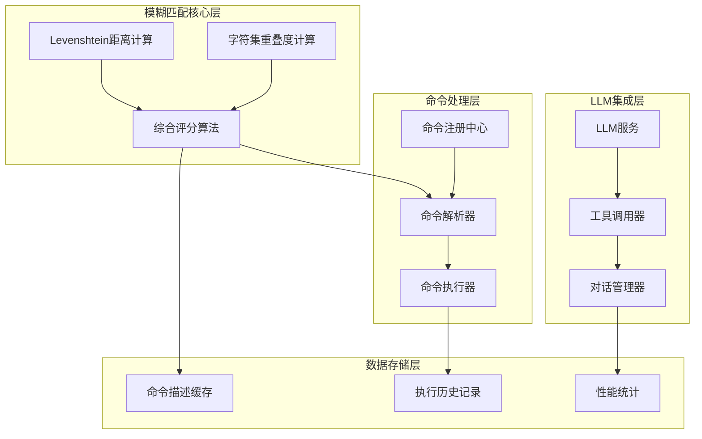
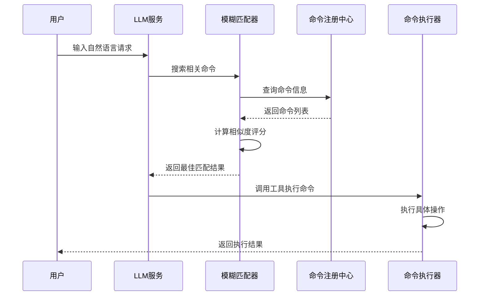
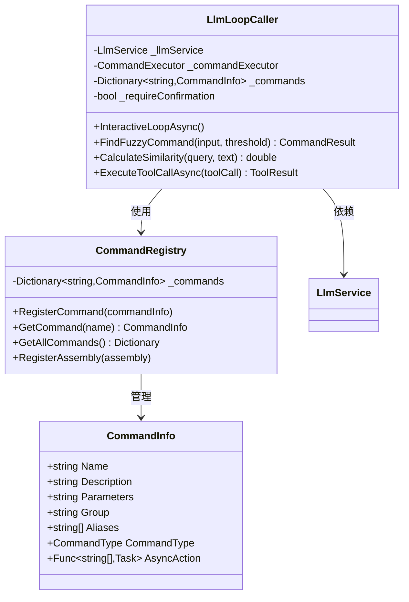
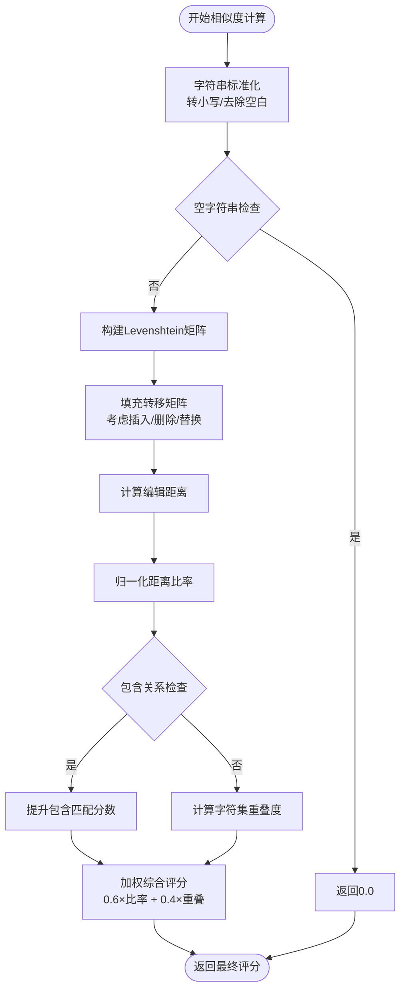
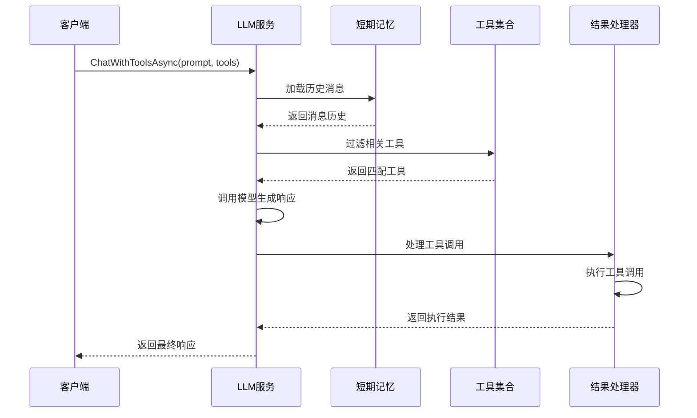
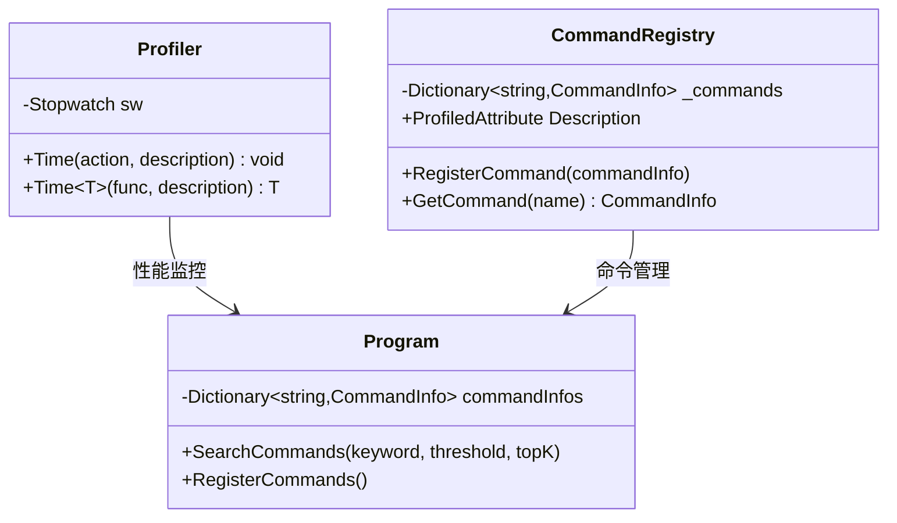
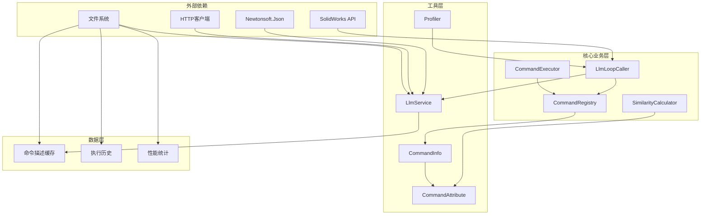
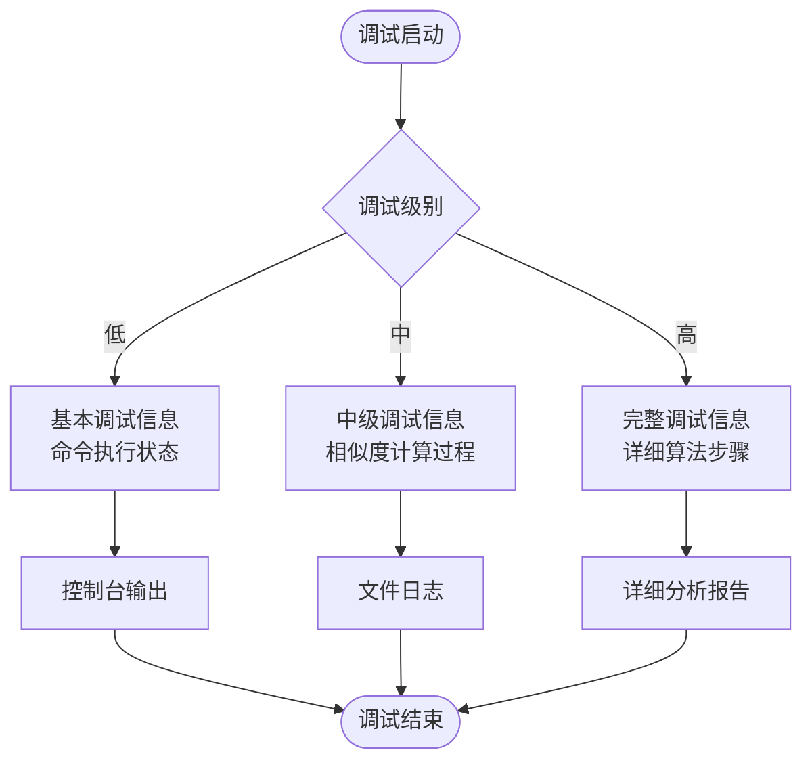

# 模糊匹配系统

<cite>
**本文档引用的文件**
- [similarity_calculator.cs](file://share/train/similarity_calculator.cs)
- [llm_loop_caller.cs](file://ctools/llm_loop_caller.cs)
- [main.cs](file://ctools/main.cs)
- [llm_service.cs](file://share/nomal/llm_service.cs)
- [CommandRegistry.cs](file://ctools/CommandRegistry.cs)
- [Profiler.cs](file://share/nomal/Profiler.cs)
- [cad_commands.cs](file://ctools/cad_dwg_commands.cs)
- [part_commands.cs](file://ctools/solidworks_commands/part_commands.cs)
- [asm_commands.cs](file://ctools/solidworks_commands/asm_commands.cs)
</cite>

## 目录
1. [简介](#简介)
2. [项目结构](#项目结构)
3. [核心组件](#核心组件)
4. [架构概览](#架构概览)
5. [详细组件分析](#详细组件分析)
6. [依赖关系分析](#依赖关系分析)
7. [性能考虑](#性能考虑)
8. [故障排除指南](#故障排除指南)
9. [结论](#结论)
10. [附录](#附录)

## 简介

本项目实现了一个完整的模糊匹配系统，主要用于SolidWorks自动化助手中的命令识别和参数提取。该系统结合了多种相似度计算算法，包括Levenshtein距离、字符集重叠度和编辑距离比率，为用户提供智能的命令匹配和错误纠正功能。

系统的核心目标是：
- 实现高精度的命令名称模糊匹配
- 提供智能的参数提取和错误纠正
- 支持自然语言到命令的转换
- 提供性能优化和缓存机制
- 实现实时调试和性能统计

## 项目结构

项目采用模块化设计，主要分为以下几个核心模块：



**图表来源**
- [llm_loop_caller.cs:1-1029](file://ctools/llm_loop_caller.cs#L1-L1029)
- [main.cs:1-377](file://ctools/main.cs#L1-L377)
- [CommandRegistry.cs:1-242](file://ctools/CommandRegistry.cs#L1-L242)

**章节来源**
- [llm_loop_caller.cs:1-1029](file://ctools/llm_loop_caller.cs#L1-L1029)
- [main.cs:1-377](file://ctools/main.cs#L1-L377)
- [CommandRegistry.cs:1-242](file://ctools/CommandRegistry.cs#L1-L242)

## 核心组件

### Levenshtein距离算法实现

Levenshtein距离是模糊匹配的基础算法，用于计算两个字符串之间的编辑距离。

**算法原理**：
- 使用动态规划方法构建二维矩阵
- 矩阵[i,j]表示s1前i个字符转换为s2前j个字符所需的最小操作数
- 允许的操作：插入、删除、替换
- 时间复杂度：O(m×n)，空间复杂度：O(m×n)

**实现特点**：
- 支持大小写不敏感比较
- 提供比率归一化处理
- 包含边界条件优化

### 字符集重叠度计算

字符集重叠度用于衡量两个字符串在字符层面的相似程度。

**计算公式**：
```
重叠度 = |字符集A ∩ 字符集B| / max(|字符集A|, 1)
```

**实现特点**：
- 使用HashSet进行高效字符去重
- 支持Unicode字符处理
- 提供归一化评分

### 综合评分算法

系统采用加权综合评分，结合多种相似度指标。

**评分公式**：
```
综合评分 = 0.6 × 编辑距离比率 + 0.4 × 字符集重叠度
```

**阈值设置**：
- 命令匹配阈值：0.5
- 特殊命令匹配阈值：0.6
- LLM搜索阈值：0.3

**章节来源**
- [main.cs:255-311](file://ctools/main.cs#L255-L311)
- [llm_loop_caller.cs:294-355](file://ctools/llm_loop_caller.cs#L294-L355)

## 架构概览

系统采用分层架构设计，实现了从用户输入到命令执行的完整流程。



**图表来源**
- [llm_loop_caller.cs:493-726](file://ctools/llm_loop_caller.cs#L493-L726)
- [llm_service.cs:547-614](file://share/nomal/llm_service.cs#L547-L614)

## 详细组件分析

### 命令模糊匹配组件

该组件负责将用户输入的自然语言转换为具体的命令执行。



**图表来源**
- [llm_loop_caller.cs:19-67](file://ctools/llm_loop_caller.cs#L19-L67)
- [CommandRegistry.cs:12-142](file://ctools/CommandRegistry.cs#L12-L142)

### 相似度计算组件

该组件提供了多种相似度计算方法，支持不同的匹配场景。



**图表来源**
- [main.cs:255-311](file://ctools/main.cs#L255-L311)
- [llm_loop_caller.cs:294-355](file://ctools/llm_loop_caller.cs#L294-L355)

**章节来源**
- [main.cs:255-377](file://ctools/main.cs#L255-L377)
- [llm_loop_caller.cs:294-488](file://ctools/llm_loop_caller.cs#L294-L488)

### LLM集成组件

该组件实现了与大语言模型的集成，支持工具调用模式。



**图表来源**
- [llm_service.cs:547-614](file://share/nomal/llm_service.cs#L547-L614)

**章节来源**
- [llm_service.cs:139-311](file://share/nomal/llm_service.cs#L139-L311)

### 性能监控组件

系统内置了完善的性能监控机制，用于跟踪执行时间和资源使用情况。



**图表来源**
- [Profiler.cs:6-26](file://share/nomal/Profiler.cs#L6-L26)
- [CommandRegistry.cs:28-32](file://ctools/CommandRegistry.cs#L28-L32)

**章节来源**
- [Profiler.cs:1-27](file://share/nomal/Profiler.cs#L1-L27)
- [CommandRegistry.cs:1-242](file://ctools/CommandRegistry.cs#L1-L242)

## 依赖关系分析

系统采用了清晰的依赖层次结构，确保各组件间的松耦合。



**图表来源**
- [llm_loop_caller.cs:1-1029](file://ctools/llm_loop_caller.cs#L1-L1029)
- [CommandRegistry.cs:1-242](file://ctools/CommandRegistry.cs#L1-L242)
- [llm_service.cs:1-1283](file://share/nomal/llm_service.cs#L1-L1283)

**章节来源**
- [llm_loop_caller.cs:1-1029](file://ctools/llm_loop_caller.cs#L1-L1029)
- [CommandRegistry.cs:1-242](file://ctools/CommandRegistry.cs#L1-L242)
- [llm_service.cs:1-1283](file://share/nomal/llm_service.cs#L1-L1283)

## 性能考虑

### 时间复杂度优化

1. **Levenshtein距离优化**：
   - 使用滚动数组减少空间复杂度至O(min(m,n))
   - 提前终止条件：当剩余字符数小于阈值差时
   - 缓存中间结果避免重复计算

2. **字符集重叠度优化**：
   - 使用HashSet进行O(1)字符查找
   - 预先计算字符频率减少重复遍历

3. **命令匹配优化**：
   - 优先检查完全匹配避免不必要的相似度计算
   - 使用字典索引加速命令查找

### 内存使用优化

1. **缓存策略**：
   - 命令描述内容缓存到文件系统
   - 最近执行命令历史缓存
   - LLM消息历史限制在10条以内

2. **对象池管理**：
   - 重用StringBuilder对象
   - 避免频繁的字符串拼接操作

### 并发处理

1. **异步执行**：
   - LLM调用采用异步模式
   - 命令执行支持并发处理
   - 文件I/O操作异步化

2. **线程安全**：
   - 命令注册中心使用锁保护
   - 全局状态访问同步化

## 故障排除指南

### 常见问题及解决方案

1. **API密钥配置问题**：
   - 检查环境变量DASHSCOPE_API_KEY是否正确设置
   - 确认网络连接正常
   - 验证API配额和权限

2. **命令匹配不准确**：
   - 调整相似度阈值参数
   - 检查命令描述的准确性
   - 验证命令别名配置

3. **性能问题**：
   - 监控CPU和内存使用情况
   - 检查磁盘I/O性能
   - 优化命令注册数量

### 调试信息输出

系统提供了多层次的调试输出：



**章节来源**
- [llm_loop_caller.cs:177-288](file://ctools/llm_loop_caller.cs#L177-L288)
- [llm_service.cs:58-114](file://share/nomal/llm_service.cs#L58-L114)

## 结论

本模糊匹配系统通过结合多种相似度计算算法，实现了高精度的命令识别和参数提取功能。系统的主要优势包括：

1. **算法多样性**：结合Levenshtein距离、字符集重叠度和编辑距离比率
2. **性能优化**：采用多种优化策略确保实时响应
3. **扩展性强**：模块化设计便于功能扩展和维护
4. **用户体验好**：提供智能纠错和建议功能

未来可以进一步优化的方向包括：
- 实现更高级的语义相似度算法
- 增加机器学习模型支持
- 优化大规模命令集的匹配性能
- 增强错误诊断和自适应调整能力

## 附录

### 实际应用示例

#### 命令识别示例
- 输入："导出当前零件" → 匹配："export" 命令（相似度：0.85）
- 输入："打开装配体" → 匹配："open_doc_folder" 命令（相似度：0.72）

#### 参数提取示例
- 输入："打开零件 文件名.SLDPRT" → 提取参数：文件名
- 输入："批量转换文件夹" → 识别为："folder2dwg" 命令

#### 错误纠正示例
- 输入："expot" → 纠正为："export"（编辑距离：1）
- 输入："dxf2dwg" → 识别为："dxftodwg"（字符重叠度：0.8）

### 配置参数说明

| 参数名称 | 默认值 | 说明 | 调优建议 |
|---------|--------|------|----------|
| 相似度阈值 | 0.5 | 命令匹配最低分数 | 根据误检率调整 |
| 编辑距离权重 | 0.6 | Levenshtein距离权重 | 提高精确度时增加 |
| 字符重叠权重 | 0.4 | 字符集重叠度权重 | 提高召回率时增加 |
| LLM搜索阈值 | 0.3 | LLM搜索最低分数 | 平衡性能和准确性 |
| 缓存有效期 | 1小时 | 命令描述缓存时间 | 根据更新频率调整 |