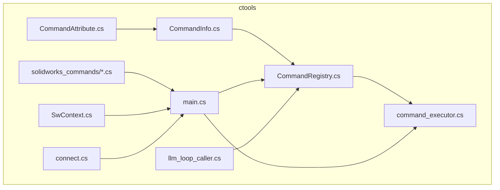
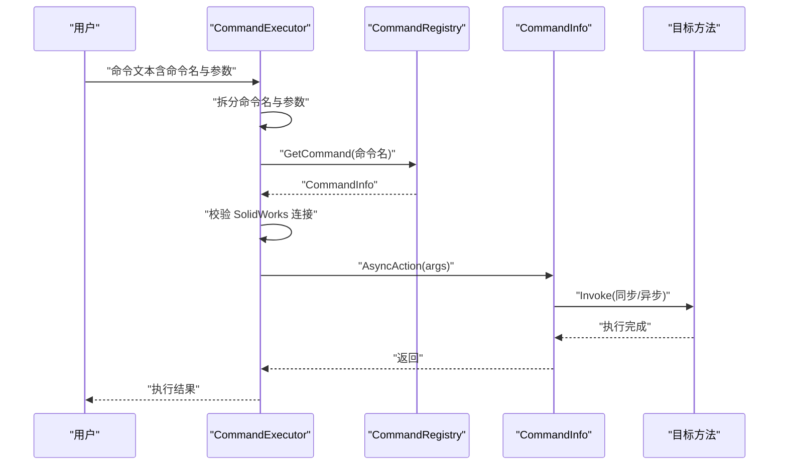
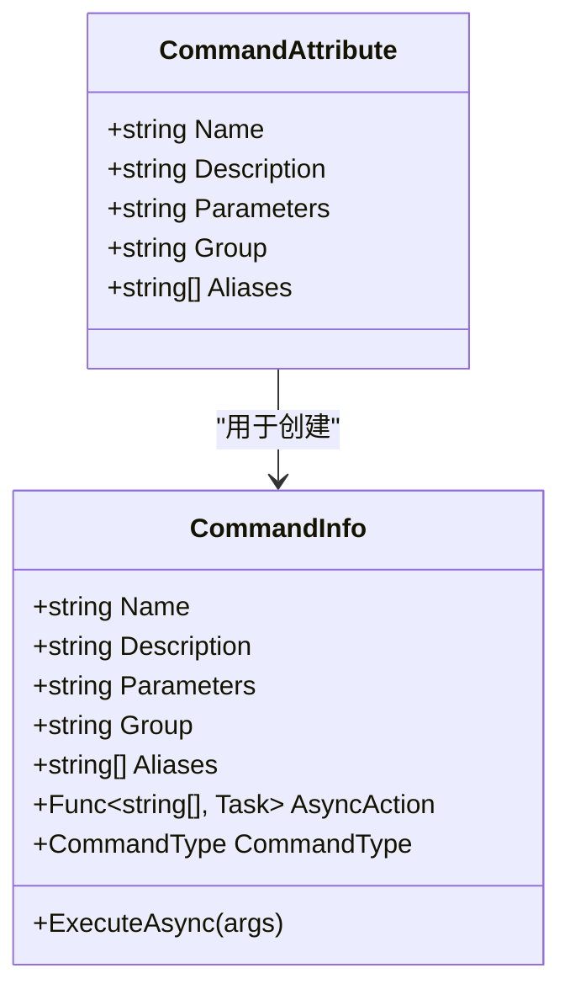
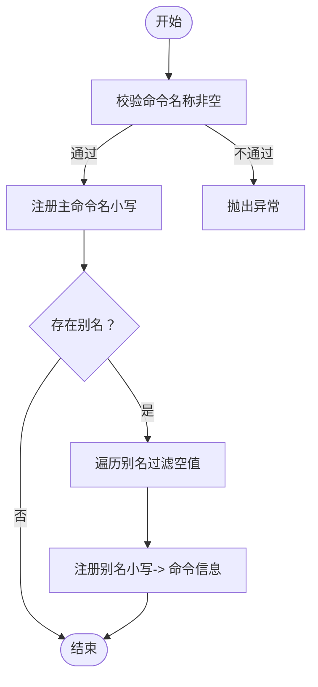
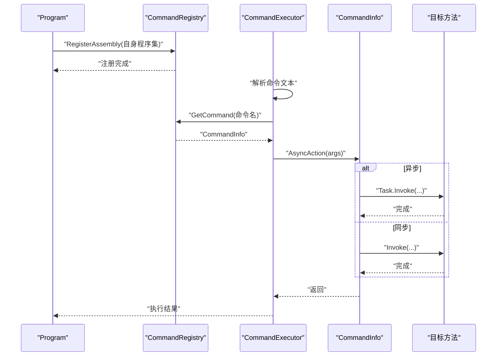
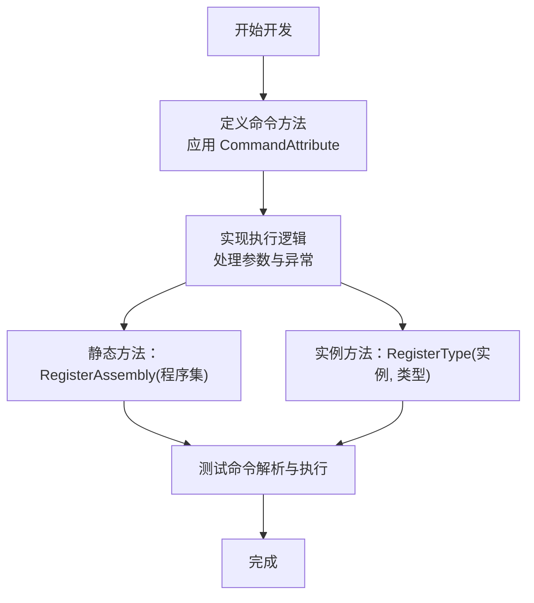
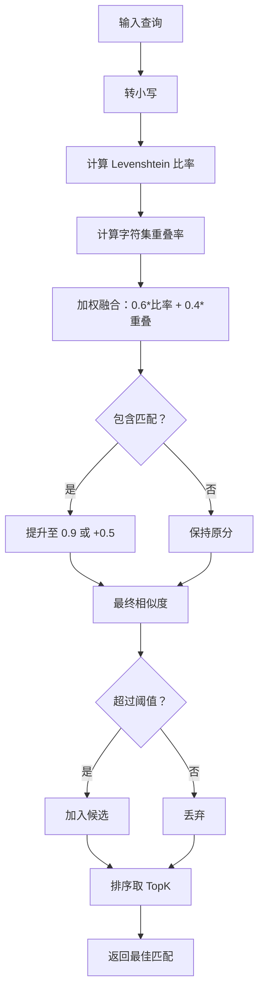
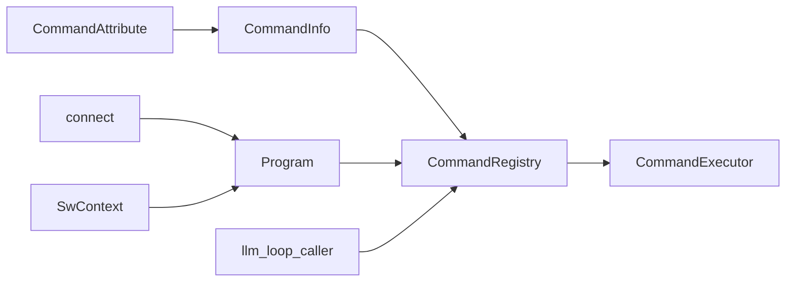

# 命令 API

<cite>
**本文引用的文件**
- [CommandAttribute.cs](file://ctools/CommandAttribute.cs)
- [CommandInfo.cs](file://ctools/CommandInfo.cs)
- [CommandRegistry.cs](file://ctools/CommandRegistry.cs)
- [command_executor.cs](file://ctools/command_executor.cs)
- [main.cs](file://ctools/main.cs)
- [llm_loop_caller.cs](file://ctools/llm_loop_caller.cs)
- [part_commands.cs](file://ctools/solidworks_commands/part_commands.cs)
- [asm_commands.cs](file://ctools/solidworks_commands/asm_commands.cs)
- [drw_commands.cs](file://ctools/solidworks_commands/drw_commands.cs)
- [connect.cs](file://ctools/connect.cs)
- [SwContext.cs](file://ctools/SwContext.cs)
</cite>

## 目录
1. [简介](#简介)
2. [项目结构](#项目结构)
3. [核心组件](#核心组件)
4. [架构总览](#架构总览)
5. [详细组件分析](#详细组件分析)
6. [依赖关系分析](#依赖关系分析)
7. [性能考量](#性能考量)
8. [故障排查指南](#故障排查指南)
9. [结论](#结论)
10. [附录](#附录)

## 简介
本文件系统化地文档化命令 API 的设计与实现，覆盖命令注册机制、元数据结构、执行接口、参数传递、错误处理、别名与模糊匹配、生命周期管理与性能优化，并提供可操作的开发流程与示例路径，帮助开发者快速上手并扩展命令系统。

## 项目结构
命令 API 位于 ctools 子项目中，围绕以下关键文件组织：
- 命令特性与元数据：CommandAttribute、CommandInfo
- 注册中心：CommandRegistry（单例，支持程序集与实例方法扫描）
- 执行器：CommandExecutor（解析命令文本、参数、调用 CommandInfo.AsyncAction）
- 主程序入口与命令注册：Program（注册静态命令，提供相似度计算与模糊搜索）
- LLM 集成：llm_loop_caller（基于相似度的模糊匹配与工具调用）
- SolidWorks 命令实现：solidworks_commands 下的各模块命令
- 上下文与连接：SwContext、connect

**图表来源**
- [CommandAttribute.cs:1-20](file://ctools/CommandAttribute.cs#L1-L20)
- [CommandInfo.cs:1-41](file://ctools/CommandInfo.cs#L1-L41)
- [CommandRegistry.cs:1-242](file://ctools/CommandRegistry.cs#L1-L242)
- [command_executor.cs:1-116](file://ctools/command_executor.cs#L1-L116)
- [main.cs:1-377](file://ctools/main.cs#L1-L377)
- [llm_loop_caller.cs:106-495](file://ctools/llm_loop_caller.cs#L106-L495)
- [SwContext.cs:1-86](file://ctools/SwContext.cs#L1-L86)
- [connect.cs:1-56](file://ctools/connect.cs#L1-L56)

**章节来源**
- [CommandAttribute.cs:1-20](file://ctools/CommandAttribute.cs#L1-L20)
- [CommandInfo.cs:1-41](file://ctools/CommandInfo.cs#L1-L41)
- [CommandRegistry.cs:1-242](file://ctools/CommandRegistry.cs#L1-L242)
- [command_executor.cs:1-116](file://ctools/command_executor.cs#L1-L116)
- [main.cs:1-377](file://ctools/main.cs#L1-L377)
- [llm_loop_caller.cs:106-495](file://ctools/llm_loop_caller.cs#L106-L495)
- [SwContext.cs:1-86](file://ctools/SwContext.cs#L1-L86)
- [connect.cs:1-56](file://ctools/connect.cs#L1-L56)

## 核心组件
- 命令特性 CommandAttribute：声明命令名称、描述、参数、分组、别名等元信息。
- 命令元数据 CommandInfo：承载命令名称、描述、参数、分组、别名、执行类型与异步执行委托。
- 注册中心 CommandRegistry：单例注册中心，支持静态方法与实例方法扫描、别名注册、并发安全查询。
- 命令执行器 CommandExecutor：解析命令文本、拆分参数、校验 SolidWorks 连接、调用 CommandInfo.AsyncAction。
- 主程序 Program：注册静态命令、提供命令描述内容生成、相似度计算与模糊搜索。
- LLM 集成 llm_loop_caller：基于相似度的模糊匹配、特殊命令与注册命令的混合匹配、工具定义构建。
- SolidWorks 命令实现：按模块划分的命令集合，统一使用 Command 特性进行声明与注册。

**章节来源**
- [CommandAttribute.cs:5-18](file://ctools/CommandAttribute.cs#L5-L18)
- [CommandInfo.cs:8-39](file://ctools/CommandInfo.cs#L8-L39)
- [CommandRegistry.cs:12-153](file://ctools/CommandRegistry.cs#L12-L153)
- [command_executor.cs:12-113](file://ctools/command_executor.cs#L12-L113)
- [main.cs:170-253](file://ctools/main.cs#L170-L253)
- [llm_loop_caller.cs:388-488](file://ctools/llm_loop_caller.cs#L388-L488)

## 架构总览
命令 API 采用“特性声明 + 元数据 + 注册中心 + 执行器”的分层架构：
- 声明层：通过 CommandAttribute 在方法上声明命令元信息。
- 注册层：CommandRegistry 扫描程序集/实例方法，生成 CommandInfo 并注册，支持别名映射。
- 执行层：CommandExecutor 解析命令文本，解析参数，校验环境，调用 CommandInfo.AsyncAction。
- 智能层：Program 与 llm_loop_caller 提供模糊匹配、相似度计算与工具定义，增强交互体验。

**图表来源**
- [command_executor.cs:32-105](file://ctools/command_executor.cs#L32-L105)
- [CommandRegistry.cs:113-131](file://ctools/CommandRegistry.cs#L113-L131)
- [CommandInfo.cs:30-38](file://ctools/CommandInfo.cs#L30-L38)

**章节来源**
- [command_executor.cs:32-105](file://ctools/command_executor.cs#L32-L105)
- [CommandRegistry.cs:113-131](file://ctools/CommandRegistry.cs#L113-L131)
- [CommandInfo.cs:30-38](file://ctools/CommandInfo.cs#L30-L38)

## 详细组件分析

### 命令特性与元数据
- CommandAttribute
  - 字段：Name、Description、Parameters、Group、Aliases
  - 用途：在方法上声明命令元信息，支持别名数组
- CommandInfo
  - 字段：Name、Description、Parameters、Group、Aliases、AsyncAction、CommandType
  - 方法：ExecuteAsync(args) 调用 AsyncAction
  - 类型：CommandType 支持 Sync 与 Async

**图表来源**
- [CommandAttribute.cs:5-18](file://ctools/CommandAttribute.cs#L5-L18)
- [CommandInfo.cs:17-39](file://ctools/CommandInfo.cs#L17-L39)

**章节来源**
- [CommandAttribute.cs:5-18](file://ctools/CommandAttribute.cs#L5-L18)
- [CommandInfo.cs:17-39](file://ctools/CommandInfo.cs#L17-L39)

### 注册中心与注册流程
- 单例模式：Lazy 初始化，线程安全
- 注册方式：
  - RegisterCommand：直接注册 CommandInfo（名称与别名均注册）
  - RegisterAssembly：反射扫描静态方法上的 CommandAttribute，创建 CommandInfo 并注册
  - RegisterType：反射扫描实例方法上的 CommandAttribute，创建 CommandInfo 并注册
- 别名注册：将别名映射到同一 CommandInfo
- 查询：GetCommand(name) 返回 CommandInfo；GetAllCommands() 返回副本；Clear() 清空

**图表来源**
- [CommandRegistry.cs:32-56](file://ctools/CommandRegistry.cs#L32-L56)

**章节来源**
- [CommandRegistry.cs:12-153](file://ctools/CommandRegistry.cs#L12-L153)

### 命令执行接口与生命周期
- 同步与异步：
  - 通过方法返回类型判断：Task 视为异步，void 视为同步
  - CommandInfo.CommandType 标记命令类型
- 参数传递：
  - CommandExecutor 从命令文本拆分参数数组
  - CommandInfo.AsyncAction 接收 string[] args
- 错误处理：
  - TargetInvocationException 包装内部异常
  - 统一输出错误信息并抛出
- 生命周期：
  - 程序启动时注册静态命令
  - 交互模式下由 LLM 集成负责确认与执行
  - 执行前后维护 SolidWorks 上下文

**图表来源**
- [main.cs:57-60](file://ctools/main.cs#L57-L60)
- [CommandRegistry.cs:158-196](file://ctools/CommandRegistry.cs#L158-L196)
- [command_executor.cs:32-105](file://ctools/command_executor.cs#L32-L105)

**章节来源**
- [main.cs:170-253](file://ctools/main.cs#L170-L253)
- [CommandRegistry.cs:158-196](file://ctools/CommandRegistry.cs#L158-L196)
- [command_executor.cs:32-105](file://ctools/command_executor.cs#L32-L105)

### 命令开发标准流程
- 创建命令类（静态或实例均可）
- 在方法上应用 CommandAttribute，填写 Name、Description、Parameters、Group、Aliases
- 对于异步命令，方法返回 Task；对于同步命令，返回 void
- 若为实例方法，使用 RegisterType(instance, type) 注册
- 启动时调用 RegisterAssembly(typeof(Program).Assembly) 完成扫描注册
- 在 CommandExecutor 中通过 CommandRegistry.GetCommand 解析命令

**图表来源**
- [CommandRegistry.cs:61-108](file://ctools/CommandRegistry.cs#L61-L108)
- [main.cs:57-60](file://ctools/main.cs#L57-L60)

**章节来源**
- [CommandRegistry.cs:61-108](file://ctools/CommandRegistry.cs#L61-L108)
- [main.cs:57-60](file://ctools/main.cs#L57-L60)

### 命令别名系统与模糊匹配
- 别名注册：CommandRegistry 在 RegisterCommand 时将别名映射到同一 CommandInfo
- 模糊匹配：
  - Program.SearchCommands：基于 Levenshtein 相似度与字符集重叠率，结合包含匹配提升分数
  - llm_loop_caller.FindFuzzyCommand：优先完全匹配（命令名或别名+参数），否则进行相似度匹配，支持别名最高分
- 相似度计算：
  - Levenshtein 比率：1 - (编辑距离 / 最大长度)
  - 字符集重叠率：交集大小 / max(查询集大小, 1)
  - 加权融合：0.6 * 比率 + 0.4 * 重叠率
  - 包含匹配加分：若包含则最高分提升至 0.9（名称精确匹配时）

**图表来源**
- [main.cs:255-278](file://ctools/main.cs#L255-L278)
- [llm_loop_caller.cs:388-488](file://ctools/llm_loop_caller.cs#L388-L488)

**章节来源**
- [CommandRegistry.cs:43-54](file://ctools/CommandRegistry.cs#L43-L54)
- [main.cs:255-278](file://ctools/main.cs#L255-L278)
- [llm_loop_caller.cs:388-488](file://ctools/llm_loop_caller.cs#L388-L488)

### 命令示例与最佳实践
- 注册自定义命令
  - 示例路径：[part_commands.cs:11-19](file://ctools/solidworks_commands/part_commands.cs#L11-L19)
  - 示例路径：[asm_commands.cs:11-21](file://ctools/solidworks_commands/asm_commands.cs#L11-L21)
  - 示例路径：[drw_commands.cs:14-29](file://ctools/solidworks_commands/drw_commands.cs#L14-L29)
- 处理复杂参数
  - 示例路径：[part_commands.cs:64-77](file://ctools/solidworks_commands/part_commands.cs#L64-L77)
  - 示例路径：[asm_commands.cs:24-32](file://ctools/solidworks_commands/asm_commands.cs#L24-L32)
- 实现异步命令
  - 示例路径：[drw_commands.cs:96-144](file://ctools/solidworks_commands/drw_commands.cs#L96-L144)
- 使用别名
  - 示例路径：[part_commands.cs:21-27](file://ctools/solidworks_commands/part_commands.cs#L21-L27)

**章节来源**
- [part_commands.cs:11-77](file://ctools/solidworks_commands/part_commands.cs#L11-L77)
- [asm_commands.cs:11-32](file://ctools/solidworks_commands/asm_commands.cs#L11-L32)
- [drw_commands.cs:14-144](file://ctools/solidworks_commands/drw_commands.cs#L14-L144)

## 依赖关系分析
- CommandAttribute → CommandInfo：用于创建 CommandInfo
- CommandRegistry → CommandInfo：注册与查询
- CommandExecutor → CommandRegistry：解析命令
- Program → CommandRegistry：注册静态命令
- llm_loop_caller → CommandRegistry：模糊匹配与工具定义
- SwContext、connect → Program：提供 SolidWorks 上下文与连接

**图表来源**
- [CommandAttribute.cs:5-18](file://ctools/CommandAttribute.cs#L5-L18)
- [CommandInfo.cs:17-39](file://ctools/CommandInfo.cs#L17-L39)
- [CommandRegistry.cs:12-153](file://ctools/CommandRegistry.cs#L12-L153)
- [command_executor.cs:12-26](file://ctools/command_executor.cs#L12-L26)
- [main.cs:57-60](file://ctools/main.cs#L57-L60)
- [llm_loop_caller.cs:388-488](file://ctools/llm_loop_caller.cs#L388-L488)
- [connect.cs:11-51](file://ctools/connect.cs#L11-L51)
- [SwContext.cs:9-85](file://ctools/SwContext.cs#L9-L85)

**章节来源**
- [CommandRegistry.cs:12-153](file://ctools/CommandRegistry.cs#L12-L153)
- [command_executor.cs:12-26](file://ctools/command_executor.cs#L12-L26)
- [main.cs:57-60](file://ctools/main.cs#L57-L60)
- [llm_loop_caller.cs:388-488](file://ctools/llm_loop_caller.cs#L388-L488)
- [connect.cs:11-51](file://ctools/connect.cs#L11-L51)
- [SwContext.cs:9-85](file://ctools/SwContext.cs#L9-L85)

## 性能考量
- 命令执行性能
  - Program 支持 [Profiled] 属性装饰，执行时记录耗时
  - 示例路径：[asm_commands.cs:63-79](file://ctools/solidworks_commands/asm_commands.cs#L63-L79)
- 相似度计算
  - Levenshtein 距离矩阵 O(n*m)，注意长字符串的性能影响
  - 建议限制阈值与 TopK，避免全量扫描
- 并发与锁
  - CommandRegistry 内部使用锁保护字典操作，确保线程安全
- I/O 与外部系统
  - 批量处理时尽量减少文件系统与 COM 调用频率，合并操作

**章节来源**
- [asm_commands.cs:63-79](file://ctools/solidworks_commands/asm_commands.cs#L63-L79)
- [main.cs:255-311](file://ctools/main.cs#L255-L311)
- [CommandRegistry.cs:14-27](file://ctools/CommandRegistry.cs#L14-L27)

## 故障排查指南
- 命令未找到
  - 检查命令名大小写（注册与查询均转为小写）
  - 确认已调用 RegisterAssembly/RegisterType
  - 参考路径：[CommandRegistry.cs:113-131](file://ctools/CommandRegistry.cs#L113-L131)
- 参数解析问题
  - CommandExecutor 以空白分割参数，确保命令文本格式正确
  - 参考路径：[command_executor.cs:44-51](file://ctools/command_executor.cs#L44-L51)
- SolidWorks 连接失败
  - 确认 connect.run() 成功获取 SldWorks 实例
  - 参考路径：[connect.cs:11-51](file://ctools/connect.cs#L11-L51)
- 异常处理
  - CommandRegistry 与 Program 均捕获 TargetInvocationException 并输出内部异常信息
  - 参考路径：[CommandRegistry.cs:184-193](file://ctools/CommandRegistry.cs#L184-L193)、[main.cs:239-247](file://ctools/main.cs#L239-L247)

**章节来源**
- [CommandRegistry.cs:113-131](file://ctools/CommandRegistry.cs#L113-L131)
- [command_executor.cs:44-51](file://ctools/command_executor.cs#L44-L51)
- [connect.cs:11-51](file://ctools/connect.cs#L11-L51)
- [CommandRegistry.cs:184-193](file://ctools/CommandRegistry.cs#L184-L193)
- [main.cs:239-247](file://ctools/main.cs#L239-L247)

## 结论
命令 API 通过特性驱动的声明、强类型的元数据、可扩展的注册中心与健壮的执行器，提供了清晰、一致且可演进的命令体系。配合模糊匹配与相似度计算，进一步提升了人机交互体验。遵循本文档的开发流程与最佳实践，可高效扩展命令生态并保证稳定性与性能。

## 附录
- 命令注册清单生成
  - Program.GetCommandsDescriptionContent 与 ShowHelp 提供命令列表与帮助信息
  - 参考路径：[main.cs:114-168](file://ctools/main.cs#L114-L168)
- LLM 工具定义
  - llm_loop_caller.BuildToolDefinitions 将命令参数描述转换为工具定义
  - 参考路径：[llm_loop_caller.cs:117-136](file://ctools/llm_loop_caller.cs#L117-L136)

**章节来源**
- [main.cs:114-168](file://ctools/main.cs#L114-L168)
- [llm_loop_caller.cs:117-136](file://ctools/llm_loop_caller.cs#L117-L136)