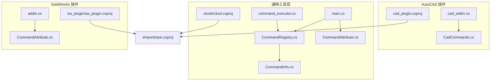
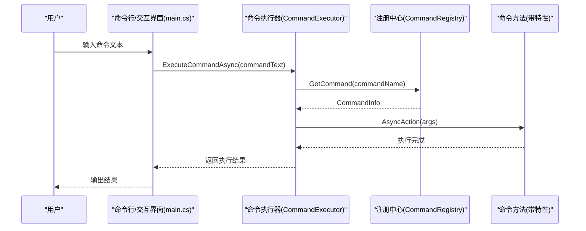
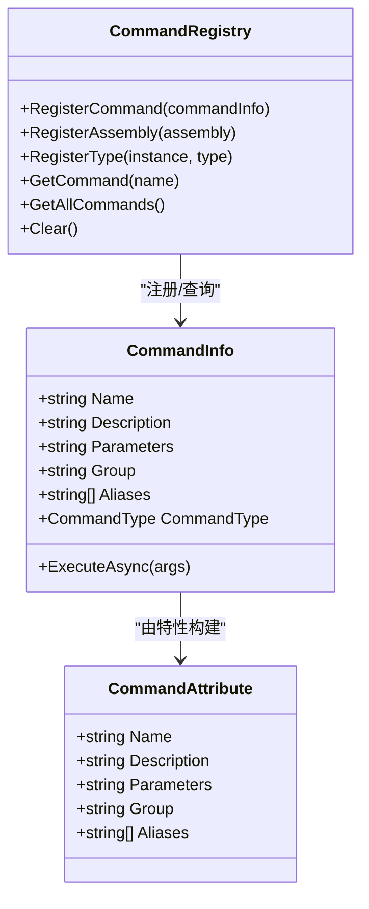
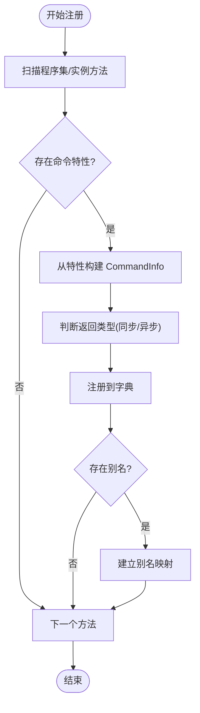
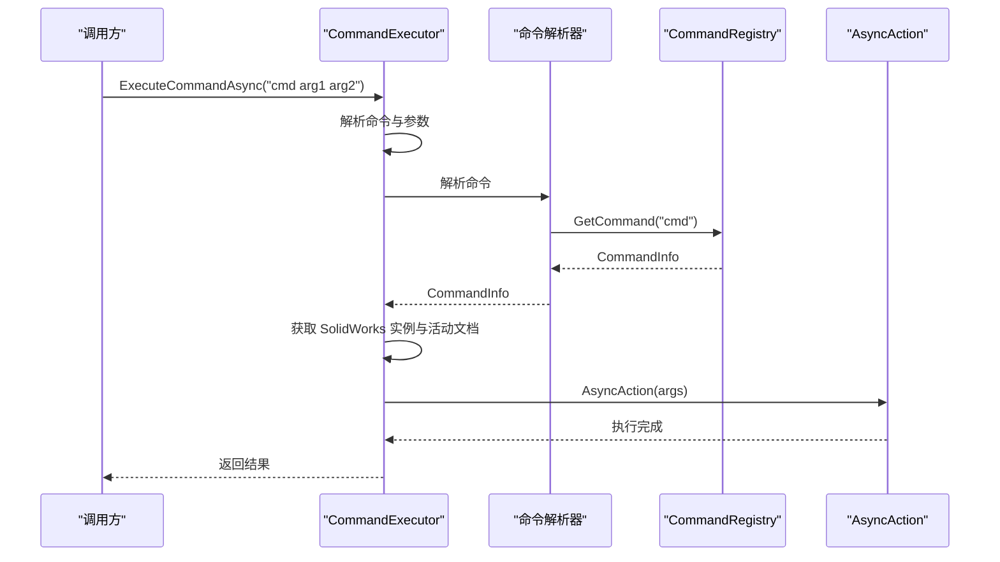
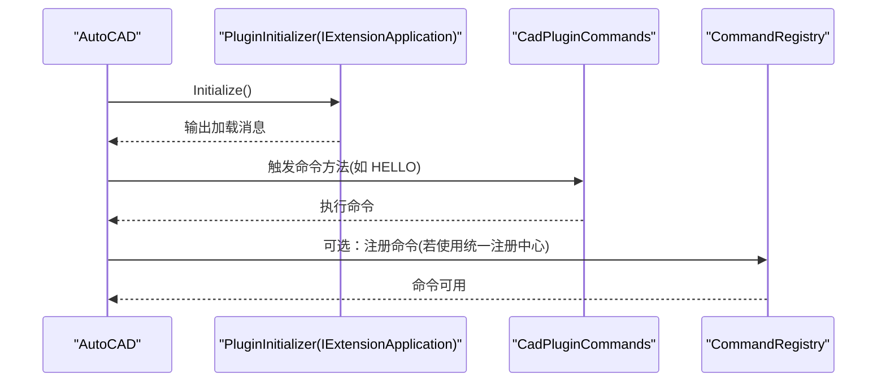
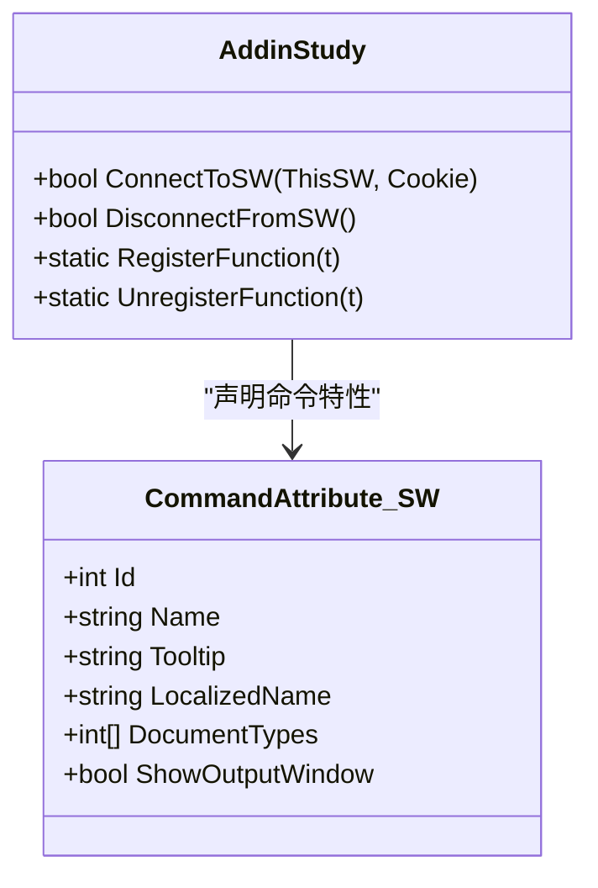
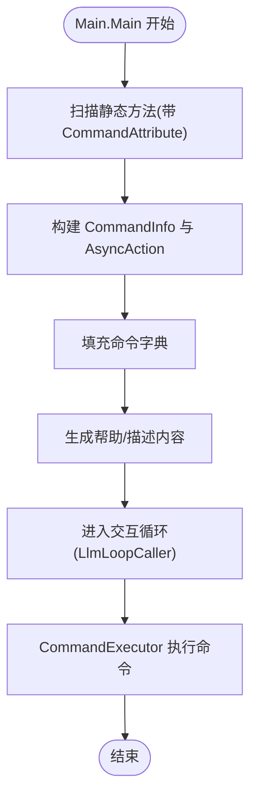
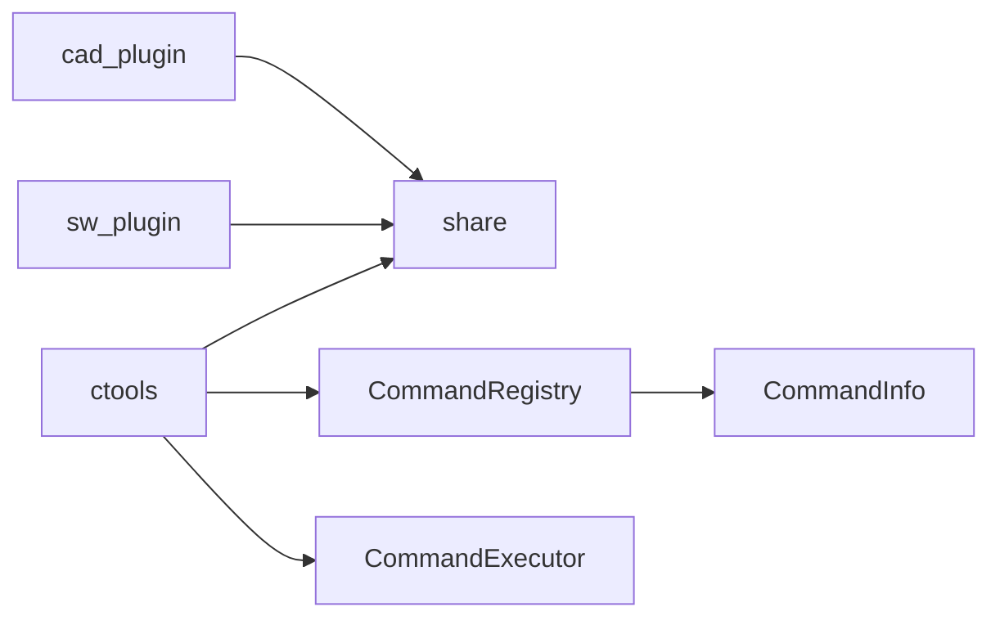

# 扩展接口

<cite>
**本文引用的文件**
- [CadCommands.cs](file://cad_plugin/CadCommands.cs)
- [cad_addin.cs](file://cad_plugin/cad_addin.cs)
- [cad_plugin.csproj](file://cad_plugin/cad_plugin.csproj)
- [CommandAttribute.cs](file://ctools/CommandAttribute.cs)
- [CommandInfo.cs](file://ctools/CommandInfo.cs)
- [CommandRegistry.cs](file://ctools/CommandRegistry.cs)
- [main.cs](file://ctools/main.cs)
- [command_executor.cs](file://ctools/command_executor.cs)
- [CommandAttribute.cs](file://sw_plugin/CommandAttribute.cs)
- [addin.cs](file://sw_plugin/addin.cs)
- [sw_plugin.csproj](file://sw_plugin/sw_plugin.csproj)
- [share.csproj](file://share/share.csproj)
</cite>

## 目录
1. [简介](#简介)
2. [项目结构](#项目结构)
3. [核心组件](#核心组件)
4. [架构总览](#架构总览)
5. [详细组件分析](#详细组件分析)
6. [依赖关系分析](#依赖关系分析)
7. [性能考量](#性能考量)
8. [故障排查指南](#故障排查指南)
9. [结论](#结论)
10. [附录](#附录)

## 简介
本文件系统化地文档化了扩展接口与插件系统的实现与使用方法，覆盖以下主题：
- 自定义命令开发：如何通过特性标记与注册中心进行声明式注册
- 接口定义与实现规范：命令特性、命令信息模型、注册中心与执行器
- 命令特性使用：CommandAttribute 的配置项、参数验证与元数据管理
- 插件注册系统：动态加载、依赖管理与版本控制
- 扩展开发指南：接口设计、实现模式与集成测试
- 架构设计原则：模块化、可扩展性与向后兼容
- 安全机制、权限控制与性能优化策略
- 示例与最佳实践

## 项目结构
该项目由三个主要子项目组成：
- cad_plugin：AutoCAD 插件，提供命令入口与 COM 注册逻辑
- ctools：命令执行器与注册中心，支持命令注册、解析与执行
- sw_plugin：SolidWorks 插件，提供命令特性与 COM 托管插件生命周期

图表来源
- [cad_plugin.csproj:1-46](file://cad_plugin/cad_plugin.csproj#L1-L46)
- [ctool.csproj:1-55](file://ctools/ctool.csproj#L1-L55)
- [sw_plugin.csproj:1-74](file://sw_plugin/sw_plugin.csproj#L1-L74)
- [share.csproj:1-40](file://share/share.csproj#L1-L40)

章节来源
- [cad_plugin.csproj:1-46](file://cad_plugin/cad_plugin.csproj#L1-L46)
- [ctool.csproj:1-55](file://ctools/ctool.csproj#L1-L55)
- [sw_plugin.csproj:1-74](file://sw_plugin/sw_plugin.csproj#L1-L74)
- [share.csproj:1-40](file://share/share.csproj#L1-L40)

## 核心组件
- 命令特性（CommandAttribute）：用于声明命令元数据，包括名称、描述、参数、分组、别名等
- 命令信息（CommandInfo）：封装命令的名称、描述、参数、分组、别名、执行委托与同步/异步类型
- 命令注册中心（CommandRegistry）：全局单例，负责命令注册、批量扫描、别名映射与查找
- 命令执行器（CommandExecutor）：解析命令文本、解析参数、连接 SolidWorks、执行命令并处理异常
- 主程序（main.cs）：在桌面应用模式下注册命令、构建命令描述、提供搜索与帮助
- AutoCAD 插件入口（CadCommands.cs、cad_addin.cs）：提供 AutoCAD 命令与 COM 注册逻辑
- SolidWorks 插件入口（addin.cs、CommandAttribute.cs）：提供 COM 托管插件生命周期与命令特性

章节来源
- [CommandAttribute.cs:1-20](file://ctools/CommandAttribute.cs#L1-L20)
- [CommandInfo.cs:1-41](file://ctools/CommandInfo.cs#L1-L41)
- [CommandRegistry.cs:1-242](file://ctools/CommandRegistry.cs#L1-L242)
- [command_executor.cs:1-116](file://ctools/command_executor.cs#L1-L116)
- [main.cs:1-377](file://ctools/main.cs#L1-L377)
- [CadCommands.cs:1-106](file://cad_plugin/CadCommands.cs#L1-L106)
- [cad_addin.cs:1-103](file://cad_plugin/cad_addin.cs#L1-L103)
- [CommandAttribute.cs:1-27](file://sw_plugin/CommandAttribute.cs#L1-L27)
- [addin.cs:1-339](file://sw_plugin/addin.cs#L1-L339)

## 架构总览
扩展接口采用“特性驱动 + 注册中心 + 执行器”的分层架构：
- 特性层：在方法上标注 CommandAttribute，声明命令元数据
- 注册层：CommandRegistry 扫描程序集或实例方法，构建命令字典与别名映射
- 执行层：CommandExecutor 解析命令文本，解析参数，调用 CommandRegistry 中的 AsyncAction
- 平台适配：AutoCAD 与 SolidWorks 分别提供各自的命令入口与生命周期管理

图表来源
- [main.cs:34-109](file://ctools/main.cs#L34-L109)
- [command_executor.cs:32-113](file://ctools/command_executor.cs#L32-L113)
- [CommandRegistry.cs:113-131](file://ctools/CommandRegistry.cs#L113-L131)

## 详细组件分析

### 命令特性与元数据管理
- 通用特性（ctools.CommandAttribute）
  - 字段：名称、描述、参数、分组、别名数组
  - 用途：在方法上声明命令元数据，供注册中心扫描
- SolidWorks 特性（sw_plugin.CommandAttribute）
  - 字段：命令 ID、名称、Tooltip、本地化名称、文档类型、是否显示输出窗口
  - 用途：声明 SolidWorks 命令菜单项与上下文可用性

图表来源
- [CommandAttribute.cs:1-20](file://ctools/CommandAttribute.cs#L1-L20)
- [CommandInfo.cs:1-41](file://ctools/CommandInfo.cs#L1-L41)
- [CommandRegistry.cs:1-242](file://ctools/CommandRegistry.cs#L1-L242)

章节来源
- [CommandAttribute.cs:1-20](file://ctools/CommandAttribute.cs#L1-L20)
- [CommandInfo.cs:1-41](file://ctools/CommandInfo.cs#L1-L41)
- [CommandRegistry.cs:1-242](file://ctools/CommandRegistry.cs#L1-L242)
- [CommandAttribute.cs:1-27](file://sw_plugin/CommandAttribute.cs#L1-L27)

### 命令注册中心（CommandRegistry）
- 功能要点
  - 单例模式，线程安全
  - 支持注册单个命令、批量扫描程序集、从实例类型注册
  - 维护命令字典与别名映射，大小写不敏感
  - 从特性构建 CommandInfo，并根据返回类型区分同步/异步
- 错误处理
  - 捕获反射异常并输出调试信息
  - 对无效命令名与空参数进行保护

图表来源
- [CommandRegistry.cs:61-83](file://ctools/CommandRegistry.cs#L61-L83)
- [CommandRegistry.cs:158-196](file://ctools/CommandRegistry.cs#L158-L196)
- [CommandRegistry.cs:201-239](file://ctools/CommandRegistry.cs#L201-L239)

章节来源
- [CommandRegistry.cs:1-242](file://ctools/CommandRegistry.cs#L1-L242)

### 命令执行器（CommandExecutor）
- 功能要点
  - 解析命令文本，拆分命令名与参数
  - 通过回调解析命令（CommandRegistry），获取 CommandInfo
  - 连接 SolidWorks 应用与活动文档，更新上下文
  - 调用 AsyncAction 执行命令，捕获异常并返回友好提示
- 参数与错误处理
  - 空命令、未找到命令、未连接 SolidWorks、ActiveDoc 为空等均给出明确提示

图表来源
- [command_executor.cs:32-113](file://ctools/command_executor.cs#L32-L113)

章节来源
- [command_executor.cs:1-116](file://ctools/command_executor.cs#L1-L116)

### AutoCAD 插件系统
- 命令入口
  - 使用 [CommandMethod] 标注命令方法，例如 HELLO、mergedwg、COPYFILE
  - 提供剪贴板复制文件路径的辅助方法
- 插件生命周期
  - 实现 IExtensionApplication，插件加载时输出初始化消息
  - COM 注册/反注册逻辑通过批处理脚本维护注册表项
- 项目配置
  - 启用 COM 托管，目标框架 .NET Framework 4.8，平台 x64

图表来源
- [CadCommands.cs:14-19](file://cad_plugin/CadCommands.cs#L14-L19)
- [cad_addin.cs:84-103](file://cad_plugin/cad_addin.cs#L84-L103)

章节来源
- [CadCommands.cs:1-106](file://cad_plugin/CadCommands.cs#L1-L106)
- [cad_addin.cs:1-103](file://cad_plugin/cad_addin.cs#L1-L103)
- [cad_plugin.csproj:1-46](file://cad_plugin/cad_plugin.csproj#L1-L46)

### SolidWorks 插件系统
- 插件生命周期
  - 实现 ISwAddin，ConnectToSW/DisconnectFromSW 管理插件加载与卸载
  - 显示欢迎图与构建时间版本信息
  - COM 注册/反注册通过 [ComRegisterFunction]/[ComUnregisterFunction] 完成
- 命令特性
  - CommandAttribute 包含命令 ID、名称、Tooltip、本地化名称、文档类型、输出窗口开关
- 项目配置
  - 目标框架 .NET Framework 4.8，启用 COM 托管，平台 x64

图表来源
- [addin.cs:24-120](file://sw_plugin/addin.cs#L24-L120)
- [CommandAttribute.cs:9-26](file://sw_plugin/CommandAttribute.cs#L9-L26)

章节来源
- [addin.cs:1-339](file://sw_plugin/addin.cs#L1-L339)
- [CommandAttribute.cs:1-27](file://sw_plugin/CommandAttribute.cs#L1-L27)
- [sw_plugin.csproj:1-74](file://sw_plugin/sw_plugin.csproj#L1-L74)

### 主程序与命令注册（ctools）
- 命令注册
  - 扫描自身程序集中的静态方法，提取带 CommandAttribute 的方法
  - 根据返回类型区分同步/异步，构建 CommandInfo 与 AsyncAction
  - 支持性能标注（ProfiledAttribute）统计执行耗时
- 命令描述与帮助
  - 实时生成命令列表与分组、参数说明
  - 提供搜索功能，基于相似度评分匹配命令
- 交互循环
  - 通过 LlmLoopCaller 与 CommandRegistry 协作，支持自然语言与命令行两种模式

图表来源
- [main.cs:170-253](file://ctools/main.cs#L170-L253)
- [main.cs:114-145](file://ctools/main.cs#L114-L145)
- [main.cs:34-109](file://ctools/main.cs#L34-L109)

章节来源
- [main.cs:1-377](file://ctools/main.cs#L1-L377)

## 依赖关系分析
- 项目依赖
  - cad_plugin 与 sw_plugin 均引用 share 作为共享库，统一引用 AutoCAD/SolidWorks 互操作程序集
  - ctools 作为可执行程序，引用 share 并依赖 SolidWorks 互操作程序集
- 组件耦合
  - CommandRegistry 与 CommandInfo 低耦合，通过接口回调解耦命令解析与执行
  - CommandExecutor 通过委托注入命令解析器，便于替换与测试
- 外部依赖
  - AutoCAD 互操作程序集（accoremgd、Acdbmgd、Acmgd）
  - SolidWorks 互操作程序集（sldworks、swconst、swpublished、SolidWorksTools）

图表来源
- [cad_plugin.csproj:42-44](file://cad_plugin/cad_plugin.csproj#L42-L44)
- [sw_plugin.csproj:25-26](file://sw_plugin/sw_plugin.csproj#L25-L26)
- [ctool.csproj:25-26](file://ctools/ctool.csproj#L25-L26)

章节来源
- [cad_plugin.csproj:1-46](file://cad_plugin/cad_plugin.csproj#L1-L46)
- [sw_plugin.csproj:1-74](file://sw_plugin/sw_plugin.csproj#L1-L74)
- [ctool.csproj:1-55](file://ctools/ctool.csproj#L1-L55)
- [share.csproj:1-40](file://share/share.csproj#L1-L40)

## 性能考量
- 异步执行
  - CommandRegistry 与主程序均支持 Task 返回类型的命令，避免阻塞 UI
- 性能标注
  - 通过 ProfiledAttribute 对命令执行进行耗时统计，便于定位瓶颈
- 反射开销
  - 批量注册时一次性扫描程序集，避免重复反射；命令查找使用字典 O(1)
- I/O 与 UI
  - AutoCAD/SolidWorks 交互涉及大量互操作调用，应尽量减少频繁切换文档与重复查询

章节来源
- [CommandRegistry.cs:158-196](file://ctools/CommandRegistry.cs#L158-L196)
- [main.cs:28-32](file://ctools/main.cs#L28-L32)
- [main.cs:202-247](file://ctools/main.cs#L202-L247)

## 故障排查指南
- 命令未注册
  - 检查方法是否带有正确的 CommandAttribute
  - 确认 RegisterAssembly/RegisterType 是否被调用
- 命令找不到
  - 使用 CommandRegistry.GetCommand 查询大小写与别名是否正确
- 执行异常
  - CommandExecutor 捕获 TargetInvocationException 并输出内部异常信息
  - 检查 SolidWorks 是否已连接，ActiveDoc 是否为空
- AutoCAD 插件安装问题
  - 确认注册表项是否通过脚本正确写入
  - 检查 COM 注册是否成功（regasm）
- SolidWorks 插件安装问题
  - 确认 [ComRegisterFunction]/[ComUnregisterFunction] 是否执行
  - 检查 SolidWorks Add-in 管理器中插件状态

章节来源
- [CommandRegistry.cs:79-82](file://ctools/CommandRegistry.cs#L79-L82)
- [command_executor.cs:107-112](file://ctools/command_executor.cs#L107-L112)
- [cad_addin.cs:24-80](file://cad_plugin/cad_addin.cs#L24-L80)
- [addin.cs:262-333](file://sw_plugin/addin.cs#L262-L333)

## 结论
本扩展接口通过特性驱动与注册中心实现了跨平台（AutoCAD/SolidWorks）的命令扩展能力。其设计强调：
- 声明式注册与统一元数据模型
- 可插拔的命令解析与执行器
- 异步执行与性能可观测性
- 清晰的生命周期与 COM 托管
在实际开发中，建议遵循本文档的实现模式与最佳实践，确保扩展的稳定性、可维护性与可测试性。

## 附录

### 命令特性配置选项速查
- 通用特性（ctools.CommandAttribute）
  - Name：命令名称
  - Description：命令描述
  - Parameters：参数说明
  - Group：命令分组（如 cad、solidworks）
  - Aliases：别名数组
- SolidWorks 特性（sw_plugin.CommandAttribute）
  - Id：命令 ID
  - Name：命令名称
  - Tooltip：工具提示
  - LocalizedName：本地化名称
  - DocumentTypes：适用文档类型数组
  - ShowOutputWindow：是否显示输出窗口

章节来源
- [CommandAttribute.cs:1-20](file://ctools/CommandAttribute.cs#L1-L20)
- [CommandAttribute.cs:1-27](file://sw_plugin/CommandAttribute.cs#L1-L27)

### 自定义命令开发步骤
- 在目标类中编写静态方法，标注 CommandAttribute
- 若为异步命令，返回 Task 类型
- 在合适时机调用 CommandRegistry.RegisterAssembly 或 RegisterType
- 在命令执行前确保上下文（如 SolidWorks 实例）可用
- 编写集成测试：构造命令文本，通过 CommandExecutor 执行并断言结果

章节来源
- [CommandRegistry.cs:61-108](file://ctools/CommandRegistry.cs#L61-L108)
- [command_executor.cs:32-113](file://ctools/command_executor.cs#L32-L113)
- [main.cs:170-253](file://ctools/main.cs#L170-L253)

### 插件注册与版本控制
- AutoCAD
  - 使用批处理脚本维护注册表项，避免在 regasm 时访问未启动的应用
- SolidWorks
  - 通过 [ComRegisterFunction]/[ComUnregisterFunction] 注册/反注册
  - 读取程序集最后写入时间作为版本信息展示
- 依赖管理
  - 通过 share.csproj 统一引用互操作程序集，避免版本漂移

章节来源
- [cad_addin.cs:16-80](file://cad_plugin/cad_addin.cs#L16-L80)
- [addin.cs:124-129](file://sw_plugin/addin.cs#L124-L129)
- [sw_plugin.csproj:29-41](file://sw_plugin/sw_plugin.csproj#L29-L41)
- [share.csproj:12-23](file://share/share.csproj#L12-L23)

### 安全机制与权限控制
- 权限控制
  - 通过命令特性与分组隔离不同域命令（如 cad、solidworks）
  - 在执行前检查上下文（如 SolidWorks 实例）可用性
- 安全建议
  - 避免在命令中直接执行不受控的系统命令
  - 对外部输入进行最小化校验与白名单过滤

章节来源
- [CommandRegistry.cs:36-41](file://ctools/CommandRegistry.cs#L36-L41)
- [command_executor.cs:60-94](file://ctools/command_executor.cs#L60-L94)

### 最佳实践
- 接口设计
  - 使用 CommandInfo 与 AsyncAction 抽象命令行为
  - 通过委托注入 CommandRegistry，便于单元测试
- 实现模式
  - 同步命令直接执行；异步命令 await Task
  - 在 CommandExecutor 中集中处理异常与上下文刷新
- 集成测试
  - 构造命令文本与参数，调用 CommandExecutor.ExecuteCommandAsync
  - 断言返回消息与副作用（如文件生成、文档状态变化）

章节来源
- [CommandInfo.cs:17-39](file://ctools/CommandInfo.cs#L17-L39)
- [command_executor.cs:32-113](file://ctools/command_executor.cs#L32-L113)
- [main.cs:202-247](file://ctools/main.cs#L202-L247)