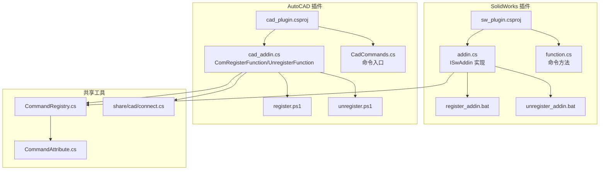
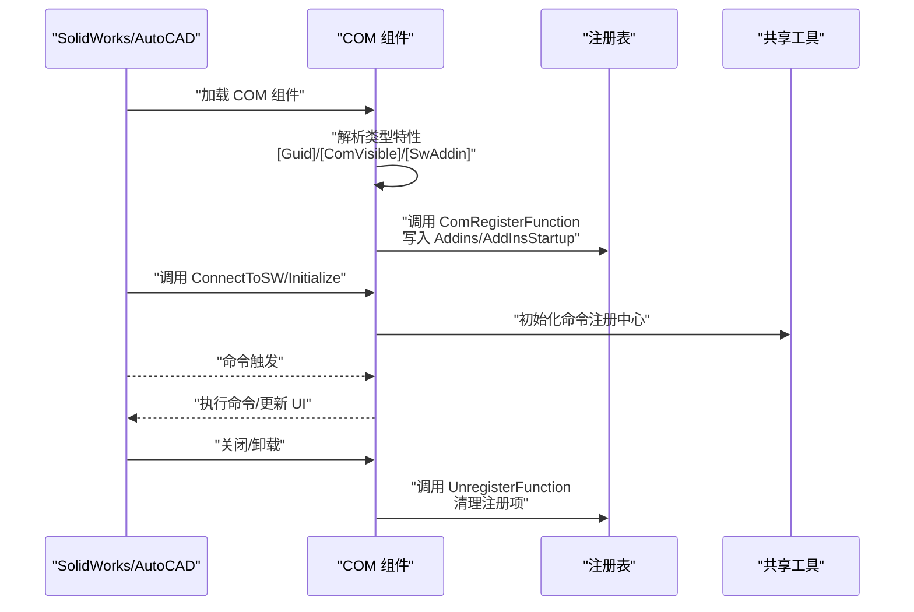
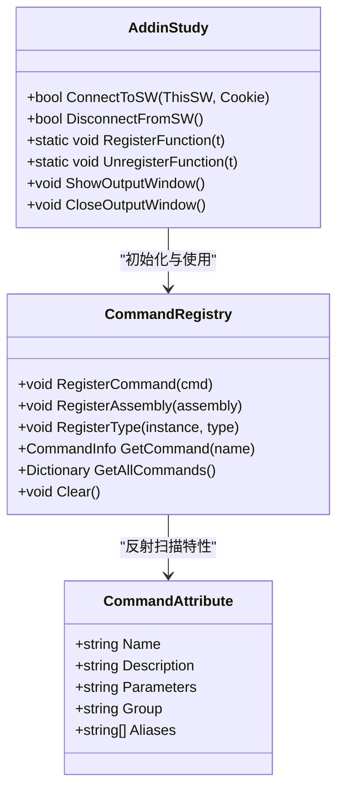
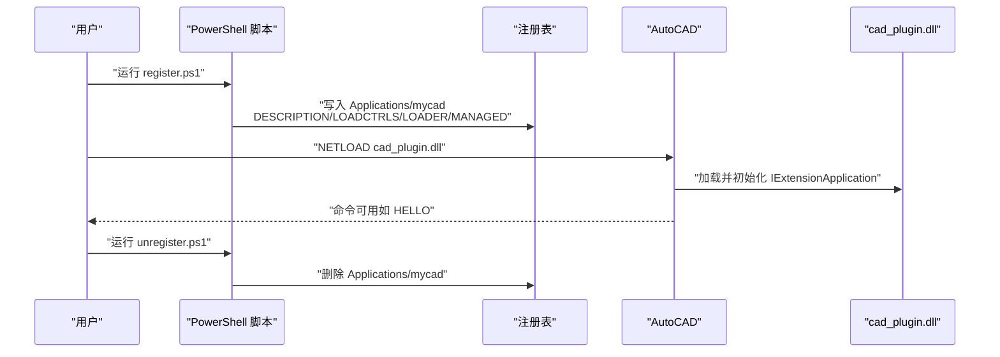
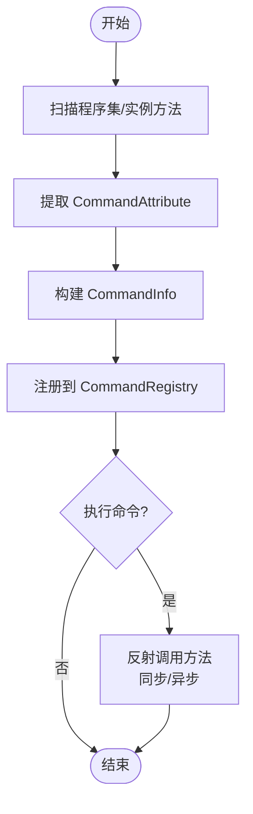
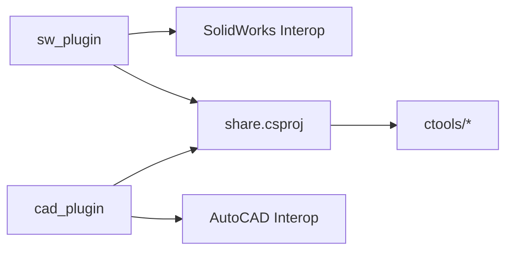

# COM 组件架构

<cite>
**本文引用的文件**
- [sw_plugin/addin.cs](file://sw_plugin/addin.cs)
- [sw_plugin/sw_plugin.csproj](file://sw_plugin/sw_plugin.csproj)
- [sw_plugin/register_addin.bat](file://sw_plugin/register_addin.bat)
- [sw_plugin/unregister_addin.bat](file://sw_plugin/unregister_addin.bat)
- [cad_plugin/cad_addin.cs](file://cad_plugin/cad_addin.cs)
- [cad_plugin/CadCommands.cs](file://cad_plugin/CadCommands.cs)
- [cad_plugin/cad_plugin.csproj](file://cad_plugin/cad_plugin.csproj)
- [cad_plugin/register.ps1](file://cad_plugin/register.ps1)
- [cad_plugin/unregister.ps1](file://cad_plugin/unregister.ps1)
- [ctools/CommandAttribute.cs](file://ctools/CommandAttribute.cs)
- [ctools/CommandRegistry.cs](file://ctools/CommandRegistry.cs)
- [share/cad/connect.cs](file://share/cad/connect.cs)
- [sw_plugin/function.cs](file://sw_plugin/function.cs)
</cite>

## 目录
1. [引言](#引言)
2. [项目结构](#项目结构)
3. [核心组件](#核心组件)
4. [架构总览](#架构总览)
5. [详细组件分析](#详细组件分析)
6. [依赖关系分析](#依赖关系分析)
7. [性能考虑](#性能考虑)
8. [故障排查指南](#故障排查指南)
9. [结论](#结论)
10. [附录](#附录)

## 引言
本文件面向 SolidWorks 与 AutoCAD 的 COM 插件开发者，系统化阐述基于 .NET 的 COM 组件架构设计与实现要点，重点覆盖以下主题：
- ISwAddin 接口的标准实现与特性配置（Guid、ComVisible、SwAddin 特性）
- COM 组件注册与注销机制（RegisterFunction/UnregisterFunction）
- 插件生命周期管理（连接到断开）
- 与 .NET 的互操作性（类型转换、内存管理）
- 编译、注册与调试的最佳实践
- 常见注册问题与解决方案

## 项目结构
本仓库包含两个主要插件工程：
- SolidWorks 插件（sw_plugin）：实现 ISwAddin，提供命令注册、菜单初始化、注册/注销逻辑
- AutoCAD 插件（cad_plugin）：实现 IExtensionApplication 与托管命令，提供注册/注销脚本与命令入口

图表来源
- [sw_plugin/sw_plugin.csproj:1-74](file://sw_plugin/sw_plugin.csproj#L1-L74)
- [sw_plugin/addin.cs:18-339](file://sw_plugin/addin.cs#L18-L339)
- [sw_plugin/function.cs:1-698](file://sw_plugin/function.cs#L1-L698)
- [cad_plugin/cad_plugin.csproj:1-46](file://cad_plugin/cad_plugin.csproj#L1-L46)
- [cad_plugin/cad_addin.cs:1-103](file://cad_plugin/cad_addin.cs#L1-L103)
- [cad_plugin/CadCommands.cs:1-106](file://cad_plugin/CadCommands.cs#L1-L106)
- [ctools/CommandAttribute.cs:1-20](file://ctools/CommandAttribute.cs#L1-L20)
- [ctools/CommandRegistry.cs:1-242](file://ctools/CommandRegistry.cs#L1-L242)
- [share/cad/connect.cs:1-200](file://share/cad/connect.cs#L1-L200)

章节来源
- [sw_plugin/sw_plugin.csproj:1-74](file://sw_plugin/sw_plugin.csproj#L1-L74)
- [cad_plugin/cad_plugin.csproj:1-46](file://cad_plugin/cad_plugin.csproj#L1-L46)

## 核心组件
- SolidWorks 插件（ISwAddin 实现）
  - 类型级别特性：Guid、ComVisible、SwAddin（描述、标题、启动加载）
  - 生命周期回调：ConnectToSW、DisconnectFromSW
  - 注册/注销：ComRegisterFunction/ComUnregisterFunction
  - 命令方法：通过特性驱动的命令注册与执行
- AutoCAD 插件（IExtensionApplication + 托管命令）
  - ComRegisterFunction/UnregisterFunction 完成注册表写入与清理
  - IExtensionApplication 自动初始化与终止
  - 托管命令入口（如 HELLO）

章节来源
- [sw_plugin/addin.cs:18-339](file://sw_plugin/addin.cs#L18-L339)
- [cad_plugin/cad_addin.cs:13-103](file://cad_plugin/cad_addin.cs#L13-L103)
- [cad_plugin/CadCommands.cs:12-106](file://cad_plugin/CadCommands.cs#L12-L106)

## 架构总览
下图展示 COM 组件与宿主应用之间的交互关系及注册流程。

图表来源
- [sw_plugin/addin.cs:18-339](file://sw_plugin/addin.cs#L18-L339)
- [cad_plugin/cad_addin.cs:16-80](file://cad_plugin/cad_addin.cs#L16-L80)
- [ctools/CommandRegistry.cs:12-242](file://ctools/CommandRegistry.cs#L12-L242)

## 详细组件分析

### SolidWorks 插件（ISwAddin 实现）
- 接口与特性
  - 类型级特性：Guid、ComVisible、SwAddin（描述、标题、启动加载）
  - 作用：向宿主暴露可发现的 COM 类型，并声明插件元数据
- 生命周期
  - ConnectToSW：建立与宿主的连接，设置回调、获取命令管理器、初始化命令注册中心与菜单
  - DisconnectFromSW：清理资源（示例中返回 true）
- 注册/注销
  - ComRegisterFunction：读取 SwAddin 特性，写入 HKLM SOFTWARE/SolidWorks/Addins 与 HKCU Software/SolidWorks/AddInsStartup
  - ComUnregisterFunction：删除上述注册项
- 命令体系
  - 通过特性驱动的命令注册中心，支持同步与异步命令执行
  - 命令方法示例：工程图转 DWG、新建工程图、导出 BOM、批量导出 STEP 等

图表来源
- [sw_plugin/addin.cs:18-339](file://sw_plugin/addin.cs#L18-L339)
- [ctools/CommandRegistry.cs:12-242](file://ctools/CommandRegistry.cs#L12-L242)
- [ctools/CommandAttribute.cs:5-17](file://ctools/CommandAttribute.cs#L5-L17)

章节来源
- [sw_plugin/addin.cs:96-218](file://sw_plugin/addin.cs#L96-L218)
- [sw_plugin/addin.cs:262-333](file://sw_plugin/addin.cs#L262-L333)
- [sw_plugin/function.cs:29-698](file://sw_plugin/function.cs#L29-L698)
- [ctools/CommandRegistry.cs:61-108](file://ctools/CommandRegistry.cs#L61-L108)
- [ctools/CommandAttribute.cs:5-17](file://ctools/CommandAttribute.cs#L5-L17)

### AutoCAD 插件（IExtensionApplication + 托管命令）
- ComRegisterFunction/UnregisterFunction
  - 注册：由 PowerShell 脚本直接写入 HKLM SOFTWARE/Autodesk/AutoCAD/*/Applications/mycad
  - 卸载：递归删除对应注册表项
- IExtensionApplication
  - Initialize：插件加载时输出欢迎信息
  - Terminate：插件卸载时清理（示例中为空）
- 托管命令
  - 命令入口：HELLO、mergedwg、COPYFILE 等
  - 命令实现：与 AutoCAD API 交互，执行业务逻辑

图表来源
- [cad_plugin/register.ps1:69-81](file://cad_plugin/register.ps1#L69-L81)
- [cad_plugin/unregister.ps1:69-81](file://cad_plugin/unregister.ps1#L69-L81)
- [cad_plugin/cad_addin.cs:16-80](file://cad_plugin/cad_addin.cs#L16-L80)
- [cad_plugin/CadCommands.cs:14-19](file://cad_plugin/CadCommands.cs#L14-L19)

章节来源
- [cad_plugin/cad_addin.cs:16-80](file://cad_plugin/cad_addin.cs#L16-L80)
- [cad_plugin/CadCommands.cs:14-106](file://cad_plugin/CadCommands.cs#L14-L106)
- [cad_plugin/register.ps1:1-93](file://cad_plugin/register.ps1#L1-L93)
- [cad_plugin/unregister.ps1:1-92](file://cad_plugin/unregister.ps1#L1-L92)

### 命令注册与执行（跨平台共享）
- CommandAttribute：定义命令名称、描述、参数、分组、别名
- CommandRegistry：单例注册中心，支持从程序集与实例方法反射注册命令；提供同步/异步执行封装
- 与宿主集成：SolidWorks 插件通过特性标注命令方法；AutoCAD 插件通过托管命令特性

图表来源
- [ctools/CommandAttribute.cs:5-17](file://ctools/CommandAttribute.cs#L5-L17)
- [ctools/CommandRegistry.cs:61-108](file://ctools/CommandRegistry.cs#L61-L108)
- [ctools/CommandRegistry.cs:158-196](file://ctools/CommandRegistry.cs#L158-L196)
- [ctools/CommandRegistry.cs:201-239](file://ctools/CommandRegistry.cs#L201-L239)

章节来源
- [ctools/CommandAttribute.cs:5-17](file://ctools/CommandAttribute.cs#L5-L17)
- [ctools/CommandRegistry.cs:12-242](file://ctools/CommandRegistry.cs#L12-L242)

### COM 互操作性与内存管理
- 类型转换
  - SolidWorks：将宿主传入对象转换为 SldWorks/ModelDoc2 等强类型
  - AutoCAD：通过 Interop 类型与宿主对象交互
- 内存管理
  - 使用反射与 COM 对象时，注意避免泄漏与悬挂引用
  - 在命令执行前后，确保必要的对象释放与缓存清理
- 错误处理
  - 注册/注销过程中捕获异常并记录日志，避免中断宿主

章节来源
- [sw_plugin/addin.cs:96-120](file://sw_plugin/addin.cs#L96-L120)
- [share/cad/connect.cs:19-125](file://share/cad/connect.cs#L19-L125)

## 依赖关系分析
- sw_plugin 依赖 SolidWorks Interop 与共享工具库
- cad_plugin 依赖 AutoCAD Interop 与共享工具库
- 两者均通过特性驱动命令注册，减少硬编码耦合

图表来源
- [sw_plugin/sw_plugin.csproj:24-42](file://sw_plugin/sw_plugin.csproj#L24-L42)
- [cad_plugin/cad_plugin.csproj:24-40](file://cad_plugin/cad_plugin.csproj#L24-L40)

章节来源
- [sw_plugin/sw_plugin.csproj:24-42](file://sw_plugin/sw_plugin.csproj#L24-L42)
- [cad_plugin/cad_plugin.csproj:24-40](file://cad_plugin/cad_plugin.csproj#L24-L40)

## 性能考虑
- 延迟初始化：命令注册中心按需扫描与注册，避免启动时大量反射开销
- 缓存策略：AutoCAD 连接模块对已连接实例进行缓存与有效性校验
- 异步命令：支持 Task 返回类型的命令以提升响应性

章节来源
- [ctools/CommandRegistry.cs:61-83](file://ctools/CommandRegistry.cs#L61-L83)
- [share/cad/connect.cs:13-35](file://share/cad/connect.cs#L13-L35)

## 故障排查指南
- SolidWorks 注册失败
  - 确认已以管理员权限运行批处理脚本
  - 检查 SwAddin 特性是否正确配置（描述、标题、启动加载）
  - 查看注册表写入路径是否成功
- AutoCAD 注册失败
  - 确认 PowerShell 脚本以管理员权限运行
  - 检查 Applications/mycad 是否存在，字段值是否正确
- 命令不可用
  - 确认命令方法已标注特性并被注册中心扫描
  - 检查宿主命令表中是否出现相应命令
- 卸载后残留
  - 使用对应的卸载脚本或批处理清理注册表
  - 重启宿主应用以生效

章节来源
- [sw_plugin/register_addin.bat:1-10](file://sw_plugin/register_addin.bat#L1-L10)
- [sw_plugin/unregister_addin.bat:1-11](file://sw_plugin/unregister_addin.bat#L1-L11)
- [cad_plugin/register.ps1:6-12](file://cad_plugin/register.ps1#L6-L12)
- [cad_plugin/unregister.ps1:6-12](file://cad_plugin/unregister.ps1#L6-L12)

## 结论
本架构通过特性驱动与注册中心实现了命令的自动化注册与执行，结合标准的 COM 组件注册/注销流程，为 SolidWorks 与 AutoCAD 提供了稳定、可维护的插件扩展能力。遵循本文的最佳实践与故障排查建议，可显著降低部署与维护成本。

## 附录
- 编译与部署
  - 目标框架：net48
  - 平台目标：x64
  - COM 主机：启用 COM Hosting，设置 ComVisible
- 调试建议
  - 使用宿主自带的日志输出（如 SendMsgToUser、Editor.WriteMessage）
  - 在注册/注销阶段加入日志记录，便于定位问题

章节来源
- [sw_plugin/sw_plugin.csproj:3-14](file://sw_plugin/sw_plugin.csproj#L3-L14)
- [cad_plugin/cad_plugin.csproj:3-14](file://cad_plugin/cad_plugin.csproj#L3-L14)