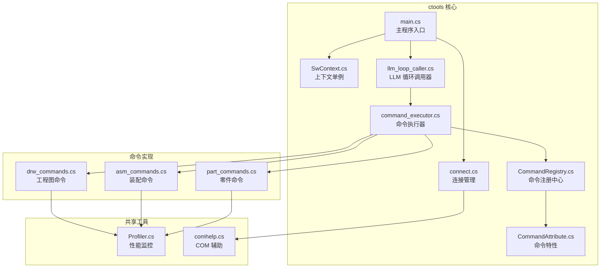
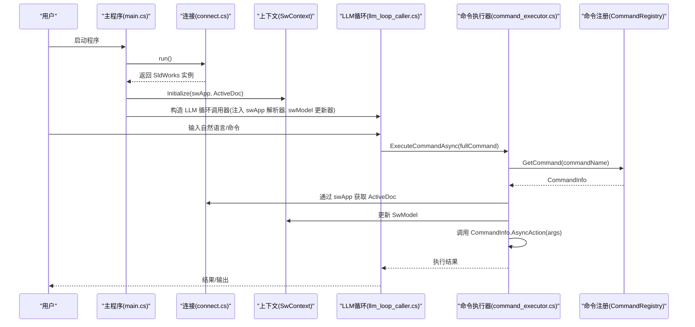
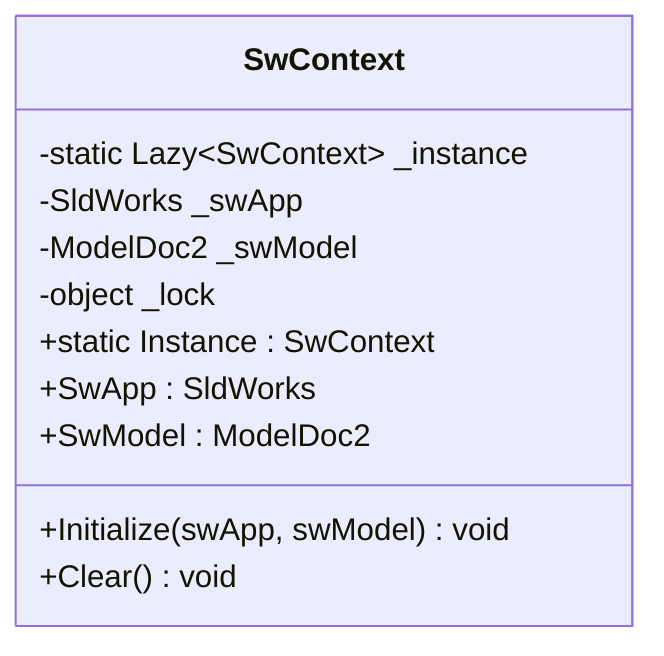
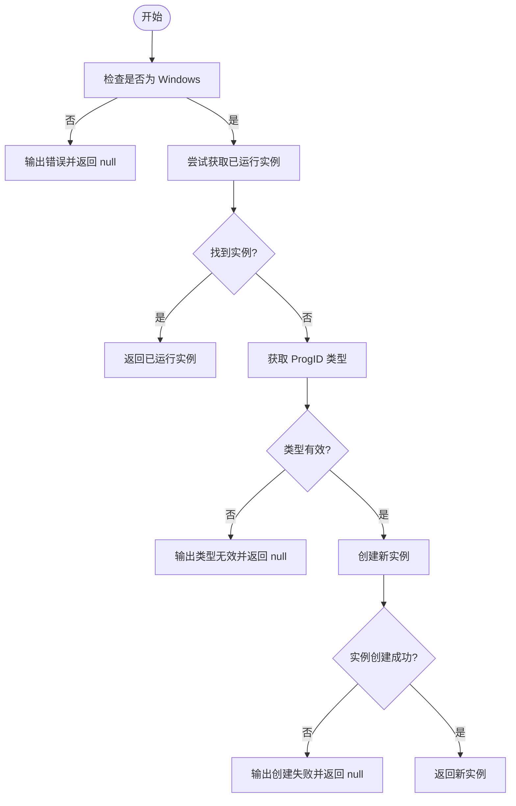
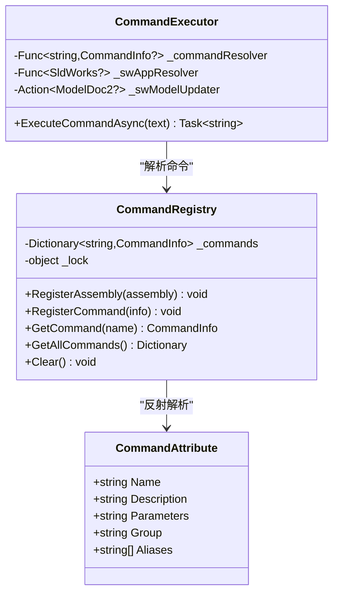
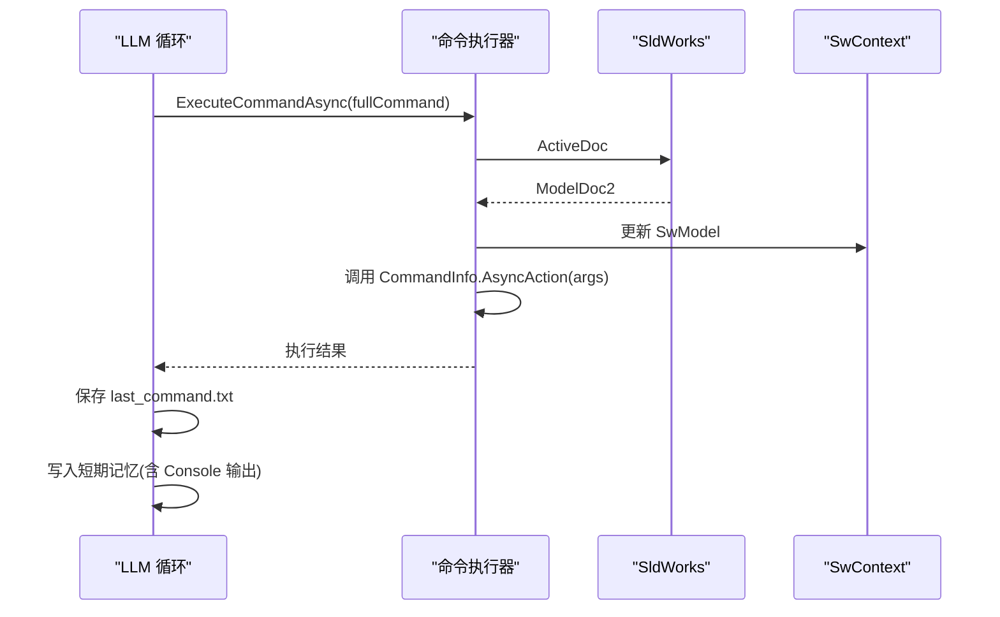
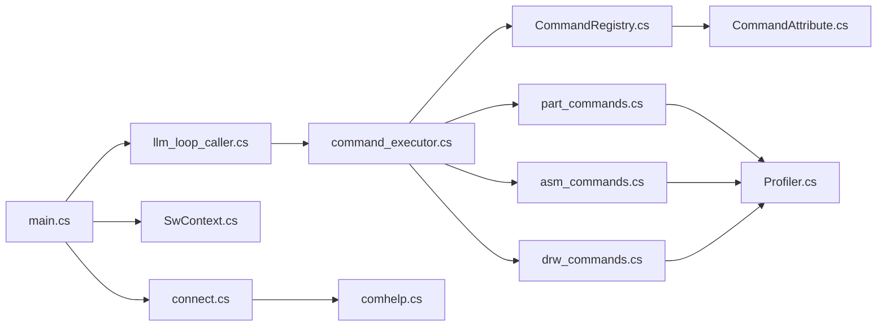

# SolidWorks API 上下文管理

<cite>
**本文引用的文件**
- [SwContext.cs](file://ctools/SwContext.cs)
- [main.cs](file://ctools/main.cs)
- [connect.cs](file://ctools/connect.cs)
- [command_executor.cs](file://ctools/command_executor.cs)
- [llm_loop_caller.cs](file://ctools/llm_loop_caller.cs)
- [CommandRegistry.cs](file://ctools/CommandRegistry.cs)
- [CommandAttribute.cs](file://ctools/CommandAttribute.cs)
- [part_commands.cs](file://ctools/solidworks_commands/part_commands.cs)
- [asm_commands.cs](file://ctools/solidworks_commands/asm_commands.cs)
- [drw_commands.cs](file://ctools/solidworks_commands/drw_commands.cs)
- [Profiler.cs](file://share/nomal/Profiler.cs)
- [comhelp.cs](file://share/nomal/comhelp.cs)
</cite>

## 目录
1. [简介](#简介)
2. [项目结构](#项目结构)
3. [核心组件](#核心组件)
4. [架构总览](#架构总览)
5. [详细组件分析](#详细组件分析)
6. [依赖关系分析](#依赖关系分析)
7. [性能考虑](#性能考虑)
8. [故障排查指南](#故障排查指南)
9. [结论](#结论)

## 简介
本技术文档围绕 SolidWorks API 上下文管理展开，重点阐述 SwContext 类的设计理念与单例模式实现，说明 SolidWorks 应用程序实例与当前活动文档的获取与管理方法，解释模型文档、装配体文档与工程图文档的统一管理方式，提供上下文状态的持久化与恢复策略，覆盖多文档环境下的上下文同步机制，并总结异常处理与错误恢复方法以及性能监控与资源使用优化建议。

## 项目结构
该项目采用“命令驱动 + 上下文管理”的组织方式：
- ctools：核心工具库，包含上下文管理、命令注册与执行、LLM 交互、连接管理等
- share：通用工具与业务封装（如模型文档操作、COM 辅助等）
- sw_plugin、cad_plugin：插件入口（本节聚焦 ctools 的上下文管理）

图表来源
- [SwContext.cs:1-87](file://ctools/SwContext.cs#L1-L87)
- [main.cs:1-377](file://ctools/main.cs#L1-L377)
- [connect.cs:1-56](file://ctools/connect.cs#L1-L56)
- [command_executor.cs:1-116](file://ctools/command_executor.cs#L1-L116)
- [llm_loop_caller.cs:1-1029](file://ctools/llm_loop_caller.cs#L1-L1029)
- [CommandRegistry.cs:1-242](file://ctools/CommandRegistry.cs#L1-L242)
- [CommandAttribute.cs:1-20](file://ctools/CommandAttribute.cs#L1-L20)
- [part_commands.cs:1-149](file://ctools/solidworks_commands/part_commands.cs#L1-L149)
- [asm_commands.cs:1-158](file://ctools/solidworks_commands/asm_commands.cs#L1-L158)
- [drw_commands.cs:1-165](file://ctools/solidworks_commands/drw_commands.cs#L1-L165)
- [Profiler.cs:1-27](file://share/nomal/Profiler.cs#L1-L27)
- [comhelp.cs:1-59](file://share/nomal/comhelp.cs#L1-L59)

章节来源
- [SwContext.cs:1-87](file://ctools/SwContext.cs#L1-L87)
- [main.cs:1-377](file://ctools/main.cs#L1-L377)

## 核心组件
- SwContext：全局上下文单例，持有 SldWorks 应用实例与当前 ModelDoc2 文档实例，提供初始化与清理能力，并通过锁保证线程安全。
- Connect：负责连接或创建 SolidWorks 应用实例，兼容已有实例与新实例两种场景。
- CommandRegistry：全局命令注册中心，支持从程序集反射注册命令，维护命令名与别名映射。
- CommandExecutor：命令执行器，负责解析命令、校验连接、刷新当前文档、调用 CommandRegistry 解析的命令动作。
- LlmLoopCaller：LLM 循环调用器，集成 Tool 调用模式，桥接自然语言与命令执行，具备输出捕获与持久化能力。
- 性能监控：Profiler 工具提供轻量级方法耗时统计，便于在命令执行链路中插入性能观测点。

章节来源
- [SwContext.cs:9-85](file://ctools/SwContext.cs#L9-L85)
- [connect.cs:9-55](file://ctools/connect.cs#L9-L55)
- [CommandRegistry.cs:12-241](file://ctools/CommandRegistry.cs#L12-L241)
- [command_executor.cs:12-115](file://ctools/command_executor.cs#L12-L115)
- [llm_loop_caller.cs:19-726](file://ctools/llm_loop_caller.cs#L19-L726)
- [Profiler.cs:6-26](file://share/nomal/Profiler.cs#L6-L26)

## 架构总览
SwContext 作为全局上下文单例，贯穿命令注册、执行与 LLM 交互流程。主程序在启动时连接 SolidWorks，初始化上下文，并将 swApp/swModel 注入 LLM 循环调用器与命令执行器。命令执行器每次执行前都会刷新当前激活文档，确保上下文一致性。

图表来源
- [main.cs:53-109](file://ctools/main.cs#L53-L109)
- [connect.cs:11-51](file://ctools/connect.cs#L11-L51)
- [SwContext.cs:71-84](file://ctools/SwContext.cs#L71-L84)
- [llm_loop_caller.cs:44-51](file://ctools/llm_loop_caller.cs#L44-L51)
- [command_executor.cs:32-113](file://ctools/command_executor.cs#L32-L113)
- [CommandRegistry.cs:113-131](file://ctools/CommandRegistry.cs#L113-L131)

## 详细组件分析

### SwContext：单例上下文设计
- 单例模式：使用 Lazy<T> 实现延迟初始化与线程安全；提供静态 Instance 访问。
- 线程安全：对 SwApp/SwModel 的读写均加锁，避免并发修改导致的状态不一致。
- 生命周期：提供 Initialize/Clear 方法，便于在应用启动与退出时正确设置/释放上下文。
- 统一入口：为命令执行器与 LLM 循环调用器提供全局访问点。

图表来源
- [SwContext.cs:9-85](file://ctools/SwContext.cs#L9-L85)

章节来源
- [SwContext.cs:9-85](file://ctools/SwContext.cs#L9-L85)

### 连接管理：SldWorks 实例获取
- 平台限制：仅在 Windows 平台支持。
- 优先策略：先尝试获取已运行实例，失败则创建新实例。
- 错误处理：捕获 COM 异常与通用异常，输出友好提示并返回 null。

图表来源
- [connect.cs:11-51](file://ctools/connect.cs#L11-L51)
- [comhelp.cs:17-46](file://share/nomal/comhelp.cs#L17-L46)

章节来源
- [connect.cs:9-55](file://ctools/connect.cs#L9-L55)
- [comhelp.cs:6-59](file://share/nomal/comhelp.cs#L6-L59)

### 命令注册与执行：统一命令体系
- 命令特性：CommandAttribute 提供命令名、描述、参数、分组与别名。
- 注册中心：CommandRegistry 支持从程序集反射注册命令，维护大小写不敏感的命令字典与别名映射。
- 执行器：CommandExecutor 在每次执行前刷新当前激活文档，确保 SwModel 最新；根据 CommandInfo.CommandType 决定同步/异步执行。
- 命令实现：part_commands/asm_commands/drw_commands 将具体 SolidWorks 操作封装为命令，统一由注册中心管理。

图表来源
- [CommandAttribute.cs:5-18](file://ctools/CommandAttribute.cs#L5-L18)
- [CommandRegistry.cs:12-241](file://ctools/CommandRegistry.cs#L12-L241)
- [command_executor.cs:12-26](file://ctools/command_executor.cs#L12-L26)

章节来源
- [CommandAttribute.cs:5-18](file://ctools/CommandAttribute.cs#L5-L18)
- [CommandRegistry.cs:12-241](file://ctools/CommandRegistry.cs#L12-L241)
- [command_executor.cs:12-115](file://ctools/command_executor.cs#L12-L115)

### LLM 循环调用器：上下文同步与持久化
- 上下文同步：每次命令执行前，CommandExecutor 通过 swApp.ActiveDoc 刷新当前模型，同时调用 swModel 更新器，确保 SwContext.SwModel 与真实激活文档一致。
- 持久化与恢复：LlmLoopCaller 将“最后执行命令”保存到 llm/last_command.txt，支持“last”命令重复执行；同时将工具调用结果与控制台输出写入短期记忆，便于后续对话理解。
- 用户确认：支持确认模式与自动模式，提升安全性与易用性。

图表来源
- [llm_loop_caller.cs:44-51](file://ctools/llm_loop_caller.cs#L44-L51)
- [command_executor.cs:68-94](file://ctools/command_executor.cs#L68-L94)
- [SwContext.cs:71-84](file://ctools/SwContext.cs#L71-L84)

章节来源
- [llm_loop_caller.cs:69-112](file://ctools/llm_loop_caller.cs#L69-L112)
- [command_executor.cs:68-94](file://ctools/command_executor.cs#L68-L94)

### 多文档环境下的上下文同步机制
- 激活文档刷新：CommandExecutor 在执行命令前强制读取 swApp.ActiveDoc，并通过 swModel 更新器同步到 SwContext，确保多文档切换时上下文始终与当前激活文档一致。
- IActiveDoc2 备用：若 ActiveDoc 为空，尝试通过 IActiveDoc2 获取，增强健壮性。
- 命令粒度隔离：每个命令执行独立刷新，避免跨命令污染上下文状态。

章节来源
- [command_executor.cs:68-94](file://ctools/command_executor.cs#L68-L94)

### 统一文档管理：模型/装配/工程图
- 文档类型：通过 swDocumentTypes_e 区分 PART/ASSEMBLY/DRAWING，命令层按需处理。
- 操作封装：各命令模块（part_commands/asm_commands/drw_commands）将具体 SolidWorks 操作封装为命令，统一由注册中心管理，便于跨类型复用与扩展。
- 通用工具：close_current_doc、get_current_doc_name 等封装常用文档操作，减少重复代码。

章节来源
- [part_commands.cs:11-148](file://ctools/solidworks_commands/part_commands.cs#L11-L148)
- [asm_commands.cs:11-157](file://ctools/solidworks_commands/asm_commands.cs#L11-L157)
- [drw_commands.cs:14-164](file://ctools/solidworks_commands/drw_commands.cs#L14-L164)
- [close_current_doc.cs:9-24](file://share/modeldoc/close_current_doc.cs#L9-L24)
- [get_current_doc_name.cs:9-24](file://share/modeldoc/get_current_doc_name.cs#L9-L24)

## 依赖关系分析
- 主程序依赖连接模块与上下文单例，启动后初始化全局上下文。
- LLM 循环调用器依赖命令执行器与命令注册中心，形成“自然语言 -> 命令 -> 执行”的闭环。
- 命令执行器依赖注册中心解析命令，并通过 swApp 获取当前激活文档，最终调用具体命令实现。
- 性能监控工具在命令实现中可选使用，不影响核心流程。

图表来源
- [main.cs:53-109](file://ctools/main.cs#L53-L109)
- [llm_loop_caller.cs:44-51](file://ctools/llm_loop_caller.cs#L44-L51)
- [command_executor.cs:12-26](file://ctools/command_executor.cs#L12-L26)
- [CommandRegistry.cs:61-83](file://ctools/CommandRegistry.cs#L61-L83)
- [part_commands.cs:11-148](file://ctools/solidworks_commands/part_commands.cs#L11-L148)
- [asm_commands.cs:11-157](file://ctools/solidworks_commands/asm_commands.cs#L11-L157)
- [drw_commands.cs:14-164](file://ctools/solidworks_commands/drw_commands.cs#L14-L164)
- [Profiler.cs:6-26](file://share/nomal/Profiler.cs#L6-L26)
- [comhelp.cs:17-46](file://share/nomal/comhelp.cs#L17-L46)

章节来源
- [main.cs:53-109](file://ctools/main.cs#L53-L109)
- [llm_loop_caller.cs:44-51](file://ctools/llm_loop_caller.cs#L44-L51)
- [command_executor.cs:12-26](file://ctools/command_executor.cs#L12-L26)
- [CommandRegistry.cs:61-83](file://ctools/CommandRegistry.cs#L61-L83)

## 性能考虑
- 性能监控：在命令实现中使用 Profiler.Time 包裹关键步骤，输出毫秒级耗时，便于定位瓶颈。
- 异步命令：命令可声明为 Task，CommandExecutor 与 CommandRegistry 均支持异步执行，避免阻塞主线程。
- 输出捕获：LLM 循环调用器通过 Console.SetOut 捕获命令执行过程中的控制台输出，便于调试与审计。
- 资源使用：命令执行完成后及时关闭文档、避免长时间占用 COM 资源；在批量处理场景中注意分批与间隔，降低 SolidWorks 压力。

章节来源
- [Profiler.cs:6-26](file://share/nomal/Profiler.cs#L6-L26)
- [CommandRegistry.cs:170-194](file://ctools/CommandRegistry.cs#L170-L194)
- [llm_loop_caller.cs:213-287](file://ctools/llm_loop_caller.cs#L213-L287)

## 故障排查指南
- 连接失败：检查平台是否为 Windows；确认 SolidWorks 是否已安装或可被 COM 激活；查看连接模块的异常输出。
- 未连接到 SolidWorks：命令执行器在解析命令时会检查 swApp 是否为空，若为空则提示“未连接到 SolidWorks”，需先启动程序。
- 无激活文档：CommandExecutor 在执行前会尝试通过 ActiveDoc/IActiveDoc2 获取当前模型，若仍为空则输出警告；可在命令实现中增加前置检查。
- 异常处理：命令执行器与注册中心均捕获 TargetInvocationException 与通用异常，输出详细错误信息；建议在命令实现中补充 try-catch 并记录日志。
- 上下文不同步：确保每次命令执行前通过 CommandExecutor 刷新 SwModel；避免在命令外部直接修改 SwContext.SwModel 而不经过执行器。

章节来源
- [connect.cs:21-50](file://ctools/connect.cs#L21-L50)
- [command_executor.cs:60-112](file://ctools/command_executor.cs#L60-L112)
- [CommandRegistry.cs:184-193](file://ctools/CommandRegistry.cs#L184-L193)

## 结论
SwContext 通过单例与锁实现了线程安全的全局上下文，结合 Connect 的稳健连接策略与 CommandExecutor 的上下文刷新机制，确保在多文档环境下上下文与实际 SolidWorks 激活文档保持一致。CommandRegistry 提供统一命令注册与解析，配合 LLM 循环调用器实现自然语言到命令的无缝衔接。通过 Profiler 等工具可对关键路径进行性能观测，整体架构清晰、扩展性强，适合在复杂 CAD 自动化场景中持续演进。