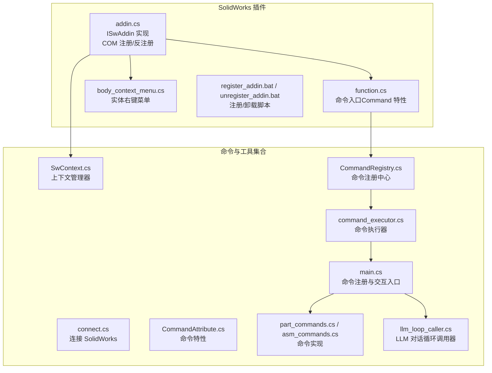
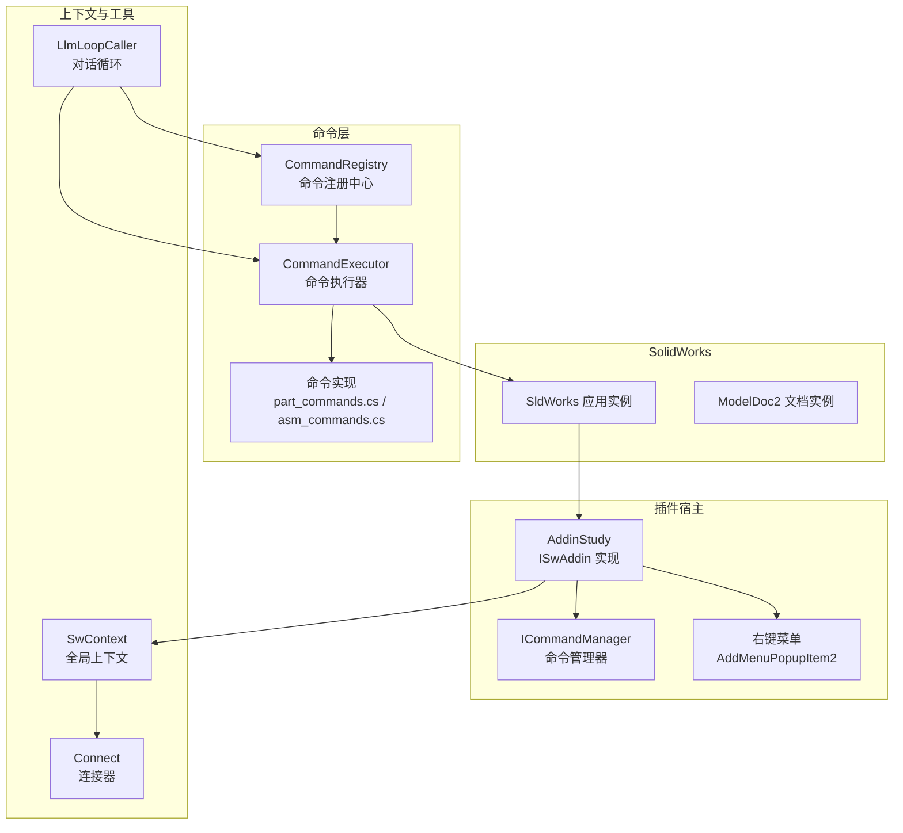
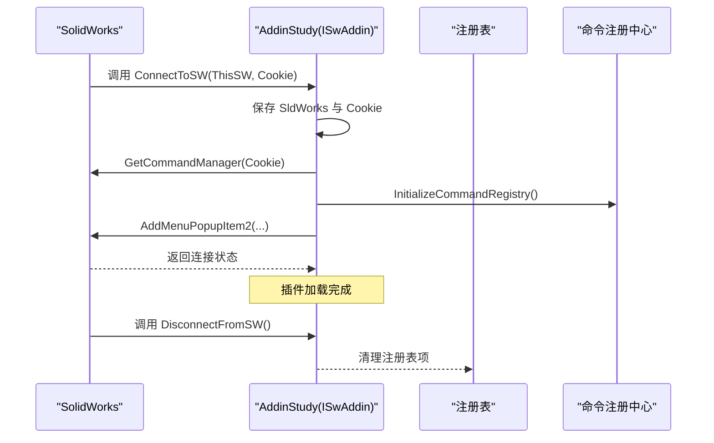
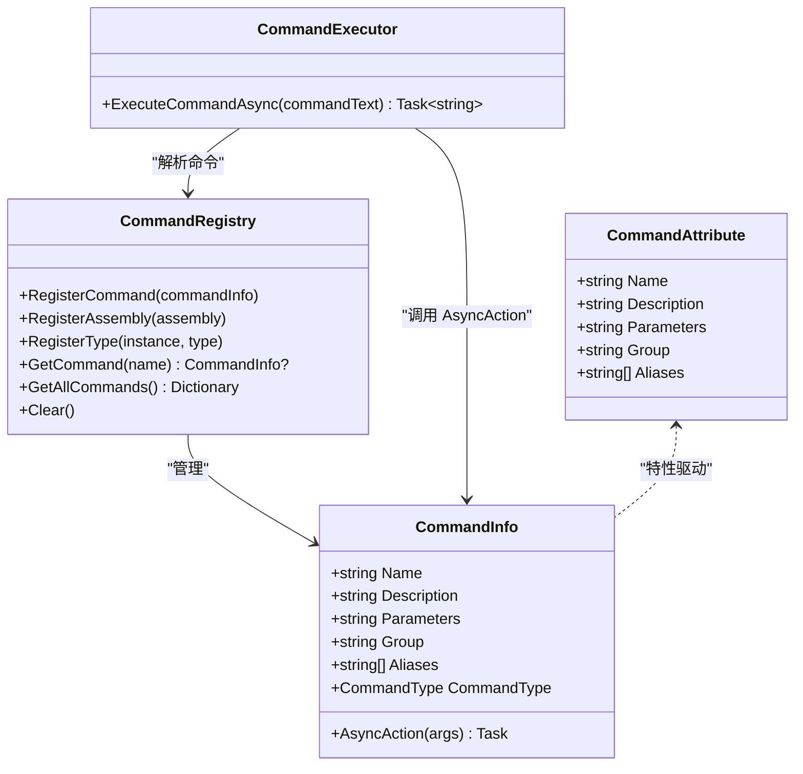
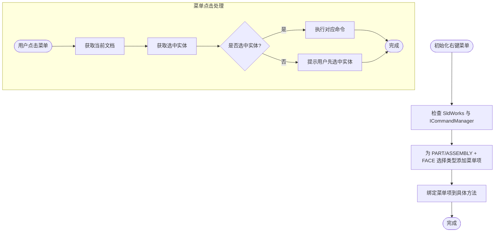
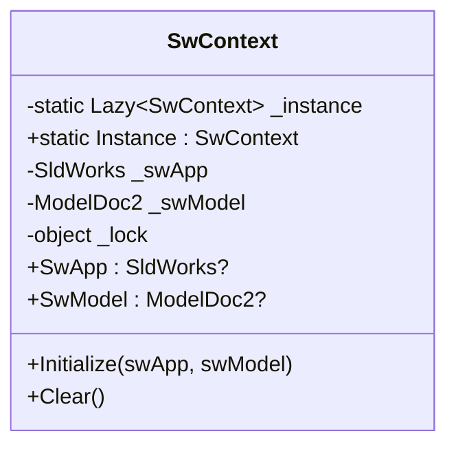
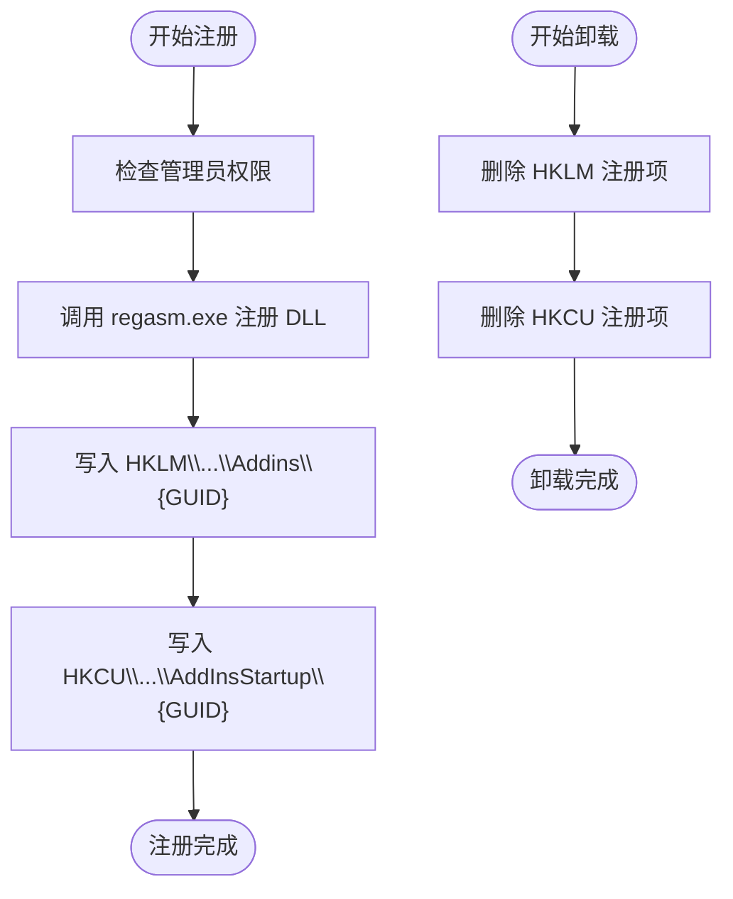
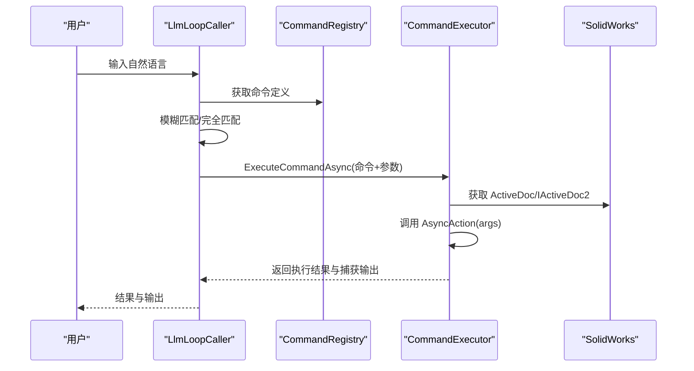
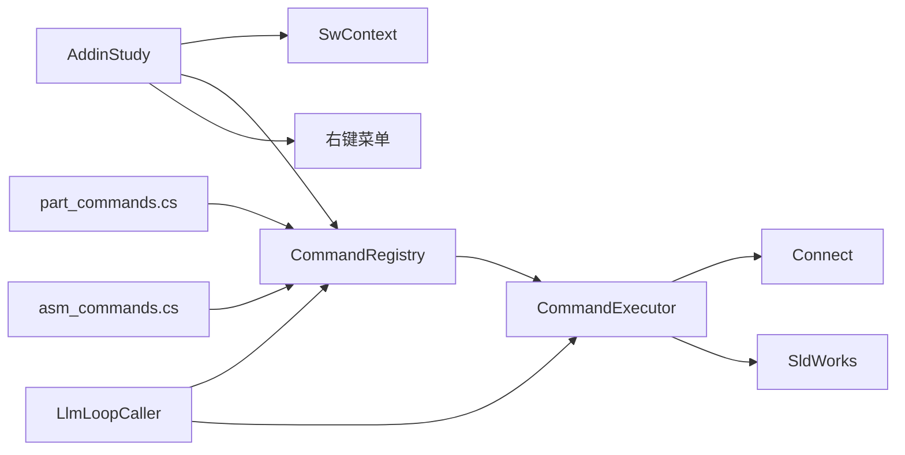

# SolidWorks 集成

<cite>
**本文引用的文件**
- [sw_plugin/addin.cs](file://sw_plugin/addin.cs)
- [sw_plugin/function.cs](file://sw_plugin/function.cs)
- [sw_plugin/body_context_menu.cs](file://sw_plugin/body_context_menu.cs)
- [sw_plugin/register_addin.bat](file://sw_plugin/register_addin.bat)
- [sw_plugin/unregister_addin.bat](file://sw_plugin/unregister_addin.bat)
- [ctools/SwContext.cs](file://ctools/SwContext.cs)
- [ctools/connect.cs](file://ctools/connect.cs)
- [ctools/CommandRegistry.cs](file://ctools/CommandRegistry.cs)
- [ctools/CommandAttribute.cs](file://ctools/CommandAttribute.cs)
- [ctools/command_executor.cs](file://ctools/command_executor.cs)
- [ctools/main.cs](file://ctools/main.cs)
- [ctools/solidworks_commands/part_commands.cs](file://ctools/solidworks_commands/part_commands.cs)
- [ctools/solidworks_commands/asm_commands.cs](file://ctools/solidworks_commands/asm_commands.cs)
- [ctools/llm_loop_caller.cs](file://ctools/llm_loop_caller.cs)
- [cad_plugin/cad_addin.cs](file://cad_plugin/cad_addin.cs)
- [cad_plugin/register.ps1](file://cad_plugin/register.ps1)
- [cad_plugin/unregister.ps1](file://cad_plugin/unregister.ps1)
</cite>

## 目录
1. [简介](#简介)
2. [项目结构](#项目结构)
3. [核心组件](#核心组件)
4. [架构总览](#架构总览)
5. [详细组件分析](#详细组件分析)
6. [依赖关系分析](#依赖关系分析)
7. [性能考虑](#性能考虑)
8. [故障排查指南](#故障排查指南)
9. [结论](#结论)
10. [附录](#附录)

## 简介
本技术文档面向 SolidWorks 插件开发者，系统阐述基于 COM 组件的插件架构与实现要点，涵盖以下主题：
- ISwAddin 接口的标准实现与 Guid 配置
- 插件注册与生命周期管理（自动加载与手动注册）
- 命令管理器集成与实体右键菜单实现
- SwContext 上下文管理器的作用与使用方式
- SolidWorks API 最佳实践与性能优化建议
- 常见集成问题与调试技巧

目标是帮助开发者快速理解 COM 组件编程与 SolidWorks API 的使用方法，并在实际项目中稳定落地。

## 项目结构
该项目由两部分组成：
- sw_plugin：SolidWorks 插件主程序，负责 COM 插件生命周期、命令注册、UI 交互与实体右键菜单集成
- ctools：命令与工具集合，提供命令注册中心、命令执行器、LLM 对话循环调用器以及大量 SolidWorks 命令实现

**图表来源**
- [sw_plugin/addin.cs:18-339](file://sw_plugin/addin.cs#L18-L339)
- [sw_plugin/function.cs:29-698](file://sw_plugin/function.cs#L29-L698)
- [sw_plugin/body_context_menu.cs:141-166](file://sw_plugin/body_context_menu.cs#L141-L166)
- [ctools/SwContext.cs:9-85](file://ctools/SwContext.cs#L9-L85)
- [ctools/connect.cs:9-51](file://ctools/connect.cs#L9-L51)
- [ctools/CommandRegistry.cs:12-242](file://ctools/CommandRegistry.cs#L12-L242)
- [ctools/CommandAttribute.cs:5-18](file://ctools/CommandAttribute.cs#L5-L18)
- [ctools/command_executor.cs:12-116](file://ctools/command_executor.cs#L12-L116)
- [ctools/main.cs:34-377](file://ctools/main.cs#L34-L377)
- [ctools/solidworks_commands/part_commands.cs:11-149](file://ctools/solidworks_commands/part_commands.cs#L11-L149)
- [ctools/solidworks_commands/asm_commands.cs:11-158](file://ctools/solidworks_commands/asm_commands.cs#L11-L158)
- [ctools/llm_loop_caller.cs:19-800](file://ctools/llm_loop_caller.cs#L19-L800)

**章节来源**
- [sw_plugin/addin.cs:18-339](file://sw_plugin/addin.cs#L18-L339)
- [ctools/main.cs:54-109](file://ctools/main.cs#L54-L109)

## 核心组件
- COM 插件宿主与生命周期
  - 通过 Guid 与 SwAddin 特性声明插件元数据，实现 ISwAddin 接口，完成连接与断开 SolidWorks 的回调
  - 提供 ComRegisterFunction/ComUnregisterFunction 完成注册表写入与清理
- 命令系统
  - 基于 Command 特性的命令注册中心，支持同步与异步命令
  - 命令执行器统一解析命令、解析参数、连接 SolidWorks、更新上下文并执行
- 上下文管理
  - SwContext 单例提供全局可访问的 SldWorks 与 ModelDoc2 实例，线程安全更新
- 实体右键菜单
  - 通过 AddMenuPopupItem2 为特征管理器树中的实体添加右键菜单项
- LLM 集成
  - LlmLoopCaller 支持 Tool 调用模式，将命令封装为工具，实现自然语言到命令的映射与执行

**章节来源**
- [sw_plugin/addin.cs:18-339](file://sw_plugin/addin.cs#L18-L339)
- [ctools/CommandRegistry.cs:12-242](file://ctools/CommandRegistry.cs#L12-L242)
- [ctools/command_executor.cs:12-116](file://ctools/command_executor.cs#L12-L116)
- [ctools/SwContext.cs:9-85](file://ctools/SwContext.cs#L9-L85)
- [sw_plugin/body_context_menu.cs:141-166](file://sw_plugin/body_context_menu.cs#L141-L166)
- [ctools/llm_loop_caller.cs:19-800](file://ctools/llm_loop_caller.cs#L19-L800)

## 架构总览
下图展示 SolidWorks 插件的总体架构与数据流：

**图表来源**
- [sw_plugin/addin.cs:96-120](file://sw_plugin/addin.cs#L96-L120)
- [sw_plugin/body_context_menu.cs:141-166](file://sw_plugin/body_context_menu.cs#L141-L166)
- [ctools/CommandRegistry.cs:12-242](file://ctools/CommandRegistry.cs#L12-L242)
- [ctools/command_executor.cs:12-116](file://ctools/command_executor.cs#L12-L116)
- [ctools/SwContext.cs:9-85](file://ctools/SwContext.cs#L9-L85)
- [ctools/connect.cs:9-51](file://ctools/connect.cs#L9-L51)
- [ctools/llm_loop_caller.cs:44-67](file://ctools/llm_loop_caller.cs#L44-L67)

## 详细组件分析

### COM 插件宿主与生命周期（ISwAddin 实现）
- Guid 与 SwAddin 特性
  - 通过 Guid 与 SwAddin 特性声明插件标识、标题与描述，并指定启动时加载
- 生命周期回调
  - ConnectToSW：保存 SldWorks 与 Cookie，获取 ICommandManager，初始化命令注册中心与右键菜单
  - DisconnectFromSW：插件卸载时的清理工作
- 注册与反注册
  - ComRegisterFunction/ComUnregisterFunction：向注册表写入/删除插件信息，支持启动时自动加载

**图表来源**
- [sw_plugin/addin.cs:96-120](file://sw_plugin/addin.cs#L96-L120)
- [sw_plugin/addin.cs:262-333](file://sw_plugin/addin.cs#L262-L333)

**章节来源**
- [sw_plugin/addin.cs:18-339](file://sw_plugin/addin.cs#L18-L339)

### 命令管理器集成与命令注册
- 命令注册中心
  - 单例模式，支持从程序集与实例类型批量注册命令，维护命令名到 CommandInfo 的映射
  - 支持命令别名注册，统一解析与执行
- 命令执行器
  - 解析命令文本，提取命令名与参数，解析当前激活文档，调用 CommandInfo.AsyncAction
  - 统一异常处理与日志输出
- 命令实现
  - 通过 Command 特性标注命令，支持同步与异步方法；在插件中通过 Command 特性标注命令入口

**图表来源**
- [ctools/CommandRegistry.cs:12-242](file://ctools/CommandRegistry.cs#L12-L242)
- [ctools/command_executor.cs:12-116](file://ctools/command_executor.cs#L12-L116)
- [ctools/CommandAttribute.cs:5-18](file://ctools/CommandAttribute.cs#L5-L18)

**章节来源**
- [ctools/CommandRegistry.cs:12-242](file://ctools/CommandRegistry.cs#L12-L242)
- [ctools/command_executor.cs:12-116](file://ctools/command_executor.cs#L12-L116)
- [ctools/CommandAttribute.cs:5-18](file://ctools/CommandAttribute.cs#L5-L18)
- [sw_plugin/function.cs:29-698](file://sw_plugin/function.cs#L29-L698)

### 实体右键菜单实现
- 初始化右键菜单
  - 通过 AddMenuPopupItem2 为特定文档类型与选择类型添加右键菜单项
  - 将菜单项与具体方法绑定，实现“从实体创建工程图”“导出 STEP”等功能
- 选择实体处理
  - 在方法中获取当前文档与选中实体，必要时切换到组件模型文档

**图表来源**
- [sw_plugin/body_context_menu.cs:141-166](file://sw_plugin/body_context_menu.cs#L141-L166)
- [sw_plugin/body_context_menu.cs:19-133](file://sw_plugin/body_context_menu.cs#L19-L133)

**章节来源**
- [sw_plugin/body_context_menu.cs:141-166](file://sw_plugin/body_context_menu.cs#L141-L166)
- [sw_plugin/body_context_menu.cs:19-133](file://sw_plugin/body_context_menu.cs#L19-L133)

### SwContext 上下文管理器
- 单例模式，提供全局可访问的 SldWorks 与 ModelDoc2 实例
- 线程安全：通过锁保护读写，避免并发访问导致的状态不一致
- 初始化与清理：在插件连接与断开时分别设置与清空上下文

**图表来源**
- [ctools/SwContext.cs:9-85](file://ctools/SwContext.cs#L9-L85)

**章节来源**
- [ctools/SwContext.cs:9-85](file://ctools/SwContext.cs#L9-L85)
- [sw_plugin/addin.cs:105-111](file://sw_plugin/addin.cs#L105-L111)

### 插件注册与生命周期管理
- 自动加载机制
  - 通过 SwAddin 特性中的 LoadAtStartup=true，使插件在 SolidWorks 启动时自动加载
- 手动注册流程
  - 使用批处理脚本调用 regasm.exe 完成 COM 注册与反注册
  - 注册时写入 HKLM 与 HKCU 键值，实现开机自动加载与用户级启动项

**图表来源**
- [sw_plugin/register_addin.bat:7-7](file://sw_plugin/register_addin.bat#L7-L7)
- [sw_plugin/unregister_addin.bat:7-7](file://sw_plugin/unregister_addin.bat#L7-L7)
- [sw_plugin/addin.cs:262-333](file://sw_plugin/addin.cs#L262-L333)

**章节来源**
- [sw_plugin/register_addin.bat:1-10](file://sw_plugin/register_addin.bat#L1-L10)
- [sw_plugin/unregister_addin.bat:1-11](file://sw_plugin/unregister_addin.bat#L1-L11)
- [sw_plugin/addin.cs:262-333](file://sw_plugin/addin.cs#L262-L333)

### SolidWorks API 最佳实践与性能优化
- 文档与模型获取
  - 优先使用 ActiveDoc；若为空，尝试 IActiveDoc2 获取，避免空引用
- 异步执行
  - 对耗时操作使用异步命令，减少 UI 阻塞
- 参数解析与校验
  - 在命令执行器中统一解析参数，提前校验文档状态与必填条件
- 性能监控
  - 使用 Profiled 特性与计时器包装命令，定位瓶颈
- 资源释放
  - 在命令结束时及时关闭临时打开的文档，避免句柄泄漏

**章节来源**
- [ctools/command_executor.cs:60-94](file://ctools/command_executor.cs#L60-L94)
- [ctools/solidworks_commands/asm_commands.cs:63-78](file://ctools/solidworks_commands/asm_commands.cs#L63-L78)

### LLM 集成与自然语言到命令映射
- 命令工具定义
  - 将命令注册中心中的命令动态转换为 Tool 定义，支持别名与参数说明
- 对话循环
  - 用户输入经模糊匹配与 LLM 确认后，转化为命令执行，支持确认/自动两种模式
- 输出捕获
  - 拦截命令执行过程中的 Console 输出，统一反馈给用户

**图表来源**
- [ctools/llm_loop_caller.cs:117-172](file://ctools/llm_loop_caller.cs#L117-L172)
- [ctools/llm_loop_caller.cs:493-726](file://ctools/llm_loop_caller.cs#L493-L726)
- [ctools/command_executor.cs:32-113](file://ctools/command_executor.cs#L32-L113)

**章节来源**
- [ctools/llm_loop_caller.cs:19-800](file://ctools/llm_loop_caller.cs#L19-L800)
- [ctools/command_executor.cs:12-116](file://ctools/command_executor.cs#L12-L116)

## 依赖关系分析
- 组件耦合
  - 插件宿主依赖 SwContext 与命令注册中心；命令执行器依赖注册中心与连接器
  - 命令实现位于独立模块，通过特性与注册中心解耦
- 外部依赖
  - SolidWorks Interop 类库、Windows 注册表 API、System.Windows.Forms 控件
- 潜在风险
  - COM 注册失败、注册表权限不足、命令参数解析错误、UI 线程阻塞

**图表来源**
- [sw_plugin/addin.cs:96-120](file://sw_plugin/addin.cs#L96-L120)
- [ctools/CommandRegistry.cs:12-242](file://ctools/CommandRegistry.cs#L12-L242)
- [ctools/command_executor.cs:12-116](file://ctools/command_executor.cs#L12-L116)
- [ctools/connect.cs:9-51](file://ctools/connect.cs#L9-L51)
- [ctools/solidworks_commands/part_commands.cs:11-149](file://ctools/solidworks_commands/part_commands.cs#L11-L149)
- [ctools/solidworks_commands/asm_commands.cs:11-158](file://ctools/solidworks_commands/asm_commands.cs#L11-L158)
- [ctools/llm_loop_caller.cs:44-67](file://ctools/llm_loop_caller.cs#L44-L67)

**章节来源**
- [sw_plugin/addin.cs:96-120](file://sw_plugin/addin.cs#L96-L120)
- [ctools/CommandRegistry.cs:12-242](file://ctools/CommandRegistry.cs#L12-L242)
- [ctools/command_executor.cs:12-116](file://ctools/command_executor.cs#L12-L116)

## 性能考虑
- 异步命令
  - 对耗时操作（如批量导出、打开文档）采用异步命令，避免阻塞 UI
- 文档状态检查
  - 在执行前检查文档是否保存、是否选中实体，减少无效调用
- 日志与诊断
  - 使用 Console 输出与 Debug.WriteLine 记录关键路径，便于定位性能瓶颈
- 批处理优化
  - 对装配体批量处理时，尽量减少重复打开/关闭文档的次数

[本节为通用指导，无需列出章节来源]

## 故障排查指南
- 插件未加载
  - 检查注册表项是否正确写入，确认管理员权限与 regasm 路径
  - 确认 SwAddin 特性中的 LoadAtStartup 与 Guid 配置
- 命令不可用或报错
  - 检查命令注册中心是否正确注册，确认命令名与别名拼写
  - 在命令执行器中查看参数解析与文档状态判断
- UI 无响应
  - 将耗时操作改为异步命令，避免在 UI 线程执行长任务
- 右键菜单不显示
  - 确认 AddMenuPopupItem2 的文档类型与选择类型参数正确
  - 检查 ConnectToSW 中的初始化顺序与异常日志

**章节来源**
- [sw_plugin/register_addin.bat:7-7](file://sw_plugin/register_addin.bat#L7-L7)
- [sw_plugin/addin.cs:262-333](file://sw_plugin/addin.cs#L262-L333)
- [ctools/command_executor.cs:32-113](file://ctools/command_executor.cs#L32-L113)
- [sw_plugin/body_context_menu.cs:141-166](file://sw_plugin/body_context_menu.cs#L141-L166)

## 结论
本项目通过标准的 COM 插件架构与命令系统，实现了 SolidWorks 的自动化扩展能力。借助 SwContext 上下文管理器、CommandRegistry 命令注册中心与 CommandExecutor 命令执行器，开发者可以快速扩展命令、集成 LLM 对话，并通过右键菜单提升用户体验。遵循本文的最佳实践与性能优化建议，可在保证稳定性的同时显著提升开发效率与运行性能。

[本节为总结性内容，无需列出章节来源]

## 附录
- 相关文件清单
  - 插件宿主与注册：[sw_plugin/addin.cs:18-339](file://sw_plugin/addin.cs#L18-L339)、[sw_plugin/register_addin.bat:1-10](file://sw_plugin/register_addin.bat#L1-L10)、[sw_plugin/unregister_addin.bat:1-11](file://sw_plugin/unregister_addin.bat#L1-L11)
  - 命令系统：[ctools/CommandRegistry.cs:12-242](file://ctools/CommandRegistry.cs#L12-L242)、[ctools/CommandAttribute.cs:5-18](file://ctools/CommandAttribute.cs#L5-L18)、[ctools/command_executor.cs:12-116](file://ctools/command_executor.cs#L12-L116)、[ctools/main.cs:54-109](file://ctools/main.cs#L54-L109)
  - 命令实现：[ctools/solidworks_commands/part_commands.cs:11-149](file://ctools/solidworks_commands/part_commands.cs#L11-L149)、[ctools/solidworks_commands/asm_commands.cs:11-158](file://ctools/solidworks_commands/asm_commands.cs#L11-L158)
  - 上下文与连接：[ctools/SwContext.cs:9-85](file://ctools/SwContext.cs#L9-L85)、[ctools/connect.cs:9-51](file://ctools/connect.cs#L9-L51)
  - 右键菜单：[sw_plugin/body_context_menu.cs:141-166](file://sw_plugin/body_context_menu.cs#L141-L166)
  - LLM 集成：[ctools/llm_loop_caller.cs:19-800](file://ctools/llm_loop_caller.cs#L19-L800)
  - AutoCAD 插件（对比参考）：[cad_plugin/cad_addin.cs:16-80](file://cad_plugin/cad_addin.cs#L16-L80)、[cad_plugin/register.ps1:1-93](file://cad_plugin/register.ps1#L1-L93)、[cad_plugin/unregister.ps1:1-92](file://cad_plugin/unregister.ps1#L1-L92)

[本节为补充材料，无需列出章节来源]