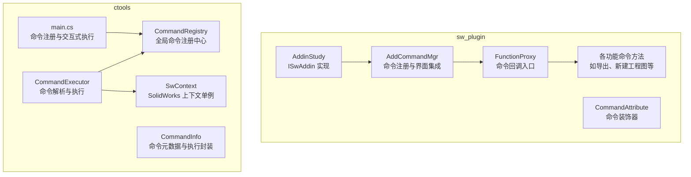
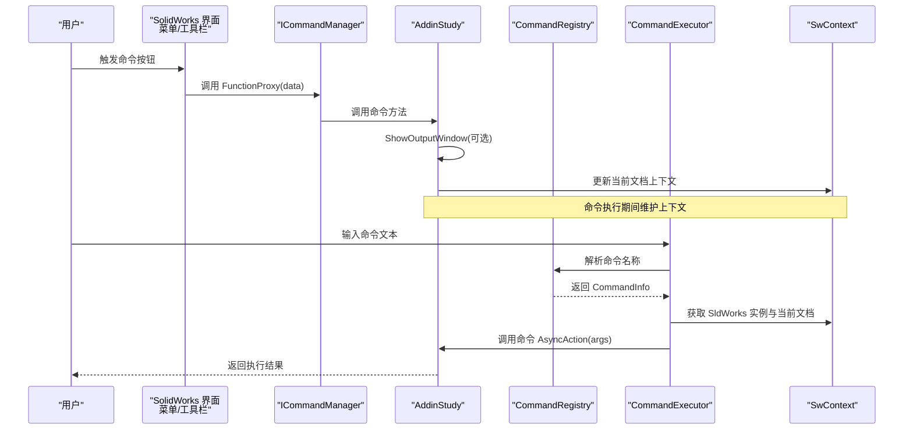
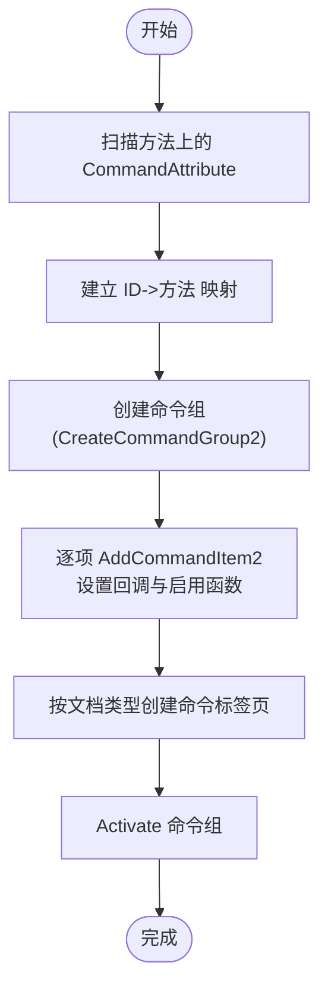
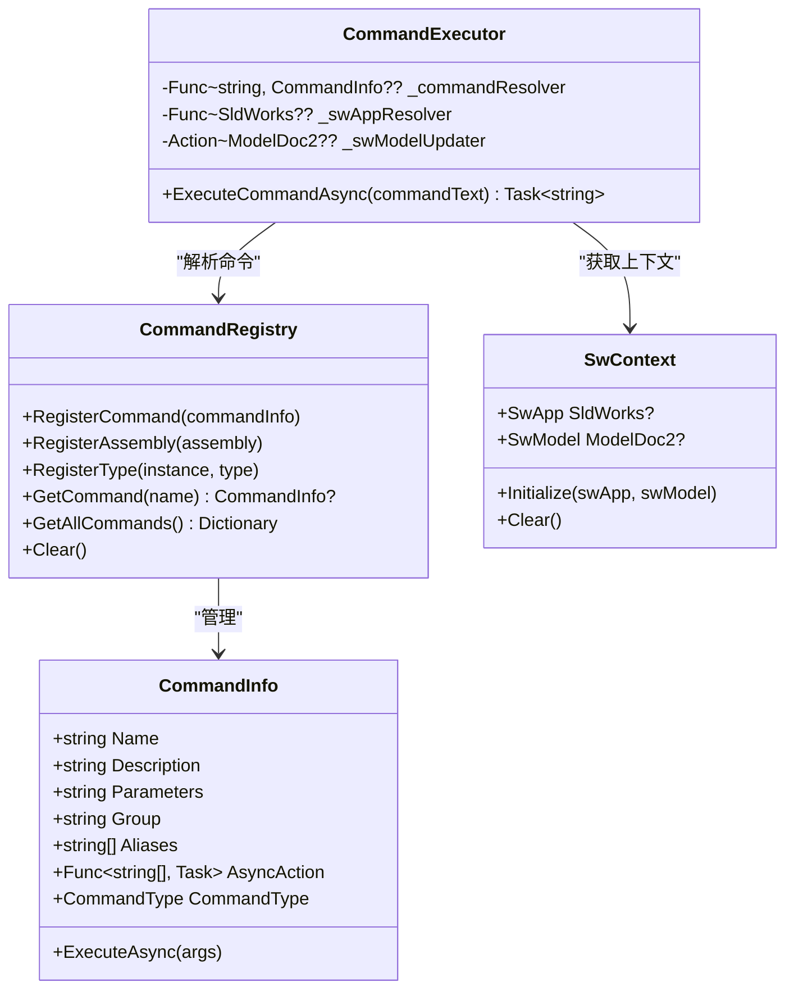
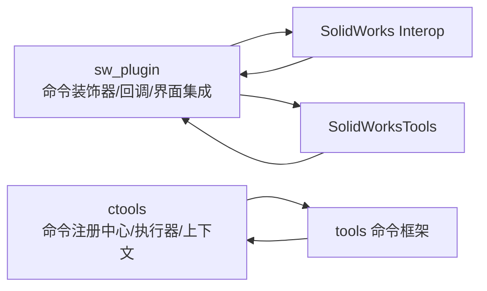

# 命令管理器集成

<cite>
**本文引用的文件**
- [sw_plugin/addin.cs](file://sw_plugin/addin.cs)
- [sw_plugin/function_adder.cs](file://sw_plugin/function_adder.cs)
- [sw_plugin/function.cs](file://sw_plugin/function.cs)
- [sw_plugin/CommandAttribute.cs](file://sw_plugin/CommandAttribute.cs)
- [ctools/SwContext.cs](file://ctools/SwContext.cs)
- [ctools/CommandRegistry.cs](file://ctools/CommandRegistry.cs)
- [ctools/command_executor.cs](file://ctools/command_executor.cs)
- [ctools/CommandAttribute.cs](file://ctools/CommandAttribute.cs)
- [ctools/CommandInfo.cs](file://ctools/CommandInfo.cs)
- [ctools/main.cs](file://ctools/main.cs)
</cite>

## 目录
1. [简介](#简介)
2. [项目结构](#项目结构)
3. [核心组件](#核心组件)
4. [架构总览](#架构总览)
5. [详细组件分析](#详细组件分析)
6. [依赖关系分析](#依赖关系分析)
7. [性能考虑](#性能考虑)
8. [故障排除指南](#故障排除指南)
9. [结论](#结论)

## 简介
本技术文档围绕 SolidWorks 插件中的“命令管理器集成”主题，系统阐述如何在 SolidWorks 中通过命令管理器（ICommandManager）进行命令的获取、初始化、注册与执行，并覆盖命令回调函数、命令 ID 分配与管理、命令执行上下文设置与维护、命令冲突检测与解决机制，以及命令与 SolidWorks 界面元素（菜单、工具栏、命令标签页）的集成方式。文档同时对比展示两种命令体系：基于装饰器的 SolidWorks 原生命令注册（sw_plugin）与基于全局命令注册中心的命令执行（ctools），帮助读者在不同场景下选择合适的集成方案。

## 项目结构
本仓库包含两个主要模块：
- sw_plugin：SolidWorks 插件原生命令体系，使用装饰器标记命令，通过 ICommandManager 动态注册到 SolidWorks 界面。
- ctools：通用命令框架，提供命令注册中心、命令执行器与上下文管理，支持与 SolidWorks 的交互式命令执行。

图表来源
- [sw_plugin/addin.cs:96-120](file://sw_plugin/addin.cs#L96-L120)
- [sw_plugin/function_adder.cs:75-204](file://sw_plugin/function_adder.cs#L75-L204)
- [sw_plugin/function.cs:29-663](file://sw_plugin/function.cs#L29-L663)
- [ctools/CommandRegistry.cs:12-241](file://ctools/CommandRegistry.cs#L12-L241)
- [ctools/command_executor.cs:12-115](file://ctools/command_executor.cs#L12-L115)
- [ctools/SwContext.cs:9-85](file://ctools/SwContext.cs#L9-L85)
- [ctools/main.cs:34-253](file://ctools/main.cs#L34-L253)

章节来源
- [sw_plugin/addin.cs:96-120](file://sw_plugin/addin.cs#L96-L120)
- [sw_plugin/function_adder.cs:75-204](file://sw_plugin/function_adder.cs#L75-L204)
- [ctools/CommandRegistry.cs:12-241](file://ctools/CommandRegistry.cs#L12-L241)
- [ctools/command_executor.cs:12-115](file://ctools/command_executor.cs#L12-L115)
- [ctools/SwContext.cs:9-85](file://ctools/SwContext.cs#L9-L85)
- [ctools/main.cs:34-253](file://ctools/main.cs#L34-L253)

## 核心组件
- 命令装饰器：用于声明式标记命令及其元数据（ID、名称、文档类型、是否显示输出窗口等）。在 sw_plugin 中使用自定义 CommandAttribute；在 ctools 中使用 tools.CommandAttribute。
- 命令注册中心：集中管理命令信息，支持按名称或别名查询、批量注册（反射扫描特性）、线程安全访问。
- 命令执行器：负责解析命令文本、校验命令存在性、获取 SolidWorks 实例与当前文档、执行命令并处理异常。
- SolidWorks 上下文：单例管理 SldWorks 应用实例与当前 ModelDoc2 文档，保证全局一致性。
- 命令回调与界面集成：通过 ICommandManager 创建命令组、命令标签页与工具箱，将命令映射到菜单项与工具栏按钮，并设置回调函数与启用状态判断。

章节来源
- [sw_plugin/CommandAttribute.cs:8-26](file://sw_plugin/CommandAttribute.cs#L8-L26)
- [ctools/CommandAttribute.cs:5-19](file://ctools/CommandAttribute.cs#L5-L19)
- [ctools/CommandRegistry.cs:12-241](file://ctools/CommandRegistry.cs#L12-L241)
- [ctools/command_executor.cs:12-115](file://ctools/command_executor.cs#L12-L115)
- [ctools/SwContext.cs:9-85](file://ctools/SwContext.cs#L9-L85)

## 架构总览
下图展示了两种命令体系的交互关系与数据流：

图表来源
- [sw_plugin/function_adder.cs:44-74](file://sw_plugin/function_adder.cs#L44-L74)
- [sw_plugin/addin.cs:96-120](file://sw_plugin/addin.cs#L96-L120)
- [ctools/CommandRegistry.cs:113-131](file://ctools/CommandRegistry.cs#L113-L131)
- [ctools/command_executor.cs:32-113](file://ctools/command_executor.cs#L32-L113)
- [ctools/SwContext.cs:71-84](file://ctools/SwContext.cs#L71-L84)

## 详细组件分析

### 命令管理器的获取与初始化
- 在插件连接 SolidWorks 时，通过 AddinStudy.ConnectToSW 获取 SldWorks 与 ICommandManager 实例，并设置回调信息。
- 初始化全局 SolidWorks 上下文，记录当前活动文档，便于后续命令执行时获取上下文。
- 初始化命令注册中心，扫描并注册命令（在 sw_plugin 中通过反射扫描装饰器命令；在 ctools 中通过 CommandRegistry.RegisterAssembly 批量注册）。

章节来源
- [sw_plugin/addin.cs:96-120](file://sw_plugin/addin.cs#L96-L120)
- [ctools/SwContext.cs:71-84](file://ctools/SwContext.cs#L71-L84)
- [ctools/CommandRegistry.cs:61-83](file://ctools/CommandRegistry.cs#L61-L83)

### 命令注册流程（从定义到实际注册）
- 装饰器定义：在 sw_plugin 中，命令通过 [Command(...)] 特性声明，包含命令 ID、名称、提示文本、本地化名称、适用文档类型等。
- 反射扫描与注册：AddinStudy.InitializeCommandRegistry 扫描当前类中标注 CommandAttribute 的方法，建立 ID 到方法的映射；AddinStudy.AddCommandMgr 创建命令组、命令标签页与工具箱，将命令项映射到菜单与工具栏，并设置回调函数与启用函数。
- 命令分组与可见性：根据文档类型（零件/装配体/工程图）筛选命令，动态创建命令标签页与工具箱按钮集合。

图表来源
- [sw_plugin/function_adder.cs:26-40](file://sw_plugin/function_adder.cs#L26-L40)
- [sw_plugin/function_adder.cs:75-204](file://sw_plugin/function_adder.cs#L75-L204)

章节来源
- [sw_plugin/function_adder.cs:26-40](file://sw_plugin/function_adder.cs#L26-L40)
- [sw_plugin/function_adder.cs:75-204](file://sw_plugin/function_adder.cs#L75-L204)
- [sw_plugin/function.cs:29-663](file://sw_plugin/function.cs#L29-L663)

### 命令回调函数实现（FunctionProxy 与 EnableFunction）
- FunctionProxy：接收来自界面的命令 ID，解析对应方法并执行；若命令特性标记 ShowOutputWindow，则先显示输出窗口再执行。
- EnableFunction：作为命令启用状态的判断入口，当前实现返回可用状态，可在扩展中加入更复杂的启用条件（如文档类型、权限等）。

章节来源
- [sw_plugin/function_adder.cs:44-74](file://sw_plugin/function_adder.cs#L44-L74)
- [sw_plugin/addin.cs:224-227](file://sw_plugin/addin.cs#L224-L227)

### 命令 ID 的分配与管理策略
- ID 分配：在 CommandAttribute 中显式指定命令 ID；建议按功能域划分区间，避免冲突。
- ID 管理：AddinStudy.InitializeCommandRegistry 维护 ID->方法 的字典；AddinStudy.AddCommandMgr 读取所有命令 ID 构建命令组与标签页。
- 冲突检测与解决：AddinStudy.CompareIDs 对比注册表中存储的 ID 集合与当前命令集合，若不一致则强制忽略旧配置，确保界面与代码一致。

章节来源
- [sw_plugin/CommandAttribute.cs:11-25](file://sw_plugin/CommandAttribute.cs#L11-L25)
- [sw_plugin/function_adder.cs:21-40](file://sw_plugin/function_adder.cs#L21-L40)
- [sw_plugin/function_adder.cs:237-258](file://sw_plugin/function_adder.cs#L237-L258)

### 命令执行上下文的设置与维护
- 上下文初始化：ConnectToSW 获取当前活动文档，SwContext.Instance.Initialize 记录 SldWorks 与 ModelDoc2。
- 执行前刷新：CommandExecutor.ExecuteCommandAsync 每次执行前重新获取 ActiveDoc/IActiveDoc2 并更新 SwContext。
- 输出窗口：部分命令在执行前显示输出窗口，便于观察日志与进度。

章节来源
- [sw_plugin/addin.cs:96-120](file://sw_plugin/addin.cs#L96-L120)
- [ctools/SwContext.cs:71-84](file://ctools/SwContext.cs#L71-L84)
- [ctools/command_executor.cs:68-94](file://ctools/command_executor.cs#L68-L94)

### 命令冲突检测与解决机制
- 注册表对比：AddinStudy.AddCommandMgr 通过 GetGroupDataFromRegistry 读取注册表中已存在的命令 ID，与当前命令 ID 集合比较。
- 强制重建：若发现不一致，设置 ignorePrevious 标志并强制删除旧标签页后重新创建，确保界面与代码一致。
- ID 排序比较：CompareIDs 对两组 ID 进行排序后逐一比较，保证顺序无关的等价性。

章节来源
- [sw_plugin/function_adder.cs:87-99](file://sw_plugin/function_adder.cs#L87-L99)
- [sw_plugin/function_adder.cs:237-258](file://sw_plugin/function_adder.cs#L237-L258)

### 命令与 SolidWorks 界面元素的集成
- 命令组与标签页：CreateCommandGroup2 创建命令组，AddCommandTab 为不同文档类型创建命令标签页。
- 工具箱与按钮：AddCommandTabBox 创建按钮集合，设置按钮文本显示样式与命令 ID。
- 回调与启用：AddCommandItem2 设置回调函数（FunctionProxy）与启用函数（EnableFunction），实现点击即执行与状态联动。

章节来源
- [sw_plugin/function_adder.cs:101-143](file://sw_plugin/function_adder.cs#L101-L143)
- [sw_plugin/function_adder.cs:172-198](file://sw_plugin/function_adder.cs#L172-L198)

### 命令执行器与全局命令注册中心（ctools）
- 命令注册中心：CommandRegistry 支持按名称/别名查询命令，批量注册（反射扫描特性），线程安全。
- 命令执行器：CommandExecutor 解析命令文本、校验命令存在性、获取 SolidWorks 实例与当前文档、执行命令并处理异常。
- 交互式执行：ctools/main.cs 中，通过 LlmLoopCaller 注入命令解析器与实例解析器，实现与用户的交互式命令执行。

图表来源
- [ctools/CommandRegistry.cs:12-241](file://ctools/CommandRegistry.cs#L12-L241)
- [ctools/CommandInfo.cs:17-40](file://ctools/CommandInfo.cs#L17-L40)
- [ctools/command_executor.cs:12-115](file://ctools/command_executor.cs#L12-L115)
- [ctools/SwContext.cs:9-85](file://ctools/SwContext.cs#L9-L85)

章节来源
- [ctools/CommandRegistry.cs:12-241](file://ctools/CommandRegistry.cs#L12-L241)
- [ctools/CommandInfo.cs:17-40](file://ctools/CommandInfo.cs#L17-L40)
- [ctools/command_executor.cs:12-115](file://ctools/command_executor.cs#L12-L115)
- [ctools/SwContext.cs:9-85](file://ctools/SwContext.cs#L9-L85)
- [ctools/main.cs:34-253](file://ctools/main.cs#L34-L253)

## 依赖关系分析
- sw_plugin 依赖 SolidWorks Interop 类型库与工具类（SolidWorksTools），通过 ICommandManager 与命令装饰器实现界面集成。
- ctools 依赖 tools 命令框架（CommandRegistry、CommandInfo、CommandExecutor、SwContext），提供跨应用的命令注册与执行能力。
- 两者通过统一的命令元数据（CommandInfo）与执行接口（AsyncAction）实现解耦，便于在不同宿主环境中复用。

图表来源
- [sw_plugin/addin.cs:1-15](file://sw_plugin/addin.cs#L1-L15)
- [ctools/CommandRegistry.cs:1-6](file://ctools/CommandRegistry.cs#L1-L6)
- [ctools/command_executor.cs:1-6](file://ctools/command_executor.cs#L1-L6)

章节来源
- [sw_plugin/addin.cs:1-15](file://sw_plugin/addin.cs#L1-L15)
- [ctools/CommandRegistry.cs:1-6](file://ctools/CommandRegistry.cs#L1-L6)
- [ctools/command_executor.cs:1-6](file://ctools/command_executor.cs#L1-L6)

## 性能考虑
- 命令执行性能：ctools/main.cs 中可通过 [Profiled] 属性对命令执行进行性能统计，辅助定位耗时命令。
- 异步执行：CommandInfo.CommandType 区分同步与异步命令，异步命令通过 Task 支持非阻塞执行，提升用户体验。
- 线程安全：CommandRegistry 使用锁保护命令字典的并发访问，避免多线程场景下的竞态条件。
- 上下文刷新：CommandExecutor 每次执行前刷新当前文档，避免陈旧上下文导致的错误。

章节来源
- [ctools/main.cs:28-32](file://ctools/main.cs#L28-L32)
- [ctools/CommandInfo.cs:8-12](file://ctools/CommandInfo.cs#L8-L12)
- [ctools/CommandRegistry.cs:34-55](file://ctools/CommandRegistry.cs#L34-L55)
- [ctools/command_executor.cs:68-94](file://ctools/command_executor.cs#L68-L94)

## 故障排除指南
- 命令未找到：CommandExecutor 会在命令解析失败时返回错误信息，提示使用 search 命令查看可用命令。
- SolidWorks 未连接：CommandExecutor 在获取 SldWorks 实例失败时提示“未连接到 SolidWorks”，需先启动 SolidWorks。
- 命令启用状态：EnableFunction 当前返回可用状态，若出现命令不可用，可在扩展中增加启用条件（如文档类型、权限等）。
- 界面不一致：若命令标签页与代码不一致，AddCommandMgr 会强制重建，确保界面与代码一致。

章节来源
- [ctools/command_executor.cs:53-66](file://ctools/command_executor.cs#L53-L66)
- [sw_plugin/addin.cs:224-227](file://sw_plugin/addin.cs#L224-L227)
- [sw_plugin/function_adder.cs:98-99](file://sw_plugin/function_adder.cs#L98-L99)

## 结论
本文档系统梳理了 SolidWorks 插件中的命令管理器集成方案，涵盖命令装饰器定义、命令注册与界面集成、命令回调与启用、命令 ID 管理与冲突解决、执行上下文维护，以及与 SolidWorks 界面元素的对接。同时，对比了 sw_plugin 的原生命令体系与 ctools 的通用命令框架，为不同场景下的命令管理提供了清晰的实施路径与最佳实践。