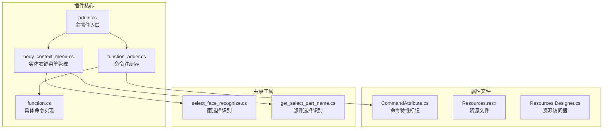
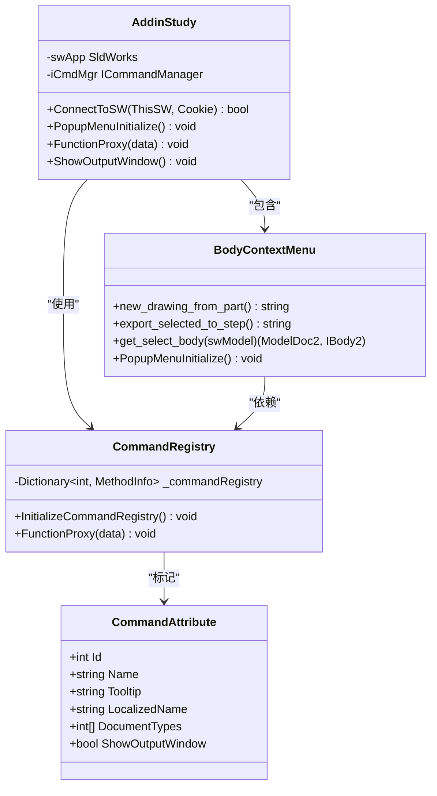
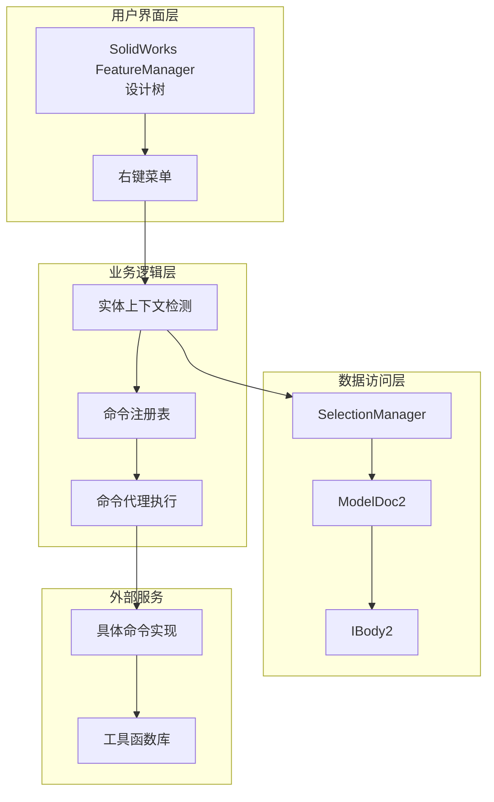
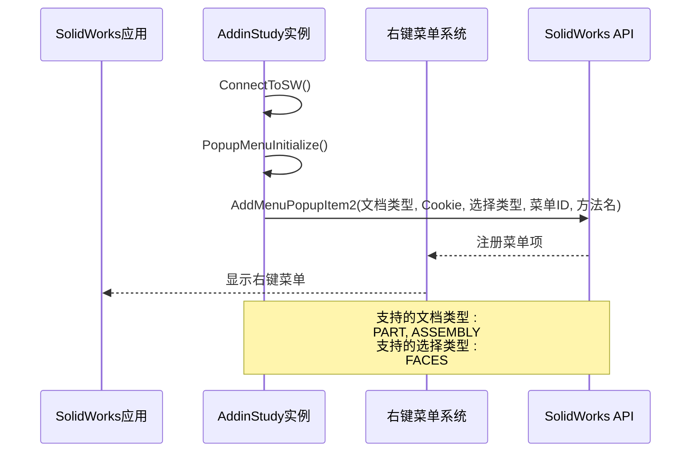
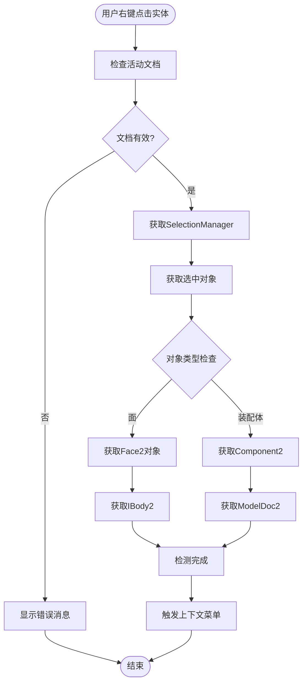
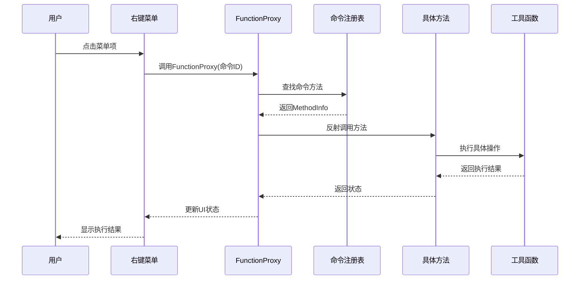
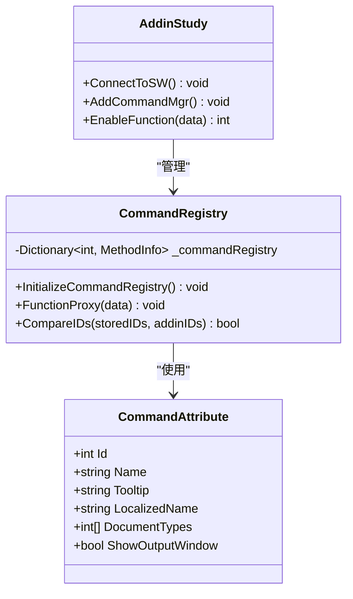
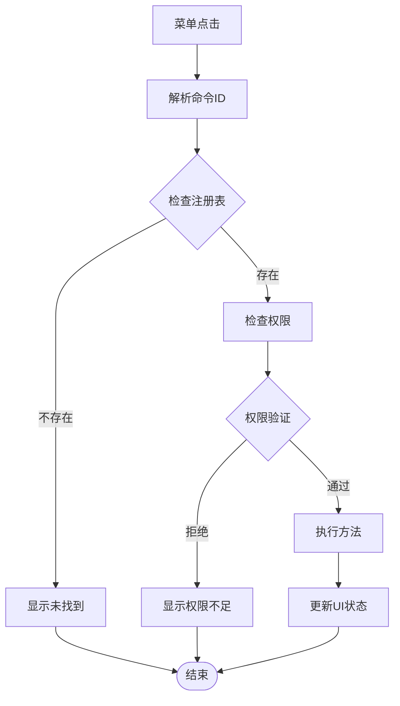
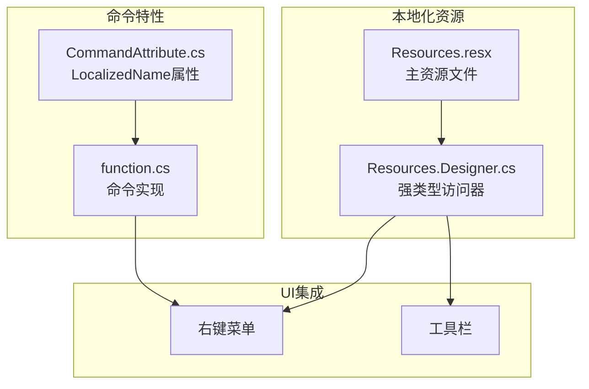
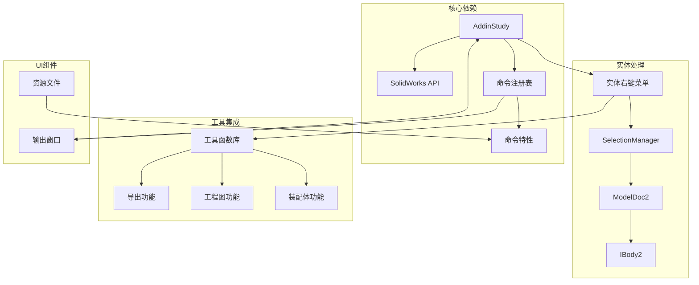

# 实体右键菜单实现

<cite>
**本文档引用的文件**
- [body_context_menu.cs](file://sw_plugin/body_context_menu.cs)
- [addin.cs](file://sw_plugin/addin.cs)
- [function_adder.cs](file://sw_plugin/function_adder.cs)
- [function.cs](file://sw_plugin/function.cs)
- [CommandAttribute.cs](file://sw_plugin/CommandAttribute.cs)
- [Resources.resx](file://sw_plugin/Properties/Resources.resx)
- [Resources.Designer.cs](file://sw_plugin/Properties/Resources.Designer.cs)
- [ConsoleOutputForm.cs](file://sw_plugin/ConsoleOutputForm.cs)
- [select_face_recognize.cs](file://share/drw/select_face_recognize.cs)
- [get_select_part_name.cs](file://share/asm/get_select_part_name.cs)
</cite>

## 目录
1. [简介](#简介)
2. [项目结构](#项目结构)
3. [核心组件](#核心组件)
4. [架构概览](#架构概览)
5. [详细组件分析](#详细组件分析)
6. [依赖关系分析](#依赖关系分析)
7. [性能考虑](#性能考虑)
8. [故障排除指南](#故障排除指南)
9. [结论](#结论)

## 简介

本文档详细分析了SolidWorks插件中的实体右键菜单实现，重点说明PopupMenuInitialize方法的实现原理、菜单项的动态生成机制、实体选择检测和上下文菜单触发逻辑、菜单项事件处理和命令执行流程，以及针对不同实体类型的菜单定制方法。

该实现基于SolidWorks API的AddMenuPopupItem2方法，在FeatureManager设计树中为特定实体类型添加右键菜单项。系统支持零件、装配体和工程图三种文档类型的差异化处理，并提供了完整的命令注册和执行机制。

## 项目结构

实体右键菜单功能主要分布在以下文件中：

**图表来源**
- [addin.cs:96-120](file://sw_plugin/addin.cs#L96-L120)
- [body_context_menu.cs:141-166](file://sw_plugin/body_context_menu.cs#L141-L166)
- [function_adder.cs:26-40](file://sw_plugin/function_adder.cs#L26-L40)

**章节来源**
- [addin.cs:1-339](file://sw_plugin/addin.cs#L1-L339)
- [body_context_menu.cs:1-174](file://sw_plugin/body_context_menu.cs#L1-L174)

## 核心组件

### 主要组件职责

1. **AddinStudy类** - 插件主入口，负责初始化和生命周期管理
2. **PopupMenuInitialize方法** - 实体右键菜单的核心初始化逻辑
3. **CommandAttribute特性** - 声明式命令注册机制
4. **FunctionProxy方法** - 命令执行代理，处理菜单点击事件
5. **实体选择检测** - 基于SolidWorks SelectionManager的实体识别

### 组件交互关系

**图表来源**
- [addin.cs:24-339](file://sw_plugin/addin.cs#L24-L339)
- [body_context_menu.cs:15-174](file://sw_plugin/body_context_menu.cs#L15-L174)
- [CommandAttribute.cs:8-27](file://sw_plugin/CommandAttribute.cs#L8-L27)

**章节来源**
- [body_context_menu.cs:141-166](file://sw_plugin/body_context_menu.cs#L141-L166)
- [function_adder.cs:26-74](file://sw_plugin/function_adder.cs#L26-L74)

## 架构概览

实体右键菜单系统采用分层架构设计，实现了清晰的关注点分离：

**图表来源**
- [body_context_menu.cs:119-133](file://sw_plugin/body_context_menu.cs#L119-L133)
- [function_adder.cs:44-74](file://sw_plugin/function_adder.cs#L44-L74)

## 详细组件分析

### PopupMenuInitialize方法实现原理

PopupMenuInitialize方法是实体右键菜单的核心初始化逻辑，负责在SolidWorks中注册特定实体类型的右键菜单项。

#### 方法执行流程

**图表来源**
- [addin.cs:96-120](file://sw_plugin/addin.cs#L96-L120)
- [body_context_menu.cs:141-166](file://sw_plugin/body_context_menu.cs#L141-L166)

#### 菜单项动态生成机制

系统通过AddMenuPopupItem2方法动态生成菜单项，支持以下配置：

| 参数 | 值 | 说明 |
|------|-----|------|
| 文档类型 | swDocPART, swDocASSEMBLY | 支持的SolidWorks文档类型 |
| 选择类型 | swSelFACES | 触发菜单的实体类型 |
| 菜单ID | "new_drw", "export_step" | 唯一标识符 |
| 方法名 | "new_drawing_from_part", "export_selected_to_step" | 实际执行的方法 |

**章节来源**
- [body_context_menu.cs:154-158](file://sw_plugin/body_context_menu.cs#L154-L158)

### 实体选择检测和上下文菜单触发逻辑

实体选择检测基于SolidWorks的SelectionManager接口，实现了精确的实体识别和上下文菜单触发。

#### 选择检测流程

**图表来源**
- [body_context_menu.cs:119-133](file://sw_plugin/body_context_menu.cs#L119-L133)

#### 不同实体类型的差异化处理

系统针对不同实体类型提供了专门的处理逻辑：

| 实体类型 | 处理方法 | 功能描述 |
|----------|----------|----------|
| 零件实体 | new_drawing_from_part | 从选中实体创建工程图 |
| 装配体实体 | export_selected_to_step | 导出选中实体为STEP格式 |
| 面实体 | get_select_body | 提取面所属的完整实体信息 |

**章节来源**
- [body_context_menu.cs:20-117](file://sw_plugin/body_context_menu.cs#L20-L117)

### 菜单项事件处理和命令执行流程

命令执行采用委托模式，通过FunctionProxy方法统一处理所有菜单点击事件。

#### 命令执行序列

**图表来源**
- [function_adder.cs:44-74](file://sw_plugin/function_adder.cs#L44-L74)
- [function_adder.cs:122-139](file://sw_plugin/function_adder.cs#L122-L139)

#### 命令注册和发现机制

系统使用反射机制自动发现和注册带Command特性的方法：

**图表来源**
- [CommandAttribute.cs:8-27](file://sw_plugin/CommandAttribute.cs#L8-L27)
- [function_adder.cs:26-40](file://sw_plugin/function_adder.cs#L26-L40)

**章节来源**
- [function_adder.cs:26-74](file://sw_plugin/function_adder.cs#L26-L74)
- [function.cs:29-165](file://sw_plugin/function.cs#L29-L165)

### 菜单项可见性控制和权限验证机制

系统提供了灵活的可见性和权限控制机制，通过CommandAttribute特性实现。

#### 可见性控制实现

| 控制属性 | 作用域 | 实现方式 |
|----------|--------|----------|
| DocumentTypes | 文档类型过滤 | 基于swDocumentTypes_e枚举 |
| ShowOutputWindow | 输出窗口控制 | 基于布尔标志 |
| EnableFunction | 动态启用禁用 | 返回1表示可用 |

#### 权限验证流程

**图表来源**
- [function_adder.cs:44-74](file://sw_plugin/function_adder.cs#L44-L74)
- [function_adder.cs:224-227](file://sw_plugin/function_adder.cs#L224-L227)

**章节来源**
- [CommandAttribute.cs:18-25](file://sw_plugin/CommandAttribute.cs#L18-L25)
- [function_adder.cs:224-227](file://sw_plugin/function_adder.cs#L224-L227)

### 菜单国际化和本地化实现

系统支持多语言环境，通过Resources资源文件实现菜单文本的本地化。

#### 国际化架构

**图表来源**
- [Resources.resx:1-101](file://sw_plugin/Properties/Resources.resx#L1-L101)
- [Resources.Designer.cs:25-62](file://sw_plugin/Properties/Resources.Designer.cs#L25-L62)
- [CommandAttribute.cs:14](file://sw_plugin/CommandAttribute.cs#L14)

#### 本地化配置要点

- **资源文件格式**：使用XML格式的.resx文件存储多语言文本
- **强类型访问**：通过自动生成的Designer类提供类型安全的资源访问
- **特性支持**：CommandAttribute的LocalizedName属性支持动态本地化
- **运行时切换**：通过Culture属性支持运行时语言切换

**章节来源**
- [Resources.resx:1-101](file://sw_plugin/Properties/Resources.resx#L1-L101)
- [Resources.Designer.cs:25-62](file://sw_plugin/Properties/Resources.Designer.cs#L25-L62)

## 依赖关系分析

系统采用模块化设计，各组件间依赖关系清晰：

**图表来源**
- [addin.cs:27-31](file://sw_plugin/addin.cs#L27-L31)
- [body_context_menu.cs:119-133](file://sw_plugin/body_context_menu.cs#L119-L133)
- [function_adder.cs:21-40](file://sw_plugin/function_adder.cs#L21-L40)

**章节来源**
- [addin.cs:27-31](file://sw_plugin/addin.cs#L27-L31)
- [function_adder.cs:21-40](file://sw_plugin/function_adder.cs#L21-L40)

## 性能考虑

### 性能优化策略

1. **延迟初始化**：仅在插件连接时初始化菜单系统
2. **缓存机制**：CommandRegistry缓存已发现的方法信息
3. **反射优化**：使用MethodInfo缓存避免重复反射开销
4. **异步执行**：长耗时操作在后台线程执行
5. **内存管理**：及时释放SolidWorks对象引用

### 响应性改进

- **输出窗口管理**：通过ShowOutputWindow控制UI阻塞
- **异常处理**：完善的try-catch机制防止UI冻结
- **进度反馈**：长时间操作显示进度信息
- **取消支持**：提供操作取消机制

## 故障排除指南

### 常见问题及解决方案

| 问题类型 | 症状 | 解决方案 |
|----------|------|----------|
| 菜单不显示 | 右键无菜单项 | 检查PopupMenuInitialize调用 |
| 命令执行失败 | 报告执行失败 | 验证CommandAttribute配置 |
| 实体选择错误 | 无法获取实体 | 检查SelectionManager使用 |
| 权限不足 | 显示权限错误 | 验证EnableFunction返回值 |

### 调试技巧

1. **日志记录**：使用Debug.WriteLine跟踪执行流程
2. **异常捕获**：在关键位置添加异常处理
3. **状态检查**：验证SolidWorks对象有效性
4. **资源清理**：确保正确释放COM对象

**章节来源**
- [body_context_menu.cs:162-165](file://sw_plugin/body_context_menu.cs#L162-L165)
- [function_adder.cs:65-73](file://sw_plugin/function_adder.cs#L65-L73)

## 结论

实体右键菜单实现展现了良好的软件架构设计，通过分层结构、模块化组件和声明式配置实现了高度可扩展的功能。系统的关键优势包括：

1. **清晰的架构分离**：UI层、业务逻辑层和数据访问层职责明确
2. **灵活的扩展机制**：基于CommandAttribute的声明式注册
3. **完善的错误处理**：全面的异常捕获和用户反馈
4. **国际化支持**：完整的多语言本地化实现
5. **性能优化**：合理的缓存和异步处理策略

该实现为SolidWorks插件开发提供了优秀的参考模板，特别是在实体右键菜单和命令系统方面具有很高的实用价值。