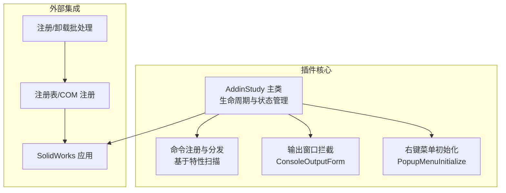
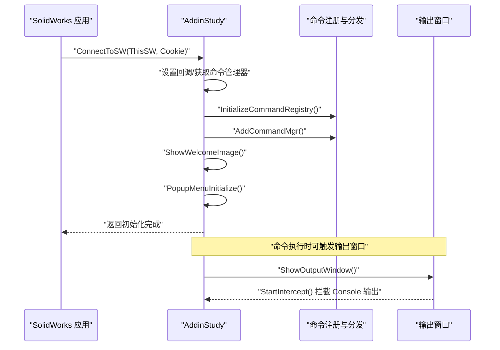
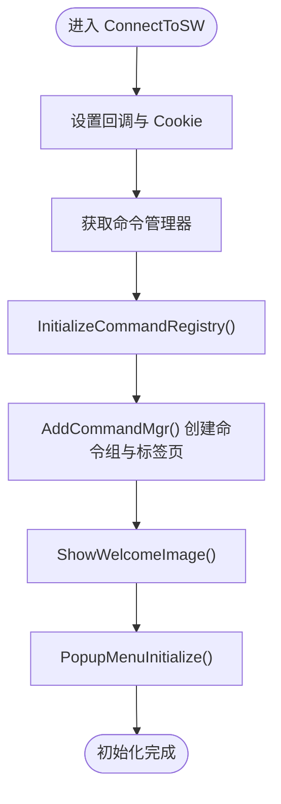
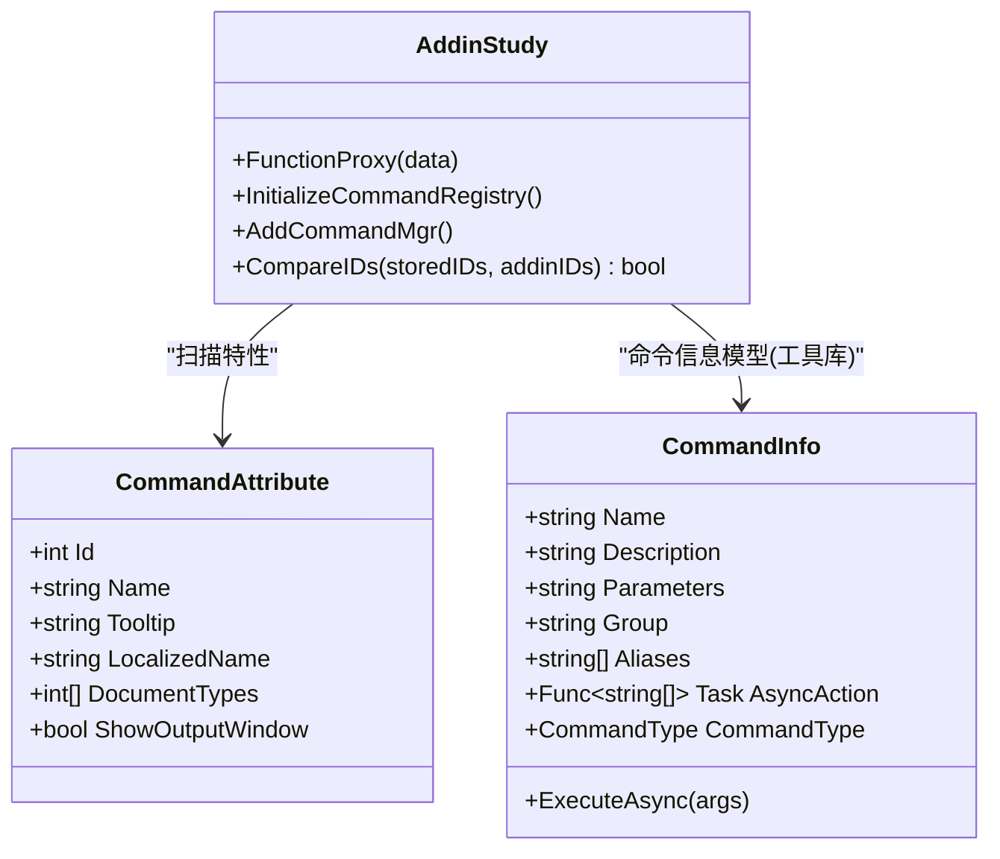
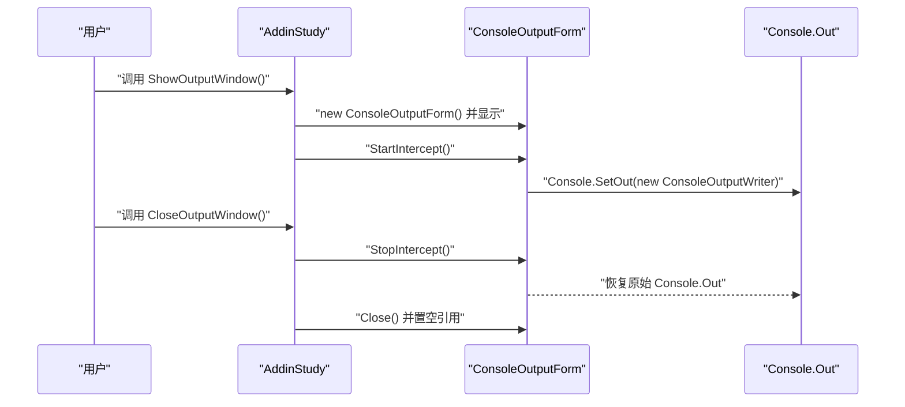
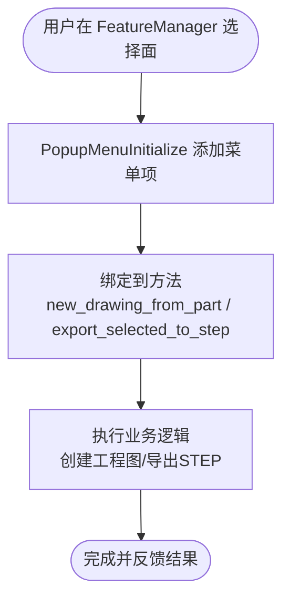
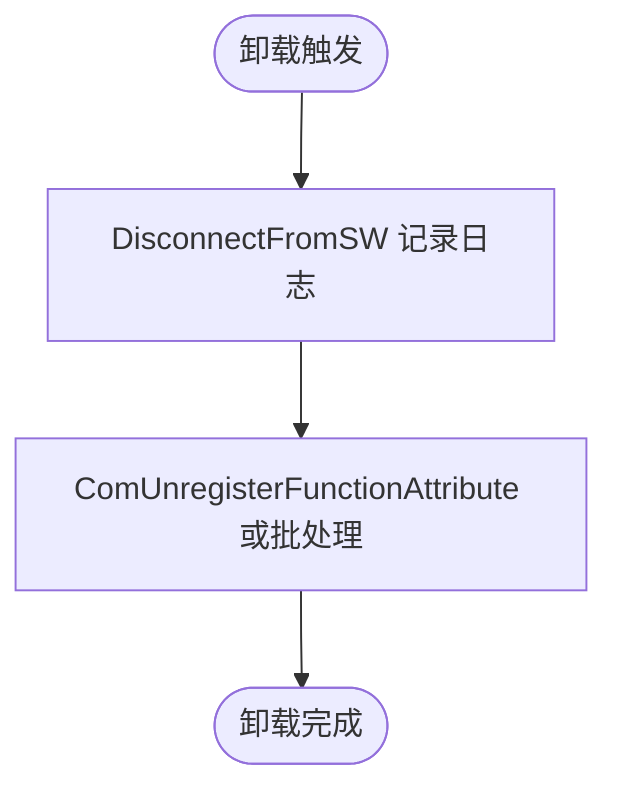
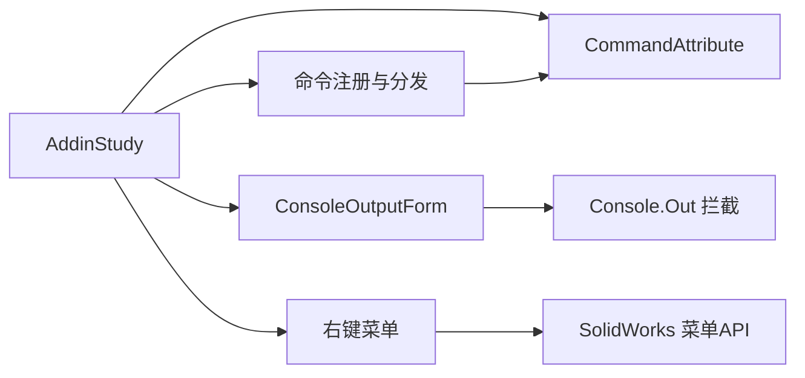

# 插件生命周期管理

<cite>
**本文引用的文件**
- [sw_plugin/addin.cs](file://sw_plugin/addin.cs)
- [sw_plugin/function_adder.cs](file://sw_plugin/function_adder.cs)
- [sw_plugin/function.cs](file://sw_plugin/function.cs)
- [sw_plugin/body_context_menu.cs](file://sw_plugin/body_context_menu.cs)
- [sw_plugin/ConsoleOutputForm.cs](file://sw_plugin/ConsoleOutputForm.cs)
- [sw_plugin/register_addin.bat](file://sw_plugin/register_addin.bat)
- [sw_plugin/unregister_addin.bat](file://sw_plugin/unregister_addin.bat)
- [sw_plugin/CommandAttribute.cs](file://sw_plugin/CommandAttribute.cs)
- [ctools/CommandInfo.cs](file://ctools/CommandInfo.cs)
</cite>

## 目录
1. [简介](#简介)
2. [项目结构](#项目结构)
3. [核心组件](#核心组件)
4. [架构总览](#架构总览)
5. [详细组件分析](#详细组件分析)
6. [依赖关系分析](#依赖关系分析)
7. [性能考虑](#性能考虑)
8. [故障排除指南](#故障排除指南)
9. [结论](#结论)
10. [附录](#附录)

## 简介
本文件系统性地梳理 SolidWorks 插件的生命周期管理，覆盖初始化、运行时状态管理、资源清理、卸载流程、控制台输出窗口管理、状态监控与错误处理策略，以及插件重启与重载的实现方法。重点围绕 sw_plugin 项目中的 AddinStudy 类及其配套组件展开，结合命令注册、菜单弹出、输出窗口拦截等机制，形成完整的生命周期闭环。

## 项目结构
sw_plugin 项目采用“主插件类 + 命令注册与分发 + 输出窗口 + 菜单与上下文”模块化组织方式：
- 主插件类负责生命周期钩子、命令注册、菜单初始化、输出窗口管理
- 命令注册与分发模块负责基于特性扫描的命令注册、代理执行与按文档类型分组
- 输出窗口模块负责拦截控制台输出、展示实时日志、可选输入
- 菜单与上下文模块负责为不同文档类型添加右键菜单项
- 批处理脚本负责 COM 注册与卸载

图表来源
- [sw_plugin/addin.cs:96-120](file://sw_plugin/addin.cs#L96-L120)
- [sw_plugin/function_adder.cs:26-74](file://sw_plugin/function_adder.cs#L26-L74)
- [sw_plugin/ConsoleOutputForm.cs:134-146](file://sw_plugin/ConsoleOutputForm.cs#L134-L146)
- [sw_plugin/body_context_menu.cs:141-166](file://sw_plugin/body_context_menu.cs#L141-L166)
- [sw_plugin/register_addin.bat:1-10](file://sw_plugin/register_addin.bat#L1-L10)
- [sw_plugin/unregister_addin.bat:1-11](file://sw_plugin/unregister_addin.bat#L1-L11)

章节来源
- [sw_plugin/addin.cs:16-339](file://sw_plugin/addin.cs#L16-L339)
- [sw_plugin/function_adder.cs:1-206](file://sw_plugin/function_adder.cs#L1-L206)
- [sw_plugin/function.cs:1-663](file://sw_plugin/function.cs#L1-L663)
- [sw_plugin/body_context_menu.cs:1-174](file://sw_plugin/body_context_menu.cs#L1-L174)
- [sw_plugin/ConsoleOutputForm.cs:1-172](file://sw_plugin/ConsoleOutputForm.cs#L1-L172)
- [sw_plugin/register_addin.bat:1-10](file://sw_plugin/register_addin.bat#L1-L10)
- [sw_plugin/unregister_addin.bat:1-11](file://sw_plugin/unregister_addin.bat#L1-L11)

## 核心组件
- 主插件类 AddinStudy：实现 ISwAddin 生命周期回调、命令注册、菜单初始化、欢迎图展示、COM 注册/反注册
- 命令注册与分发：基于 CommandAttribute 的特性扫描、命令代理 FunctionProxy、按文档类型分组的命令标签页
- 输出窗口 ConsoleOutputForm：拦截 Console 输出、滚动显示、可选输入对话
- 右键菜单：为特征管理器实体添加菜单项，触发相应业务逻辑
- 注册与卸载：COM 注册函数与批处理脚本

章节来源
- [sw_plugin/addin.cs:24-120](file://sw_plugin/addin.cs#L24-L120)
- [sw_plugin/function_adder.cs:26-204](file://sw_plugin/function_adder.cs#L26-L204)
- [sw_plugin/function.cs:29-663](file://sw_plugin/function.cs#L29-L663)
- [sw_plugin/body_context_menu.cs:141-166](file://sw_plugin/body_context_menu.cs#L141-L166)
- [sw_plugin/ConsoleOutputForm.cs:10-172](file://sw_plugin/ConsoleOutputForm.cs#L10-L172)
- [sw_plugin/CommandAttribute.cs:1-27](file://sw_plugin/CommandAttribute.cs#L1-L27)

## 架构总览
插件生命周期由以下阶段构成：
- 初始化阶段：ConnectToSW 设置回调、获取命令管理器、初始化命令注册表、创建命令组与标签页、显示欢迎图、初始化右键菜单
- 运行阶段：命令代理 FunctionProxy 根据 ID 分发到具体命令；命令可选择自动打开输出窗口
- 卸载阶段：DisconnectFromSW 清理（当前为空），COM 注销通过注册表或批处理完成
- 输出管理：ConsoleOutputForm 拦截 Console 输出，支持置顶、最小化恢复、关闭停止拦截

图表来源
- [sw_plugin/addin.cs:96-120](file://sw_plugin/addin.cs#L96-L120)
- [sw_plugin/function_adder.cs:26-204](file://sw_plugin/function_adder.cs#L26-L204)
- [sw_plugin/ConsoleOutputForm.cs:134-146](file://sw_plugin/ConsoleOutputForm.cs#L134-L146)

章节来源
- [sw_plugin/addin.cs:96-120](file://sw_plugin/addin.cs#L96-L120)
- [sw_plugin/function_adder.cs:75-204](file://sw_plugin/function_adder.cs#L75-L204)
- [sw_plugin/ConsoleOutputForm.cs:134-146](file://sw_plugin/ConsoleOutputForm.cs#L134-L146)

## 详细组件分析

### 初始化流程与 ConnectToSW 实现
- 参数处理：接收 SolidWorks 实例 ThisSW 与 Cookie，并设置回调信息，获取命令管理器
- 全局上下文：读取当前活动文档，便于后续命令判断
- 命令注册：扫描带 CommandAttribute 的方法，建立命令 ID 到方法的映射
- 命令组与标签页：创建命令组、添加命令项、按文档类型分组并创建标签页
- 欢迎图：读取插件目录下的图片，显示版本信息与倒计时关闭
- 右键菜单：为不同文档类型与选择类型添加菜单项

图表来源
- [sw_plugin/addin.cs:96-120](file://sw_plugin/addin.cs#L96-L120)
- [sw_plugin/function_adder.cs:26-204](file://sw_plugin/function_adder.cs#L26-L204)
- [sw_plugin/body_context_menu.cs:141-166](file://sw_plugin/body_context_menu.cs#L141-L166)

章节来源
- [sw_plugin/addin.cs:96-120](file://sw_plugin/addin.cs#L96-L120)
- [sw_plugin/function_adder.cs:26-204](file://sw_plugin/function_adder.cs#L26-L204)
- [sw_plugin/body_context_menu.cs:141-166](file://sw_plugin/body_context_menu.cs#L141-L166)

### 命令注册与分发机制
- 命令注册：扫描当前实例的所有非公开实例方法，提取 CommandAttribute，建立字典映射
- 命令代理：FunctionProxy 根据传入的命令 ID 查找方法并执行；若属性要求显示输出窗口则先打开输出窗口
- 命令组与标签页：创建命令组，遍历注册表中的命令，添加到命令组与对应文档类型的标签页
- 文档类型过滤：根据 CommandAttribute 中的文档类型集合决定命令在哪些文档类型下可见

图表来源
- [sw_plugin/function_adder.cs:26-74](file://sw_plugin/function_adder.cs#L26-L74)
- [sw_plugin/CommandAttribute.cs:1-27](file://sw_plugin/CommandAttribute.cs#L1-L27)
- [ctools/CommandInfo.cs:1-41](file://ctools/CommandInfo.cs#L1-L41)

章节来源
- [sw_plugin/function_adder.cs:26-204](file://sw_plugin/function_adder.cs#L26-L204)
- [sw_plugin/CommandAttribute.cs:1-27](file://sw_plugin/CommandAttribute.cs#L1-L27)
- [ctools/CommandInfo.cs:1-41](file://ctools/CommandInfo.cs#L1-L41)

### 控制台输出窗口管理
- ShowOutputWindow：若输出窗未创建或已被释放则新建并置顶显示，否则恢复到正常状态并置顶
- CloseOutputWindow：停止拦截、关闭窗口并置空引用
- ConsoleOutputForm：拦截 Console.Out，将文本追加到只读多行框并自动滚动；支持底部输入面板与回车提交、ESC 取消
- 位置与外观：窗口位于屏幕右上角，字体等宽便于日志阅读

图表来源
- [sw_plugin/addin.cs:37-68](file://sw_plugin/addin.cs#L37-L68)
- [sw_plugin/ConsoleOutputForm.cs:134-146](file://sw_plugin/ConsoleOutputForm.cs#L134-L146)
- [sw_plugin/ConsoleOutputForm.cs:18-87](file://sw_plugin/ConsoleOutputForm.cs#L18-L87)

章节来源
- [sw_plugin/addin.cs:37-68](file://sw_plugin/addin.cs#L37-L68)
- [sw_plugin/ConsoleOutputForm.cs:10-172](file://sw_plugin/ConsoleOutputForm.cs#L10-L172)

### 右键菜单与实体操作
- PopupMenuInitialize：为零件、装配体、工程图文档类型，针对面选择类型添加菜单项，分别绑定到 new_drawing_from_part 与 export_selected_to_step
- 实体选择辅助：get_select_body 从选择管理器获取所选面与所属实体，必要时切换到组件对应的模型文档
- 业务逻辑：创建工程图、导出 STEP 文件等

图表来源
- [sw_plugin/body_context_menu.cs:141-166](file://sw_plugin/body_context_menu.cs#L141-L166)
- [sw_plugin/body_context_menu.cs:119-133](file://sw_plugin/body_context_menu.cs#L119-L133)

章节来源
- [sw_plugin/body_context_menu.cs:14-174](file://sw_plugin/body_context_menu.cs#L14-L174)

### 卸载流程与 DisconnectFromSW 实现
- DisconnectFromSW：当前实现仅记录日志，未做实际资源回收
- COM 注销：通过 ComUnregisterFunctionAttribute 或注册表脚本完成
- 注册/卸载批处理：使用 regasm 对 DLL 进行注册与卸载

图表来源
- [sw_plugin/addin.cs:211-218](file://sw_plugin/addin.cs#L211-L218)
- [sw_plugin/addin.cs:309-333](file://sw_plugin/addin.cs#L309-L333)
- [sw_plugin/unregister_addin.bat:1-11](file://sw_plugin/unregister_addin.bat#L1-L11)

章节来源
- [sw_plugin/addin.cs:211-218](file://sw_plugin/addin.cs#L211-L218)
- [sw_plugin/addin.cs:309-333](file://sw_plugin/addin.cs#L309-L333)
- [sw_plugin/unregister_addin.bat:1-11](file://sw_plugin/unregister_addin.bat#L1-L11)

### 状态监控与错误处理策略
- 状态监控：初始化阶段通过 Debug.WriteLine 输出关键节点日志；命令执行前检查 swApp 与活动文档状态
- 错误处理：命令方法内部使用 try-catch 捕获异常并通过 SendMsgToUser 向用户反馈；未找到命令 ID 时提示用户
- 资源清理：输出窗口关闭时停止拦截并释放引用；右键菜单初始化失败时记录异常但不中断整体流程

章节来源
- [sw_plugin/function_adder.cs:44-74](file://sw_plugin/function_adder.cs#L44-L74)
- [sw_plugin/function.cs:32-63](file://sw_plugin/function.cs#L32-L63)
- [sw_plugin/body_context_menu.cs:143-166](file://sw_plugin/body_context_menu.cs#L143-L166)

### 插件重启与重载
- 重载：通过批处理脚本重新注册 DLL，实现快速重载
- 重启：卸载后重新注册，或在 SolidWorks 中禁用再启用插件
- 建议：在开发阶段优先使用批处理脚本进行注册/卸载，避免手动修改注册表带来的风险

章节来源
- [sw_plugin/register_addin.bat:1-10](file://sw_plugin/register_addin.bat#L1-L10)
- [sw_plugin/unregister_addin.bat:1-11](file://sw_plugin/unregister_addin.bat#L1-L11)

## 依赖关系分析
- AddinStudy 依赖命令注册模块与输出窗口模块，通过特性驱动命令发现与执行
- 命令模块依赖 CommandAttribute 定义命令元数据
- 输出窗口模块依赖 Console 拦截机制
- 右键菜单模块依赖 SolidWorks API 的菜单添加接口
- 注册与卸载依赖 COM 注册与批处理脚本

图表来源
- [sw_plugin/addin.cs:24-120](file://sw_plugin/addin.cs#L24-L120)
- [sw_plugin/function_adder.cs:26-204](file://sw_plugin/function_adder.cs#L26-L204)
- [sw_plugin/ConsoleOutputForm.cs:134-146](file://sw_plugin/ConsoleOutputForm.cs#L134-L146)
- [sw_plugin/body_context_menu.cs:141-166](file://sw_plugin/body_context_menu.cs#L141-L166)
- [sw_plugin/CommandAttribute.cs:1-27](file://sw_plugin/CommandAttribute.cs#L1-L27)

章节来源
- [sw_plugin/addin.cs:24-120](file://sw_plugin/addin.cs#L24-L120)
- [sw_plugin/function_adder.cs:26-204](file://sw_plugin/function_adder.cs#L26-L204)
- [sw_plugin/ConsoleOutputForm.cs:134-146](file://sw_plugin/ConsoleOutputForm.cs#L134-L146)
- [sw_plugin/body_context_menu.cs:141-166](file://sw_plugin/body_context_menu.cs#L141-L166)
- [sw_plugin/CommandAttribute.cs:1-27](file://sw_plugin/CommandAttribute.cs#L1-L27)

## 性能考虑
- 命令注册扫描：仅在初始化阶段进行一次反射扫描，避免重复开销
- 命令分发：字典查找 O(1)，无额外序列化成本
- 输出窗口：文本追加与滚动在 UI 线程执行，建议避免在高频命令中大量写入
- 菜单初始化：按文档类型分组，减少标签页数量，提升界面响应

## 故障排除指南
- 插件未加载：检查 ConnectToSW 是否被调用、命令管理器是否获取成功、注册表项是否存在
- 命令不可见：确认 CommandAttribute 的文档类型集合与当前文档匹配，标签页是否创建成功
- 输出窗口无内容：确认 ConsoleOutputForm 已启动拦截，且命令执行路径调用了 ShowOutputWindow
- 卸载失败：使用批处理脚本或 ComUnregisterFunctionAttribute，确保以管理员权限运行

章节来源
- [sw_plugin/addin.cs:96-120](file://sw_plugin/addin.cs#L96-L120)
- [sw_plugin/function_adder.cs:75-204](file://sw_plugin/function_adder.cs#L75-L204)
- [sw_plugin/ConsoleOutputForm.cs:134-146](file://sw_plugin/ConsoleOutputForm.cs#L134-L146)
- [sw_plugin/unregister_addin.bat:1-11](file://sw_plugin/unregister_addin.bat#L1-L11)

## 结论
本插件通过特性驱动的命令注册、统一的命令代理分发、可控的输出窗口拦截与完善的菜单初始化，形成了清晰的生命周期管理框架。初始化阶段完成环境准备与命令体系搭建，运行阶段提供稳定的命令执行与可视化反馈，卸载阶段配合 COM 注册机制实现安全移除。建议在生产环境中补充 DisconnectFromSW 的资源清理逻辑，并在高频命令中优化输出窗口写入频率，以获得更佳的用户体验。

## 附录
- 注册/卸载批处理脚本路径：[register_addin.bat:1-10](file://sw_plugin/register_addin.bat#L1-L10)、[unregister_addin.bat:1-11](file://sw_plugin/unregister_addin.bat#L1-L11)
- 命令特性定义：[CommandAttribute.cs:1-27](file://sw_plugin/CommandAttribute.cs#L1-L27)
- 命令信息模型（工具库）：[CommandInfo.cs:1-41](file://ctools/CommandInfo.cs#L1-L41)