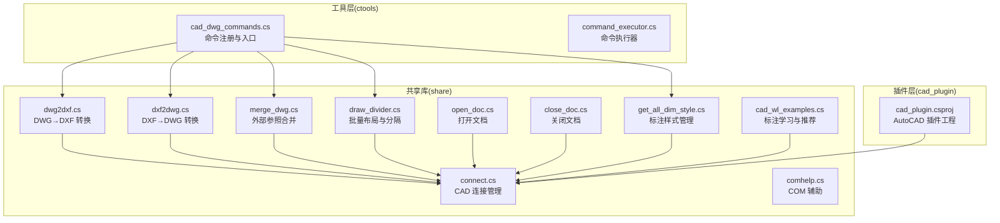
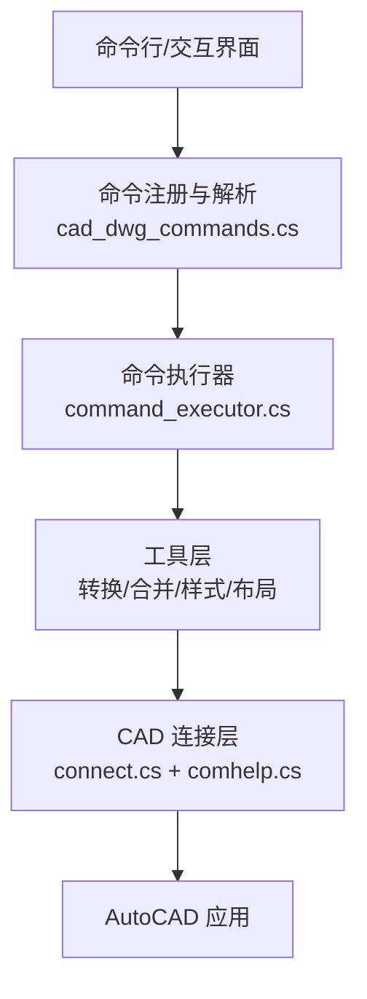
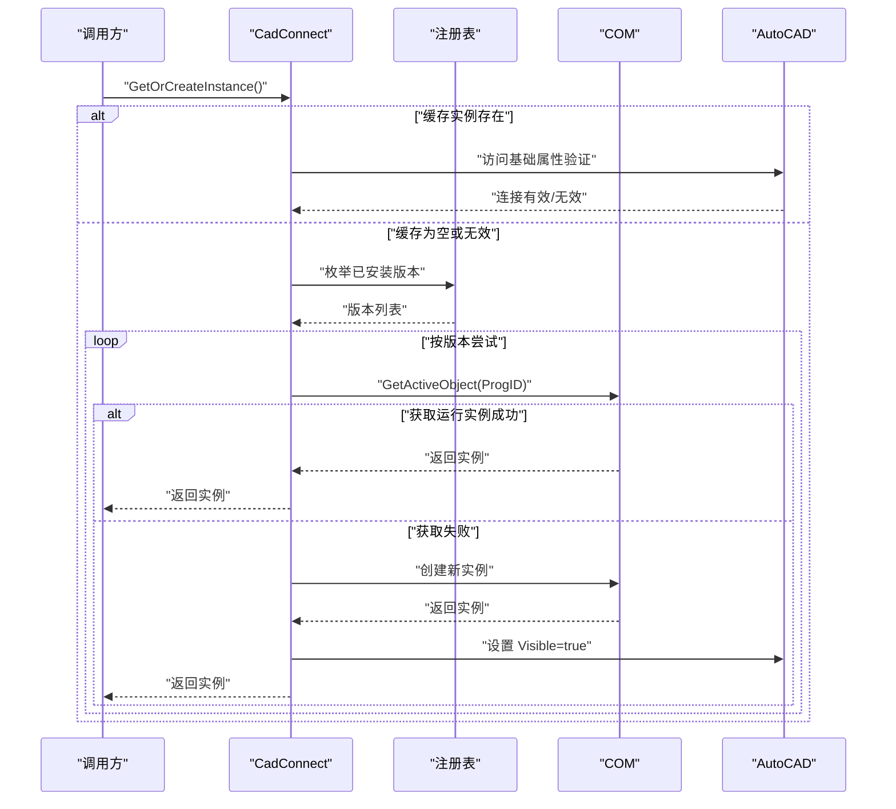
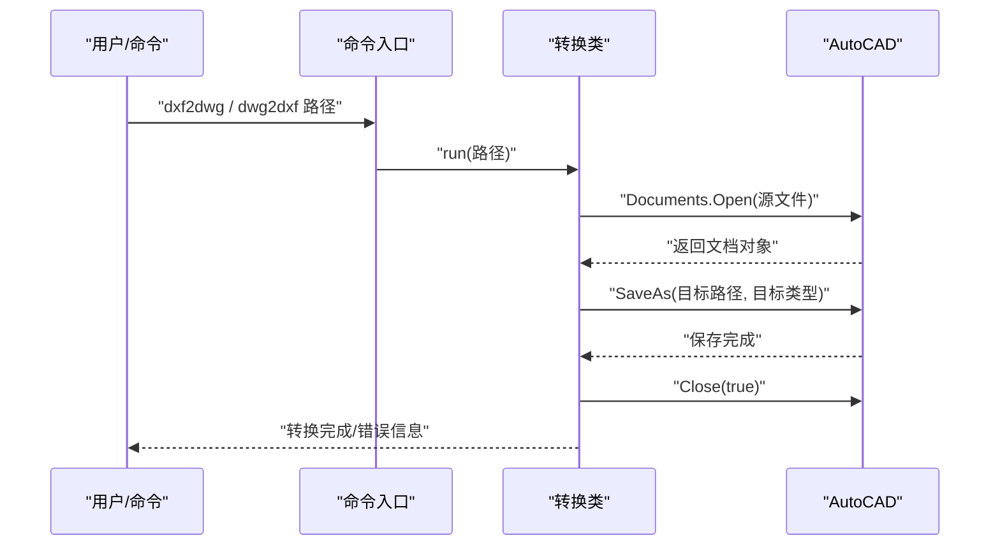
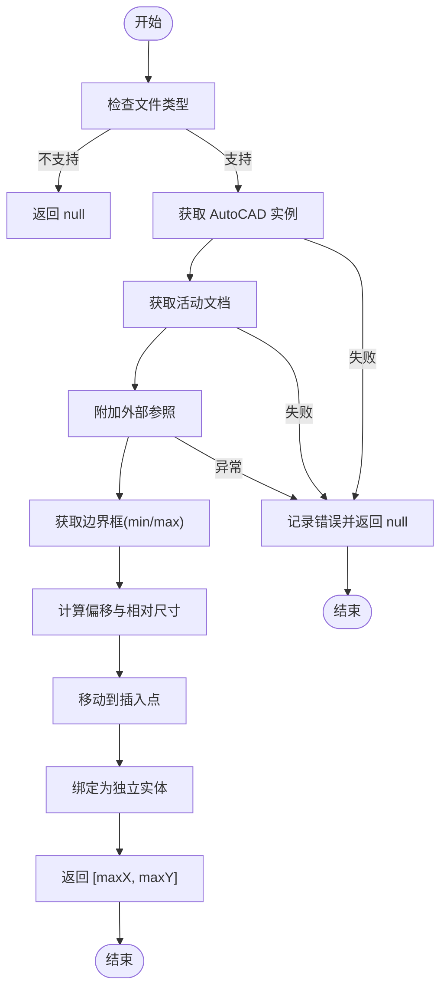
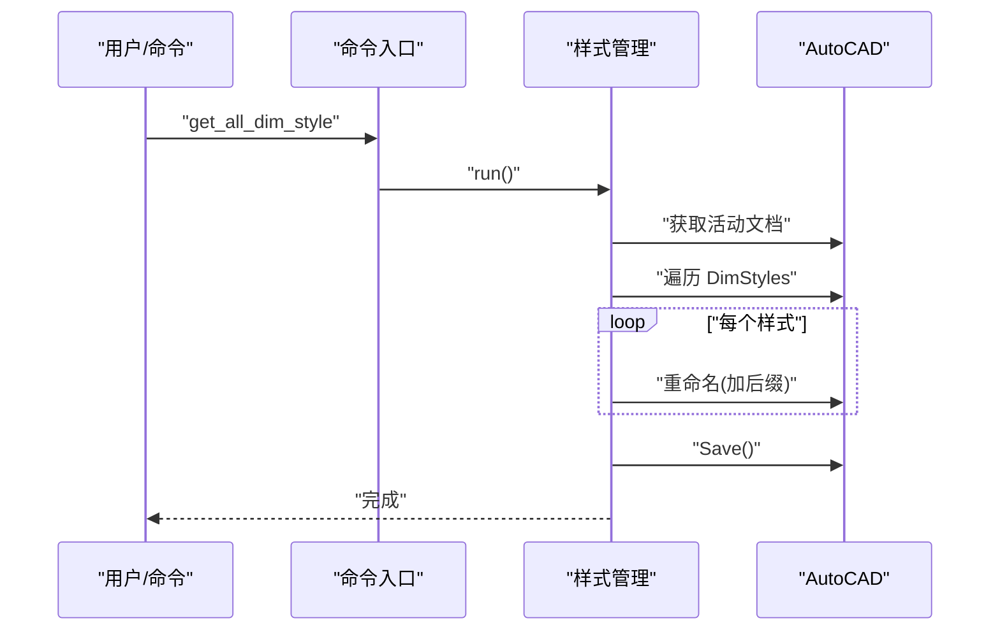
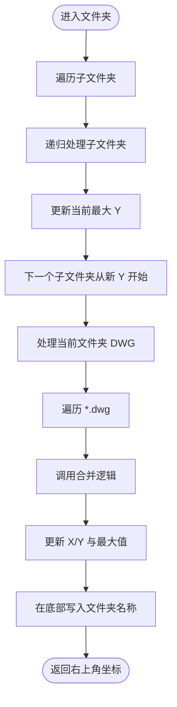
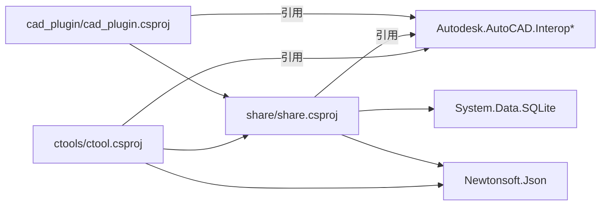

# CAD 文件处理模块

<cite>
**本文引用的文件**
- [dwg2dxf.cs](file://share/cad/dwg2dxf.cs)
- [dxf2dwg.cs](file://share/cad/dxf2dwg.cs)
- [merge_dwg.cs](file://share/cad/merge_dwg.cs)
- [folder2merge.cs](file://share/cad/folder2merge.cs)
- [get_all_dim_style.cs](file://share/cad/get_all_dim_style.cs)
- [connect.cs](file://share/cad/connect.cs)
- [open_doc.cs](file://share/cad/open_doc.cs)
- [close_doc.cs](file://share/cad/close_doc.cs)
- [draw_divider.cs](file://share/cad/draw_divider.cs)
- [cad_dwg_commands.cs](file://ctools/cad_dwg_commands.cs)
- [cad_wl_examples.cs](file://share/cad/wl_learning/cad_wl_examples.cs)
- [comhelp.cs](file://share/nomal/comhelp.cs)
- [ctool.csproj](file://ctools/ctool.csproj)
- [share.csproj](file://share/share.csproj)
- [cad_plugin.csproj](file://cad_plugin/cad_plugin.cs)
</cite>

## 目录
1. [简介](#简介)
2. [项目结构](#项目结构)
3. [核心组件](#核心组件)
4. [架构总览](#架构总览)
5. [详细组件分析](#详细组件分析)
6. [依赖分析](#依赖分析)
7. [性能考虑](#性能考虑)
8. [故障排除指南](#故障排除指南)
9. [结论](#结论)
10. [附录](#附录)

## 简介
本技术文档面向 CAD 文件处理模块，聚焦于 DWG/DXF 格式转换、文档管理与批量处理能力，涵盖以下主题：
- DWG/DXF 格式转换的实现原理与质量保障机制
- 文件合并、样式管理与分割功能的技术实现
- CAD 文档连接与生命周期管理的最佳实践
- 不同 CAD 软件之间的兼容性处理策略
- 性能优化与错误恢复机制
- 批量处理场景下的工程化实践

该模块以 AutoCAD Interop 为核心，结合命令入口与工具类，形成“命令层 → 工具层 → CAD 连接层”的分层架构，既满足单文件转换，也支持多层级目录的批量处理。

## 项目结构
项目采用“共享库 + 工具控制台 + 插件”三层组织方式：
- share：共享库，封装 CAD 连接、文档操作、样式管理等通用能力
- ctools：命令行工具，提供命令注册、参数解析与批量执行
- cad_plugin：AutoCAD 插件，承载扩展功能与自动化脚本

图表来源
- [cad_dwg_commands.cs:1-78](file://ctools/cad_dwg_commands.cs#L1-L78)
- [connect.cs:1-200](file://share/cad/connect.cs#L1-L200)
- [dwg2dxf.cs:1-40](file://share/cad/dwg2dxf.cs#L1-L40)
- [dxf2dwg.cs:1-40](file://share/cad/dxf2dwg.cs#L1-L40)
- [merge_dwg.cs:1-94](file://share/cad/merge_dwg.cs#L1-L94)
- [draw_divider.cs:1-244](file://share/cad/draw_divider.cs#L1-L244)
- [get_all_dim_style.cs:1-55](file://share/cad/get_all_dim_style.cs#L1-L55)
- [open_doc.cs:1-36](file://share/cad/open_doc.cs#L1-L36)
- [close_doc.cs:1-30](file://share/cad/close_doc.cs#L1-L30)
- [cad_wl_examples.cs:1-155](file://share/cad/wl_learning/cad_wl_examples.cs#L1-L155)
- [comhelp.cs:1-59](file://share/nomal/comhelp.cs#L1-L59)
- [cad_plugin.csproj:1-46](file://cad_plugin/cad_plugin.csproj#L1-L46)

章节来源
- [ctool.csproj:1-55](file://ctools/ctool.csproj#L1-L55)
- [share.csproj:1-40](file://share/share.csproj#L1-L40)
- [cad_plugin.csproj:1-46](file://cad_plugin/cad_plugin.csproj#L1-L46)

## 核心组件
- CAD 连接管理：统一管理 AutoCAD 实例的获取、缓存与重建，支持多版本探测与可见性保证
- 文档操作：打开/关闭活动文档，确保命令执行前后的状态一致性
- 格式转换：DWG↔DXF 的双向转换，支持目标版本选择与覆盖保护
- 文件合并：基于外部参照 AttachExternalReference 的合并与边界框计算
- 样式管理：批量重命名标注样式，避免冲突
- 批量布局：递归遍历文件夹，自动布局 DWG 并绘制分隔标识
- 命令入口：命令注册与参数解析，支持交互式与批处理模式

章节来源
- [connect.cs:11-200](file://share/cad/connect.cs#L11-L200)
- [open_doc.cs:5-36](file://share/cad/open_doc.cs#L5-L36)
- [close_doc.cs:5-30](file://share/cad/close_doc.cs#L5-L30)
- [dwg2dxf.cs:5-40](file://share/cad/dwg2dxf.cs#L5-L40)
- [dxf2dwg.cs:5-40](file://share/cad/dxf2dwg.cs#L5-L40)
- [merge_dwg.cs:8-94](file://share/cad/merge_dwg.cs#L8-L94)
- [get_all_dim_style.cs:6-55](file://share/cad/get_all_dim_style.cs#L6-L55)
- [draw_divider.cs:9-244](file://share/cad/draw_divider.cs#L9-L244)
- [cad_dwg_commands.cs:7-78](file://ctools/cad_dwg_commands.cs#L7-L78)

## 架构总览
模块采用“命令层 → 工具层 → CAD 连接层”的分层设计，命令层负责用户交互与批量调度，工具层封装具体业务逻辑，连接层统一对 AutoCAD 进行访问与生命周期管理。

图表来源
- [cad_dwg_commands.cs:1-78](file://ctools/cad_dwg_commands.cs#L1-L78)
- [command_executor.cs:1-116](file://ctools/command_executor.cs#L1-L116)
- [connect.cs:1-200](file://share/cad/connect.cs#L1-L200)
- [comhelp.cs:1-59](file://share/nomal/comhelp.cs#L1-L59)

## 详细组件分析

### 组件一：CAD 连接与生命周期管理
- 功能要点
  - 多版本 AutoCAD 自动探测与连接，优先使用运行中实例，失败则创建新实例
  - 实例缓存与有效性校验，异常时自动清理缓存并重建
  - 窗口可见性保证，确保后续操作可交互
  - COM 对象获取的跨平台兼容封装
- 生命周期
  - 获取实例 → 验证有效性 → 使用 → 异常清理 → 重建
- 质量保障
  - 注册表扫描与 ProgID 统一，降低版本差异带来的连接失败
  - 通用 ProgID 降级兜底，提升兼容性

图表来源
- [connect.cs:19-125](file://share/cad/connect.cs#L19-L125)
- [comhelp.cs:17-59](file://share/nomal/comhelp.cs#L17-L59)

章节来源
- [connect.cs:11-200](file://share/cad/connect.cs#L11-L200)
- [comhelp.cs:6-59](file://share/nomal/comhelp.cs#L6-L59)

### 组件二：DWG/DXF 格式转换
- 实现原理
  - 通过 AutoCAD 文档对象打开源文件，调用 SaveAs 指定目标类型与版本
  - 支持 DXF→DWG 与 DWG→DXF 双向转换，目标文件名由源文件名替换扩展名生成
  - 覆盖保护：若目标文件已存在则跳过转换
- 质量保障
  - 异常捕获与日志输出，便于定位问题
  - 显式关闭文档，避免资源泄漏
- 批量处理
  - 命令入口支持文件夹批量转换，逐个文件执行转换流程

图表来源
- [cad_dwg_commands.cs:22-58](file://ctools/cad_dwg_commands.cs#L22-L58)
- [dxf2dwg.cs:7-40](file://share/cad/dxf2dwg.cs#L7-L40)
- [dwg2dxf.cs:7-40](file://share/cad/dwg2dxf.cs#L7-L40)

章节来源
- [dxf2dwg.cs:5-40](file://share/cad/dxf2dwg.cs#L5-L40)
- [dwg2dxf.cs:5-40](file://share/cad/dwg2dxf.cs#L5-L40)
- [cad_dwg_commands.cs:22-58](file://ctools/cad_dwg_commands.cs#L22-L58)

### 组件三：文件合并与边界计算
- 技术实现
  - 使用 ModelSpace.AttachExternalReference 附加外部参照，生成唯一块名
  - 通过 GetBoundingBox 获取最小/最大点，计算相对偏移与最终尺寸
  - Move 移动参照至指定插入点，Bind(false) 绑定为独立实体
- 数据流
  - 输入：源文件路径、插入点坐标、是否启用维度样式隔离
  - 输出：合并后的相对最大 X/Y 坐标，失败返回 null
- 容错与日志
  - 异常捕获与内部异常链路输出，便于定位底层 COM 错误

图表来源
- [merge_dwg.cs:17-92](file://share/cad/merge_dwg.cs#L17-L92)

章节来源
- [merge_dwg.cs:8-94](file://share/cad/merge_dwg.cs#L8-L94)

### 组件四：样式管理（标注样式）
- 功能概述
  - 遍历当前文档的所有标注样式，为每个样式添加文档名后缀，避免命名冲突
  - 保存修改后的文档
- 适用场景
  - 多文档合并前的样式隔离，防止样式名重复导致的渲染异常

图表来源
- [cad_dwg_commands.cs:69-73](file://ctools/cad_dwg_commands.cs#L69-L73)
- [get_all_dim_style.cs:8-55](file://share/cad/get_all_dim_style.cs#L8-L55)

章节来源
- [get_all_dim_style.cs:6-55](file://share/cad/get_all_dim_style.cs#L6-L55)
- [cad_dwg_commands.cs:69-73](file://ctools/cad_dwg_commands.cs#L69-L73)

### 组件五：批量布局与分割（递归文件夹处理）
- 技术实现
  - 递归遍历文件夹树，先处理子文件夹，再处理当前层级 DWG 文件
  - 为每个 DWG 调用合并逻辑，叠加 X/Y 坐标与间距，绘制文件夹名称文字
  - 支持交互式选择根目录或直接传参
- 参数与行为
  - 零件间距、文件夹间距、文字高度、文字偏移等参数可调
  - 仅对 *.dwg 文件进行处理，忽略其他类型
- 输出
  - 控制台输出每个文件的插入位置与占用区域，最终汇总总占用范围

图表来源
- [draw_divider.cs:69-175](file://share/cad/draw_divider.cs#L69-L175)

章节来源
- [draw_divider.cs:9-244](file://share/cad/draw_divider.cs#L9-L244)
- [merge_dwg.cs:8-94](file://share/cad/merge_dwg.cs#L8-L94)

### 组件六：文档打开/关闭与命令入口
- 文档打开
  - 通过 Documents.Open 打开指定路径文档，激活窗口
- 文档关闭
  - 关闭当前活动文档
- 命令入口
  - 基于特性注册命令，解析参数并调用对应工具方法
  - 提供批量转换与布局的命令入口

章节来源
- [open_doc.cs:5-36](file://share/cad/open_doc.cs#L5-L36)
- [close_doc.cs:5-30](file://share/cad/close_doc.cs#L5-L30)
- [cad_dwg_commands.cs:9-78](file://ctools/cad_dwg_commands.cs#L9-L78)

### 组件七：标注学习与推荐（扩展能力）
- 能力概述
  - 基于图结构与 WL 迭代，从标注图纸中学习标注规则
  - 支持批量学习与相似度矩阵计算，辅助新图推荐标注
- 适用场景
  - 企业标准标注规范沉淀与复用，提升标注一致性

章节来源
- [cad_wl_examples.cs:10-155](file://share/cad/wl_learning/cad_wl_examples.cs#L10-L155)

## 依赖分析
- 项目依赖
  - ctools 依赖 share，使用 AutoCAD Interop 与 Newtonsoft.Json
  - share 引用 AutoCAD Interop 与 SQLite 等
  - cad_plugin 依赖 share，面向 AutoCAD 插件环境
- 外部接口
  - AutoCAD COM 接口（AcadApplication/Document/DimStyles 等）
  - Windows 注册表（版本探测）
  - COM 对象获取（GetActiveObject）

图表来源
- [ctool.csproj:24-41](file://ctools/ctool.csproj#L24-L41)
- [share.csproj:11-24](file://share/share.csproj#L11-L24)
- [cad_plugin.csproj:24-44](file://cad_plugin/cad_plugin.csproj#L24-L44)

章节来源
- [ctool.csproj:1-55](file://ctools/ctool.csproj#L1-L55)
- [share.csproj:1-40](file://share/share.csproj#L1-L40)
- [cad_plugin.csproj:1-46](file://cad_plugin/cad_plugin.csproj#L1-L46)

## 性能考虑
- 连接复用
  - 通过缓存实例减少重复创建与注册表扫描开销
- 批处理优化
  - 批量转换时尽量减少 AutoCAD 窗口切换与交互
  - 合并布局时按层级顺序处理，避免重复计算边界
- I/O 与内存
  - 转换前检查目标文件是否存在，避免无效写入
  - 合并完成后及时关闭文档，释放内存
- 版本兼容
  - 优先使用运行中实例，避免多次启动 AutoCAD 的成本

## 故障排除指南
- 无法连接 AutoCAD
  - 现象：提示未检测到任何版本或连接失败
  - 处理：确认已安装 AutoCAD；手动启动任一版本后再试；检查 ProgID 是否注册
- 文档未激活
  - 现象：提示无活动文档
  - 处理：先执行打开文档命令，确保有活动文档
- 转换失败
  - 现象：转换异常或保存失败
  - 处理：检查源文件路径与权限；查看控制台错误信息；确认目标类型与版本兼容
- 合并异常
  - 现象：附加外部参照失败或边界框异常
  - 处理：检查文件是否损坏；确认文件类型不受支持；查看内部异常堆栈
- 样式重命名失败
  - 现象：部分样式重命名异常
  - 处理：检查样式名是否被系统保留；尝试单独处理该样式

章节来源
- [connect.cs:39-125](file://share/cad/connect.cs#L39-L125)
- [open_doc.cs:17-30](file://share/cad/open_doc.cs#L17-L30)
- [dxf2dwg.cs:34-37](file://share/cad/dxf2dwg.cs#L34-L37)
- [merge_dwg.cs:85-91](file://share/cad/merge_dwg.cs#L85-L91)
- [get_all_dim_style.cs:40-43](file://share/cad/get_all_dim_style.cs#L40-L43)

## 结论
该 CAD 文件处理模块以 AutoCAD Interop 为基础，围绕“连接管理—文档操作—格式转换—批量处理—样式管理—学习推荐”构建了完整的处理链路。通过多版本探测、实例缓存与异常恢复机制，提升了稳定性与兼容性；通过命令入口与递归布局算法，满足了批量处理与工程化落地的需求。建议在生产环境中配合日志监控与超时控制，进一步增强健壮性与可观测性。

## 附录
- 命令清单（示例）
  - dxf2dwg：DXF 转换为 DWG
  - dwg2dxf：DWG 转换为 DXF
  - folder2dwg：批量转换文件夹内 DXF 为 DWG
  - folder2dxf：批量转换文件夹内 DWG 为 DXF
  - mergedwg：遍历（子）文件夹：合并 DWG 并绘制边界框
  - get_all_dim_style：获取所有标注样式并添加 UUID4 后缀
- 最佳实践
  - 批量处理前先进行小样本验证
  - 合并前统一标注样式命名，避免冲突
  - 转换后进行完整性校验（边界框、图层、字体等）
  - 在 CI/CD 中加入超时与重试策略，避免长时间阻塞