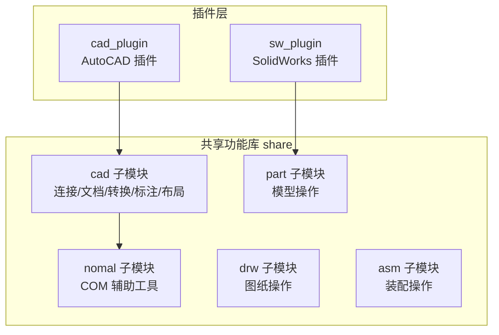
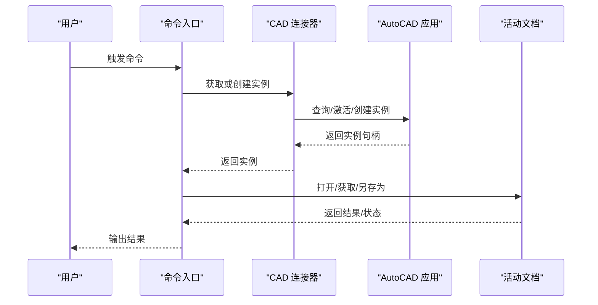
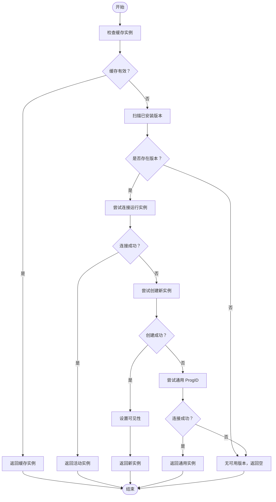
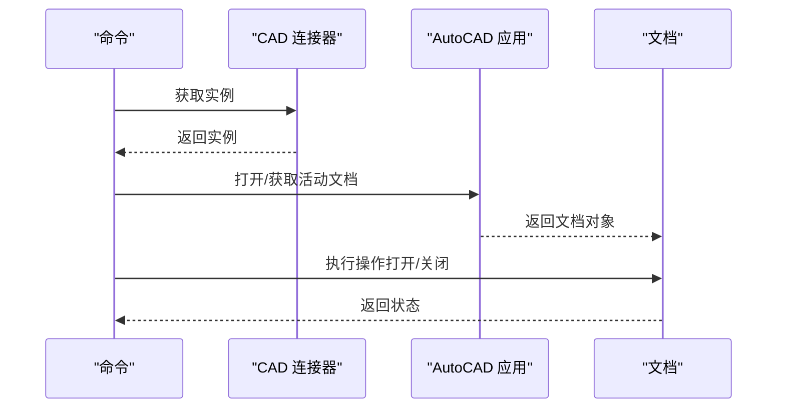
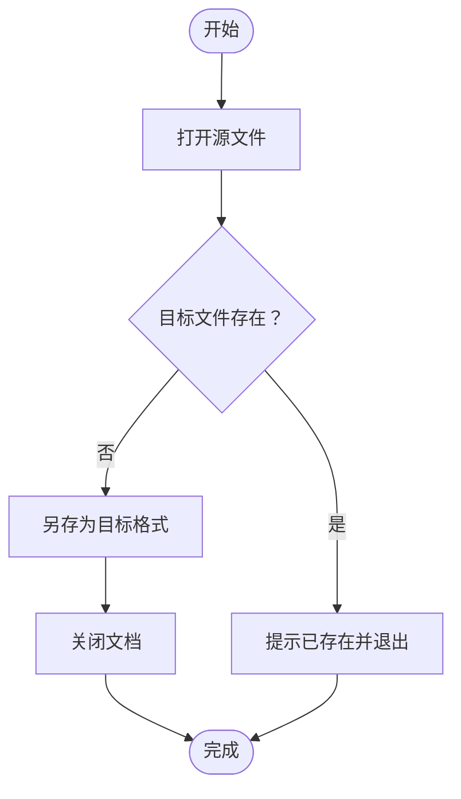
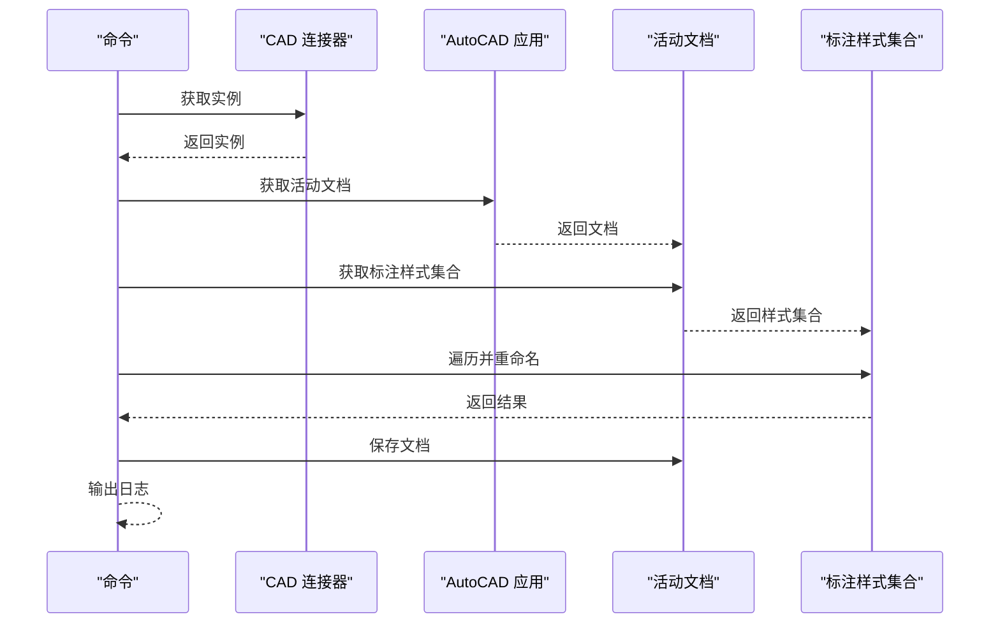
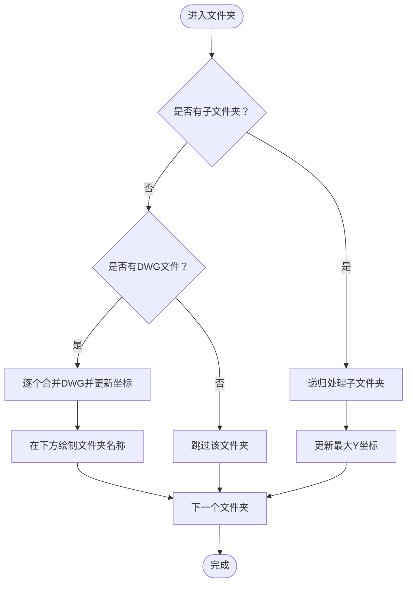
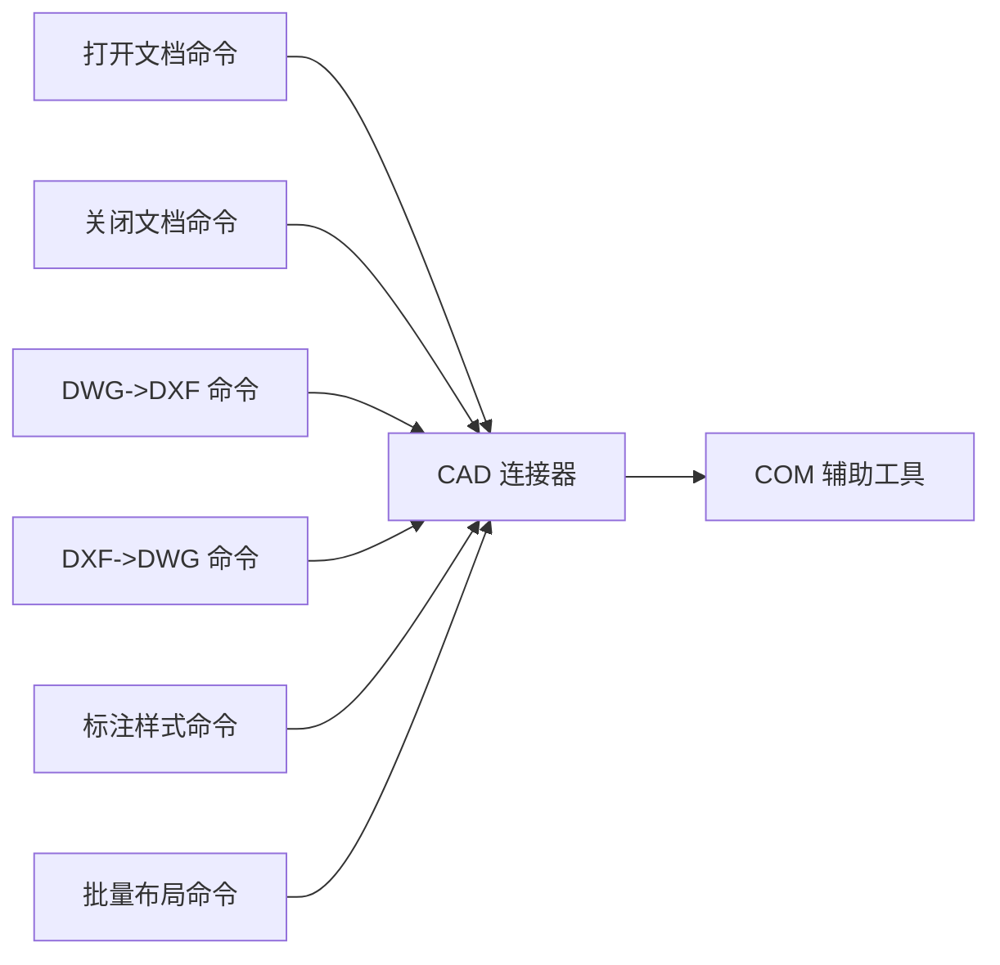

# CAXA 集成模块

<cite>
**本文引用的文件**
- [connect.cs](file://share/caxa/connect.cs)
- [connect.cs](file://share/cad/connect.cs)
- [open_doc.cs](file://share/cad/open_doc.cs)
- [close_doc.cs](file://share/cad/close_doc.cs)
- [dwg2dxf.cs](file://share/cad/dwg2dxf.cs)
- [dxf2dwg.cs](file://share/cad/dxf2dwg.cs)
- [get_all_dim_style.cs](file://share/cad/get_all_dim_style.cs)
- [draw_divider.cs](file://share/cad/draw_divider.cs)
- [comhelp.cs](file://share/nomal/comhelp.cs)
</cite>

## 目录
1. [简介](#简介)
2. [项目结构](#项目结构)
3. [核心组件](#核心组件)
4. [架构总览](#架构总览)
5. [详细组件分析](#详细组件分析)
6. [依赖关系分析](#依赖关系分析)
7. [性能考虑](#性能考虑)
8. [故障排除指南](#故障排除指南)
9. [结论](#结论)
10. [附录](#附录)

## 简介
本文件面向开发者，系统化梳理仓库中与 CAXA 相关的集成能力与共享功能库。当前仓库中存在一个位于 share/caxa 的占位文件，表明该模块尚处于初期阶段；同时，share/cad 下提供了成熟的 AutoCAD 集成实现，包括连接管理、文档操作、格式转换、标注样式处理以及批量布局等能力。本文将以 AutoCAD 集成实现为基础，给出可迁移至 CAXA 的架构设计、API 调用模式、兼容性策略与最佳实践，帮助开发者在 CAXA 环境下高效复用共享功能库。

## 项目结构
仓库采用按领域分层的组织方式：
- share：共享功能库，包含 cad、part、drw、asm、nomal 等子模块
- cad_plugin：AutoCAD 插件入口与命令
- ctools：命令注册、执行与上下文工具
- sw_plugin：SolidWorks 插件入口与命令
- reference、cad相关论文、设计笔记：辅助资料

与 CAXA 集成直接相关的文件主要集中在 share/cad 与 share/caxa，以及共享的 com 工具 comhelp.cs。

**章节来源**
- [connect.cs:1-200](file://share/cad/connect.cs#L1-L200)
- [comhelp.cs:1-59](file://share/nomal/comhelp.cs#L1-L59)

## 核心组件
- CAD 连接管理器：负责 AutoCAD 实例发现、连接、缓存与重建
- 文档操作：打开/关闭文档、保存、另存为
- 数据交换：DWG/DXF 格式互转
- 标注样式：枚举与批量重命名
- 批量布局：按层级递归合并并绘制分隔标注
- COM 辅助：跨平台获取活动 COM 对象

这些能力为 CAXA 集成提供了清晰的参考模型：以连接管理为核心，围绕文档生命周期与数据格式进行扩展。

**章节来源**
- [open_doc.cs:1-36](file://share/cad/open_doc.cs#L1-L36)
- [close_doc.cs:1-30](file://share/cad/close_doc.cs#L1-L30)
- [dwg2dxf.cs:1-40](file://share/cad/dwg2dxf.cs#L1-L40)
- [dxf2dwg.cs:1-40](file://share/cad/dxf2dwg.cs#L1-L40)
- [get_all_dim_style.cs:1-55](file://share/cad/get_all_dim_style.cs#L1-L55)
- [draw_divider.cs:1-244](file://share/cad/draw_divider.cs#L1-L244)

## 架构总览
下图展示了 AutoCAD 集成的典型调用链路：命令入口通过共享连接器获取 AutoCAD 实例，随后对活动文档执行操作，必要时进行格式转换或批量处理。

**图表来源**
- [connect.cs:19-125](file://share/cad/connect.cs#L19-L125)
- [open_doc.cs:7-26](file://share/cad/open_doc.cs#L7-L26)
- [dwg2dxf.cs:9-32](file://share/cad/dwg2dxf.cs#L9-L32)

## 详细组件分析

### 组件一：CAD 连接管理器
- 功能要点
  - 自动检测已安装的 AutoCAD 版本并构建 ProgID 列表
  - 优先尝试连接运行中的实例，失败则尝试创建新实例
  - 提供实例缓存与失效检测，避免重复创建
  - 支持通用 ProgID 回退策略
  - 通过 COM 辅助工具封装 GetActiveObject，提升兼容性

- 关键流程
  - 版本发现：读取注册表，解析版本号并生成 ProgID
  - 连接尝试：GetActiveObject -> 创建实例 -> 设置可见性
  - 异常处理：捕获 COM 异常与创建异常，输出调试信息

**图表来源**
- [connect.cs:19-125](file://share/cad/connect.cs#L19-L125)

**章节来源**
- [connect.cs:19-125](file://share/cad/connect.cs#L19-L125)
- [comhelp.cs:17-46](file://share/nomal/comhelp.cs#L17-L46)

### 组件二：文档操作（打开/关闭）
- 打开文档：校验文件存在性后通过应用 Documents.Open 打开并激活
- 关闭文档：获取活动文档并调用 Close

**图表来源**
- [open_doc.cs:7-26](file://share/cad/open_doc.cs#L7-L26)
- [close_doc.cs:7-22](file://share/cad/close_doc.cs#L7-L22)

**章节来源**
- [open_doc.cs:7-36](file://share/cad/open_doc.cs#L7-L36)
- [close_doc.cs:7-30](file://share/cad/close_doc.cs#L7-L30)

### 组件三：数据交换（DWG/DXF 转换）
- DWG 转 DXF：打开源文件，调用 SaveAs 指定目标格式，关闭文档
- DXF 转 DWG：同理，目标格式为 DWG

**图表来源**
- [dwg2dxf.cs:7-32](file://share/cad/dwg2dxf.cs#L7-L32)
- [dxf2dwg.cs:7-32](file://share/cad/dxf2dwg.cs#L7-L32)

**章节来源**
- [dwg2dxf.cs:7-40](file://share/cad/dwg2dxf.cs#L7-L40)
- [dxf2dwg.cs:7-40](file://share/cad/dxf2dwg.cs#L7-L40)

### 组件四：标注样式处理
- 获取活动文档的所有标注样式，遍历并重命名（附加文档名），最后保存

**图表来源**
- [get_all_dim_style.cs:8-48](file://share/cad/get_all_dim_style.cs#L8-L48)

**章节来源**
- [get_all_dim_style.cs:8-55](file://share/cad/get_all_dim_style.cs#L8-L55)

### 组件五：批量布局与分隔标注
- 递归遍历文件夹，按层级绘制边界与标注
- 对每个文件夹内的 DWG 文件进行合并插入，计算占用区域
- 使用文字实体在合适位置标注文件夹名称

**图表来源**
- [draw_divider.cs:69-175](file://share/cad/draw_divider.cs#L69-L175)

**章节来源**
- [draw_divider.cs:181-240](file://share/cad/draw_divider.cs#L181-L240)

## 依赖关系分析
- 组件耦合
  - CAD 命令类依赖 CAD 连接器以获取应用实例
  - 连接器依赖 COM 辅助工具以跨平台获取活动对象
  - 文档操作与数据交换均依赖活动文档对象
- 外部依赖
  - AutoCAD Interop 类型库（AcadApplication、AcadDocument 等）
  - Windows 注册表（版本发现）
  - 文件系统（路径解析、文件存在性判断）

**图表来源**
- [open_doc.cs:7-26](file://share/cad/open_doc.cs#L7-L26)
- [close_doc.cs:7-22](file://share/cad/close_doc.cs#L7-L22)
- [dwg2dxf.cs:9-32](file://share/cad/dwg2dxf.cs#L9-L32)
- [dxf2dwg.cs:9-32](file://share/cad/dxf2dwg.cs#L9-L32)
- [get_all_dim_style.cs:10-48](file://share/cad/get_all_dim_style.cs#L10-L48)
- [draw_divider.cs:20-98](file://share/cad/draw_divider.cs#L20-L98)
- [comhelp.cs:17-46](file://share/nomal/comhelp.cs#L17-L46)

**章节来源**
- [connect.cs:138-198](file://share/cad/connect.cs#L138-L198)
- [comhelp.cs:1-59](file://share/nomal/comhelp.cs#L1-L59)

## 性能考虑
- 实例缓存：连接器内置静态缓存，减少重复创建与注册表扫描
- 最小化 COM 调用：尽量在一次操作中完成多个步骤（如打开、保存、关闭）
- 批处理优化：批量布局采用递归与坐标累加，避免频繁切换活动文档
- I/O 优化：转换前检查目标文件是否存在，避免无效写入

[本节为通用指导，不直接分析具体文件]

## 故障排除指南
- 无法连接 AutoCAD
  - 现象：返回空实例，提示未检测到版本或连接失败
  - 排查：确认 AutoCAD 是否已安装并注册；检查 ProgID 是否存在；尝试手动启动 AutoCAD
  - 参考：版本发现与通用 ProgID 回退逻辑
- 创建实例失败
  - 现象：GetTypeFromProgID 返回空或创建异常
  - 排查：确认 COM 注册与权限；查看异常类型与堆栈
- 文档打开失败
  - 现象：文件不存在或打开异常
  - 排查：检查路径与权限；确认文件格式受支持
- 标注样式重命名失败
  - 现象：部分样式重命名异常
  - 排查：检查命名冲突与只读状态；逐条记录失败项
- 批量布局异常
  - 现象：UI 线程阻塞或文件夹选择失败
  - 排查：确保在 STA 线程中弹出选择对话框；检查目录权限与文件数量

**章节来源**
- [connect.cs:39-124](file://share/cad/connect.cs#L39-L124)
- [open_doc.cs:17-30](file://share/cad/open_doc.cs#L17-L30)
- [get_all_dim_style.cs:35-43](file://share/cad/get_all_dim_style.cs#L35-L43)
- [draw_divider.cs:189-213](file://share/cad/draw_divider.cs#L189-L213)

## 结论
仓库中的 AutoCAD 集成实现提供了完整的连接管理、文档操作、数据交换与批量处理范式。尽管 share/caxa 下的连接文件目前为空，但其架构与接口设计可作为 CAXA 集成的蓝图：以连接器为中心，围绕文档生命周期与数据格式扩展 API；通过共享工具（COM 辅助）提升跨平台兼容性；在命令层实现幂等、可恢复的操作流程。开发者可据此快速落地 CAXA 环境下的自动化与批处理能力。

[本节为总结性内容，不直接分析具体文件]

## 附录

### CAXA 集成实施建议
- 连接与会话
  - 参考 CAD 连接器的版本发现与缓存策略，建立 CAXA 实例缓存
  - 提供显式断开与重连接口，便于批处理场景下的资源回收
- 文档与命令
  - 以“打开/执行/关闭”为主线，封装常用命令序列
  - 对外部输入进行严格校验（路径、权限、格式）
- 数据交换
  - 优先支持 DWG/DXF 等通用格式；对特殊格式提供转换桥接
  - 在批处理中加入去重与增量逻辑，避免重复转换
- 自动化与批处理
  - 将批量布局思路迁移到 CAXA：按层级组织、坐标规划、标注标识
  - 使用异步与进度回调，改善长任务体验
- 错误处理与可观测性
  - 统一异常包装与日志输出，区分可恢复与不可恢复错误
  - 提供健康检查与重试策略，增强稳定性

[本节为概念性内容，不直接分析具体文件]