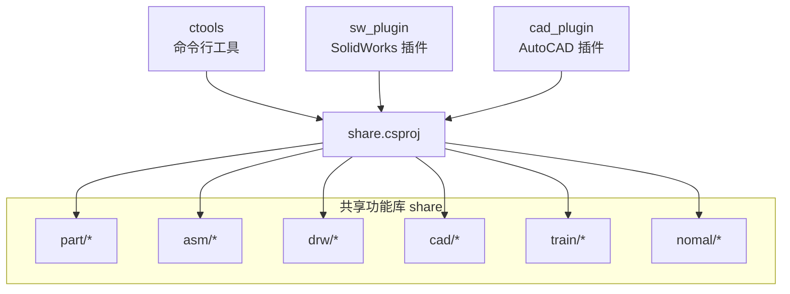
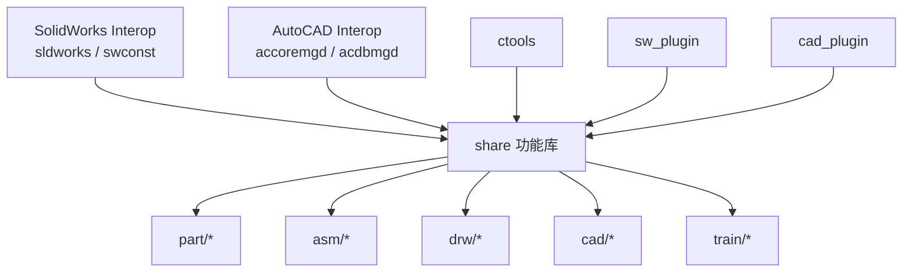
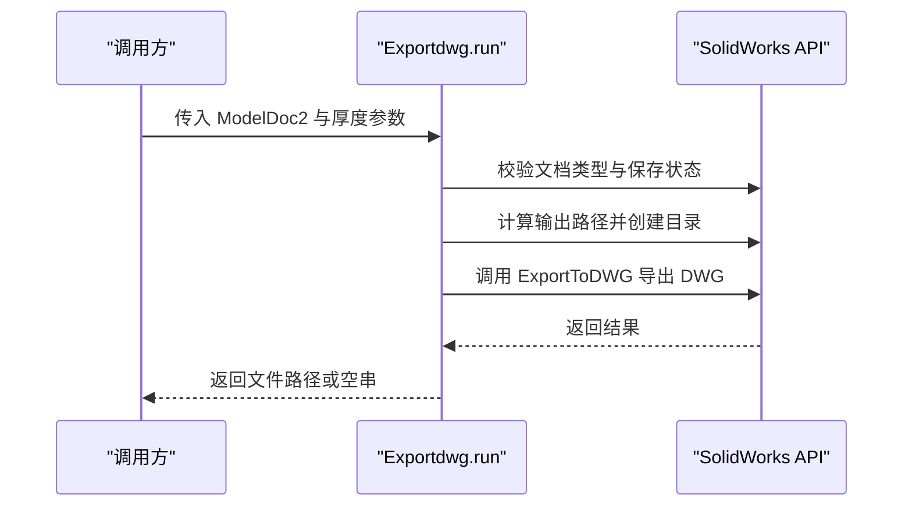
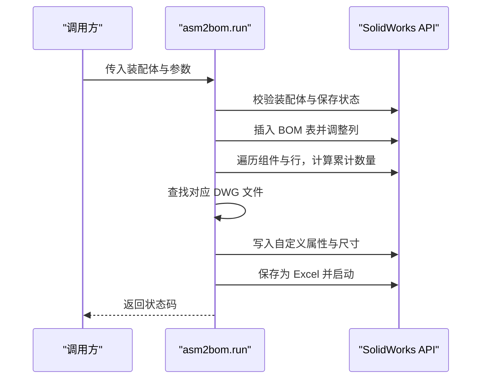
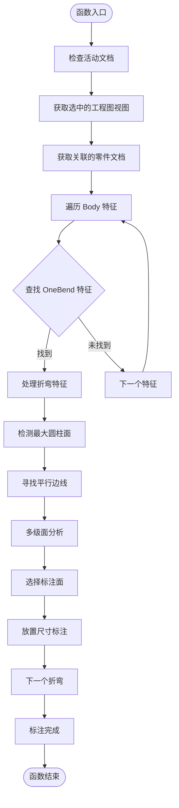
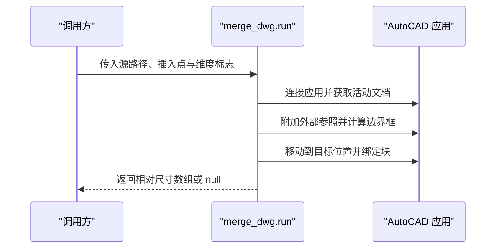
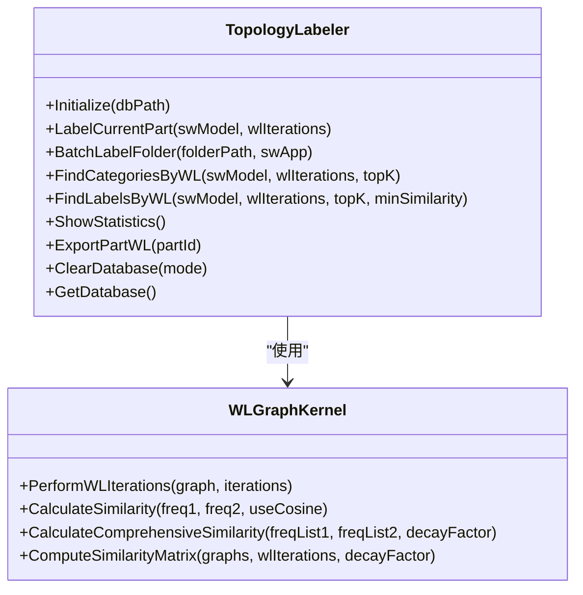
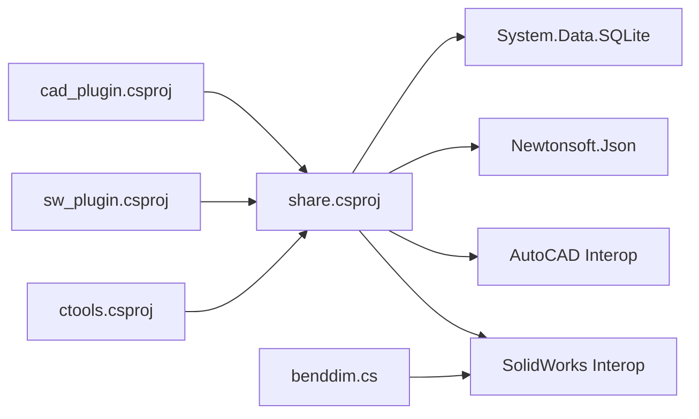

# 共享功能库

<cite>
**本文引用的文件**
- [share.csproj](file://share/share.csproj)
- [ctool.csproj](file://ctools/ctool.csproj)
- [sw_plugin.csproj](file://sw_plugin/sw_plugin.csproj)
- [cad_plugin.csproj](file://cad_plugin/cad_plugin.csproj)
- [README.md](file://README.md)
- [exportdwg.cs](file://share/part/exportdwg.cs)
- [get_thickness.cs](file://share/part/get_thickness.cs)
- [asm2bom.cs](file://share/asm/asm2bom.cs)
- [asm2do.cs](file://share/asm/asm2do.cs)
- [drw2dxf.cs](file://share/drw/drw2dxf.cs)
- [get_all_visable_edge.cs](file://share/drw/get_all_visable_edge.cs)
- [dwg2dxf.cs](file://share/cad/dwg2dxf.cs)
- [merge_dwg.cs](file://share/cad/merge_dwg.cs)
- [topology_labeler.cs](file://share/train/topology_labeler.cs)
- [wl_graph_kernel.cs](file://share/train/wl_graph_kernel.cs)
- [benddim.cs](file://share/drw/benddim.cs)
- [drw_commands.cs](file://ctools/solidworks_commands/drw_commands.cs)
</cite>

## 更新摘要
**变更内容**
- 新增 Sheet Metal 弯曲自动标注功能模块
- 添加 benddim 类实现智能折弯尺寸标注
- 更新工程图处理功能域以包含折弯标注能力
- 增强钣金件自动化处理流程

## 目录
1. [简介](#简介)
2. [项目结构](#项目结构)
3. [核心组件](#核心组件)
4. [架构总览](#架构总览)
5. [详细组件分析](#详细组件分析)
6. [依赖分析](#依赖分析)
7. [性能考虑](#性能考虑)
8. [故障排除指南](#故障排除指南)
9. [结论](#结论)
10. [附录](#附录)

## 简介
本文件为"共享功能库"的权威参考文档，覆盖零件操作、装配体管理、工程图处理与 CAD 文件处理四大领域。文档面向开发者与高级用户，提供模块职责、函数签名、参数与返回值说明、典型使用流程、错误处理策略、性能优化建议以及扩展与编码规范指引，帮助读者高效使用并安全扩展功能库。

**更新** 新增 Sheet Metal 弯曲自动标注功能，为钣金件设计提供智能化的尺寸标注解决方案。

## 项目结构
共享功能库位于 share 目录，采用按功能域分层的组织方式：
- part/ 零件相关功能（导出 DWG、获取厚度、新建工程图等）
- asm/ 装配体相关功能（生成 BOM、装配体转工程图、导出 STEP 等）
- drw/ 工程图相关功能（工程图转 DWG/DXF/PNG、可见边线提取、**折弯自动标注**等）
- cad/ 通用 CAD 文件处理（DWG/DXF 转换、合并、绘制分隔线等）
- train/ 高级训练与算法（拓扑标注、WL 图核、相似度计算等）
- nomal/ 通用工具（剪贴板、性能分析、COM 帮助等）

ctools、sw_plugin、cad_plugin 分别为命令行工具、SolidWorks 插件与 AutoCAD 插件，均以项目引用的方式依赖 share，形成统一的能力层。

**图表来源**
- [share.csproj:1-40](file://share/share.csproj#L1-L40)
- [ctool.csproj:25-26](file://ctools/ctool.csproj#L25-L26)
- [sw_plugin.csproj:25-26](file://sw_plugin/sw_plugin.csproj#L25-L26)
- [cad_plugin.csproj:43-44](file://cad_plugin/cad_plugin.csproj#L43-L44)

**章节来源**
- [README.md:193-249](file://README.md#L193-L249)
- [share.csproj:1-40](file://share/share.csproj#L1-L40)

## 核心组件
本节概述四大功能域的关键能力与职责：
- 零件操作：围绕 SolidWorks 零件文档进行导出、测量与辅助操作
- 装配体管理：装配体的 BOM 生成、工程图生成、批量处理与统计
- 工程图处理：工程图格式转换、可视化几何信息提取、**智能折弯标注**
- CAD 文件处理：跨平台 DWG/DXF 文件转换与合并

**更新** 工程图处理模块新增智能折弯标注能力，通过算法自动识别钣金件折弯特征并生成相应的尺寸标注。

**章节来源**
- [README.md:55-87](file://README.md#L55-L87)

## 架构总览
共享功能库通过统一的 API 接口与错误处理机制，向上层提供稳定的能力封装；底层依赖 SolidWorks Interop 与 AutoCAD Interop，确保与主流 CAD 平台的互操作。

**图表来源**
- [share.csproj:12-23](file://share/share.csproj#L12-L23)
- [ctool.csproj:35-40](file://ctools/ctool.csproj#L35-L40)
- [sw_plugin.csproj:29-40](file://sw_plugin/sw_plugin.csproj#L29-L40)
- [cad_plugin.csproj:25-39](file://cad_plugin/cad_plugin.csproj#L25-L39)

## 详细组件分析

### 零件操作（part/）
- exportdwg：将当前打开的 SolidWorks 零件导出为 DWG 文件，按厚度分类输出至"出图"目录
  - 参数：ModelDoc2 swModel, string thickness
  - 返回：生成文件的完整路径字符串；失败返回空串
  - 关键行为：校验文档类型与保存状态，构造输出路径，调用 ExportToDWG，捕获异常并输出提示
  - 典型用法：在命令执行器中接收用户输入的厚度参数，调用 run
- get_thickness：获取钣金件厚度（毫米级精度）
  - 参数：ModelDoc2 swModel
  - 返回：厚度数值；未找到特征时返回 0
  - 关键行为：遍历特征，定位 SheetMetal 特征，读取厚度并四舍五入

**图表来源**
- [exportdwg.cs:12-77](file://share/part/exportdwg.cs#L12-L77)

**章节来源**
- [exportdwg.cs:12-77](file://share/part/exportdwg.cs#L12-L77)
- [get_thickness.cs:12-41](file://share/part/get_thickness.cs#L12-L41)

### 装配体管理（asm/）
- asm2bom：在装配体中插入缩进式 BOM 表，计算累计数量、填充规格尺寸与"是否出图"状态，并导出为 Excel
  - 参数：SldWorks swApp, ModelDoc2 swModel, bool issheetmeet
  - 返回：0 表示成功；-1 表示失败
  - 关键行为：校验装配体文档，插入 BOM 表，遍历行计算数量，查找对应 DWG 文件，写入自定义属性，保存并启动 Excel
- asm2do：遍历装配体顶层组件，对首次出现的零件执行回调动作（如导出 DWG），统计引用与导出次数
  - 参数：SldWorks swApp, ModelDoc2 swModel, Action<ModelDoc2, SldWorks> action
  - 返回：首次出现的零件路径数组；失败返回 null
  - 关键行为：递归遍历组件树，去重统计，按需打开/关闭文档，记录导出数量

**图表来源**
- [asm2bom.cs:12-359](file://share/asm/asm2bom.cs#L12-L359)

**章节来源**
- [asm2bom.cs:12-359](file://share/asm/asm2bom.cs#L12-L359)
- [asm2do.cs:22-151](file://share/asm/asm2do.cs#L22-L151)

### 工程图处理（drw/）
- drw2dxf：将当前工程图保存为 DXF，设置输出比例与 DXF 版本，应用自定义映射文件
  - 参数：ModelDoc2 swModel, SldWorks swApp
  - 返回：生成文件的完整路径字符串
  - 关键行为：设置用户偏好（比例、版本、映射文件），静默保存为 DXF
- get_all_visable_edge：遍历当前图纸视图，输出可见面与可见边的几何信息（面积、类型等）
  - 参数：ModelDoc2 swModel
  - 返回：无
  - 关键行为：获取当前图纸与视图，遍历可见组件与实体，识别曲线类型并记录
- **benddim（新增）**：自动检测和标注 Sheet Metal 弯曲特征的智能标注系统
  - 核心方法：`标折弯尺寸(ISldWorks swApp)` - 主入口函数
  - 算法流程：特征检测 → 几何分析 → 面识别 → 标注生成
  - 关键特性：自动识别 OneBend 特征，分析圆柱面几何，智能选择标注面，自动生成尺寸标注

**图表来源**
- [benddim.cs:13-62](file://share/drw/benddim.cs#L13-L62)
- [benddim.cs:64-266](file://share/drw/benddim.cs#L64-L266)

**章节来源**
- [drw2dxf.cs:11-72](file://share/drw/drw2dxf.cs#L11-L72)
- [get_all_visable_edge.cs:14-175](file://share/drw/get_all_visable_edge.cs#L14-L175)
- [benddim.cs:13-331](file://share/drw/benddim.cs#L13-L331)

### CAD 文件处理（cad/）
- dwg2dxf：通过 AutoCAD Interop 将 DWG 转换为 DXF
  - 参数：string filePath
  - 返回：无
  - 关键行为：连接 AutoCAD 应用，打开源文件，另存为 DXF，关闭文档
- merge_dwg：将外部 DWG 作为外部参照附加到当前图形，计算边界框并移动到指定坐标，返回相对尺寸
  - 参数：string sourcePath, double x, double y, bool isDim
  - 返回：double[] { relativeMaxX, relativeMaxY }；失败返回 null
  - 关键行为：AttachExternalReference，获取边界框，Move 并绑定块

**图表来源**
- [merge_dwg.cs:17-92](file://share/cad/merge_dwg.cs#L17-L92)

**章节来源**
- [dwg2dxf.cs:7-40](file://share/cad/dwg2dxf.cs#L7-L40)
- [merge_dwg.cs:17-92](file://share/cad/merge_dwg.cs#L17-L92)

### 高级功能（train/）
- topology_labeler：提供拓扑标注与检索能力，支持批量处理、WL 标签相似度匹配、数据库统计与导出
  - 关键方法：Initialize、LabelCurrentPart、BatchLabelFolder、FindCategoriesByWL、FindLabelsByWL、ShowStatistics、ExportPartWL、ClearDatabase 等
  - 数据流：构建拓扑图 → 执行 WL 迭代 → 存储标签 → 用户交互标注 → 统计与导出
- wl_graph_kernel：实现 Weisfeiler-Lehman 图核算法，支持多轮次标签聚合与相似度计算
  - 关键方法：PerformWLIterations（Body/Face 图）、CalculateSimilarity、CalculateComprehensiveSimilarity、ComputeSimilarityMatrix
  - 输出：每轮次标签频率字典列表，相似度矩阵

**图表来源**
- [topology_labeler.cs:13-679](file://share/train/topology_labeler.cs#L13-L679)
- [wl_graph_kernel.cs:12-434](file://share/train/wl_graph_kernel.cs#L12-L434)

**章节来源**
- [topology_labeler.cs:13-679](file://share/train/topology_labeler.cs#L13-L679)
- [wl_graph_kernel.cs:12-434](file://share/train/wl_graph_kernel.cs#L12-L434)

## 依赖分析
- share.csproj 引用 SolidWorks Interop 与 AutoCAD Interop，提供核心 CAD 能力
- ctools、sw_plugin、cad_plugin 三个上层项目均以 ProjectReference 方式引用 share，形成统一能力层
- train 模块依赖 Newtonsoft.Json 与 SQLite（通过 share 间接使用），用于标注数据库与序列化
- **新增** benddim 模块依赖 SolidWorks Interop 进行特征检测和几何分析

**图表来源**
- [share.csproj:12-30](file://share/share.csproj#L12-L30)
- [ctool.csproj:25-26](file://ctools/ctool.csproj#L25-L26)
- [sw_plugin.csproj:25-26](file://sw_plugin/sw_plugin.csproj#L25-L26)
- [cad_plugin.csproj:43-44](file://cad_plugin/cad_plugin.csproj#L43-L44)

**章节来源**
- [share.csproj:12-30](file://share/share.csproj#L12-L30)
- [ctool.csproj:25-26](file://ctools/ctool.csproj#L25-L26)
- [sw_plugin.csproj:25-26](file://sw_plugin/sw_plugin.csproj#L25-L26)
- [cad_plugin.csproj:43-44](file://cad_plugin/cad_plugin.csproj#L43-L44)

## 性能考虑
- 批量处理：asm2do 采用顺序遍历与去重统计，避免重复打开同一零件文档；建议在上层调用中合理拆分任务，减少长时间阻塞
- I/O 优化：导出与转换操作集中于磁盘写入，建议确保输出目录存在且权限充足，必要时预创建"出图"目录
- API 调用：SolidWorks 与 AutoCAD 的 COM 调用成本较高，应尽量减少不必要的文档切换与重建
- 数据库：train 模块使用 SQLite，建议定期清理历史数据与导出文件，避免数据库膨胀影响查询性能
- **新增** 折弯标注性能：benddim 采用多级几何分析算法，建议在大批量折弯特征时分批处理，避免长时间阻塞 SolidWorks UI

## 故障排除指南
- SolidWorks 文档未保存：导出前需确保文档已保存，否则会返回空路径或失败
- 非目标文档类型：函数会校验文档类型（零件/装配体/工程图），若不匹配则直接返回
- AutoCAD 未运行：CAD 相关操作需先启动 AutoCAD，否则连接失败
- 权限不足：注册插件或写入输出目录需管理员权限
- 命令执行无响应：检查控制台输出与 SolidWorks 错误提示，确认当前文档类型与命令要求一致
- **新增** 折弯标注失败：检查是否选择了正确的工程图视图，确保视图关联到有效的钣金零件文档

**章节来源**
- [exportdwg.cs:20-38](file://share/part/exportdwg.cs#L20-L38)
- [asm2bom.cs:16-28](file://share/asm/asm2bom.cs#L16-L28)
- [drw2dxf.cs:14-21](file://share/drw/drw2dxf.cs#L14-L21)
- [merge_dwg.cs:24-36](file://share/cad/merge_dwg.cs#L24-L36)
- [README.md:281-317](file://README.md#L281-L317)

## 结论
共享功能库以清晰的模块划分与稳健的错误处理，提供了从基础导出到高级拓扑分析的完整能力谱系。通过统一的项目依赖与接口设计，开发者可以快速集成并扩展新功能，同时保持系统的稳定性与可维护性。

**更新** 新增的 Sheet Metal 弯曲自动标注功能进一步增强了钣金件设计的自动化水平，通过智能算法识别折弯特征并生成标准化的尺寸标注，显著提升了工程图的生成效率和质量一致性。

## 附录

### 使用示例与最佳实践
- 命令命名规范：使用小写字母与下划线，动词 + 名词结构，避免大写与中文
- 参数传递：优先使用明确的参数对象或字符串数组，便于扩展与解析
- 错误处理：所有外部 API 调用均需 try-catch 包裹，并输出可读的错误信息
- 性能优化：批量处理时避免重复打开/关闭文档，合理使用缓存与去重策略
- **新增** 折弯标注使用：在 SolidWorks 工程图中先选择目标视图，然后执行 dimension_bends 命令，系统将自动检测并标注所有折弯特征

**章节来源**
- [README.md:343-371](file://README.md#L343-L371)
- [drw_commands.cs:156-162](file://ctools/solidworks_commands/drw_commands.cs#L156-L162)

### 折弯标注功能详解

#### 核心算法流程
1. **特征检测**：扫描钣金特征树，识别 OneBend 类型的折弯特征
2. **几何分析**：分析折弯特征的几何属性，包括圆柱面、边线和平面
3. **面识别**：通过多级面分析算法识别合适的标注面
4. **标注生成**：根据视图投影和几何关系自动放置尺寸标注

#### 技术实现要点
- **平行边检测**：通过向量叉积判断边线与折弯轴线的平行关系
- **距离计算**：使用点到轴线距离公式确定最远边线
- **面选择策略**：优先选择与折弯轴线平行的平面作为标注面
- **标注位置**：根据视图投影方向自动确定标注位置，避免重叠

**章节来源**
- [benddim.cs:64-331](file://share/drw/benddim.cs#L64-L331)