# 工具和实用程序

<cite>
**本文档引用的文件**
- [Clipboard.cs](file://share/nomal/Clipboard.cs)
- [Profiler.cs](file://share/nomal/Profiler.cs)
- [comhelp.cs](file://share/nomal/comhelp.cs)
- [get_folder_file.cs](file://share/nomal/get_folder_file.cs)
- [llm_service.cs](file://share/nomal/llm_service.cs)
- [part_dimension_helper.cs](file://share/nomal/part_dimension_helper.cs)
- [open_part_by_name.cs](file://share/nomal/open_part_by_name.cs)
- [SwContext.cs](file://ctools/SwContext.cs)
- [llm_loop_caller.cs](file://ctools/llm_loop_caller.cs)
- [connect.cs](file://share/cad/connect.cs)
- [get_current_doc_name.cs](file://share/modeldoc/get_current_doc_name.cs)
- [command_executor.cs](file://ctools/command_executor.cs)
- [CommandRegistry.cs](file://ctools/CommandRegistry.cs)
- [CommandInfo.cs](file://ctools/CommandInfo.cs)
- [CommandAttribute.cs](file://ctools/CommandAttribute.cs)
- [topology_labeler.cs](file://share/train/topology_labeler.cs)
</cite>

## 目录
1. [简介](#简介)
2. [项目结构](#项目结构)
3. [核心组件](#核心组件)
4. [架构总览](#架构总览)
5. [详细组件分析](#详细组件分析)
6. [依赖关系分析](#依赖关系分析)
7. [性能考虑](#性能考虑)
8. [故障排除指南](#故障排除指南)
9. [结论](#结论)
10. [附录](#附录)

## 简介
本文件面向大型工程项目的开发者，系统化梳理共享库中的工具与实用程序模块，覆盖以下主题：
- 基础工具：剪贴板操作、性能分析、COM 组件辅助、文件系统交互
- LLM 服务与循环调用：与 DashScope 的集成、工具调用模式、对话历史与记忆
- SolidWorks 与 AutoCAD 集成：上下文管理、文档操作、命令注册与执行
- 实用功能：部件尺寸助手、按名称打开部件、拓扑标注与数据库
- 最佳实践：性能监控、调试技巧、错误处理与稳定性保障

目标是帮助开发者高效利用这些工具提升开发效率与系统稳定性。

## 项目结构
工具与实用程序主要分布在以下模块：
- share/nomal：通用工具与服务（剪贴板、性能分析、COM 辅助、LLM 服务、文件夹选择、部件尺寸助手等）
- ctools：SolidWorks 插件与命令体系（上下文、命令注册、命令执行、LLM 循环调用）
- share/cad：AutoCAD 连接与集成
- share/modeldoc：SolidWorks 文档操作
- share/train：拓扑标注与数据库工具

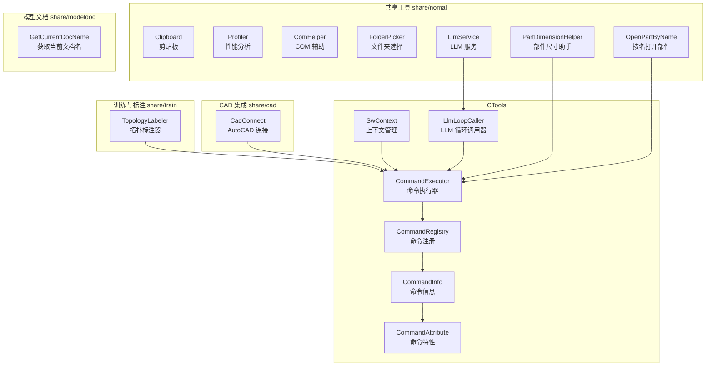

**图表来源**
- [Clipboard.cs:1-59](file://share/nomal/Clipboard.cs#L1-L59)
- [Profiler.cs:1-27](file://share/nomal/Profiler.cs#L1-L27)
- [comhelp.cs:1-59](file://share/nomal/comhelp.cs#L1-L59)
- [get_folder_file.cs:1-212](file://share/nomal/get_folder_file.cs#L1-L212)
- [llm_service.cs:1-800](file://share/nomal/llm_service.cs#L1-L800)
- [part_dimension_helper.cs:1-113](file://share/nomal/part_dimension_helper.cs#L1-L113)
- [open_part_by_name.cs:1-33](file://share/nomal/open_part_by_name.cs#L1-L33)
- [SwContext.cs:1-87](file://ctools/SwContext.cs#L1-L87)
- [llm_loop_caller.cs:1-800](file://ctools/llm_loop_caller.cs#L1-L800)
- [connect.cs:1-200](file://share/cad/connect.cs#L1-L200)
- [get_current_doc_name.cs:1-25](file://share/modeldoc/get_current_doc_name.cs#L1-L25)
- [command_executor.cs:1-116](file://ctools/command_executor.cs#L1-L116)
- [CommandRegistry.cs:1-242](file://ctools/CommandRegistry.cs#L1-L242)
- [CommandInfo.cs:1-41](file://ctools/CommandInfo.cs#L1-L41)
- [CommandAttribute.cs:1-20](file://ctools/CommandAttribute.cs#L1-L20)
- [topology_labeler.cs:1-680](file://share/train/topology_labeler.cs#L1-L680)

**章节来源**
- [Clipboard.cs:1-59](file://share/nomal/Clipboard.cs#L1-L59)
- [llm_service.cs:1-800](file://share/nomal/llm_service.cs#L1-L800)
- [llm_loop_caller.cs:1-800](file://ctools/llm_loop_caller.cs#L1-L800)
- [CommandRegistry.cs:1-242](file://ctools/CommandRegistry.cs#L1-L242)

## 核心组件
本节概述各工具模块的核心职责与典型用法。

- 剪贴板操作（NativeClipboard）
  - 功能：将文本写入系统剪贴板（Unicode），封装 Win32 API。
  - 典型用途：自动化复制、跨应用数据交换。
  - 注意事项：需正确释放全局内存与关闭剪贴板句柄。

- 性能分析（Profiler）
  - 功能：对 Action/Func 进行计时，输出毫秒级耗时。
  - 典型用途：基准测试、热点定位、性能回归监控。

- COM 组件辅助（ComHelper）
  - 功能：通过 ProgID/CLSID 获取正在运行的 COM 对象；兼容 .NET Core 的 GetActiveObject 替代方案。
  - 典型用途：与第三方软件（如 AutoCAD、Excel）交互。

- 文件系统操作（FolderPicker）
  - 功能：现代 Windows 文件对话框选择文件夹；失败时回退到传统对话框；提供获取文件名列表。
  - 典型用途：批量处理、配置选择、工作目录定位。

- LLM 服务（LlmService）
  - 功能：对接 DashScope；支持文本对话与图像理解；内置短期记忆、长期日志、工作知识注入；支持工具调用模式。
  - 典型用途：智能问答、命令检索、流程编排。

- LLM 循环调用器（LlmLoopCaller）
  - 功能：交互式循环模式；命令模糊匹配；工具调用执行；输出捕获与历史管理。
  - 典型用途：人机协作、命令执行、调试与反馈闭环。

- SolidWorks 上下文（SwContext）
  - 功能：单例模式的全局上下文，持有 SldWorks 与当前 ModelDoc。
  - 典型用途：跨模块共享应用实例与当前文档。

- 命令注册与执行（CommandRegistry/CommandInfo/CommandAttribute/CommandExecutor）
  - 功能：通过特性注册命令；批量反射注册；命令解析与执行；异步/同步支持。
  - 典型用途：插件化命令体系、动态命令发现与执行。

- AutoCAD 连接（CadConnect）
  - 功能：自动检测并连接已安装的 AutoCAD 版本；缓存实例；回退至通用 ProgID。
  - 典型用途：多版本 AutoCAD 兼容、实例生命周期管理。

- 部件尺寸助手（PartDimensionHelper）
  - 功能：获取部件边界框尺寸（长宽高），单位转换为毫米；按名称查找并获取尺寸。
  - 典型用途：尺寸校验、报告生成、自动化装配。

- 按名打开部件（open_part_by_name）
  - 功能：通过文件路径打开 SolidWorks 零件文档。
  - 典型用途：批量处理、自动化脚本。

- 拓扑标注器（TopologyLabeler）
  - 功能：构建拓扑图、执行 WL 迭代、标注管理、数据库持久化、批量处理、相似标注检索。
  - 典型用途：训练数据标注、相似特征检索、知识库构建。

**章节来源**
- [Clipboard.cs:1-59](file://share/nomal/Clipboard.cs#L1-L59)
- [Profiler.cs:1-27](file://share/nomal/Profiler.cs#L1-L27)
- [comhelp.cs:1-59](file://share/nomal/comhelp.cs#L1-L59)
- [get_folder_file.cs:1-212](file://share/nomal/get_folder_file.cs#L1-L212)
- [llm_service.cs:1-800](file://share/nomal/llm_service.cs#L1-L800)
- [llm_loop_caller.cs:1-800](file://ctools/llm_loop_caller.cs#L1-L800)
- [SwContext.cs:1-87](file://ctools/SwContext.cs#L1-L87)
- [CommandRegistry.cs:1-242](file://ctools/CommandRegistry.cs#L1-L242)
- [CommandInfo.cs:1-41](file://ctools/CommandInfo.cs#L1-L41)
- [CommandAttribute.cs:1-20](file://ctools/CommandAttribute.cs#L1-L20)
- [command_executor.cs:1-116](file://ctools/command_executor.cs#L1-L116)
- [connect.cs:1-200](file://share/cad/connect.cs#L1-L200)
- [part_dimension_helper.cs:1-113](file://share/nomal/part_dimension_helper.cs#L1-L113)
- [open_part_by_name.cs:1-33](file://share/nomal/open_part_by_name.cs#L1-L33)
- [topology_labeler.cs:1-680](file://share/train/topology_labeler.cs#L1-L680)

## 架构总览
整体架构围绕“工具层 → 服务层 → 应用层”的分层设计：
- 工具层：Clipboard、Profiler、ComHelper、FolderPicker、PartDimensionHelper、open_part_by_name
- 服务层：LlmService、LlmLoopCaller、CadConnect、SwContext
- 应用层：CommandRegistry/CommandInfo/CommandAttribute/CommandExecutor、TopologyLabeler

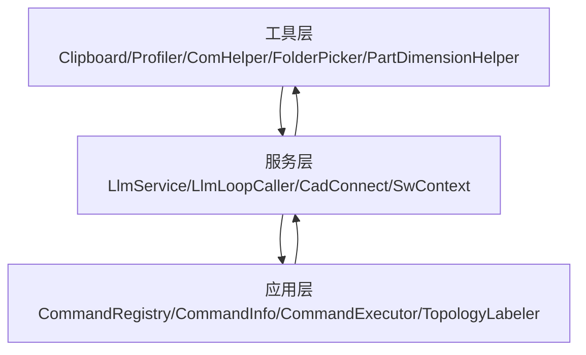

**图表来源**
- [llm_service.cs:1-800](file://share/nomal/llm_service.cs#L1-L800)
- [llm_loop_caller.cs:1-800](file://ctools/llm_loop_caller.cs#L1-L800)
- [SwContext.cs:1-87](file://ctools/SwContext.cs#L1-L87)
- [CommandRegistry.cs:1-242](file://ctools/CommandRegistry.cs#L1-L242)
- [CommandInfo.cs:1-41](file://ctools/CommandInfo.cs#L1-L41)
- [CommandAttribute.cs:1-20](file://ctools/CommandAttribute.cs#L1-L20)
- [command_executor.cs:1-116](file://ctools/command_executor.cs#L1-L116)
- [topology_labeler.cs:1-680](file://share/train/topology_labeler.cs#L1-L680)

## 详细组件分析

### 剪贴板操作（NativeClipboard）
- 设计要点
  - 使用 P/Invoke 调用 user32.dll 与 kernel32.dll，设置 Unicode 文本到剪贴板。
  - 采用全局内存分配与锁定，确保数据正确复制。
- 使用建议
  - 在多线程环境中注意剪贴板句柄释放顺序。
  - 对大文本建议分块处理，避免内存压力。

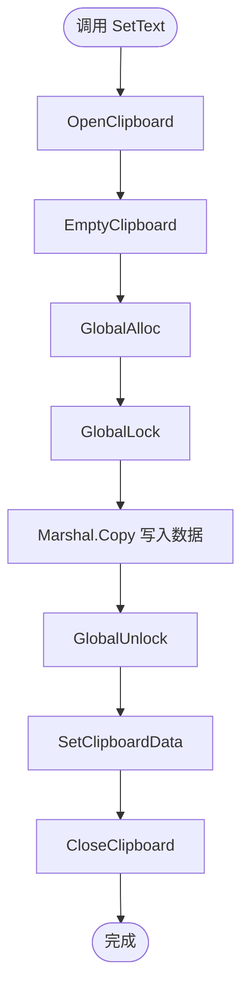

**图表来源**
- [Clipboard.cs:1-59](file://share/nomal/Clipboard.cs#L1-L59)

**章节来源**
- [Clipboard.cs:1-59](file://share/nomal/Clipboard.cs#L1-L59)

### 性能分析（Profiler）
- 设计要点
  - 重载 Time 方法分别适配 Action 与 Func<T>。
  - 使用高精度计时器输出毫秒级耗时。
- 使用建议
  - 将关键路径包裹在 Time 调用中，形成基线数据。
  - 结合日志系统输出，便于趋势分析。

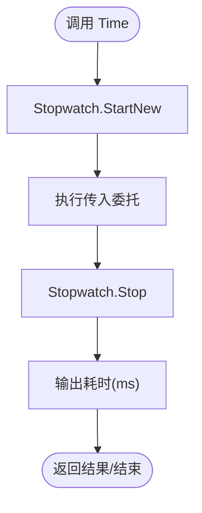

**图表来源**
- [Profiler.cs:1-27](file://share/nomal/Profiler.cs#L1-L27)

**章节来源**
- [Profiler.cs:1-27](file://share/nomal/Profiler.cs#L1-L27)

### COM 组件辅助（ComHelper）
- 设计要点
  - 兼容 .NET Core 的 GetActiveObject 替代方案，优先使用 CLSIDFromProgIDEx，失败回退 CLSIDFromProgID。
  - 通过 P/Invoke 调用 ole32.dll 与 oleaut32.dll。
- 使用建议
  - ProgID 必须正确注册；失败时检查 COM 组件安装与权限。
  - 对异常进行分类处理，区分“未找到对象”与“权限问题”。

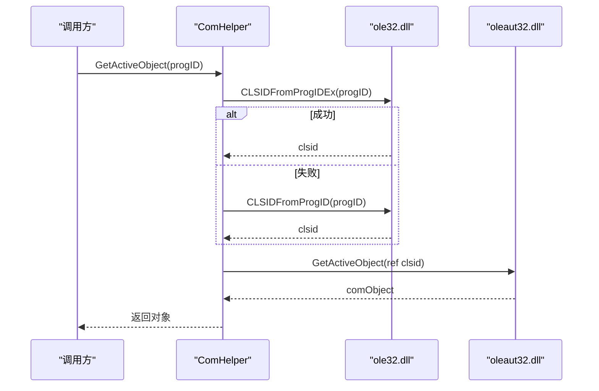

**图表来源**
- [comhelp.cs:1-59](file://share/nomal/comhelp.cs#L1-L59)

**章节来源**
- [comhelp.cs:1-59](file://share/nomal/comhelp.cs#L1-L59)

### 文件系统操作（FolderPicker）
- 设计要点
  - 优先使用现代 IFileDialog 接口；失败回退到 WinForms FolderBrowserDialog。
  - 支持仅选择文件夹、文件名列表获取。
- 使用建议
  - 在无 UI 环境下谨慎使用回退对话框。
  - 对返回路径进行存在性与权限检查。

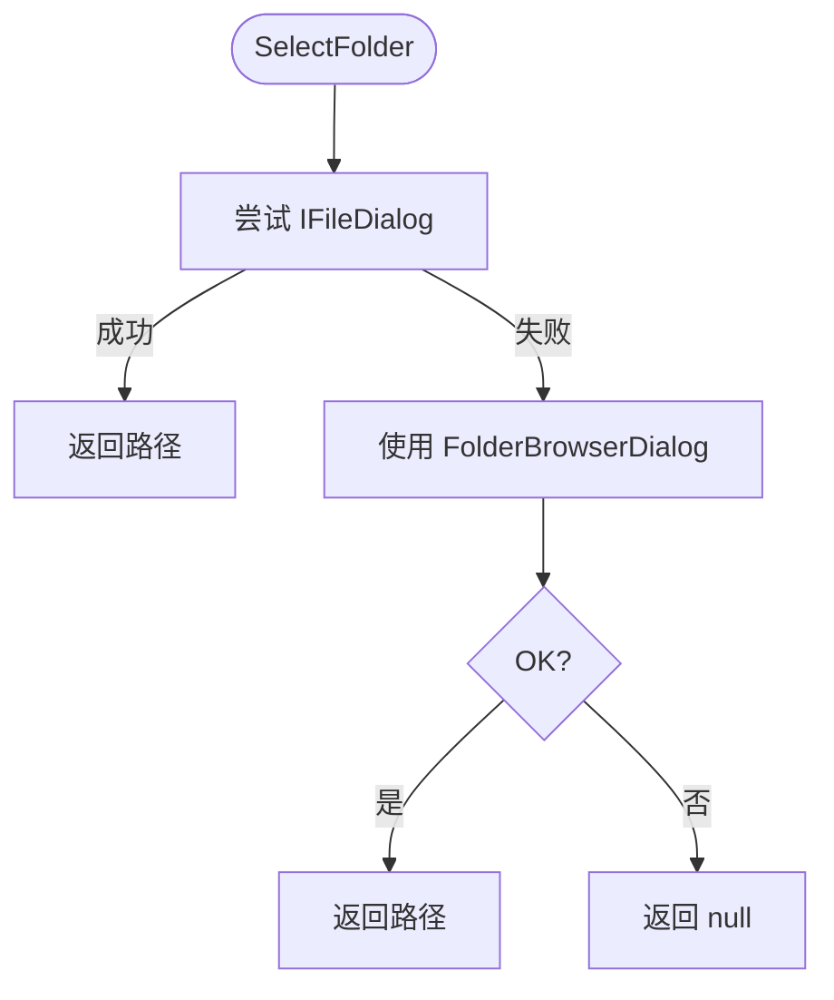

**图表来源**
- [get_folder_file.cs:1-212](file://share/nomal/get_folder_file.cs#L1-L212)

**章节来源**
- [get_folder_file.cs:1-212](file://share/nomal/get_folder_file.cs#L1-L212)

### LLM 服务（LlmService）
- 设计要点
  - 对接 DashScope；支持文本与图像（VLM）对话。
  - 短期记忆（JSON）、长期日志（文本）、工作知识（文本）三者协同。
  - 工具调用模式：先检索相关命令，再过滤工具列表，强制工具调用。
- 使用建议
  - 通过环境变量设置 API Key；未设置时支持交互式输入。
  - 控制短期记忆条目数量，避免上下文膨胀。
  - 对网络异常进行分级处理（超时、HTTP 错误）。

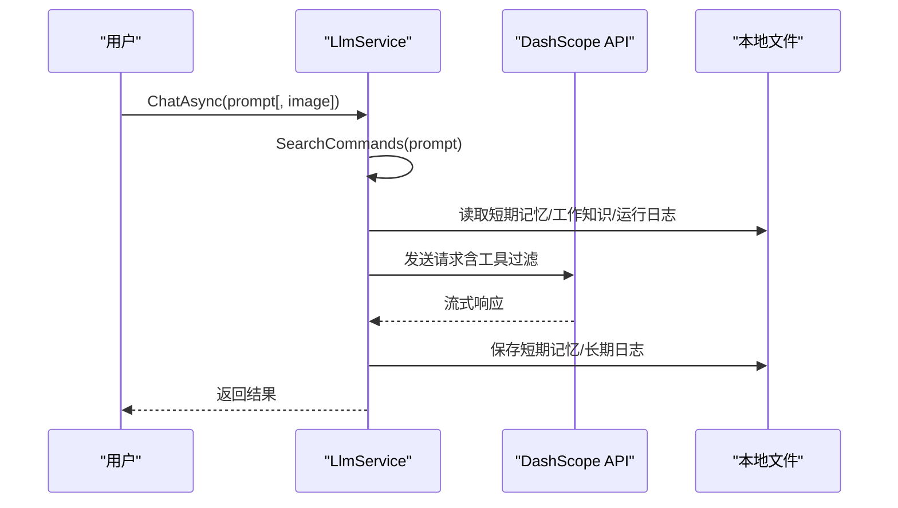

**图表来源**
- [llm_service.cs:1-800](file://share/nomal/llm_service.cs#L1-L800)

**章节来源**
- [llm_service.cs:1-800](file://share/nomal/llm_service.cs#L1-L800)

### LLM 循环调用器（LlmLoopCaller）
- 设计要点
  - 交互式循环模式；命令模糊匹配；工具调用执行；输出捕获与历史管理。
  - 支持特殊命令（退出、清空、模式切换、历史、重复上次命令）。
- 使用建议
  - 在确认模式下逐步验证命令，降低风险。
  - 对工具调用结果进行短期记忆保存，增强上下文连贯性。

```mermaid
sequenceDiagram
participant User as "用户"
participant Loop as "LlmLoopCaller"
participant Reg as "CommandRegistry"
participant Exec as "CommandExecutor"
participant LLM as "LlmService"
User->>Loop : 输入问题/命令
alt 直接命令
Loop->>Exec : ExecuteCommandAsync(fullCommand)
Exec-->>Loop : 执行结果
else 模糊/工具调用
Loop->>LLM : ChatWithToolsAsync(input, tools)
LLM-->>Loop : (response, toolCalls)
loop 遍历工具调用
Loop->>Exec : ExecuteToolCallAsync(toolCall)
Exec-->>Loop : (result, capturedOutput)
end
end
Loop-->>User : 输出结果/提示
```

**图表来源**
- [llm_loop_caller.cs:1-800](file://ctools/llm_loop_caller.cs#L1-L800)
- [CommandRegistry.cs:1-242](file://ctools/CommandRegistry.cs#L1-L242)
- [command_executor.cs:1-116](file://ctools/command_executor.cs#L1-L116)
- [llm_service.cs:1-800](file://share/nomal/llm_service.cs#L1-L800)

**章节来源**
- [llm_loop_caller.cs:1-800](file://ctools/llm_loop_caller.cs#L1-L800)
- [CommandRegistry.cs:1-242](file://ctools/CommandRegistry.cs#L1-L242)
- [command_executor.cs:1-116](file://ctools/command_executor.cs#L1-L116)

### SolidWorks 上下文（SwContext）
- 设计要点
  - 单例模式，线程安全；持有 SldWorks 与当前 ModelDoc。
  - 提供初始化与清理方法。
- 使用建议
  - 在插件入口初始化上下文；在退出时清理，避免资源泄漏。

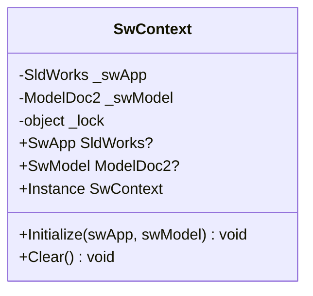

**图表来源**
- [SwContext.cs:1-87](file://ctools/SwContext.cs#L1-L87)

**章节来源**
- [SwContext.cs:1-87](file://ctools/SwContext.cs#L1-L87)

### 命令注册与执行（CommandRegistry/CommandInfo/CommandAttribute/CommandExecutor）
- 设计要点
  - 通过特性标记命令；支持静态与实例方法；批量反射注册；命令信息包含名称、描述、参数、分组、别名、异步/同步类型。
  - CommandExecutor 负责解析命令、检查 SolidWorks 连接、更新当前模型、执行异步动作。
- 使用建议
  - 命令名称与别名保持唯一性；异步命令需正确 await。
  - 对反射异常进行捕获与日志记录。

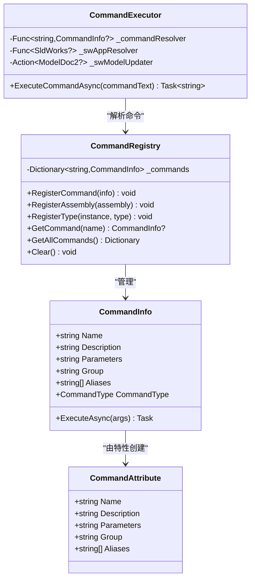

**图表来源**
- [CommandAttribute.cs:1-20](file://ctools/CommandAttribute.cs#L1-L20)
- [CommandInfo.cs:1-41](file://ctools/CommandInfo.cs#L1-L41)
- [CommandRegistry.cs:1-242](file://ctools/CommandRegistry.cs#L1-L242)
- [command_executor.cs:1-116](file://ctools/command_executor.cs#L1-L116)

**章节来源**
- [CommandAttribute.cs:1-20](file://ctools/CommandAttribute.cs#L1-L20)
- [CommandInfo.cs:1-41](file://ctools/CommandInfo.cs#L1-L41)
- [CommandRegistry.cs:1-242](file://ctools/CommandRegistry.cs#L1-L242)
- [command_executor.cs:1-116](file://ctools/command_executor.cs#L1-L116)

### AutoCAD 连接（CadConnect）
- 设计要点
  - 自动检测已安装版本；优先连接运行实例；失败则创建新实例；支持通用 ProgID 回退。
  - 缓存实例，减少重复创建成本。
- 使用建议
  - 在启动时预热连接；对异常进行分级处理（COMException 与创建异常）。

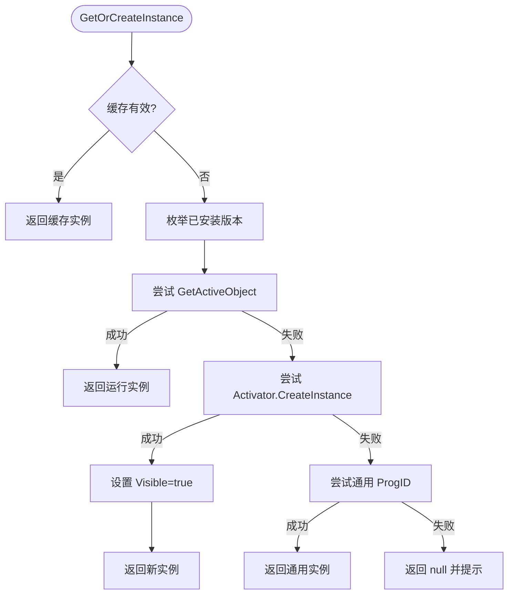

**图表来源**
- [connect.cs:1-200](file://share/cad/connect.cs#L1-L200)

**章节来源**
- [connect.cs:1-200](file://share/cad/connect.cs#L1-L200)

### 部件尺寸助手（PartDimensionHelper）
- 设计要点
  - 通过 SolidWorks PartDoc.GetPartBox 获取边界框，计算长宽高并转换为毫米。
  - 支持按名称查找并获取尺寸。
- 使用建议
  - 确保传入的文档非空且类型正确；对异常进行捕获与日志。

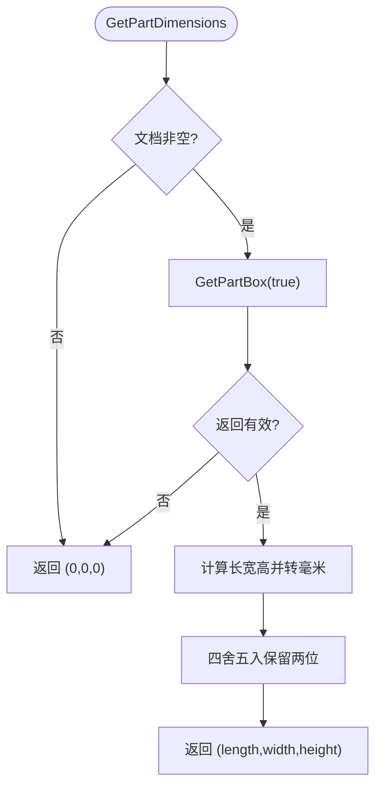

**图表来源**
- [part_dimension_helper.cs:1-113](file://share/nomal/part_dimension_helper.cs#L1-L113)

**章节来源**
- [part_dimension_helper.cs:1-113](file://share/nomal/part_dimension_helper.cs#L1-L113)

### 按名打开部件（open_part_by_name）
- 设计要点
  - 通过 SolidWorks 打开指定路径的 .sldprt 文档。
- 使用建议
  - 路径有效性检查；异常时输出错误信息。

**章节来源**
- [open_part_by_name.cs:1-33](file://share/nomal/open_part_by_name.cs#L1-L33)

### 拓扑标注器（TopologyLabeler）
- 设计要点
  - 构建拓扑图、执行 WL 迭代、标注管理、数据库持久化、批量处理、相似标注检索。
- 使用建议
  - 初始化数据库路径；批量处理时注意关闭文档；定期导出 WL 结果用于分析。

**章节来源**
- [topology_labeler.cs:1-680](file://share/train/topology_labeler.cs#L1-L680)

## 依赖关系分析
- 组件耦合
  - LlmLoopCaller 依赖 LlmService 与 CommandExecutor；CommandExecutor 依赖 CommandRegistry。
  - SwContext 为全局上下文，被 CommandExecutor 等模块共享。
  - CadConnect 与 ComHelper 协作，实现 AutoCAD 连接。
- 外部依赖
  - LLM 服务依赖 DashScope API；文件系统依赖 Windows 对话框与 COM 组件。
- 循环依赖
  - 通过接口与委托解耦，避免直接循环引用。

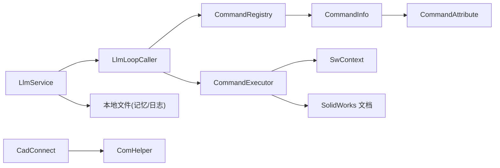

**图表来源**
- [llm_loop_caller.cs:1-800](file://ctools/llm_loop_caller.cs#L1-L800)
- [llm_service.cs:1-800](file://share/nomal/llm_service.cs#L1-L800)
- [CommandRegistry.cs:1-242](file://ctools/CommandRegistry.cs#L1-L242)
- [CommandInfo.cs:1-41](file://ctools/CommandInfo.cs#L1-L41)
- [CommandAttribute.cs:1-20](file://ctools/CommandAttribute.cs#L1-L20)
- [command_executor.cs:1-116](file://ctools/command_executor.cs#L1-L116)
- [SwContext.cs:1-87](file://ctools/SwContext.cs#L1-L87)
- [connect.cs:1-200](file://share/cad/connect.cs#L1-L200)
- [comhelp.cs:1-59](file://share/nomal/comhelp.cs#L1-L59)

**章节来源**
- [llm_loop_caller.cs:1-800](file://ctools/llm_loop_caller.cs#L1-L800)
- [llm_service.cs:1-800](file://share/nomal/llm_service.cs#L1-L800)
- [CommandRegistry.cs:1-242](file://ctools/CommandRegistry.cs#L1-L242)
- [command_executor.cs:1-116](file://ctools/command_executor.cs#L1-L116)
- [SwContext.cs:1-87](file://ctools/SwContext.cs#L1-L87)
- [connect.cs:1-200](file://share/cad/connect.cs#L1-L200)
- [comhelp.cs:1-59](file://share/nomal/comhelp.cs#L1-L59)

## 性能考虑
- 计时与基准
  - 使用 Profiler 对关键路径进行计时，建立性能基线；结合日志系统进行趋势分析。
- LLM 调用
  - 控制短期记忆条目数量，避免上下文过长导致延迟增加；合理设置工具过滤阈值。
  - 对网络异常进行分级处理，避免阻塞主线程。
- 文件与对话框
  - FolderPicker 在无 UI 环境下回退到传统对话框，注意性能差异；对大目录建议分批处理。
- COM 连接
  - CadConnect 缓存实例，减少重复创建；对异常进行快速失败与回退策略。

[本节为通用指导，无需列出具体文件来源]

## 故障排除指南
- 剪贴板写入失败
  - 检查 OpenClipboard/CloseClipboard 调用配对；确保 GlobalAlloc/GlobalLock 成功。
  - 参考：[Clipboard.cs:1-59](file://share/nomal/Clipboard.cs#L1-L59)

- LLM 调用异常
  - 检查 API Key 环境变量；关注 HTTP 状态码与超时；查看本地日志与短期记忆文件。
  - 参考：[llm_service.cs:1-800](file://share/nomal/llm_service.cs#L1-L800)

- 命令执行失败
  - 确认 SolidWorks 已连接；检查命令名称与别名；查看 CommandExecutor 日志。
  - 参考：[command_executor.cs:1-116](file://ctools/command_executor.cs#L1-L116)

- COM 对象获取失败
  - 检查 ProgID 是否正确；尝试回退到通用 ProgID；确认 COM 组件已注册。
  - 参考：[comhelp.cs:1-59](file://share/nomal/comhelp.cs#L1-L59)、[connect.cs:1-200](file://share/cad/connect.cs#L1-L200)

- 文件夹选择无响应
  - 现代对话框失败时回退到传统对话框；检查权限与路径有效性。
  - 参考：[get_folder_file.cs:1-212](file://share/nomal/get_folder_file.cs#L1-L212)

**章节来源**
- [Clipboard.cs:1-59](file://share/nomal/Clipboard.cs#L1-L59)
- [llm_service.cs:1-800](file://share/nomal/llm_service.cs#L1-L800)
- [command_executor.cs:1-116](file://ctools/command_executor.cs#L1-L116)
- [comhelp.cs:1-59](file://share/nomal/comhelp.cs#L1-L59)
- [connect.cs:1-200](file://share/cad/connect.cs#L1-L200)
- [get_folder_file.cs:1-212](file://share/nomal/get_folder_file.cs#L1-L212)

## 结论
本工具与实用程序模块为大型工程提供了：
- 稳健的基础能力：剪贴板、性能分析、COM 辅助、文件系统交互
- 智能化服务：LLM 对话与工具调用、循环交互与历史管理
- CAD 生态集成：SolidWorks 与 AutoCAD 的上下文与命令体系
- 工业级实用功能：部件尺寸助手、拓扑标注与数据库

通过遵循最佳实践与故障排除指南，开发者可在保证稳定性的同时显著提升开发效率与系统可靠性。

[本节为总结性内容，无需列出具体文件来源]

## 附录
- 最佳实践清单
  - 使用 Profiler 对关键路径进行持续监控
  - 合理设置 LLM 工具过滤阈值，避免过度召回
  - 命令注册使用特性化声明，统一管理命令信息
  - COM 连接缓存与回退策略，提升鲁棒性
  - 文件夹选择与路径检查，避免 UI 阻塞
  - 拓扑标注器定期导出 WL 结果，沉淀知识库

[本节为通用指导，无需列出具体文件来源]