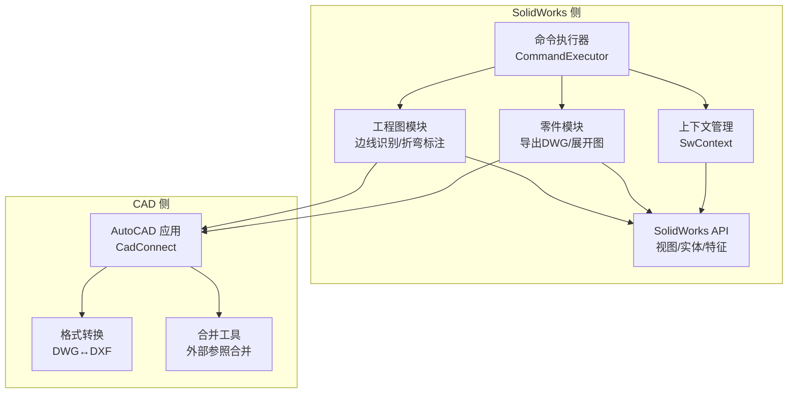
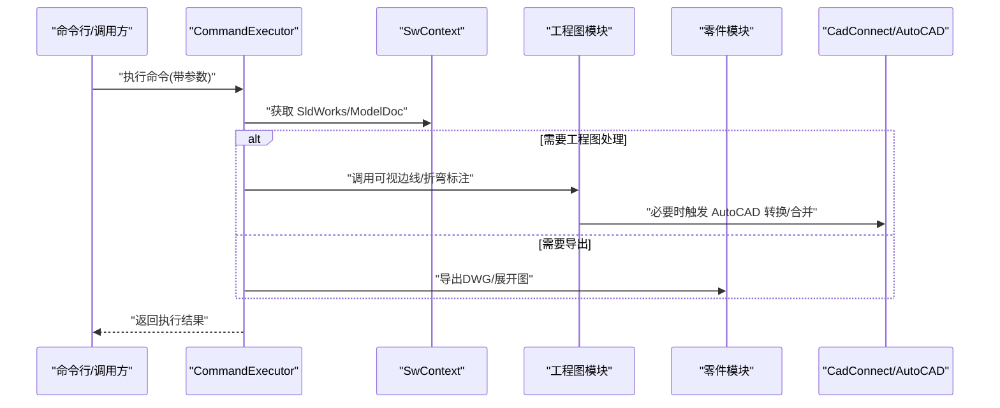
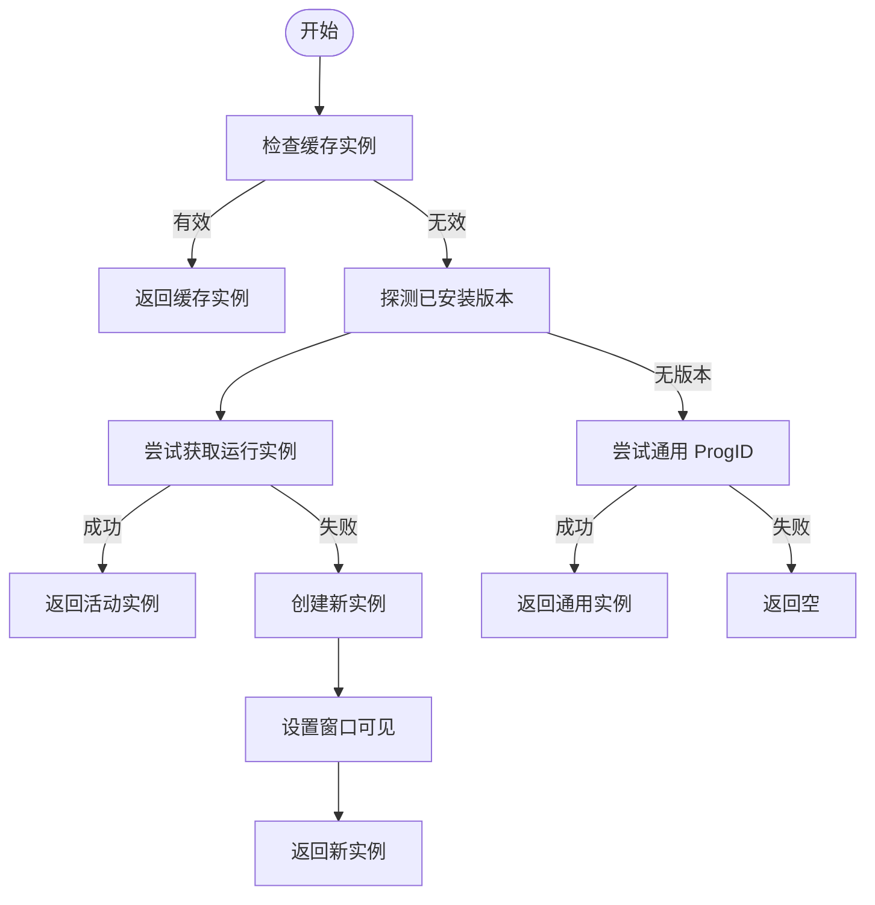
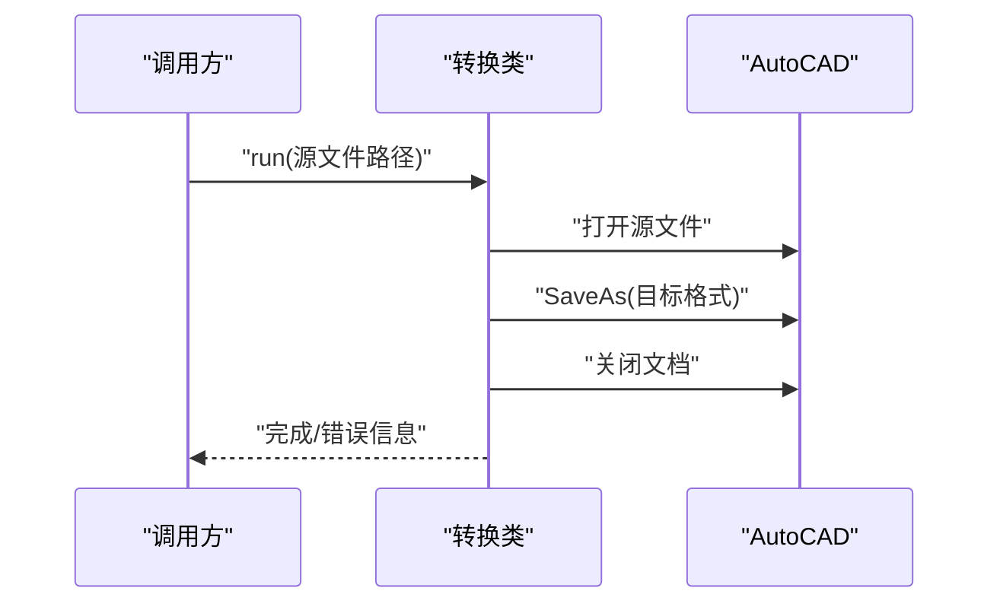
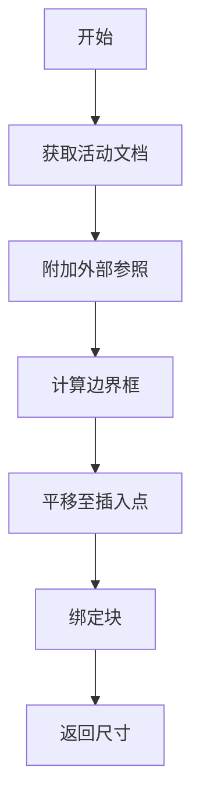
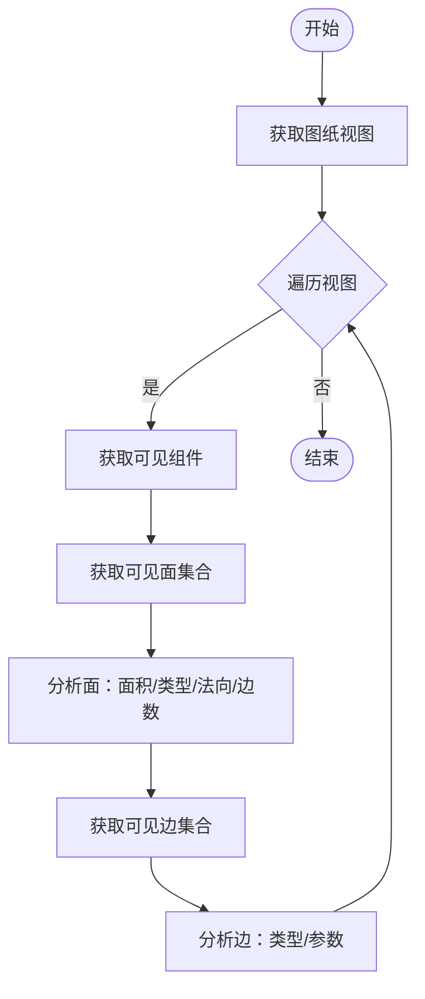
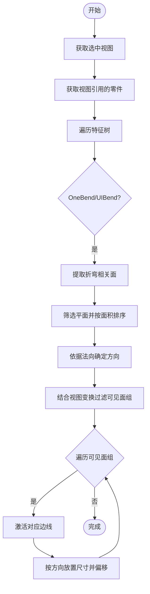
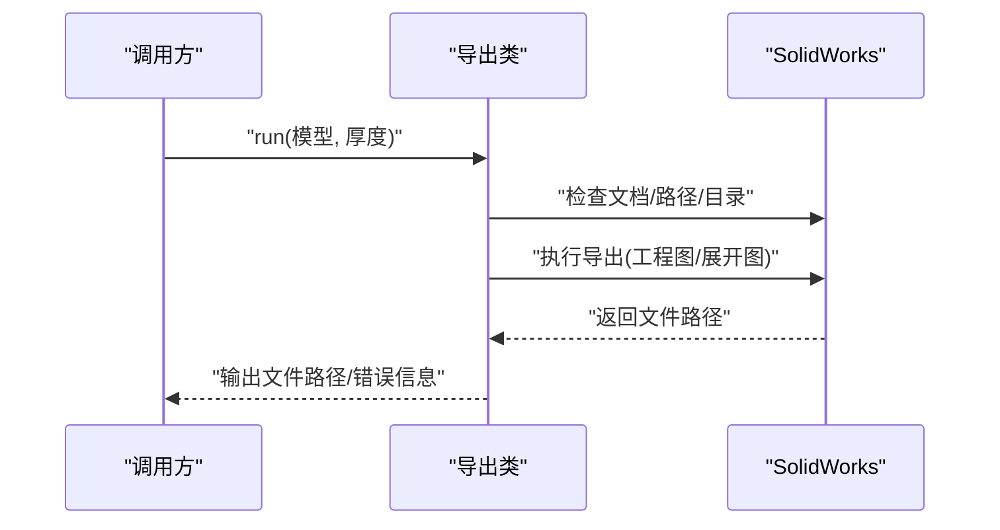
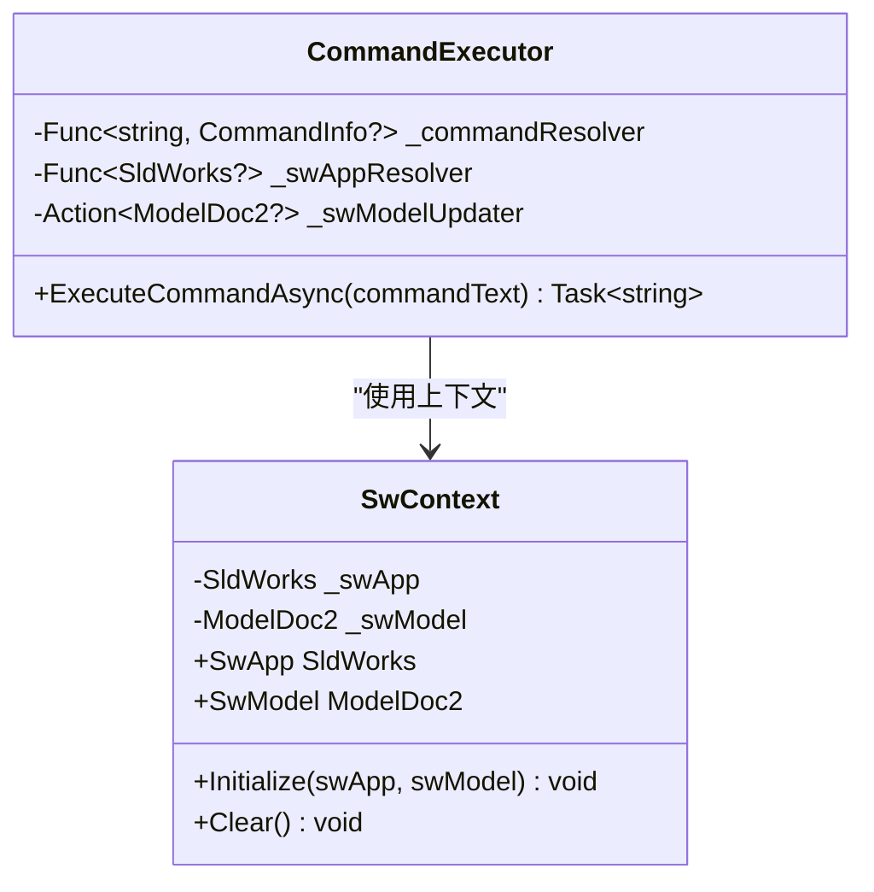
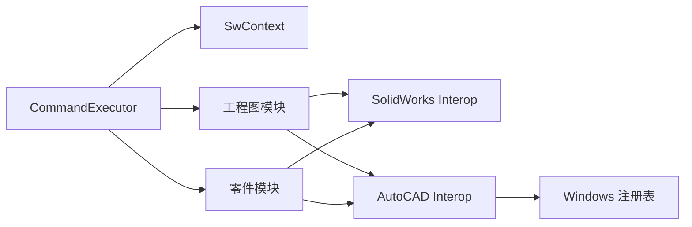

# 工程图处理模块

<cite>
**本文引用的文件**
- [dwg2dxf.cs](file://share/cad/dwg2dxf.cs)
- [dxf2dwg.cs](file://share/cad/dxf2dwg.cs)
- [benddim.cs](file://share/drw/benddim.cs)
- [get_all_visable_edge.cs](file://share/drw/get_all_visable_edge.cs)
- [select_face_recognize.cs](file://share/drw/select_face_recognize.cs)
- [exportdwg.cs](file://share/part/exportdwg.cs)
- [exportdxf_flatview.cs](file://share/part/exportdxf_flatview.cs)
- [connect.cs](file://share/cad/connect.cs)
- [folder2merge.cs](file://share/cad/folder2merge.cs)
- [merge_dwg.cs](file://share/cad/merge_dwg.cs)
- [part_dimension_helper.cs](file://share/nomal/part_dimension_helper.cs)
- [SwContext.cs](file://ctools/SwContext.cs)
- [command_executor.cs](file://ctools/command_executor.cs)
</cite>

## 目录
1. [简介](#简介)
2. [项目结构](#项目结构)
3. [核心组件](#核心组件)
4. [架构总览](#架构总览)
5. [详细组件分析](#详细组件分析)
6. [依赖关系分析](#依赖关系分析)
7. [性能考虑](#性能考虑)
8. [故障排查指南](#故障排查指南)
9. [结论](#结论)
10. [附录](#附录)

## 简介
本技术文档面向工程图处理模块，系统梳理并解释以下能力与实现：
- 格式转换：DWG↔DXF 的双向转换与合并
- 边线识别与可视边线提取：基于 SolidWorks 视图实体的可见边/面识别
- 折弯标注：针对钣金折弯特征的尺寸标注自动化
- 图像导出：二维工程图与展开图的导出策略与质量控制
- 批处理与自动化：命令执行器与上下文管理，支持批量任务编排
- 数据结构与几何处理：SolidWorks 与 AutoCAD 交互的数据流与几何算法要点
- 兼容性与版本处理：AutoCAD 多版本连接与回退策略

## 项目结构
工程图处理模块由两部分组成：
- CAD 侧（AutoCAD）：负责 DWG/DXF 格式转换与外部参照合并
- SolidWorks 侧（SolidWorks）：负责工程图视图、可见实体、折弯标注与导出

图表来源
- [connect.cs:11-200](file://share/cad/connect.cs#L11-L200)
- [merge_dwg.cs:8-94](file://share/cad/merge_dwg.cs#L8-L94)
- [SwContext.cs:9-87](file://ctools/SwContext.cs#L9-L87)
- [command_executor.cs:12-116](file://ctools/command_executor.cs#L12-L116)

章节来源
- [connect.cs:11-200](file://share/cad/connect.cs#L11-L200)
- [merge_dwg.cs:8-94](file://share/cad/merge_dwg.cs#L8-L94)
- [SwContext.cs:9-87](file://ctools/SwContext.cs#L9-L87)
- [command_executor.cs:12-116](file://ctools/command_executor.cs#L12-L116)

## 核心组件
- AutoCAD 连接与多版本兼容：CadConnect 提供 AutoCAD 实例获取、缓存与版本探测
- 格式转换：dwg2dxf、dxf2dwg 封装 AutoCAD 的 SaveAs 以实现 DWG↔DXF 转换
- 合并工具：merge_dwg 使用外部参照 AttachExternalReference 并移动边界框，实现多图合并
- 可视边线与面识别：get_all_visable_edge 与 select_face_recognize 分别用于批量扫描与交互式分析
- 折弯标注：benddim 基于特征树 OneBend/UIBend 提取折弯面组并进行尺寸标注
- 导出工具：exportdwg 与 exportdxf_flatview 分别导出工程图与展开图
- 上下文与命令执行：SwContext 单例持有 SldWorks 与 ModelDoc；CommandExecutor 解析并执行命令

章节来源
- [connect.cs:11-200](file://share/cad/connect.cs#L11-L200)
- [dwg2dxf.cs:5-40](file://share/cad/dwg2dxf.cs#L5-L40)
- [dxf2dwg.cs:5-40](file://share/cad/dxf2dwg.cs#L5-L40)
- [merge_dwg.cs:8-94](file://share/cad/merge_dwg.cs#L8-L94)
- [get_all_visable_edge.cs:12-176](file://share/drw/get_all_visable_edge.cs#L12-L176)
- [select_face_recognize.cs:9-188](file://share/drw/select_face_recognize.cs#L9-L188)
- [benddim.cs:11-321](file://share/drw/benddim.cs#L11-L321)
- [exportdwg.cs:9-81](file://share/part/exportdwg.cs#L9-L81)
- [exportdxf_flatview.cs:9-68](file://share/part/exportdxf_flatview.cs#L9-L68)
- [SwContext.cs:9-87](file://ctools/SwContext.cs#L9-L87)
- [command_executor.cs:12-116](file://ctools/command_executor.cs#L12-L116)

## 架构总览
整体采用“命令驱动 + 上下文共享”的架构：
- CommandExecutor 负责解析命令、注入上下文、调用具体处理模块
- SwContext 提供全局 SldWorks 与 ModelDoc 引用，避免重复查询
- SolidWorks 侧模块通过 COM 接口与 SolidWorks 交互
- CAD 侧模块通过 CadConnect 与 AutoCAD 交互，支持多版本 AutoCAD

图表来源
- [command_executor.cs:32-113](file://ctools/command_executor.cs#L32-L113)
- [SwContext.cs:29-84](file://ctools/SwContext.cs#L29-L84)
- [get_all_visable_edge.cs:14-56](file://share/drw/get_all_visable_edge.cs#L14-L56)
- [benddim.cs:16-94](file://share/drw/benddim.cs#L16-L94)
- [exportdwg.cs:12-81](file://share/part/exportdwg.cs#L12-L81)
- [connect.cs:19-125](file://share/cad/connect.cs#L19-L125)

## 详细组件分析

### AutoCAD 连接与多版本兼容（CadConnect）
- 功能要点
  - 缓存已连接实例，避免重复创建
  - 自动探测已安装的 AutoCAD 版本并按优先级尝试连接
  - 支持获取运行中实例与创建新实例，确保窗口可见
  - 注册表读取版本信息，构建 ProgID
- 兼容性处理
  - 失败回退至通用 ProgID
  - 对异常进行分类记录，便于诊断
- 性能与稳定性
  - 缓存提升后续调用速度
  - 显式设置 Visible=true，减少交互阻塞

图表来源
- [connect.cs:19-125](file://share/cad/connect.cs#L19-L125)

章节来源
- [connect.cs:11-200](file://share/cad/connect.cs#L11-L200)

### 格式转换（DWG↔DXF）
- 功能要点
  - dwg2dxf：打开 DWG 并另存为 DXF
  - dxf2dwg：打开 DXF 并另存为 DWG
  - 自动判断目标路径并避免覆盖
- 错误处理
  - 捕获异常并输出错误信息
  - 未连接到 AutoCAD 时提前返回

图表来源
- [dwg2dxf.cs:7-32](file://share/cad/dwg2dxf.cs#L7-L32)
- [dxf2dwg.cs:7-32](file://share/cad/dxf2dwg.cs#L7-L32)

章节来源
- [dwg2dxf.cs:5-40](file://share/cad/dwg2dxf.cs#L5-L40)
- [dxf2dwg.cs:5-40](file://share/cad/dxf2dwg.cs#L5-L40)

### 合并工具（外部参照合并）
- 功能要点
  - 在当前文档中附加外部 DWG 参照
  - 计算边界框，平移至指定插入点
  - 绑定块以固化合并结果
- 输入输出
  - 输入：源文件路径、插入点坐标、是否标注维度
  - 输出：合并后的相对尺寸 [maxX, maxY]

图表来源
- [merge_dwg.cs:17-92](file://share/cad/merge_dwg.cs#L17-L92)

章节来源
- [merge_dwg.cs:8-94](file://share/cad/merge_dwg.cs#L8-L94)

### 可视边线与面识别
- get_all_visable_edge
  - 遍历图纸上的视图，获取可见组件与实体
  - 输出可见面的面积与类型（平面/圆柱/圆锥/球面等）
  - 输出可见边的类型（直线/圆/椭圆等）
- select_face_recognize
  - 交互式分析选中面：面积、类型、法向、边数
  - 若选中边则反求相邻面并逐个分析
  - 对圆柱/圆锥面输出半径/半角等参数

图表来源
- [get_all_visable_edge.cs:14-176](file://share/drw/get_all_visable_edge.cs#L14-L176)

章节来源
- [get_all_visable_edge.cs:12-176](file://share/drw/get_all_visable_edge.cs#L12-L176)
- [select_face_recognize.cs:14-188](file://share/drw/select_face_recognize.cs#L14-L188)

### 折弯标注（benddim）
- 功能要点
  - 从特征树提取 OneBend/UIBend 特征，得到折弯面组
  - 依据面法向确定折弯方向（x/y/z），结合视图变换筛选可见面组
  - 激活对应边线，按水平/竖直方向放置尺寸并递增偏移
- 几何处理
  - 面法向主分量判断方向
  - 视图变换矩阵映射到屏幕方向
  - 通过射线选择器定位边线中心点进行尺寸标注

图表来源
- [benddim.cs:16-94](file://share/drw/benddim.cs#L16-L94)
- [benddim.cs:99-142](file://share/drw/benddim.cs#L99-L142)
- [benddim.cs:208-241](file://share/drw/benddim.cs#L208-L241)
- [benddim.cs:246-318](file://share/drw/benddim.cs#L246-L318)

章节来源
- [benddim.cs:11-321](file://share/drw/benddim.cs#L11-L321)

### 导出工具（工程图与展开图）
- exportdwg
  - 钣金导出：调用 ExportToDWG，按材料厚度组织输出目录
  - 参数：装配/展开选项、对齐矩阵、导出选项
- exportdxf_flatview
  - 展开图导出：ExportFlatPatternView，输出下料用 DWG/DXF
  - 输出目录按厚度组织

图表来源
- [exportdwg.cs:12-81](file://share/part/exportdwg.cs#L12-L81)
- [exportdxf_flatview.cs:12-68](file://share/part/exportdxf_flatview.cs#L12-L68)

章节来源
- [exportdwg.cs:9-81](file://share/part/exportdwg.cs#L9-L81)
- [exportdxf_flatview.cs:9-68](file://share/part/exportdxf_flatview.cs#L9-L68)

### 上下文与命令执行
- SwContext
  - 单例持有 SldWorks 与 ModelDoc，线程安全更新
- CommandExecutor
  - 解析命令文本，解析参数，校验 SolidWorks 连接
  - 每次执行前刷新当前激活模型，调用对应模块 AsyncAction

图表来源
- [SwContext.cs:9-87](file://ctools/SwContext.cs#L9-L87)
- [command_executor.cs:12-116](file://ctools/command_executor.cs#L12-L116)

章节来源
- [SwContext.cs:9-87](file://ctools/SwContext.cs#L9-L87)
- [command_executor.cs:12-116](file://ctools/command_executor.cs#L12-L116)

## 依赖关系分析
- 组件耦合
  - CommandExecutor 依赖 SwContext 与命令注册器，解耦具体业务模块
  - SolidWorks 侧模块直接依赖 SolidWorks Interop，间接依赖 SwContext
  - CAD 侧模块依赖 CadConnect，间接依赖 AutoCAD
- 外部依赖
  - SolidWorks Interop：用于模型/视图/特征/导出
  - AutoCAD Interop：用于格式转换与外部参照
  - Windows 注册表：用于 AutoCAD 版本探测

图表来源
- [command_executor.cs:14-26](file://ctools/command_executor.cs#L14-L26)
- [SwContext.cs:29-66](file://ctools/SwContext.cs#L29-L66)
- [connect.cs:138-198](file://share/cad/connect.cs#L138-L198)

章节来源
- [command_executor.cs:12-116](file://ctools/command_executor.cs#L12-L116)
- [SwContext.cs:9-87](file://ctools/SwContext.cs#L9-L87)
- [connect.cs:138-198](file://share/cad/connect.cs#L138-L198)

## 性能考虑
- AutoCAD 连接
  - 使用缓存实例减少创建成本
  - 仅在需要时创建新实例，避免频繁启动
- SolidWorks 导出
  - 批量导出时复用同一文档对象，减少 IO
  - 输出目录按厚度预创建，避免重复创建
- 可视边线扫描
  - 仅对可见组件与实体进行分析，避免全模型扫描
  - 对面按面积排序，优先处理显著面，提高标注效率

## 故障排查指南
- 未连接到 SolidWorks
  - 现象：命令执行返回“未连接到 SolidWorks”
  - 处理：确认 SolidWorks 已启动，CommandExecutor 会尝试通过 IActiveDoc2 获取模型
- AutoCAD 连接失败
  - 现象：无法连接或创建 AutoCAD 实例
  - 处理：检查已安装版本，确保注册表项正确；CadConnect 会尝试通用 ProgID
- 文件覆盖保护
  - 现象：目标文件已存在被跳过
  - 处理：修改目标路径或删除现有文件
- 折弯标注无结果
  - 现象：未找到折弯特征或无可见面组
  - 处理：确认视图方向与折弯特征类型（OneBend/UIBend），检查面法向与视图变换
- 可见边线为空
  - 现象：视图中无可见组件或实体
  - 处理：检查视图显示状态与消隐设置

章节来源
- [command_executor.cs:60-94](file://ctools/command_executor.cs#L60-L94)
- [connect.cs:39-125](file://share/cad/connect.cs#L39-L125)
- [dwg2dxf.cs:17-22](file://share/cad/dwg2dxf.cs#L17-L22)
- [benddim.cs:62-88](file://share/drw/benddim.cs#L62-L88)
- [get_all_visable_edge.cs:34-54](file://share/drw/get_all_visable_edge.cs#L34-L54)

## 结论
本工程图处理模块围绕 SolidWorks 与 AutoCAD 的协同，提供了从格式转换、可视边线提取、折弯标注到导出与合并的完整链路。通过 CommandExecutor 与 SwContext 的抽象，模块具备良好的可扩展性与可维护性。建议在实际部署中：
- 明确 AutoCAD 版本策略，确保 CadConnect 能稳定连接
- 在批处理场景中预创建输出目录，减少 IO 开销
- 对复杂视图与特征组合，先进行小样本验证再扩大规模

## 附录
- 批处理与自动化建议
  - 使用 CommandExecutor 统一入口，按需传入命令与参数
  - 将导出与合并流程封装为脚本，结合文件夹扫描实现自动化
- 图像导出与质量控制
  - DWG/DXF 导出：优先使用 ExportToDWG 与 ExportFlatPatternView，确保路径与目录规范
  - 合并：利用外部参照与边界框计算，保证拼接精度与尺寸一致性
- 兼容性建议
  - AutoCAD：优先使用较新版本，保留旧版本回退策略
  - SolidWorks：保持与导出接口一致的版本范围，避免参数差异导致失败