# 模型文档管理

<cite>
**本文引用的文件**
- [get_current_doc_name.cs](file://share/modeldoc/get_current_doc_name.cs)
- [close_current_doc.cs](file://share/modeldoc/close_current_doc.cs)
- [open_doc_folder.cs](file://share/modeldoc/open_doc_folder.cs)
- [open_doc.cs](file://share/cad/open_doc.cs)
- [close_doc.cs](file://share/cad/close_doc.cs)
- [connect.cs](file://share/cad/connect.cs)
- [open_doc_byshell.cs](file://share/cad/open_doc_byshell.cs)
- [comhelp.cs](file://share/nomal/comhelp.cs)
- [get_folder_file.cs](file://share/nomal/get_folder_file.cs)
- [get_thickness.cs](file://share/part/get_thickness.cs)
- [get_thickness_from_solidfolder.cs](file://share/part/get_thickness_from_solidfolder.cs)
- [get_all_body_names.cs](file://share/part/get_all_body_names.cs)
- [getall_typename.cs](file://share/part/getall_typename.cs)
- [exportdwg.cs](file://share/part/exportdwg.cs)
- [new_drw.cs](file://share/part/new_drw.cs)
</cite>

## 目录
1. [简介](#简介)
2. [项目结构](#项目结构)
3. [核心组件](#核心组件)
4. [架构总览](#架构总览)
5. [详细组件分析](#详细组件分析)
6. [依赖关系分析](#依赖关系分析)
7. [性能考虑](#性能考虑)
8. [故障排查指南](#故障排查指南)
9. [结论](#结论)
10. [附录](#附录)

## 简介
本文件面向 CAD 模型文档管理模块的技术文档，聚焦以下目标：
- 文档管理：包括文档名称获取、文档打开与关闭、文档所在文件夹打开等基础能力。
- 文档生命周期管理与状态跟踪：以 SolidWorks 与 AutoCAD 的文档对象为载体，结合异常处理与连接状态维护，形成可追踪的状态流。
- 文档路径管理与文件定位：提供路径解析、模板路径、导出路径等实用方法。
- 与 CAD 应用程序的集成与通信协议：基于 COM 互操作（Interop）实现跨进程通信，包含 AutoCAD 的实例发现与连接、SolidWorks 的文档对象模型调用。
- 性能优化与资源管理：通过连接缓存、最小化 UI 干扰、避免重复查询等策略提升稳定性与效率。

## 项目结构
本模块主要分布在以下子目录与文件中：
- share/modeldoc：模型文档基础操作（名称获取、关闭、打开所在文件夹）
- share/cad：AutoCAD 文档操作与连接工具
- share/part：SolidWorks 零件相关文档操作（导出 DWG、新建工程图等）
- share/nomal：通用工具（COM 辅助、文件夹选择器）

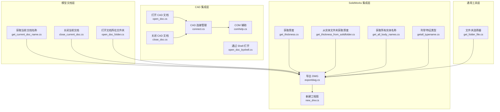

**图表来源**
- [get_current_doc_name.cs:1-25](file://share/modeldoc/get_current_doc_name.cs#L1-L25)
- [close_current_doc.cs:1-25](file://share/modeldoc/close_current_doc.cs#L1-L25)
- [open_doc_folder.cs:1-33](file://share/modeldoc/open_doc_folder.cs#L1-L33)
- [open_doc.cs:1-36](file://share/cad/open_doc.cs#L1-L36)
- [close_doc.cs:1-30](file://share/cad/close_doc.cs#L1-L30)
- [connect.cs:1-200](file://share/cad/connect.cs#L1-L200)
- [open_doc_byshell.cs:1-32](file://share/cad/open_doc_byshell.cs#L1-L32)
- [comhelp.cs:1-59](file://share/nomal/comhelp.cs#L1-L59)
- [get_folder_file.cs:1-212](file://share/nomal/get_folder_file.cs#L1-L212)
- [exportdwg.cs:1-81](file://share/part/exportdwg.cs#L1-L81)
- [new_drw.cs:1-85](file://share/part/new_drw.cs#L1-L85)
- [get_thickness.cs:1-42](file://share/part/get_thickness.cs#L1-L42)
- [get_thickness_from_solidfolder.cs:1-84](file://share/part/get_thickness_from_solidfolder.cs#L1-L84)
- [get_all_body_names.cs:1-53](file://share/part/get_all_body_names.cs#L1-L53)
- [getall_typename.cs:1-56](file://share/part/getall_typename.cs#L1-L56)

**章节来源**
- [get_current_doc_name.cs:1-25](file://share/modeldoc/get_current_doc_name.cs#L1-L25)
- [close_current_doc.cs:1-25](file://share/modeldoc/close_current_doc.cs#L1-L25)
- [open_doc_folder.cs:1-33](file://share/modeldoc/open_doc_folder.cs#L1-L33)
- [open_doc.cs:1-36](file://share/cad/open_doc.cs#L1-L36)
- [close_doc.cs:1-30](file://share/cad/close_doc.cs#L1-L30)
- [connect.cs:1-200](file://share/cad/connect.cs#L1-L200)
- [open_doc_byshell.cs:1-32](file://share/cad/open_doc_byshell.cs#L1-L32)
- [comhelp.cs:1-59](file://share/nomal/comhelp.cs#L1-L59)
- [get_folder_file.cs:1-212](file://share/nomal/get_folder_file.cs#L1-L212)
- [exportdwg.cs:1-81](file://share/part/exportdwg.cs#L1-L81)
- [new_drw.cs:1-85](file://share/part/new_drw.cs#L1-L85)
- [get_thickness.cs:1-42](file://share/part/get_thickness.cs#L1-L42)
- [get_thickness_from_solidfolder.cs:1-84](file://share/part/get_thickness_from_solidfolder.cs#L1-L84)
- [get_all_body_names.cs:1-53](file://share/part/get_all_body_names.cs#L1-L53)
- [getall_typename.cs:1-56](file://share/part/getall_typename.cs#L1-L56)

## 核心组件
- 文档名称获取：从 SolidWorks 模型对象中获取当前文档路径，便于后续操作与日志输出。
- 文档关闭：通过 SolidWorks 应用对象关闭指定文档。
- 打开文档所在文件夹：解析文档路径并调用系统外壳打开其所在目录。
- AutoCAD 文档打开与关闭：通过连接管理器获取 AutoCAD 实例，执行打开与关闭操作。
- CAD 连接管理：自动检测已安装的 AutoCAD 版本，优先复用运行中的实例，否则创建新实例，并保证窗口可见。
- SolidWorks 导出与工程图：导出 DWG 文件、根据模板新建工程图并生成视图。
- 厚度与实体信息：从特征或实体文件夹中提取厚度与实体名称，辅助文档处理决策。
- 通用工具：文件夹选择器与 COM 辅助类，支撑路径选择与 COM 对象获取。

**章节来源**
- [get_current_doc_name.cs:11-23](file://share/modeldoc/get_current_doc_name.cs#L11-L23)
- [close_current_doc.cs:11-22](file://share/modeldoc/close_current_doc.cs#L11-L22)
- [open_doc_folder.cs:11-30](file://share/modeldoc/open_doc_folder.cs#L11-L30)
- [open_doc.cs:7-33](file://share/cad/open_doc.cs#L7-L33)
- [close_doc.cs:7-26](file://share/cad/close_doc.cs#L7-L26)
- [connect.cs:19-125](file://share/cad/connect.cs#L19-L125)
- [exportdwg.cs:12-76](file://share/part/exportdwg.cs#L12-L76)
- [new_drw.cs:12-77](file://share/part/new_drw.cs#L12-L77)
- [get_thickness.cs:12-39](file://share/part/get_thickness.cs#L12-L39)
- [get_thickness_from_solidfolder.cs:13-80](file://share/part/get_thickness_from_solidfolder.cs#L13-L80)
- [get_all_body_names.cs:9-50](file://share/part/get_all_body_names.cs#L9-L50)
- [get_folder_file.cs:153-211](file://share/nomal/get_folder_file.cs#L153-L211)
- [comhelp.cs:17-58](file://share/nomal/comhelp.cs#L17-L58)

## 架构总览
该模块采用“分层 + 组件化”的设计：
- 表现层：命令入口（如插件或脚本）调用各组件方法。
- 业务层：文档操作（打开/关闭/导出/新建工程图）、路径解析与文件定位。
- 集成层：通过 Interop 与 SolidWorks、AutoCAD 进行 COM 交互；连接管理器负责实例生命周期与缓存。
- 工具层：通用路径选择、COM 辅助、异常处理与日志输出。

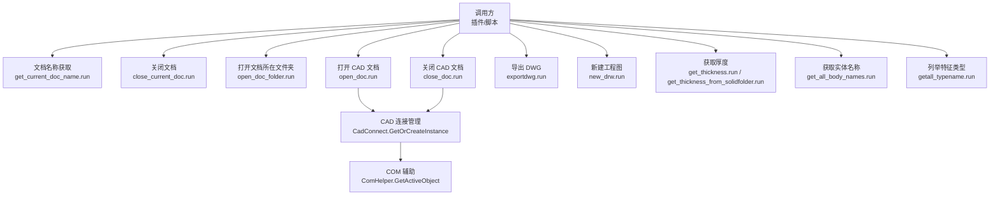

**图表来源**
- [get_current_doc_name.cs:11-23](file://share/modeldoc/get_current_doc_name.cs#L11-L23)
- [close_current_doc.cs:11-22](file://share/modeldoc/close_current_doc.cs#L11-L22)
- [open_doc_folder.cs:11-30](file://share/modeldoc/open_doc_folder.cs#L11-L30)
- [open_doc.cs:7-33](file://share/cad/open_doc.cs#L7-L33)
- [close_doc.cs:7-26](file://share/cad/close_doc.cs#L7-L26)
- [connect.cs:19-125](file://share/cad/connect.cs#L19-L125)
- [comhelp.cs:17-58](file://share/nomal/comhelp.cs#L17-L58)
- [exportdwg.cs:12-76](file://share/part/exportdwg.cs#L12-L76)
- [new_drw.cs:12-77](file://share/part/new_drw.cs#L12-L77)
- [get_thickness.cs:12-39](file://share/part/get_thickness.cs#L12-L39)
- [get_thickness_from_solidfolder.cs:13-80](file://share/part/get_thickness_from_solidfolder.cs#L13-L80)
- [get_all_body_names.cs:9-50](file://share/part/get_all_body_names.cs#L9-L50)
- [getall_typename.cs:13-52](file://share/part/getall_typename.cs#L13-L52)

## 详细组件分析

### 文档名称获取（SolidWorks）
- 功能：从模型对象获取文档路径，用于日志与后续操作。
- 关键点：异常捕获，提示用户确保 SolidWorks 正在运行。
- 调用链：调用方传入模型对象 → 调用名称获取方法 → 输出路径。

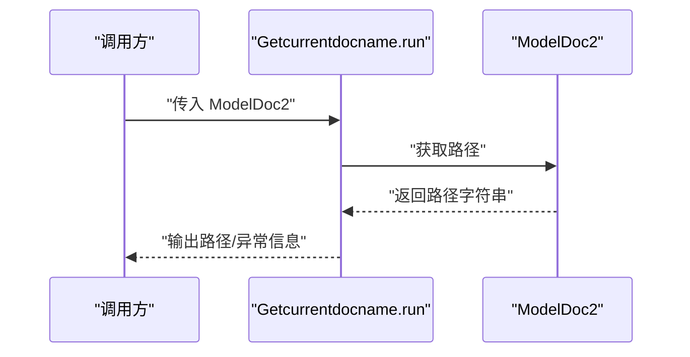

**图表来源**
- [get_current_doc_name.cs:11-23](file://share/modeldoc/get_current_doc_name.cs#L11-L23)

**章节来源**
- [get_current_doc_name.cs:11-23](file://share/modeldoc/get_current_doc_name.cs#L11-L23)

### 文档关闭（SolidWorks）
- 功能：通过应用对象关闭指定文档。
- 关键点：基于文档路径进行关闭；异常捕获与提示。

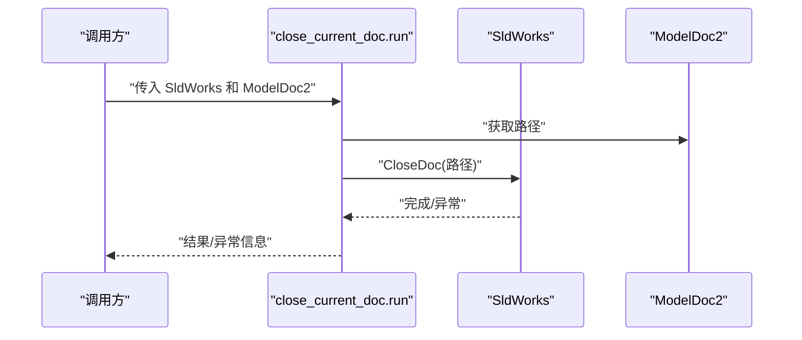

**图表来源**
- [close_current_doc.cs:11-22](file://share/modeldoc/close_current_doc.cs#L11-L22)

**章节来源**
- [close_current_doc.cs:11-22](file://share/modeldoc/close_current_doc.cs#L11-L22)

### 打开文档所在文件夹（SolidWorks）
- 功能：解析文档路径并调用系统外壳打开其所在目录。
- 关键点：路径解析、异常捕获与提示。

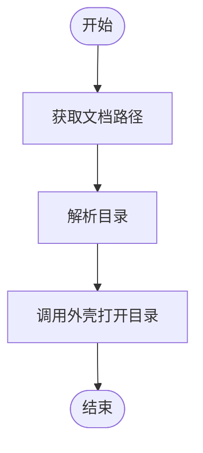

**图表来源**
- [open_doc_folder.cs:11-30](file://share/modeldoc/open_doc_folder.cs#L11-L30)

**章节来源**
- [open_doc_folder.cs:11-30](file://share/modeldoc/open_doc_folder.cs#L11-L30)

### AutoCAD 文档打开
- 功能：通过连接管理器获取 AutoCAD 实例，打开指定文件并激活。
- 关键点：文件存在性检查、异常处理、实例可见性保证。

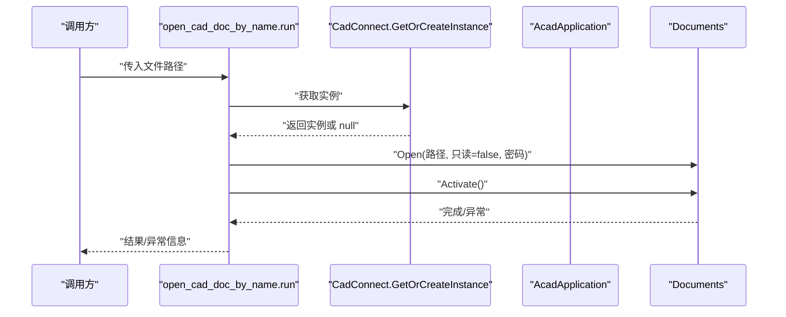

**图表来源**
- [open_doc.cs:7-33](file://share/cad/open_doc.cs#L7-L33)
- [connect.cs:19-125](file://share/cad/connect.cs#L19-L125)

**章节来源**
- [open_doc.cs:7-33](file://share/cad/open_doc.cs#L7-L33)
- [connect.cs:19-125](file://share/cad/connect.cs#L19-L125)

### AutoCAD 文档关闭
- 功能：关闭当前活动文档。
- 关键点：获取活动文档并关闭。

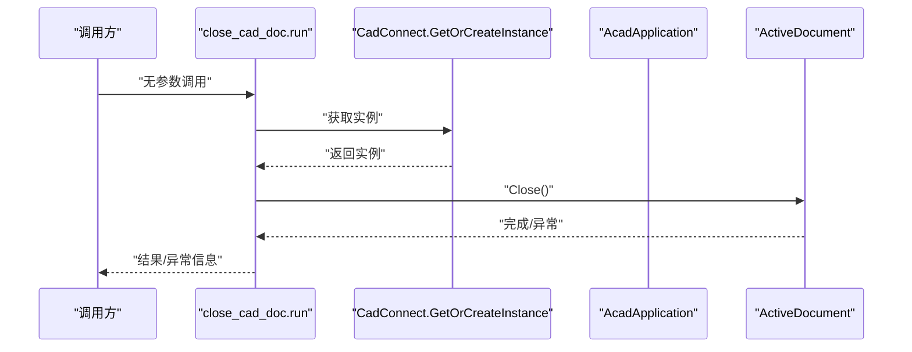

**图表来源**
- [close_doc.cs:7-26](file://share/cad/close_doc.cs#L7-L26)
- [connect.cs:19-125](file://share/cad/connect.cs#L19-L125)

**章节来源**
- [close_doc.cs:7-26](file://share/cad/close_doc.cs#L7-L26)
- [connect.cs:19-125](file://share/cad/connect.cs#L19-L125)

### CAD 连接管理（CadConnect）
- 功能：缓存与复用 AutoCAD 实例；自动检测已安装版本；优先获取运行中实例，否则创建新实例；确保窗口可见。
- 关键点：注册表扫描版本、异常分支处理、缓存失效检测、通用 ProgID 回退。

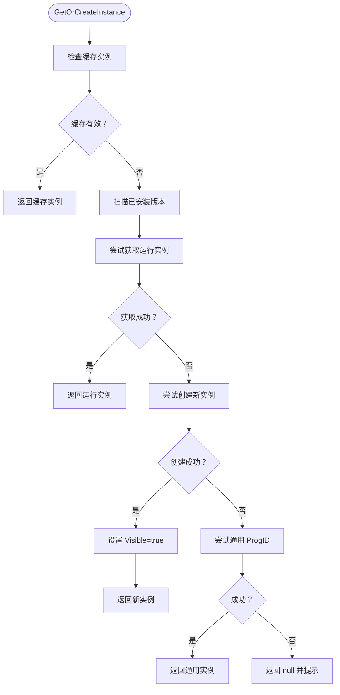

**图表来源**
- [connect.cs:19-125](file://share/cad/connect.cs#L19-L125)
- [comhelp.cs:17-58](file://share/nomal/comhelp.cs#L17-L58)

**章节来源**
- [connect.cs:19-125](file://share/cad/connect.cs#L19-L125)
- [comhelp.cs:17-58](file://share/nomal/comhelp.cs#L17-L58)

### 通过 Shell 打开 CAD 文档
- 功能：不依赖 AutoCAD 实例，直接通过系统外壳打开文件。
- 关键点：文件存在性检查、异常处理。

**章节来源**
- [open_doc_byshell.cs:6-26](file://share/cad/open_doc_byshell.cs#L6-L26)

### SolidWorks 导出 DWG 与新建工程图
- 导出 DWG：校验文档类型与保存路径，创建输出目录，调用导出接口生成 DWG。
- 新建工程图：加载模板、生成视图、设置偏好、保存为 DRW。

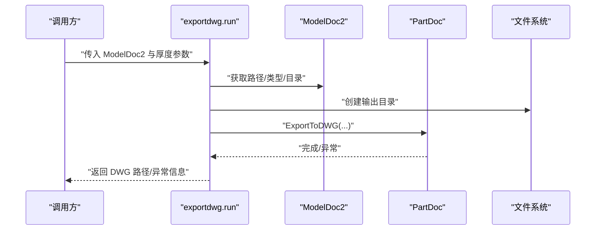

**图表来源**
- [exportdwg.cs:12-76](file://share/part/exportdwg.cs#L12-L76)

**章节来源**
- [exportdwg.cs:12-76](file://share/part/exportdwg.cs#L12-L76)

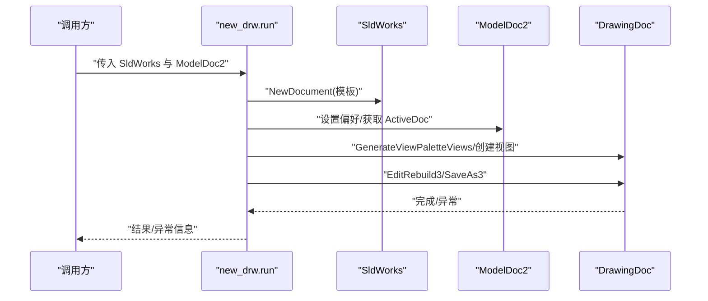

**图表来源**
- [new_drw.cs:12-77](file://share/part/new_drw.cs#L12-L77)

**章节来源**
- [new_drw.cs:12-77](file://share/part/new_drw.cs#L12-L77)

### 厚度与实体信息提取
- 从特征树中查找“SheetMetal”特征获取厚度。
- 从“SolidBodyFolder”子特征的自定义属性中提取厚度。
- 列举实体名称与特征类型，辅助诊断与自动化。

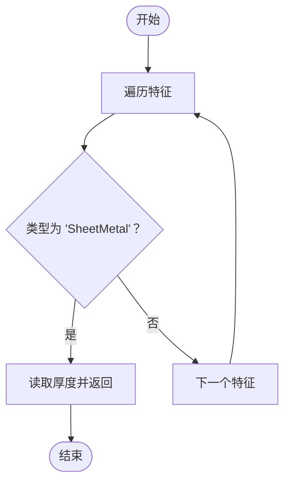

**图表来源**
- [get_thickness.cs:12-39](file://share/part/get_thickness.cs#L12-L39)

**章节来源**
- [get_thickness.cs:12-39](file://share/part/get_thickness.cs#L12-L39)
- [get_thickness_from_solidfolder.cs:13-80](file://share/part/get_thickness_from_solidfolder.cs#L13-L80)
- [get_all_body_names.cs:9-50](file://share/part/get_all_body_names.cs#L9-L50)
- [getall_typename.cs:13-52](file://share/part/getall_typename.cs#L13-L52)

## 依赖关系分析
- 组件耦合：
  - CAD 文档操作依赖连接管理器，连接管理器依赖 COM 辅助类。
  - SolidWorks 文档操作依赖模型对象与应用对象，部分操作相互配合（导出与新建工程图）。
- 外部依赖：
  - SolidWorks Interop 与 AutoCAD Interop 提供跨进程通信。
  - 注册表用于 AutoCAD 版本检测。
- 潜在循环依赖：当前文件间无循环引用，职责清晰。

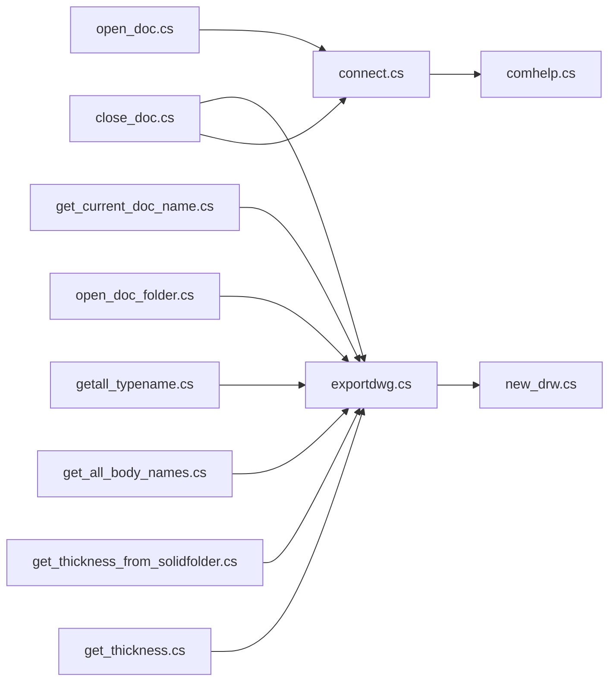

**图表来源**
- [open_doc.cs:7-33](file://share/cad/open_doc.cs#L7-L33)
- [close_doc.cs:7-26](file://share/cad/close_doc.cs#L7-L26)
- [connect.cs:19-125](file://share/cad/connect.cs#L19-L125)
- [comhelp.cs:17-58](file://share/nomal/comhelp.cs#L17-L58)
- [exportdwg.cs:12-76](file://share/part/exportdwg.cs#L12-L76)
- [new_drw.cs:12-77](file://share/part/new_drw.cs#L12-L77)
- [get_thickness.cs:12-39](file://share/part/get_thickness.cs#L12-L39)
- [get_thickness_from_solidfolder.cs:13-80](file://share/part/get_thickness_from_solidfolder.cs#L13-L80)
- [get_all_body_names.cs:9-50](file://share/part/get_all_body_names.cs#L9-L50)
- [getall_typename.cs:13-52](file://share/part/getall_typename.cs#L13-L52)
- [open_doc_folder.cs:11-30](file://share/modeldoc/open_doc_folder.cs#L11-L30)
- [get_current_doc_name.cs:11-23](file://share/modeldoc/get_current_doc_name.cs#L11-L23)

**章节来源**
- [open_doc.cs:7-33](file://share/cad/open_doc.cs#L7-L33)
- [close_doc.cs:7-26](file://share/cad/close_doc.cs#L7-L26)
- [connect.cs:19-125](file://share/cad/connect.cs#L19-L125)
- [comhelp.cs:17-58](file://share/nomal/comhelp.cs#L17-L58)
- [exportdwg.cs:12-76](file://share/part/exportdwg.cs#L12-L76)
- [new_drw.cs:12-77](file://share/part/new_drw.cs#L12-L77)
- [get_thickness.cs:12-39](file://share/part/get_thickness.cs#L12-L39)
- [get_thickness_from_solidfolder.cs:13-80](file://share/part/get_thickness_from_solidfolder.cs#L13-L80)
- [get_all_body_names.cs:9-50](file://share/part/get_all_body_names.cs#L9-L50)
- [getall_typename.cs:13-52](file://share/part/getall_typename.cs#L13-L52)
- [open_doc_folder.cs:11-30](file://share/modeldoc/open_doc_folder.cs#L11-L30)
- [get_current_doc_name.cs:11-23](file://share/modeldoc/get_current_doc_name.cs#L11-L23)

## 性能考虑
- 连接缓存：CAD 连接管理器缓存实例，减少重复创建与注册表扫描成本。
- 最小化 UI 干扰：创建实例后显式设置可见性，避免不必要的窗口切换。
- 路径与文件系统操作：导出前检查目录与文件存在性，减少无效 IO。
- 模板与批量操作：新建工程图时一次性设置偏好与生成视图，降低多次重建次数。
- 异常快速失败：对空对象与非法类型进行早期校验，避免无效调用链。

[本节为通用指导，无需具体文件分析]

## 故障排查指南
- 无法连接到 AutoCAD：
  - 现象：返回 null 或提示未检测到版本。
  - 排查：确认 AutoCAD 是否已启动；检查注册表版本项；尝试通用 ProgID；查看控制台输出的调试信息。
  - 参考：[connect.cs:39-124](file://share/cad/connect.cs#L39-L124)
- 打开/关闭文档失败：
  - 现象：文件不存在或实例不可用。
  - 排查：确认文件路径；检查文件权限；确保文档对象有效。
  - 参考：[open_doc.cs:17-30](file://share/cad/open_doc.cs#L17-L30)、[close_doc.cs:11-26](file://share/cad/close_doc.cs#L11-L26)
- SolidWorks 文档操作异常：
  - 现象：文档未保存、类型不符、模板路径错误。
  - 排查：先保存文档；确认类型为零件；核对模板路径；检查导出选项。
  - 参考：[exportdwg.cs:20-38](file://share/part/exportdwg.cs#L20-L38)、[new_drw.cs:29-38](file://share/part/new_drw.cs#L29-L38)
- 厚度与实体信息为空：
  - 现象：未找到特征或自定义属性。
  - 排查：确认特征树结构；检查属性名称（中文/英文）；验证实体文件夹是否存在。
  - 参考：[get_thickness.cs:18-30](file://share/part/get_thickness.cs#L18-L30)、[get_thickness_from_solidfolder.cs:23-64](file://share/part/get_thickness_from_solidfolder.cs#L23-L64)

**章节来源**
- [connect.cs:39-124](file://share/cad/connect.cs#L39-L124)
- [open_doc.cs:17-30](file://share/cad/open_doc.cs#L17-L30)
- [close_doc.cs:11-26](file://share/cad/close_doc.cs#L11-L26)
- [exportdwg.cs:20-38](file://share/part/exportdwg.cs#L20-L38)
- [new_drw.cs:29-38](file://share/part/new_drw.cs#L29-L38)
- [get_thickness.cs:18-30](file://share/part/get_thickness.cs#L18-L30)
- [get_thickness_from_solidfolder.cs:23-64](file://share/part/get_thickness_from_solidfolder.cs#L23-L64)

## 结论
本模块围绕 CAD 文档的生命周期管理提供了完整的操作能力：从文档名称获取、打开/关闭、路径定位，到与 SolidWorks/AutoCAD 的深度集成。通过连接缓存、异常处理与路径校验，提升了稳定性与可用性。建议在实际项目中：
- 明确文档状态（打开/关闭/保存），在关键节点记录状态变化。
- 在批量处理场景下合并多次重建与保存操作，减少性能损耗。
- 对外部依赖（如模板路径、注册表项）进行健壮性校验与降级策略。

[本节为总结，无需具体文件分析]

## 附录

### 文档路径管理与文件定位实用方法
- 解析文档路径与目录：从模型对象获取路径，再使用路径库解析目录。
- 生成导出路径：基于源文件目录与约定子目录（如“出图/厚度”）生成 DWG 输出路径。
- 选择文件夹：使用现代对话框或回退方案选择目标文件夹，获取文件列表。

**章节来源**
- [open_doc_folder.cs:15-16](file://share/modeldoc/open_doc_folder.cs#L15-L16)
- [exportdwg.cs:40-45](file://share/part/exportdwg.cs#L40-L45)
- [get_folder_file.cs:153-211](file://share/nomal/get_folder_file.cs#L153-L211)

### 文档打开与关闭操作流程与异常处理
- 打开流程：校验文件存在性 → 获取/创建应用实例 → 打开文档 → 激活窗口 → 输出结果。
- 关闭流程：获取活动文档 → 关闭文档 → 输出结果。
- 异常处理：捕获并输出异常信息，提示用户确保应用程序处于可用状态。

**章节来源**
- [open_doc.cs:17-30](file://share/cad/open_doc.cs#L17-L30)
- [close_doc.cs:20-21](file://share/cad/close_doc.cs#L20-L21)
- [get_current_doc_name.cs:18-22](file://share/modeldoc/get_current_doc_name.cs#L18-L22)
- [close_current_doc.cs:18-22](file://share/modeldoc/close_current_doc.cs#L18-L22)

### 与 CAD 应用程序的集成与通信协议
- AutoCAD：通过 ProgID/CLSID 获取运行实例或创建新实例，使用 Interop 接口进行文档操作。
- SolidWorks：通过应用对象与模型对象进行文档与特征操作，使用枚举与常量类型标识文档类型与选项。

**章节来源**
- [connect.cs:55-107](file://share/cad/connect.cs#L55-L107)
- [comhelp.cs:17-58](file://share/nomal/comhelp.cs#L17-L58)
- [exportdwg.cs:59-60](file://share/part/exportdwg.cs#L59-L60)