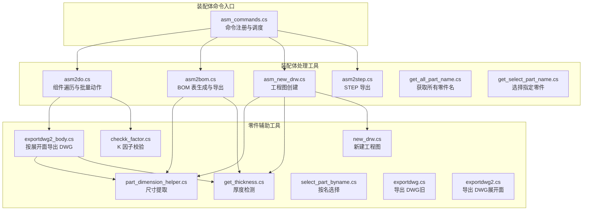
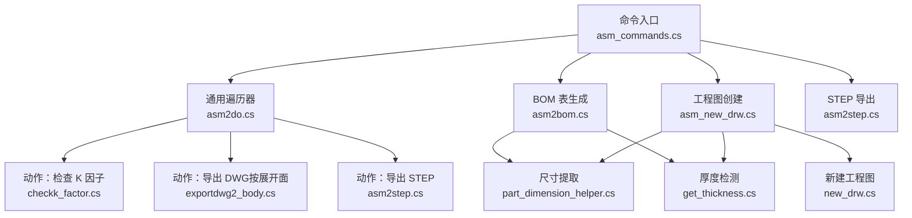
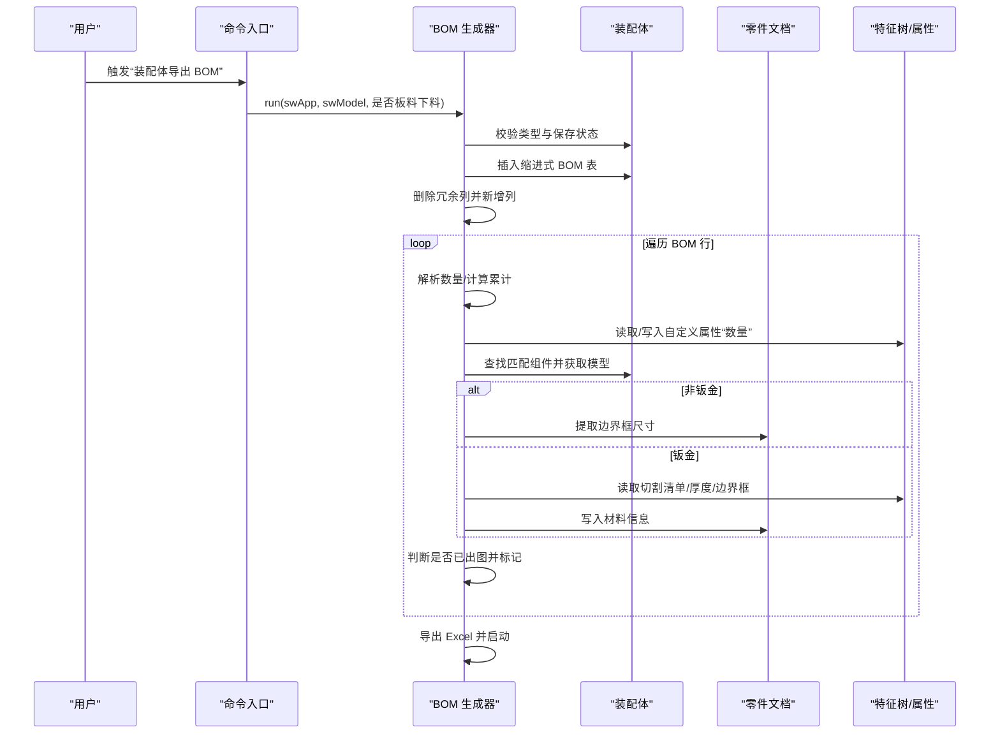
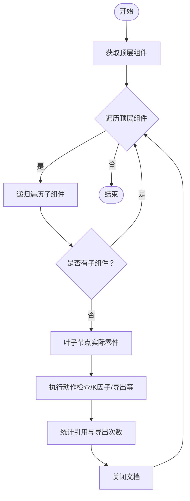
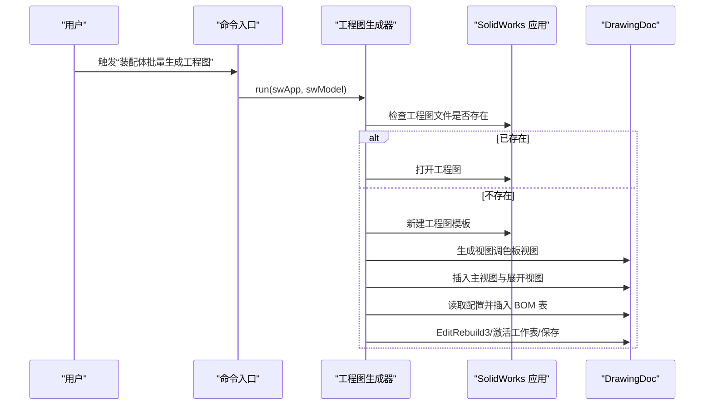
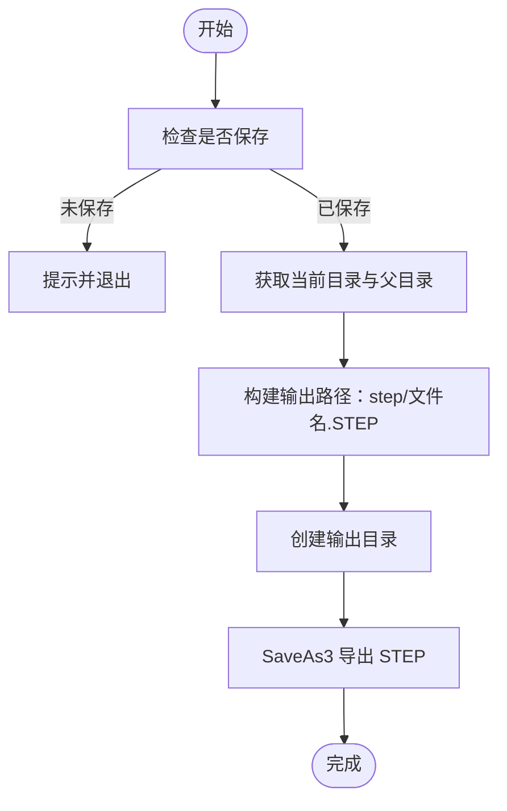
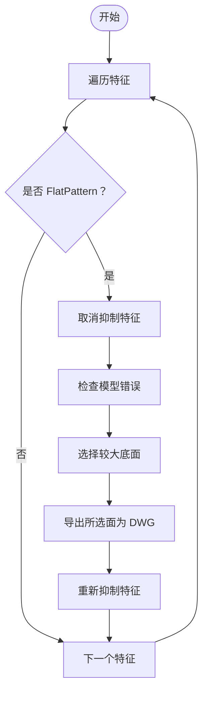
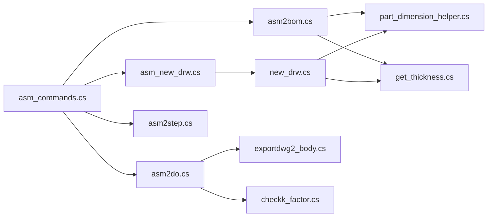

# 装配体管理模块

<cite>
**本文引用的文件**
- [asm2bom.cs](file://share/asm/asm2bom.cs)
- [asm2do.cs](file://share/asm/asm2do.cs)
- [asm2step.cs](file://share/asm/asm2step.cs)
- [asm_new_drw.cs](file://share/asm/asm_new_drw.cs)
- [get_all_part_name.cs](file://share/asm/get_all_part_name.cs)
- [get_select_part_name.cs](file://share/asm/get_select_part_name.cs)
- [asm_commands.cs](file://ctools/solidworks_commands/asm_commands.cs)
- [part_dimension_helper.cs](file://share/nomal/part_dimension_helper.cs)
- [get_thickness.cs](file://share/part/get_thickness.cs)
- [exportdwg2_body.cs](file://share/part/exportdwg2_body.cs)
- [new_drw.cs](file://share/part/new_drw.cs)
- [select_part_byname.cs](file://share/part/select_part_byname.cs)
- [checkk_factor.cs](file://share/part/checkk_factor.cs)
- [exportdwg.cs](file://share/part/exportdwg.cs)
- [exportdwg2.cs](file://share/part/exportdwg2.cs)
</cite>

## 目录
1. [简介](#简介)
2. [项目结构](#项目结构)
3. [核心组件](#核心组件)
4. [架构总览](#架构总览)
5. [详细组件分析](#详细组件分析)
6. [依赖分析](#依赖分析)
7. [性能考虑](#性能考虑)
8. [故障排查指南](#故障排查指南)
9. [结论](#结论)
10. [附录](#附录)

## 简介
本模块围绕 SolidWorks 装配体的自动化处理能力，提供以下核心功能：
- BOM 表生成与导出：自动插入缩进式 BOM 表，计算累计数量，识别是否已出图，填充规格尺寸与材料信息，并导出为 Excel。
- 工程图创建：基于装配体生成工程图，自动插入视图与 BOM 表，支持模板选择与位置布局。
- STEP 文件导出：将装配体中的所有零件批量导出为 STEP 文件。
- 文档输出：遍历装配体组件，按需执行检查、展开、导出 DWG 等动作，支持统计与去重。
- 结构分析与数据提取：通过组件树遍历、特征检测、自定义属性读写等方式，提取装配体与零件的关系、厚度、尺寸等关键数据。

## 项目结构
装配体管理模块主要由三部分组成：
- 装配体命令入口：集中注册与调度各类装配体操作命令。
- 装配体处理工具：封装通用遍历、导出、工程图生成等逻辑。
- 零件辅助工具：尺寸提取、厚度检测、K 因子校验、DWG 导出等。

图表来源
- [asm_commands.cs:1-158](file://ctools/solidworks_commands/asm_commands.cs#L1-L158)
- [asm2do.cs:1-154](file://share/asm/asm2do.cs#L1-L154)
- [asm2bom.cs:1-404](file://share/asm/asm2bom.cs#L1-L404)
- [asm_new_drw.cs:1-128](file://share/asm/asm_new_drw.cs#L1-L128)
- [asm2step.cs:1-37](file://share/asm/asm2step.cs#L1-L37)
- [get_all_part_name.cs:1-90](file://share/asm/get_all_part_name.cs#L1-L90)
- [get_select_part_name.cs:1-45](file://share/asm/get_select_part_name.cs#L1-L45)
- [part_dimension_helper.cs:1-113](file://share/nomal/part_dimension_helper.cs#L1-L113)
- [get_thickness.cs:1-42](file://share/part/get_thickness.cs#L1-L42)
- [exportdwg2_body.cs:1-200](file://share/part/exportdwg2_body.cs#L1-L200)
- [new_drw.cs:1-85](file://share/part/new_drw.cs#L1-L85)
- [select_part_byname.cs:1-47](file://share/part/select_part_byname.cs#L1-L47)
- [exportdwg.cs:1-81](file://share/part/exportdwg.cs#L1-L81)
- [exportdwg2.cs:1-134](file://share/part/exportdwg2.cs#L1-L134)

章节来源
- [asm_commands.cs:1-158](file://ctools/solidworks_commands/asm_commands.cs#L1-L158)
- [asm2do.cs:1-154](file://share/asm/asm2do.cs#L1-L154)
- [asm2bom.cs:1-404](file://share/asm/asm2bom.cs#L1-L404)
- [asm_new_drw.cs:1-128](file://share/asm/asm_new_drw.cs#L1-L128)
- [asm2step.cs:1-37](file://share/asm/asm2step.cs#L1-L37)
- [get_all_part_name.cs:1-90](file://share/asm/get_all_part_name.cs#L1-L90)
- [get_select_part_name.cs:1-45](file://share/asm/get_select_part_name.cs#L1-L45)
- [part_dimension_helper.cs:1-113](file://share/nomal/part_dimension_helper.cs#L1-L113)
- [get_thickness.cs:1-42](file://share/part/get_thickness.cs#L1-L42)
- [exportdwg2_body.cs:1-200](file://share/part/exportdwg2_body.cs#L1-L200)
- [new_drw.cs:1-85](file://share/part/new_drw.cs#L1-L85)
- [select_part_byname.cs:1-47](file://share/part/select_part_byname.cs#L1-L47)
- [exportdwg.cs:1-81](file://share/part/exportdwg.cs#L1-L81)
- [exportdwg2.cs:1-134](file://share/part/exportdwg2.cs#L1-L134)

## 核心组件
- 装配体命令入口：集中注册“装配体批量导出 DWG”“装配体批量检查展开”“获取所有零件名称”“装配体导出 BOM”“装配体批量生成工程图”“批量导出装配体中所有零件为 STEP”“文件夹内零件装配体导出为 STEP 格式”等命令，并通过委托回调执行具体动作。
- 组件遍历器：对装配体进行深度优先遍历，仅对叶子节点（实际零件）执行动作，避免重复处理同名零件，同时负责统计引用次数与导出次数。
- BOM 表生成器：插入缩进式 BOM 表，动态调整列标题，计算累计数量，识别是否已出图，填充规格尺寸与材料信息，并导出 Excel。
- 工程图生成器：根据模板创建工程图，生成视图与展开视图，插入 BOM 表并保存。
- STEP 导出器：将当前文档保存为 STEP 文件，按约定目录结构组织输出。
- 数据提取工具：尺寸提取（边界框）、厚度检测（钣金特征）、K 因子校验（折弯特征）等。

章节来源
- [asm_commands.cs:11-158](file://ctools/solidworks_commands/asm_commands.cs#L11-L158)
- [asm2do.cs:22-150](file://share/asm/asm2do.cs#L22-L150)
- [asm2bom.cs:12-359](file://share/asm/asm2bom.cs#L12-L359)
- [asm_new_drw.cs:12-126](file://share/asm/asm_new_drw.cs#L12-L126)
- [asm2step.cs:6-34](file://share/asm/asm2step.cs#L6-L34)
- [part_dimension_helper.cs:17-58](file://share/nomal/part_dimension_helper.cs#L17-L58)
- [get_thickness.cs:12-40](file://share/part/get_thickness.cs#L12-L40)
- [checkk_factor.cs:90-143](file://share/part/checkk_factor.cs#L90-L143)

## 架构总览
装配体管理模块采用“命令入口 + 通用遍历 + 功能模块”的分层架构：
- 命令入口负责参数解析与上下文准备，将通用遍历与具体动作解耦。
- 通用遍历器负责遍历装配体组件树，按需执行动作并统计结果。
- 功能模块专注于单一职责，如 BOM 表生成、工程图创建、STEP 导出、DWG 导出等。

图表来源
- [asm_commands.cs:11-158](file://ctools/solidworks_commands/asm_commands.cs#L11-L158)
- [asm2do.cs:22-150](file://share/asm/asm2do.cs#L22-L150)
- [checkk_factor.cs:90-143](file://share/part/checkk_factor.cs#L90-L143)
- [exportdwg2_body.cs:133-198](file://share/part/exportdwg2_body.cs#L133-L198)
- [asm2step.cs:6-34](file://share/asm/asm2step.cs#L6-L34)
- [asm2bom.cs:12-359](file://share/asm/asm2bom.cs#L12-L359)
- [part_dimension_helper.cs:17-58](file://share/nomal/part_dimension_helper.cs#L17-L58)
- [get_thickness.cs:12-40](file://share/part/get_thickness.cs#L12-L40)
- [asm_new_drw.cs:12-126](file://share/asm/asm_new_drw.cs#L12-L126)
- [new_drw.cs:12-83](file://share/part/new_drw.cs#L12-L83)

## 详细组件分析

### BOM 表生成与导出（asm2bom）
- 功能要点
  - 校验装配体与保存状态，定位 BOM 模板路径。
  - 插入缩进式 BOM 表，删除冗余列并新增“单套数量”“是否出图”“总数”等列。
  - 遍历 BOM 表行，解析数量、计算累计数量、更新自定义属性“数量”，并判断是否已出图。
  - 对非钣金与钣金件分别提取尺寸：非钣金使用边界框尺寸；钣金优先使用切割清单边界框，否则回退到普通边界框；同时写入材料信息。
  - 导出 Excel 并启动程序打开。
- 数据流
  - 输入：装配体文档、是否“板料下料”模式。
  - 中间：BOM 注释对象、组件集合、自定义属性管理器、特征树遍历。
  - 输出：更新后的 BOM 表、Excel 文件、材料与数量自定义属性。

图表来源
- [asm2bom.cs:12-359](file://share/asm/asm2bom.cs#L12-L359)

章节来源
- [asm2bom.cs:12-359](file://share/asm/asm2bom.cs#L12-L359)
- [part_dimension_helper.cs:17-58](file://share/nomal/part_dimension_helper.cs#L17-L58)
- [get_thickness.cs:12-40](file://share/part/get_thickness.cs#L12-L40)

### 组件遍历与批量动作（asm2do）
- 功能要点
  - 顶层组件遍历，递归访问子组件，仅对叶子节点（实际零件）执行动作。
  - 统计每个零件的引用次数与导出次数，避免重复处理。
  - 对每个首次遇到的零件执行回调动作（如检查 K 因子、导出 DWG 等），完成后关闭文档以释放资源。
- 算法流程
  - 获取顶层组件列表。
  - 逐个组件递归遍历，若无子组件则视为叶子节点，执行动作并记录统计。
  - 关闭已处理文档。

图表来源
- [asm2do.cs:86-150](file://share/asm/asm2do.cs#L86-L150)

章节来源
- [asm2do.cs:22-150](file://share/asm/asm2do.cs#L22-L150)

### 工程图创建（asm_new_drw 与 new_drw）
- 功能要点
  - 若目标工程图已存在则直接打开，否则根据模板创建新工程图。
  - 生成视图调色板视图，插入主视图与展开视图，激活活动视图。
  - 读取配置名称，插入 BOM 表并设置位置与样式。
  - 重建工程图、激活工作表、保存并提示结果。
- 流程图

图表来源
- [asm_new_drw.cs:12-126](file://share/asm/asm_new_drw.cs#L12-L126)
- [new_drw.cs:12-83](file://share/part/new_drw.cs#L12-L83)

章节来源
- [asm_new_drw.cs:12-126](file://share/asm/asm_new_drw.cs#L12-L126)
- [new_drw.cs:12-83](file://share/part/new_drw.cs#L12-L83)

### STEP 文件导出（asm2step）
- 功能要点
  - 校验当前文档保存状态，确定输出目录为“当前目录/step”。
  - 使用 SaveAs3 保存为 STEP 格式，按约定命名并创建目录。
- 流程图

图表来源
- [asm2step.cs:6-34](file://share/asm/asm2step.cs#L6-L34)

章节来源
- [asm2step.cs:6-34](file://share/asm/asm2step.cs#L6-L34)

### DWG 导出（按展开面与整体导出）
- 按展开面导出（exportdwg2_body）
  - 遍历特征，定位 FlatPattern 特征，展开后检查模型错误，选择较大底面，导出该面为 DWG。
  - 支持统计成功导出数量，便于批量处理反馈。
- 整体导出（exportdwg2）
  - 遍历 FlatPattern 特征，逐个展开并导出对应特征名的 DWG 文件。
- 传统导出（exportdwg）
  - 基于钣金导出选项，将整个零件导出为 DWG。

图表来源
- [exportdwg2_body.cs:25-132](file://share/part/exportdwg2_body.cs#L25-L132)
- [exportdwg2.cs:15-133](file://share/part/exportdwg2.cs#L15-L133)
- [exportdwg.cs:12-80](file://share/part/exportdwg.cs#L12-L80)

章节来源
- [exportdwg2_body.cs:133-198](file://share/part/exportdwg2_body.cs#L133-L198)
- [exportdwg2.cs:15-133](file://share/part/exportdwg2.cs#L15-L133)
- [exportdwg.cs:12-80](file://share/part/exportdwg.cs#L12-L80)

### 零件数据提取与关系管理
- 尺寸提取（part_dimension_helper）
  - 使用 GetPartBox 获取边界框，计算长宽高（单位转换为毫米），返回三元组。
- 厚度检测（get_thickness）
  - 遍历特征，定位 SheetMetal 特征，读取厚度并返回（单位毫米）。
- K 因子校验（checkk_factor）
  - 遍历 OneBend 子特征，读取 CustomBendAllowance，按规则校验 K 因子与类型，输出错误或正确信息。
- 零件选择（select_part_byname）
  - 在装配体中按名称选择组件并选中。
- 零件名获取（get_all_part_name、get_select_part_name）
  - 遍历装配体组件树，收集所有唯一零件路径；或获取当前选中的组件路径。

章节来源
- [part_dimension_helper.cs:17-58](file://share/nomal/part_dimension_helper.cs#L17-L58)
- [get_thickness.cs:12-40](file://share/part/get_thickness.cs#L12-L40)
- [checkk_factor.cs:90-143](file://share/part/checkk_factor.cs#L90-L143)
- [select_part_byname.cs:13-44](file://share/part/select_part_byname.cs#L13-L44)
- [get_all_part_name.cs:14-88](file://share/asm/get_all_part_name.cs#L14-L88)
- [get_select_part_name.cs:11-43](file://share/asm/get_select_part_name.cs#L11-L43)

## 依赖分析
- 命令入口依赖通用遍历器与各功能模块，形成“命令 -> 遍历 -> 动作”的依赖链。
- BOM 生成依赖尺寸与厚度工具，以及装配体组件树与自定义属性管理。
- 工程图创建依赖模板与视图生成接口，同时复用尺寸与厚度工具。
- DWG 导出依赖特征树与 FlatPattern 特征，涉及展开与抑制控制。
- 性能与稳定性依赖遍历器的去重与文档关闭策略，避免重复处理与资源泄漏。

图表来源
- [asm_commands.cs:11-158](file://ctools/solidworks_commands/asm_commands.cs#L11-L158)
- [asm2do.cs:22-150](file://share/asm/asm2do.cs#L22-L150)
- [asm2bom.cs:12-359](file://share/asm/asm2bom.cs#L12-L359)
- [asm_new_drw.cs:12-126](file://share/asm/asm_new_drw.cs#L12-L126)
- [asm2step.cs:6-34](file://share/asm/asm2step.cs#L6-L34)
- [part_dimension_helper.cs:17-58](file://share/nomal/part_dimension_helper.cs#L17-L58)
- [get_thickness.cs:12-40](file://share/part/get_thickness.cs#L12-L40)
- [exportdwg2_body.cs:133-198](file://share/part/exportdwg2_body.cs#L133-L198)
- [checkk_factor.cs:90-143](file://share/part/checkk_factor.cs#L90-L143)
- [new_drw.cs:12-83](file://share/part/new_drw.cs#L12-L83)

章节来源
- [asm_commands.cs:11-158](file://ctools/solidworks_commands/asm_commands.cs#L11-L158)
- [asm2do.cs:22-150](file://share/asm/asm2do.cs#L22-L150)
- [asm2bom.cs:12-359](file://share/asm/asm2bom.cs#L12-L359)
- [asm_new_drw.cs:12-126](file://share/asm/asm_new_drw.cs#L12-L126)
- [asm2step.cs:6-34](file://share/asm/asm2step.cs#L6-L34)
- [part_dimension_helper.cs:17-58](file://share/nomal/part_dimension_helper.cs#L17-L58)
- [get_thickness.cs:12-40](file://share/part/get_thickness.cs#L12-L40)
- [exportdwg2_body.cs:133-198](file://share/part/exportdwg2_body.cs#L133-L198)
- [checkk_factor.cs:90-143](file://share/part/checkk_factor.cs#L90-L143)
- [new_drw.cs:12-83](file://share/part/new_drw.cs#L12-L83)

## 性能考虑
- 遍历策略
  - 仅对叶子节点执行动作，避免重复处理同一零件，降低 I/O 与计算开销。
  - 遍历器内部维护字典统计引用与导出次数，减少重复文件操作。
- 资源管理
  - 每次动作完成后主动关闭文档，防止句柄泄露与内存累积。
- 模板与路径
  - 明确模板与输出路径，减少异常分支与重试成本。
- 批处理优化
  - 命令入口对批量操作使用委托回调，便于在外部加入性能监控与并发控制（如时间测量）。

[本节为通用性能建议，无需特定文件引用]

## 故障排查指南
- 常见问题
  - 当前文档非装配体：在命令入口与各功能模块均有类型校验，确认当前文档为装配体。
  - 文档未保存：多处逻辑会检查路径，未保存将直接返回错误提示。
  - 模板缺失：工程图创建与 BOM 表插入会尝试备用路径，若仍失败请检查模板路径权限。
  - 特征缺失：K 因子校验与 FlatPattern 导出会因特征不存在而失败，需确认模型完整性。
- 建议
  - 在执行批量操作前，先执行“装配体批量检查展开”以提前发现模型问题。
  - 对于大型装配体，建议分批处理并监控内存占用。
  - 导出前清理不必要的子视图与隐藏特征，提升导出效率。

章节来源
- [asm_commands.cs:11-158](file://ctools/solidworks_commands/asm_commands.cs#L11-L158)
- [asm2bom.cs:14-359](file://share/asm/asm2bom.cs#L14-L359)
- [asm_new_drw.cs:14-126](file://share/asm/asm_new_drw.cs#L14-L126)
- [exportdwg2_body.cs:133-198](file://share/part/exportdwg2_body.cs#L133-L198)
- [checkk_factor.cs:90-143](file://share/part/checkk_factor.cs#L90-L143)

## 结论
装配体管理模块通过命令入口统一调度、通用遍历器高效处理、功能模块专注实现，形成了可扩展、可维护的装配体自动化体系。其核心能力覆盖 BOM 表生成、工程图创建、STEP 与 DWG 导出、数据提取与关系管理，适用于复杂装配的批量化处理与质量控制。建议在实际应用中结合性能监控与资源管理策略，持续优化大规模装配的处理效率。

[本节为总结性内容，无需特定文件引用]

## 附录
- 使用示例（命令行）
  - 装配体批量导出 DWG：执行“asm2export”，将对装配体中每个唯一零件执行检查与按展开面导出。
  - 装配体批量检查展开：执行“asm2check”，对每个唯一零件执行 K 因子校验。
  - 获取所有零件名称：执行“get_all_typename”，输出装配体中所有唯一零件路径。
  - 装配体导出 BOM：执行“asm2bom”，生成并导出 Excel。
  - 装配体批量生成工程图：执行“asm2drw”，按模板生成工程图并插入 BOM。
  - 批量导出装配体中所有零件为 STEP：执行“asm2step”，将每个唯一零件导出为 STEP。
  - 文件夹内零件装配体导出为 STEP：执行“folder2step”，对选定文件夹内的 SLDPRT/SLDASM 执行导出。
- 最佳实践
  - 在导出前确保装配体已保存并命名规范，以便输出路径与 Excel 名称一致。
  - 对于钣金件，优先使用“按展开面导出 DWG”以获得更准确的下料图。
  - 批量处理时启用“装配体批量检查展开”，及时发现并修复 K 因子与折弯问题。
  - 合理规划输出目录结构，避免文件名冲突与权限问题。

[本节为概念性内容，无需特定文件引用]