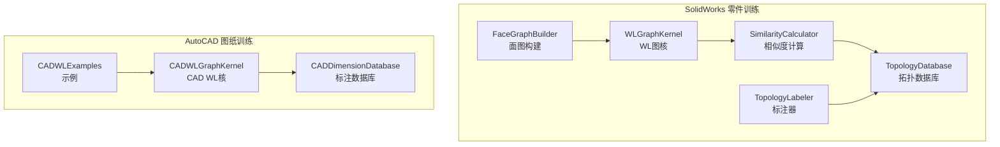
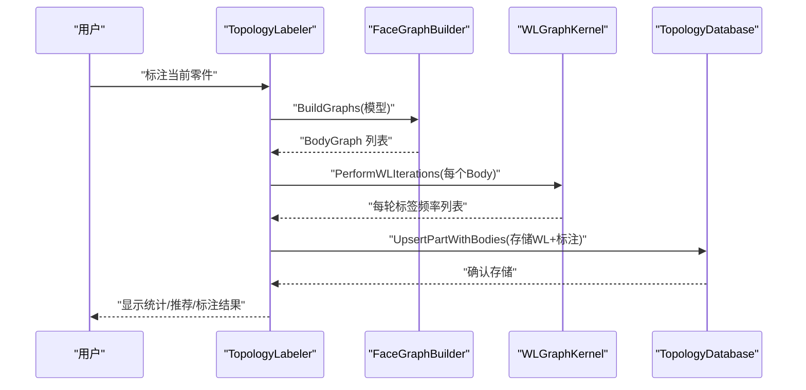
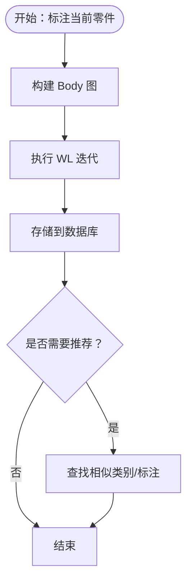
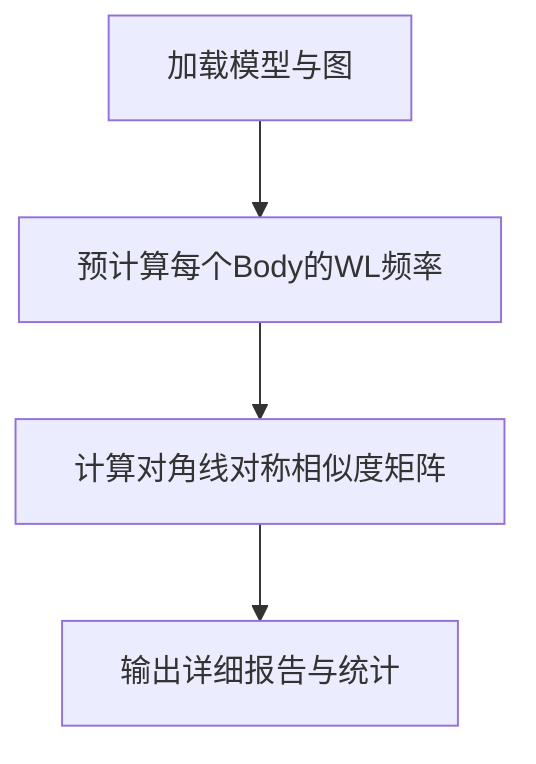
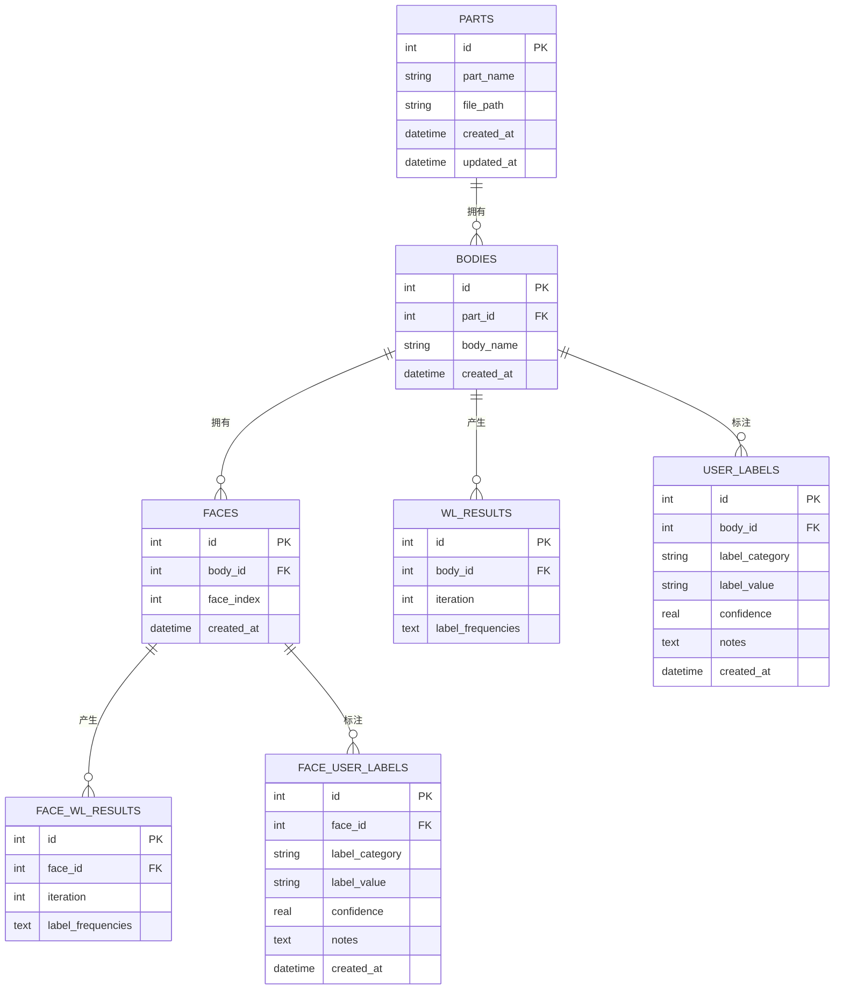
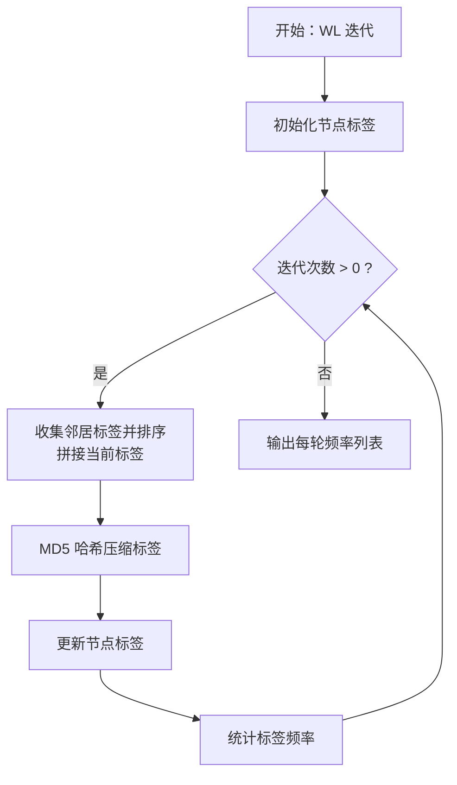
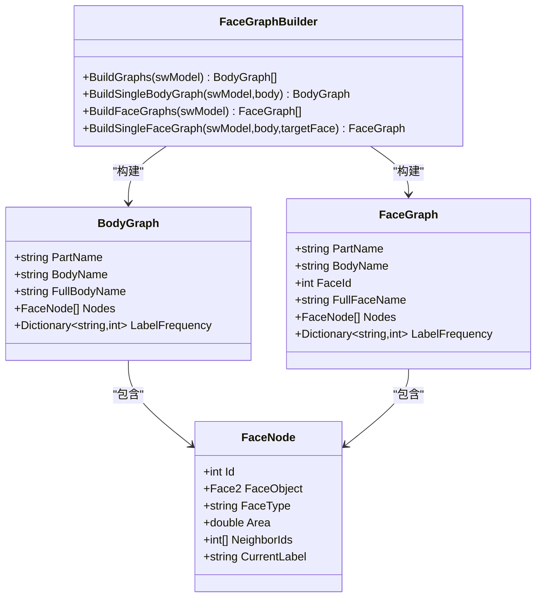
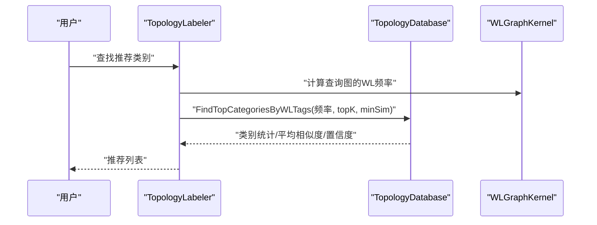
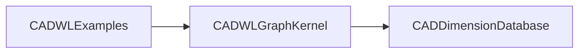
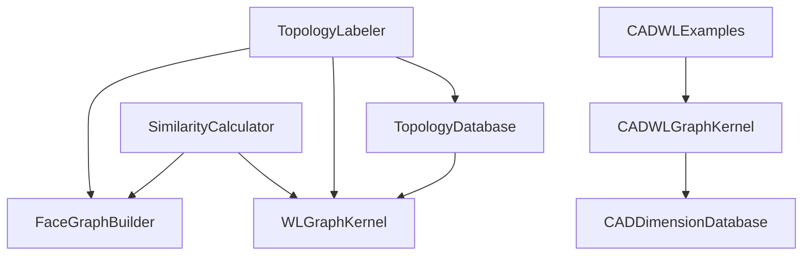

# 训练算法模块

<cite>
**本文档引用的文件**
- [topology_labeler.cs](file://share/train/topology_labeler.cs)
- [similarity_calculator.cs](file://share/train/similarity_calculator.cs)
- [topology_database.cs](file://share/train/topology_database.cs)
- [wl_graph_kernel.cs](file://share/train/wl_graph_kernel.cs)
- [topology_labeling_example.cs](file://share/train/topology_labeling_example.cs)
- [face_graph_builder.cs](file://share/train/face_graph_builder.cs)
- [get_all_edges.cs](file://share/train/get_all_edges.cs)
- [get_all_face.cs](file://share/train/get_all_face.cs)
- [wl_category_finder_examples.cs](file://share/train/wl_category_finder_examples.cs)
- [训练课题.md](file://share/train/训练课题.md)
- [cad_wl_examples.cs](file://share/cad/wl_learning/cad_wl_examples.cs)
- [cad_wl_graph_kernel.cs](file://share/cad/wl_learning/cad_wl_graph_kernel.cs)
- [cad_dimension_database.cs](file://share/cad/wl_learning/cad_dimension_database.cs)
</cite>

## 目录
1. [简介](#简介)
2. [项目结构](#项目结构)
3. [核心组件](#核心组件)
4. [架构总览](#架构总览)
5. [详细组件分析](#详细组件分析)
6. [依赖关系分析](#依赖关系分析)
7. [性能考量](#性能考量)
8. [故障排查指南](#故障排查指南)
9. [结论](#结论)
10. [附录](#附录)

## 简介
本文件面向研究人员与开发者，系统化梳理训练算法模块的技术实现，涵盖拓扑标注、相似度计算、Weisfeiler-Lehman 图核（WL 核心）、拓扑数据库设计与查询机制，并提供性能评估与结果验证方法、训练数据准备与模型训练流程。通过 SolidWorks 零件与 AutoCAD 图纸两类场景，展示从图构建、WL 迭代、相似度计算到标注与检索的完整工作流。

## 项目结构
训练算法模块位于 share/train 目录，围绕“拓扑图构建 → WL 迭代 → 相似度计算 → 数据库存储与查询 → 交互式标注与推荐”形成闭环；同时在 share/cad/wl_learning 提供 CAD 场景下的同类能力，便于对比与迁移。

**图示来源**
- [face_graph_builder.cs:67-367](file://share/train/face_graph_builder.cs#L67-L367)
- [wl_graph_kernel.cs:12-433](file://share/train/wl_graph_kernel.cs#L12-L433)
- [similarity_calculator.cs:11-227](file://share/train/similarity_calculator.cs#L11-L227)
- [topology_labeler.cs:13-679](file://share/train/topology_labeler.cs#L13-L679)
- [topology_database.cs:50-799](file://share/train/topology_database.cs#L50-L799)
- [cad_wl_examples.cs:10-154](file://share/cad/wl_learning/cad_wl_examples.cs#L10-L154)
- [cad_wl_graph_kernel.cs:79-324](file://share/cad/wl_learning/cad_wl_graph_kernel.cs#L79-L324)
- [cad_dimension_database.cs:12-475](file://share/cad/wl_learning/cad_dimension_database.cs#L12-L475)

**章节来源**
- [face_graph_builder.cs:67-367](file://share/train/face_graph_builder.cs#L67-L367)
- [wl_graph_kernel.cs:12-433](file://share/train/wl_graph_kernel.cs#L12-L433)
- [similarity_calculator.cs:11-227](file://share/train/similarity_calculator.cs#L11-L227)
- [topology_labeler.cs:13-679](file://share/train/topology_labeler.cs#L13-L679)
- [topology_database.cs:50-799](file://share/train/topology_database.cs#L50-L799)
- [cad_wl_examples.cs:10-154](file://share/cad/wl_learning/cad_wl_examples.cs#L10-L154)
- [cad_wl_graph_kernel.cs:79-324](file://share/cad/wl_learning/cad_wl_graph_kernel.cs#L79-L324)
- [cad_dimension_database.cs:12-475](file://share/cad/wl_learning/cad_dimension_database.cs#L12-L475)

## 核心组件
- 拓扑标注器：负责初始化数据库、标注当前零件、批量标注、查询与统计、类别推荐与匹配、导出 WL 结果等。
- 相似度计算器：从文件夹加载模型、构建图、计算两两相似度、输出分析报告与统计信息。
- 拓扑数据库：SQLite 存储，支持零件/Body/Face 级别 WL 结果与用户标注，提供查询、去重、索引与清理。
- WL 图核：实现 WL 迭代、标签哈希压缩、标签频率统计、余弦相似度与综合相似度（含衰减因子）。
- 面图构建器：基于 SolidWorks API 提取实体、边、面，构建 Body/Face 图，设置初始标签（面类型、面积等）。
- CAD 场景：提供 AutoCAD 2D 图形的 WL 实现与标注规则数据库，便于跨 CAD 平台迁移。

**章节来源**
- [topology_labeler.cs:13-679](file://share/train/topology_labeler.cs#L13-L679)
- [similarity_calculator.cs:11-227](file://share/train/similarity_calculator.cs#L11-L227)
- [topology_database.cs:50-799](file://share/train/topology_database.cs#L50-L799)
- [wl_graph_kernel.cs:12-433](file://share/train/wl_graph_kernel.cs#L12-L433)
- [face_graph_builder.cs:67-367](file://share/train/face_graph_builder.cs#L67-L367)
- [cad_wl_examples.cs:10-154](file://share/cad/wl_learning/cad_wl_examples.cs#L10-L154)
- [cad_wl_graph_kernel.cs:79-324](file://share/cad/wl_learning/cad_wl_graph_kernel.cs#L79-L324)
- [cad_dimension_database.cs:12-475](file://share/cad/wl_learning/cad_dimension_database.cs#L12-L475)

## 架构总览
整体流程从 SolidWorks 零件文档出发，构建面邻接图，执行 WL 迭代得到标签频率序列，计算相似度并写入数据库；用户可通过交互式命令进行标注与推荐；相似度计算器支持批量分析与报告输出。

**图示来源**
- [topology_labeler.cs:50-160](file://share/train/topology_labeler.cs#L50-L160)
- [face_graph_builder.cs:72-113](file://share/train/face_graph_builder.cs#L72-L113)
- [wl_graph_kernel.cs:20-77](file://share/train/wl_graph_kernel.cs#L20-L77)
- [topology_database.cs:261-326](file://share/train/topology_database.cs#L261-L326)

## 详细组件分析

### 拓扑标注器（TopologyLabeler）
- 职责：初始化数据库、标注当前零件、批量标注、查询与统计、类别推荐、导出 WL 结果、清理数据库。
- 关键流程：
  - 构建图：调用 FaceGraphBuilder.BuildGraphs 获取 BodyGraph 列表。
  - WL 迭代：调用 WLGraphKernel.PerformWLIterations 获取每轮标签频率。
  - 存储：TopologyDatabase.UpsertPartWithBodies 写入 WL 结果与 Body 信息。
  - 推荐：FindCategoriesByWLTags/FindBodiesByWLTags 基于相似度返回推荐类别/标注。
  - 交互：支持控制台输入、查看统计、搜索分类、删除数据、导出 JSON。

**图示来源**
- [topology_labeler.cs:50-160](file://share/train/topology_labeler.cs#L50-L160)
- [topology_database.cs:261-326](file://share/train/topology_database.cs#L261-L326)

**章节来源**
- [topology_labeler.cs:13-679](file://share/train/topology_labeler.cs#L13-L679)
- [topology_labeling_example.cs:9-94](file://share/train/topology_labeling_example.cs#L9-L94)

### 相似度计算器（SimilarityCalculator）
- 职责：从文件夹批量加载模型、构建图、计算两两相似度、输出详细报告与统计。
- 关键流程：
  - 加载：LoadPartsFromFolder/BuildGraphsFromOpenParts。
  - 计算：CalculatePairSimilarity/WLGraphKernel.CalculateComprehensiveSimilarity。
  - 报告：RunAnalysis 输出 TOP-N 最相似/最不相似、均值/最大/最小相似度。

**图示来源**
- [similarity_calculator.cs:16-227](file://share/train/similarity_calculator.cs#L16-L227)
- [wl_graph_kernel.cs:349-395](file://share/train/wl_graph_kernel.cs#L349-L395)

**章节来源**
- [similarity_calculator.cs:11-227](file://share/train/similarity_calculator.cs#L11-L227)
- [wl_graph_kernel.cs:321-395](file://share/train/wl_graph_kernel.cs#L321-L395)

### 拓扑数据库（TopologyDatabase）
- 数据模型：parts/bodies/faces + wl_results/face_wl_results + user_labels/face_user_labels。
- 功能：UpsertPartWithBodies、GetBodyLabels、AddLabel/DeleteLabel/DeletePartData、FindFacesByWLTags/FindCategoriesByWLTags、导出 WL 结果、统计信息。
- 优化：唯一性约束（body_id+label_category），索引加速查询，事务批量写入，JSON 存储频率字典。

**图示来源**
- [topology_database.cs:78-195](file://share/train/topology_database.cs#L78-L195)

**章节来源**
- [topology_database.cs:50-799](file://share/train/topology_database.cs#L50-L799)

### Weisfeiler-Lehman 图核（WLGraphKernel）
- 核心算法：初始化节点标签（面类型）、邻居标签排序拼接、MD5 哈希压缩、统计频率、余弦相似度、综合相似度（指数衰减）。
- 扩展：支持 Body/Face 图两种输入；提供相似度矩阵计算与可视化打印。

**图示来源**
- [wl_graph_kernel.cs:20-77](file://share/train/wl_graph_kernel.cs#L20-L77)

**章节来源**
- [wl_graph_kernel.cs:12-433](file://share/train/wl_graph_kernel.cs#L12-L433)

### 面图构建器（FaceGraphBuilder）
- 输入：SolidWorks 零件文档。
- 输出：BodyGraph/FaceGraph 列表，节点包含 FaceNode（类型、面积、邻居索引、当前标签）。
- 关键：遍历边提取相邻面，建立邻接关系；根据曲面类型确定初始标签。

**图示来源**
- [face_graph_builder.cs:12-367](file://share/train/face_graph_builder.cs#L12-L367)

**章节来源**
- [face_graph_builder.cs:67-367](file://share/train/face_graph_builder.cs#L67-L367)

### 类别推荐与匹配（TopologyLabeler + TopologyDatabase）
- 交互式推荐：FindCategoriesByWL 聚合多 Body WL 频率，按相似度与置信度排序。
- 标注匹配：FindBodiesByWLTags 返回具体 Body 的标注信息与相似度。
- 示例：wl_category_finder_examples 展示不同阈值与排序策略的效果。

**图示来源**
- [topology_labeler.cs:380-482](file://share/train/topology_labeler.cs#L380-L482)
- [wl_category_finder_examples.cs:10-264](file://share/train/wl_category_finder_examples.cs#L10-L264)
- [topology_database.cs:527-649](file://share/train/topology_database.cs#L527-L649)

**章节来源**
- [topology_labeler.cs:377-636](file://share/train/topology_labeler.cs#L377-L636)
- [wl_category_finder_examples.cs:10-264](file://share/train/wl_category_finder_examples.cs#L10-L264)
- [topology_database.cs:527-649](file://share/train/topology_database.cs#L527-L649)

### CAD 场景（对比与迁移）
- CADWLExamples：展示从 AutoCAD 图纸学习标注规则、推荐标注、批量学习与相似度矩阵计算。
- CADWLGraphKernel：针对 2D 边元素（线、弧、圆等）构建节点与连接，执行 WL 迭代与相似度计算。
- CADDimensionDatabase：独立表存储 CAD 图形、节点、边、WL 结果与标注规则，支持推荐。

**图示来源**
- [cad_wl_examples.cs:10-154](file://share/cad/wl_learning/cad_wl_examples.cs#L10-L154)
- [cad_wl_graph_kernel.cs:79-324](file://share/cad/wl_learning/cad_wl_graph_kernel.cs#L79-L324)
- [cad_dimension_database.cs:12-475](file://share/cad/wl_learning/cad_dimension_database.cs#L12-L475)

**章节来源**
- [cad_wl_examples.cs:10-154](file://share/cad/wl_learning/cad_wl_examples.cs#L10-L154)
- [cad_wl_graph_kernel.cs:79-324](file://share/cad/wl_learning/cad_wl_graph_kernel.cs#L79-L324)
- [cad_dimension_database.cs:12-475](file://share/cad/wl_learning/cad_dimension_database.cs#L12-L475)

## 依赖关系分析
- 组件耦合：
  - TopologyLabeler 依赖 FaceGraphBuilder、WLGraphKernel、TopologyDatabase。
  - SimilarityCalculator 依赖 FaceGraphBuilder、WLGraphKernel。
  - TopologyDatabase 为共享存储，被标注器与计算器共同使用。
  - CAD 场景提供独立实现，便于迁移与对比。
- 外部依赖：
  - SolidWorks Interop（构建图与实体信息）。
  - SQLite（持久化存储）。
  - Newtonsoft.Json（序列化 WL 频率）。

**图示来源**
- [topology_labeler.cs:50-160](file://share/train/topology_labeler.cs#L50-L160)
- [similarity_calculator.cs:88-163](file://share/train/similarity_calculator.cs#L88-L163)
- [topology_database.cs:261-326](file://share/train/topology_database.cs#L261-L326)
- [cad_wl_examples.cs:10-154](file://share/cad/wl_learning/cad_wl_examples.cs#L10-L154)

**章节来源**
- [topology_labeler.cs:13-679](file://share/train/topology_labeler.cs#L13-L679)
- [similarity_calculator.cs:11-227](file://share/train/similarity_calculator.cs#L11-L227)
- [topology_database.cs:50-799](file://share/train/topology_database.cs#L50-L799)
- [cad_wl_examples.cs:10-154](file://share/cad/wl_learning/cad_wl_examples.cs#L10-L154)

## 性能考量
- 图构建复杂度：邻接关系基于边遍历，时间复杂度近似 O(E+F)，其中 E 为边数、F 为面数。
- WL 迭代复杂度：每轮对节点标签进行排序与哈希，整体约 O(N log N + N·d)，N 为节点数，d 为平均度。
- 相似度矩阵：两两比较，O(M·N^2)，M 为迭代轮次，N 为 Body 数；建议批量化与缓存频率。
- 数据库写入：事务批量提交，避免频繁 IO；索引提升查询效率。
- 建议优化：
  - 并行化 WL 迭代（按 Body 并行）。
  - 分块计算相似度矩阵，减少内存峰值。
  - 对标签哈希采用更高效摘要算法或缓存热点标签。
  - 使用连接池与异步 I/O 提升数据库吞吐。

[本节为通用性能指导，无需源码引用]

## 故障排查指南
- 无实体/空图：检查 SolidWorks 文档是否打开、实体是否存在；参考 FaceGraphBuilder 的空图提示。
- 数据库异常：确认数据库路径可写、外键约束开启、唯一性约束冲突（重复标注）；参考 TopologyDatabase 的升级与清理方法。
- 相似度为 0：检查 WL 迭代是否执行、标签哈希是否一致、频率字典是否为空。
- 查询无结果：调整 minSimilarity 阈值、确认查询轮次与数据库存储轮次一致。
- 批量处理失败：逐文件捕获异常、跳过损坏文件、记录错误日志。

**章节来源**
- [face_graph_builder.cs:72-113](file://share/train/face_graph_builder.cs#L72-L113)
- [topology_database.cs:204-256](file://share/train/topology_database.cs#L204-L256)
- [topology_labeler.cs:305-375](file://share/train/topology_labeler.cs#L305-L375)

## 结论
本模块以 SolidWorks 零件为入口，结合面邻接图与 WL 图核，实现了从拓扑标注到相似度检索的完整链路。通过 SQLite 数据库统一管理 WL 结果与用户标注，支持交互式标注、批量处理与推荐匹配。CAD 场景提供了可迁移的实现范式。建议在实际部署中关注并行化、缓存与索引优化，以满足大规模数据处理需求。

[本节为总结性内容，无需源码引用]

## 附录

### 算法性能评估与结果验证
- 指标：相似度矩阵热力图、TOP-N 匹配准确率、召回率、F1 分数（需人工标注验证）。
- 方法：交叉验证（留出法/分层抽样）、阈值扫描（minSimilarity），统计平均相似度、标准差。
- 可视化：打印相似度矩阵、绘制推荐列表条形图。

**章节来源**
- [similarity_calculator.cs:133-225](file://share/train/similarity_calculator.cs#L133-L225)
- [wl_category_finder_examples.cs:207-261](file://share/train/wl_category_finder_examples.cs#L207-L261)

### 训练数据准备与模型训练流程
- 数据准备：
  - 从文件夹加载 SolidWorks 零件（只读打开、构建图、保存、关闭）。
  - 为每个 Body 执行 WL 迭代，序列化频率字典。
- 模型训练（标注阶段）：
  - 交互式标注：为每个 Body 添加类别标注（覆盖写入）。
  - 批量标注：遍历文件夹，自动计算并存储 WL 结果。
- 推荐与检索：
  - 使用 FindCategoriesByWLTags/FindBodiesByWLTags 获取推荐与匹配。
  - 可导出 WL 结果为 JSON 以便离线分析。

**章节来源**
- [similarity_calculator.cs:16-83](file://share/train/similarity_calculator.cs#L16-L83)
- [topology_labeler.cs:305-375](file://share/train/topology_labeler.cs#L305-L375)
- [topology_labeler.cs:523-636](file://share/train/topology_labeler.cs#L523-L636)
- [topology_labeler.cs:282-300](file://share/train/topology_labeler.cs#L282-L300)

### 应用场景与示例
- 拓扑标注：快速标注新零件，基于历史相似体推荐类别。
- 相似度分析：批量比较相似度矩阵，识别重复/相近设计。
- 工程实践：结合训练课题文档中的装配体与 BOM 识别任务，可扩展至型位公差与采购件识别。

**章节来源**
- [训练课题.md:1-2](file://share/train/训练课题.md#L1-L2)
- [wl_category_finder_examples.cs:10-264](file://share/train/wl_category_finder_examples.cs#L10-L264)