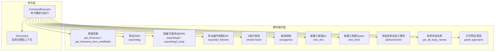
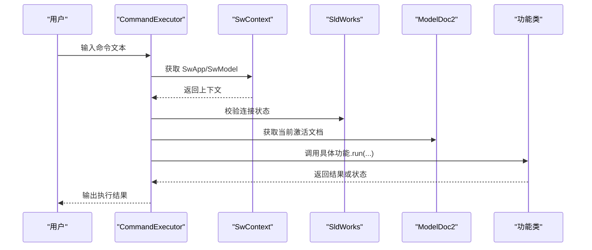
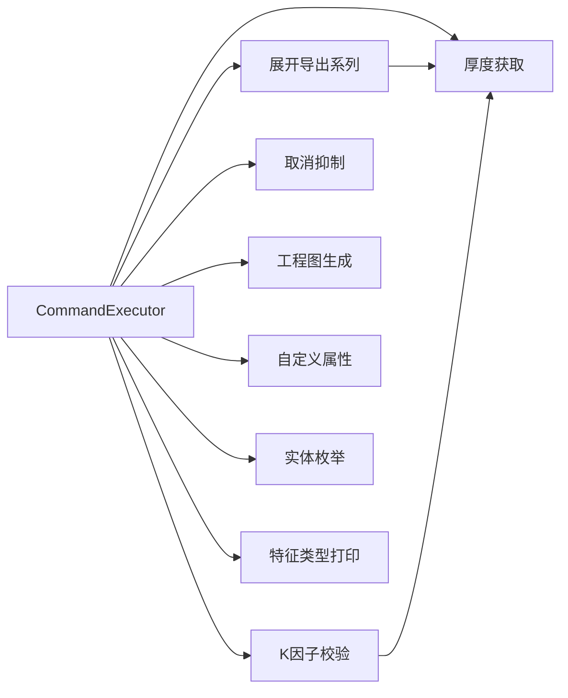

# 零件操作模块

<cite>
**本文引用的文件**
- [exportdwg.cs](file://share/part/exportdwg.cs)
- [exportdwg2.cs](file://share/part/exportdwg2.cs)
- [exportdwg2_body.cs](file://share/part/exportdwg2_body.cs)
- [exportdxf_flatview.cs](file://share/part/exportdxf_flatview.cs)
- [get_thickness.cs](file://share/part/get_thickness.cs)
- [get_thickness_from_solidfolder.cs](file://share/part/get_thickness_from_solidfolder.cs)
- [get_all_body_names.cs](file://share/part/get_all_body_names.cs)
- [getall_typename.cs](file://share/part/getall_typename.cs)
- [checkk-factor.cs](file://share/part/checkk-factor.cs)
- [addname2info.cs](file://share/part/addname2info.cs)
- [new_drw.cs](file://share/part/new_drw.cs)
- [new_drw2.cs](file://share/part/new_drw2.cs)
- [unsuppress.cs](file://share/part/unsuppress.cs)
- [command_executor.cs](file://ctools/command_executor.cs)
- [SwContext.cs](file://ctools/SwContext.cs)
</cite>

## 目录
1. [简介](#简介)
2. [项目结构](#项目结构)
3. [核心组件](#核心组件)
4. [架构总览](#架构总览)
5. [详细组件分析](#详细组件分析)
6. [依赖分析](#依赖分析)
7. [性能考虑](#性能考虑)
8. [故障排查指南](#故障排查指南)
9. [结论](#结论)
10. [附录](#附录)

## 简介
本文件系统性梳理“零件操作模块”的功能与实现，覆盖以下主题：
- 展开图导出（按厚度分组、按展开面导出）
- DXF/DWG 导出（展开视图、下料图）
- 厚度获取（从钣金特征、实体文件夹自定义属性）
- 特征操作（取消抑制、遍历特征树、识别 FlatPattern/OneBend）
- 工程图生成（自动创建视图、保存工程图）
- 关键算法与数据处理流程
- 与其他模块的交互关系与依赖
- 性能优化建议与错误处理策略

## 项目结构
该模块位于 share/part 下，围绕 SolidWorks 零件文档进行读取、分析与输出，典型调用链由命令执行器与上下文管理器驱动。

图表来源
- [command_executor.cs:32-105](file://ctools/command_executor.cs#L32-L105)
- [SwContext.cs:10-84](file://ctools/SwContext.cs#L10-L84)
- [exportdwg.cs:12-77](file://share/part/exportdwg.cs#L12-L77)
- [exportdwg2.cs:15-132](file://share/part/exportdwg2.cs#L15-L132)
- [exportdwg2_body.cs:133-198](file://share/part/exportdwg2_body.cs#L133-L198)
- [exportdxf_flatview.cs:12-64](file://share/part/exportdxf_flatview.cs#L12-L64)
- [get_thickness.cs:12-41](file://share/part/get_thickness.cs#L12-L41)
- [get_thickness_from_solidfolder.cs:13-81](file://share/part/get_thickness_from_solidfolder.cs#L13-L81)
- [checkk-factor.cs:90-143](file://share/part/checkk-factor.cs#L90-L143)
- [unsuppress.cs:11-80](file://share/part/unsuppress.cs#L11-L80)
- [new_drw.cs:12-84](file://share/part/new_drw.cs#L12-L84)
- [new_drw2.cs:12-83](file://share/part/new_drw2.cs#L12-L83)
- [addname2info.cs:11-32](file://share/part/addname2info.cs#L11-L32)
- [get_all_body_names.cs:9-52](file://share/part/get_all_body_names.cs#L9-L52)
- [getall_typename.cs:13-55](file://share/part/getall_typename.cs#L13-L55)

章节来源
- [command_executor.cs:12-115](file://ctools/command_executor.cs#L12-L115)
- [SwContext.cs:9-86](file://ctools/SwContext.cs#L9-L86)

## 核心组件
- 厚度获取
  - 从“SheetMetal”特征直接读取厚度
  - 从“实体文件夹（SolidBodyFolder）”的自定义属性读取厚度
- 展开图导出
  - 整体展开导出 DWG（按厚度分组）
  - 按展开面导出 DWG（自动选择更大投影面）
  - 导出展开视图 DXF（用于下料）
- 特征操作
  - 遍历特征树，识别 FlatPattern、OneBend、UiBend 等
  - 取消抑制展开特征以生成视图
- 工程图生成
  - 自动创建视图、展开视图、平铺展开视图
  - 设置标注精度与箭头样式，保存工程图
- 辅助工具
  - 添加名称自定义属性
  - 枚举实体名称
  - 打印特征类型树
  - K因子校验（针对折弯）

章节来源
- [get_thickness.cs:12-41](file://share/part/get_thickness.cs#L12-L41)
- [get_thickness_from_solidfolder.cs:13-81](file://share/part/get_thickness_from_solidfolder.cs#L13-L81)
- [exportdwg.cs:12-77](file://share/part/exportdwg.cs#L12-L77)
- [exportdwg2.cs:15-132](file://share/part/exportdwg2.cs#L15-L132)
- [exportdwg2_body.cs:133-198](file://share/part/exportdwg2_body.cs#L133-L198)
- [exportdxf_flatview.cs:12-64](file://share/part/exportdxf_flatview.cs#L12-L64)
- [unsuppress.cs:11-80](file://share/part/unsuppress.cs#L11-L80)
- [new_drw.cs:12-84](file://share/part/new_drw.cs#L12-L84)
- [new_drw2.cs:12-83](file://share/part/new_drw2.cs#L12-L83)
- [addname2info.cs:11-32](file://share/part/addname2info.cs#L11-L32)
- [get_all_body_names.cs:9-52](file://share/part/get_all_body_names.cs#L9-L52)
- [getall_typename.cs:13-55](file://share/part/getall_typename.cs#L13-L55)
- [checkk-factor.cs:90-143](file://share/part/checkk-factor.cs#L90-L143)

## 架构总览
命令执行器负责解析用户输入、获取 SolidWorks 实例与当前模型，然后调用各功能类；上下文管理器提供线程安全的全局访问点。

图表来源
- [command_executor.cs:32-105](file://ctools/command_executor.cs#L32-L105)
- [SwContext.cs:29-66](file://ctools/SwContext.cs#L29-L66)

## 详细组件分析

### 展开图导出（整体展开）
- 功能概述
  - 将钣金零件整体展开并导出为 DWG 文件，按厚度分组存储
- 方法签名与参数
  - run(ModelDoc2, string thickness) -> string
- 返回值
  - 成功返回导出文件路径；失败返回空字符串
- 使用场景
  - 自动生成下料图，按厚度分类管理
- 关键步骤
  - 校验文档类型与保存状态
  - 创建“出图/厚度”目录
  - 调用导出接口，写入 DWG
- 错误处理
  - 文档为空、未保存、目录不可用、导出异常均捕获并提示

章节来源
- [exportdwg.cs:12-77](file://share/part/exportdwg.cs#L12-L77)

### 展开图导出（按展开面）
- 功能概述
  - 遍历 FlatPattern 特征，逐个导出展开面至 DWG；若无折弯则自动选择面积更大的投影面
- 方法签名与参数
  - run(ModelDoc2, string thickness) -> bool
- 返回值
  - 至少一次导出成功返回 true
- 使用场景
  - 需要按展开特征分别出图，便于下料排样
- 关键步骤
  - 遍历特征树，识别 FlatPattern
  - 取消抑制展开特征，选择更大投影面，再导出
  - 导出后恢复抑制状态
- 错误处理
  - 异常捕获与提示，确保 SolidWorks 连接正常

章节来源
- [exportdwg2.cs:15-132](file://share/part/exportdwg2.cs#L15-L132)

### 展开图导出（按实体）
- 功能概述
  - 遍历实体，对每个实体内的 FlatPattern 特征导出展开面至 DWG，并记录错误
- 方法签名与参数
  - run(ModelDoc2) -> int（成功导出数量）
  - exportfeature(Body2, ModelDoc2) -> void
- 返回值
  - 成功导出的文件数量
- 使用场景
  - 多实体模型的展开图批量导出
- 关键步骤
  - 获取实体列表
  - 对每个实体定位 SheetMetal 与 FlatPattern 特征
  - 展开后检查模型错误并输出
  - 选择更大投影面并导出
- 错误处理
  - 展开后错误统计与逐条输出

章节来源
- [exportdwg2_body.cs:133-198](file://share/part/exportdwg2_body.cs#L133-L198)

### 展开视图导出（DXF/DWG）
- 功能概述
  - 导出展开视图（用于下料），支持 DXF/DWG 格式
- 方法签名与参数
  - run(ModelDoc2, string thickness) -> string
- 返回值
  - 成功返回导出文件路径；失败返回空字符串
- 使用场景
  - 与外部 CAM/CAD 软件对接，导入展开视图
- 关键步骤
  - 校验文档与保存状态
  - 创建“下料/厚度”目录
  - 调用展开视图导出接口
- 错误处理
  - 异常捕获与提示

章节来源
- [exportdxf_flatview.cs:12-64](file://share/part/exportdxf_flatview.cs#L12-L64)

### 厚度获取
- 从 SheetMetal 特征
  - 方法签名：run(ModelDoc2) -> double
  - 返回值：厚度（毫米，保留两位小数）
  - 使用场景：导出命名、目录组织、K因子校验
- 从实体文件夹自定义属性
  - 方法签名：run(ModelDoc2) -> double
  - 支持属性名：厚度、Thickness、钣金厚度
  - 返回值：厚度（毫米，保留两位小数）
  - 使用场景：无 SheetMetal 特征但有自定义属性的模型

章节来源
- [get_thickness.cs:12-41](file://share/part/get_thickness.cs#L12-L41)
- [get_thickness_from_solidfolder.cs:13-81](file://share/part/get_thickness_from_solidfolder.cs#L13-L81)

### 特征操作与遍历
- 取消抑制展开特征
  - 方法签名：run(ModelDoc2) -> void
  - 使用场景：确保展开视图可生成
- 遍历特征树并打印类型
  - 方法签名：run(ModelDoc2) -> double
  - 使用场景：诊断模型结构、定位 FlatPattern/OneBend
- 枚举实体名称
  - 方法签名：run(ModelDoc2) -> double
  - 使用场景：确认多实体模型的实体清单

章节来源
- [unsuppress.cs:11-80](file://share/part/unsuppress.cs#L11-L80)
- [getall_typename.cs:13-55](file://share/part/getall_typename.cs#L13-L55)
- [get_all_body_names.cs:9-52](file://share/part/get_all_body_names.cs#L9-L52)

### K因子校验
- 功能概述
  - 遍历 OneBend 折弯特征，根据半径、角度、类型与厚度校验 K 因子设置
- 方法签名与参数
  - run(SldWorks, ModelDoc2) -> int
  - 内部方法：Process_OneBend(...)、Process_CustomBendAllowance(...)
- 返回值
  - 0（表示执行完成）
- 使用场景
  - 质量控制，确保折弯参数符合规范
- 关键规则
  - 大半径（≥3.5mm）必须使用 Type=2 且 KFactor=0.5
  - 非90度折弯需满足 KFactor≈0.35
  - Type=4 与 Type=3 的扣除/补偿范围与厚度、半径相关
- 错误处理
  - 逐一输出不符合项及原因

章节来源
- [checkk-factor.cs:90-143](file://share/part/checkk-factor.cs#L90-L143)

### 工程图生成
- 新建工程图（A4 模板）
  - 方法签名：run(SldWorks, ModelDoc2) -> void
  - 使用场景：自动生成包含上视、展开视图、平铺展开视图的工程图
- 新建工程图（Space 模板）
  - 方法签名：run(SldWorks, ModelDoc2) -> void
  - 使用场景：不同模板风格的工程图生成
- 关键步骤
  - 判断工程图是否存在，存在则打开
  - 不存在则新建并设置标注精度与箭头样式
  - 生成视图并保存

章节来源
- [new_drw.cs:12-84](file://share/part/new_drw.cs#L12-L84)
- [new_drw2.cs:12-83](file://share/part/new_drw2.cs#L12-L83)

### 辅助功能
- 添加名称自定义属性
  - 方法签名：run(ModelDoc2) -> void
  - 使用场景：统一文档元信息，便于后续处理
- 展开图导出（旧版）
  - 方法签名：run(ModelDoc2, string thickness) -> string
  - 使用场景：兼容历史版本或特定流程

章节来源
- [addname2info.cs:11-32](file://share/part/addname2info.cs#L11-L32)
- [exportdwg.cs:12-77](file://share/part/exportdwg.cs#L12-L77)

## 依赖分析
- 组件耦合
  - 功能类之间低耦合，主要通过 SolidWorks 对象（ModelDoc2、PartDoc、DrawingDoc、Feature 等）交互
  - 厚度获取被多个导出流程复用
- 外部依赖
  - SolidWorks Interop 接口
  - 文件系统 IO（目录创建、文件保存）
- 潜在循环依赖
  - 无直接循环依赖；命令执行器与上下文管理器为通用基础设施

图表来源
- [command_executor.cs:32-105](file://ctools/command_executor.cs#L32-L105)
- [get_thickness.cs:12-41](file://share/part/get_thickness.cs#L12-L41)
- [exportdwg2.cs:15-132](file://share/part/exportdwg2.cs#L15-L132)
- [checkk-factor.cs:90-143](file://share/part/checkk-factor.cs#L90-L143)
- [unsuppress.cs:11-80](file://share/part/unsuppress.cs#L11-L80)
- [new_drw.cs:12-84](file://share/part/new_drw.cs#L12-L84)
- [addname2info.cs:11-32](file://share/part/addname2info.cs#L11-L32)
- [get_all_body_names.cs:9-52](file://share/part/get_all_body_names.cs#L9-L52)
- [getall_typename.cs:13-55](file://share/part/getall_typename.cs#L13-L55)

## 性能考虑
- 批量导出优化
  - 在导出前统一计算并缓存厚度、目录路径，避免重复 IO
  - 对多实体模型，优先按实体分组导出，减少无效展开
- 展开与选择
  - 仅在需要时取消抑制展开特征，导出后立即恢复抑制，降低模型重建成本
- 日志与诊断
  - 使用轻量级日志输出，避免频繁磁盘写入
- 并发与线程
  - 上下文管理器采用锁保护，避免多线程并发访问导致的状态不一致

## 故障排查指南
- “未连接 SolidWorks”
  - 检查命令执行器是否能获取 SldWorks 实例
  - 确认 SolidWorks 已启动且处于可访问状态
- “文档未保存”
  - 导出前必须保存模型，否则无法获取路径与目录
- “找不到板厚信息”
  - 若无 SheetMetal 特征，检查实体文件夹自定义属性是否存在厚度字段
- “展开后模型存在错误”
  - 导出前检查展开状态，必要时手动修复几何问题
- “导出失败或无文件”
  - 检查目标目录权限与磁盘空间，确认导出选项与格式支持

章节来源
- [command_executor.cs:60-94](file://ctools/command_executor.cs#L60-L94)
- [exportdwg.cs:14-38](file://share/part/exportdwg.cs#L14-L38)
- [exportdwg2_body.cs:53-70](file://share/part/exportdwg2_body.cs#L53-L70)
- [get_thickness_from_solidfolder.cs:72-81](file://share/part/get_thickness_from_solidfolder.cs#L72-L81)

## 结论
该模块围绕 SolidWorks 零件文档提供了完整的“厚度获取—展开导出—工程图生成—特征校验”闭环能力。通过命令执行器与上下文管理器解耦了业务逻辑与环境接入，具备良好的扩展性与可维护性。建议在生产环境中结合日志与错误统计完善自动化流程，并持续优化批量导出与模型重建性能。

## 附录
- 常见操作模式示例（以路径代替代码）
  - 获取厚度并导出 DWG：[get_thickness.cs:12-41](file://share/part/get_thickness.cs#L12-L41) → [exportdwg.cs:12-77](file://share/part/exportdwg.cs#L12-L77)
  - 按展开面导出：[exportdwg2.cs:15-132](file://share/part/exportdwg2.cs#L15-L132)
  - 按实体导出并检查错误：[exportdwg2_body.cs:133-198](file://share/part/exportdwg2_body.cs#L133-L198)
  - 导出展开视图 DXF：[exportdxf_flatview.cs:12-64](file://share/part/exportdxf_flatview.cs#L12-L64)
  - 取消抑制展开特征：[unsuppress.cs:11-80](file://share/part/unsuppress.cs#L11-L80)
  - 新建工程图：[new_drw.cs:12-84](file://share/part/new_drw.cs#L12-L84) / [new_drw2.cs:12-83](file://share/part/new_drw2.cs#L12-L83)
  - K因子校验：[checkk-factor.cs:90-143](file://share/part/checkk-factor.cs#L90-L143)
  - 添加名称自定义属性：[addname2info.cs:11-32](file://share/part/addname2info.cs#L11-L32)
  - 枚举实体与打印特征类型：[get_all_body_names.cs:9-52](file://share/part/get_all_body_names.cs#L9-L52) / [getall_typename.cs:13-55](file://share/part/getall_typename.cs#L13-L55)