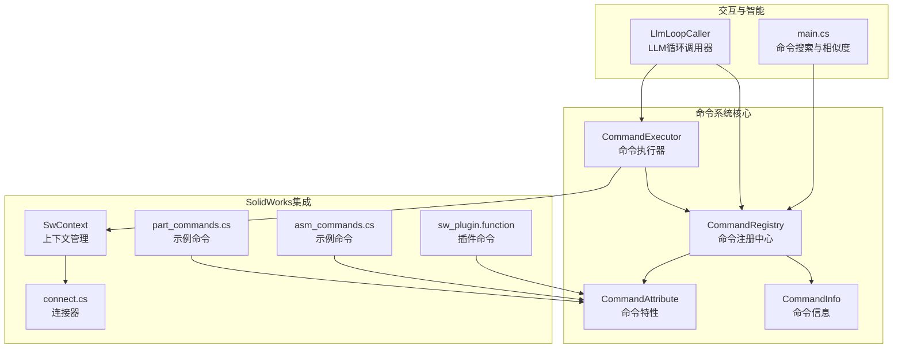
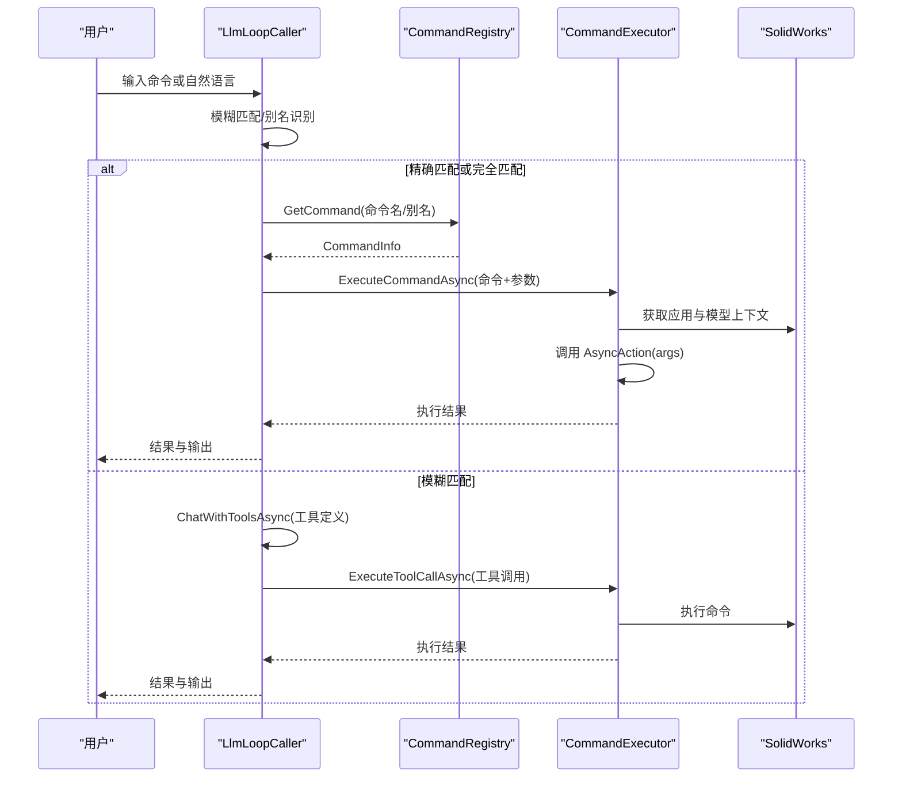
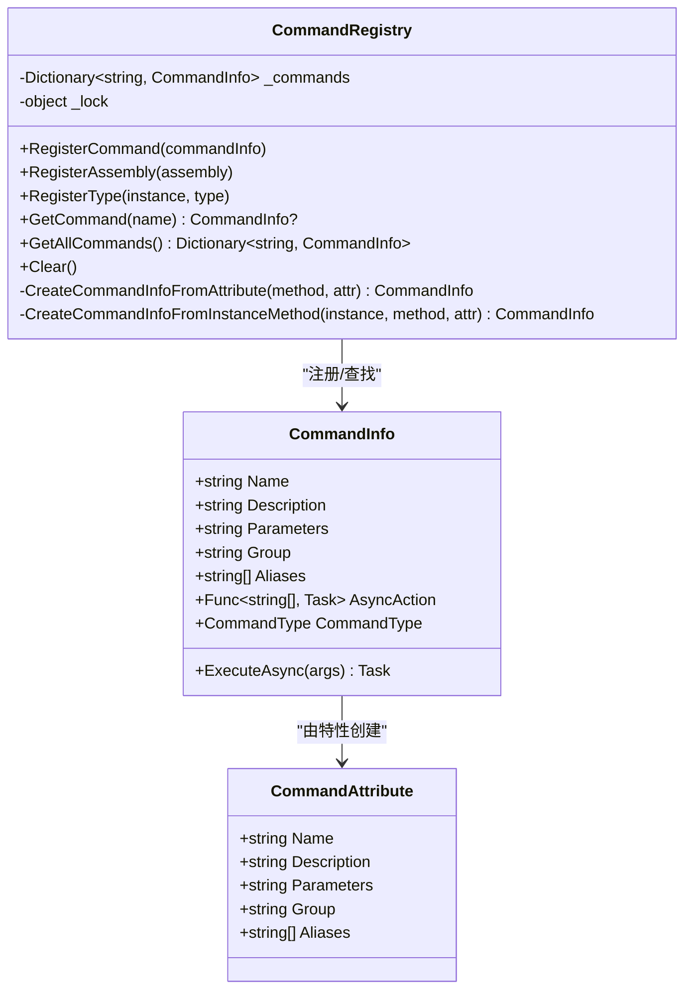
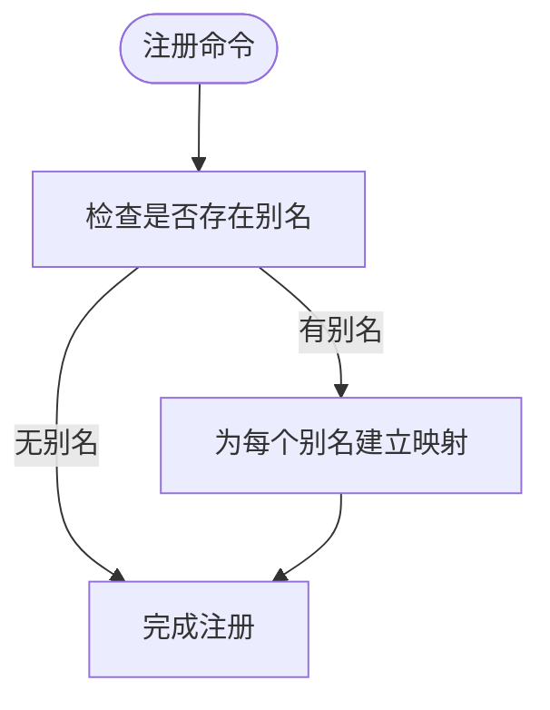
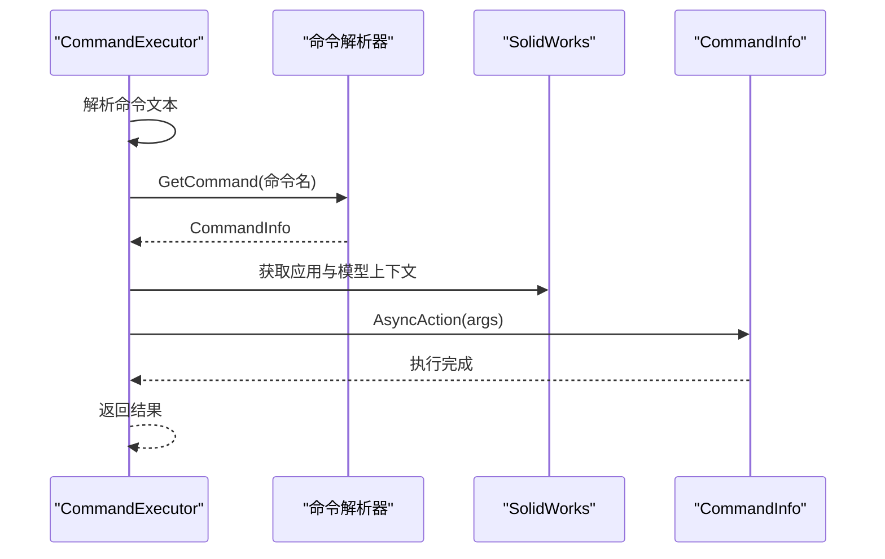
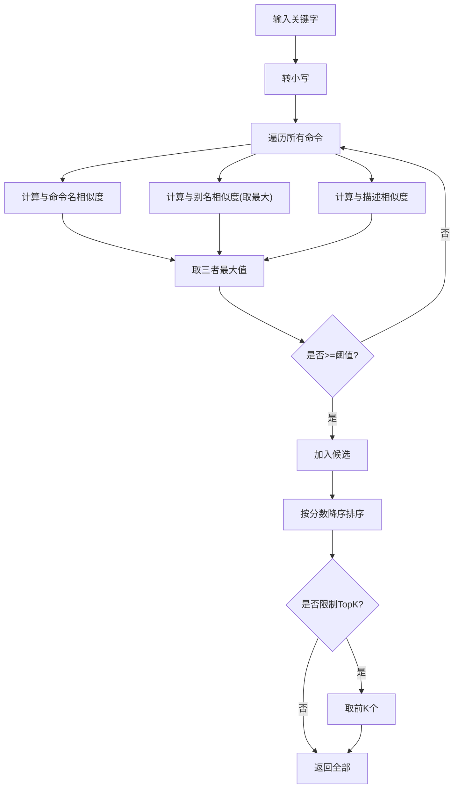
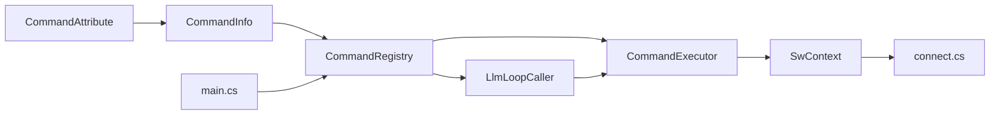

# 命令发现与匹配

<cite>
**本文档引用的文件**
- [CommandRegistry.cs](file://ctools/CommandRegistry.cs)
- [CommandInfo.cs](file://ctools/CommandInfo.cs)
- [CommandAttribute.cs](file://ctools/CommandAttribute.cs)
- [command_executor.cs](file://ctools/command_executor.cs)
- [main.cs](file://ctools/main.cs)
- [llm_loop_caller.cs](file://ctools/llm_loop_caller.cs)
- [SwContext.cs](file://ctools/SwContext.cs)
- [connect.cs](file://ctools/connect.cs)
- [part_commands.cs](file://ctools/solidworks_commands/part_commands.cs)
- [asm_commands.cs](file://ctools/solidworks_commands/asm_commands.cs)
- [CommandAttribute.cs](file://sw_plugin/CommandAttribute.cs)
- [function.cs](file://sw_plugin/function.cs)
- [similarity_calculator.cs](file://share/train/similarity_calculator.cs)
</cite>

## 目录
1. [简介](#简介)
2. [项目结构](#项目结构)
3. [核心组件](#核心组件)
4. [架构总览](#架构总览)
5. [详细组件分析](#详细组件分析)
6. [依赖关系分析](#依赖关系分析)
7. [性能考虑](#性能考虑)
8. [故障排除指南](#故障排除指南)
9. [结论](#结论)
10. [附录](#附录)

## 简介
本技术文档聚焦于命令发现与匹配功能，系统性阐述命令查找机制（精确匹配与模糊搜索）、命令别名系统、命令分组与分类查找、相似度计算与自动补全的技术实现，并提供使用示例与性能优化建议。读者无需深入编程背景即可理解命令系统的发现机制与最佳实践。

## 项目结构
该仓库围绕命令系统分为以下关键模块：
- 命令注册与发现：CommandRegistry、CommandInfo、CommandAttribute
- 命令执行：CommandExecutor
- 交互与智能匹配：LlmLoopCaller、main.cs 中的搜索与相似度计算
- SolidWorks 上下文：SwContext、connect
- 示例命令：part_commands、asm_commands
- 插件命令：sw_plugin.function 中的 [Command] 特性

**图表来源**
- [CommandRegistry.cs:12-242](file://ctools/CommandRegistry.cs#L12-L242)
- [CommandInfo.cs:17-40](file://ctools/CommandInfo.cs#L17-L40)
- [CommandAttribute.cs:5-19](file://ctools/CommandAttribute.cs#L5-L19)
- [command_executor.cs:12-116](file://ctools/command_executor.cs#L12-L116)
- [llm_loop_caller.cs:19-800](file://ctools/llm_loop_caller.cs#L19-L800)
- [main.cs:34-377](file://ctools/main.cs#L34-L377)
- [SwContext.cs:9-87](file://ctools/SwContext.cs#L9-L87)
- [connect.cs:9-56](file://ctools/connect.cs#L9-L56)
- [part_commands.cs:11-149](file://ctools/solidworks_commands/part_commands.cs#L11-L149)
- [asm_commands.cs:11-158](file://ctools/solidworks_commands/asm_commands.cs#L11-L158)
- [function.cs:29-663](file://sw_plugin/function.cs#L29-L663)

**章节来源**
- [CommandRegistry.cs:12-242](file://ctools/CommandRegistry.cs#L12-L242)
- [CommandInfo.cs:17-40](file://ctools/CommandInfo.cs#L17-L40)
- [CommandAttribute.cs:5-19](file://ctools/CommandAttribute.cs#L5-L19)
- [command_executor.cs:12-116](file://ctools/command_executor.cs#L12-L116)
- [llm_loop_caller.cs:19-800](file://ctools/llm_loop_caller.cs#L19-L800)
- [main.cs:34-377](file://ctools/main.cs#L34-L377)
- [SwContext.cs:9-87](file://ctools/SwContext.cs#L9-L87)
- [connect.cs:9-56](file://ctools/connect.cs#L9-L56)
- [part_commands.cs:11-149](file://ctools/solidworks_commands/part_commands.cs#L11-L149)
- [asm_commands.cs:11-158](file://ctools/solidworks_commands/asm_commands.cs#L11-L158)
- [function.cs:29-663](file://sw_plugin/function.cs#L29-L663)

## 核心组件
- 命令注册中心（CommandRegistry）：单例模式，负责命令注册、别名映射、命令查找与批量注册（反射扫描特性）
- 命令信息（CommandInfo）：封装命令元数据（名称、描述、参数、分组、别名、执行动作、同步/异步类型）
- 命令特性（CommandAttribute）：声明命令元数据（名称、描述、参数、分组、别名）
- 命令执行器（CommandExecutor）：解析命令文本、解析参数、连接 SolidWorks、执行命令
- 交互与智能（LlmLoopCaller）：基于工具定义的 LLM 调用，支持模糊匹配、别名识别、确认执行
- 搜索与相似度（main.cs）：命令搜索、Levenshtein 相似度、字符集重叠度综合评分

**章节来源**
- [CommandRegistry.cs:12-242](file://ctools/CommandRegistry.cs#L12-L242)
- [CommandInfo.cs:17-40](file://ctools/CommandInfo.cs#L17-L40)
- [CommandAttribute.cs:5-19](file://ctools/CommandAttribute.cs#L5-L19)
- [command_executor.cs:12-116](file://ctools/command_executor.cs#L12-L116)
- [llm_loop_caller.cs:19-800](file://ctools/llm_loop_caller.cs#L19-L800)
- [main.cs:34-377](file://ctools/main.cs#L34-L377)

## 架构总览
命令系统采用“特性驱动注册 + 注册中心统一管理 + 执行器统一调度”的架构。命令通过特性声明，注册中心统一收集并建立名称与别名到命令信息的映射；执行器负责解析命令文本、参数与上下文；智能匹配模块负责模糊搜索与别名识别。

**图表来源**
- [llm_loop_caller.cs:493-726](file://ctools/llm_loop_caller.cs#L493-L726)
- [CommandRegistry.cs:113-131](file://ctools/CommandRegistry.cs#L113-L131)
- [command_executor.cs:32-113](file://ctools/command_executor.cs#L32-L113)

## 详细组件分析

### 命令注册与发现（CommandRegistry）
- 单例模式：确保全局唯一命令注册中心
- 注册方式：
  - RegisterCommand：注册单个命令，同时为别名建立映射
  - RegisterAssembly：反射扫描静态方法上的 CommandAttribute，批量注册
  - RegisterType：扫描实例方法上的 CommandAttribute，支持插件场景
- 查找机制：GetCommand 支持大小写不敏感的精确查找，内部维护名称与别名到 CommandInfo 的字典映射
- 并发安全：使用锁保护字典操作，保证线程安全

**图表来源**
- [CommandRegistry.cs:12-242](file://ctools/CommandRegistry.cs#L12-L242)
- [CommandInfo.cs:17-40](file://ctools/CommandInfo.cs#L17-L40)
- [CommandAttribute.cs:5-19](file://ctools/CommandAttribute.cs#L5-L19)

**章节来源**
- [CommandRegistry.cs:12-242](file://ctools/CommandRegistry.cs#L12-L242)
- [CommandInfo.cs:17-40](file://ctools/CommandInfo.cs#L17-L40)
- [CommandAttribute.cs:5-19](file://ctools/CommandAttribute.cs#L5-L19)

### 命令别名系统
- 别名注册：在 RegisterCommand 中，若存在别名数组，则为每个别名建立到同一 CommandInfo 的映射
- 别名使用：GetCommand 支持通过别名查找命令，实现“多入口”访问
- 工具定义扩展：LlmLoopCaller 在构建工具定义时，为每个命令别名生成独立的工具函数，提升 LLM 对别名的识别能力

**图表来源**
- [CommandRegistry.cs:43-54](file://ctools/CommandRegistry.cs#L43-L54)
- [llm_loop_caller.cs:149-169](file://ctools/llm_loop_caller.cs#L149-L169)

**章节来源**
- [CommandRegistry.cs:43-54](file://ctools/CommandRegistry.cs#L43-L54)
- [llm_loop_caller.cs:149-169](file://ctools/llm_loop_caller.cs#L149-L169)

### 命令分组与分类查找
- 分组字段：CommandAttribute.Group 与 CommandInfo.Group 用于命令分组
- 分类展示：main.cs 中的命令描述生成与帮助输出按 Group 排序展示
- 分类搜索：LlmLoopCaller 在模糊匹配时，会比较命令名称、别名与描述，从而间接实现“按描述/名称”的分类效果

**章节来源**
- [CommandAttribute.cs:11-12](file://ctools/CommandAttribute.cs#L11-L12)
- [CommandInfo.cs:22-23](file://ctools/CommandInfo.cs#L22-L23)
- [main.cs:114-168](file://ctools/main.cs#L114-L168)
- [llm_loop_caller.cs:433-488](file://ctools/llm_loop_caller.cs#L433-L488)

### 命令执行与上下文
- 命令解析：CommandExecutor.ExecuteCommandAsync 解析命令文本，拆分命令名与参数
- 上下文获取：通过 SwContext 获取 SolidWorks 应用与当前激活文档，必要时通过 IActiveDoc2 获取
- 执行调用：调用 CommandInfo.AsyncAction(args)，支持同步与异步命令

**图表来源**
- [command_executor.cs:32-113](file://ctools/command_executor.cs#L32-L113)
- [SwContext.cs:71-75](file://ctools/SwContext.cs#L71-L75)

**章节来源**
- [command_executor.cs:32-113](file://ctools/command_executor.cs#L32-L113)
- [SwContext.cs:71-75](file://ctools/SwContext.cs#L71-L75)

### 模糊搜索与相似度计算
- 精确匹配：优先检查“命令名 + 参数”格式，完全匹配则直接执行
- 模糊匹配：计算与命令名、别名、描述的相似度，阈值过滤后返回最高分命令
- 相似度算法：
  - Levenshtein 比率：衡量编辑距离与长度的关系
  - 字符集重叠度：计算查询词与目标词字符集合的交集占比
  - 综合评分：0.6 × 比率 + 0.4 × 重叠度
- 搜索接口：main.cs.SearchCommands 提供关键字搜索与阈值控制

**图表来源**
- [llm_loop_caller.cs:387-488](file://ctools/llm_loop_caller.cs#L387-L488)
- [main.cs:313-374](file://ctools/main.cs#L313-L374)

**章节来源**
- [llm_loop_caller.cs:291-355](file://ctools/llm_loop_caller.cs#L291-L355)
- [main.cs:255-311](file://ctools/main.cs#L255-L311)
- [llm_loop_caller.cs:387-488](file://ctools/llm_loop_caller.cs#L387-L488)
- [main.cs:313-374](file://ctools/main.cs#L313-L374)

### 自动补全与工具调用
- 工具定义：LlmLoopCaller.BuildToolDefinitions 为每个命令（含别名）生成工具函数定义
- 调用流程：ChatWithToolsAsync 返回 ToolCall，ExecuteToolCallAsync 解析函数名与参数，调用 CommandExecutor 执行
- 用户确认：支持确认/自动两种模式，减少误执行风险

**章节来源**
- [llm_loop_caller.cs:117-172](file://ctools/llm_loop_caller.cs#L117-L172)
- [llm_loop_caller.cs:177-288](file://ctools/llm_loop_caller.cs#L177-L288)

### 示例命令与插件集成
- 示例命令：part_commands.cs、asm_commands.cs 通过 CommandAttribute 声明命令，包含描述、参数、分组与别名
- 插件命令：sw_plugin.function 中的 [Command] 特性（不同命名空间）用于 SolidWorks 插件命令声明
- 注册方式：CommandRegistry.RegisterAssembly 与 RegisterType 支持从程序集与实例方法批量注册

**章节来源**
- [part_commands.cs:11-149](file://ctools/solidworks_commands/part_commands.cs#L11-L149)
- [asm_commands.cs:11-158](file://ctools/solidworks_commands/asm_commands.cs#L11-L158)
- [CommandAttribute.cs:9-26](file://sw_plugin/CommandAttribute.cs#L9-L26)
- [function.cs:29-663](file://sw_plugin/function.cs#L29-L663)

## 依赖关系分析
- CommandRegistry 依赖 CommandInfo 与 CommandAttribute
- CommandExecutor 依赖 CommandRegistry 与 SwContext
- LlmLoopCaller 依赖 CommandRegistry、CommandExecutor、命令描述生成器
- main.cs 提供命令搜索与相似度计算，依赖 CommandRegistry
- SwContext 依赖 connect.cs 提供的 SolidWorks 连接能力

**图表来源**
- [CommandRegistry.cs:12-242](file://ctools/CommandRegistry.cs#L12-L242)
- [CommandInfo.cs:17-40](file://ctools/CommandInfo.cs#L17-L40)
- [CommandAttribute.cs:5-19](file://ctools/CommandAttribute.cs#L5-L19)
- [command_executor.cs:12-116](file://ctools/command_executor.cs#L12-L116)
- [llm_loop_caller.cs:19-800](file://ctools/llm_loop_caller.cs#L19-L800)
- [SwContext.cs:9-87](file://ctools/SwContext.cs#L9-L87)
- [connect.cs:9-56](file://ctools/connect.cs#L9-L56)
- [main.cs:34-377](file://ctools/main.cs#L34-L377)

**章节来源**
- [CommandRegistry.cs:12-242](file://ctools/CommandRegistry.cs#L12-L242)
- [command_executor.cs:12-116](file://ctools/command_executor.cs#L12-L116)
- [llm_loop_caller.cs:19-800](file://ctools/llm_loop_caller.cs#L19-L800)
- [SwContext.cs:9-87](file://ctools/SwContext.cs#L9-L87)
- [connect.cs:9-56](file://ctools/connect.cs#L9-L56)
- [main.cs:34-377](file://ctools/main.cs#L34-L377)

## 性能考虑
- 相似度计算复杂度：Levenshtein 距离矩阵 O(nm)，其中 n、m 为两字符串长度；整体遍历命令列表的时间复杂度为 O(Knm)，K 为命令总数
- 优化建议：
  - 命令列表较大时，使用前缀索引或倒排索引加速精确匹配
  - 模糊匹配阈值与 TopK 限制可降低排序与输出成本
  - 异步命令（CommandType.Async）避免阻塞 UI 线程
  - 使用缓存存储常用命令描述与相似度结果
  - 在 LLM 调用前进行预过滤，减少无效工具调用

[本节为通用性能指导，不直接分析具体文件]

## 故障排除指南
- 命令未找到：检查命令名称与别名是否正确注册；确认 CommandRegistry.GetCommand 返回值
- 执行异常：CommandExecutor 捕获 TargetInvocationException 与普通异常，打印详细错误信息
- SolidWorks 未连接：CommandExecutor 在执行前检查 SwContext，提示未连接
- LLM 未触发工具调用：检查命令描述与用户输入的匹配度，适当提高阈值或明确命令名称

**章节来源**
- [command_executor.cs:107-112](file://ctools/command_executor.cs#L107-L112)
- [CommandRegistry.cs:184-194](file://ctools/CommandRegistry.cs#L184-L194)
- [llm_loop_caller.cs:645-651](file://ctools/llm_loop_caller.cs#L645-L651)

## 结论
命令发现与匹配系统通过特性驱动注册、统一注册中心、别名映射与智能模糊匹配，实现了高效、可扩展的命令发现机制。结合 LLM 工具调用与用户确认流程，既提升了易用性，又保障了安全性。建议在大规模命令场景下引入索引与缓存策略，持续优化相似度计算与阈值配置，以获得更好的用户体验与性能表现。

[本节为总结性内容，不直接分析具体文件]

## 附录

### 使用示例
- 直接执行命令：在交互模式中输入命令名与参数，例如“导出当前零件”
- 模糊匹配：输入自然语言描述，系统自动识别并调用最接近的命令
- 别名使用：通过别名快速访问命令，如“bodyname”
- 分组查看：通过帮助输出查看命令分组与参数说明

**章节来源**
- [llm_loop_caller.cs:493-726](file://ctools/llm_loop_caller.cs#L493-L726)
- [main.cs:148-168](file://ctools/main.cs#L148-L168)
- [part_commands.cs:21-27](file://ctools/solidworks_commands/part_commands.cs#L21-L27)

### 相关算法参考
- 相似度计算与自动补全：参见 main.cs 与 lmm_loop_caller.cs 中的相似度实现
- 拓扑相似度（训练模块）：SimilarityCalculator 提供基于图核的相似度计算，可用于高级场景

**章节来源**
- [main.cs:255-311](file://ctools/main.cs#L255-L311)
- [llm_loop_caller.cs:291-355](file://ctools/llm_loop_caller.cs#L291-L355)
- [similarity_calculator.cs:112-128](file://share/train/similarity_calculator.cs#L112-L128)