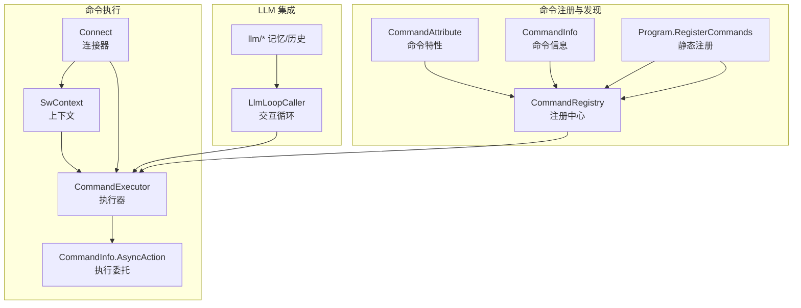
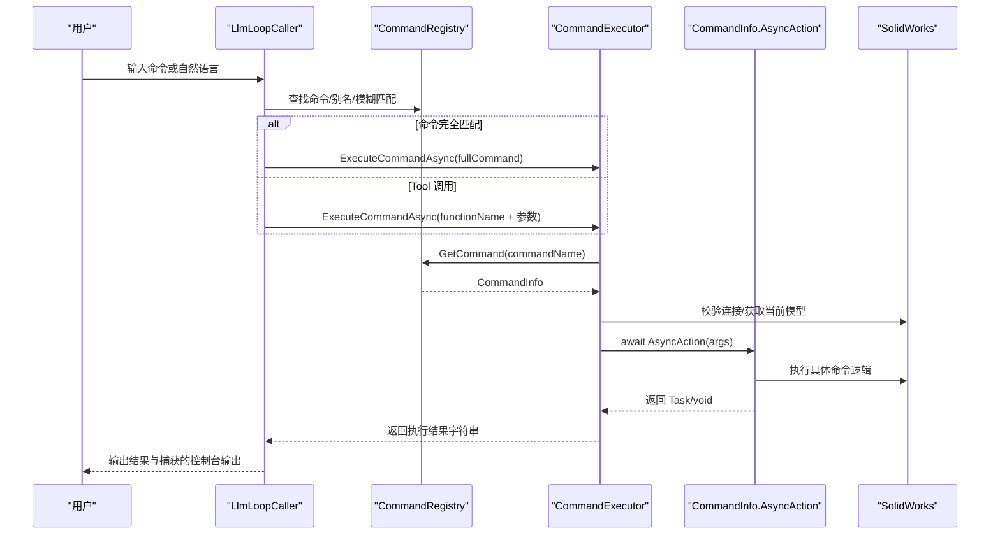
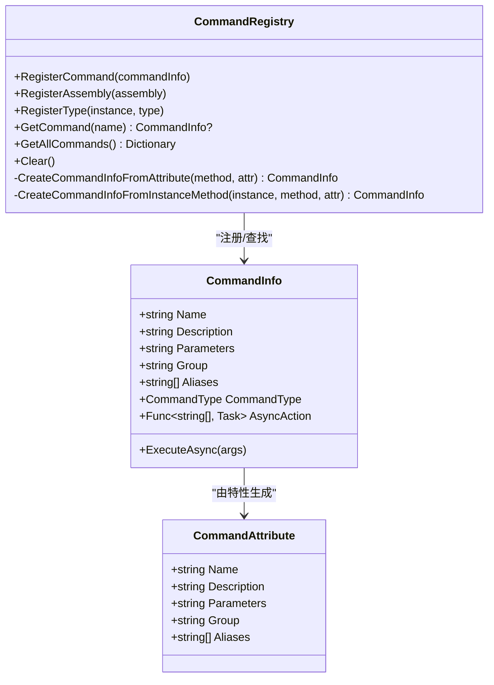
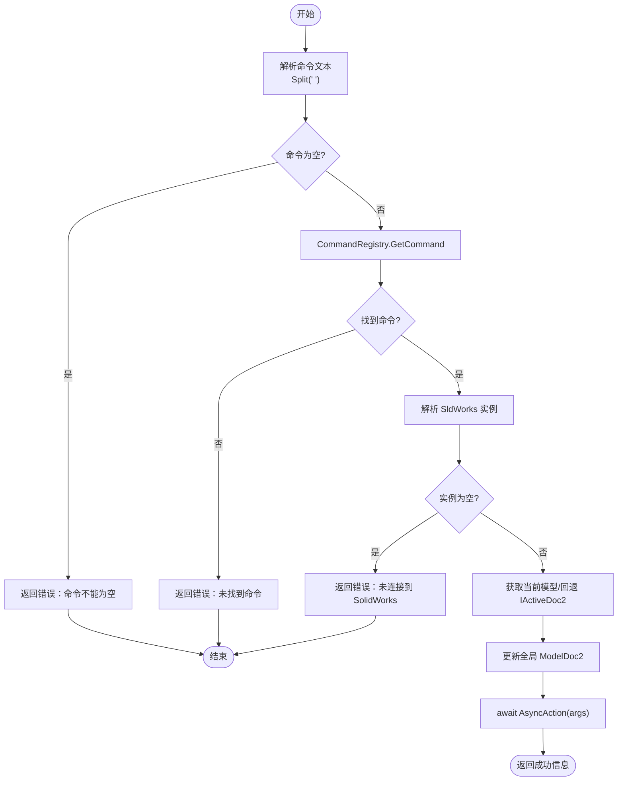
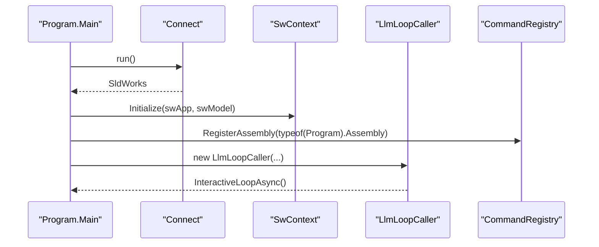
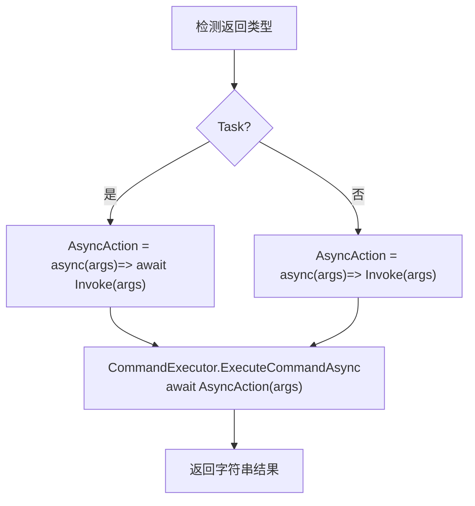
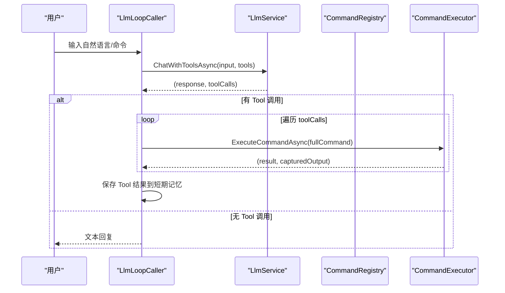
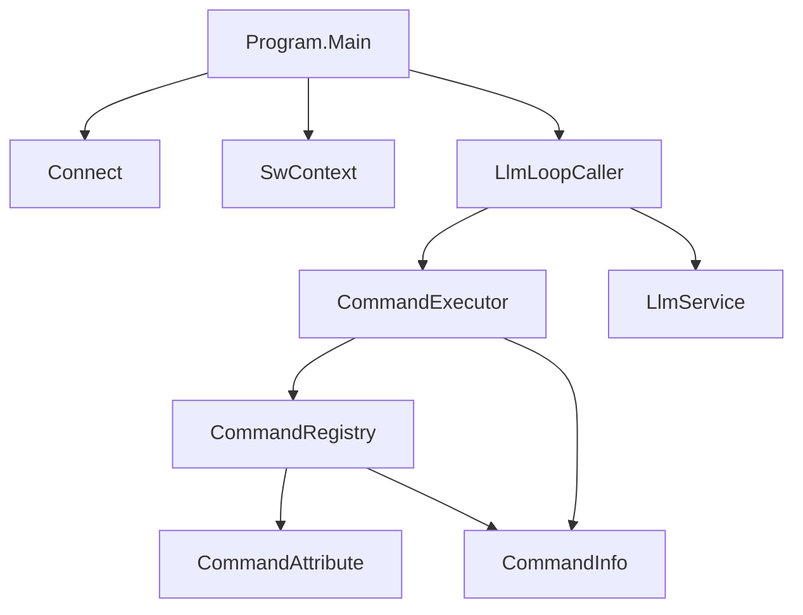

# 命令执行流程

<cite>
**本文引用的文件**
- [command_executor.cs](file://ctools/command_executor.cs)
- [CommandRegistry.cs](file://ctools/CommandRegistry.cs)
- [CommandInfo.cs](file://ctools/CommandInfo.cs)
- [CommandAttribute.cs](file://ctools/CommandAttribute.cs)
- [main.cs](file://ctools/main.cs)
- [part_commands.cs](file://ctools/solidworks_commands/part_commands.cs)
- [asm_commands.cs](file://ctools/solidworks_commands/asm_commands.cs)
- [connect.cs](file://ctools/connect.cs)
- [SwContext.cs](file://ctools/SwContext.cs)
- [llm_loop_caller.cs](file://ctools/llm_loop_caller.cs)
</cite>

## 目录
1. [简介](#简介)
2. [项目结构](#项目结构)
3. [核心组件](#核心组件)
4. [架构总览](#架构总览)
5. [详细组件分析](#详细组件分析)
6. [依赖关系分析](#依赖关系分析)
7. [性能考量](#性能考量)
8. [故障排查指南](#故障排查指南)
9. [结论](#结论)
10. [附录](#附录)

## 简介
本文件面向“命令执行流程”的技术文档，系统阐述从命令解析到实际执行的完整链路，重点覆盖以下方面：
- 命令解析与参数传递机制
- 同步命令与异步命令的执行差异及 Task 返回类型的处理
- 命令注册、发现与调用的实现细节
- 错误处理与异常捕获策略
- 交互式 LLM 驱动下的命令执行流程与确认机制
- 执行流程图与时序图，帮助读者快速定位关键节点

## 项目结构
ctools 子项目围绕“命令注册—命令解析—命令执行—上下文管理—LLM 集成”形成闭环。关键模块如下：
- 命令注册与发现：CommandRegistry、CommandAttribute、CommandInfo
- 命令执行器：CommandExecutor
- 主入口与命令注册：Program.Main、RegisterCommands
- SolidWorks 连接与上下文：Connect、SwContext
- LLM 集成与交互：LlmLoopCaller
- 典型命令实现：solidworks_commands/*.cs

图表来源
- [CommandRegistry.cs:12-242](file://ctools/CommandRegistry.cs#L12-L242)
- [CommandAttribute.cs:5-18](file://ctools/CommandAttribute.cs#L5-L18)
- [CommandInfo.cs:17-41](file://ctools/CommandInfo.cs#L17-L41)
- [main.cs:170-253](file://ctools/main.cs#L170-L253)
- [command_executor.cs:12-116](file://ctools/command_executor.cs#L12-L116)
- [SwContext.cs:9-87](file://ctools/SwContext.cs#L9-L87)
- [connect.cs:9-56](file://ctools/connect.cs#L9-L56)
- [llm_loop_caller.cs:19-67](file://ctools/llm_loop_caller.cs#L19-L67)

章节来源
- [CommandRegistry.cs:12-242](file://ctools/CommandRegistry.cs#L12-L242)
- [CommandAttribute.cs:5-18](file://ctools/CommandAttribute.cs#L5-L18)
- [CommandInfo.cs:17-41](file://ctools/CommandInfo.cs#L17-L41)
- [main.cs:170-253](file://ctools/main.cs#L170-L253)
- [command_executor.cs:12-116](file://ctools/command_executor.cs#L12-L116)
- [SwContext.cs:9-87](file://ctools/SwContext.cs#L9-L87)
- [connect.cs:9-56](file://ctools/connect.cs#L9-L56)
- [llm_loop_caller.cs:19-67](file://ctools/llm_loop_caller.cs#L19-L67)

## 核心组件
- 命令特性与信息
  - CommandAttribute：声明命令名称、描述、参数、分组、别名等元数据
  - CommandInfo：封装命令名称、描述、参数、分组、别名、执行委托、命令类型（同步/异步）
- 命令注册中心
  - CommandRegistry：单例注册中心，支持从静态方法与实例方法反射注册命令；提供命令查找、别名映射、并发安全
- 命令执行器
  - CommandExecutor：负责命令文本解析、命令查找、SolidWorks 连接校验、当前模型更新、调用 CommandInfo.AsyncAction
- 主入口与命令注册
  - Program.Main：初始化连接、上下文、LLM 循环；注册命令
  - RegisterCommands：扫描 Program 中带 Command 特性的静态方法，构建 CommandInfo 并生成 AsyncAction
- SolidWorks 连接与上下文
  - Connect：获取或创建 SldWorks 实例
  - SwContext：全局持有 SldWorks 与当前 ModelDoc2，提供线程安全访问
- LLM 集成
  - LlmLoopCaller：交互式循环，支持 Tool 调用模式，将命令转为工具定义，执行前可要求用户确认

章节来源
- [CommandAttribute.cs:5-18](file://ctools/CommandAttribute.cs#L5-L18)
- [CommandInfo.cs:17-41](file://ctools/CommandInfo.cs#L17-L41)
- [CommandRegistry.cs:12-242](file://ctools/CommandRegistry.cs#L12-L242)
- [main.cs:170-253](file://ctools/main.cs#L170-L253)
- [command_executor.cs:12-116](file://ctools/command_executor.cs#L12-L116)
- [connect.cs:9-56](file://ctools/connect.cs#L9-L56)
- [SwContext.cs:9-87](file://ctools/SwContext.cs#L9-L87)
- [llm_loop_caller.cs:19-67](file://ctools/llm_loop_caller.cs#L19-L67)

## 架构总览
命令执行的整体流程分为三层：
- 解析层：从用户输入解析命令名与参数，支持完全匹配与模糊匹配
- 注册层：通过反射注册命令，建立命令名到 CommandInfo 的映射
- 执行层：校验环境、更新上下文、调用 AsyncAction，统一返回字符串结果

图表来源
- [llm_loop_caller.cs:493-726](file://ctools/llm_loop_caller.cs#L493-L726)
- [command_executor.cs:32-113](file://ctools/command_executor.cs#L32-L113)
- [CommandRegistry.cs:113-131](file://ctools/CommandRegistry.cs#L113-L131)
- [CommandInfo.cs:29-38](file://ctools/CommandInfo.cs#L29-L38)

## 详细组件分析

### 命令注册与发现（CommandRegistry）
- 注册方式
  - RegisterAssembly：扫描程序集中的静态方法，提取 CommandAttribute，判断返回类型为 Task 或 void，生成 CommandInfo 与 AsyncAction
  - RegisterType：扫描实例方法（插件场景），同上
- 命令类型判定
  - 若方法返回 Task，则标记为异步命令；否则为同步命令
- 别名与并发
  - 支持别名注册与查找；内部使用锁保证并发安全
- 异常处理
  - 反射调用时捕获 TargetInvocationException 与一般异常，打印内部错误并重新抛出

图表来源
- [CommandRegistry.cs:12-242](file://ctools/CommandRegistry.cs#L12-L242)
- [CommandAttribute.cs:5-18](file://ctools/CommandAttribute.cs#L5-L18)
- [CommandInfo.cs:17-41](file://ctools/CommandInfo.cs#L17-L41)

章节来源
- [CommandRegistry.cs:61-242](file://ctools/CommandRegistry.cs#L61-L242)
- [CommandAttribute.cs:5-18](file://ctools/CommandAttribute.cs#L5-L18)
- [CommandInfo.cs:17-41](file://ctools/CommandInfo.cs#L17-L41)

### 命令执行器（CommandExecutor）
- 命令解析
  - 支持“命令名 参数1 参数2”格式；使用空白分割，首段为命令名，其余为参数数组
- 环境校验
  - 通过回调解析器获取 CommandInfo；若为空返回错误信息
  - 通过回调解析器获取 SldWorks 实例；若为空返回未连接提示
  - 获取当前激活文档，必要时回退到 IActiveDoc2；更新全局 ModelDoc2
- 执行与返回
  - 调用 commandInfo.AsyncAction(args)，await 后返回成功提示
  - 全局 try-catch 捕获异常，输出堆栈并返回友好错误信息

图表来源
- [command_executor.cs:32-113](file://ctools/command_executor.cs#L32-L113)
- [CommandRegistry.cs:113-131](file://ctools/CommandRegistry.cs#L113-L131)

章节来源
- [command_executor.cs:32-113](file://ctools/command_executor.cs#L32-L113)

### 主入口与命令注册（Program）
- 初始化
  - 连接 SolidWorks，初始化 SwContext，创建 LlmLoopCaller 并启动交互循环
- 命令注册
  - RegisterCommands 扫描 Program 中的静态方法，依据 CommandAttribute 与返回类型生成 CommandInfo 与 AsyncAction
  - 支持性能标注 [Profiled] 的命令，记录执行耗时
- 帮助与搜索
  - 提供命令列表与帮助输出；支持基于名称/描述/分组的模糊搜索

图表来源
- [main.cs:54-109](file://ctools/main.cs#L54-L109)
- [connect.cs:11-51](file://ctools/connect.cs#L11-L51)
- [SwContext.cs:71-75](file://ctools/SwContext.cs#L71-L75)
- [llm_loop_caller.cs:44-67](file://ctools/llm_loop_caller.cs#L44-L67)

章节来源
- [main.cs:54-109](file://ctools/main.cs#L54-L109)
- [main.cs:170-253](file://ctools/main.cs#L170-L253)

### 同步命令与异步命令的执行差异
- 命令类型判定
  - CommandRegistry 与 Program.RegisterCommands 均根据方法返回类型判断：Task → 异步，void → 同步
- 执行路径
  - 同步命令：直接 Invoke(args)，无需 await
  - 异步命令：Invoke(args) 返回 Task，await 该 Task
- 异常处理
  - 两者均通过 try-catch 捕获 TargetInvocationException 与一般异常，打印内部错误并重新抛出

图表来源
- [CommandRegistry.cs:158-196](file://ctools/CommandRegistry.cs#L158-L196)
- [main.cs:182-250](file://ctools/main.cs#L182-L250)
- [command_executor.cs:101-105](file://ctools/command_executor.cs#L101-L105)

章节来源
- [CommandRegistry.cs:158-196](file://ctools/CommandRegistry.cs#L158-L196)
- [main.cs:182-250](file://ctools/main.cs#L182-L250)
- [command_executor.cs:101-105](file://ctools/command_executor.cs#L101-L105)

### 命令参数解析、验证与传递
- 参数解析
  - 使用空白分割命令文本，首段为命令名，其余为参数数组
- 参数验证与传递
  - 典型命令实现中，命令方法签名接收 string[] args，按需读取 args[0..N]
  - 示例：按名称打开零件命令在 args 长度大于 1 时才执行
- 参数描述
  - CommandAttribute.Parameters 用于在帮助与 LLM 描述中展示参数说明

章节来源
- [command_executor.cs:44-51](file://ctools/command_executor.cs#L44-L51)
- [part_commands.cs:64-77](file://ctools/solidworks_commands/part_commands.cs#L64-L77)
- [CommandAttribute.cs:10-11](file://ctools/CommandAttribute.cs#L10-L11)

### 错误处理机制与异常捕获策略
- CommandExecutor
  - 全局 try-catch 捕获命令执行异常，输出堆栈并返回错误信息
- CommandRegistry 与 Program.RegisterCommands
  - 反射调用时捕获 TargetInvocationException，打印内部异常并重新抛出；一般异常同样捕获并抛出
- LlmLoopCaller
  - 在 Tool 调用前后重定向 Console 输出，异常时恢复输出流并返回友好提示

章节来源
- [command_executor.cs:107-112](file://ctools/command_executor.cs#L107-L112)
- [CommandRegistry.cs:184-194](file://ctools/CommandRegistry.cs#L184-L194)
- [main.cs:239-247](file://ctools/main.cs#L239-L247)
- [llm_loop_caller.cs:273-288](file://ctools/llm_loop_caller.cs#L273-L288)

### LLM 驱动的命令执行流程
- Tool 定义构建
  - 基于 CommandRegistry 中的命令集合构建工具定义，支持别名
- 命令识别与调用
  - 用户输入可为自然语言或命令文本；完全匹配直接执行，模糊匹配交由 LLM 确认
- 执行确认
  - 可配置“确认模式/自动模式”，在 Tool 调用前提示用户确认
- 输出捕获与记忆
  - 捕获命令执行期间的 Console 输出，保存至短期记忆文件，便于后续对话参考

图表来源
- [llm_loop_caller.cs:117-172](file://ctools/llm_loop_caller.cs#L117-L172)
- [llm_loop_caller.cs:177-288](file://ctools/llm_loop_caller.cs#L177-L288)
- [llm_loop_caller.cs:493-726](file://ctools/llm_loop_caller.cs#L493-L726)

章节来源
- [llm_loop_caller.cs:117-172](file://ctools/llm_loop_caller.cs#L117-L172)
- [llm_loop_caller.cs:177-288](file://ctools/llm_loop_caller.cs#L177-L288)
- [llm_loop_caller.cs:493-726](file://ctools/llm_loop_caller.cs#L493-L726)

## 依赖关系分析
- 组件耦合
  - CommandExecutor 依赖 CommandRegistry 的命令解析能力与 SwContext 的 SolidWorks 实例解析
  - Program 作为入口，负责初始化连接、上下文与 LLM 循环，并注册命令
  - LlmLoopCaller 依赖 CommandExecutor 与 CommandRegistry，同时维护短期记忆
- 外部依赖
  - SolidWorks COM 接口（SldWorks、ModelDoc2）
  - LLM 服务接口（通过 LlmService 抽象）

图表来源
- [main.cs:54-109](file://ctools/main.cs#L54-L109)
- [llm_loop_caller.cs:44-67](file://ctools/llm_loop_caller.cs#L44-L67)
- [command_executor.cs:12-26](file://ctools/command_executor.cs#L12-L26)
- [CommandRegistry.cs:12-242](file://ctools/CommandRegistry.cs#L12-L242)
- [CommandAttribute.cs:5-18](file://ctools/CommandAttribute.cs#L5-L18)
- [CommandInfo.cs:17-41](file://ctools/CommandInfo.cs#L17-L41)

章节来源
- [main.cs:54-109](file://ctools/main.cs#L54-L109)
- [llm_loop_caller.cs:44-67](file://ctools/llm_loop_caller.cs#L44-L67)
- [command_executor.cs:12-26](file://ctools/command_executor.cs#L12-L26)
- [CommandRegistry.cs:12-242](file://ctools/CommandRegistry.cs#L12-L242)

## 性能考量
- 异步命令的 Await
  - 异步命令通过 await Task 提升响应性，避免阻塞主线程
- 性能标注
  - 带 [Profiled] 特性的命令在执行前后记录时间，便于性能分析
- 控制台输出捕获
  - LlmLoopCaller 重定向 Console 输出，减少 UI 阻塞，提升交互体验

章节来源
- [main.cs:209-216](file://ctools/main.cs#L209-L216)
- [main.cs:226-232](file://ctools/main.cs#L226-L232)
- [llm_loop_caller.cs:213-240](file://ctools/llm_loop_caller.cs#L213-L240)

## 故障排查指南
- 未连接 SolidWorks
  - 现象：执行器返回“未连接到 SolidWorks”
  - 排查：确认 Connect.run() 成功获取 SldWorks 实例；检查 COM 组件状态
- 命令不存在
  - 现象：执行器返回“未找到命令”
  - 排查：确认命令已在 CommandRegistry 注册；检查命令名与别名拼写
- 参数缺失
  - 现象：命令方法内部提示“请提供参数”
  - 排查：确保命令文本包含有效参数；参考 CommandAttribute.Parameters 描述
- 反射调用异常
  - 现象：控制台打印内部异常信息
  - 排查：查看 TargetInvocationException 内部异常详情；检查命令方法签名与参数类型
- LLM 模式下 Tool 调用失败
  - 现象：返回“执行失败：...”
  - 排查：确认 Tool 定义构建正确；检查命令执行器返回结果与捕获输出

章节来源
- [command_executor.cs:62-66](file://ctools/command_executor.cs#L62-L66)
- [command_executor.cs:55-58](file://ctools/command_executor.cs#L55-L58)
- [part_commands.cs:74-76](file://ctools/solidworks_commands/part_commands.cs#L74-L76)
- [CommandRegistry.cs:184-194](file://ctools/CommandRegistry.cs#L184-L194)
- [llm_loop_caller.cs:273-288](file://ctools/llm_loop_caller.cs#L273-L288)

## 结论
本系统通过“特性驱动 + 反射注册 + 统一执行器”的架构，实现了命令的灵活扩展与一致执行。同步与异步命令在执行器层面保持统一的返回与异常处理策略，结合 LLM 的 Tool 调用模式，既满足自动化脚本场景，又提供自然语言交互能力。建议在新增命令时：
- 使用 CommandAttribute 明确定义命令元数据
- 返回 Task 的命令务必 await，避免资源泄漏
- 在命令方法内部进行参数校验与边界保护
- 为关键命令添加 [Profiled] 标注以便性能优化

## 附录
- 常见命令示例（来自 solidworks_commands）
  - 零件操作：导出、获取厚度、打开/关闭文档、按名称打开零件等
  - 装配体操作：批量导出、批量生成工程图、BOM 导出、STEP 导出等
- LLM 工具定义
  - 基于命令集合动态生成 Tool 定义，支持别名映射

章节来源
- [part_commands.cs:11-149](file://ctools/solidworks_commands/part_commands.cs#L11-L149)
- [asm_commands.cs:11-158](file://ctools/solidworks_commands/asm_commands.cs#L11-L158)
- [llm_loop_caller.cs:117-172](file://ctools/llm_loop_caller.cs#L117-L172)