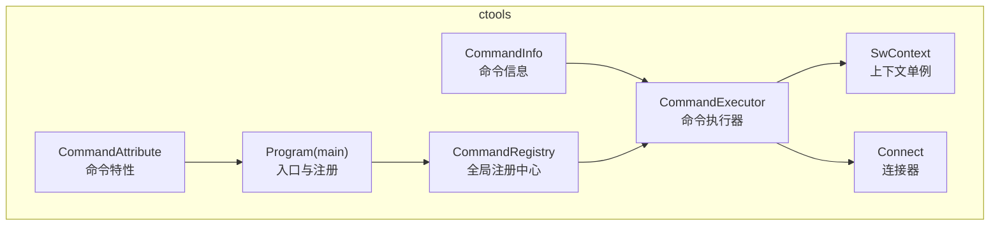
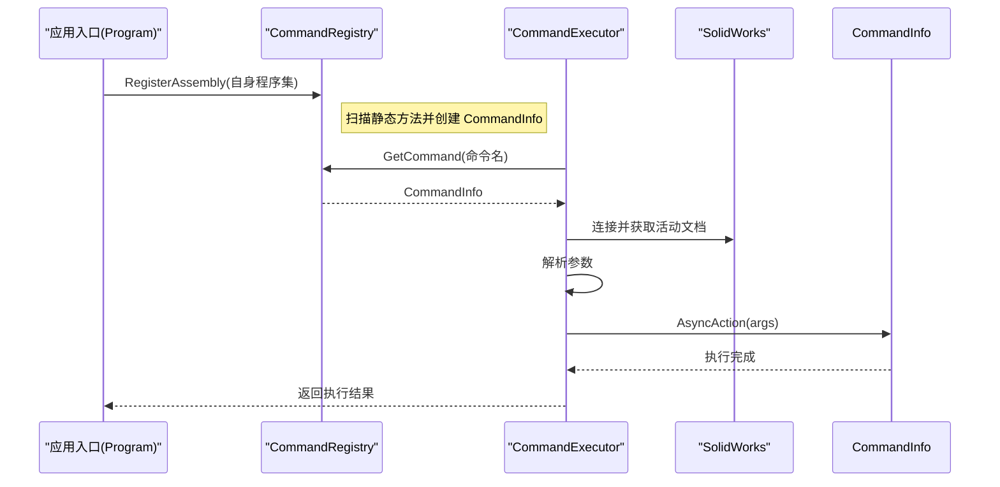
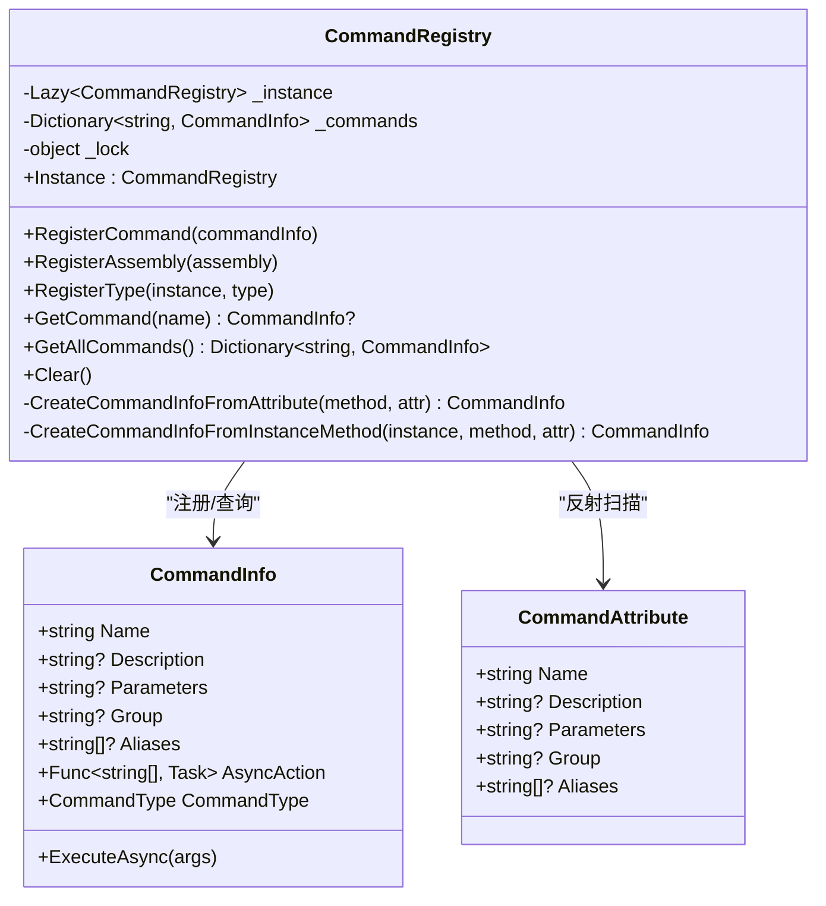
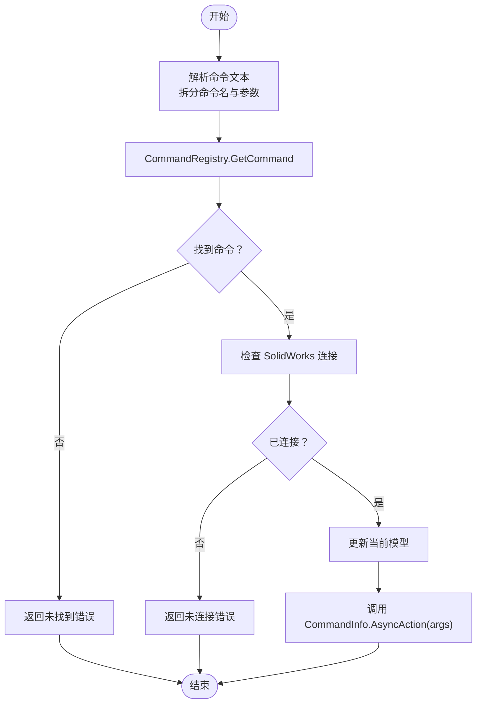
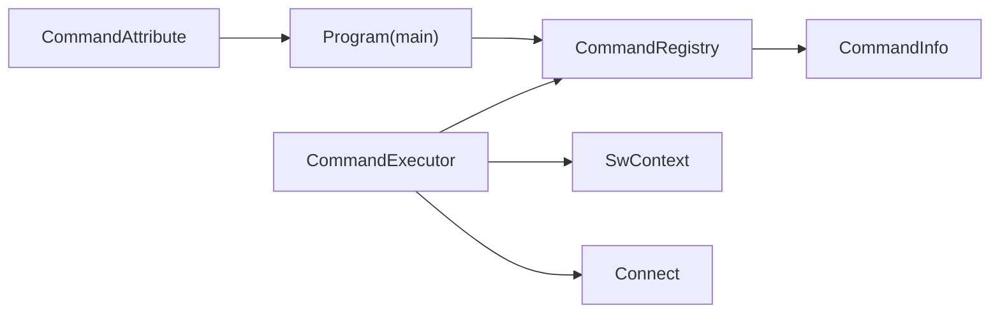

# 命令注册机制

<cite>
**本文引用的文件**
- [CommandRegistry.cs](file://ctools/CommandRegistry.cs)
- [CommandAttribute.cs](file://ctools/CommandAttribute.cs)
- [CommandInfo.cs](file://ctools/CommandInfo.cs)
- [command_executor.cs](file://ctools/command_executor.cs)
- [main.cs](file://ctools/main.cs)
- [part_commands.cs](file://ctools/solidworks_commands/part_commands.cs)
- [asm_commands.cs](file://ctools/solidworks_commands/asm_commands.cs)
- [drw_commands.cs](file://ctools/solidworks_commands/drw_commands.cs)
- [SwContext.cs](file://ctools/SwContext.cs)
- [connect.cs](file://ctools/connect.cs)
</cite>

## 目录
1. [简介](#简介)
2. [项目结构](#项目结构)
3. [核心组件](#核心组件)
4. [架构总览](#架构总览)
5. [详细组件分析](#详细组件分析)
6. [依赖关系分析](#依赖关系分析)
7. [性能考虑](#性能考虑)
8. [故障排除指南](#故障排除指南)
9. [结论](#结论)
10. [附录](#附录)

## 简介
本文件系统性阐述命令注册机制的技术实现，重点覆盖以下方面：
- CommandRegistry 单例模式与线程安全设计
- CommandAttribute 特性的使用方法与字段含义
- 三种注册方式：RegisterCommand 单命令注册、RegisterAssembly 程序集批量注册、RegisterType 类型实例注册的实现细节与适用场景
- 命令执行流程与异常处理策略
- 性能优化与最佳实践建议

## 项目结构
该机制围绕命令注册中心、命令特性、命令信息以及命令执行器协同工作，形成“声明式注册 + 运行时解析”的整体架构。关键文件职责如下：
- CommandRegistry：全局命令注册中心，负责命令注册、查询、清空与线程安全
- CommandAttribute：命令特性，用于在方法上声明命令元数据
- CommandInfo：命令信息载体，封装命令元数据与执行动作
- command_executor：命令执行器，负责解析命令文本、解析参数、连接 SolidWorks 并调度命令执行
- main：应用入口，负责扫描自身程序集并通过 CommandRegistry 完成注册
- solidworks_commands/*：具体命令实现，使用 CommandAttribute 进行声明

图表来源
- [CommandRegistry.cs:12-242](file://ctools/CommandRegistry.cs#L12-L242)
- [CommandAttribute.cs:5-19](file://ctools/CommandAttribute.cs#L5-L19)
- [CommandInfo.cs:17-41](file://ctools/CommandInfo.cs#L17-L41)
- [command_executor.cs:12-116](file://ctools/command_executor.cs#L12-L116)
- [main.cs:34-253](file://ctools/main.cs#L34-L253)
- [SwContext.cs:9-87](file://ctools/SwContext.cs#L9-L87)
- [connect.cs:9-56](file://ctools/connect.cs#L9-L56)

章节来源
- [CommandRegistry.cs:12-242](file://ctools/CommandRegistry.cs#L12-L242)
- [CommandAttribute.cs:5-19](file://ctools/CommandAttribute.cs#L5-L19)
- [CommandInfo.cs:17-41](file://ctools/CommandInfo.cs#L17-L41)
- [command_executor.cs:12-116](file://ctools/command_executor.cs#L12-L116)
- [main.cs:34-253](file://ctools/main.cs#L34-L253)
- [SwContext.cs:9-87](file://ctools/SwContext.cs#L9-L87)
- [connect.cs:9-56](file://ctools/connect.cs#L9-L56)

## 核心组件
- CommandRegistry：全局单例，内部以线程安全字典存储命令映射；提供注册、查询、批量注册、清空等能力
- CommandAttribute：声明式特性，定义命令名称、描述、参数、分组、别名等元数据
- CommandInfo：命令信息对象，包含命令元数据与可执行动作（AsyncAction），支持同步与异步两种类型
- CommandExecutor：命令执行器，负责解析命令文本、参数、连接 SolidWorks、调度命令执行并输出结果
- Program(main)：应用入口，扫描自身程序集中的命令特性并注册到全局注册中心

章节来源
- [CommandRegistry.cs:12-242](file://ctools/CommandRegistry.cs#L12-L242)
- [CommandAttribute.cs:5-19](file://ctools/CommandAttribute.cs#L5-L19)
- [CommandInfo.cs:17-41](file://ctools/CommandInfo.cs#L17-L41)
- [command_executor.cs:12-116](file://ctools/command_executor.cs#L12-L116)
- [main.cs:34-253](file://ctools/main.cs#L34-L253)

## 架构总览
命令注册与执行的整体流程如下：
- 命令声明：在方法上使用 CommandAttribute 声明命令元数据
- 命令注册：Program 扫描自身程序集，将带特性的方法注册到 CommandRegistry
- 命令执行：CommandExecutor 解析命令文本，从 CommandRegistry 查询命令，连接 SolidWorks，调用命令 AsyncAction

图表来源
- [main.cs:53-109](file://ctools/main.cs#L53-L109)
- [CommandRegistry.cs:61-108](file://ctools/CommandRegistry.cs#L61-L108)
- [command_executor.cs:32-113](file://ctools/command_executor.cs#L32-L113)

## 详细组件分析

### CommandRegistry 单例与线程安全
- 单例实现：使用 Lazy<T> 延迟初始化，确保线程安全的单例实例
- 线程安全：内部使用锁对象保护命令字典的并发访问，保证注册、查询、清空等操作的原子性
- 命令注册：RegisterCommand 支持命令名与别名注册，别名统一映射到同一 CommandInfo
- 程序集批量注册：RegisterAssembly 通过反射扫描静态方法上的 CommandAttribute，自动构建 CommandInfo 并注册
- 类型实例注册：RegisterType 支持实例方法的命令注册，适用于插件等场景
- 命令查询：GetCommand 支持大小写不敏感查询，并输出调试信息
- 清空与复制：Clear 清空注册表；GetAllCommands 返回副本以避免外部修改

图表来源
- [CommandRegistry.cs:12-242](file://ctools/CommandRegistry.cs#L12-L242)
- [CommandInfo.cs:17-41](file://ctools/CommandInfo.cs#L17-L41)
- [CommandAttribute.cs:5-19](file://ctools/CommandAttribute.cs#L5-L19)

章节来源
- [CommandRegistry.cs:12-242](file://ctools/CommandRegistry.cs#L12-L242)
- [CommandInfo.cs:17-41](file://ctools/CommandInfo.cs#L17-L41)
- [CommandAttribute.cs:5-19](file://ctools/CommandAttribute.cs#L5-L19)

### CommandAttribute 使用详解
- 字段说明
  - Name：命令名称，必填
  - Description：命令描述，可选
  - Parameters：参数说明，可选
  - Group：命令分组，可选（如 solidworks）
  - Aliases：命令别名数组，可选
- 使用方式：在静态方法上使用 [Command(...)] 声明命令元数据
- 示例参考：
  - [part_commands.cs:11-27](file://ctools/solidworks_commands/part_commands.cs#L11-L27)
  - [asm_commands.cs:11-60](file://ctools/solidworks_commands/asm_commands.cs#L11-L60)
  - [drw_commands.cs:95-144](file://ctools/solidworks_commands/drw_commands.cs#L95-L144)

章节来源
- [CommandAttribute.cs:5-19](file://ctools/CommandAttribute.cs#L5-L19)
- [part_commands.cs:11-27](file://ctools/solidworks_commands/part_commands.cs#L11-L27)
- [asm_commands.cs:11-60](file://ctools/solidworks_commands/asm_commands.cs#L11-L60)
- [drw_commands.cs:95-144](file://ctools/solidworks_commands/drw_commands.cs#L95-L144)

### 三种注册方式与实现细节

#### RegisterCommand 单命令注册
- 适用场景：手动构建 CommandInfo 并注册，适合动态命令或测试场景
- 关键点：命令名与别名均注册到同一 CommandInfo；对空名称抛出异常；线程安全

章节来源
- [CommandRegistry.cs:32-56](file://ctools/CommandRegistry.cs#L32-L56)

#### RegisterAssembly 程序集批量注册
- 适用场景：将命令集中在一个程序集内，通过反射批量注册
- 关键点：扫描所有静态方法，提取 CommandAttribute，创建 CommandInfo；支持异步任务命令识别；异常捕获并输出错误信息

章节来源
- [CommandRegistry.cs:61-83](file://ctools/CommandRegistry.cs#L61-L83)
- [main.cs:59-60](file://ctools/main.cs#L59-L60)

#### RegisterType 类型实例注册
- 适用场景：插件或实例方法命令注册，需要传入实例与类型
- 关键点：扫描实例方法上的 CommandAttribute；创建实例方法对应的 CommandInfo；异常捕获并输出错误信息

章节来源
- [CommandRegistry.cs:88-108](file://ctools/CommandRegistry.cs#L88-L108)

### 命令执行流程与异常处理
- 命令解析：CommandExecutor.ExecuteCommandAsync 解析命令文本，拆分命令名与参数
- 命令查询：通过 CommandRegistry.GetCommand 获取 CommandInfo
- 连接检查：验证 SolidWorks 是否连接，必要时尝试通过 IActiveDoc2 获取活动文档
- 执行调度：根据 CommandInfo.CommandType 调用 AsyncAction(args)，支持同步与异步
- 异常处理：捕获 TargetInvocationException 与通用异常，输出详细错误信息并抛出

图表来源
- [command_executor.cs:32-113](file://ctools/command_executor.cs#L32-L113)
- [CommandRegistry.cs:113-131](file://ctools/CommandRegistry.cs#L113-L131)

章节来源
- [command_executor.cs:32-113](file://ctools/command_executor.cs#L32-L113)
- [CommandRegistry.cs:113-131](file://ctools/CommandRegistry.cs#L113-L131)

### 示例：命令声明与注册
- 在 Program 中声明命令：
  - 同步命令示例：参见 [part_commands.cs:11-27](file://ctools/solidworks_commands/part_commands.cs#L11-L27)
  - 异步命令示例：参见 [drw_commands.cs:95-144](file://ctools/solidworks_commands/drw_commands.cs#L95-L144)
- 注册到全局注册中心：
  - 入口处注册自身程序集：参见 [main.cs:59-60](file://ctools/main.cs#L59-L60)
  - CommandRegistry 批量注册：参见 [CommandRegistry.cs:61-83](file://ctools/CommandRegistry.cs#L61-L83)

章节来源
- [part_commands.cs:11-27](file://ctools/solidworks_commands/part_commands.cs#L11-L27)
- [drw_commands.cs:95-144](file://ctools/solidworks_commands/drw_commands.cs#L95-L144)
- [main.cs:59-60](file://ctools/main.cs#L59-L60)
- [CommandRegistry.cs:61-83](file://ctools/CommandRegistry.cs#L61-L83)

## 依赖关系分析
- CommandRegistry 依赖 CommandAttribute 与 CommandInfo
- Program 通过反射扫描自身程序集并注册命令
- CommandExecutor 依赖 CommandRegistry 与 SwContext/Connect
- SwContext 提供全局 SolidWorks 上下文，Connect 负责连接 SolidWorks

图表来源
- [CommandAttribute.cs:5-19](file://ctools/CommandAttribute.cs#L5-L19)
- [main.cs:34-253](file://ctools/main.cs#L34-L253)
- [CommandRegistry.cs:12-242](file://ctools/CommandRegistry.cs#L12-L242)
- [CommandInfo.cs:17-41](file://ctools/CommandInfo.cs#L17-L41)
- [command_executor.cs:12-116](file://ctools/command_executor.cs#L12-L116)
- [SwContext.cs:9-87](file://ctools/SwContext.cs#L9-L87)
- [connect.cs:9-56](file://ctools/connect.cs#L9-L56)

章节来源
- [CommandAttribute.cs:5-19](file://ctools/CommandAttribute.cs#L5-L19)
- [main.cs:34-253](file://ctools/main.cs#L34-L253)
- [CommandRegistry.cs:12-242](file://ctools/CommandRegistry.cs#L12-L242)
- [CommandInfo.cs:17-41](file://ctools/CommandInfo.cs#L17-L41)
- [command_executor.cs:12-116](file://ctools/command_executor.cs#L12-L116)
- [SwContext.cs:9-87](file://ctools/SwContext.cs#L9-L87)
- [connect.cs:9-56](file://ctools/connect.cs#L9-L56)

## 性能考虑
- 线程安全成本：CommandRegistry 使用锁保护字典操作，建议在应用启动阶段完成注册，避免运行时频繁注册
- 反射扫描：RegisterAssembly 会对程序集进行反射扫描，建议仅在启动时调用一次
- 异步命令：异步命令通过 Task 执行，避免阻塞 UI；注意在命令内部合理 await
- 日志与调试：注册与查询过程包含调试输出，生产环境可适当减少调试信息输出
- 命令执行：CommandExecutor 在每次执行前刷新当前模型，确保与 SolidWorks 状态一致

[本节为通用性能建议，无需特定文件引用]

## 故障排除指南
- 命令未找到
  - 检查命令名称大小写是否正确（GetCommand 不区分大小写）
  - 确认命令已在 CommandRegistry 中注册
  - 参考：[CommandRegistry.cs:113-131](file://ctools/CommandRegistry.cs#L113-L131)
- 未连接 SolidWorks
  - 确认 Connect.run() 成功返回 SldWorks 实例
  - 参考：[connect.cs:11-51](file://ctools/connect.cs#L11-L51)
- 命令执行异常
  - CommandExecutor 捕获 TargetInvocationException 与通用异常，输出详细错误信息
  - 参考：[command_executor.cs:107-112](file://ctools/command_executor.cs#L107-L112)
- 程序集注册失败
  - RegisterAssembly 捕获异常并输出错误信息
  - 参考：[CommandRegistry.cs:79-82](file://ctools/CommandRegistry.cs#L79-L82)

章节来源
- [CommandRegistry.cs:113-131](file://ctools/CommandRegistry.cs#L113-L131)
- [connect.cs:11-51](file://ctools/connect.cs#L11-L51)
- [command_executor.cs:107-112](file://ctools/command_executor.cs#L107-L112)
- [CommandRegistry.cs:79-82](file://ctools/CommandRegistry.cs#L79-L82)

## 结论
命令注册机制通过 CommandAttribute 声明式定义命令元数据，结合 CommandRegistry 的单例与线程安全设计，实现了灵活、可扩展的命令注册与执行体系。配合 CommandExecutor 的命令解析与执行流程，能够稳定地与 SolidWorks 交互。建议在应用启动阶段完成注册，合理使用异步命令，并在生产环境中减少调试输出以提升性能。

[本节为总结性内容，无需特定文件引用]

## 附录

### 最佳实践建议
- 命令命名规范：使用清晰、稳定的命令名称，避免重复
- 分组管理：合理使用 Group 字段对命令进行分类
- 参数说明：在 Parameters 中明确参数含义与约束
- 异步优先：涉及 I/O 或长耗时操作的命令应使用异步方法
- 错误处理：在命令内部捕获并记录异常，避免影响其他命令执行
- 线程安全：避免在运行时频繁注册命令，尽量在启动阶段完成

[本节为通用建议，无需特定文件引用]