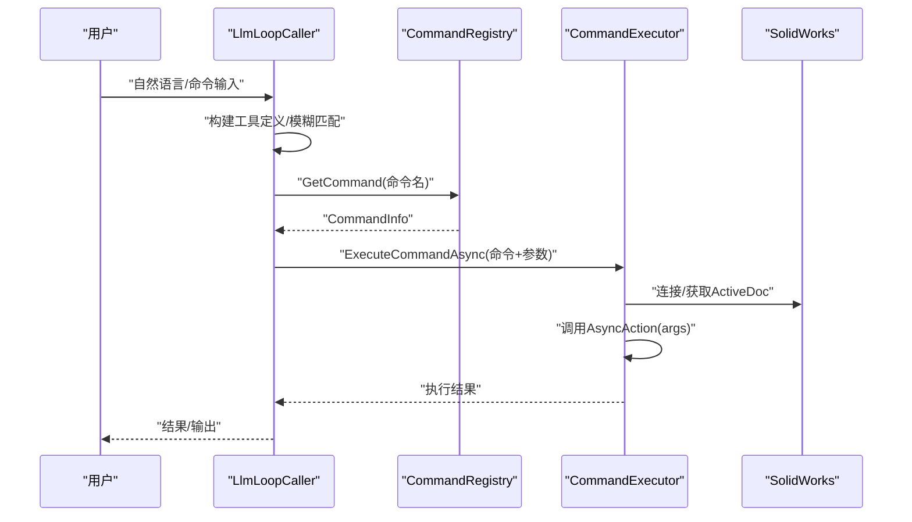
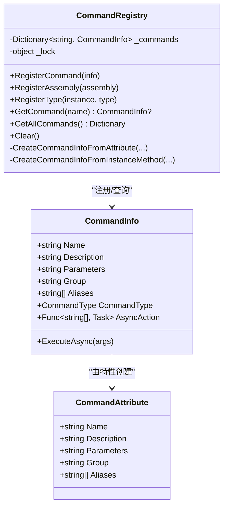
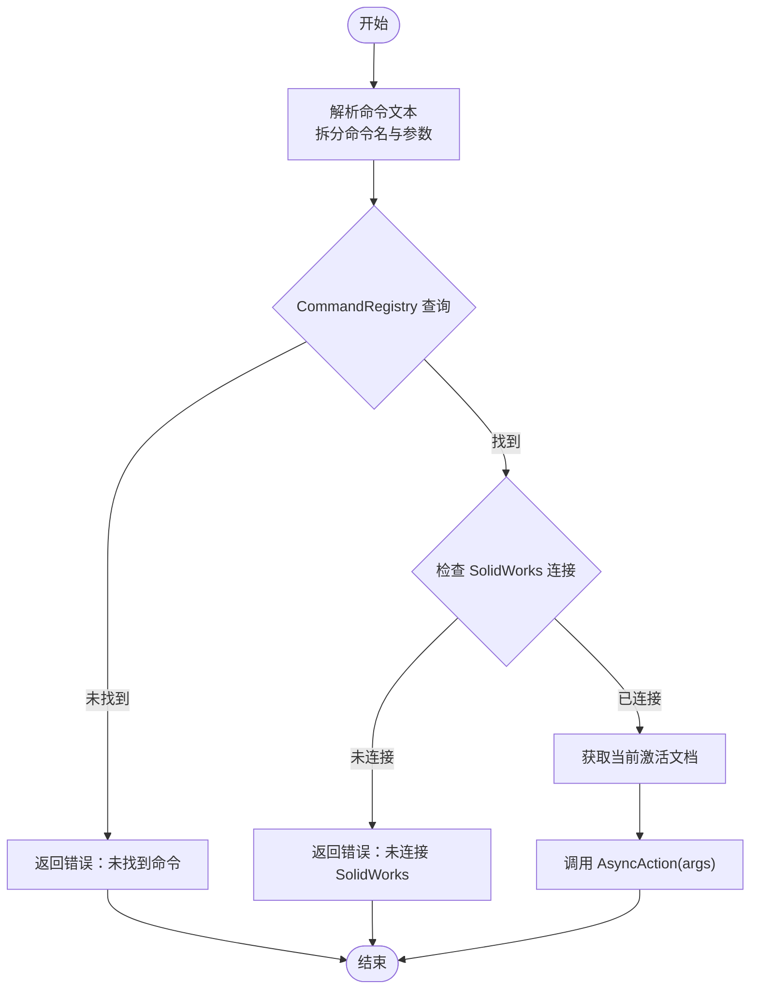
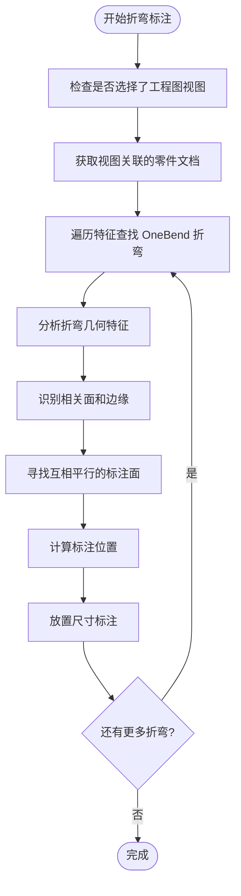
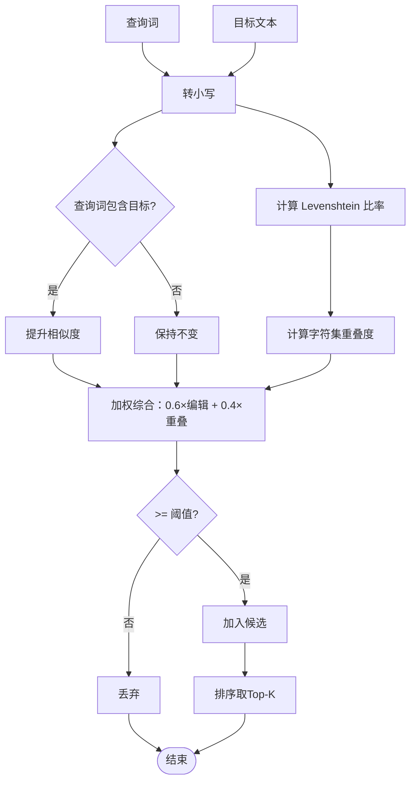
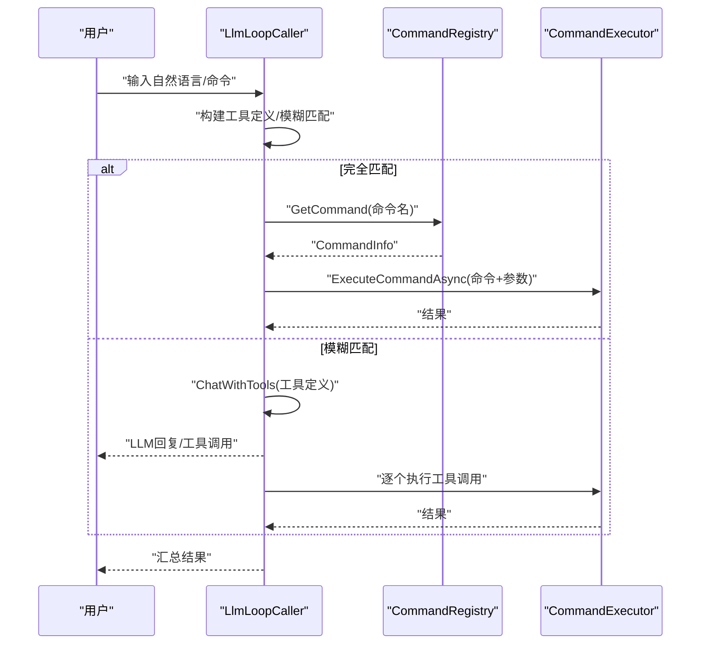
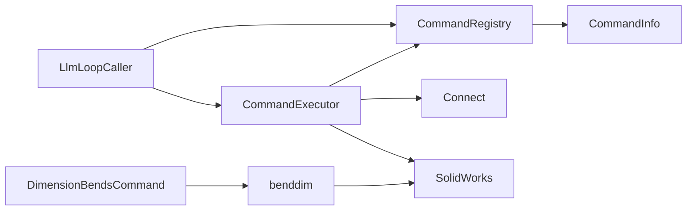

# 命令系统详解

<cite>
**本文引用的文件**
- [CommandAttribute.cs](file://ctools/CommandAttribute.cs)
- [CommandInfo.cs](file://ctools/CommandInfo.cs)
- [CommandRegistry.cs](file://ctools/CommandRegistry.cs)
- [command_executor.cs](file://ctools/command_executor.cs)
- [main.cs](file://ctools/main.cs)
- [llm_loop_caller.cs](file://ctools/llm_loop_caller.cs)
- [part_commands.cs](file://ctools/solidworks_commands/part_commands.cs)
- [asm_commands.cs](file://ctools/solidworks_commands/asm_commands.cs)
- [drw_commands.cs](file://ctools/solidworks_commands/drw_commands.cs)
- [cad_dwg_commands.cs](file://ctools/cad_dwg_commands.cs)
- [connect.cs](file://ctools/connect.cs)
- [SwContext.cs](file://ctools/SwContext.cs)
- [CommandAttribute.cs（SolidWorks插件）](file://sw_plugin/CommandAttribute.cs)
- [CadCommands.cs](file://cad_plugin/CadCommands.cs)
- [benddim.cs](file://share/drw/benddim.cs)
- [function.cs](file://sw_plugin/function.cs)
</cite>

## 更新摘要
**变更内容**
- 新增 DimensionBendsCommand 自动弯曲标注命令的详细说明
- 添加折弯尺寸标注算法的技术实现分析
- 更新命令注册机制以包含新的工程图命令
- 增强命令执行流程说明以涵盖折弯标注功能

## 目录
1. [简介](#简介)
2. [项目结构](#项目结构)
3. [核心组件](#核心组件)
4. [架构总览](#架构总览)
5. [详细组件分析](#详细组件分析)
6. [依赖关系分析](#依赖关系分析)
7. [性能考量](#性能考量)
8. [故障排查指南](#故障排查指南)
9. [结论](#结论)
10. [附录](#附录)

## 简介
本文件面向希望理解并扩展命令系统的开发者，系统性阐述命令注册机制、命令执行流程、相似度匹配与模糊搜索算法，以及自定义命令开发的完整指南。重点覆盖以下方面：
- CommandAttribute 特性与 CommandRegistry 单例注册中心的协作方式
- 命令解析与执行的完整链路（从输入到 SolidWorks 调用）
- 命令相似度匹配与模糊搜索的实现细节
- 自定义命令开发最佳实践（特性定义、参数处理、错误处理）
- **新增**：自动弯曲标注命令 DimensionBendsCommand 的实现与使用指南

## 项目结构
命令系统主要位于 ctools 项目中，围绕"特性声明 + 注册中心 + 执行器 + LLM 集成"的架构组织。关键模块如下：
- 命令特性与元数据：CommandAttribute、CommandInfo
- 注册中心：CommandRegistry（单例，支持静态/实例方法反射注册）
- 执行器：CommandExecutor（解析命令、参数、连接 SolidWorks、调用命令）
- 主入口与命令实现：Program（注册命令、相似度匹配、搜索）、各功能域命令文件
- LLM 集成：LlmLoopCaller（工具定义、模糊匹配、工具调用执行）
- SolidWorks 连接与上下文：Connect、SwContext
- **新增**：折弯标注工具：benddim 类（提供自动折弯尺寸标注功能）

```mermaid
graph TB
subgraph "ctools"
Attr["CommandAttribute<br/>命令特性"]
Info["CommandInfo<br/>命令信息"]
Reg["CommandRegistry<br/>注册中心(单例)"]
Exec["CommandExecutor<br/>命令执行器"]
Prog["Program<br/>主入口/命令注册/相似度匹配"]
LLM["LlmLoopCaller<br/>LLM循环调用器"]
Conn["Connect<br/>连接SolidWorks"]
Ctx["SwContext<br/>上下文(单例)"]
end
subgraph "新增功能"
BendDim["benddim<br/>折弯标注工具"]
End
Attr --> Reg
Info --> Reg
Prog --> Reg
Reg --> Exec
LLM --> Exec
Exec --> Conn
Conn --> Ctx
Prog --> LLM
BendDim --> Conn
BendDim --> Ctx
```

**图表来源**
- [CommandAttribute.cs:1-20](file://ctools/CommandAttribute.cs#L1-L20)
- [CommandInfo.cs:1-41](file://ctools/CommandInfo.cs#L1-L41)
- [CommandRegistry.cs:1-242](file://ctools/CommandRegistry.cs#L1-L242)
- [command_executor.cs:1-116](file://ctools/command_executor.cs#L1-L116)
- [main.cs:1-377](file://ctools/main.cs#L1-L377)
- [llm_loop_caller.cs:1-1029](file://ctools/llm_loop_caller.cs#L1-L1029)
- [connect.cs:1-56](file://ctools/connect.cs#L1-L56)
- [SwContext.cs:1-87](file://ctools/SwContext.cs#L1-L87)
- [benddim.cs:1-331](file://share/drw/benddim.cs#L1-L331)

**章节来源**
- [CommandAttribute.cs:1-20](file://ctools/CommandAttribute.cs#L1-L20)
- [CommandInfo.cs:1-41](file://ctools/CommandInfo.cs#L1-L41)
- [CommandRegistry.cs:1-242](file://ctools/CommandRegistry.cs#L1-L242)
- [command_executor.cs:1-116](file://ctools/command_executor.cs#L1-L116)
- [main.cs:1-377](file://ctools/main.cs#L1-L377)
- [llm_loop_caller.cs:1-1029](file://ctools/llm_loop_caller.cs#L1-L1029)
- [connect.cs:1-56](file://ctools/connect.cs#L1-L56)
- [SwContext.cs:1-87](file://ctools/SwContext.cs#L1-L87)
- [benddim.cs:1-331](file://share/drw/benddim.cs#L1-L331)

## 核心组件
- 命令特性 CommandAttribute：用于在方法上声明命令元数据（名称、描述、参数、分组、别名等），支持反射扫描注册。
- 命令信息 CommandInfo：封装命令名称、描述、参数、分组、别名、执行委托、同步/异步类型。
- 注册中心 CommandRegistry：单例模式，提供注册命令、批量注册（静态/实例方法）、按名查询、清空等功能。
- 命令执行器 CommandExecutor：负责解析命令文本、参数切分、命令解析、连接 SolidWorks、执行命令、返回结果。
- 主入口 Program：注册命令、构建命令描述内容、相似度匹配与搜索、与 LLM 循环集成。
- LLM 循环调用器 LlmLoopCaller：构建工具定义、模糊匹配、工具调用执行、结果记忆。
- **新增**：折弯标注工具 benddim：提供自动折弯尺寸标注的核心算法实现。

**章节来源**
- [CommandAttribute.cs:1-20](file://ctools/CommandAttribute.cs#L1-L20)
- [CommandInfo.cs:1-41](file://ctools/CommandInfo.cs#L1-L41)
- [CommandRegistry.cs:1-242](file://ctools/CommandRegistry.cs#L1-L242)
- [command_executor.cs:1-116](file://ctools/command_executor.cs#L1-L116)
- [main.cs:1-377](file://ctools/main.cs#L1-L377)
- [llm_loop_caller.cs:1-1029](file://ctools/llm_loop_caller.cs#L1-L1029)
- [benddim.cs:1-331](file://share/drw/benddim.cs#L1-L331)

## 架构总览
命令系统采用"声明式注册 + 反射扫描 + 单例注册中心 + 执行器 + LLM 工具调用"的整体架构。命令通过特性声明，注册中心统一收集并暴露给执行器；执行器负责与 SolidWorks 交互；LLM 通过工具定义与模糊匹配将自然语言映射到具体命令。



**图表来源**
- [llm_loop_caller.cs:1-1029](file://ctools/llm_loop_caller.cs#L1-L1029)
- [CommandRegistry.cs:1-242](file://ctools/CommandRegistry.cs#L1-L242)
- [command_executor.cs:1-116](file://ctools/command_executor.cs#L1-L116)

## 详细组件分析

### 命令注册机制与 CommandRegistry 单例
- 特性驱动：命令方法使用 CommandAttribute 声明元数据，支持静态方法与实例方法两种注册路径。
- 批量注册：
  - RegisterAssembly：扫描程序集中的静态方法，提取 CommandAttribute，创建 CommandInfo 并注册。
  - RegisterType：扫描实例类型的实例方法，适合插件等场景。
- 单例模式：CommandRegistry 使用 Lazy<T> 实现线程安全的单例，内部使用锁保护命令字典。
- 别名注册：注册命令时同时注册别名，查询时按小写键匹配，保证大小写不敏感。
- 执行委托：根据方法返回类型区分同步/异步，动态生成 AsyncAction 委托，统一异常处理。



**图表来源**
- [CommandAttribute.cs:1-20](file://ctools/CommandAttribute.cs#L1-L20)
- [CommandInfo.cs:1-41](file://ctools/CommandInfo.cs#L1-L41)
- [CommandRegistry.cs:1-242](file://ctools/CommandRegistry.cs#L1-L242)

**章节来源**
- [CommandRegistry.cs:1-242](file://ctools/CommandRegistry.cs#L1-L242)
- [CommandAttribute.cs:1-20](file://ctools/CommandAttribute.cs#L1-L20)
- [CommandInfo.cs:1-41](file://ctools/CommandInfo.cs#L1-L41)

### 命令执行流程（解析到执行）
- 输入解析：CommandExecutor 支持"命令名 + 参数"格式，按空白分割，首段为命令名，其余为参数数组。
- 命令解析：通过 CommandRegistry.GetCommand 获取 CommandInfo。
- SolidWorks 连接：检查 SldWorks 实例，获取当前激活文档，必要时通过 IActiveDoc2 获取。
- 执行命令：调用 CommandInfo.AsyncAction(args)，支持同步/异步方法。
- 结果返回：捕获异常并返回友好提示，打印调试信息。



**图表来源**
- [command_executor.cs:1-116](file://ctools/command_executor.cs#L1-L116)
- [CommandRegistry.cs:1-242](file://ctools/CommandRegistry.cs#L1-L242)

**章节来源**
- [command_executor.cs:1-116](file://ctools/command_executor.cs#L1-L116)
- [main.cs:1-377](file://ctools/main.cs#L1-L377)

### 自动弯曲标注命令 DimensionBendsCommand

**新增功能**：DimensionBendsCommand 提供自动标注选中视图折弯尺寸的功能，专门用于工程图中的折弯特征标注。

#### 命令实现
- **命令定义**：在 drw_commands.cs 中定义了 [Command("dimension_bends", Description = "自动标注选中视图的折弯尺寸", Parameters = "需先选择工程图视图", Group = "solidworks")] 特性。
- **执行逻辑**：调用 benddim.标折弯尺寸(swApp) 方法执行标注操作。
- **SolidWorks 插件集成**：在 sw_plugin/function.cs 中提供了对应的 GUI 命令实现。

#### 折弯标注算法实现
benddim 类提供了完整的折弯特征识别和标注算法：

**算法步骤**：
1. **特征识别**：遍历零件文档的 Body 和 Feature，查找 OneBend 类型的折弯特征
2. **几何分析**：对折弯特征进行几何分析，识别圆柱面和相关面
3. **面匹配**：寻找与圆柱轴线平行且互相平行的标注面
4. **标注生成**：在视图中标注折弯尺寸

**关键技术点**：
- **圆柱面检测**：通过 Surface.IsCylinder() 识别折弯特征的主要几何面
- **平行边识别**：通过 Edge.GetCurve().IsLine() 和向量平行判断找到直边
- **面关联分析**：通过 Edge.GetTwoAdjacentFaces() 分析面之间的拓扑关系
- **标注位置计算**：根据视图变换矩阵和边界框确定标注位置



**图表来源**
- [benddim.cs:13-62](file://share/drw/benddim.cs#L13-L62)
- [benddim.cs:64-266](file://share/drw/benddim.cs#L64-L266)

**章节来源**
- [drw_commands.cs:155-162](file://ctools/solidworks_commands/drw_commands.cs#L155-L162)
- [benddim.cs:1-331](file://share/drw/benddim.cs#L1-L331)
- [function.cs:627-657](file://sw_plugin/function.cs#L627-L657)

### 命令相似度匹配与模糊搜索
- 相似度计算：
  - Levenshtein 编辑距离比率：衡量两个字符串的编辑距离与最大长度比值。
  - 字符集重叠度：计算两字符串字符集合的交集与较大集合的比值。
  - 综合评分：0.6 × 编辑距离比率 + 0.4 × 字符重叠度。
  - 包含关系增强：若查询词包含目标文本，则提升相似度至较高阈值。
- 模糊搜索（Program.SearchCommands）：
  - 对命令名、描述、分组分别计算相似度，取三者最大值。
  - 若输入完全包含某命令名/描述/分组，额外加分。
  - 支持阈值过滤与 Top-K 返回。
- LLM 模糊匹配（LlmLoopCaller.FindFuzzyCommand）：
  - 优先处理"命令名 + 参数"的完全匹配。
  - 传统模糊匹配：比较命令名、别名、描述，取最高分。
  - 别名完全匹配时赋予最高分；否则按相似度排序返回最佳候选。



**图表来源**
- [main.cs:255-377](file://ctools/main.cs#L255-L377)
- [llm_loop_caller.cs:290-488](file://ctools/llm_loop_caller.cs#L290-L488)

**章节来源**
- [main.cs:255-377](file://ctools/main.cs#L255-L377)
- [llm_loop_caller.cs:290-488](file://ctools/llm_loop_caller.cs#L290-L488)

### 自定义命令开发指南
- 命令特性定义
  - 在静态方法上使用 CommandAttribute，设置 Name、Description、Parameters、Group、Aliases。
  - 返回类型支持 void 或 Task（异步），注册中心会据此标记 CommandType。
- 参数处理
  - 命令方法签名：static void Method(string[] args) 或 static Task Method(string[] args)。
  - 参数由 CommandExecutor 按空白分割传入，注意边界检查与错误提示。
- 错误处理
  - 注册阶段：检查返回类型合法性，忽略非法方法。
  - 执行阶段：捕获 TargetInvocationException 与通用异常，输出详细错误信息。
- 示例参考
  - 零参数命令：参见 [part_commands.cs:11-27](file://ctools/solidworks_commands/part_commands.cs#L11-L27)
  - 单参数命令：参见 [part_commands.cs:64-77](file://ctools/solidworks_commands/part_commands.cs#L64-L77)
  - 批量处理命令：参见 [asm_commands.cs:94-155](file://ctools/solidworks_commands/asm_commands.cs#L94-L155)
  - 异步命令：参见 [drw_commands.cs:96-144](file://ctools/solidworks_commands/drw_commands.cs#L96-L144)
  - **新增**：自动弯曲标注命令：参见 [drw_commands.cs:155-162](file://ctools/solidworks_commands/drw_commands.cs#L155-L162)

**章节来源**
- [CommandAttribute.cs:1-20](file://ctools/CommandAttribute.cs#L1-L20)
- [CommandRegistry.cs:1-242](file://ctools/CommandRegistry.cs#L1-L242)
- [command_executor.cs:1-116](file://ctools/command_executor.cs#L1-L116)
- [part_commands.cs:1-149](file://ctools/solidworks_commands/part_commands.cs#L1-L149)
- [asm_commands.cs:1-158](file://ctools/solidworks_commands/asm_commands.cs#L1-L158)
- [drw_commands.cs:1-165](file://ctools/solidworks_commands/drw_commands.cs#L1-L165)

### LLM 工具调用与交互循环
- 工具定义构建：基于 CommandRegistry 中的命令列表，为每个命令及其别名生成 ToolDefinition。
- 交互循环：接收用户输入，优先完全匹配，其次模糊匹配交给 LLM，最终通过 CommandExecutor 执行。
- 用户确认：支持确认模式与自动模式，可重复上次命令。
- 输出捕获：拦截 Console 输出，将执行结果与 Console 输出一并反馈。



**图表来源**
- [llm_loop_caller.cs:1-1029](file://ctools/llm_loop_caller.cs#L1-L1029)
- [CommandRegistry.cs:1-242](file://ctools/CommandRegistry.cs#L1-L242)
- [command_executor.cs:1-116](file://ctools/command_executor.cs#L1-L116)

**章节来源**
- [llm_loop_caller.cs:1-1029](file://ctools/llm_loop_caller.cs#L1-L1029)

### SolidWorks 连接与上下文
- 连接逻辑：Connect.run() 优先获取已运行实例，失败则创建新实例，异常统一捕获并返回 null。
- 上下文管理：SwContext 单例持有 SldWorks 与当前 ModelDoc2，提供初始化与清理能力。
- 执行器集成：CommandExecutor 通过回调解析 SolidWorks 实例与当前文档，确保每次执行前刷新上下文。

**章节来源**
- [connect.cs:1-56](file://ctools/connect.cs#L1-L56)
- [SwContext.cs:1-87](file://ctools/SwContext.cs#L1-L87)
- [command_executor.cs:1-116](file://ctools/command_executor.cs#L1-L116)

## 依赖关系分析
- 组件耦合
  - CommandRegistry 与 CommandInfo：强依赖，注册中心维护命令字典。
  - CommandExecutor 依赖 CommandRegistry 的查询能力与 SwContext/Connect 的 SolidWorks 访问。
  - LlmLoopCaller 依赖 CommandRegistry 的命令集合与 CommandExecutor 的执行能力。
  - **新增**：DimensionBendsCommand 依赖 benddim 工具类和 SolidWorks 几何接口。
- 外部依赖
  - SolidWorks Interop：通过 SldWorks、ModelDoc2 等 COM 类型与应用交互。
  - LLM 服务：通过 LlmService 与外部模型交互（工具调用模式）。



**图表来源**
- [CommandRegistry.cs:1-242](file://ctools/CommandRegistry.cs#L1-L242)
- [CommandInfo.cs:1-41](file://ctools/CommandInfo.cs#L1-L41)
- [command_executor.cs:1-116](file://ctools/command_executor.cs#L1-L116)
- [llm_loop_caller.cs:1-1029](file://ctools/llm_loop_caller.cs#L1-L1029)
- [connect.cs:1-56](file://ctools/connect.cs#L1-L56)
- [drw_commands.cs:155-162](file://ctools/solidworks_commands/drw_commands.cs#L155-L162)
- [benddim.cs:1-331](file://share/drw/benddim.cs#L1-L331)

**章节来源**
- [CommandRegistry.cs:1-242](file://ctools/CommandRegistry.cs#L1-L242)
- [CommandInfo.cs:1-41](file://ctools/CommandInfo.cs#L1-L41)
- [command_executor.cs:1-116](file://ctools/command_executor.cs#L1-L116)
- [llm_loop_caller.cs:1-1029](file://ctools/llm_loop_caller.cs#L1-L1029)
- [connect.cs:1-56](file://ctools/connect.cs#L1-L56)
- [drw_commands.cs:155-162](file://ctools/solidworks_commands/drw_commands.cs#L155-L162)
- [benddim.cs:1-331](file://share/drw/benddim.cs#L1-L331)

## 性能考量
- 注册阶段
  - 反射扫描程序集与类型，建议在应用启动时一次性完成，避免频繁扫描。
  - 批量注册 RegisterAssembly/ RegisterType 会遍历所有方法，注意程序集规模。
- 执行阶段
  - 异步命令使用 Task，避免阻塞 UI 线程；同步命令需谨慎，防止卡顿。
  - 命令执行前刷新 SolidWorks 文档上下文，减少状态不一致风险。
  - **新增**：折弯标注算法涉及大量几何计算，建议在大批量折弯时考虑性能优化。
- 模糊匹配
  - 相似度计算包含 Levenshtein 动态规划，复杂度 O(nm)，建议限制输入长度或缓存常用命令。
  - LLM 模糊匹配仅在必要时触发，优先完全匹配可降低延迟。

## 故障排查指南
- 未找到命令
  - 检查命令是否正确使用 CommandAttribute 声明并注册到 CommandRegistry。
  - 确认命令名大小写不敏感，但别名也需正确注册。
- 无法连接 SolidWorks
  - 确认 Connect.run() 返回有效实例，检查 COM 异常与平台支持。
  - 确保执行器传入的解析器能返回当前 SldWorks 实例。
- 命令执行异常
  - 捕获 TargetInvocationException 并查看内部异常信息。
  - 检查命令方法签名与返回类型，确保为 void 或 Task。
- 参数解析问题
  - 确认命令输入格式为"命令名 + 参数"，参数按空白分割。
  - 在命令方法内部增加参数数量与有效性校验，避免空引用。
- **新增**：折弯标注问题
  - 确认已选择正确的工程图视图，且视图关联到有效的零件文档。
  - 检查折弯特征是否存在且为 OneBend 类型。
  - 验证几何面的识别是否成功，特别是圆柱面和直边的检测。

**章节来源**
- [CommandRegistry.cs:1-242](file://ctools/CommandRegistry.cs#L1-L242)
- [command_executor.cs:1-116](file://ctools/command_executor.cs#L1-L116)
- [connect.cs:1-56](file://ctools/connect.cs#L1-L56)
- [main.cs:1-377](file://ctools/main.cs#L1-L377)
- [benddim.cs:13-62](file://share/drw/benddim.cs#L13-L62)

## 结论
该命令系统通过特性声明与注册中心实现了高度模块化的命令管理，结合执行器与 LLM 工具调用，既支持直接命令执行，也支持自然语言模糊匹配。其单例注册中心与线程安全设计保证了跨应用共享与并发安全；相似度匹配算法兼顾精确与容错，满足实际使用场景。

**新增功能**：DimensionBendsCommand 和 benddim 工具类的集成，为工程图折弯标注提供了智能化解决方案。该算法通过几何分析和拓扑关系识别，能够自动定位折弯特征并生成准确的尺寸标注，大大提高了工程师的工作效率。

开发者可遵循本文指南快速扩展命令体系并集成到更广泛的自动化流程中，同时可以参考折弯标注算法的设计思路来开发其他复杂的几何特征标注功能。

## 附录
- 其他平台命令示例
  - SolidWorks 插件命令特性：参见 [CommandAttribute.cs（SolidWorks插件）:1-27](file://sw_plugin/CommandAttribute.cs#L1-L27)
  - AutoCAD 插件命令：参见 [CadCommands.cs:1-106](file://cad_plugin/CadCommands.cs#L1-L106)
- 命令实现示例
  - 零参数命令：参见 [part_commands.cs:11-27](file://ctools/solidworks_commands/part_commands.cs#L11-L27)
  - 单参数命令：参见 [part_commands.cs:64-77](file://ctools/solidworks_commands/part_commands.cs#L64-L77)
  - 批量处理命令：参见 [asm_commands.cs:94-155](file://ctools/solidworks_commands/asm_commands.cs#L94-L155)
  - 异步命令：参见 [drw_commands.cs:96-144](file://ctools/solidworks_commands/drw_commands.cs#L96-L144)
  - CAD 命令：参见 [cad_dwg_commands.cs:1-78](file://ctools/cad_dwg_commands.cs#L1-L78)
  - **新增**：自动弯曲标注命令：参见 [drw_commands.cs:155-162](file://ctools/solidworks_commands/drw_commands.cs#L155-L162)
- **新增**：折弯标注算法实现
  - 核心算法类：参见 [benddim.cs:1-331](file://share/drw/benddim.cs#L1-L331)
  - SolidWorks 插件集成：参见 [function.cs:627-657](file://sw_plugin/function.cs#L627-L657)