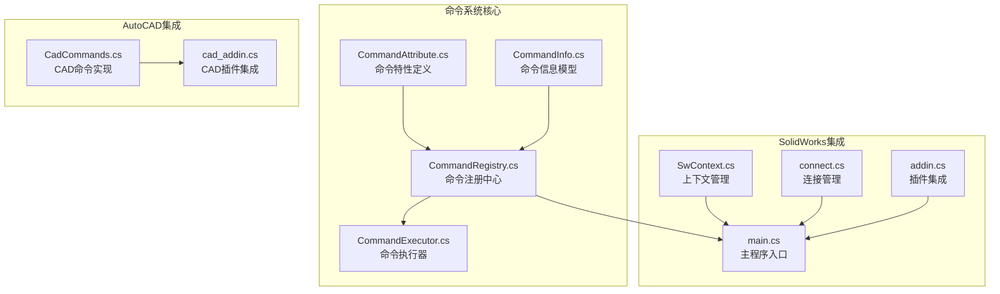
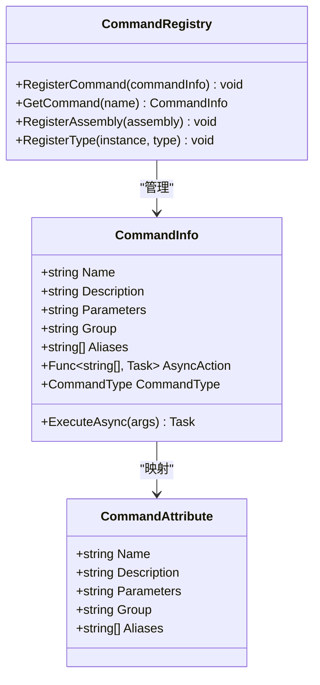
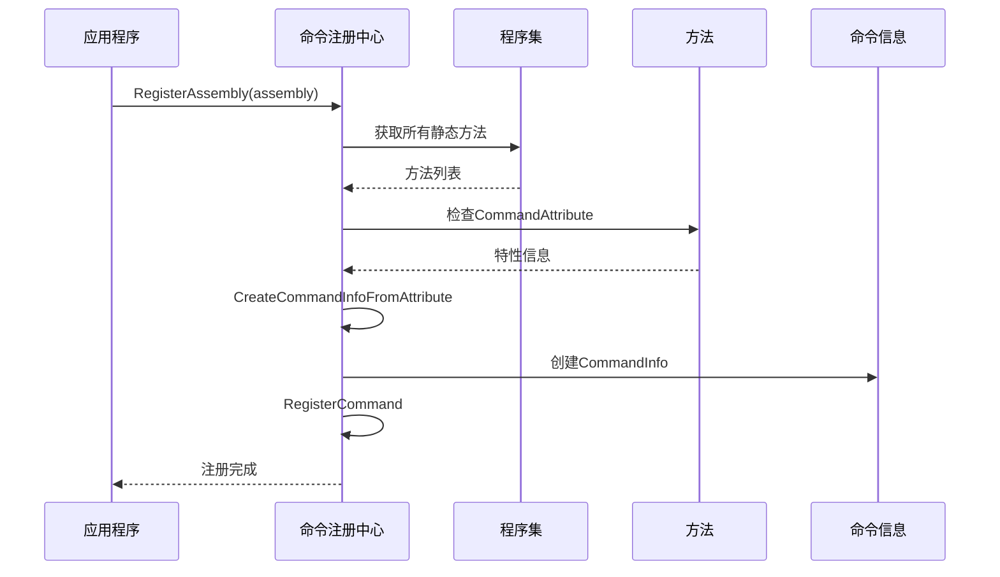
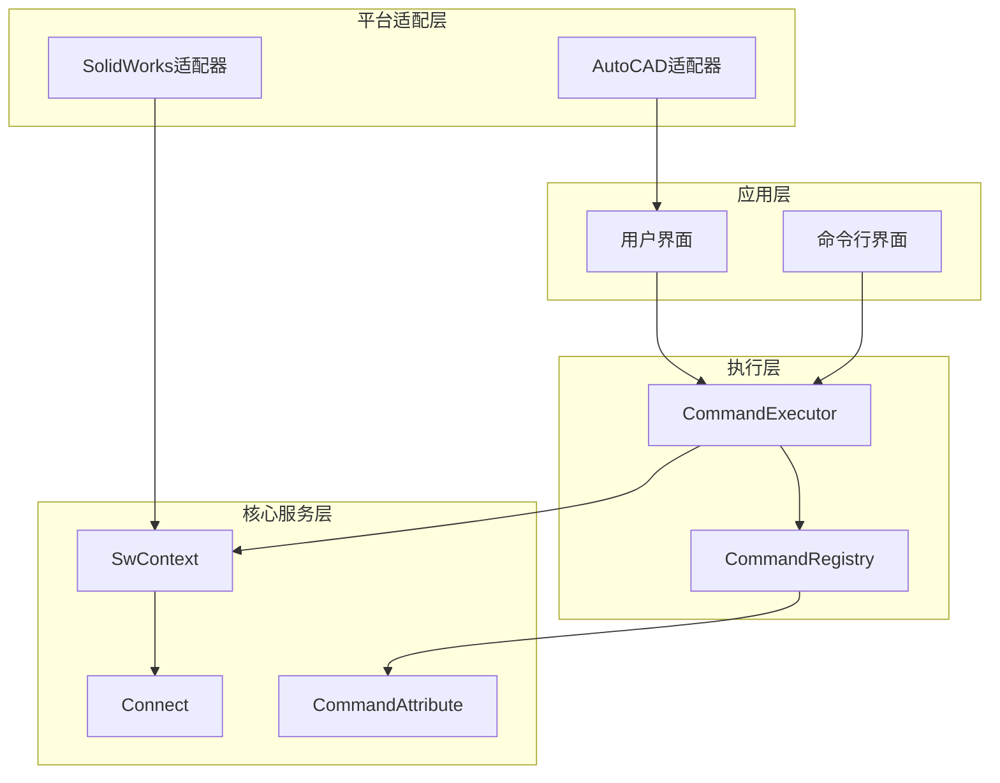
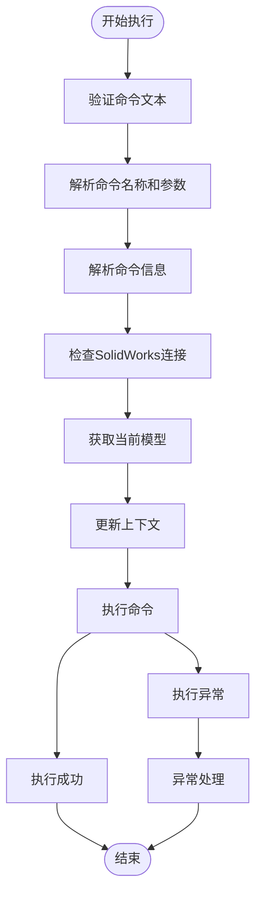
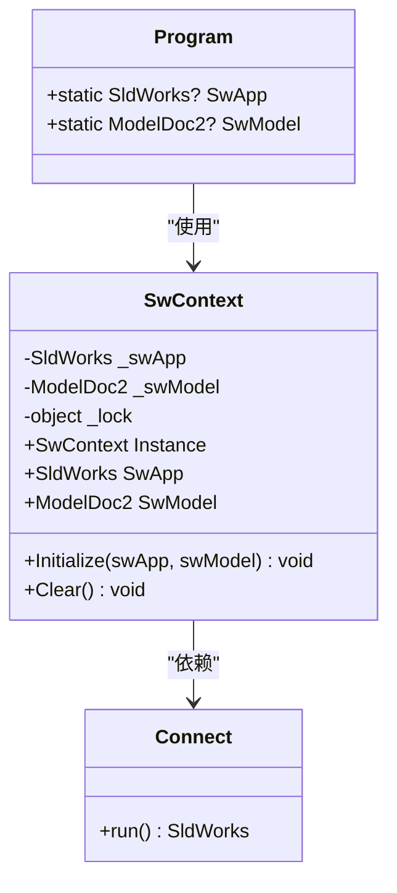
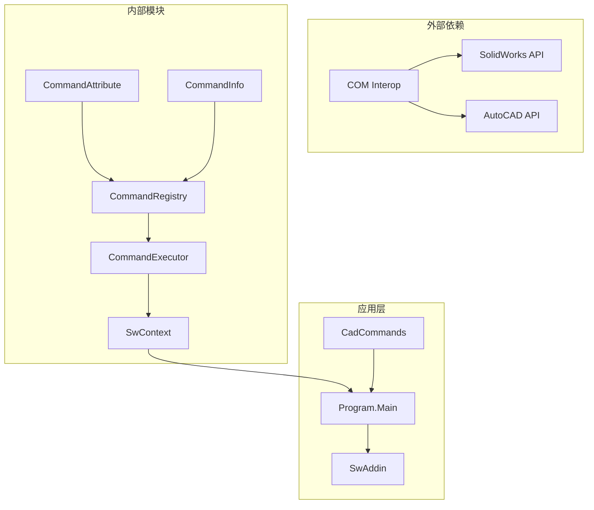
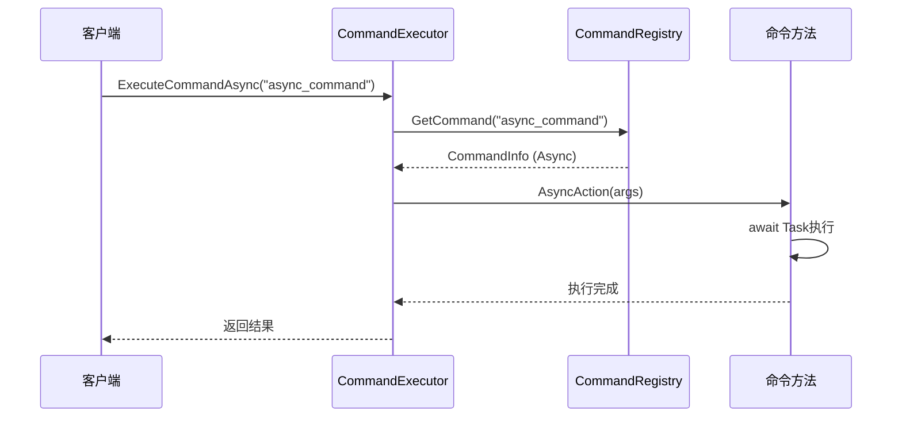

# 自定义命令开发指南

<cite>
**本文档引用的文件**
- [CommandAttribute.cs](file://ctools/CommandAttribute.cs)
- [CommandInfo.cs](file://ctools/CommandInfo.cs)
- [CommandRegistry.cs](file://ctools/CommandRegistry.cs)
- [CommandExecutor.cs](file://ctools/command_executor.cs)
- [main.cs](file://ctools/main.cs)
- [SwContext.cs](file://ctools/SwContext.cs)
- [connect.cs](file://ctools/connect.cs)
- [CadCommands.cs](file://cad_plugin/CadCommands.cs)
- [cad_addin.cs](file://cad_plugin/cad_addin.cs)
- [CommandAttribute.cs](file://sw_plugin/CommandAttribute.cs)
- [addin.cs](file://sw_plugin/addin.cs)
</cite>

## 目录
1. [简介](#简介)
2. [项目结构](#项目结构)
3. [核心组件](#核心组件)
4. [架构概览](#架构概览)
5. [详细组件分析](#详细组件分析)
6. [依赖关系分析](#依赖关系分析)
7. [性能考虑](#性能考虑)
8. [故障排除指南](#故障排除指南)
9. [结论](#结论)
10. [附录](#附录)

## 简介

本指南面向需要开发自定义命令的开发者，基于实际代码库提供了完整的命令开发框架和最佳实践。该系统支持多种CAD平台（AutoCAD和SolidWorks），提供了声明式命令注册、参数化命令执行、异步命令支持等功能。

## 项目结构

该项目采用模块化设计，主要包含以下核心模块：

**图表来源**
- [CommandAttribute.cs:1-20](file://ctools/CommandAttribute.cs#L1-L20)
- [CommandRegistry.cs:1-242](file://ctools/CommandRegistry.cs#L1-L242)
- [CommandExecutor.cs:1-116](file://ctools/command_executor.cs#L1-L116)
- [main.cs:1-377](file://ctools/main.cs#L1-L377)

**章节来源**
- [CommandAttribute.cs:1-20](file://ctools/CommandAttribute.cs#L1-L20)
- [CommandRegistry.cs:1-242](file://ctools/CommandRegistry.cs#L1-L242)
- [CommandExecutor.cs:1-116](file://ctools/command_executor.cs#L1-L116)

## 核心组件

### 命令特性系统

命令特性系统是整个框架的核心，提供了声明式命令定义能力。

#### CommandAttribute 类

命令特性类定义了命令的基本元数据：

| 属性名称 | 类型 | 必填 | 描述 | 默认值 |
|---------|------|------|------|--------|
| Name | string | 是 | 命令名称 | - |
| Description | string | 否 | 命令描述信息 | null |
| Parameters | string | 否 | 参数说明 | null |
| Group | string | 否 | 命令分组标识 | null |
| Aliases | string[] | 否 | 命令别名数组 | null |

**章节来源**
- [CommandAttribute.cs:5-18](file://ctools/CommandAttribute.cs#L5-L18)

### 命令信息模型

CommandInfo 类封装了命令的完整信息和执行逻辑：

**图表来源**
- [CommandInfo.cs:17-40](file://ctools/CommandInfo.cs#L17-L40)
- [CommandRegistry.cs:12-28](file://ctools/CommandRegistry.cs#L12-L28)

**章节来源**
- [CommandInfo.cs:1-41](file://ctools/CommandInfo.cs#L1-L41)

### 命令注册中心

CommandRegistry 实现了单例模式的命令管理中心：

**图表来源**
- [CommandRegistry.cs:61-83](file://ctools/CommandRegistry.cs#L61-L83)
- [CommandRegistry.cs:158-196](file://ctools/CommandRegistry.cs#L158-L196)

**章节来源**
- [CommandRegistry.cs:1-242](file://ctools/CommandRegistry.cs#L1-L242)

## 架构概览

系统采用分层架构设计，实现了跨平台的命令执行框架：

**图表来源**
- [CommandExecutor.cs:12-27](file://ctools/command_executor.cs#L12-L27)
- [SwContext.cs:9-25](file://ctools/SwContext.cs#L9-L25)
- [connect.cs:9-56](file://ctools/connect.cs#L9-L56)

## 详细组件分析

### 命令执行器

CommandExecutor 负责解析和执行命令，提供了完整的命令生命周期管理：

**图表来源**
- [CommandExecutor.cs:32-113](file://ctools/command_executor.cs#L32-L113)

**章节来源**
- [CommandExecutor.cs:1-116](file://ctools/command_executor.cs#L1-L116)

### SolidWorks上下文管理

SwContext 提供了全局的SolidWorks应用程序和文档实例管理：

**图表来源**
- [SwContext.cs:9-87](file://ctools/SwContext.cs#L9-L87)
- [connect.cs:9-56](file://ctools/connect.cs#L9-L56)

**章节来源**
- [SwContext.cs:1-87](file://ctools/SwContext.cs#L1-L87)
- [connect.cs:1-56](file://ctools/connect.cs#L1-L56)

### AutoCAD命令集成

AutoCAD插件提供了基于传统命令方法的命令实现方式：

**章节来源**
- [CadCommands.cs:1-106](file://cad_plugin/CadCommands.cs#L1-L106)
- [cad_addin.cs:1-103](file://cad_plugin/cad_addin.cs#L1-L103)

### SolidWorks插件集成

SolidWorks插件展示了如何与SolidWorks API进行深度集成：

**章节来源**
- [CommandAttribute.cs:1-27](file://sw_plugin/CommandAttribute.cs#L1-L27)
- [addin.cs:1-339](file://sw_plugin/addin.cs#L1-L339)

## 依赖关系分析

系统采用了清晰的依赖层次结构：

**图表来源**
- [main.cs:1-377](file://ctools/main.cs#L1-L377)
- [CommandRegistry.cs:1-242](file://ctools/CommandRegistry.cs#L1-L242)

**章节来源**
- [main.cs:1-377](file://ctools/main.cs#L1-L377)
- [CommandRegistry.cs:1-242](file://ctools/CommandRegistry.cs#L1-L242)

## 性能考虑

### 异步命令执行

系统支持异步命令执行，通过Task返回类型自动识别命令类型：

**图表来源**
- [CommandExecutor.cs:96-106](file://ctools/command_executor.cs#L96-L106)
- [CommandRegistry.cs:169-194](file://ctools/CommandRegistry.cs#L169-L194)

### 性能监控

系统提供了可选的性能监控装饰器：

**章节来源**
- [main.cs:28-32](file://ctools/main.cs#L28-L32)
- [main.cs:209-216](file://ctools/main.cs#L209-L216)

## 故障排除指南

### 常见问题及解决方案

#### 命令注册失败

**问题症状**：命令无法在系统中找到
**可能原因**：
- 程序集扫描失败
- 命令特性缺失
- 命名空间不匹配

**解决步骤**：
1. 检查命令方法是否正确标注CommandAttribute
2. 验证程序集是否被正确加载
3. 确认命令名称大小写

#### SolidWorks连接问题

**问题症状**：无法连接到SolidWorks实例
**可能原因**：
- SolidWorks未安装或未运行
- COM对象创建失败
- 权限不足

**解决步骤**：
1. 确认SolidWorks已正确安装
2. 检查COM互操作配置
3. 以管理员权限运行

#### 命令执行异常

**问题症状**：命令执行过程中抛出异常
**可能原因**：
- 参数验证失败
- 文档状态不正确
- 权限不足

**解决步骤**：
1. 检查命令参数格式
2. 验证目标文档状态
3. 确认用户权限

**章节来源**
- [CommandRegistry.cs:79-82](file://ctools/CommandRegistry.cs#L79-L82)
- [CommandExecutor.cs:62-66](file://ctools/command_executor.cs#L62-L66)
- [connect.cs:23-25](file://ctools/connect.cs#L23-L25)

## 结论

本指南基于实际的代码库实现了完整的自定义命令开发框架。系统提供了：

1. **声明式命令定义**：通过CommandAttribute实现简洁的命令声明
2. **统一的命令执行**：CommandExecutor提供一致的命令执行接口
3. **多平台支持**：同时支持AutoCAD和SolidWorks平台
4. **异步执行支持**：原生支持异步命令执行
5. **完善的错误处理**：提供全面的异常处理和调试信息

开发者可以基于此框架快速开发各种类型的自定义命令，并根据具体需求进行扩展和定制。

## 附录

### 命令开发最佳实践

#### 命名约定
- 命令名称使用大写字母
- 使用描述性的命令名称
- 避免使用保留关键字

#### 参数设计
- 明确参数类型和范围
- 提供合理的默认值
- 实现参数验证

#### 错误处理
- 捕获特定异常类型
- 提供有意义的错误信息
- 实现优雅降级

#### 日志记录
- 记录关键操作步骤
- 包含必要的上下文信息
- 区分不同级别的日志

### 调试技巧

#### 命令调试
- 使用Console.WriteLine输出调试信息
- 实现详细的异常堆栈跟踪
- 利用条件断点进行调试

#### 性能优化
- 监控命令执行时间
- 优化数据库查询
- 减少不必要的对象创建