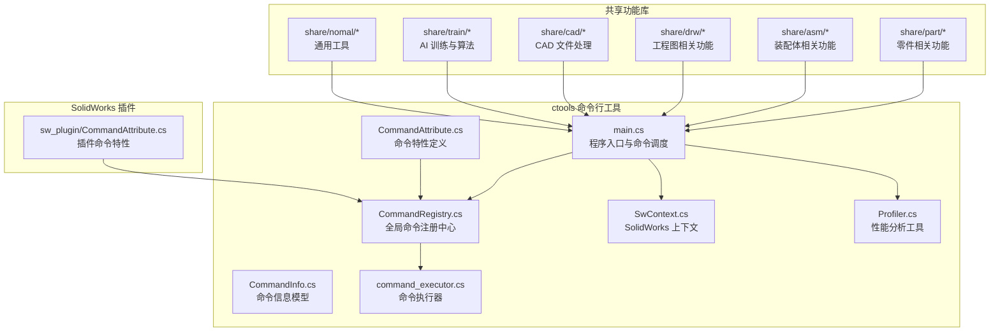
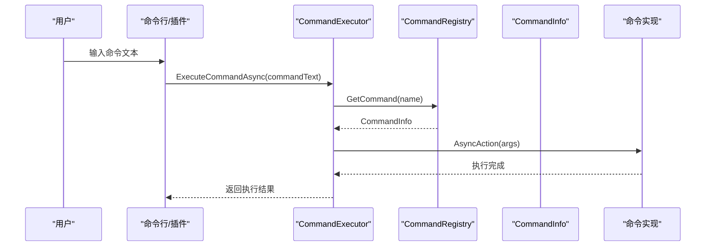
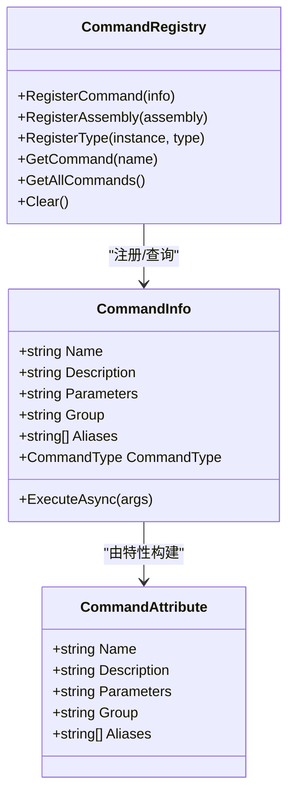
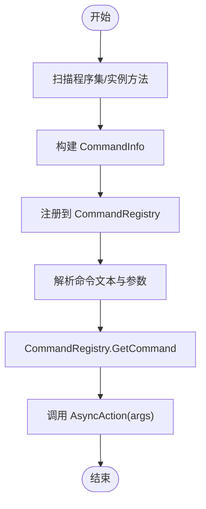
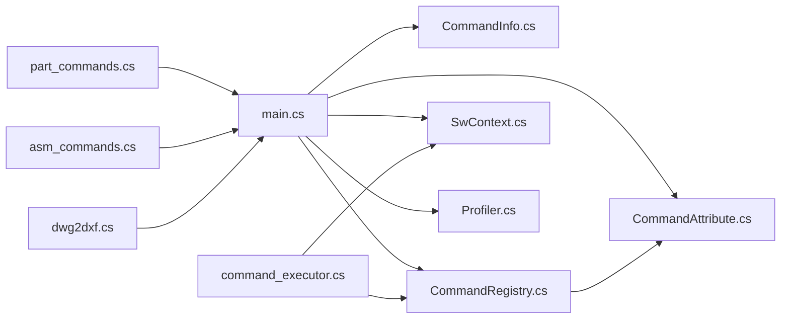

# 代码规范与约定

<cite>
**本文引用的文件**
- [README.md](file://README.md)
- [CommandAttribute.cs](file://ctools/CommandAttribute.cs)
- [CommandInfo.cs](file://ctools/CommandInfo.cs)
- [CommandRegistry.cs](file://ctools/CommandRegistry.cs)
- [main.cs](file://ctools/main.cs)
- [command_executor.cs](file://ctools/command_executor.cs)
- [SwContext.cs](file://ctools/SwContext.cs)
- [Profiler.cs](file://share/nomal/Profiler.cs)
- [part_commands.cs](file://ctools/solidworks_commands/part_commands.cs)
- [asm_commands.cs](file://ctools/solidworks_commands/asm_commands.cs)
- [exportdwg.cs](file://share/part/exportdwg.cs)
- [asm2bom.cs](file://share/asm/asm2bom.cs)
- [dwg2dxf.cs](file://share/cad/dwg2dxf.cs)
- [CadCommands.cs](file://cad_plugin/CadCommands.cs)
- [CommandAttribute.cs](file://sw_plugin/CommandAttribute.cs)
- [connect.cs](file://ctools/connect.cs)
</cite>

## 目录
1. [引言](#引言)
2. [项目结构](#项目结构)
3. [核心组件](#核心组件)
4. [架构总览](#架构总览)
5. [详细组件分析](#详细组件分析)
6. [依赖关系分析](#依赖关系分析)
7. [性能考虑](#性能考虑)
8. [故障排查指南](#故障排查指南)
9. [结论](#结论)
10. [附录](#附录)

## 引言
本文件旨在建立统一的 C# 编码规范与约定，覆盖编程标准、命名约定、代码组织结构、命令特性（CommandAttribute）使用规范、代码格式化与注释规范、变量命名约定、项目结构布局与文件组织原则、代码审查检查清单与质量标准，并结合仓库中的真实实现提供可操作的示例路径，确保团队开发的一致性与可维护性。

## 项目结构
项目采用多项目组合的解决方案结构，围绕“命令系统”“SolidWorks 插件”“AutoCAD 插件”“共享功能库”进行模块化组织。命令系统通过特性标记与注册中心实现声明式注册与动态执行；SolidWorks 与 AutoCAD 插件分别提供各自的命令特性与上下文管理；共享功能库按领域拆分（part/asm/drw/cad/train/nomal），便于复用与维护。

图表来源
- [main.cs:1-377](file://ctools/main.cs#L1-L377)
- [CommandRegistry.cs:1-242](file://ctools/CommandRegistry.cs#L1-L242)
- [CommandAttribute.cs:1-20](file://ctools/CommandAttribute.cs#L1-L20)
- [CommandAttribute.cs:1-27](file://sw_plugin/CommandAttribute.cs#L1-L27)
- [CommandInfo.cs:1-41](file://ctools/CommandInfo.cs#L1-L41)
- [command_executor.cs:1-116](file://ctools/command_executor.cs#L1-L116)
- [SwContext.cs:1-87](file://ctools/SwContext.cs#L1-L87)
- [Profiler.cs:1-27](file://share/nomal/Profiler.cs#L1-L27)

章节来源
- [README.md:193-249](file://README.md#L193-L249)

## 核心组件
- 命令特性（CommandAttribute）：用于声明命令元数据（名称、描述、参数、分组、别名等），支持静态与实例方法注册。
- 命令信息（CommandInfo）：封装命令名称、描述、参数、分组、别名、执行委托与同步/异步类型。
- 命令注册中心（CommandRegistry）：单例模式，负责注册、查找、批量扫描与反射绑定命令。
- 命令执行器（CommandExecutor）：解析命令文本、解析参数、校验 SolidWorks 连接状态、执行命令并输出调试信息。
- SolidWorks 上下文（SwContext）：单例模式，提供全局可访问的 SldWorks 与 ModelDoc2 实例。
- 性能分析（Profiler）：提供通用的性能计时工具，支持 Action 与 Func<T>。

章节来源
- [CommandAttribute.cs:1-20](file://ctools/CommandAttribute.cs#L1-L20)
- [CommandInfo.cs:1-41](file://ctools/CommandInfo.cs#L1-L41)
- [CommandRegistry.cs:1-242](file://ctools/CommandRegistry.cs#L1-L242)
- [command_executor.cs:1-116](file://ctools/command_executor.cs#L1-L116)
- [SwContext.cs:1-87](file://ctools/SwContext.cs#L1-L87)
- [Profiler.cs:1-27](file://share/nomal/Profiler.cs#L1-L27)

## 架构总览
命令系统通过特性标记声明命令，注册中心扫描程序集或实例方法，构建 CommandInfo 并绑定执行委托；命令执行器负责解析命令文本与参数，调用注册中心获取命令信息并执行。SolidWorks 连接与上下文贯穿执行流程，确保命令在正确的文档与应用实例上执行。

图表来源
- [command_executor.cs:32-113](file://ctools/command_executor.cs#L32-L113)
- [CommandRegistry.cs:113-131](file://ctools/CommandRegistry.cs#L113-L131)
- [CommandInfo.cs:30-38](file://ctools/CommandInfo.cs#L30-L38)

## 详细组件分析

### 命令特性（CommandAttribute）使用规范
- 命名与描述
  - Name：命令唯一标识，建议使用小写与下划线，避免大写与中文。
  - Description：简明描述命令用途，突出参数与行为。
- 参数说明
  - Parameters：描述参数含义与格式；若无参数，使用“无”。
- 分组规则
  - Group：用于分类命令，如“solidworks”“part”“asm”“drw”“cad”等。
- 别名支持
  - Aliases：提供常用别名，提升易用性。
- 返回类型约束
  - 静态命令：返回类型必须为 void 或 Task。
- 实例方法支持
  - 注册中心同时支持静态与实例方法，实例方法通过实例对象绑定。

图表来源
- [CommandAttribute.cs:5-17](file://ctools/CommandAttribute.cs#L5-L17)
- [CommandInfo.cs:17-39](file://ctools/CommandInfo.cs#L17-L39)
- [CommandRegistry.cs:32-56](file://ctools/CommandRegistry.cs#L32-L56)

章节来源
- [CommandAttribute.cs:1-20](file://ctools/CommandAttribute.cs#L1-L20)
- [CommandRegistry.cs:61-83](file://ctools/CommandRegistry.cs#L61-L83)
- [CommandRegistry.cs:88-108](file://ctools/CommandRegistry.cs#L88-L108)
- [CommandRegistry.cs:158-196](file://ctools/CommandRegistry.cs#L158-L196)
- [CommandRegistry.cs:201-239](file://ctools/CommandRegistry.cs#L201-L239)

### 命令注册与执行流程
- 批量注册
  - 通过反射扫描程序集中的静态方法，提取 CommandAttribute 并构建 CommandInfo，注册到全局注册中心。
- 实例注册
  - 支持实例方法注册，用于插件等场景。
- 命令执行
  - CommandExecutor 解析命令文本与参数，校验 SolidWorks 连接状态，调用 CommandInfo.AsyncAction 执行命令。

图表来源
- [CommandRegistry.cs:61-83](file://ctools/CommandRegistry.cs#L61-L83)
- [CommandRegistry.cs:88-108](file://ctools/CommandRegistry.cs#L88-L108)
- [command_executor.cs:44-101](file://ctools/command_executor.cs#L44-L101)

章节来源
- [CommandRegistry.cs:113-131](file://ctools/CommandRegistry.cs#L113-L131)
- [command_executor.cs:32-113](file://ctools/command_executor.cs#L32-L113)

### 命令实现示例与最佳实践
- 零件命令示例
  - 导出 DXF、获取厚度、打开文档、批量导出等命令均通过 Command 特性声明，参数解析在命令实现中处理。
- 装配体命令示例
  - 批量导出、批量检查、生成 BOM、批量生成工程图等命令展示了复杂业务流程的命令化封装。
- CAD 命令示例
  - AutoCAD 插件中通过 [CommandMethod] 标记命令，展示与 SolidWorks 命令系统的差异与共性。

章节来源
- [part_commands.cs:11-149](file://ctools/solidworks_commands/part_commands.cs#L11-L149)
- [asm_commands.cs:11-158](file://ctools/solidworks_commands/asm_commands.cs#L11-L158)
- [CadCommands.cs:14-106](file://cad_plugin/CadCommands.cs#L14-L106)

### 代码组织与文件布局
- 命令实现按领域划分：part/asm/drw/cad/train/nomal，便于职责清晰与复用。
- 命令特性与注册中心位于 ctools 核心，插件命令特性位于 sw_plugin。
- 共享功能库提供通用工具与性能分析，供各命令复用。

章节来源
- [README.md:212-236](file://README.md#L212-L236)
- [CommandAttribute.cs:1-27](file://sw_plugin/CommandAttribute.cs#L1-L27)

## 依赖关系分析
- 命令系统依赖关系
  - main.cs 依赖 CommandAttribute、CommandInfo、CommandRegistry、SwContext、Profiler。
  - CommandRegistry 依赖反射与特性元数据，支持静态与实例方法。
  - CommandExecutor 依赖 CommandRegistry 与 SwContext，负责命令解析与执行。
- 功能库依赖关系
  - 各领域命令实现依赖共享功能库（如 exportdwg、asm2bom、dwg2dxf 等）。

图表来源
- [main.cs:13-109](file://ctools/main.cs#L13-L109)
- [CommandRegistry.cs:14-27](file://ctools/CommandRegistry.cs#L14-L27)
- [command_executor.cs:18-26](file://ctools/command_executor.cs#L18-L26)

章节来源
- [main.cs:170-253](file://ctools/main.cs#L170-L253)
- [CommandRegistry.cs:158-196](file://ctools/CommandRegistry.cs#L158-L196)

## 性能考虑
- 性能分析装饰器
  - main.cs 中的 ProfiledAttribute 与 Profiler 提供方法级性能分析能力，可用于命令执行性能监控。
- 异步命令
  - CommandInfo.CommandType 支持异步命令，CommandRegistry 与 main.cs 均对 Task 类型进行专门处理，确保异步执行与异常捕获一致。
- 调试输出
  - CommandExecutor 在执行前后输出调试信息，便于定位问题与性能瓶颈。

章节来源
- [main.cs:28-32](file://ctools/main.cs#L28-L32)
- [Profiler.cs:1-27](file://share/nomal/Profiler.cs#L1-L27)
- [CommandRegistry.cs:160-196](file://ctools/CommandRegistry.cs#L160-L196)
- [main.cs:202-248](file://ctools/main.cs#L202-L248)
- [command_executor.cs:96-105](file://ctools/command_executor.cs#L96-L105)

## 故障排查指南
- 无法连接 SolidWorks
  - 检查 connect.cs 中的连接逻辑与平台支持，确保 Windows 平台且 SolidWorks 已启动。
- 命令未找到
  - 使用 CommandRegistry.GetCommand(name) 检查命令是否注册，确认名称大小写与别名映射。
- 命令执行异常
  - CommandExecutor 捕获异常并输出堆栈信息，结合调试日志定位问题。
- 插件注册失败
  - 参考 README.md 中的注册与卸载步骤，确保以管理员身份运行脚本。

章节来源
- [connect.cs:11-51](file://ctools/connect.cs#L11-L51)
- [CommandRegistry.cs:113-131](file://ctools/CommandRegistry.cs#L113-L131)
- [command_executor.cs:107-112](file://ctools/command_executor.cs#L107-L112)
- [README.md:281-340](file://README.md#L281-L340)

## 结论
通过统一的命令特性、注册中心与执行器架构，项目实现了声明式命令注册与动态执行，配合清晰的领域划分与性能分析工具，提升了可维护性与扩展性。遵循本文的编码规范与约定，有助于团队在多项目协作中保持一致性与高质量交付。

## 附录

### 编码规范与约定清单
- 命名约定
  - 命令名称：小写+下划线，动词+名词结构，避免大写与中文。
  - 类型与方法：PascalCase；字段与私有成员：camelCase；常量：UPPER_SNAKE_CASE。
  - 命名空间：tools 或具体领域命名空间（如 cad_tools）。
- 代码组织
  - 命令实现按领域拆分至 share/part、share/asm、share/drw、share/cad、share/train、share/nomal。
  - 命令特性与注册中心集中于 ctools；插件命令特性集中于 sw_plugin。
- 注释规范
  - 类与方法使用 XML 注释，描述用途、参数、返回值与异常。
  - 关键逻辑添加行内注释，解释复杂算法或业务规则。
- 参数与返回值
  - 命令参数通过字符串数组传递，命令实现中进行参数校验与解析。
  - 返回类型必须为 void 或 Task，确保统一的执行模型。
- 错误处理
  - 使用 try-catch 捕获异常，输出可读的错误信息与调试日志。
- 性能监控
  - 使用 ProfiledAttribute 与 Profiler 对关键命令进行性能分析。
- 代码审查检查清单
  - 命令特性是否完整（Name/Description/Parameters/Group/Aliases）。
  - 命令实现是否健壮（参数校验、异常处理、资源释放）。
  - 是否遵循命名与注释规范。
  - 是否存在重复代码与过度耦合。
  - 是否提供必要的测试或可验证的使用示例。

### 实际代码示例（示例路径）
- 命令特性与实现示例
  - [part_commands.cs:11-19](file://ctools/solidworks_commands/part_commands.cs#L11-L19)
  - [part_commands.cs:64-77](file://ctools/solidworks_commands/part_commands.cs#L64-L77)
  - [asm_commands.cs:52-60](file://ctools/solidworks_commands/asm_commands.cs#L52-L60)
- 命令执行与注册示例
  - [main.cs:170-253](file://ctools/main.cs#L170-L253)
  - [CommandRegistry.cs:61-83](file://ctools/CommandRegistry.cs#L61-L83)
- 功能实现示例
  - [exportdwg.cs:12-77](file://share/part/exportdwg.cs#L12-L77)
  - [asm2bom.cs:12-59](file://share/asm/asm2bom.cs#L12-L59)
  - [dwg2dxf.cs:7-38](file://share/cad/dwg2dxf.cs#L7-L38)
- AutoCAD 插件命令示例
  - [CadCommands.cs:14-106](file://cad_plugin/CadCommands.cs#L14-L106)