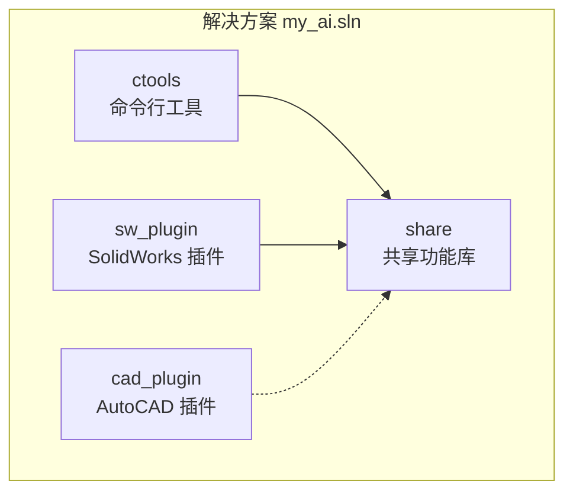
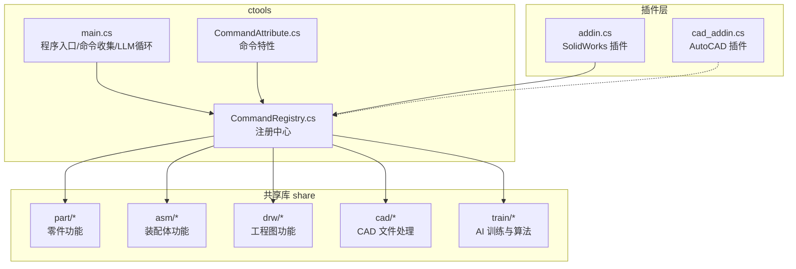
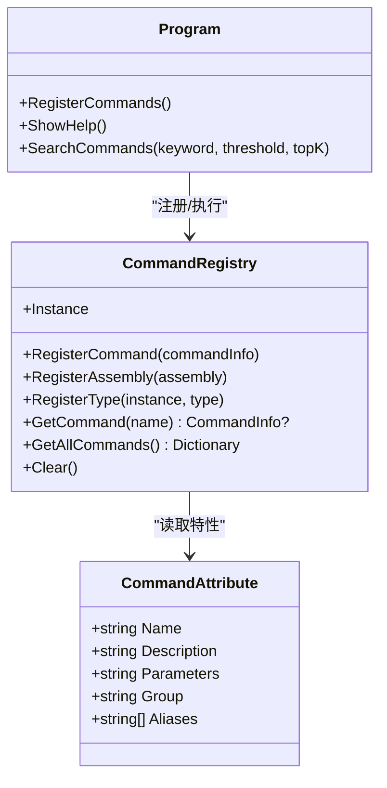
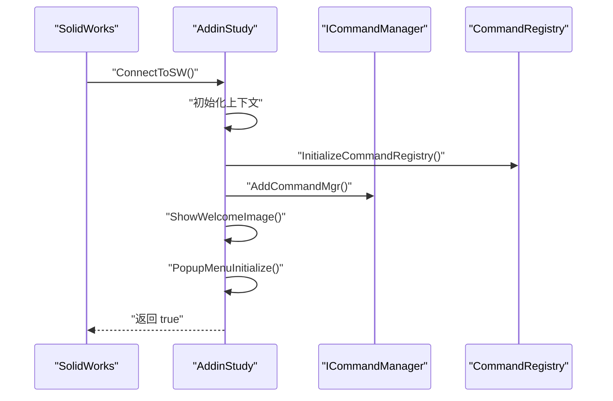
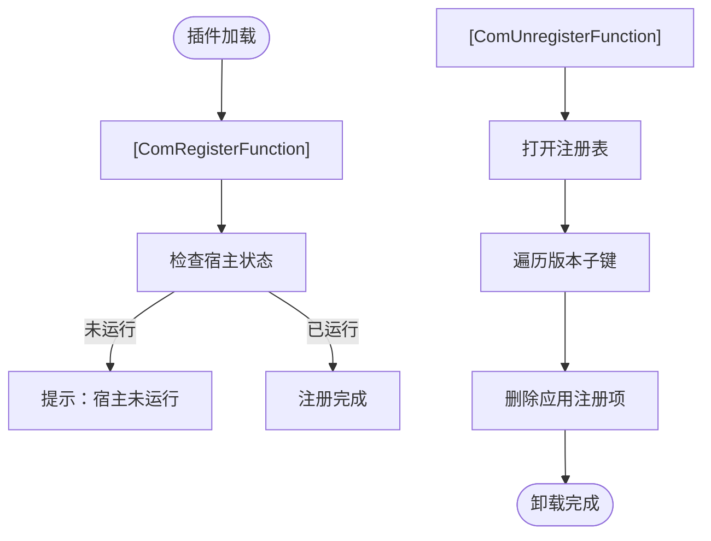
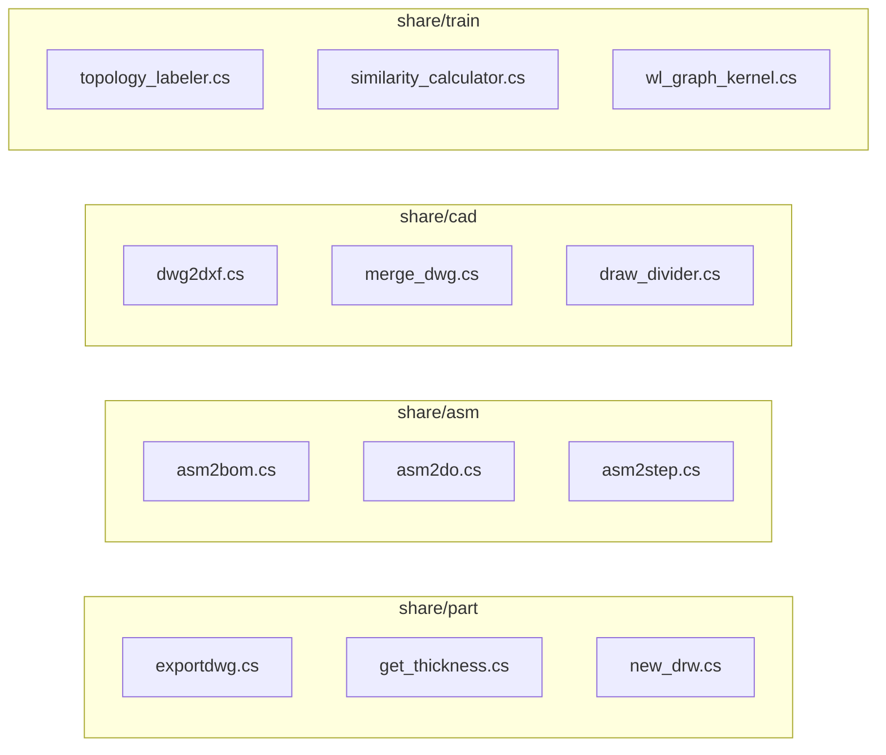
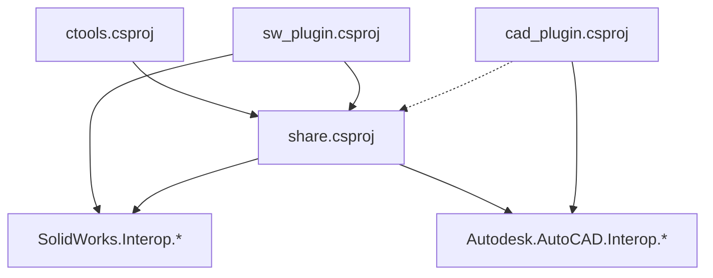

# 开发指南

<cite>
**本文引用的文件**
- [README.md](file://README.md)
- [my_ai.sln](file://my_ai.sln)
- [sw_plugin.csproj](file://sw_plugin/sw_plugin.csproj)
- [cad_plugin.csproj](file://cad_plugin/cad_plugin.csproj)
- [share.csproj](file://share/share.csproj)
- [CommandAttribute.cs](file://ctools/CommandAttribute.cs)
- [CommandRegistry.cs](file://ctools/CommandRegistry.cs)
- [main.cs](file://ctools/main.cs)
- [addin.cs](file://sw_plugin/addin.cs)
- [cad_addin.cs](file://cad_plugin/cad_addin.cs)
- [exportdwg.cs](file://share/part/exportdwg.cs)
- [asm2bom.cs](file://share/asm/asm2bom.cs)
- [dwg2dxf.cs](file://share/cad/dwg2dxf.cs)
- [topology_labeler.cs](file://share/train/topology_labeler.cs)
</cite>

## 目录
1. [简介](#简介)
2. [项目结构](#项目结构)
3. [核心组件](#核心组件)
4. [架构总览](#架构总览)
5. [详细组件分析](#详细组件分析)
6. [依赖关系分析](#依赖关系分析)
7. [性能考虑](#性能考虑)
8. [故障排查指南](#故障排查指南)
9. [结论](#结论)
10. [附录](#附录)

## 简介
本指南面向新加入的开发者，系统化阐述 my_ai 项目的开发规范、代码组织、实现模式、测试与调试策略、扩展与插件开发要点，以及 COM 组件与 .NET 开发注意事项。项目由命令行工具 ctools、SolidWorks 插件 sw_plugin、AutoCAD 插件 cad_plugin 与共享功能库 share 四部分组成，围绕统一的命令系统与命令注册中心实现跨应用扩展。

## 项目结构
项目采用多项目解决方案布局，按职责清晰分离：
- ctools：命令行工具与 AI 对话循环，负责命令解析、注册与执行
- sw_plugin：SolidWorks 插件，集成菜单、右键菜单与控制台输出
- cad_plugin：AutoCAD 插件，提供 COM 注册与卸载逻辑
- share：共享功能库，封装 SolidWorks/AutoCAD 操作与 AI 训练算法

图表来源
- [my_ai.sln:1-43](file://my_ai.sln#L1-L43)
- [sw_plugin.csproj:1-74](file://sw_plugin/sw_plugin.csproj#L1-L74)
- [cad_plugin.csproj:1-46](file://cad_plugin/cad_plugin.csproj#L1-L46)
- [share.csproj:1-40](file://share/share.csproj#L1-L40)

章节来源
- [README.md:193-249](file://README.md#L193-L249)
- [my_ai.sln:1-43](file://my_ai.sln#L1-L43)

## 核心组件
- 命令系统
  - 命令特性：CommandAttribute 定义命令名称、描述、参数、分组与别名
  - 命令注册中心：CommandRegistry 提供全局注册、批量扫描、实例方法注册与并发安全
  - 命令执行器：ctools 主程序负责命令收集、性能标注与模糊搜索
- 插件系统
  - SolidWorks 插件：ISwAddin 实现，命令管理器集成、右键菜单、欢迎界面与控制台输出
  - AutoCAD 插件：COM 可见类，注册/卸载逻辑与 IExtensionApplication 初始化
- 共享功能库
  - 零件/装配体/工程图/CAD 文件处理与 AI 训练算法（拓扑标注、相似度计算等）

章节来源
- [CommandAttribute.cs:1-20](file://ctools/CommandAttribute.cs#L1-L20)
- [CommandRegistry.cs:1-242](file://ctools/CommandRegistry.cs#L1-L242)
- [main.cs:1-377](file://ctools/main.cs#L1-L377)
- [addin.cs:1-339](file://sw_plugin/addin.cs#L1-L339)
- [cad_addin.cs:1-103](file://cad_plugin/cad_addin.cs#L1-L103)

## 架构总览
整体架构围绕“命令即功能”的理念，通过特性驱动的命令注册与统一的注册中心实现跨应用扩展；AI 对话循环将自然语言映射到命令；插件层负责与宿主应用（SolidWorks/AutoCAD）集成。

图表来源
- [main.cs:1-377](file://ctools/main.cs#L1-L377)
- [CommandRegistry.cs:1-242](file://ctools/CommandRegistry.cs#L1-L242)
- [CommandAttribute.cs:1-20](file://ctools/CommandAttribute.cs#L1-L20)
- [addin.cs:1-339](file://sw_plugin/addin.cs#L1-L339)
- [cad_addin.cs:1-103](file://cad_plugin/cad_addin.cs#L1-L103)

## 详细组件分析

### 命令系统与注册中心
- 命令特性 CommandAttribute
  - 字段：名称、描述、参数、分组、别名
  - 用途：通过特性标记静态/实例方法为命令
- 命令注册中心 CommandRegistry
  - 单例模式，线程安全注册与查找
  - 支持从程序集批量扫描与从实例类型注册
  - 支持同步/异步命令执行与异常包装
- 命令执行器（ctools）
  - 命令收集：反射扫描自身程序集中的命令方法
  - 性能标注：支持 [Profiled] 属性对命令执行耗时统计
  - 模糊搜索：基于编辑距离与字符集合重叠度的相似度评分

图表来源
- [CommandAttribute.cs:1-20](file://ctools/CommandAttribute.cs#L1-L20)
- [CommandRegistry.cs:1-242](file://ctools/CommandRegistry.cs#L1-L242)
- [main.cs:1-377](file://ctools/main.cs#L1-L377)

章节来源
- [CommandAttribute.cs:1-20](file://ctools/CommandAttribute.cs#L1-L20)
- [CommandRegistry.cs:1-242](file://ctools/CommandRegistry.cs#L1-L242)
- [main.cs:1-377](file://ctools/main.cs#L1-L377)

### SolidWorks 插件（sw_plugin）
- COM 与注册
  - ISwAddin 实现，GUID 固定，支持 COM 注册/反注册
  - 通过注册表项控制“启动时加载”
- 用户界面与控制台
  - 欢迎界面显示版本信息与倒计时按钮
  - 控制台输出窗口可置顶显示并拦截输出
- 命令管理器与右键菜单
  - 初始化命令注册表，集成命令管理器与弹出菜单
- 与共享库协作
  - 通过 share 项目引用共享命令与工具

图表来源
- [addin.cs:1-339](file://sw_plugin/addin.cs#L1-L339)
- [CommandRegistry.cs:1-242](file://ctools/CommandRegistry.cs#L1-L242)

章节来源
- [addin.cs:1-339](file://sw_plugin/addin.cs#L1-L339)
- [sw_plugin.csproj:1-74](file://sw_plugin/sw_plugin.csproj#L1-L74)

### AutoCAD 插件（cad_plugin）
- COM 注册/卸载
  - 通过 [ComRegisterFunction]/[ComUnregisterFunction] 管理注册表项
  - 卸载逻辑遍历 AutoCAD 版本子键并删除应用注册
- 插件初始化
  - IExtensionApplication.Initialize 在加载时输出提示信息
- 与共享库协作
  - 通过 share 项目引用共享命令与工具

图表来源
- [cad_addin.cs:1-103](file://cad_plugin/cad_addin.cs#L1-L103)

章节来源
- [cad_addin.cs:1-103](file://cad_plugin/cad_addin.cs#L1-L103)
- [cad_plugin.csproj:1-46](file://cad_plugin/cad_plugin.csproj#L1-L46)

### 共享功能库（share）
- 零件功能：导出 DWG、获取厚度、新建工程图等
- 装配体功能：生成 BOM、装配体转工程图、导出 STEP 等
- 工程图功能：工程图转 DWG/DXF/PNG、可见边线提取等
- CAD 文件处理：DWG/DXF 转换、合并、绘制分隔线等
- AI 训练与算法：拓扑标注、相似度计算、WL 图核等

图表来源
- [exportdwg.cs:1-81](file://share/part/exportdwg.cs#L1-L81)
- [asm2bom.cs:1-404](file://share/asm/asm2bom.cs#L1-L404)
- [dwg2dxf.cs:1-40](file://share/cad/dwg2dxf.cs#L1-L40)
- [topology_labeler.cs:1-680](file://share/train/topology_labeler.cs#L1-L680)

章节来源
- [exportdwg.cs:1-81](file://share/part/exportdwg.cs#L1-L81)
- [asm2bom.cs:1-404](file://share/asm/asm2bom.cs#L1-L404)
- [dwg2dxf.cs:1-40](file://share/cad/dwg2dxf.cs#L1-L40)
- [topology_labeler.cs:1-680](file://share/train/topology_labeler.cs#L1-L680)

## 依赖关系分析
- 项目依赖
  - ctools 与 sw_plugin 依赖 share
  - sw_plugin 引用 SolidWorks Interop 与 Tools
  - share 引用 SolidWorks 与 AutoCAD Interop
  - cad_plugin 引用 AutoCAD Interop
- 命令注册与执行
  - ctools 通过反射扫描自身程序集注册命令
  - 插件通过 CommandRegistry 共享命令字典
  - 命令执行器根据 CommandInfo.AsyncAction 调用

图表来源
- [sw_plugin.csproj:1-74](file://sw_plugin/sw_plugin.csproj#L1-L74)
- [cad_plugin.csproj:1-46](file://cad_plugin/cad_plugin.csproj#L1-L46)
- [share.csproj:1-40](file://share/share.csproj#L1-L40)

章节来源
- [sw_plugin.csproj:1-74](file://sw_plugin/sw_plugin.csproj#L1-L74)
- [cad_plugin.csproj:1-46](file://cad_plugin/cad_plugin.csproj#L1-L46)
- [share.csproj:1-40](file://share/share.csproj#L1-L40)

## 性能考虑
- 命令性能标注
  - 通过 [Profiled] 属性对命令执行耗时进行统计输出
- 模糊搜索优化
  - 使用编辑距离与字符集合重叠度组合评分，避免全量匹配
- 异步命令
  - CommandRegistry 支持 Task 返回类型的异步命令，提升交互体验
- I/O 与外部进程
  - 导出/转换等操作涉及磁盘与外部应用，注意异常捕获与资源释放

章节来源
- [main.cs:1-377](file://ctools/main.cs#L1-L377)
- [CommandRegistry.cs:1-242](file://ctools/CommandRegistry.cs#L1-L242)

## 故障排查指南
- 插件注册失败
  - 确保以管理员身份运行注册脚本或 regasm 命令
  - 检查 DLL 是否存在于发布目录
  - 确认 SolidWorks/AutoCAD 版本兼容
- SolidWorks 插件未显示
  - 在 SolidWorks “工具” > “插件”中勾选插件并重启
  - 检查注册表项：HKEY_CURRENT_USER\Software\SolidWorks\AddInsStartup
- ctools 无法连接 SolidWorks
  - 先启动 SolidWorks 并确保有激活文档
  - 以管理员身份运行 ctool.exe
- 命令执行无响应
  - 查看控制台输出与 SolidWorks 错误提示
  - 确认当前文档类型符合命令要求
- AI 对话无法识别命令
  - 使用更明确的命令描述或切换到直接命令模式
  - 使用 search 命令查看可用命令列表

章节来源
- [README.md:281-340](file://README.md#L281-L340)

## 结论
本指南提供了从项目结构、命令系统、插件集成到性能与故障排查的完整开发指引。遵循统一的命令定义与注册规范、合理的项目分层与依赖管理，可高效扩展新功能并保持代码一致性与可维护性。

## 附录

### 命令开发最佳实践
- 命名约定
  - 使用小写字母与下划线，动词+名词结构
  - 避免使用大写与中文
- 命令特性定义
  - 必填：名称
  - 建议：描述、参数、分组、别名
- 实现模式
  - 静态方法用于 ctools；实例方法用于插件
  - 异步命令返回 Task，同步命令返回 void
  - 使用 [Profiled] 标注耗时命令

章节来源
- [README.md:343-371](file://README.md#L343-L371)
- [CommandAttribute.cs:1-20](file://ctools/CommandAttribute.cs#L1-L20)
- [CommandRegistry.cs:1-242](file://ctools/CommandRegistry.cs#L1-L242)
- [main.cs:1-377](file://ctools/main.cs#L1-L377)

### 测试策略与调试技巧
- 单元测试
  - 对独立算法（如相似度计算）编写单元测试
  - 使用模拟对象验证命令注册与查找逻辑
- 集成测试
  - 在真实 SolidWorks/AutoCAD 环境中验证命令执行
  - 验证插件加载、菜单集成与控制台输出
- 性能测试
  - 使用 [Profiled] 标注命令，对比不同实现的耗时
  - 对 I/O 密集操作（导出/转换）进行压力测试

章节来源
- [main.cs:1-377](file://ctools/main.cs#L1-L377)
- [topology_labeler.cs:1-680](file://share/train/topology_labeler.cs#L1-L680)

### 扩展点与插件开发指导
- 扩展点
  - 在 share 下新增功能模块，按领域划分（part/asm/drw/cad/train）
  - 通过 CommandAttribute 标记新命令，自动被注册中心发现
- 插件开发
  - SolidWorks 插件：实现 ISwAddin，集成命令管理器与右键菜单
  - AutoCAD 插件：实现 IExtensionApplication，提供 COM 注册/卸载

章节来源
- [CommandRegistry.cs:1-242](file://ctools/CommandRegistry.cs#L1-L242)
- [addin.cs:1-339](file://sw_plugin/addin.cs#L1-L339)
- [cad_addin.cs:1-103](file://cad_plugin/cad_addin.cs#L1-L103)

### COM 组件与 .NET 开发注意事项
- COM 可见性
  - 确保 ComVisible=true，必要时显式 Guid
- 注册与反注册
  - 使用 [ComRegisterFunction]/[ComUnregisterFunction]
  - 注意以管理员权限运行
- 平台与框架
  - 目标框架 net48，平台 x64
  - 引用 Interop DLL 时使用相对路径与私有复制

章节来源
- [sw_plugin.csproj:1-74](file://sw_plugin/sw_plugin.csproj#L1-L74)
- [cad_plugin.csproj:1-46](file://cad_plugin/cad_plugin.csproj#L1-L46)
- [share.csproj:1-40](file://share/share.csproj#L1-L40)

### 代码审查清单与质量保证流程
- 代码审查清单
  - 命令命名与特性标注是否规范
  - 是否存在异常吞吐与资源泄漏
  - 是否使用异步与并发安全结构
  - 是否提供必要的日志与错误提示
- 质量保证流程
  - 提交前本地构建与单元测试
  - 集成测试覆盖关键命令与插件功能
  - 性能回归测试与基准对比

章节来源
- [README.md:343-371](file://README.md#L343-L371)
- [CommandRegistry.cs:1-242](file://ctools/CommandRegistry.cs#L1-L242)
- [main.cs:1-377](file://ctools/main.cs#L1-L377)