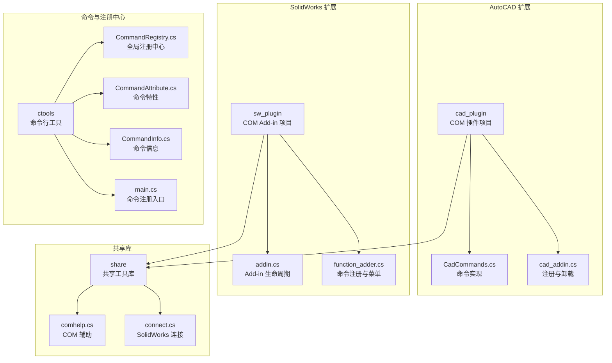
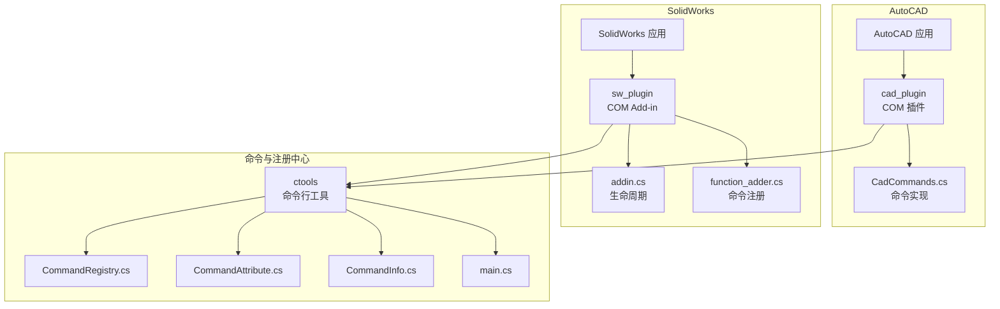
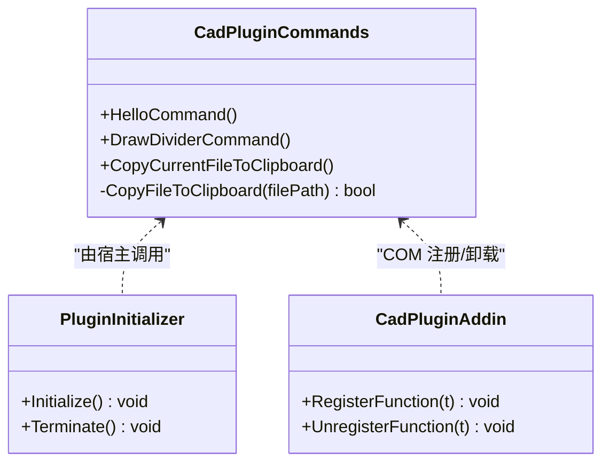
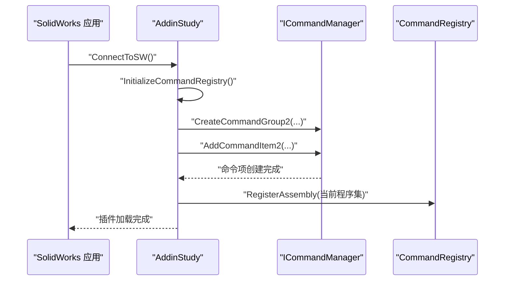
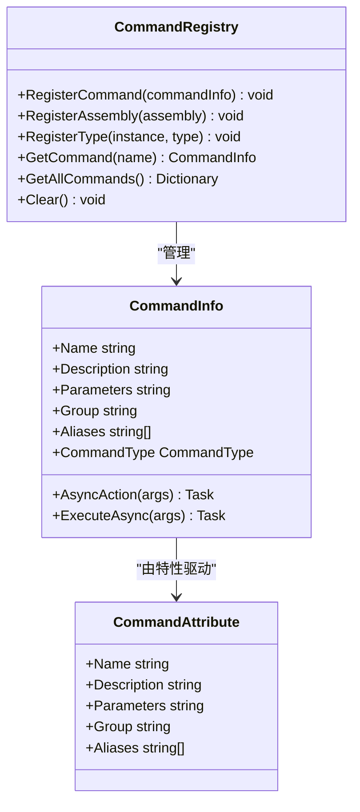
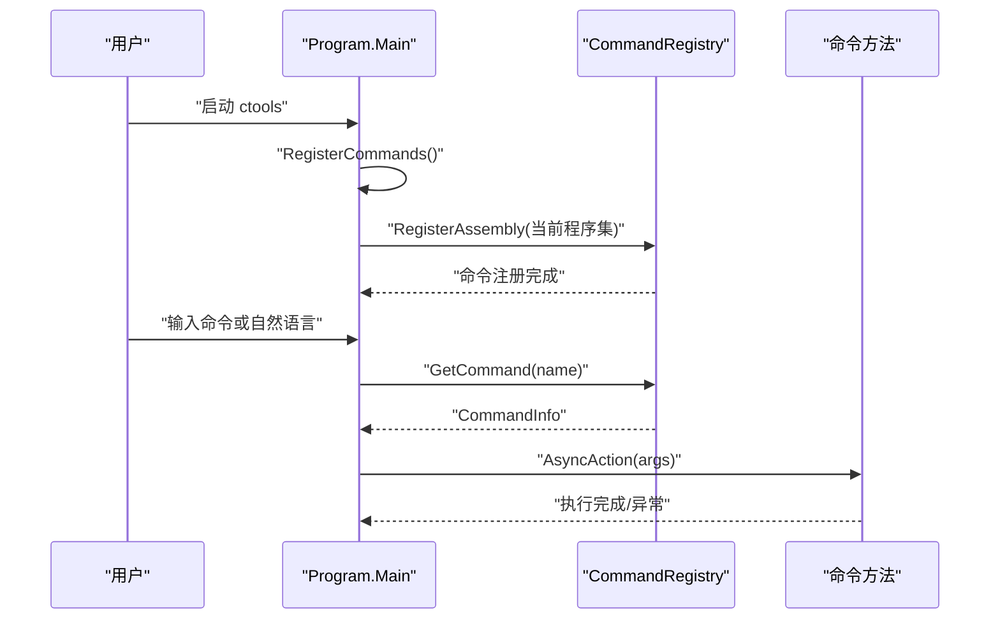
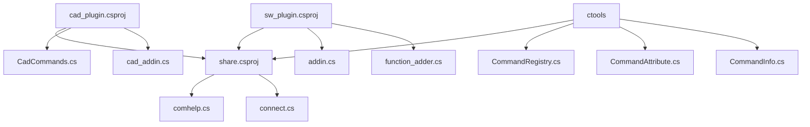

# 扩展开发指南

<cite>
**本文档引用的文件**
- [cad_plugin.csproj](file://cad_plugin/cad_plugin.csproj)
- [sw_plugin.csproj](file://sw_plugin/sw_plugin.csproj)
- [share.csproj](file://share/share.csproj)
- [CadCommands.cs](file://cad_plugin/CadCommands.cs)
- [cad_addin.cs](file://cad_plugin/cad_addin.cs)
- [addin.cs](file://sw_plugin/addin.cs)
- [function_adder.cs](file://sw_plugin/function_adder.cs)
- [main.cs](file://ctools/main.cs)
- [CommandRegistry.cs](file://ctools/CommandRegistry.cs)
- [CommandAttribute.cs](file://ctools/CommandAttribute.cs)
- [CommandInfo.cs](file://ctools/CommandInfo.cs)
- [connect.cs](file://ctools/connect.cs)
- [comhelp.cs](file://share/nomal/comhelp.cs)
- [part_commands.cs](file://ctools/solidworks_commands/part_commands.cs)
- [asm_commands.cs](file://ctools/solidworks_commands/asm_commands.cs)
- [drw_commands.cs](file://ctools/solidworks_commands/drw_commands.cs)
</cite>

## 目录
1. [简介](#简介)
2. [项目结构](#项目结构)
3. [核心组件](#核心组件)
4. [架构总览](#架构总览)
5. [详细组件分析](#详细组件分析)
6. [依赖关系分析](#依赖关系分析)
7. [性能考虑](#性能考虑)
8. [故障排除指南](#故障排除指南)
9. [结论](#结论)
10. [附录](#附录)

## 简介
本指南面向希望在 AutoCAD 和 SolidWorks 生态系统中开发扩展的开发者，涵盖命令与功能模块的开发流程、命令注册机制的扩展方法、自定义命令特性的实现、插件开发的完整生命周期（从设计到部署）、COM 组件与 .NET 插件的差异与注意事项、扩展点识别与接口设计原则、版本兼容性与向后兼容性考虑，以及安全与稳定性保障的最佳实践。文档基于仓库中的现有实现进行深入分析，并提供可操作的扩展步骤与可视化图表。

## 项目结构
该项目采用多项目协作的结构，分别针对 AutoCAD 插件、SolidWorks 插件与共享工具库进行模块化组织：

- cad_plugin：AutoCAD 插件项目，包含 COM 插件宿主、命令实现与注册脚本。
- sw_plugin：SolidWorks 插件项目，包含 COM Add-in 实现、命令注册与菜单集成。
- ctools：命令行工具与命令注册中心，负责命令的动态注册、调度与执行。
- share：共享库，提供通用工具、COM 辅助类与跨平台互操作能力。

**图表来源**
- [cad_plugin.csproj:1-46](file://cad_plugin/cad_plugin.csproj#L1-L46)
- [sw_plugin.csproj:1-74](file://sw_plugin/sw_plugin.csproj#L1-L74)
- [share.csproj:1-40](file://share/share.csproj#L1-L40)
- [CadCommands.cs:1-106](file://cad_plugin/CadCommands.cs#L1-L106)
- [cad_addin.cs:1-103](file://cad_plugin/cad_addin.cs#L1-L103)
- [addin.cs:1-339](file://sw_plugin/addin.cs#L1-L339)
- [function_adder.cs:1-206](file://sw_plugin/function_adder.cs#L1-L206)
- [main.cs:1-377](file://ctools/main.cs#L1-L377)
- [CommandRegistry.cs:1-242](file://ctools/CommandRegistry.cs#L1-L242)
- [CommandAttribute.cs:1-20](file://ctools/CommandAttribute.cs#L1-L20)
- [CommandInfo.cs:1-41](file://ctools/CommandInfo.cs#L1-L41)
- [comhelp.cs:1-59](file://share/nomal/comhelp.cs#L1-L59)
- [connect.cs:1-56](file://ctools/connect.cs#L1-L56)

**章节来源**
- [cad_plugin.csproj:1-46](file://cad_plugin/cad_plugin.csproj#L1-L46)
- [sw_plugin.csproj:1-74](file://sw_plugin/sw_plugin.csproj#L1-L74)
- [share.csproj:1-40](file://share/share.csproj#L1-L40)

## 核心组件
本节聚焦于扩展开发的关键组件，包括命令注册中心、命令特性、命令信息模型以及各插件的生命周期管理。

- 命令注册中心（CommandRegistry）
  - 单例模式，提供命令注册、批量注册、查询与清理能力。
  - 支持静态方法与实例方法的命令注册，便于插件化扩展。
  - 提供命令别名注册，增强易用性与向后兼容性。

- 命令特性（CommandAttribute）
  - 定义命令名称、描述、参数、分组与别名。
  - 支持同步与异步命令类型识别，统一执行入口。

- 命令信息（CommandInfo）
  - 封装命令元数据与执行委托（AsyncAction），支持参数化执行。
  - 区分同步与异步命令类型，便于性能优化与并发控制。

- AutoCAD 插件（cad_plugin）
  - 通过 COM 插件宿主暴露命令，支持剪贴板、文件操作等实用功能。
  - 提供注册与卸载逻辑，便于部署与维护。

- SolidWorks 插件（sw_plugin）
  - 基于 COM Add-in 架构，实现命令注册、菜单集成与文档类型适配。
  - 通过命令代理（FunctionProxy）与命令注册表实现菜单到方法的映射。

**章节来源**
- [CommandRegistry.cs:1-242](file://ctools/CommandRegistry.cs#L1-L242)
- [CommandAttribute.cs:1-20](file://ctools/CommandAttribute.cs#L1-L20)
- [CommandInfo.cs:1-41](file://ctools/CommandInfo.cs#L1-L41)
- [CadCommands.cs:1-106](file://cad_plugin/CadCommands.cs#L1-L106)
- [cad_addin.cs:1-103](file://cad_plugin/cad_addin.cs#L1-L103)
- [addin.cs:1-339](file://sw_plugin/addin.cs#L1-L339)
- [function_adder.cs:1-206](file://sw_plugin/function_adder.cs#L1-L206)

## 架构总览
下图展示了 AutoCAD 与 SolidWorks 扩展的架构关系，以及命令注册中心在整个系统中的作用。

**图表来源**
- [CadCommands.cs:1-106](file://cad_plugin/CadCommands.cs#L1-L106)
- [cad_addin.cs:1-103](file://cad_plugin/cad_addin.cs#L1-L103)
- [addin.cs:1-339](file://sw_plugin/addin.cs#L1-L339)
- [function_adder.cs:1-206](file://sw_plugin/function_adder.cs#L1-L206)
- [main.cs:1-377](file://ctools/main.cs#L1-L377)
- [CommandRegistry.cs:1-242](file://ctools/CommandRegistry.cs#L1-L242)
- [CommandAttribute.cs:1-20](file://ctools/CommandAttribute.cs#L1-L20)
- [CommandInfo.cs:1-41](file://ctools/CommandInfo.cs#L1-L41)

## 详细组件分析

### AutoCAD 插件组件分析
AutoCAD 插件通过 COM 插件宿主暴露命令，并提供实用功能（如文件复制到剪贴板）。其关键点包括：
- 命令方法使用 AutoCAD 的命令特性进行声明。
- 插件提供 COM 注册与卸载逻辑，便于部署与维护。
- 通过共享库实现跨平台互操作与通用工具。

**图表来源**
- [CadCommands.cs:1-106](file://cad_plugin/CadCommands.cs#L1-L106)
- [cad_addin.cs:1-103](file://cad_plugin/cad_addin.cs#L1-L103)

**章节来源**
- [CadCommands.cs:1-106](file://cad_plugin/CadCommands.cs#L1-L106)
- [cad_addin.cs:1-103](file://cad_plugin/cad_addin.cs#L1-L103)

### SolidWorks 插件组件分析
SolidWorks 插件基于 COM Add-in 架构，实现命令注册、菜单集成与文档类型适配。关键流程如下：
- 插件在连接应用时初始化命令注册中心与命令组。
- 通过命令代理（FunctionProxy）将菜单点击映射到具体方法。
- 支持不同文档类型的命令分组与显示控制。

**图表来源**
- [addin.cs:96-120](file://sw_plugin/addin.cs#L96-L120)
- [function_adder.cs:75-206](file://sw_plugin/function_adder.cs#L75-L206)
- [CommandRegistry.cs:61-83](file://ctools/CommandRegistry.cs#L61-L83)

**章节来源**
- [addin.cs:1-339](file://sw_plugin/addin.cs#L1-L339)
- [function_adder.cs:1-206](file://sw_plugin/function_adder.cs#L1-L206)

### 命令注册中心与命令特性分析
命令注册中心通过反射扫描程序集，自动发现并注册带有命令特性的方法，支持同步与异步命令的统一执行。命令特性定义了命令的基本元数据，命令信息封装了执行委托与类型。

**图表来源**
- [CommandRegistry.cs:1-242](file://ctools/CommandRegistry.cs#L1-L242)
- [CommandAttribute.cs:1-20](file://ctools/CommandAttribute.cs#L1-L20)
- [CommandInfo.cs:1-41](file://ctools/CommandInfo.cs#L1-L41)

**章节来源**
- [CommandRegistry.cs:1-242](file://ctools/CommandRegistry.cs#L1-L242)
- [CommandAttribute.cs:1-20](file://ctools/CommandAttribute.cs#L1-L20)
- [CommandInfo.cs:1-41](file://ctools/CommandInfo.cs#L1-L41)

### 命令执行流程（ctools）
ctools 作为命令行工具，负责命令的注册、调度与执行。其核心流程如下：
- 扫描程序集中的命令特性，构建命令字典。
- 将命令注册到全局注册中心，供外部调用。
- 提供命令描述内容生成、帮助信息与相似度搜索。

**图表来源**
- [main.cs:54-109](file://ctools/main.cs#L54-L109)
- [main.cs:170-253](file://ctools/main.cs#L170-L253)
- [CommandRegistry.cs:61-83](file://ctools/CommandRegistry.cs#L61-L83)

**章节来源**
- [main.cs:1-377](file://ctools/main.cs#L1-L377)
- [CommandRegistry.cs:1-242](file://ctools/CommandRegistry.cs#L1-L242)

### COM 组件与 .NET 插件的差异与注意事项
- AutoCAD 插件（COM）
  - 使用 COM 插件宿主，命令通过 AutoCAD 的命令特性声明。
  - 注册与卸载通过 COM 回调与注册表脚本实现。
  - 适合与 AutoCAD 原生集成，命令生命周期由 AutoCAD 管理。

- SolidWorks 插件（COM Add-in）
  - 使用 SolidWorks 的 Add-in 接口，支持菜单与工具栏集成。
  - 通过命令代理与命令注册表实现菜单到方法的映射。
  - 支持不同文档类型的命令分组与显示控制。

- 共享库与互操作
  - 共享库提供通用工具与 COM 辅助类，便于跨平台与跨应用互操作。
  - 通过 COM 辅助类实现对活动对象的获取与管理。

**章节来源**
- [cad_addin.cs:1-103](file://cad_plugin/cad_addin.cs#L1-L103)
- [CadCommands.cs:1-106](file://cad_plugin/CadCommands.cs#L1-L106)
- [addin.cs:1-339](file://sw_plugin/addin.cs#L1-L339)
- [function_adder.cs:1-206](file://sw_plugin/function_adder.cs#L1-L206)
- [comhelp.cs:1-59](file://share/nomal/comhelp.cs#L1-L59)

## 依赖关系分析
下图展示了项目间的依赖关系，突出共享库在 AutoCAD 与 SolidWorks 插件中的复用。

**图表来源**
- [cad_plugin.csproj:42-44](file://cad_plugin/cad_plugin.csproj#L42-L44)
- [sw_plugin.csproj:24-26](file://sw_plugin/sw_plugin.csproj#L24-L26)
- [share.csproj:1-40](file://share/share.csproj#L1-L40)
- [CadCommands.cs:1-106](file://cad_plugin/CadCommands.cs#L1-L106)
- [cad_addin.cs:1-103](file://cad_plugin/cad_addin.cs#L1-L103)
- [addin.cs:1-339](file://sw_plugin/addin.cs#L1-L339)
- [function_adder.cs:1-206](file://sw_plugin/function_adder.cs#L1-L206)
- [CommandRegistry.cs:1-242](file://ctools/CommandRegistry.cs#L1-L242)
- [CommandAttribute.cs:1-20](file://ctools/CommandAttribute.cs#L1-L20)
- [CommandInfo.cs:1-41](file://ctools/CommandInfo.cs#L1-L41)
- [comhelp.cs:1-59](file://share/nomal/comhelp.cs#L1-L59)
- [connect.cs:1-56](file://ctools/connect.cs#L1-L56)

**章节来源**
- [cad_plugin.csproj:1-46](file://cad_plugin/cad_plugin.csproj#L1-L46)
- [sw_plugin.csproj:1-74](file://sw_plugin/sw_plugin.csproj#L1-L74)
- [share.csproj:1-40](file://share/share.csproj#L1-L40)

## 性能考虑
- 命令执行性能
  - 命令注册中心支持同步与异步命令类型识别，异步命令可通过任务等待提升响应性。
  - 命令特性支持性能监控装饰器，便于在开发阶段定位性能瓶颈。

- 命令相似度与搜索
  - 命令行工具提供命令相似度计算与搜索功能，有助于提升用户体验与易用性。

- COM 互操作
  - 共享库提供 COM 辅助类，减少重复实现，提升互操作性能与稳定性。

**章节来源**
- [CommandRegistry.cs:158-196](file://ctools/CommandRegistry.cs#L158-L196)
- [main.cs:28-32](file://ctools/main.cs#L28-L32)
- [main.cs:255-311](file://ctools/main.cs#L255-L311)
- [comhelp.cs:1-59](file://share/nomal/comhelp.cs#L1-L59)

## 故障排除指南
- AutoCAD 插件卸载失败
  - 检查注册表路径与权限，确保卸载逻辑能够正确删除注册项。
  - 如未找到注册项，提示用户确认插件状态。

- SolidWorks 插件注册失败
  - 确认 COM 注册函数与注册表键值正确写入。
  - 检查 Add-in 属性与 GUID 是否一致。

- 命令执行异常
  - 命令注册中心捕获目标调用异常与一般异常，输出详细错误信息。
  - 建议在命令实现中增加异常处理与日志记录。

- COM 对象获取失败
  - 使用共享库提供的 COM 辅助类，支持多种 CLSID 获取方式，提升兼容性。

**章节来源**
- [cad_addin.cs:24-80](file://cad_plugin/cad_addin.cs#L24-L80)
- [addin.cs:262-333](file://sw_plugin/addin.cs#L262-L333)
- [CommandRegistry.cs:184-193](file://ctools/CommandRegistry.cs#L184-L193)
- [comhelp.cs:17-46](file://share/nomal/comhelp.cs#L17-L46)

## 结论
本指南基于现有代码库，系统梳理了 AutoCAD 与 SolidWorks 扩展开发的架构与实现细节，重点阐述了命令注册机制、扩展点识别与接口设计原则、COM 组件与 .NET 插件的差异、版本兼容性与向后兼容性考虑，以及安全与稳定性保障的最佳实践。通过命令注册中心与命令特性，开发者可以快速扩展新的命令与功能模块，并将其无缝集成到 AutoCAD 与 SolidWorks 的工作流中。

## 附录

### 扩展开发流程（从设计到部署）
- 设计阶段
  - 明确命令功能与参数，定义命令特性元数据（名称、描述、分组、别名）。
  - 设计命令实现，确保异常处理与日志记录完善。

- 实现阶段
  - 在目标项目中实现命令方法，并使用命令特性进行标记。
  - 将命令注册到全局注册中心，或通过程序集扫描自动注册。

- 集成阶段
  - AutoCAD：通过 COM 插件宿主暴露命令，提供注册与卸载逻辑。
  - SolidWorks：通过 Add-in 生命周期初始化命令注册中心与命令组，实现菜单集成。

- 部署阶段
  - AutoCAD：使用注册表脚本或 COM 注册函数完成部署。
  - SolidWorks：通过 COM 注册函数与注册表键值完成 Add-in 部署。

**章节来源**
- [CommandAttribute.cs:1-20](file://ctools/CommandAttribute.cs#L1-L20)
- [CommandRegistry.cs:61-83](file://ctools/CommandRegistry.cs#L61-L83)
- [cad_addin.cs:16-80](file://cad_plugin/cad_addin.cs#L16-L80)
- [addin.cs:262-333](file://sw_plugin/addin.cs#L262-L333)

### 扩展示例与最佳实践
- 新增 SolidWorks 命令
  - 在命令文件中使用命令特性标记新方法，定义描述与参数。
  - 在命令注册入口中注册程序集，确保命令被全局注册中心发现。
  - 示例参考：[part_commands.cs:11-19](file://ctools/solidworks_commands/part_commands.cs#L11-L19)，[asm_commands.cs:11-21](file://ctools/solidworks_commands/asm_commands.cs#L11-L21)，[drw_commands.cs:14-29](file://ctools/solidworks_commands/drw_commands.cs#L14-L29)

- 新增 AutoCAD 命令
  - 在命令类中实现新方法，使用 AutoCAD 命令特性进行声明。
  - 通过插件宿主加载命令，确保命令在 AutoCAD 中可用。
  - 示例参考：[CadCommands.cs:14-19](file://cad_plugin/CadCommands.cs#L14-L19)

- 命令别名与向后兼容
  - 通过命令特性定义别名，提升易用性与兼容性。
  - 示例参考：[part_commands.cs:21-27](file://ctools/solidworks_commands/part_commands.cs#L21-L27)

**章节来源**
- [part_commands.cs:1-149](file://ctools/solidworks_commands/part_commands.cs#L1-L149)
- [asm_commands.cs:1-158](file://ctools/solidworks_commands/asm_commands.cs#L1-L158)
- [drw_commands.cs:1-165](file://ctools/solidworks_commands/drw_commands.cs#L1-L165)
- [CadCommands.cs:1-106](file://cad_plugin/CadCommands.cs#L1-L106)

### 版本兼容性与向后兼容性考虑
- 命令别名
  - 通过命令别名支持旧命令名称，确保向后兼容。
  - 参考：[CommandRegistry.cs:43-54](file://ctools/CommandRegistry.cs#L43-L54)

- 文档类型适配
  - SolidWorks 插件支持不同文档类型的命令分组与显示控制，提升兼容性。
  - 参考：[function_adder.cs:152-198](file://sw_plugin/function_adder.cs#L152-L198)

- 平台与框架
  - 项目统一使用 .NET Framework 4.8，确保与 AutoCAD 与 SolidWorks 的互操作稳定。
  - 参考：[cad_plugin.csproj](file://cad_plugin/cad_plugin.csproj#L4)，[sw_plugin.csproj](file://sw_plugin/sw_plugin.csproj#L4)，[share.csproj](file://share/share.csproj#L4)

**章节来源**
- [CommandRegistry.cs:43-54](file://ctools/CommandRegistry.cs#L43-L54)
- [function_adder.cs:152-198](file://sw_plugin/function_adder.cs#L152-L198)
- [cad_plugin.csproj](file://cad_plugin/cad_plugin.csproj#L4)
- [sw_plugin.csproj](file://sw_plugin/sw_plugin.csproj#L4)
- [share.csproj](file://share/share.csproj#L4)

### 安全性与稳定性保障
- 异常处理
  - 命令注册中心捕获并处理命令执行过程中的异常，避免插件崩溃。
  - 参考：[CommandRegistry.cs:184-193](file://ctools/CommandRegistry.cs#L184-L193)

- COM 互操作安全
  - 使用共享库提供的 COM 辅助类，减少不安全的互操作风险。
  - 参考：[comhelp.cs:1-59](file://share/nomal/comhelp.cs#L1-L59)

- 插件生命周期管理
  - AutoCAD 与 SolidWorks 插件均提供初始化与终止逻辑，确保资源正确释放。
  - 参考：[cad_addin.cs:84-103](file://cad_plugin/cad_addin.cs#L84-L103)，[addin.cs:211-218](file://sw_plugin/addin.cs#L211-L218)

**章节来源**
- [CommandRegistry.cs:184-193](file://ctools/CommandRegistry.cs#L184-L193)
- [comhelp.cs:1-59](file://share/nomal/comhelp.cs#L1-L59)
- [cad_addin.cs:84-103](file://cad_plugin/cad_addin.cs#L84-L103)
- [addin.cs:211-218](file://sw_plugin/addin.cs#L211-L218)