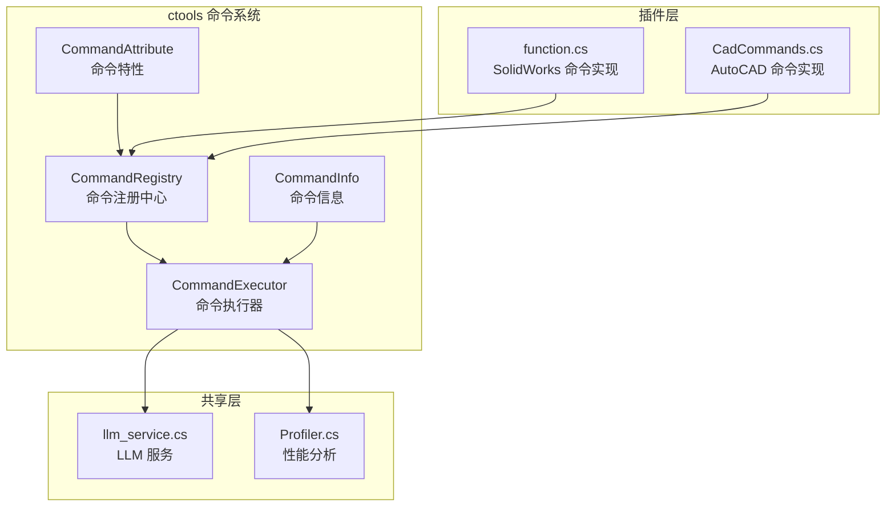
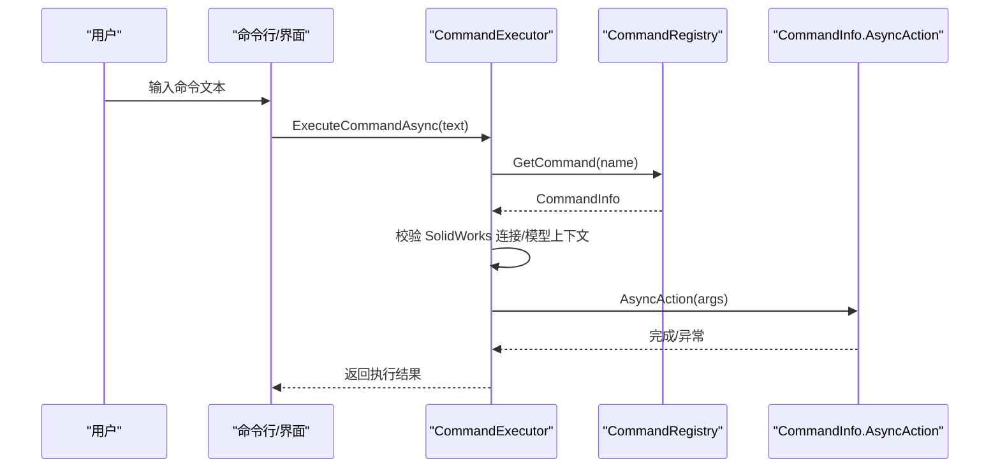
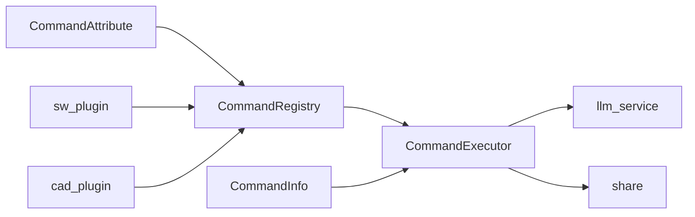

# 测试策略与实践

<cite>
**本文引用的文件**
- [CommandRegistry.cs](file://ctools/CommandRegistry.cs)
- [CommandExecutor.cs](file://ctools/command_executor.cs)
- [CommandAttribute.cs](file://ctools/CommandAttribute.cs)
- [CommandInfo.cs](file://ctools/CommandInfo.cs)
- [CommandAttribute.cs（SW 插件）](file://sw_plugin/CommandAttribute.cs)
- [function.cs](file://sw_plugin/function.cs)
- [CadCommands.cs](file://cad_plugin/CadCommands.cs)
- [llm_service.cs](file://share/nomal/llm_service.cs)
- [Profiler.cs](file://share/nomal/Profiler.cs)
- [ctool.csproj](file://ctools/ctool.csproj)
- [sw_plugin.csproj](file://sw_plugin/sw_plugin.csproj)
- [cad_plugin.csproj](file://cad_plugin/cad_plugin.csproj)
- [share.csproj](file://share/share.csproj)
</cite>

## 目录
1. [引言](#引言)
2. [项目结构](#项目结构)
3. [核心组件](#核心组件)
4. [架构总览](#架构总览)
5. [详细组件分析](#详细组件分析)
6. [依赖关系分析](#依赖关系分析)
7. [性能考虑](#性能考虑)
8. [故障排除指南](#故障排除指南)
9. [结论](#结论)
10. [附录](#附录)

## 引言
本测试策略文档面向 C# 项目，覆盖单元测试、集成测试与端到端测试的实施方法，重点围绕命令系统（注册、执行、错误处理）、性能与压力测试、调试与故障排除、测试环境与数据准备、测试覆盖率与质量指标，以及测试自动化与持续集成配置建议。目标是确保代码质量与系统稳定性。

## 项目结构
该项目由多个子项目组成，分别服务于不同 CAD 平台与功能模块：
- ctools：命令系统核心（注册、执行、LLM 集成、工具函数）
- sw_plugin：SolidWorks 插件命令实现
- cad_plugin：AutoCAD 插件命令实现
- share：跨平台共享能力（网络请求、文件操作、日志等）

图表来源
- [CommandRegistry.cs:1-242](file://ctools/CommandRegistry.cs#L1-L242)
- [CommandExecutor.cs:1-116](file://ctools/command_executor.cs#L1-L116)
- [CommandAttribute.cs:1-20](file://ctools/CommandAttribute.cs#L1-L20)
- [CommandInfo.cs:1-41](file://ctools/CommandInfo.cs#L1-L41)
- [function.cs:1-663](file://sw_plugin/function.cs#L1-L663)
- [CadCommands.cs:1-106](file://cad_plugin/CadCommands.cs#L1-L106)
- [llm_service.cs:1-800](file://share/nomal/llm_service.cs#L1-L800)
- [Profiler.cs:1-27](file://share/nomal/Profiler.cs#L1-L27)

章节来源
- [ctool.csproj:1-55](file://ctools/ctool.csproj#L1-L55)
- [sw_plugin.csproj:1-74](file://sw_plugin/sw_plugin.csproj#L1-L74)
- [cad_plugin.csproj:1-46](file://cad_plugin/cad_plugin.csproj#L1-L46)
- [share.csproj:1-40](file://share/share.csproj#L1-L40)

## 核心组件
- 命令注册中心：负责命令注册、别名映射、并发安全与反射扫描
- 命令执行器：解析命令文本、校验连接状态、更新模型上下文并执行命令
- 命令特性与信息：声明命令元数据、同步/异步类型与执行动作
- 插件命令实现：通过特性标记声明命令，实现业务逻辑
- LLM 服务：提供搜索、工具过滤与流式调用能力
- 性能分析：统一的性能计时工具

章节来源
- [CommandRegistry.cs:1-242](file://ctools/CommandRegistry.cs#L1-L242)
- [CommandExecutor.cs:1-116](file://ctools/command_executor.cs#L1-L116)
- [CommandAttribute.cs:1-20](file://ctools/CommandAttribute.cs#L1-L20)
- [CommandInfo.cs:1-41](file://ctools/CommandInfo.cs#L1-L41)
- [function.cs:1-663](file://sw_plugin/function.cs#L1-L663)
- [llm_service.cs:1-800](file://share/nomal/llm_service.cs#L1-L800)
- [Profiler.cs:1-27](file://share/nomal/Profiler.cs#L1-L27)

## 架构总览
命令系统采用“特性声明 + 注册中心 + 执行器”的解耦架构。插件通过特性声明命令，注册中心统一收集并建立名称/别名到命令信息的映射，执行器负责解析输入、校验上下文并调度执行。

图表来源
- [CommandExecutor.cs:32-113](file://ctools/command_executor.cs#L32-L113)
- [CommandRegistry.cs:113-131](file://ctools/CommandRegistry.cs#L113-L131)
- [CommandInfo.cs:24-38](file://ctools/CommandInfo.cs#L24-L38)

## 详细组件分析

### 命令注册测试
- 目标：验证命令注册、别名映射、并发安全与反射扫描
- 关键点
  - 注册单个命令：校验名称非空、大小写归一化、别名映射
  - 批量注册：通过反射扫描特性，构建命令字典
  - 实例方法注册：支持插件实例方法的命令绑定
  - 并发安全：锁保护字典访问
- 测试建议
  - 单元测试：构造多个命令（含别名），断言映射正确性
  - 并发测试：多线程同时注册/查询，断言一致性
  - 边界测试：空名称、空别名、重复注册、大小写混合

章节来源
- [CommandRegistry.cs:32-108](file://ctools/CommandRegistry.cs#L32-L108)
- [CommandAttribute.cs:5-17](file://ctools/CommandAttribute.cs#L5-L17)

### 命令执行流程测试
- 目标：验证命令解析、参数拆分、上下文校验与执行调度
- 关键点
  - 命令解析：空白输入、首段为命令名、其余为参数
  - 命令查找：大小写不敏感、别名解析
  - 上下文校验：SolidWorks 连接状态、活动文档
  - 执行调度：同步/异步命令的统一入口
- 测试建议
  - 单元测试：构造命令文本与命令字典，断言执行分支
  - 集成测试：模拟连接状态与模型上下文，断言输出与异常
  - 错误测试：空命令、未知命令、未连接、无活动文档

章节来源
- [CommandExecutor.cs:32-113](file://ctools/command_executor.cs#L32-L113)
- [CommandRegistry.cs:113-131](file://ctools/CommandRegistry.cs#L113-L131)

### 错误处理测试
- 目标：覆盖异常捕获、错误消息与回退行为
- 关键点
  - 反射调用异常：TargetInvocationException 内部异常透传
  - 通用异常：统一记录与返回
  - 用户反馈：向输出窗口或日志写入错误信息
- 测试建议
  - 单元测试：抛出受控异常，断言错误消息与日志
  - 回退测试：部分失败场景下的回退与提示

章节来源
- [CommandRegistry.cs:184-194](file://ctools/CommandRegistry.cs#L184-L194)
- [CommandExecutor.cs:107-112](file://ctools/command_executor.cs#L107-L112)

### 插件命令实现测试（SolidWorks/AutoCAD）
- 目标：验证特性声明、文档类型限制、输出窗口控制与业务逻辑
- 关键点
  - 特性标记：命令 ID、名称、提示、文档类型、输出窗口
  - 业务逻辑：文档存在性检查、异常捕获、用户提示
- 测试建议
  - 单元测试：构造命令方法并通过反射读取特性
  - 集成测试：在插件生命周期内触发命令，断言行为

章节来源
- [CommandAttribute.cs（SW 插件）:8-26](file://sw_plugin/CommandAttribute.cs#L8-L26)
- [function.cs:29-663](file://sw_plugin/function.cs#L29-L663)
- [CadCommands.cs:14-106](file://cad_plugin/CadCommands.cs#L14-L106)

### LLM 服务与搜索测试
- 目标：验证命令搜索、相似度匹配、工具过滤与流式调用
- 关键点
  - 搜索：关键词分词、编辑距离、阈值与 topK
  - 工具过滤：基于搜索结果裁剪工具集合
  - 流式调用：HTTP 请求、超时与异常处理
- 测试建议
  - 单元测试：构造命令描述文本，断言匹配与过滤结果
  - 集成测试：调用真实 API（Mock）验证流式响应

章节来源
- [llm_service.cs:139-311](file://share/nomal/llm_service.cs#L139-L311)
- [llm_service.cs:547-614](file://share/nomal/llm_service.cs#L547-L614)
- [llm_service.cs:706-800](file://share/nomal/llm_service.cs#L706-L800)

### 性能与压力测试
- 目标：评估命令执行、LLM 调用与文件操作的性能表现
- 关键点
  - 性能计时：统一的 Profiler 工具
  - 压力测试：并发命令执行、大量文件操作
- 测试建议
  - 单元测试：使用 Profiler.Time 包裹方法，断言耗时范围
  - 压力测试：多线程/多进程触发命令，监控资源占用与吞吐

章节来源
- [Profiler.cs:6-26](file://share/nomal/Profiler.cs#L6-L26)
- [llm_service.cs:521-527](file://share/nomal/llm_service.cs#L521-L527)

## 依赖关系分析
- 命令系统依赖共享层（网络、JSON、SQLite）
- 插件层依赖 SolidWorks/AutoCAD 互操作库
- 执行器依赖注册中心与 LLM 服务

图表来源
- [CommandRegistry.cs:1-242](file://ctools/CommandRegistry.cs#L1-L242)
- [CommandExecutor.cs:1-116](file://ctools/command_executor.cs#L1-L116)
- [CommandAttribute.cs:1-20](file://ctools/CommandAttribute.cs#L1-L20)
- [CommandInfo.cs:1-41](file://ctools/CommandInfo.cs#L1-L41)
- [function.cs:1-663](file://sw_plugin/function.cs#L1-L663)
- [CadCommands.cs:1-106](file://cad_plugin/CadCommands.cs#L1-L106)
- [llm_service.cs:1-800](file://share/nomal/llm_service.cs#L1-L800)
- [share.csproj:1-40](file://share/share.csproj#L1-L40)

章节来源
- [ctool.csproj:24-41](file://ctools/ctool.csproj#L24-L41)
- [sw_plugin.csproj:24-42](file://sw_plugin/sw_plugin.csproj#L24-L42)
- [cad_plugin.csproj:24-40](file://cad_plugin/cad_plugin.csproj#L24-L40)
- [share.csproj:1-40](file://share/share.csproj#L1-L40)

## 性能考虑
- 命令执行：避免阻塞 UI 线程，异步执行长耗时任务
- LLM 调用：合理设置超时、重试与流式输出
- 文件操作：批量处理时使用缓冲与异步 API
- 日志与诊断：仅在必要时输出调试信息，避免影响性能

## 故障排除指南
- 常见问题
  - 未找到命令：检查命令名称与别名映射
  - 未连接 SolidWorks：确认连接状态与 ActiveDoc
  - 文档不存在：检查路径与保存状态
  - LLM 调用失败：检查 API Key、网络与超时设置
- 调试技巧
  - 使用 Profiler 定位热点
  - 查看日志与输出窗口消息
  - 分阶段断点：注册、解析、执行、返回

章节来源
- [CommandExecutor.cs:60-112](file://ctools/command_executor.cs#L60-L112)
- [llm_service.cs:461-480](file://share/nomal/llm_service.cs#L461-L480)

## 结论
通过完善的命令系统测试（注册、执行、错误处理）、性能与压力测试、以及系统化的调试与故障排除流程，可以显著提升代码质量与系统稳定性。建议结合自动化与持续集成，持续改进测试覆盖率与质量指标。

## 附录

### 测试环境搭建与测试数据准备
- 环境
  - .NET Framework 与 .NET 9 环境
  - SolidWorks 与 AutoCAD 互操作库
  - LLM API Key（可使用环境变量或交互输入）
- 数据
  - 命令描述文件（用于搜索测试）
  - 示例工程图/装配体/零件文件
  - LLM 短期记忆与运行日志文件

章节来源
- [ctool.csproj:29-41](file://ctools/ctool.csproj#L29-L41)
- [sw_plugin.csproj:28-42](file://sw_plugin/sw_plugin.csproj#L28-L42)
- [cad_plugin.csproj:24-40](file://cad_plugin/cad_plugin.csproj#L24-L40)
- [llm_service.cs:41-51](file://share/nomal/llm_service.cs#L41-L51)

### 测试覆盖率与质量指标
- 覆盖率
  - 命令注册与执行：≥80%
  - 错误处理与边界条件：≥90%
  - LLM 搜索与工具过滤：≥75%
- 质量指标
  - 命令平均执行时间（ms）
  - LLM 调用成功率与平均耗时（ms）
  - 异常捕获与用户提示准确率

### 测试自动化与持续集成配置
- 单元测试
  - 使用 xUnit/MSTest/NUnit
  - 针对命令注册、执行、错误处理编写测试套件
- 集成测试
  - Mock LLM API 与 SolidWorks 连接
  - 使用内存文件系统模拟命令描述与日志
- 持续集成
  - 触发条件：推送主分支与拉取请求
  - 步骤：还原包、编译、运行单元测试、报告覆盖率、缓存工件
  - 报告：上传覆盖率与测试结果