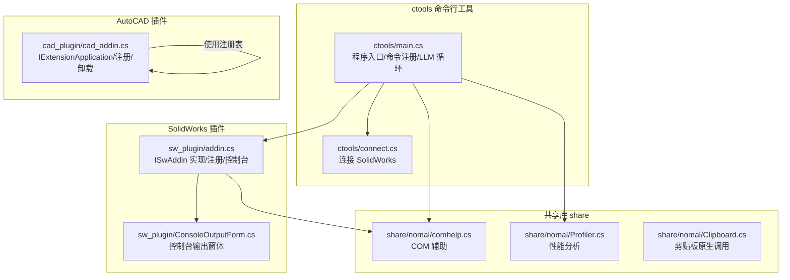
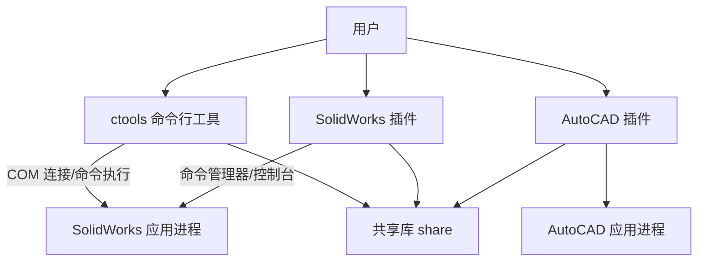
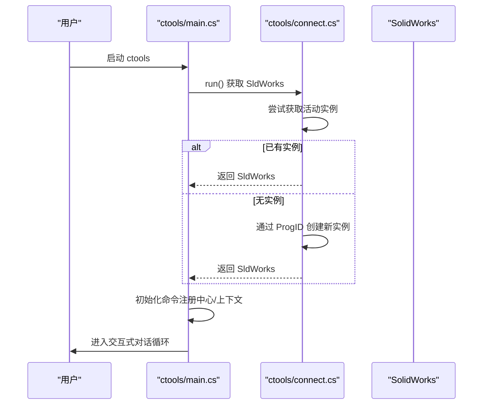
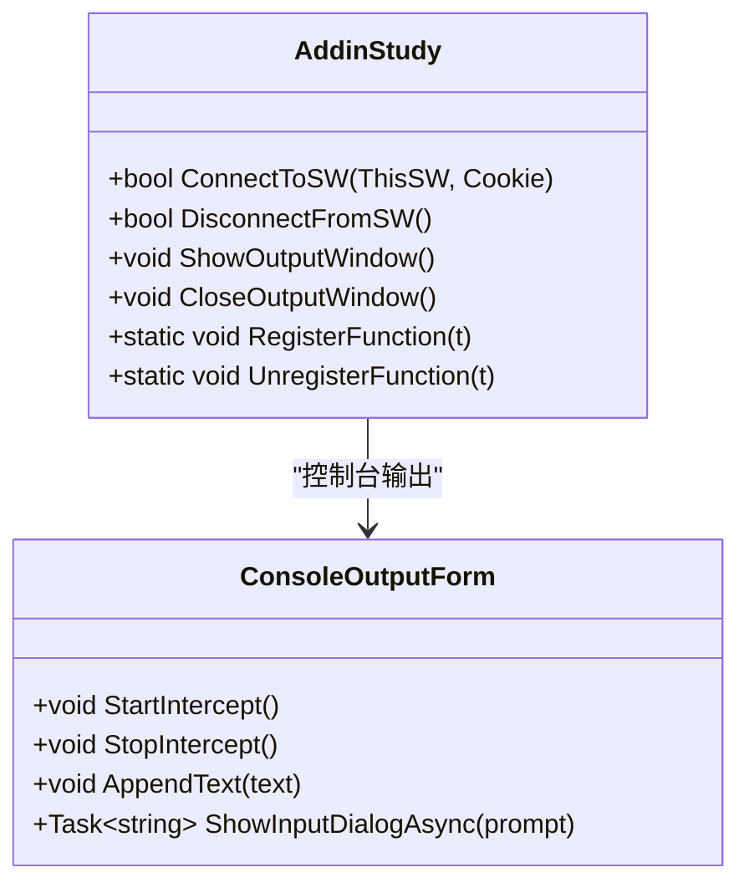
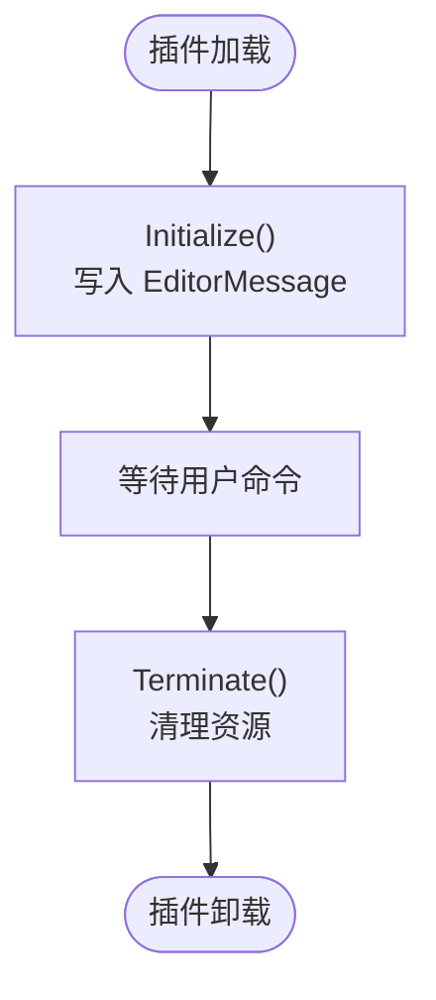
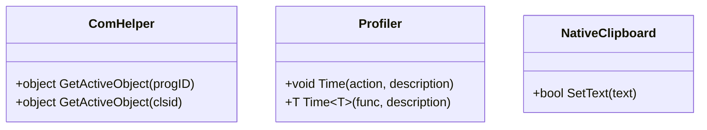
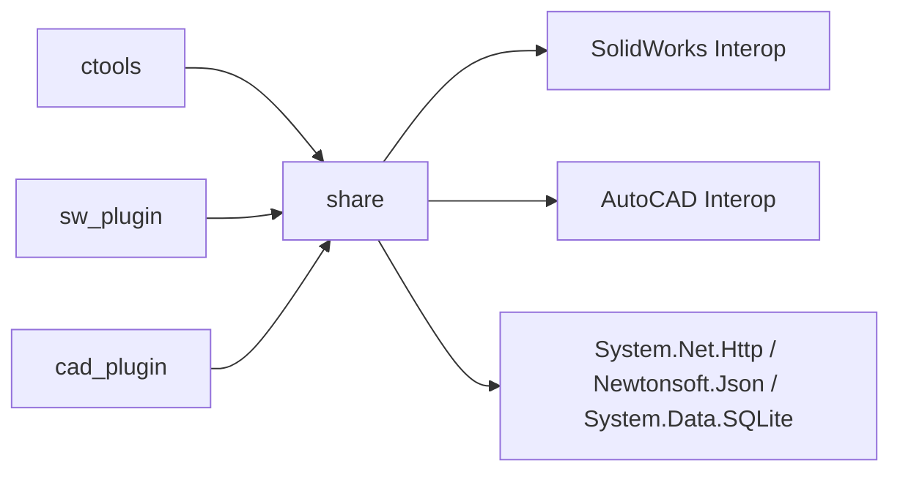

# 调试与故障排除

<cite>
**本文引用的文件**
- [README.md](file://README.md)
- [debug_commands.txt](file://debug_commands.txt)
- [sw_plugin.csproj](file://sw_plugin/sw_plugin.csproj)
- [cad_plugin.csproj](file://cad_plugin/cad_plugin.csproj)
- [share.csproj](file://share/share.csproj)
- [sw_plugin\addin.cs](file://sw_plugin/addin.cs)
- [sw_plugin\ConsoleOutputForm.cs](file://sw_plugin/ConsoleOutputForm.cs)
- [ctools\main.cs](file://ctools/main.cs)
- [ctools\connect.cs](file://ctools/connect.cs)
- [share\nomal\comhelp.cs](file://share/nomal/comhelp.cs)
- [share\nomal\Profiler.cs](file://share/nomal/Profiler.cs)
- [share\nomal\Clipboard.cs](file://share/nomal/Clipboard.cs)
- [cad_plugin\cad_addin.cs](file://cad_plugin/cad_addin.cs)
</cite>

## 目录
1. [引言](#引言)
2. [项目结构](#项目结构)
3. [核心组件](#核心组件)
4. [架构总览](#架构总览)
5. [详细组件分析](#详细组件分析)
6. [依赖关系分析](#依赖关系分析)
7. [性能考虑](#性能考虑)
8. [故障排除指南](#故障排除指南)
9. [结论](#结论)
10. [附录](#附录)

## 引言
本指南面向开发与运维团队，提供针对本项目中 SolidWorks 插件、AutoCAD 插件以及命令行工具的系统化调试与故障排除方法。内容涵盖 COM 组件调试、.NET 插件调试、CAD 集成调试、常见错误诊断与修复、性能分析与瓶颈识别、日志与监控最佳实践，以及生产环境问题的快速定位策略。

## 项目结构
项目由三部分组成：
- ctools：命令行工具与 AI 对话循环，负责与 SolidWorks 交互
- sw_plugin：SolidWorks 插件，提供菜单、右键菜单、控制台输出等
- cad_plugin：AutoCAD 插件，提供 IExtensionApplication 初始化与卸载注册
- share：共享库，封装 COM 辅助、性能分析、剪贴板等通用能力，并引用 SolidWorks/AutoCAD Interop

图表来源
- [ctools\main.cs:53-109](file://ctools/main.cs#L53-L109)
- [ctools\connect.cs:11-51](file://ctools/connect.cs#L11-L51)
- [sw_plugin\addin.cs:96-120](file://sw_plugin/addin.cs#L96-L120)
- [sw_plugin\ConsoleOutputForm.cs:134-146](file://sw_plugin/ConsoleOutputForm.cs#L134-L146)
- [cad_plugin\cad_addin.cs:16-80](file://cad_plugin/cad_addin.cs#L16-L80)
- [share\nomal\comhelp.cs:17-46](file://share/nomal/comhelp.cs#L17-L46)
- [share\nomal\Profiler.cs:9-25](file://share/nomal/Profiler.cs#L9-L25)
- [share\nomal\Clipboard.cs:31-58](file://share/nomal/Clipboard.cs#L31-L58)

章节来源
- [README.md:193-249](file://README.md#L193-L249)
- [sw_plugin.csproj:1-74](file://sw_plugin/sw_plugin.csproj#L1-L74)
- [cad_plugin.csproj:1-46](file://cad_plugin/cad_plugin.csproj#L1-L46)
- [share.csproj:1-40](file://share/share.csproj#L1-L40)

## 核心组件
- 命令系统与 AI 对话循环：ctools/main.cs 负责命令注册、命令执行、LLM 循环与性能输出
- SolidWorks 插件：sw_plugin/addin.cs 实现 ISwAddin，完成连接、命令注册、右键菜单、欢迎界面与控制台输出
- AutoCAD 插件：cad_plugin/cad_addin.cs 实现 IExtensionApplication，提供初始化与卸载注册
- COM 辅助：share/nomal/comhelp.cs 提供 GetActiveObject 与 CLSID 解析，替代传统 Marshal.GetActiveObject
- 性能分析：share/nomal/Profiler.cs 提供统一的 Time(Action/Func) 计时输出
- 剪贴板原生调用：share/nomal/Clipboard.cs 提供 Win32 剪贴板写入

章节来源
- [ctools\main.cs:170-253](file://ctools/main.cs#L170-L253)
- [sw_plugin\addin.cs:18-339](file://sw_plugin/addin.cs#L18-L339)
- [cad_plugin\cad_addin.cs:84-103](file://cad_plugin/cad_addin.cs#L84-L103)
- [share\nomal\comhelp.cs:6-59](file://share/nomal/comhelp.cs#L6-L59)
- [share\nomal\Profiler.cs:6-27](file://share/nomal/Profiler.cs#L6-L27)
- [share\nomal\Clipboard.cs:5-59](file://share/nomal/Clipboard.cs#L5-L59)

## 架构总览
整体采用“命令行工具 + 插件”的双入口架构，共享库提供跨 CAD 平台的通用能力。命令行工具通过 COM 连接 SolidWorks；插件在 SolidWorks 进程内运行并通过命令管理器集成；AutoCAD 插件通过 IExtensionApplication 加载并在 AutoCAD 进程内运行。

图表来源
- [ctools\connect.cs:11-51](file://ctools/connect.cs#L11-L51)
- [sw_plugin\addin.cs:96-120](file://sw_plugin/addin.cs#L96-L120)
- [cad_plugin\cad_addin.cs:84-103](file://cad_plugin/cad_addin.cs#L84-L103)
- [share.csproj:11-24](file://share/share.csproj#L11-L24)

## 详细组件分析

### 组件 A：ctools 命令行工具与 AI 对话循环
- 职责：命令注册、命令执行、LLM 循环、与 SolidWorks 的连接与上下文管理
- 关键流程：启动后连接 SolidWorks，初始化命令注册中心，进入交互式对话循环
- 性能输出：对带 [Profiled] 标记的命令进行耗时统计并输出

图表来源
- [ctools\main.cs:54-109](file://ctools/main.cs#L54-L109)
- [ctools\connect.cs:11-51](file://ctools/connect.cs#L11-L51)

章节来源
- [ctools\main.cs:53-109](file://ctools/main.cs#L53-L109)
- [ctools\main.cs:170-253](file://ctools/main.cs#L170-L253)
- [ctools\connect.cs:11-51](file://ctools/connect.cs#L11-L51)

### 组件 B：SolidWorks 插件（ISwAddin）
- 职责：实现 ISwAddin，完成连接回调、命令管理器集成、右键菜单初始化、欢迎界面与控制台输出
- 控制台：ConsoleOutputForm 截获 Console 输出并展示到独立窗体，支持输入框与置顶显示
- 注册：通过 ComRegisterFunction/ComUnregisterFunction 操作注册表，支持启动时加载

图表来源
- [sw_plugin\addin.cs:18-339](file://sw_plugin/addin.cs#L18-L339)
- [sw_plugin\ConsoleOutputForm.cs:10-172](file://sw_plugin/ConsoleOutputForm.cs#L10-L172)

章节来源
- [sw_plugin\addin.cs:96-120](file://sw_plugin/addin.cs#L96-L120)
- [sw_plugin\addin.cs:262-333](file://sw_plugin/addin.cs#L262-L333)
- [sw_plugin\ConsoleOutputForm.cs:134-146](file://sw_plugin/ConsoleOutputForm.cs#L134-L146)

### 组件 C：AutoCAD 插件（IExtensionApplication）
- 职责：实现 IExtensionApplication，插件加载时自动初始化，卸载时清理
- 注册/卸载：通过注册表操作完成插件注册与卸载，避免在 regasm 期间访问 AutoCAD 应用对象

图表来源
- [cad_plugin\cad_addin.cs:84-103](file://cad_plugin/cad_addin.cs#L84-L103)

章节来源
- [cad_plugin\cad_addin.cs:16-80](file://cad_plugin/cad_addin.cs#L16-L80)
- [cad_plugin\cad_addin.cs:84-103](file://cad_plugin/cad_addin.cs#L84-L103)

### 组件 D：COM 辅助与性能分析
- COM 辅助：ComHelper 提供 GetActiveObject 的安全实现，支持 CLSIDFromProgIDEx/CLSIDFromProgID 回退
- 性能分析：Profiler 提供 Time(Action/Func) 统一计时输出，便于定位慢命令
- 剪贴板：NativeClipboard 提供 Win32 剪贴板写入，避免托管 API 的限制

图表来源
- [share\nomal\comhelp.cs:6-59](file://share/nomal/comhelp.cs#L6-L59)
- [share\nomal\Profiler.cs:6-27](file://share/nomal/Profiler.cs#L6-L27)
- [share\nomal\Clipboard.cs:5-59](file://share/nomal/Clipboard.cs#L5-L59)

章节来源
- [share\nomal\comhelp.cs:17-46](file://share/nomal/comhelp.cs#L17-L46)
- [share\nomal\Profiler.cs:9-25](file://share/nomal/Profiler.cs#L9-L25)
- [share\nomal\Clipboard.cs:31-58](file://share/nomal/Clipboard.cs#L31-L58)

## 依赖关系分析
- ctools 依赖 share（COM 辅助、性能分析），通过 COM 连接 SolidWorks
- sw_plugin 依赖 share，实现 ISwAddin 并集成命令管理器
- cad_plugin 依赖 AutoCAD Interop，实现 IExtensionApplication
- share 引用 SolidWorks 与 AutoCAD Interop，并包含第三方包（HTTP、JSON、SQLite）

图表来源
- [sw_plugin.csproj:24-42](file://sw_plugin/sw_plugin.csproj#L24-L42)
- [cad_plugin.csproj:24-40](file://cad_plugin/cad_plugin.csproj#L24-L40)
- [share.csproj:11-30](file://share/share.csproj#L11-L30)

章节来源
- [sw_plugin.csproj:24-42](file://sw_plugin/sw_plugin.csproj#L24-L42)
- [cad_plugin.csproj:24-40](file://cad_plugin/cad_plugin.csproj#L24-L40)
- [share.csproj:11-30](file://share/share.csproj#L11-L30)

## 性能考虑
- 使用 Profiler.Time 包裹命令执行，输出毫秒级耗时，便于识别慢命令
- 建议对长耗时命令（如 AI 对话、批量导出、数据库操作）进行分段计时
- 避免在 UI 线程执行阻塞操作，必要时使用异步命令与进度反馈
- 对频繁调用的 COM 操作进行复用与缓存，减少跨进程调用次数

章节来源
- [share\nomal\Profiler.cs:9-25](file://share/nomal/Profiler.cs#L9-L25)
- [ctools\main.cs:202-247](file://ctools/main.cs#L202-L247)

## 故障排除指南

### 通用调试步骤
- 确认平台与依赖：ctools 仅支持 Windows；确保 .NET 与 SolidWorks/AutoCAD Interop 正确引用
- 以管理员权限运行：注册/卸载脚本与 regasm 操作需要管理员权限
- 检查注册表：SolidWorks 插件注册项位于 HKLM/HKCU 的 AddInsStartup；AutoCAD 卸载逻辑遍历版本子键
- 启用控制台输出：插件控制台支持置顶与滚动，便于实时观察输出

章节来源
- [README.md:92-127](file://README.md#L92-L127)
- [README.md:281-317](file://README.md#L281-L317)
- [sw_plugin\addin.cs:37-68](file://sw_plugin/addin.cs#L37-L68)
- [sw_plugin\ConsoleOutputForm.cs:134-146](file://sw_plugin/ConsoleOutputForm.cs#L134-L146)

### COM 组件调试
- 获取活动对象失败：优先使用 ComHelper.GetActiveObject，若 CLSIDFromProgIDEx 失败则回退到 CLSIDFromProgID
- 创建实例失败：检查 ProgID 是否正确，确认 SolidWorks 是否已安装且可被 COM 发现
- 跨进程异常：注意 COMException 与 TargetInvocationException 的区别，前者通常为连接问题，后者为命令内部异常

章节来源
- [share\nomal\comhelp.cs:17-46](file://share/nomal/comhelp.cs#L17-L46)
- [ctools\connect.cs:21-51](file://ctools/connect.cs#L21-L51)
- [ctools\main.cs:239-246](file://ctools/main.cs#L239-L246)

### .NET 插件调试（SolidWorks）
- 插件注册失败：确认以管理员身份运行注册脚本；检查 GUID 与标题是否与 SwAddinAttribute 一致
- 在 SolidWorks 中找不到插件：重启 SolidWorks，检查 AddInsStartup 注册项
- 控制台无输出：确认已调用 StartIntercept；检查 UI 线程调用与窗体置顶逻辑

章节来源
- [README.md:281-296](file://README.md#L281-L296)
- [sw_plugin\addin.cs:262-333](file://sw_plugin/addin.cs#L262-L333)
- [sw_plugin\ConsoleOutputForm.cs:134-146](file://sw_plugin/ConsoleOutputForm.cs#L134-L146)

### .NET 插件调试（AutoCAD）
- 卸载失败：卸载逻辑遍历所有版本子键，若未找到注册项会提示未找到；确认插件名称与路径一致
- 初始化无效：确保 IExtensionApplication.Initialize 在 AutoCAD 加载时被调用

章节来源
- [cad_plugin\cad_addin.cs:24-80](file://cad_plugin/cad_addin.cs#L24-L80)
- [cad_plugin\cad_addin.cs:84-103](file://cad_plugin/cad_addin.cs#L84-L103)

### CAD 集成调试（命令与文档）
- 命令执行无响应：查看控制台输出；确认当前文档类型与命令要求一致；检查命令参数与分组
- AI 无法识别命令：切换到直接命令模式；使用 search 命令查看可用命令列表；提供更明确的自然语言描述
- 批量处理卡顿：对长耗时命令使用 Profiler 计时；拆分批次并增加进度反馈

章节来源
- [README.md:297-317](file://README.md#L297-L317)
- [debug_commands.txt:1-205](file://debug_commands.txt#L1-L205)
- [ctools\main.cs:313-374](file://ctools/main.cs#L313-L374)

### 生产环境快速定位与修复策略
- 快速验证：先用最小化命令验证环境（如导出 DXF、获取厚度），确认基本链路正常
- 日志与监控：在关键路径输出耗时与状态；对异常进行分类记录（COM/命令/IO/网络）
- 回滚与降级：保留上一个稳定版本；对 AI 服务不可用时提供降级命令模式
- 自动化脚本：使用注册/卸载脚本与批处理，减少手工操作误差

章节来源
- [README.md:109-140](file://README.md#L109-L140)
- [share\nomal\Profiler.cs:9-25](file://share/nomal/Profiler.cs#L9-L25)

## 结论
本指南提供了从命令行工具到插件层的完整调试与故障排除方法，结合 COM 辅助、性能分析与控制台输出，能够快速定位问题并提升开发与运维效率。建议在日常开发中持续使用 Profiler 与控制台输出，建立标准化的注册/卸载流程，并完善异常分类与日志记录。

## 附录

### 常用命令与参数参考
- 命令清单与分组：参见 debug_commands.txt
- 命令搜索：ctools 中提供模糊匹配与相似度评分，支持按名称/描述/分组检索

章节来源
- [debug_commands.txt:1-205](file://debug_commands.txt#L1-L205)
- [ctools\main.cs:313-374](file://ctools/main.cs#L313-L374)