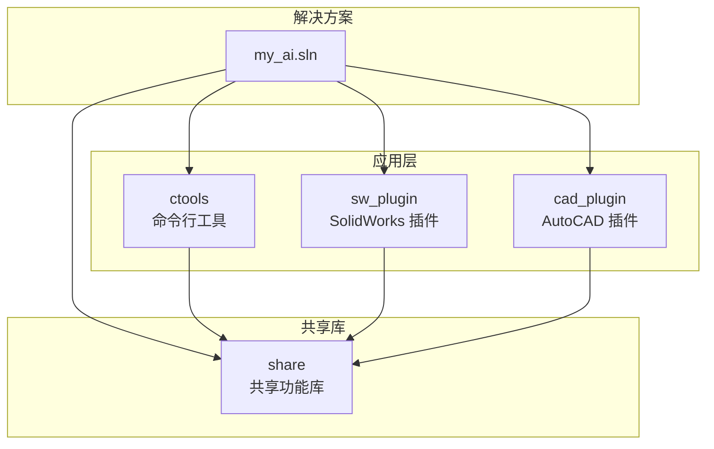
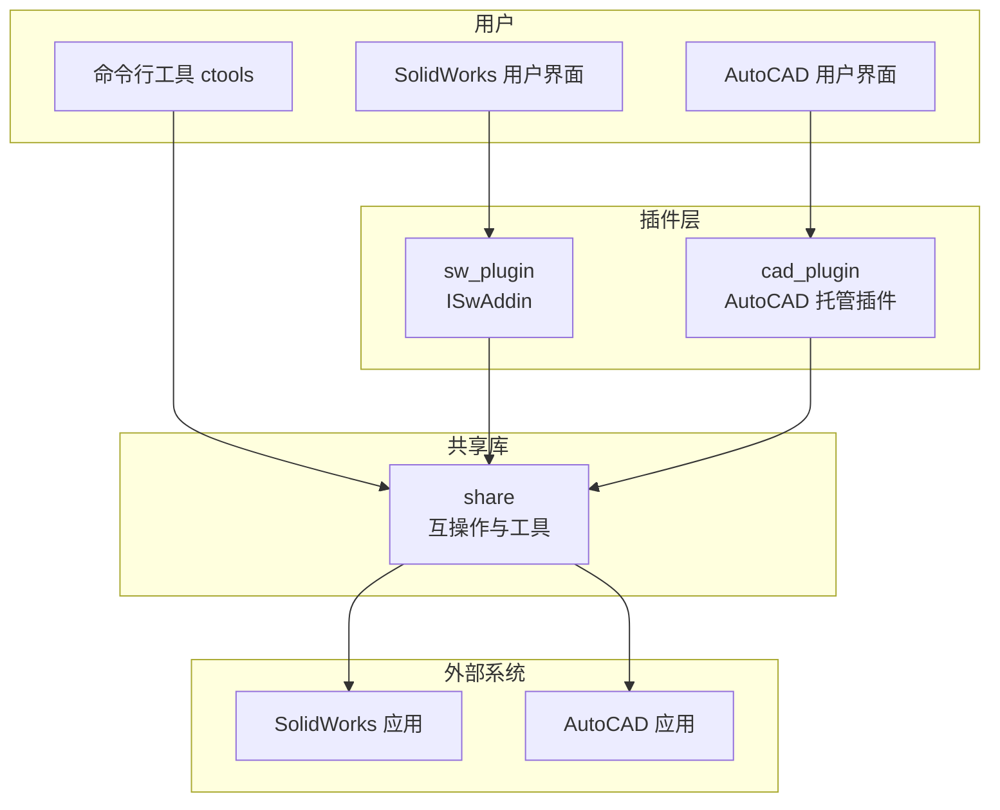
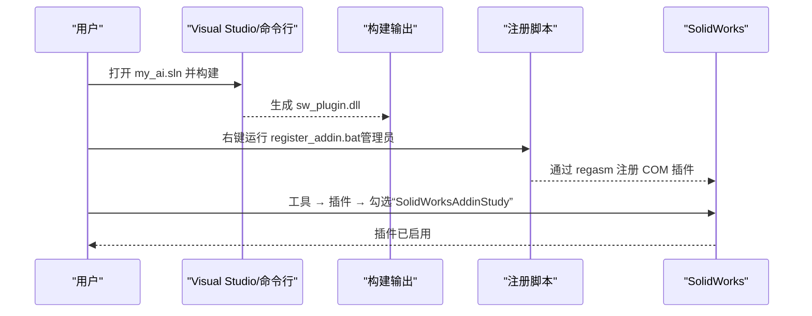
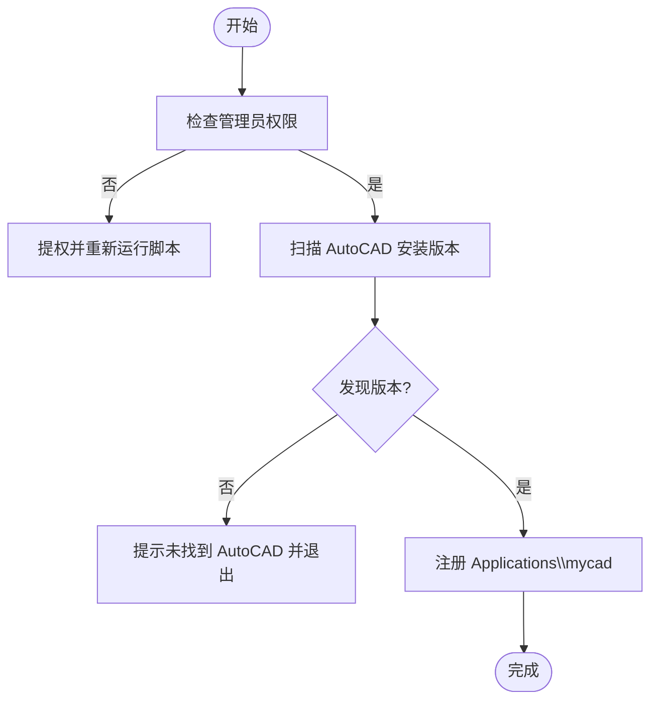
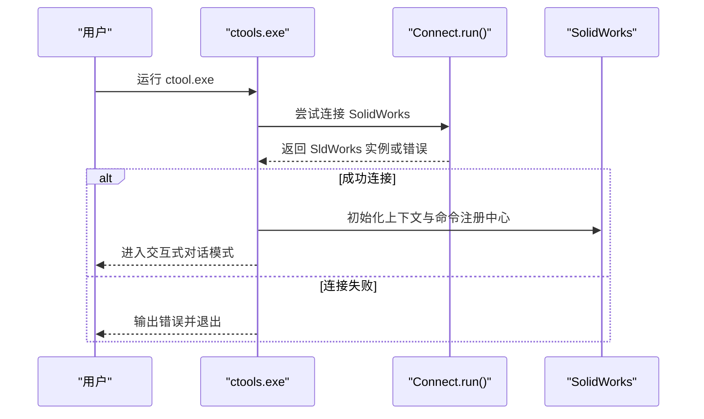
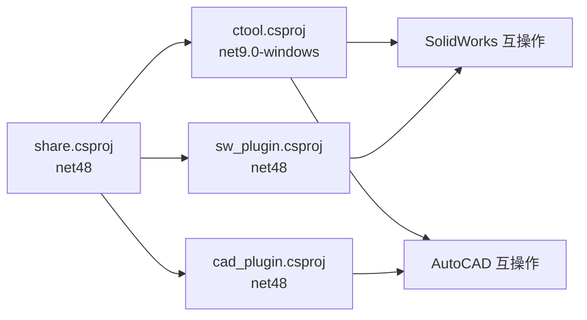

# 快速开始

<cite>
**本文引用的文件**
- [README.md](file://README.md)
- [my_ai.sln](file://my_ai.sln)
- [sw_plugin\sw_plugin.csproj](file://sw_plugin/sw_plugin.csproj)
- [sw_plugin\register_addin.bat](file://sw_plugin/register_addin.bat)
- [sw_plugin\unregister_addin.bat](file://sw_plugin/unregister_addin.bat)
- [sw_plugin\addin.cs](file://sw_plugin/addin.cs)
- [ctools\ctool.csproj](file://ctools/ctool.csproj)
- [ctools\main.cs](file://ctools/main.cs)
- [ctools\connect.cs](file://ctools/connect.cs)
- [ctools\ctools.bat](file://ctools/ctools.bat)
- [share\share.csproj](file://share/share.csproj)
- [cad_plugin\cad_plugin.csproj](file://cad_plugin/cad_plugin.csproj)
- [cad_plugin\register.ps1](file://cad_plugin/register.ps1)
- [cad_plugin\unregister.ps1](file://cad_plugin/unregister.ps1)
- [cad_plugin\cad_addin.cs](file://cad_plugin/cad_addin.cs)
</cite>

## 目录
1. [简介](#简介)
2. [项目结构](#项目结构)
3. [核心组件](#核心组件)
4. [架构总览](#架构总览)
5. [详细组件分析](#详细组件分析)
6. [依赖关系分析](#依赖关系分析)
7. [性能注意事项](#性能注意事项)
8. [故障排除指南](#故障排除指南)
9. [结论](#结论)
10. [附录](#附录)

## 简介
本指南面向首次接触 my_ai 项目的用户，目标是在约 30 分钟内完成环境准备、项目编译、SolidWorks 插件注册与启用，并成功运行命令行工具与 SolidWorks 插件示例。文档覆盖：
- 环境要求与安装步骤
- 项目编译与构建
- 插件注册与启用（推荐使用自动注册脚本）
- 基本使用示例（命令行工具与 SolidWorks 插件）
- 常见初始配置问题与解决方案

## 项目结构
my_ai 采用多项目解决方案，包含命令行工具、SolidWorks 插件、AutoCAD 插件与共享功能库。核心项目与职责如下：
- ctools：命令行工具，提供 AI 对话与命令执行能力
- sw_plugin：SolidWorks 插件，提供菜单、右键菜单与控制台输出
- cad_plugin：AutoCAD 插件，提供注册与卸载脚本及初始化逻辑
- share：共享功能库，被 ctools 与各插件引用

图表来源
- [my_ai.sln:1-43](file://my_ai.sln#L1-L43)
- [ctools\ctool.csproj:1-55](file://ctools/ctool.csproj#L1-L55)
- [sw_plugin\sw_plugin.csproj:1-74](file://sw_plugin/sw_plugin.csproj#L1-L74)
- [cad_plugin\cad_plugin.csproj:1-46](file://cad_plugin/cad_plugin.csproj#L1-L46)
- [share\share.csproj:1-40](file://share/share.csproj#L1-L40)

章节来源
- [README.md:90-141](file://README.md#L90-L141)
- [my_ai.sln:1-43](file://my_ai.sln#L1-L43)

## 核心组件
- 命令行工具（ctools）：支持交互式对话模式与命令直输；内置命令注册中心与模糊搜索；通过 COM 连接 SolidWorks。
- SolidWorks 插件（sw_plugin）：基于 ISwAddin 标准接口，提供菜单栏工具、右键菜单、控制台输出窗口与欢迎界面；通过 COM 注册。
- AutoCAD 插件（cad_plugin）：提供注册/卸载 PowerShell 脚本，向 AutoCAD 注册托管插件；包含初始化逻辑与卸载函数。
- 共享库（share）：封装 SolidWorks/AutoCAD 互操作与通用工具，被其他项目引用。

章节来源
- [README.md:28-88](file://README.md#L28-L88)
- [ctools\main.cs:34-109](file://ctools/main.cs#L34-L109)
- [sw_plugin\addin.cs:18-120](file://sw_plugin/addin.cs#L18-L120)
- [cad_plugin\cad_addin.cs:13-81](file://cad_plugin/cad_addin.cs#L13-L81)
- [share\share.csproj:1-40](file://share/share.csproj#L1-L40)

## 架构总览
整体架构由“命令行工具 + 插件 + 共享库”构成，命令行与插件均通过共享库访问 SolidWorks/AutoCAD API。插件通过 COM 注册并在 SolidWorks 启动时加载。

图表来源
- [ctools\main.cs:54-109](file://ctools/main.cs#L54-L109)
- [sw_plugin\addin.cs:96-120](file://sw_plugin/addin.cs#L96-L120)
- [cad_plugin\cad_addin.cs:84-103](file://cad_plugin/cad_addin.cs#L84-L103)
- [share\share.csproj:1-40](file://share/share.csproj#L1-L40)

## 详细组件分析

### 环境要求与安装步骤
- 环境要求
  - SolidWorks：已安装并正确配置
  - .NET SDK：.NET 9.0 或更高版本（ctools 使用 net9.0-windows）
  - Visual Studio：用于编译项目（可选）
- 安装步骤
  - 使用 Visual Studio 打开解决方案文件，或在命令行执行 dotnet build -c Release
  - 构建完成后，按“插件注册”章节进行注册与启用

章节来源
- [README.md:92-108](file://README.md#L92-L108)
- [ctools\ctool.csproj:4-14](file://ctools/ctool.csproj#L4-L14)

### 插件注册与启用（SolidWorks）
- 推荐使用注册脚本
  - 右键点击 sw_plugin\register_addin.bat，选择“以管理员身份运行”
  - 等待注册成功提示后，在 SolidWorks 中启用插件
- 手动注册（备用）
  - 以管理员身份打开命令行，执行 regasm 指令注册 sw_plugin.dll
- 在 SolidWorks 中启用
  - 打开 SolidWorks → 工具 → 插件 → 勾选“SolidWorksAddinStudy”

图表来源
- [sw_plugin\register_addin.bat:1-10](file://sw_plugin/register_addin.bat#L1-L10)
- [README.md:109-140](file://README.md#L109-L140)

章节来源
- [README.md:109-140](file://README.md#L109-L140)
- [sw_plugin\register_addin.bat:1-10](file://sw_plugin/register_addin.bat#L1-L10)
- [sw_plugin\unregister_addin.bat:1-11](file://sw_plugin/unregister_addin.bat#L1-L11)

### 插件注册与启用（AutoCAD）
- 使用注册脚本
  - 运行 cad_plugin\register.ps1（以管理员身份），脚本扫描 AutoCAD 版本并注册 Applications\mycad
  - 在 AutoCAD 中使用 NETLOAD 加载 DLL，然后输入 HELLO 命令测试
- 卸载脚本
  - 运行 cad_plugin\unregister.ps1（以管理员身份），清理注册表项

图表来源
- [cad_plugin\register.ps1:6-93](file://cad_plugin/register.ps1#L6-L93)
- [cad_plugin\unregister.ps1:6-92](file://cad_plugin/unregister.ps1#L6-L92)

章节来源
- [cad_plugin\register.ps1:1-93](file://cad_plugin/register.ps1#L1-L93)
- [cad_plugin\unregister.ps1:1-92](file://cad_plugin/unregister.ps1#L1-L92)

### 命令行工具使用示例
- 启动交互式对话模式
  - 直接运行 ctool.exe，连接 SolidWorks 后进入 AI 对话循环
- 常用命令示例
  - 导出 DXF、获取钣金厚度、生成 BOM、搜索命令等
- 命令搜索与帮助
  - 使用 search/ find 命令查找相关功能；使用 help 查看帮助

图表来源
- [ctools\main.cs:54-109](file://ctools/main.cs#L54-L109)
- [ctools\connect.cs:11-51](file://ctools/connect.cs#L11-L51)

章节来源
- [README.md:145-176](file://README.md#L145-L176)
- [ctools\main.cs:54-109](file://ctools/main.cs#L54-L109)
- [ctools\connect.cs:11-51](file://ctools/connect.cs#L11-L51)

### SolidWorks 插件使用示例
- 访问插件功能
  - 菜单栏出现自定义工具栏；右键菜单显示快捷操作；可打开控制台查看输出
- 常用操作
  - 显示控制台、查看版本信息、清空工程文件（欢迎界面倒计时结束）

章节来源
- [README.md:177-190](file://README.md#L177-L190)
- [sw_plugin\addin.cs:131-210](file://sw_plugin/addin.cs#L131-L210)

## 依赖关系分析
- 项目依赖
  - ctools 依赖 share，并引用 SolidWorks 与 AutoCAD 互操作程序集
  - sw_plugin 依赖 share，并引用 SolidWorks 互操作程序集
  - cad_plugin 依赖 share，并引用 AutoCAD 互操作程序集
- 目标框架
  - share 与各插件：net48
  - ctools：net9.0-windows

图表来源
- [share\share.csproj:1-40](file://share/share.csproj#L1-L40)
- [ctools\ctool.csproj:24-41](file://ctools/ctool.csproj#L24-L41)
- [sw_plugin\sw_plugin.csproj:24-42](file://sw_plugin/sw_plugin.csproj#L24-L42)
- [cad_plugin\cad_plugin.csproj:24-40](file://cad_plugin/cad_plugin.csproj#L24-L40)

章节来源
- [share\share.csproj:1-40](file://share/share.csproj#L1-L40)
- [ctools\ctool.csproj:1-55](file://ctools/ctool.csproj#L1-L55)
- [sw_plugin\sw_plugin.csproj:1-74](file://sw_plugin/sw_plugin.csproj#L1-L74)
- [cad_plugin\cad_plugin.csproj:1-46](file://cad_plugin/cad_plugin.csproj#L1-L46)

## 性能注意事项
- 命令执行性能
  - 命令注册中心支持为命令添加性能标注属性，执行后输出耗时统计
- 建议
  - 在命令实现中合理使用异步执行，避免阻塞 SolidWorks UI
  - 对高频命令进行必要的日志与性能监控

章节来源
- [ctools\main.cs:28-32](file://ctools/main.cs#L28-L32)
- [ctools\main.cs:170-253](file://ctools/main.cs#L170-L253)

## 故障排除指南
- 插件注册失败
  - 确保以管理员身份运行注册脚本；检查 DLL 是否存在于对应输出目录；确认 SolidWorks 版本兼容
- 在 SolidWorks 中找不到插件
  - 重新运行注册脚本；重启 SolidWorks；检查注册表项
- ctools 无法连接 SolidWorks
  - 先启动 SolidWorks 应用；确保有激活的文档；以管理员身份运行 ctool.exe
- 命令执行无响应
  - 查看控制台输出；检查 SolidWorks 是否弹出错误提示；确认当前文档类型符合命令要求
- AI 对话无法识别命令
  - 使用更明确的命令描述；使用 search 命令查看可用命令列表；切换到直接命令模式

章节来源
- [README.md:281-340](file://README.md#L281-L340)

## 结论
通过本快速开始指南，您已完成环境准备、项目编译、插件注册与启用，并掌握了命令行工具与 SolidWorks 插件的基本使用方法。建议在实际工作中结合共享库中的命令与工具，逐步扩展自动化流程。

## 附录
- 快速命令参考
  - ctools：ctool.exe 启动交互式对话；exportdxf、get_thickness、asm2bom 等
  - SolidWorks 插件：菜单栏工具、右键菜单、控制台输出窗口
  - AutoCAD 插件：NETLOAD 加载 DLL，HELLO 测试命令

章节来源
- [README.md:28-88](file://README.md#L28-L88)
- [ctools\ctools.bat:1-1](file://ctools/ctools.bat#L1-L1)