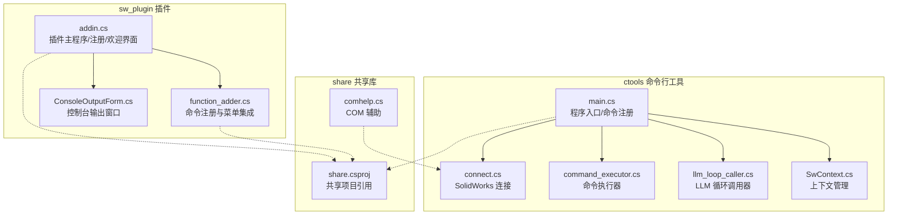
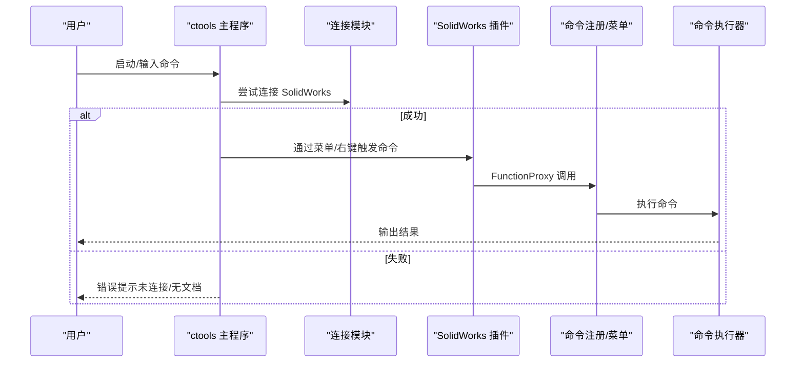
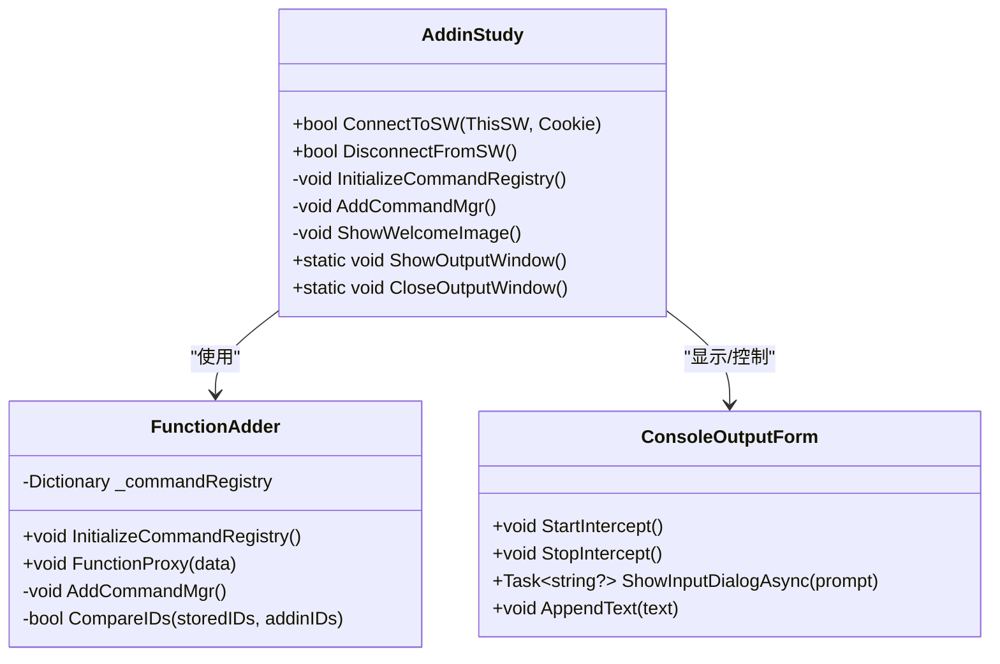
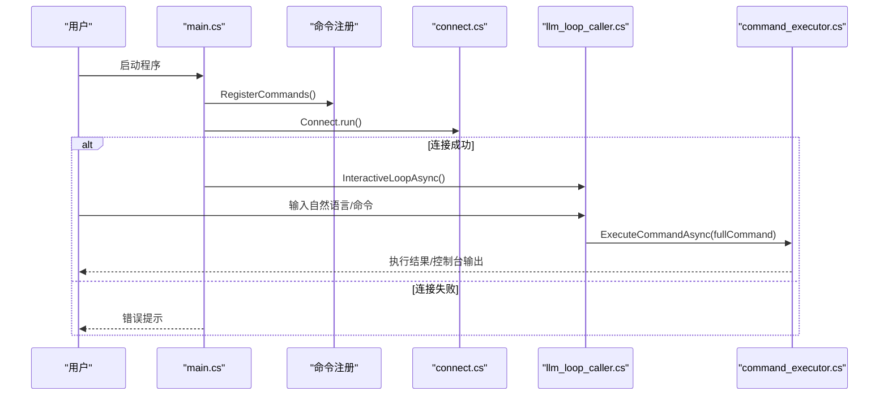
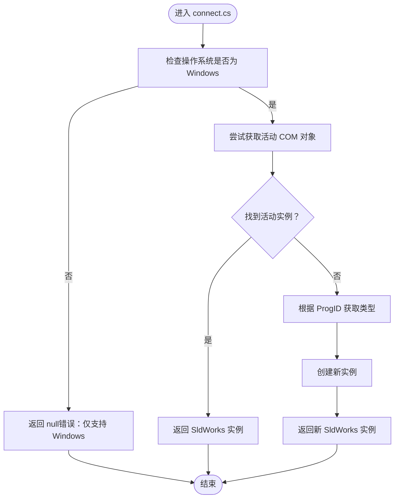
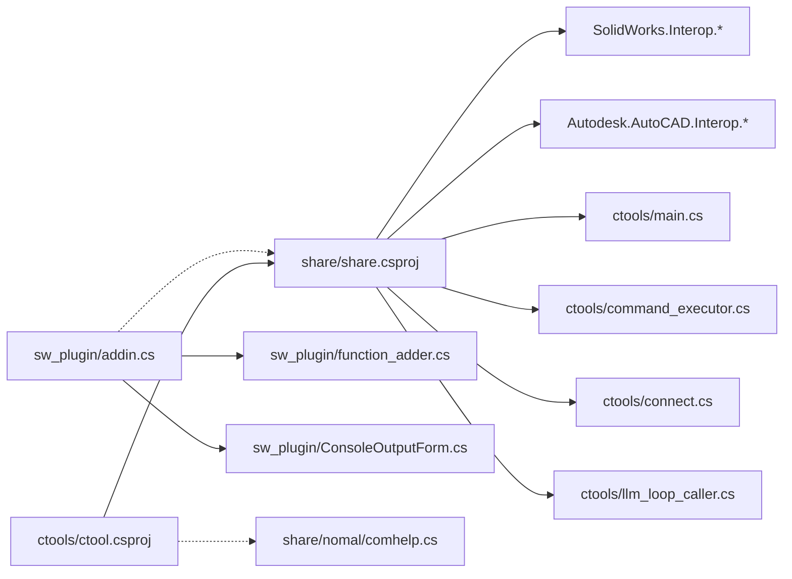

# 故障排除与常见问题

<cite>
**本文引用的文件**
- [README.md](file://README.md)
- [sw_plugin\addin.cs](file://sw_plugin/addin.cs)
- [sw_plugin\function_adder.cs](file://sw_plugin/function_adder.cs)
- [sw_plugin\ConsoleOutputForm.cs](file://sw_plugin/ConsoleOutputForm.cs)
- [ctools\main.cs](file://ctools/main.cs)
- [ctools\connect.cs](file://ctools/connect.cs)
- [ctools\command_executor.cs](file://ctools/command_executor.cs)
- [ctools\llm_loop_caller.cs](file://ctools/llm_loop_caller.cs)
- [ctools\SwContext.cs](file://ctools/SwContext.cs)
- [ctools\ctool.csproj](file://ctools/ctool.csproj)
- [sw_plugin\sw_plugin.csproj](file://sw_plugin/sw_plugin.csproj)
- [share\share.csproj](file://share/share.csproj)
- [cad_plugin\cad_plugin.csproj](file://cad_plugin/cad_plugin.csproj)
- [share\nomal\comhelp.cs](file://share/nomal/comhelp.cs)
</cite>

## 目录
1. [简介](#简介)
2. [项目结构](#项目结构)
3. [核心组件](#核心组件)
4. [架构总览](#架构总览)
5. [详细组件分析](#详细组件分析)
6. [依赖关系分析](#依赖关系分析)
7. [性能考虑](#性能考虑)
8. [故障排除指南](#故障排除指南)
9. [结论](#结论)
10. [附录](#附录)

## 简介
本文件面向使用 my_ai 项目的最终用户与开发者，提供系统化的故障排除与常见问题解答。内容覆盖插件注册失败、连接问题、命令执行异常、AI 识别异常、性能问题识别与优化、版本兼容性与已知限制、以及社区支持与问题反馈流程。文档同时给出诊断流程、错误信息解读与修复步骤，并辅以可视化图表帮助快速定位问题。

## 项目结构
项目由三个主要子系统组成：
- ctools 命令行工具：提供交互式 AI 对话与命令执行能力，可直接连接 SolidWorks。
- sw_plugin SolidWorks 插件：在 SolidWorks 中集成菜单、右键菜单与控制台输出窗口。
- share 共享库：封装通用工具、COM 辅助、命令注册与上下文管理等基础能力。

**图表来源**
- [ctools\main.cs:54-109](file://ctools/main.cs#L54-L109)
- [ctools\connect.cs:11-51](file://ctools/connect.cs#L11-L51)
- [ctools\command_executor.cs:32-113](file://ctools/command_executor.cs#L32-L113)
- [ctools\llm_loop_caller.cs:44-67](file://ctools/llm_loop_caller.cs#L44-L67)
- [ctools\SwContext.cs:9-85](file://ctools/SwContext.cs#L9-L85)
- [sw_plugin\addin.cs:96-120](file://sw_plugin/addin.cs#L96-L120)
- [sw_plugin\function_adder.cs:75-204](file://sw_plugin/function_adder.cs#L75-L204)
- [sw_plugin\ConsoleOutputForm.cs:18-87](file://sw_plugin/ConsoleOutputForm.cs#L18-L87)
- [share\nomal\comhelp.cs:17-46](file://share/nomal/comhelp.cs#L17-L46)

**章节来源**
- [README.md:193-249](file://README.md#L193-L249)

## 核心组件
- 插件主程序（SolidWorks）：负责插件生命周期、命令注册、菜单与右键菜单集成、欢迎界面与控制台输出窗口。
- 命令行工具（ctools）：负责命令注册、AI 对话循环、命令执行、与 SolidWorks 的连接与上下文管理。
- 共享库（share）：提供 COM 辅助、跨模块通用工具与引用依赖。
- 项目目标框架与平台：
  - ctools：.NET 9.0（Windows）
  - sw_plugin：.NET Framework 4.8（x64）
  - share：.NET Framework 4.8（x64）

**章节来源**
- [ctools\ctool.csproj:4-14](file://ctools/ctool.csproj#L4-L14)
- [sw_plugin\sw_plugin.csproj:3-14](file://sw_plugin/sw_plugin.csproj#L3-L14)
- [share\share.csproj:3-9](file://share/share.csproj#L3-L9)

## 架构总览
ctools 与 SolidWorks 插件均通过共享库与 SolidWorks API 交互；ctools 通过 COM 连接 SolidWorks，插件通过 SolidWorks Add-in 接口注册命令与菜单。AI 对话通过 LLM 循环调用器将自然语言映射为具体命令，再由命令执行器统一调度。

**图表来源**
- [ctools\main.cs:54-109](file://ctools/main.cs#L54-L109)
- [ctools\connect.cs:11-51](file://ctools/connect.cs#L11-L51)
- [sw_plugin\function_adder.cs:44-74](file://sw_plugin/function_adder.cs#L44-L74)
- [ctools\command_executor.cs:32-113](file://ctools/command_executor.cs#L32-L113)

## 详细组件分析

### 插件主程序（SolidWorks）
- 插件生命周期：ConnectToSW 初始化命令注册表、创建命令组、添加菜单与工具栏、显示欢迎界面。
- 命令注册：通过反射扫描标记 [Command] 的方法，建立命令 ID 到方法的映射。
- 菜单集成：按文档类型（零件/装配体/工程图）分组命令，动态创建命令标签页与按钮。
- 控制台输出：提供拦截 Console 输出的窗口，便于调试与用户反馈。

**图表来源**
- [sw_plugin\addin.cs:96-120](file://sw_plugin/addin.cs#L96-L120)
- [sw_plugin\addin.cs:260-333](file://sw_plugin/addin.cs#L260-L333)
- [sw_plugin\function_adder.cs:26-40](file://sw_plugin/function_adder.cs#L26-L40)
- [sw_plugin\function_adder.cs:75-204](file://sw_plugin/function_adder.cs#L75-L204)
- [sw_plugin\ConsoleOutputForm.cs:18-87](file://sw_plugin/ConsoleOutputForm.cs#L18-L87)

**章节来源**
- [sw_plugin\addin.cs:96-218](file://sw_plugin/addin.cs#L96-L218)
- [sw_plugin\function_adder.cs:26-204](file://sw_plugin/function_adder.cs#L26-L204)
- [sw_plugin\ConsoleOutputForm.cs:134-169](file://sw_plugin/ConsoleOutputForm.cs#L134-L169)

### 命令行工具（ctools）
- 程序入口：解析参数，注册命令，连接 SolidWorks，启动 AI 交互循环。
- 命令注册：扫描标记 [Command] 的静态方法，构建命令字典与异步执行器。
- 连接模块：通过 COM 获取或创建 SolidWorks 实例，处理异常与平台限制。
- 命令执行器：解析命令文本，校验命令存在性与 SolidWorks 连接状态，更新当前文档上下文，执行命令并捕获异常。
- LLM 循环调用器：构建工具定义，处理 Tool 调用，拦截 Console 输出，支持确认/自动模式与历史记录。

**图表来源**
- [ctools\main.cs:54-109](file://ctools/main.cs#L54-L109)
- [ctools\main.cs:170-253](file://ctools/main.cs#L170-L253)
- [ctools\connect.cs:11-51](file://ctools/connect.cs#L11-L51)
- [ctools\llm_loop_caller.cs:493-726](file://ctools/llm_loop_caller.cs#L493-L726)
- [ctools\command_executor.cs:32-113](file://ctools/command_executor.cs#L32-L113)

**章节来源**
- [ctools\main.cs:54-253](file://ctools/main.cs#L54-L253)
- [ctools\connect.cs:11-51](file://ctools/connect.cs#L11-L51)
- [ctools\command_executor.cs:32-113](file://ctools/command_executor.cs#L32-L113)
- [ctools\llm_loop_caller.cs:177-288](file://ctools/llm_loop_caller.cs#L177-L288)

### COM 辅助与上下文管理
- COM 辅助：提供 GetActiveObject 的替代实现，增强对不同 ProgID 的兼容性。
- 上下文管理：SwContext 单例管理 SldWorks 与当前 ModelDoc2，提供线程安全的读写访问。

**图表来源**
- [ctools\connect.cs:15-51](file://ctools/connect.cs#L15-L51)
- [share\nomal\comhelp.cs:17-46](file://share/nomal/comhelp.cs#L17-L46)

**章节来源**
- [ctools\SwContext.cs:9-85](file://ctools/SwContext.cs#L9-L85)
- [share\nomal\comhelp.cs:6-59](file://share/nomal/comhelp.cs#L6-L59)

## 依赖关系分析
- ctools 依赖 share（命令注册、上下文、通用工具），并通过引用 SolidWorks Interop 与 AutoCAD Interop 进行 API 交互。
- sw_plugin 依赖 share，并通过 SolidWorks Tools 与 Interop 进行插件注册与命令管理。
- cad_plugin 依赖 share 与 AutoCAD Interop。

**图表来源**
- [ctools\ctool.csproj:24-41](file://ctools/ctool.csproj#L24-L41)
- [sw_plugin\sw_plugin.csproj:24-42](file://sw_plugin/sw_plugin.csproj#L24-L42)
- [share\share.csproj:11-24](file://share/share.csproj#L11-L24)
- [ctools\main.cs:13-14](file://ctools/main.cs#L13-L14)
- [ctools\command_executor.cs:5-6](file://ctools/command_executor.cs#L5-L6)
- [ctools\connect.cs:3-5](file://ctools/connect.cs#L3-L5)
- [ctools\llm_loop_caller.cs:8-12](file://ctools/llm_loop_caller.cs#L8-L12)
- [share\nomal\comhelp.cs:1-59](file://share/nomal/comhelp.cs#L1-L59)

**章节来源**
- [ctools\ctool.csproj:24-41](file://ctools/ctool.csproj#L24-L41)
- [sw_plugin\sw_plugin.csproj:24-42](file://sw_plugin/sw_plugin.csproj#L24-L42)
- [share\share.csproj:11-24](file://share/share.csproj#L11-L24)

## 性能考虑
- 性能监控：命令注册时支持 [Profiled] 属性，执行后输出耗时统计，便于定位慢命令。
- 异步命令：命令可声明为 Task，避免阻塞 UI 或交互循环。
- 输出捕获：LLM 循环调用器拦截 Console 输出，减少 UI 干扰，提升交互体验。
- 建议优化：
  - 对耗时操作（如大模型推理、文件 IO）采用异步与进度反馈。
  - 合理使用缓存（如上次执行命令、工具定义）减少重复初始化。
  - 避免频繁创建/销毁 COM 对象，复用连接与上下文。

**章节来源**
- [ctools\main.cs:28-32](file://ctools/main.cs#L28-L32)
- [ctools\main.cs:202-247](file://ctools/main.cs#L202-L247)
- [ctools\llm_loop_caller.cs:213-288](file://ctools/llm_loop_caller.cs#L213-L288)

## 故障排除指南

### 一、插件注册失败
- 现象
  - 注册脚本执行后未在 SolidWorks 中出现插件。
  - 注册过程报错或无提示。
- 诊断流程
  1) 确认以“以管理员身份”运行注册脚本。
  2) 检查 DLL 是否存在于发布目录（net48）。
  3) 检查 SolidWorks 版本与 .NET Framework 4.8 兼容性。
  4) 查看注册表项：HKLM 与 HKCU 下的 AddIns/Startup 对应 GUID。
- 修复步骤
  - 重新运行注册脚本；若失败，手动执行 regasm 注册。
  - 确保插件 GUID 与项目一致（插件源码中定义）。
  - 如仍失败，卸载后重装，或在 SolidWorks 插件管理中启用。
- 相关源码参考
  - 插件注册/反注册逻辑、GUID 定义、注册表项写入。

**章节来源**
- [README.md:281-317](file://README.md#L281-L317)
- [sw_plugin\addin.cs:260-333](file://sw_plugin/addin.cs#L260-L333)

### 二、在 SolidWorks 中找不到插件
- 现象
  - 启动 SolidWorks 后未看到插件菜单或右键菜单。
- 诊断流程
  1) 重新运行注册脚本并重启 SolidWorks。
  2) 在 SolidWorks 插件管理中勾选插件。
  3) 检查注册表项是否存在。
- 修复步骤
  - 在 SolidWorks “工具 → 插件”中勾选“启动时加载”。
  - 若仍不可见，卸载后重装插件。

**章节来源**
- [README.md:290-296](file://README.md#L290-L296)
- [README.md:130-140](file://README.md#L130-L140)

### 三、ctools 无法连接 SolidWorks
- 现象
  - 启动 ctool.exe 提示“无法连接到 SolidWorks 应用程序”。
- 诊断流程
  1) 确认已在 Windows 上运行（仅支持 Windows）。
  2) 确认 SolidWorks 已启动且存在激活文档。
  3) 以管理员身份运行 ctool.exe。
  4) 检查 COM 类型与 ProgID 是否可用。
- 修复步骤
  - 先启动 SolidWorks，再运行 ctool.exe。
  - 若无活动文档，先打开一个模型。
  - 使用管理员权限运行，必要时重启 SolidWorks。

**章节来源**
- [README.md:297-303](file://README.md#L297-L303)
- [ctools\connect.cs:15-51](file://ctools/connect.cs#L15-L51)

### 四、命令执行无响应或报错
- 现象
  - 输入命令后无反应或出现异常信息。
- 诊断流程
  1) 查看控制台输出（插件控制台或 ctools 控制台）。
  2) 确认当前文档类型是否满足命令要求。
  3) 检查命令是否存在与拼写是否正确。
  4) 若为异步命令，确认 Task 是否完成。
- 修复步骤
  1) 在插件控制台中查看详细日志。
  2) 使用 search/find 命令确认可用命令。
  3) 切换到直接命令模式，避免 AI 误解。
  4) 重新连接 SolidWorks 并重试。

**章节来源**
- [README.md:304-317](file://README.md#L304-L317)
- [ctools\command_executor.cs:60-113](file://ctools/command_executor.cs#L60-L113)
- [sw_plugin\ConsoleOutputForm.cs:134-169](file://sw_plugin/ConsoleOutputForm.cs#L134-L169)

### 五、AI 对话无法识别命令
- 现象
  - 自然语言描述后未触发对应命令。
- 诊断流程
  1) 检查输入是否足够明确。
  2) 使用 search 命令查看可用命令列表。
  3) 切换到直接命令模式验证命令可用性。
- 修复步骤
  - 使用更明确的描述或直接输入命令名。
  - 使用别名或命令组信息辅助识别。
  - 若持续失败，切换到纯对话模式排查。

**章节来源**
- [README.md:311-317](file://README.md#L311-L317)
- [ctools\llm_loop_caller.cs:388-488](file://ctools/llm_loop_caller.cs#L388-L488)

### 六、卸载插件
- 方法
  - 使用卸载脚本（管理员身份）。
  - 手动 regasm 卸载。
  - 在 SolidWorks 插件管理中取消勾选。
- 注意
  - 卸载后建议重启 SolidWorks。

**章节来源**
- [README.md:320-340](file://README.md#L320-L340)

### 七、版本兼容性与已知限制
- 环境要求
  - SolidWorks：已安装并正确配置。
  - .NET：ctools 使用 .NET 9.0（Windows），插件与共享库使用 .NET Framework 4.8（x64）。
- 已知限制
  - 仅支持 Windows 平台。
  - 插件需管理员权限注册与运行。
  - 命令执行依赖 SolidWorks 激活文档。

**章节来源**
- [README.md:90-107](file://README.md#L90-L107)
- [README.md:281-317](file://README.md#L281-L317)
- [ctools\connect.cs:15-19](file://ctools/connect.cs#L15-L19)

### 八、社区支持与问题反馈
- 交流群：QQ 群（链接见 README）。
- 问题反馈：GitHub Issues、QQ 群内提问、邮件联系开发者。

**章节来源**
- [README.md:381-394](file://README.md#L381-L394)

## 结论
通过以上系统化的问题诊断流程与修复步骤，用户与开发者可以高效定位并解决插件注册、连接、命令执行与 AI 识别等常见问题。建议在日常使用中关注控制台输出、命令上下文与平台兼容性，并结合性能监控与异步执行优化整体体验。

## 附录

### A. 常用诊断清单
- 插件侧
  - 注册脚本是否以管理员身份运行
  - 注册表项是否存在
  - SolidWorks 插件管理中是否启用
- 工具侧
  - 是否在 Windows 上运行
  - SolidWorks 是否已启动且有激活文档
  - ctool.exe 是否以管理员身份运行
  - 控制台输出是否可见

**章节来源**
- [README.md:281-317](file://README.md#L281-L317)
- [ctools\connect.cs:15-51](file://ctools/connect.cs#L15-L51)