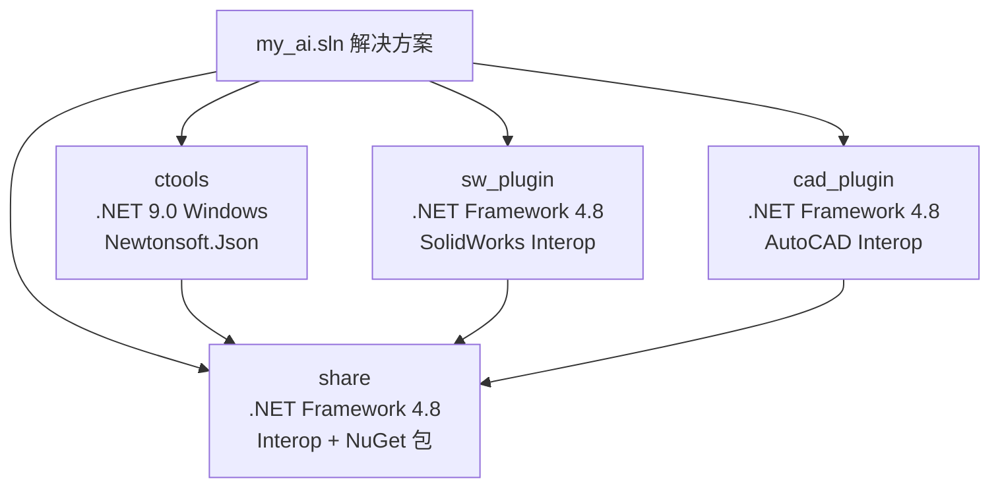
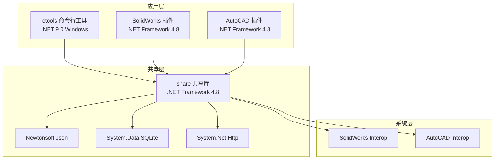
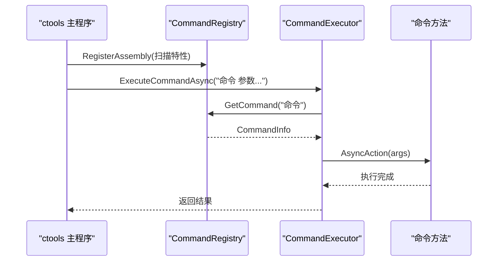
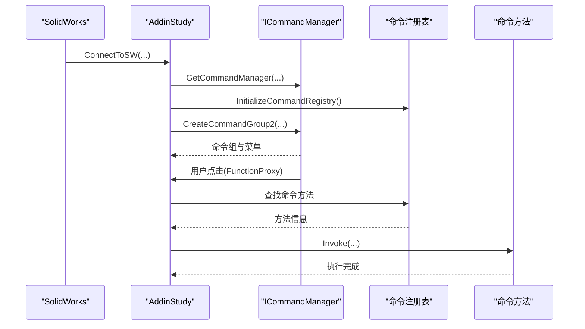
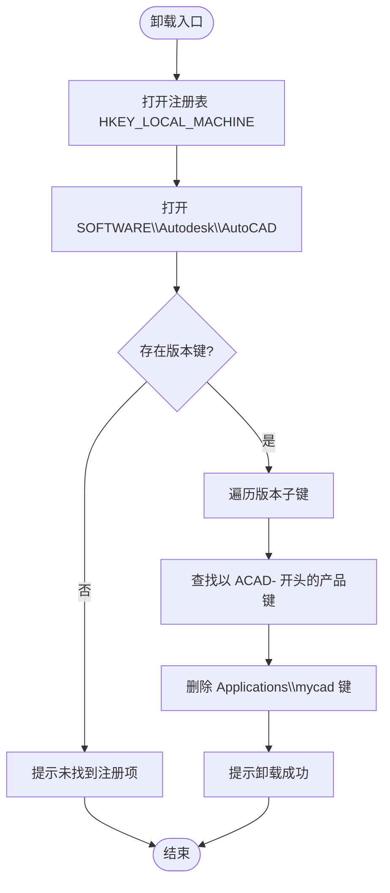
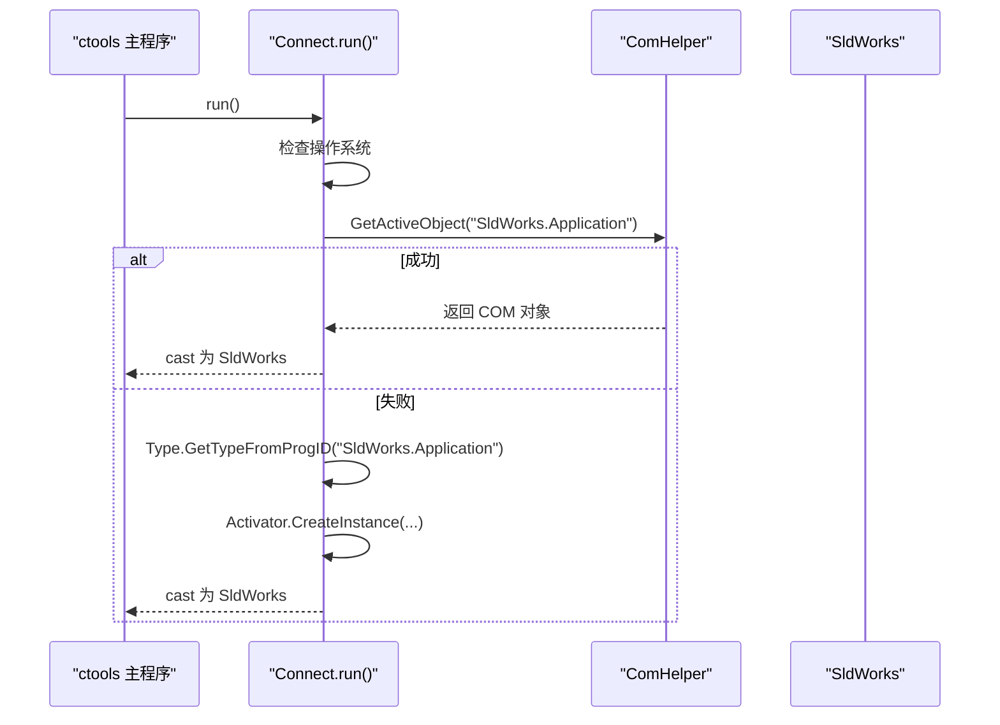
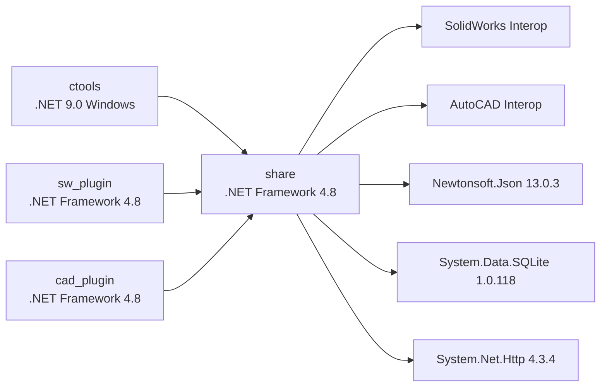

# 技术栈与依赖

<cite>
**本文引用的文件**
- [my_ai.sln](file://my_ai.sln)
- [README.md](file://README.md)
- [ctools\ctool.csproj](file://ctools\ctool.csproj)
- [sw_plugin\sw_plugin.csproj](file://sw_plugin\sw_plugin.csproj)
- [cad_plugin\cad_plugin.csproj](file://cad_plugin\cad_plugin.csproj)
- [share\share.csproj](file://share\share.csproj)
- [ctools\main.cs](file://ctools\main.cs)
- [ctools\connect.cs](file://ctools\connect.cs)
- [ctools\llm_loop_caller.cs](file://ctools\llm_loop_caller.cs)
- [ctools\CommandRegistry.cs](file://ctools\CommandRegistry.cs)
- [ctools\command_executor.cs](file://ctools\command_executor.cs)
- [sw_plugin\addin.cs](file://sw_plugin\addin.cs)
- [sw_plugin\function_adder.cs](file://sw_plugin\function_adder.cs)
- [sw_plugin\CommandAttribute.cs](file://sw_plugin\CommandAttribute.cs)
- [cad_plugin\cad_addin.cs](file://cad_plugin\cad_addin.cs)
- [share\nomal\comhelp.cs](file://share\nomal\comhelp.cs)
</cite>

## 目录
1. [引言](#引言)
2. [项目结构](#项目结构)
3. [核心组件](#核心组件)
4. [架构总览](#架构总览)
5. [详细组件分析](#详细组件分析)
6. [依赖分析](#依赖分析)
7. [性能考虑](#性能考虑)
8. [故障排查指南](#故障排查指南)
9. [结论](#结论)
10. [附录](#附录)

## 引言
本文件面向 my_ai 项目的开发者与维护者，系统梳理项目的技术栈与依赖，覆盖 .NET Framework 4.8、.NET 9.0、SolidWorks Interop、AutoCAD Interop、Newtonsoft.Json 等关键依赖，并解释技术选型原因、版本兼容性与升级策略。同时提供依赖关系图与版本兼容性矩阵，帮助理解整体技术构成与维护要求。

## 项目结构
my_ai 采用多项目解决方案组织，围绕“命令行工具 + SolidWorks 插件 + AutoCAD 插件 + 共享功能库”的架构展开。核心项目与职责如下：
- ctools：命令行工具与 AI 对话引擎，目标框架为 .NET 9.0（Windows），使用 Newtonsoft.Json 进行 JSON 序列化。
- sw_plugin：SolidWorks 插件，目标框架 .NET Framework 4.8，使用 SolidWorks Interop 与 COM 注册机制。
- cad_plugin：AutoCAD 插件，目标框架 .NET Framework 4.8，使用 AutoCAD Interop 与 COM 注册机制。
- share：共享功能库，目标框架 .NET Framework 4.8，统一引用 Interop 与第三方包（如 Newtonsoft.Json、System.Data.SQLite、System.Net.Http）。



图表来源
- [my_ai.sln:1-43](file://my_ai.sln#L1-L43)
- [ctools\ctool.csproj:1-55](file://ctools\ctool.csproj#L1-L55)
- [sw_plugin\sw_plugin.csproj:1-74](file://sw_plugin\sw_plugin.csproj#L1-L74)
- [cad_plugin\cad_plugin.csproj:1-46](file://cad_plugin\cad_plugin.csproj#L1-L46)
- [share\share.csproj:1-40](file://share\share.csproj#L1-L40)

章节来源
- [my_ai.sln:1-43](file://my_ai.sln#L1-L43)
- [README.md:193-249](file://README.md#L193-L249)

## 核心组件
- 命令系统与注册中心
  - 命令特性与注册：通过特性标记命令，注册中心集中管理命令元数据与执行器。
  - 参考路径：[ctools\CommandRegistry.cs:1-242](file://ctools\CommandRegistry.cs#L1-L242)、[sw_plugin\CommandAttribute.cs:1-27](file://sw_plugin\CommandAttribute.cs#L1-L27)
- 命令执行器
  - 负责解析命令文本、解析参数、调用注册中心获取命令、执行并返回结果。
  - 参考路径：[ctools\command_executor.cs:1-116](file://ctools\command_executor.cs#L1-L116)
- AI 对话循环与工具调用
  - LLM 循环调用器负责与 LLM 服务交互，将命令映射为工具定义，支持确认模式与历史记忆。
  - 参考路径：[ctools\llm_loop_caller.cs:1-800](file://ctools\llm_loop_caller.cs#L1-L800)
- SolidWorks 插件生命周期与命令管理
  - 插件实现 COM 接口，注册命令组与菜单，支持右键菜单与控制台输出窗口。
  - 参考路径：[sw_plugin\addin.cs:1-339](file://sw_plugin\addin.cs#L1-L339)、[sw_plugin\function_adder.cs:1-206](file://sw_plugin\function_adder.cs#L1-L206)
- AutoCAD 插件生命周期与注册
  - 插件实现 IExtensionApplication 接口，COM 注册/卸载通过注册表脚本完成。
  - 参考路径：[cad_plugin\cad_addin.cs:1-103](file://cad_plugin\cad_addin.cs#L1-L103)
- COM 连接与上下文
  - 通过 COM 获取/创建 SolidWorks 应用实例；共享 COM 辅助类封装 GetActiveObject。
  - 参考路径：[ctools\connect.cs:1-56](file://ctools\connect.cs#L1-L56)、[share\nomal\comhelp.cs:1-59](file://share\nomal\comhelp.cs#L1-L59)

章节来源
- [ctools\CommandRegistry.cs:1-242](file://ctools\CommandRegistry.cs#L1-L242)
- [ctools\command_executor.cs:1-116](file://ctools\command_executor.cs#L1-L116)
- [ctools\llm_loop_caller.cs:1-800](file://ctools\llm_loop_caller.cs#L1-L800)
- [sw_plugin\addin.cs:1-339](file://sw_plugin\addin.cs#L1-L339)
- [sw_plugin\function_adder.cs:1-206](file://sw_plugin\function_adder.cs#L1-L206)
- [cad_plugin\cad_addin.cs:1-103](file://cad_plugin\cad_addin.cs#L1-L103)
- [ctools\connect.cs:1-56](file://ctools\connect.cs#L1-L56)
- [share\nomal\comhelp.cs:1-59](file://share\nomal\comhelp.cs#L1-L59)

## 架构总览
整体架构由“命令行工具 + 插件层 + 共享库”三层组成，命令行工具与插件均通过共享库访问 SolidWorks/AutoCAD Interop 与第三方包，形成统一的命令注册、执行与 AI 对话能力。



图表来源
- [ctools\ctool.csproj:1-55](file://ctools\ctool.csproj#L1-L55)
- [sw_plugin\sw_plugin.csproj:1-74](file://sw_plugin\sw_plugin.csproj#L1-L74)
- [cad_plugin\cad_plugin.csproj:1-46](file://cad_plugin\cad_plugin.csproj#L1-L46)
- [share\share.csproj:1-40](file://share\share.csproj#L1-L40)

## 详细组件分析

### 命令系统与注册中心
- 设计要点
  - 命令通过特性标记，注册中心统一收集并建立名称/别名到 CommandInfo 的映射。
  - 支持同步与异步命令，统一通过 AsyncAction 执行，便于性能统计与异常处理。
- 关键流程（注册与执行）
  - 注册：扫描程序集，提取特性，构建 CommandInfo 并注册。
  - 执行：解析命令文本，解析参数，调用 CommandInfo.AsyncAction。



图表来源
- [ctools\main.cs:170-253](file://ctools\main.cs#L170-L253)
- [ctools\CommandRegistry.cs:61-108](file://ctools\CommandRegistry.cs#L61-L108)
- [ctools\command_executor.cs:32-113](file://ctools\command_executor.cs#L32-L113)

章节来源
- [ctools\CommandRegistry.cs:1-242](file://ctools\CommandRegistry.cs#L1-L242)
- [ctools\command_executor.cs:1-116](file://ctools\command_executor.cs#L1-L116)
- [ctools\main.cs:170-253](file://ctools\main.cs#L170-L253)

### AI 对话循环与工具调用
- 设计要点
  - 将可用命令动态转换为 Tool 定义，LLM 以函数调用形式选择并执行命令。
  - 支持用户确认模式、自动模式、历史记录与上次命令重放。
- 关键流程（工具调用）
  - 构建工具定义 → LLM 选择工具 → 执行前确认 → 调用 CommandExecutor → 捕获控制台输出 → 记录短期记忆。

```mermaid
sequenceDiagram
participant USER as "用户"
participant LOOP as "LlmLoopCaller"
participant LLM as "LLM 服务"
participant EXEC as "CommandExecutor"
participant REG as "CommandRegistry"
USER->>LOOP : 输入自然语言
LOOP->>LLM : ChatWithToolsAsync(工具定义, 用户输入)
LLM-->>LOOP : 工具调用列表
LOOP->>USER : 询问是否执行(y/n/auto)
USER-->>LOOP : y
LOOP->>EXEC : ExecuteCommandAsync(完整命令)
EXEC->>REG : GetCommand(命令名)
REG-->>EXEC : CommandInfo
EXEC->>EXEC : AsyncAction(args)
EXEC-->>LOOP : 执行结果
LOOP-->>USER : 结果与控制台输出
```

图表来源
- [ctools\llm_loop_caller.cs:493-726](file://ctools\llm_loop_caller.cs#L493-L726)
- [ctools\command_executor.cs:32-113](file://ctools\command_executor.cs#L32-L113)
- [ctools\CommandRegistry.cs:113-131](file://ctools\CommandRegistry.cs#L113-L131)

章节来源
- [ctools\llm_loop_caller.cs:1-800](file://ctools\llm_loop_caller.cs#L1-L800)
- [ctools\command_executor.cs:1-116](file://ctools\command_executor.cs#L1-L116)
- [ctools\CommandRegistry.cs:1-242](file://ctools\CommandRegistry.cs#L1-L242)

### SolidWorks 插件生命周期与命令管理
- 设计要点
  - 插件实现 ISwAddin，通过 COM 注册，创建命令组与菜单，支持按文档类型分组显示。
  - 通过 FunctionProxy 将菜单 ID 映射到具体命令方法，支持显示控制台输出窗口。
- 关键流程（菜单触发）
  - 插件加载 → 初始化命令注册表 → 创建命令组与菜单 → 用户点击 → FunctionProxy → 调用对应方法。



图表来源
- [sw_plugin\addin.cs:96-120](file://sw_plugin\addin.cs#L96-L120)
- [sw_plugin\function_adder.cs:26-74](file://sw_plugin\function_adder.cs#L26-L74)
- [sw_plugin\function_adder.cs:75-206](file://sw_plugin\function_adder.cs#L75-L206)

章节来源
- [sw_plugin\addin.cs:1-339](file://sw_plugin\addin.cs#L1-L339)
- [sw_plugin\function_adder.cs:1-206](file://sw_plugin\function_adder.cs#L1-L206)
- [sw_plugin\CommandAttribute.cs:1-27](file://sw_plugin\CommandAttribute.cs#L1-L27)

### AutoCAD 插件生命周期与注册
- 设计要点
  - 插件实现 IExtensionApplication，初始化时输出提示信息。
  - COM 注册/卸载通过注册表脚本完成，避免在未运行 AutoCAD 时访问 ApplicationServices。
- 关键流程（卸载）
  - 遍历注册表中 AutoCAD 版本子项，删除 mycad 应用项。



图表来源
- [cad_plugin\cad_addin.cs:24-80](file://cad_plugin\cad_addin.cs#L24-L80)

章节来源
- [cad_plugin\cad_addin.cs:1-103](file://cad_plugin\cad_addin.cs#L1-L103)

### COM 连接与上下文
- 设计要点
  - 通过 COM 获取/创建 SolidWorks 应用实例，封装 GetActiveObject 以适配 .NET Core/.NET 5+ 场景。
  - 命令行工具在启动时连接 SolidWorks，插件在加载时初始化全局上下文。
- 关键流程（连接）
  - 判断平台 → 获取活动对象 → 失败则创建新实例 → 返回 SldWorks。



图表来源
- [ctools\connect.cs:11-51](file://ctools\connect.cs#L11-L51)
- [share\nomal\comhelp.cs:17-59](file://share\nomal\comhelp.cs#L17-L59)

章节来源
- [ctools\connect.cs:1-56](file://ctools\connect.cs#L1-L56)
- [share\nomal\comhelp.cs:1-59](file://share\nomal\comhelp.cs#L1-L59)

## 依赖分析

### 技术栈与依赖清单
- .NET 运行时与 SDK
  - ctools：.NET 9.0（Windows），用于命令行工具与 AI 对话。
  - sw_plugin/cad_plugin/share：.NET Framework 4.8，用于插件与共享库。
- Interop 组件
  - SolidWorks Interop：SolidWorks.Interop.sldworks、SolidWorks.Interop.swconst、SolidWorks.Interop.swpublished、SolidWorksTools。
  - AutoCAD Interop：Autodesk.AutoCAD.Interop、Autodesk.AutoCAD.Interop.Common。
- 第三方包
  - Newtonsoft.Json：13.0.3，用于序列化与反序列化。
  - System.Data.SQLite：1.0.118，用于本地数据库。
  - System.Net.Http：4.3.4，用于 HTTP 请求。
- 其他
  - Windows Forms：用于插件 UI 与控制台窗口。
  - COM 互操作：通过 .NET Framework 4.8 的 COM 类型库与 regasm 注册。

章节来源
- [ctools\ctool.csproj:1-55](file://ctools\ctool.csproj#L1-L55)
- [sw_plugin\sw_plugin.csproj:1-74](file://sw_plugin\sw_plugin.csproj#L1-L74)
- [cad_plugin\cad_plugin.csproj:1-46](file://cad_plugin\cad_plugin.csproj#L1-L46)
- [share\share.csproj:1-40](file://share\share.csproj#L1-L40)

### 依赖关系图


图表来源
- [ctools\ctool.csproj:20-22](file://ctools\ctool.csproj#L20-L22)
- [sw_plugin\sw_plugin.csproj:28-41](file://sw_plugin\sw_plugin.csproj#L28-L41)
- [cad_plugin\cad_plugin.csproj:24-40](file://cad_plugin\cad_plugin.csproj#L24-L40)
- [share\share.csproj:11-30](file://share\share.csproj#L11-L30)

### 版本兼容性矩阵
- .NET 运行时
  - ctools：.NET 9.0（Windows），建议使用最新 LTS 版本以获得长期支持与安全补丁。
  - sw_plugin/cad_plugin/share：.NET Framework 4.8，保持稳定，升级需谨慎评估 Interop 与 COM 互操作兼容性。
- Interop 组件
  - SolidWorks Interop：随 SolidWorks 版本发布，建议与目标 SolidWorks 版本一致，避免 API 变更导致的兼容性问题。
  - AutoCAD Interop：随 AutoCAD 版本发布，建议与目标 AutoCAD 版本一致。
- 第三方包
  - Newtonsoft.Json：13.0.3，功能成熟，升级需验证序列化/反序列化行为一致性。
  - System.Data.SQLite：1.0.118，注意与 .NET Framework 4.8 的兼容性，升级前进行回归测试。
  - System.Net.Http：4.3.4，.NET Framework 4.8 内置包，建议保持版本一致以避免冲突。

章节来源
- [ctools\ctool.csproj:4-12](file://ctools\ctool.csproj#L4-L12)
- [sw_plugin\sw_plugin.csproj:3-13](file://sw_plugin\sw_plugin.csproj#L3-L13)
- [cad_plugin\cad_plugin.csproj:3-13](file://cad_plugin\cad_plugin.csproj#L3-L13)
- [share\share.csproj:4-8](file://share\share.csproj#L4-L8)
- [README.md:92-107](file://README.md#L92-L107)

### 升级策略
- .NET 9.0（ctools）
  - 逐步迁移命令与第三方包，确保 Newtonsoft.Json、HTTP 客户端等依赖在 .NET 9.0 下正常工作。
  - 保持与 .NET Framework 4.8 的共享库隔离，避免跨框架互操作风险。
- .NET Framework 4.8（插件与共享库）
  - Interop 升级需与 SolidWorks/AutoCAD 版本同步，先在测试环境验证。
  - 第三方包升级遵循“最小变更原则”，先在 CI 中验证。
- 依赖版本锁定
  - 使用 csproj 中的 PackageReference 固定版本，避免自动降级带来的不一致。
  - 对于 Interop 组件，建议通过本地引用（HintPath）锁定版本，防止系统中多个版本冲突。

章节来源
- [ctools\ctool.csproj:20-22](file://ctools\ctool.csproj#L20-L22)
- [share\share.csproj:27-30](file://share\share.csproj#L27-L30)
- [sw_plugin\sw_plugin.csproj:28-41](file://sw_plugin\sw_plugin.csproj#L28-L41)
- [cad_plugin\cad_plugin.csproj:24-40](file://cad_plugin\cad_plugin.csproj#L24-L40)

## 性能考虑
- 命令执行性能
  - 命令注册中心与执行器对异常与耗时进行统一处理，建议在命令方法上使用特性标注性能统计，结合日志分析瓶颈。
- AI 对话性能
  - 工具调用前的用户确认与控制台输出捕获可能引入额外 IO，建议在批量执行场景切换为自动模式。
- COM 互操作
  - COM 调用频繁时建议减少不必要的对象查询与类型转换，尽量复用已获取的对象引用。

## 故障排查指南
- 插件注册失败（SolidWorks）
  - 确保以管理员身份运行注册脚本；检查 DLL 是否存在于指定输出目录；确认 SolidWorks 版本兼容性。
- 在 SolidWorks 中找不到插件
  - 重新运行注册脚本；重启 SolidWorks；检查注册表项：HKEY_CURRENT_USER\Software\SolidWorks\AddInsStartup。
- ctools 无法连接 SolidWorks
  - 先启动 SolidWorks 应用程序；确保有激活的文档；以管理员身份运行 ctool.exe。
- 命令执行无响应
  - 查看控制台输出信息；检查 SolidWorks 是否弹出错误提示；确认当前文档类型是否符合命令要求。
- AI 对话无法识别命令
  - 使用更明确的命令描述；使用 search 命令查看可用命令列表；切换到直接命令模式。

章节来源
- [README.md:281-340](file://README.md#L281-L340)

## 结论
my_ai 的技术栈围绕 .NET 9.0（命令行工具）与 .NET Framework 4.8（插件与共享库）构建，通过 Newtonsoft.Json、System.Data.SQLite、System.Net.Http 等关键依赖与 SolidWorks/AutoCAD Interop 实现强大的 CAD 自动化能力。建议在保持现有稳定性的前提下，逐步推进 .NET 9.0 的迁移与依赖版本的规范化管理，确保跨框架互操作与第三方包升级的可控性。

## 附录
- 项目结构概览（摘自 README）
  - ctools：命令行工具主程序、AI 服务、命令调度与执行器、连接模块。
  - sw_plugin：插件主程序、控制台输出窗口、实体右键菜单、功能添加器。
  - share：共享功能库，涵盖零件/装配体/工程图/CAD 文件处理、AI 训练与算法、通用工具。

章节来源
- [README.md:193-249](file://README.md#L193-L249)