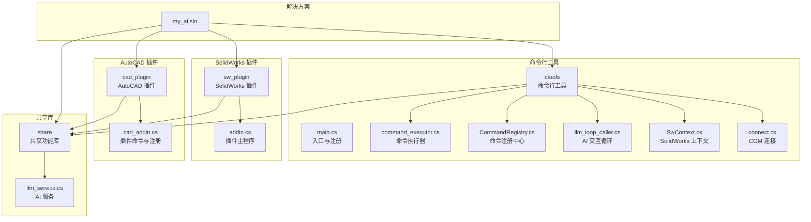
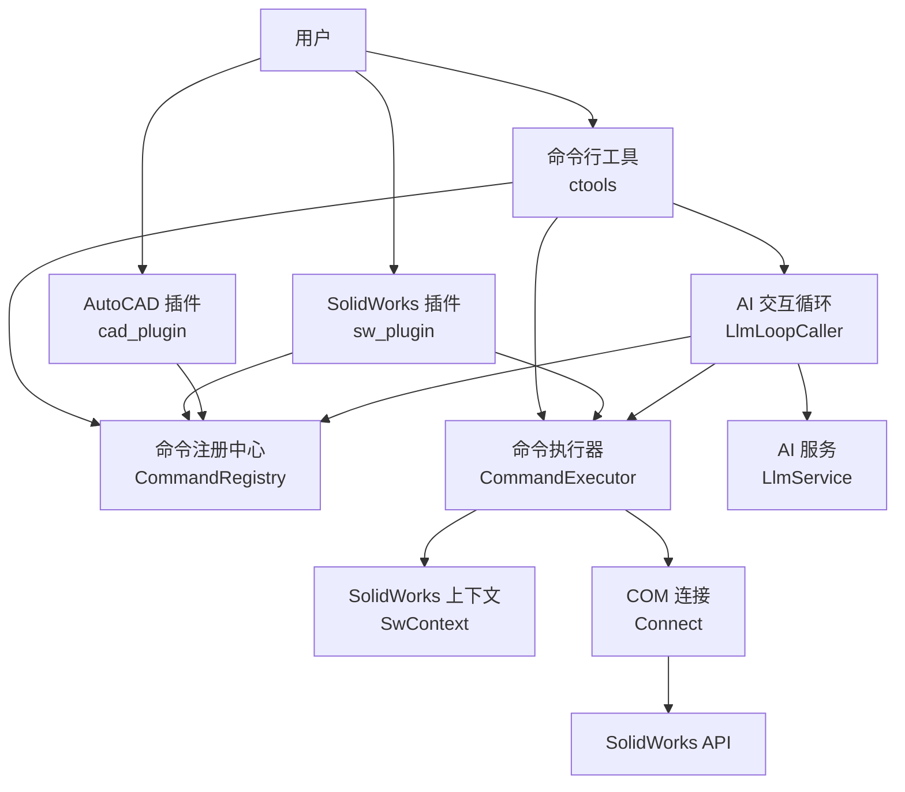
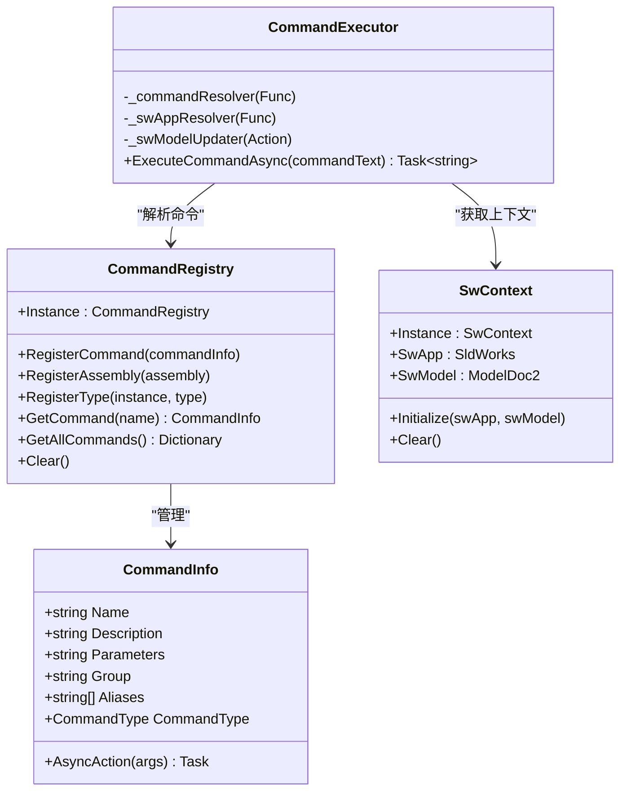
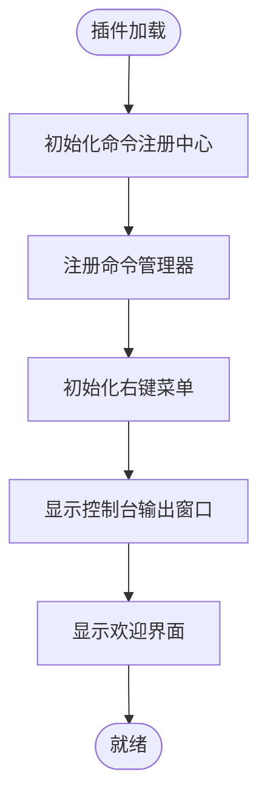
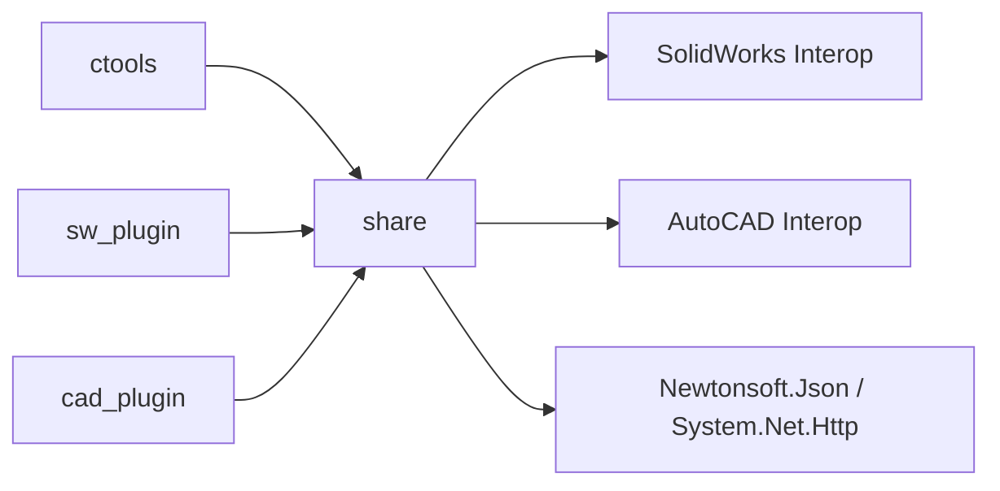

# 核心架构设计

<cite>
**本文档引用的文件**
- [README.md](file://README.md)
- [my_ai.sln](file://my_ai.sln)
- [ctools/main.cs](file://ctools/main.cs)
- [ctools/command_executor.cs](file://ctools/command_executor.cs)
- [ctools/llm_loop_caller.cs](file://ctools/llm_loop_caller.cs)
- [ctools/CommandRegistry.cs](file://ctools/CommandRegistry.cs)
- [ctools/SwContext.cs](file://ctools/SwContext.cs)
- [ctools/connect.cs](file://ctools/connect.cs)
- [sw_plugin/addin.cs](file://sw_plugin/addin.cs)
- [cad_plugin/cad_addin.cs](file://cad_plugin/cad_addin.cs)
- [share/nomal/llm_service.cs](file://share/nomal/llm_service.cs)
- [share/share.csproj](file://share/share.csproj)
- [ctools/ctool.csproj](file://ctools/ctool.csproj)
- [sw_plugin/sw_plugin.csproj](file://sw_plugin/sw_plugin.csproj)
- [cad_plugin/cad_plugin.csproj](file://cad_plugin/cad_plugin.csproj)
</cite>

## 目录
1. [引言](#引言)
2. [项目结构](#项目结构)
3. [核心组件](#核心组件)
4. [架构总览](#架构总览)
5. [详细组件分析](#详细组件分析)
6. [依赖关系分析](#依赖关系分析)
7. [性能考量](#性能考量)
8. [故障排除指南](#故障排除指南)
9. [结论](#结论)

## 引言
本项目 my_ai 是一个面向 SolidWorks 的智能自动化助手，融合了命令行工具、SolidWorks 插件以及 AI 对话能力，旨在通过自然语言与命令系统协作，实现对 SolidWorks 的高效批量化操作。项目采用分层架构、插件架构与模块化设计相结合的方式，围绕命令注册中心、AI 服务与 SolidWorks/CAD 集成系统形成清晰的职责边界与数据流。

## 项目结构
项目采用多项目解决方案组织，核心分为四个子系统：
- ctools：命令行工具与 AI 对话交互入口，负责命令注册、解析与执行，以及与 AI 服务的集成。
- sw_plugin：SolidWorks 插件，提供菜单、右键菜单与控制台输出窗口，集成命令管理器与欢迎界面。
- cad_plugin：AutoCAD 插件，提供 COM 注册与卸载逻辑，以及插件初始化。
- share：共享功能库，封装通用工具、AI 服务与 CAD/SolidWorks 互操作所需的公共组件。



**图表来源**
- [my_ai.sln:1-43](file://my_ai.sln#L1-L43)
- [ctools/main.cs:54-109](file://ctools/main.cs#L54-L109)
- [ctools/command_executor.cs:12-26](file://ctools/command_executor.cs#L12-L26)
- [ctools/CommandRegistry.cs:12-27](file://ctools/CommandRegistry.cs#L12-L27)
- [ctools/llm_loop_caller.cs:19-67](file://ctools/llm_loop_caller.cs#L19-L67)
- [ctools/SwContext.cs:9-24](file://ctools/SwContext.cs#L9-L24)
- [ctools/connect.cs:9-51](file://ctools/connect.cs#L9-L51)
- [sw_plugin/addin.cs:18-33](file://sw_plugin/addin.cs#L18-L33)
- [cad_plugin/cad_addin.cs:14-22](file://cad_plugin/cad_addin.cs#L14-L22)
- [share/nomal/llm_service.cs:18-53](file://share/nomal/llm_service.cs#L18-L53)

**章节来源**
- [my_ai.sln:1-43](file://my_ai.sln#L1-L43)
- [README.md:193-249](file://README.md#L193-L249)

## 核心组件
- 命令注册中心（CommandRegistry）：采用单例模式，统一管理命令元数据与别名映射，支持从程序集与实例方法批量注册命令。
- 命令执行器（CommandExecutor）：负责解析用户输入的命令文本，解析参数，校验 SolidWorks 连接状态，并调用对应命令的异步/同步执行逻辑。
- AI 交互循环（LlmLoopCaller）：封装 Tool 调用模式，将命令系统转换为工具定义，与 LLM 服务协同，实现自然语言到命令的自动映射与执行。
- AI 服务（LlmService）：对接 DashScope 通义千问 API，支持普通对话与 VLM 图像分析，维护短期记忆与长期记忆，提供命令搜索与过滤。
- SolidWorks 上下文（SwContext）：单例模式管理全局 SldWorks 应用实例与当前激活文档，为各组件提供统一的上下文访问。
- COM 连接（Connect）：封装与 SolidWorks 的 COM 交互，支持获取活动实例或创建新实例。
- 插件主程序（sw_plugin/addin.cs）：实现 ISwAddin 接口，负责命令管理器集成、右键菜单、控制台输出窗口与欢迎界面展示。
- AutoCAD 插件（cad_plugin/cad_addin.cs）：提供 COM 注册/卸载逻辑与插件初始化，配合注册脚本完成 AutoCAD 集成。

**章节来源**
- [ctools/CommandRegistry.cs:12-27](file://ctools/CommandRegistry.cs#L12-L27)
- [ctools/command_executor.cs:12-26](file://ctools/command_executor.cs#L12-L26)
- [ctools/llm_loop_caller.cs:19-67](file://ctools/llm_loop_caller.cs#L19-L67)
- [share/nomal/llm_service.cs:18-53](file://share/nomal/llm_service.cs#L18-L53)
- [ctools/SwContext.cs:9-24](file://ctools/SwContext.cs#L9-L24)
- [ctools/connect.cs:9-51](file://ctools/connect.cs#L9-L51)
- [sw_plugin/addin.cs:18-33](file://sw_plugin/addin.cs#L18-L33)
- [cad_plugin/cad_addin.cs:14-22](file://cad_plugin/cad_addin.cs#L14-L22)

## 架构总览
系统采用“命令驱动 + AI 协同”的双通道架构：
- 命令通道：用户通过命令行或插件界面输入命令，由命令注册中心解析，命令执行器调用具体实现。
- AI 通道：用户以自然语言描述需求，AI 服务将请求转换为工具调用，再由命令执行器执行。
- 集成通道：通过 SwContext 与 Connect 统一管理 SolidWorks 实例，确保命令与 AI 通道共享同一上下文。



**图表来源**
- [ctools/main.cs:54-109](file://ctools/main.cs#L54-L109)
- [ctools/llm_loop_caller.cs:44-67](file://ctools/llm_loop_caller.cs#L44-L67)
- [ctools/command_executor.cs:18-26](file://ctools/command_executor.cs#L18-L26)
- [ctools/CommandRegistry.cs:61-83](file://ctools/CommandRegistry.cs#L61-L83)
- [ctools/SwContext.cs:71-75](file://ctools/SwContext.cs#L71-L75)
- [ctools/connect.cs:11-51](file://ctools/connect.cs#L11-L51)
- [sw_plugin/addin.cs:96-120](file://sw_plugin/addin.cs#L96-L120)

## 详细组件分析

### 命令系统架构
命令系统采用“特性 + 注册中心 + 执行器”的分层设计：
- 特性标记：通过 CommandAttribute 标注命令名称、描述、参数与分组，支持别名。
- 注册中心：CommandRegistry 提供单例注册与查询，支持从静态方法与实例方法批量注册，维护命令字典与别名映射。
- 执行器：CommandExecutor 负责解析命令文本、参数与 SolidWorks 连接状态，调用 CommandInfo.AsyncAction 执行命令。



**图表来源**
- [ctools/CommandRegistry.cs:12-27](file://ctools/CommandRegistry.cs#L12-L27)
- [ctools/command_executor.cs:12-26](file://ctools/command_executor.cs#L12-L26)
- [ctools/SwContext.cs:9-24](file://ctools/SwContext.cs#L9-L24)

**章节来源**
- [ctools/CommandRegistry.cs:12-27](file://ctools/CommandRegistry.cs#L12-L27)
- [ctools/command_executor.cs:12-26](file://ctools/command_executor.cs#L12-L26)
- [ctools/SwContext.cs:9-24](file://ctools/SwContext.cs#L9-L24)

### AI 集成模块
AI 集成模块通过 LlmService 与 LlmLoopCaller 实现：
- LlmService：负责构建 System Prompt、维护短期/长期记忆、调用 DashScope API、支持文本与图像分析、提供命令搜索与过滤。
- LlmLoopCaller：实现交互式循环，将命令系统转换为工具定义，处理 Tool 调用与用户确认流程，捕获命令执行输出并写入短期记忆。

```mermaid
sequenceDiagram
participant U as "用户"
participant CLI as "ctools 主程序"
participant LOOP as "LlmLoopCaller"
participant LLM as "LlmService"
participant REG as "CommandRegistry"
participant EXE as "CommandExecutor"
U->>CLI : 输入自然语言或命令
CLI->>LOOP : 启动交互循环
LOOP->>REG : 获取所有命令
LOOP->>LLM : ChatWithToolsAsync(用户输入, 工具定义)
LLM-->>LOOP : (响应, 工具调用)
alt 存在工具调用
LOOP->>EXE : ExecuteCommandAsync(完整命令)
EXE-->>LOOP : 执行结果
LOOP->>LLM : 保存工具结果到短期记忆
else 仅文本回复
LOOP-->>U : 直接输出文本
end
```

**图表来源**
- [ctools/llm_loop_caller.cs:493-726](file://ctools/llm_loop_caller.cs#L493-L726)
- [share/nomal/llm_service.cs:547-614](file://share/nomal/llm_service.cs#L547-L614)
- [ctools/command_executor.cs:32-113](file://ctools/command_executor.cs#L32-L113)

**章节来源**
- [share/nomal/llm_service.cs:18-53](file://share/nomal/llm_service.cs#L18-L53)
- [ctools/llm_loop_caller.cs:493-726](file://ctools/llm_loop_caller.cs#L493-L726)

### CAD 集成系统
- SolidWorks 插件：实现 ISwAddin 接口，集成命令管理器、右键菜单与控制台输出窗口；通过 SwContext 初始化全局上下文。
- AutoCAD 插件：提供 COM 注册/卸载逻辑与插件初始化，配合注册脚本完成 AutoCAD 集成。



**图表来源**
- [sw_plugin/addin.cs:96-120](file://sw_plugin/addin.cs#L96-L120)
- [sw_plugin/addin.cs:131-210](file://sw_plugin/addin.cs#L131-L210)

**章节来源**
- [sw_plugin/addin.cs:18-33](file://sw_plugin/addin.cs#L18-L33)
- [sw_plugin/addin.cs:96-120](file://sw_plugin/addin.cs#L96-L120)
- [cad_plugin/cad_addin.cs:14-22](file://cad_plugin/cad_addin.cs#L14-L22)

## 依赖关系分析
项目采用多项目结构，通过共享库实现模块解耦：
- ctools 依赖 share，提供命令系统、AI 服务与 COM 互操作能力。
- sw_plugin 与 cad_plugin 均依赖 share，分别集成 SolidWorks 与 AutoCAD 的互操作。
- share 引用 SolidWorks 与 AutoCAD 的 Interop 程序集，同时包含通用包（如 Newtonsoft.Json、System.Net.Http）。



**图表来源**
- [ctools/ctool.csproj:24-41](file://ctools/ctool.csproj#L24-L41)
- [sw_plugin/sw_plugin.csproj:24-42](file://sw_plugin/sw_plugin.csproj#L24-L42)
- [cad_plugin/cad_plugin.csproj:24-40](file://cad_plugin/cad_plugin.csproj#L24-L40)
- [share/share.csproj:11-24](file://share/share.csproj#L11-L24)

**章节来源**
- [ctools/ctool.csproj:24-41](file://ctools/ctool.csproj#L24-L41)
- [sw_plugin/sw_plugin.csproj:24-42](file://sw_plugin/sw_plugin.csproj#L24-L42)
- [cad_plugin/cad_plugin.csproj:24-40](file://cad_plugin/cad_plugin.csproj#L24-L40)
- [share/share.csproj:11-24](file://share/share.csproj#L11-L24)

## 性能考量
- 命令执行性能：通过 Profiled 特性与性能装饰器记录命令执行耗时，便于定位性能瓶颈。
- AI 调用性能：LlmService 对 API 调用进行超时控制与流式处理，避免长时间阻塞；短期记忆截断保留最近 10 条消息，降低上下文开销。
- COM 交互性能：Connect 统一管理 SolidWorks 实例获取与创建，减少重复连接成本；SwContext 提供线程安全的上下文访问。

**章节来源**
- [ctools/main.cs:28-32](file://ctools/main.cs#L28-L32)
- [share/nomal/llm_service.cs:92-114](file://share/nomal/llm_service.cs#L92-L114)
- [ctools/connect.cs:11-51](file://ctools/connect.cs#L11-L51)
- [ctools/SwContext.cs:71-75](file://ctools/SwContext.cs#L71-L75)

## 故障排除指南
- 插件注册失败：确认以管理员身份运行注册脚本，检查 DLL 是否存在，验证 SolidWorks 版本兼容性。
- SolidWorks 未连接：确保 SolidWorks 已启动且存在激活文档，以管理员身份运行 ctool.exe。
- 命令执行无响应：查看控制台输出，检查 SolidWorks 是否弹出错误提示，确认当前文档类型符合命令要求。
- AI 无法识别命令：使用更明确的命令描述，使用 search 命令查看可用命令列表，必要时切换到直接命令模式。

**章节来源**
- [README.md:281-340](file://README.md#L281-L340)

## 结论
my_ai 项目通过命令系统、AI 集成与 CAD 集成的协同，形成了清晰的分层与模块化架构。命令注册中心与单例上下文确保了跨组件的一致性；AI 服务与交互循环实现了自然语言到命令的自动映射；插件架构提供了与 SolidWorks/AutoCAD 的无缝集成。技术决策（如 .NET Framework 4.8 与 .NET 9.0 的混合使用）兼顾了互操作性与现代开发体验，整体架构具备良好的扩展性与可维护性。