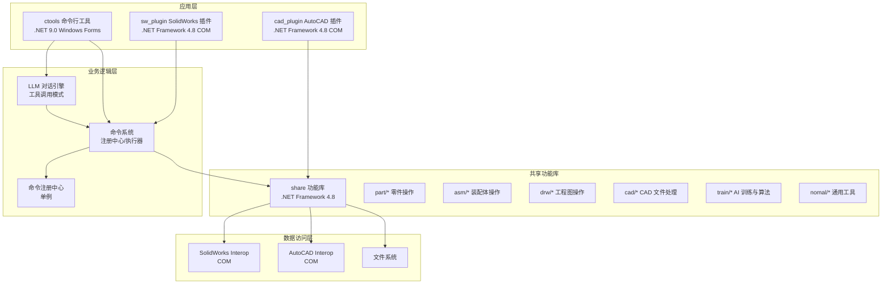
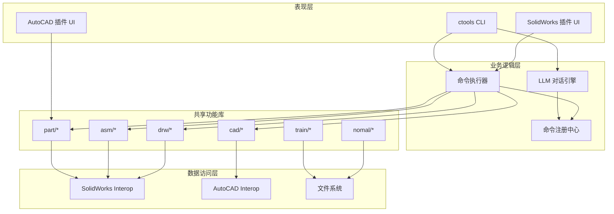
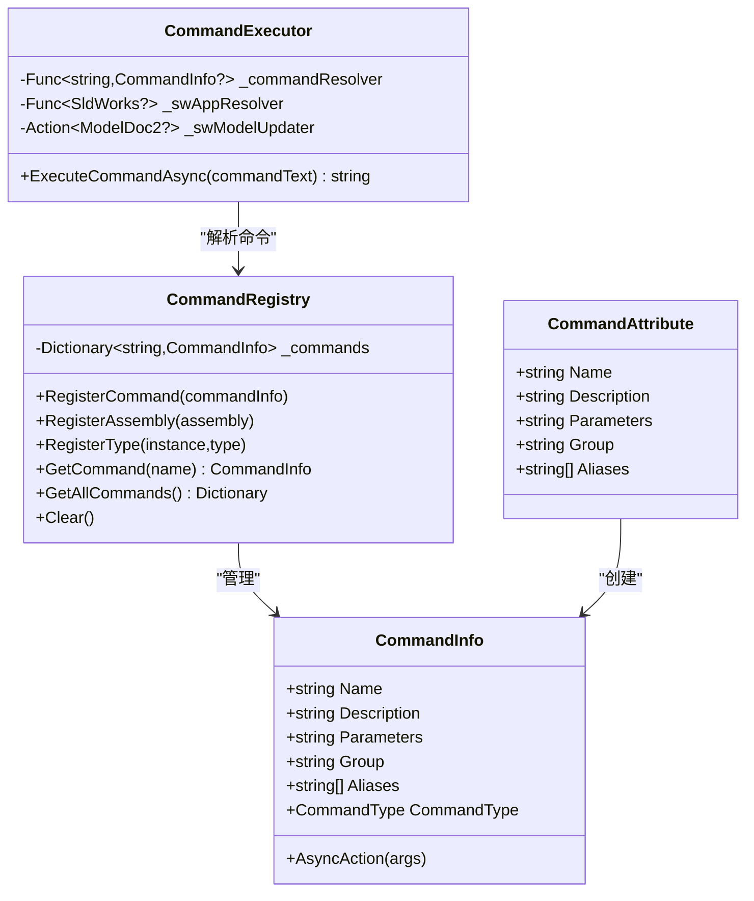
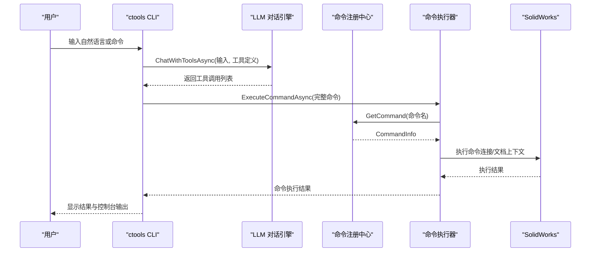
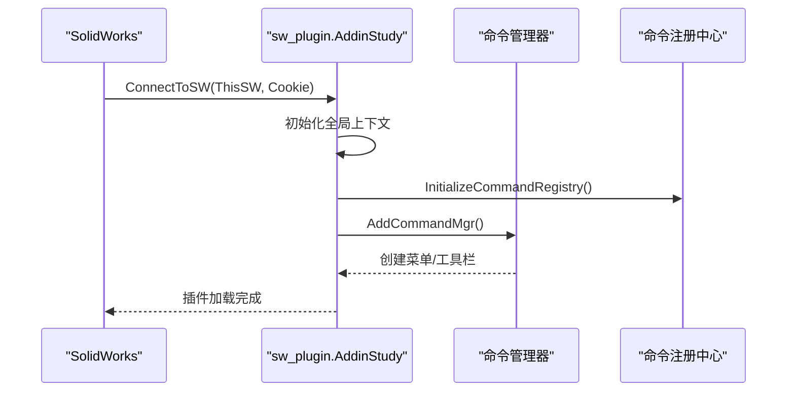
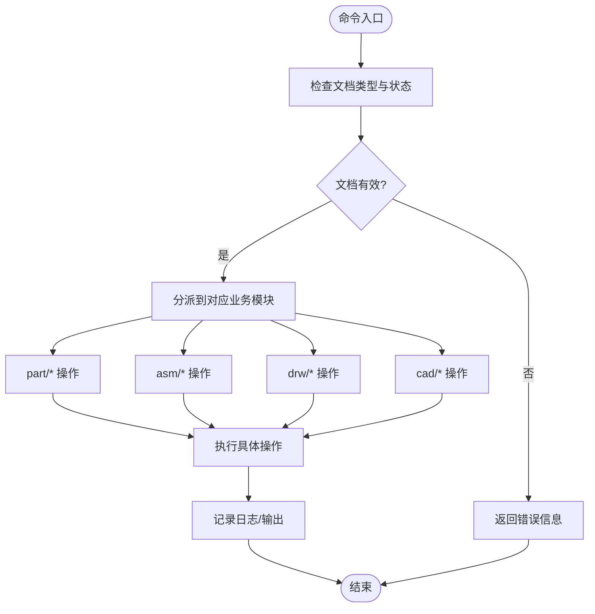
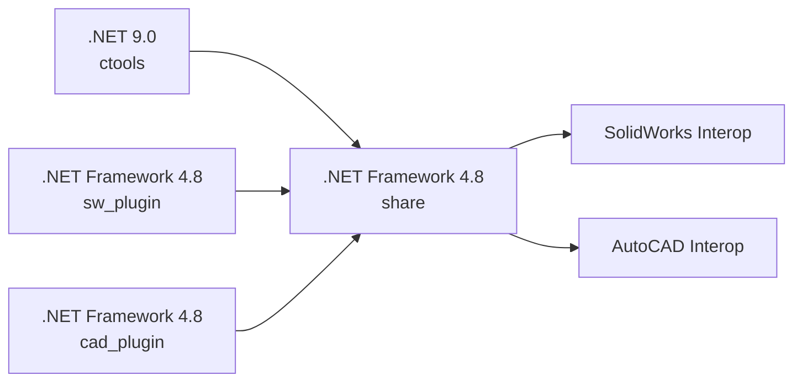

# 系统总体架构

<cite>
**本文档引用的文件**
- [README.md](file://README.md)
- [my_ai.sln](file://my_ai.sln)
- [share.csproj](file://share/share.csproj)
- [ctool.csproj](file://ctools/ctool.csproj)
- [sw_plugin.csproj](file://sw_plugin/sw_plugin.csproj)
- [cad_plugin.csproj](file://cad_plugin/cad_plugin.csproj)
- [main.cs](file://ctools/main.cs)
- [llm_loop_caller.cs](file://ctools/llm_loop_caller.cs)
- [command_executor.cs](file://ctools/command_executor.cs)
- [connect.cs](file://ctools/connect.cs)
- [CommandRegistry.cs](file://ctools/CommandRegistry.cs)
- [CommandAttribute.cs](file://ctools/CommandAttribute.cs)
- [addin.cs](file://sw_plugin/addin.cs)
- [function_adder.cs](file://sw_plugin/function_adder.cs)
- [exportdwg.cs](file://share/part/exportdwg.cs)
- [asm2bom.cs](file://share/asm/asm2bom.cs)
- [dwg2dxf.cs](file://share/cad/dwg2dxf.cs)
</cite>

## 目录
1. [引言](#引言)
2. [项目结构](#项目结构)
3. [核心组件](#核心组件)
4. [架构总览](#架构总览)
5. [详细组件分析](#详细组件分析)
6. [依赖关系分析](#依赖关系分析)
7. [性能考虑](#性能考虑)
8. [故障排除指南](#故障排除指南)
9. [结论](#结论)

## 引言
my_ai 是一个面向 SolidWorks 的智能 CAD 自动化平台，融合命令行工具、SolidWorks 插件与共享功能库，提供 AI 驱动的自然语言交互与批量自动化能力。系统采用分层架构设计，将表现层（CLI 与插件 UI）、业务逻辑层（命令系统与 LLM 对话引擎）、数据访问层（COM 互操作与文件系统）清晰分离，并通过共享功能库实现跨子系统的复用。

## 项目结构
项目由四个主要子项目组成，分别承担不同层次的职责：
- ctools：命令行工具与 AI 对话交互入口，负责命令解析、LLM 调用与执行调度。
- sw_plugin：SolidWorks 插件，提供菜单、右键菜单与控制台输出窗口，桥接 SolidWorks API。
- cad_plugin：AutoCAD 插件（基于 .NET Framework 4.8），提供 AutoCAD 互操作能力。
- share：共享功能库，封装 SolidWorks 与 AutoCAD 的常用操作，作为业务逻辑的核心实现。

**图表来源**
- [my_ai.sln:1-43](file://my_ai.sln#L1-L43)
- [ctool.csproj:1-55](file://ctools/ctool.csproj#L1-L55)
- [sw_plugin.csproj:1-74](file://sw_plugin/sw_plugin.csproj#L1-L74)
- [cad_plugin.csproj:1-46](file://cad_plugin/cad_plugin.csproj#L1-L46)
- [share.csproj:1-40](file://share/share.csproj#L1-L40)

**章节来源**
- [README.md:193-249](file://README.md#L193-L249)
- [my_ai.sln:1-43](file://my_ai.sln#L1-L43)

## 核心组件
- 命令系统与注册中心
  - 通过特性驱动的命令注册机制，集中管理命令元数据与执行逻辑，支持同步与异步命令类型。
  - 命令注册中心采用单例模式，提供线程安全的命令查询与批量注册能力。
- LLM 对话引擎
  - 基于工具调用模式，将可用命令动态注入到系统提示词中，实现自然语言到命令的精准映射。
  - 支持确认模式与自动模式，具备历史记录与最近命令持久化能力。
- 命令执行器
  - 负责解析用户输入、校验 SolidWorks 连接状态、刷新当前活动文档上下文并执行命令。
- COM 互操作适配层
  - 通过 Connect 类与插件侧的 AddinStudy 类，分别在 CLI 与插件环境中建立与 SolidWorks 的连接。
- 共享功能库
  - 将具体业务操作封装为独立类（如导出 DWG、生成 BOM、DWG 转 DXF 等），统一参数与返回约定，便于跨入口复用。

**章节来源**
- [CommandRegistry.cs:1-242](file://ctools/CommandRegistry.cs#L1-L242)
- [CommandAttribute.cs:1-20](file://ctools/CommandAttribute.cs#L1-L20)
- [llm_loop_caller.cs:1-800](file://ctools/llm_loop_caller.cs#L1-L800)
- [command_executor.cs:1-116](file://ctools/command_executor.cs#L1-L116)
- [connect.cs:1-56](file://ctools/connect.cs#L1-L56)
- [addin.cs:1-339](file://sw_plugin/addin.cs#L1-L339)

## 架构总览
系统采用“表现层-业务逻辑层-数据访问层”的三层架构：
- 表现层
  - CLI：ctools 提供交互式对话模式与命令行模式，支持自然语言与直接命令两种输入方式。
  - 插件 UI：sw_plugin 与 cad_plugin 提供菜单、右键菜单与控制台输出窗口，承载用户交互。
- 业务逻辑层
  - 命令系统：统一命令注册、解析与执行；支持别名与分组管理。
  - LLM 对话：将命令集合动态注入到 LLM，实现意图识别与工具调用。
- 数据访问层
  - 通过 SolidWorks Interop 与 AutoCAD Interop 进行 COM 互操作，读写 CAD 文档与系统资源。
  - 文件系统访问用于日志、配置与中间文件的读写。

**图表来源**
- [main.cs:54-109](file://ctools/main.cs#L54-L109)
- [llm_loop_caller.cs:44-67](file://ctools/llm_loop_caller.cs#L44-L67)
- [command_executor.cs:18-26](file://ctools/command_executor.cs#L18-L26)
- [exportdwg.cs:9-81](file://share/part/exportdwg.cs#L9-L81)
- [asm2bom.cs:10-404](file://share/asm/asm2bom.cs#L10-L404)
- [dwg2dxf.cs:5-40](file://share/cad/dwg2dxf.cs#L5-L40)

## 详细组件分析

### 命令系统与注册中心
- 命令特性与注册
  - 通过 CommandAttribute 标注命令元数据（名称、描述、参数、分组、别名），CommandRegistry 负责扫描程序集并注册命令。
  - 支持静态方法与实例方法两种注册方式，满足 CLI 与插件的不同调用场景。
- 命令执行流程
  - CommandExecutor 接收用户输入，解析命令名与参数，校验 SolidWorks 连接状态，刷新当前活动文档上下文，最终调用 CommandRegistry 中的 AsyncAction 执行命令。
- 模糊匹配与搜索
  - CLI 提供命令搜索与相似度计算，结合别名与描述进行综合评分，提升易用性。

**图表来源**
- [CommandAttribute.cs:1-20](file://ctools/CommandAttribute.cs#L1-L20)
- [CommandRegistry.cs:12-242](file://ctools/CommandRegistry.cs#L12-L242)
- [command_executor.cs:12-116](file://ctools/command_executor.cs#L12-L116)

**章节来源**
- [CommandRegistry.cs:61-108](file://ctools/CommandRegistry.cs#L61-L108)
- [command_executor.cs:32-113](file://ctools/command_executor.cs#L32-L113)
- [main.cs:170-253](file://ctools/main.cs#L170-L253)

### LLM 对话引擎与工具调用
- 工具定义与注入
  - LlmLoopCaller 将可用命令动态构建为工具定义，注入到 LLM 的系统提示词中，实现“命令即工具”的能力。
- 交互循环与确认机制
  - 支持确认模式与自动模式，用户可对每次命令执行进行确认；同时支持查看历史、重复上一条命令等辅助功能。
- 输出捕获与结果记录
  - 通过 Console 输出捕获，将命令执行过程中的控制台输出一并记录到短期记忆，增强对话上下文。

**图表来源**
- [llm_loop_caller.cs:493-726](file://ctools/llm_loop_caller.cs#L493-L726)
- [command_executor.cs:32-113](file://ctools/command_executor.cs#L32-L113)
- [CommandRegistry.cs:113-131](file://ctools/CommandRegistry.cs#L113-L131)

**章节来源**
- [llm_loop_caller.cs:117-172](file://ctools/llm_loop_caller.cs#L117-L172)
- [llm_loop_caller.cs:177-288](file://ctools/llm_loop_caller.cs#L177-L288)
- [llm_loop_caller.cs:509-726](file://ctools/llm_loop_caller.cs#L509-L726)

### SolidWorks 插件与 AutoCAD 插件
- SolidWorks 插件
  - 通过 ISwAddin 接口实现插件生命周期管理，提供菜单、右键菜单与控制台输出窗口。
  - 通过 AddinStudy.ConnectToSW 初始化命令注册表与命令管理器，实现与命令系统的对接。
- AutoCAD 插件
  - 基于 .NET Framework 4.8 与 AutoCAD Interop，提供 AutoCAD 文档操作能力，与 share 功能库协作实现 CAD 文件处理。

**图表来源**
- [addin.cs:96-120](file://sw_plugin/addin.cs#L96-L120)
- [function_adder.cs:75-204](file://sw_plugin/function_adder.cs#L75-L204)

**章节来源**
- [addin.cs:96-120](file://sw_plugin/addin.cs#L96-L120)
- [function_adder.cs:26-74](file://sw_plugin/function_adder.cs#L26-L74)

### 共享功能库与业务操作
- 零件操作（part/*）
  - 如导出 DWG、获取厚度、新建工程图等，封装 SolidWorks PartDoc 的常用操作。
- 装配体操作（asm/*）
  - 如生成 BOM、装配体转工程图、导出 STEP 等，涉及 BomTableAnnotation 与组件遍历。
- 工程图操作（drw/*）
  - 如工程图转 DWG/DXF、导出 PNG、获取可见边线等。
- CAD 文件处理（cad/*）
  - 如 DWG 转 DXF、合并 DWG、绘制分隔线等，利用 AutoCAD Interop。
- 高级功能（train/*）
  - 拓扑标注、相似度计算、Weisfeiler-Lehman 图核等 AI 训练与算法。

**图表来源**
- [exportdwg.cs:12-77](file://share/part/exportdwg.cs#L12-L77)
- [asm2bom.cs:12-359](file://share/asm/asm2bom.cs#L12-L359)
- [dwg2dxf.cs:7-38](file://share/cad/dwg2dxf.cs#L7-L38)

**章节来源**
- [exportdwg.cs:12-77](file://share/part/exportdwg.cs#L12-L77)
- [asm2bom.cs:12-359](file://share/asm/asm2bom.cs#L12-L359)
- [dwg2dxf.cs:7-38](file://share/cad/dwg2dxf.cs#L7-L38)

## 依赖关系分析
- 项目依赖关系
  - ctools 依赖 share，以便在 CLI 中直接调用共享功能。
  - sw_plugin 与 cad_plugin 均依赖 share，实现跨插件的业务复用。
  - share 引用 SolidWorks 与 AutoCAD Interop DLL，提供底层互操作能力。
- .NET 版本策略
  - ctools 使用 .NET 9.0，充分利用最新语言与框架特性，提供现代化的 CLI 体验。
  - sw_plugin 与 cad_plugin 使用 .NET Framework 4.8，满足 COM 插件宿主与 Interop 的兼容性要求。
  - share 使用 .NET Framework 4.8，作为共享库承载业务逻辑与互操作适配。

**图表来源**
- [ctool.csproj:25-26](file://ctools/ctool.csproj#L25-L26)
- [sw_plugin.csproj:25-26](file://sw_plugin/sw_plugin.csproj#L25-L26)
- [cad_plugin.csproj:43-44](file://cad_plugin/cad_plugin.csproj#L43-L44)
- [share.csproj:11-24](file://share/share.csproj#L11-L24)

**章节来源**
- [ctool.csproj:1-55](file://ctools/ctool.csproj#L1-L55)
- [sw_plugin.csproj:1-74](file://sw_plugin/sw_plugin.csproj#L1-L74)
- [cad_plugin.csproj:1-46](file://cad_plugin/cad_plugin.csproj#L1-L46)
- [share.csproj:1-40](file://share/share.csproj#L1-L40)

## 性能考虑
- 命令执行性能
  - 支持性能标注属性，对命令执行耗时进行统计与输出，便于优化热点命令。
- LLM 交互效率
  - 通过工具定义注入与确认机制，减少无效调用；支持自动模式降低人工干预。
- COM 互操作
  - 合理管理 SolidWorks 与 AutoCAD 实例生命周期，避免频繁创建销毁带来的开销。
- 文件系统访问
  - 对临时文件与日志进行集中管理，减少磁盘 IO 压力。

## 故障排除指南
- 插件注册失败
  - 确保以管理员身份运行注册脚本；检查 DLL 是否存在于指定目录；确认 SolidWorks 版本兼容性。
- 无法连接 SolidWorks
  - 先启动 SolidWorks 应用；确保存在激活的文档；以管理员身份运行 ctool.exe。
- 命令执行无响应
  - 查看控制台输出信息；检查 SolidWorks 是否弹出错误提示；确认当前文档类型符合命令要求。
- AI 对话无法识别命令
  - 使用更明确的命令描述；使用 search 命令查看可用命令列表；切换到直接命令模式。

**章节来源**
- [README.md:281-340](file://README.md#L281-L340)

## 结论
my_ai 通过清晰的分层架构与共享功能库设计，实现了 CLI、SolidWorks 插件与 AutoCAD 插件的统一命令体系与业务复用。.NET 9.0 与 .NET Framework 4.8 的混合使用策略，在保证现代开发体验的同时兼顾了 COM 插件与互操作的兼容性。未来可在命令执行性能监控、LLM 对话上下文优化与插件扩展性方面持续演进。