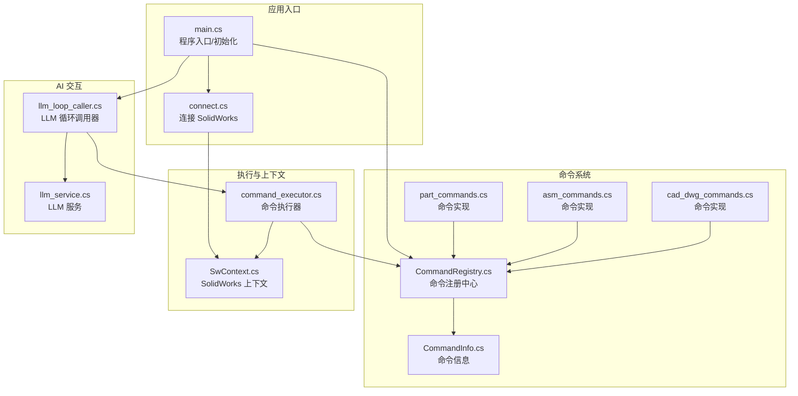
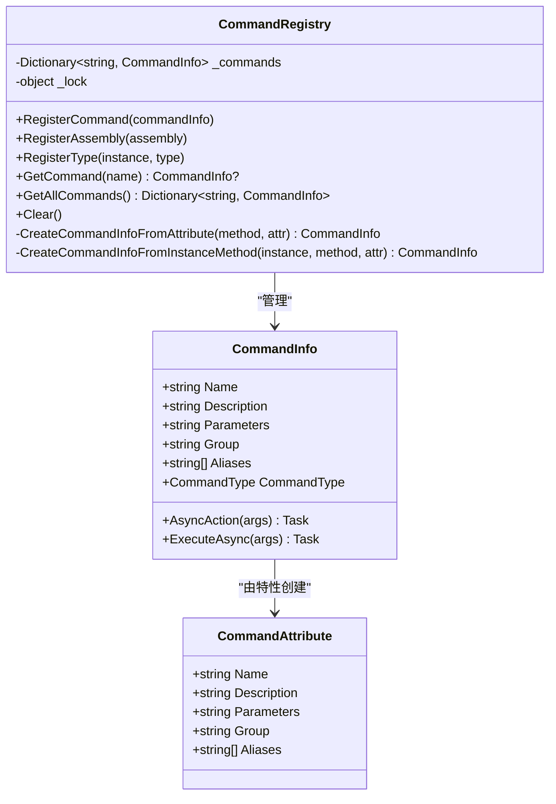
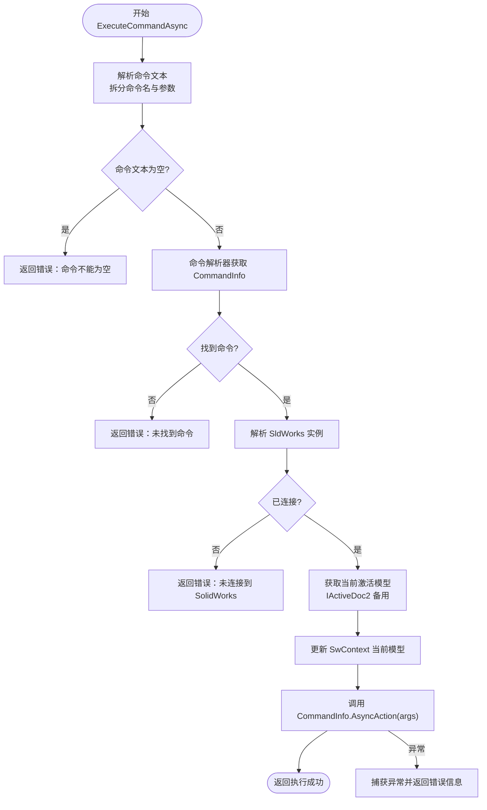
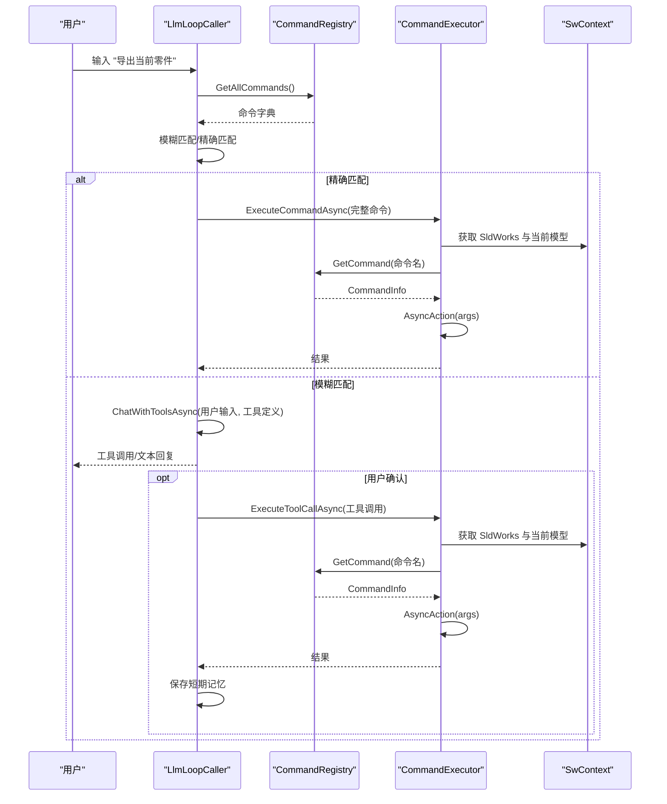
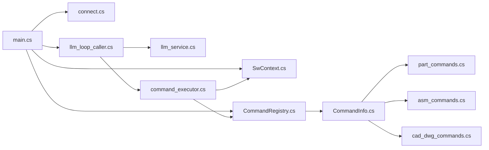

# 组件交互机制

<cite>
**本文档引用的文件**
- [CommandRegistry.cs](file://ctools/CommandRegistry.cs)
- [CommandInfo.cs](file://ctools/CommandInfo.cs)
- [CommandAttribute.cs](file://ctools/CommandAttribute.cs)
- [command_executor.cs](file://ctools/command_executor.cs)
- [SwContext.cs](file://ctools/SwContext.cs)
- [llm_loop_caller.cs](file://ctools/llm_loop_caller.cs)
- [main.cs](file://ctools/main.cs)
- [connect.cs](file://ctools/connect.cs)
- [llm_service.cs](file://share/nomal/llm_service.cs)
- [part_commands.cs](file://ctools/solidworks_commands/part_commands.cs)
- [asm_commands.cs](file://ctools/solidworks_commands/asm_commands.cs)
- [cad_dwg_commands.cs](file://ctools/cad_dwg_commands.cs)
</cite>

## 目录
1. [引言](#引言)
2. [项目结构](#项目结构)
3. [核心组件](#核心组件)
4. [架构总览](#架构总览)
5. [详细组件分析](#详细组件分析)
6. [依赖关系分析](#依赖关系分析)
7. [性能考虑](#性能考虑)
8. [故障排除指南](#故障排除指南)
9. [结论](#结论)

## 引言
本文件面向 my_ai 项目，聚焦于组件交互机制，系统阐述命令注册中心、AI 循环调用器、命令执行器与 SolidWorks 上下文之间的通信方式、数据流向、事件传递与状态同步策略。文档提供交互时序图与数据流图，覆盖典型使用场景（自然语言意图识别、命令精确匹配、工具调用模式、确认/自动执行模式、历史与记忆管理），并总结错误处理与异常传播机制。

## 项目结构
项目采用“命令驱动 + AI 辅助”的分层设计：
- 命令层：通过特性标记的命令方法，统一注册与执行。
- 注册中心：集中管理命令元信息与别名映射。
- 执行层：解析命令文本、解析参数、桥接 SolidWorks 实例与文档。
- 上下文层：全局持有 SolidWorks 应用与当前文档实例。
- AI 层：将命令集合转化为工具定义，进行意图识别与工具调用。
- 启动入口：连接 SolidWorks，初始化上下文与交互循环。



**图表来源**
- [main.cs:53-109](file://ctools/main.cs#L53-L109)
- [connect.cs:11-51](file://ctools/connect.cs#L11-L51)
- [CommandRegistry.cs:12-56](file://ctools/CommandRegistry.cs#L12-L56)
- [CommandInfo.cs:17-39](file://ctools/CommandInfo.cs#L17-L39)
- [part_commands.cs:11-149](file://ctools/solidworks_commands/part_commands.cs#L11-L149)
- [asm_commands.cs:11-158](file://ctools/solidworks_commands/asm_commands.cs#L11-L158)
- [cad_dwg_commands.cs:9-78](file://ctools/cad_dwg_commands.cs#L9-L78)
- [command_executor.cs:12-26](file://ctools/command_executor.cs#L12-L26)
- [SwContext.cs:9-85](file://ctools/SwContext.cs#L9-L85)
- [llm_loop_caller.cs:44-67](file://ctools/llm_loop_caller.cs#L44-L67)
- [llm_service.cs:18-53](file://share/nomal/llm_service.cs#L18-L53)

**章节来源**
- [main.cs:53-109](file://ctools/main.cs#L53-L109)
- [connect.cs:11-51](file://ctools/connect.cs#L11-L51)
- [CommandRegistry.cs:12-56](file://ctools/CommandRegistry.cs#L12-L56)
- [CommandInfo.cs:17-39](file://ctools/CommandInfo.cs#L17-L39)
- [command_executor.cs:12-26](file://ctools/command_executor.cs#L12-L26)
- [SwContext.cs:9-85](file://ctools/SwContext.cs#L9-L85)
- [llm_loop_caller.cs:44-67](file://ctools/llm_loop_caller.cs#L44-L67)
- [llm_service.cs:18-53](file://share/nomal/llm_service.cs#L18-L53)

## 核心组件
- 命令注册中心（CommandRegistry）：单例，负责命令注册、别名映射、命令查询与批量反射注册。
- 命令信息（CommandInfo）：封装命令元数据与异步执行动作。
- 命令特性（CommandAttribute）：用于标记命令方法，声明名称、描述、参数、分组与别名。
- 命令执行器（CommandExecutor）：解析命令文本、解析参数、校验 SolidWorks 连接、更新当前模型、调用命令动作。
- SolidWorks 上下文（SwContext）：单例，全局持有 SldWorks 应用与当前 ModelDoc2 实例。
- LLM 循环调用器（LlmLoopCaller）：构建工具定义、处理用户输入、工具调用、确认/自动模式、历史与记忆管理。
- LLM 服务（LlmService）：与大模型 API 交互，管理消息历史、短期记忆、长期记忆、工具过滤与调用。
- 启动入口（main.cs）：连接 SolidWorks、初始化上下文、注册命令、启动交互循环。

**章节来源**
- [CommandRegistry.cs:12-242](file://ctools/CommandRegistry.cs#L12-L242)
- [CommandInfo.cs:17-40](file://ctools/CommandInfo.cs#L17-L40)
- [CommandAttribute.cs:5-19](file://ctools/CommandAttribute.cs#L5-L19)
- [command_executor.cs:12-116](file://ctools/command_executor.cs#L12-L116)
- [SwContext.cs:9-85](file://ctools/SwContext.cs#L9-L85)
- [llm_loop_caller.cs:19-1029](file://ctools/llm_loop_caller.cs#L19-L1029)
- [llm_service.cs:18-1283](file://share/nomal/llm_service.cs#L18-L1283)
- [main.cs:34-377](file://ctools/main.cs#L34-L377)

## 架构总览
组件间交互遵循“入口初始化 → 命令注册 → AI 识别 → 执行器桥接 → SolidWorks 操作”的主流程；同时通过上下文与注册中心实现松耦合与可扩展。

```mermaid
sequenceDiagram
participant User as "用户"
participant Main as "main.cs"
participant Loop as "LlmLoopCaller"
participant LLM as "LlmService"
participant Exec as "CommandExecutor"
participant Reg as "CommandRegistry"
participant Ctx as "SwContext"
User->>Main : 启动程序
Main->>Ctx : 初始化 SldWorks 与当前文档
Main->>Reg : RegisterAssembly 注册命令
Main->>Loop : 构造 LLM 循环调用器
User->>Loop : 输入自然语言/命令
Loop->>LLM : ChatWithToolsAsync(用户输入, 工具定义)
LLM-->>Loop : (文本回复, 工具调用列表)
alt 存在工具调用
Loop->>Exec : ExecuteCommandAsync(完整命令)
Exec->>Reg : GetCommand(命令名)
Reg-->>Exec : CommandInfo
Exec->>Ctx : 解析 SldWorks 实例与当前模型
Exec->>Exec : 调用 CommandInfo.AsyncAction(args)
Exec-->>Loop : 执行结果
Loop->>Loop : 保存工具调用结果到短期记忆
else 无工具调用
LLM-->>Loop : 文本回复
end
Loop-->>User : 输出结果/提示
```

**图表来源**
- [main.cs:53-109](file://ctools/main.cs#L53-L109)
- [llm_loop_caller.cs:493-726](file://ctools/llm_loop_caller.cs#L493-L726)
- [llm_service.cs:547-614](file://share/nomal/llm_service.cs#L547-L614)
- [command_executor.cs:32-113](file://ctools/command_executor.cs#L32-L113)
- [CommandRegistry.cs:113-131](file://ctools/CommandRegistry.cs#L113-L131)
- [SwContext.cs:29-66](file://ctools/SwContext.cs#L29-L66)

## 详细组件分析

### 命令注册中心（CommandRegistry）
- 单例模式，线程安全地维护命令字典与别名映射。
- 支持：
  - 单命令注册（含别名）。
  - 程序集批量注册（反射扫描 Command 特性）。
  - 类型实例注册（插件等实例方法）。
  - 命令查询与全量导出。
- 关键行为：
  - 注册时将命令名与别名均映射到同一 CommandInfo。
  - 动态创建 CommandInfo.AsyncAction，支持同步/异步命令的统一调用。
  - 异常捕获与日志输出，保证注册过程健壮性。



**图表来源**
- [CommandRegistry.cs:12-242](file://ctools/CommandRegistry.cs#L12-L242)
- [CommandInfo.cs:17-40](file://ctools/CommandInfo.cs#L17-L40)
- [CommandAttribute.cs:5-19](file://ctools/CommandAttribute.cs#L5-L19)

**章节来源**
- [CommandRegistry.cs:12-242](file://ctools/CommandRegistry.cs#L12-L242)
- [CommandInfo.cs:17-40](file://ctools/CommandInfo.cs#L17-L40)
- [CommandAttribute.cs:5-19](file://ctools/CommandAttribute.cs#L5-L19)

### 命令执行器（CommandExecutor）
- 职责：
  - 解析命令文本（支持“命令名 参数”格式）。
  - 通过命令解析器获取 CommandInfo。
  - 校验 SolidWorks 连接与当前激活文档。
  - 更新 SwContext 的当前模型。
  - 调用 CommandInfo.AsyncAction(args)，统一处理异常并返回结果。
- 关键点：
  - 参数解析与空值保护。
  - IActiveDoc2 备用路径获取当前模型。
  - 执行前后日志与异常捕获。



**图表来源**
- [command_executor.cs:32-113](file://ctools/command_executor.cs#L32-L113)
- [SwContext.cs:71-84](file://ctools/SwContext.cs#L71-L84)

**章节来源**
- [command_executor.cs:12-116](file://ctools/command_executor.cs#L12-L116)
- [SwContext.cs:9-85](file://ctools/SwContext.cs#L9-L85)

### SolidWorks 上下文（SwContext）
- 单例，提供 SwApp 与 SwModel 的线程安全访问与更新。
- 初始化与清理方法，确保生命周期可控。
- 与执行器配合，确保每次执行前模型是最新的。

**章节来源**
- [SwContext.cs:9-85](file://ctools/SwContext.cs#L9-L85)

### LLM 循环调用器（LlmLoopCaller）
- 职责：
  - 构建工具定义（基于 CommandRegistry 的命令集合）。
  - 交互循环：接收用户输入，处理特殊命令（quit/exit/clear/mode/history/last/llm）。
  - 精确匹配与模糊匹配：完全匹配直接执行，模糊匹配交由 LLM 判断。
  - 工具调用：拦截 Console 输出，支持确认/自动模式，记录最后执行命令。
  - 记忆与历史：短期记忆（工具调用结果）、历史清理、长期记忆（运行日志）。
- 关键算法：
  - 模糊匹配：编辑距离 + 字符集重叠度加权。
  - 工具过滤：根据 LLM 搜索结果筛选工具集合。



**图表来源**
- [llm_loop_caller.cs:493-726](file://ctools/llm_loop_caller.cs#L493-L726)
- [llm_loop_caller.cs:177-288](file://ctools/llm_loop_caller.cs#L177-L288)
- [llm_service.cs:547-614](file://share/nomal/llm_service.cs#L547-L614)
- [CommandRegistry.cs:113-131](file://ctools/CommandRegistry.cs#L113-L131)
- [command_executor.cs:32-113](file://ctools/command_executor.cs#L32-L113)
- [SwContext.cs:29-66](file://ctools/SwContext.cs#L29-L66)

**章节来源**
- [llm_loop_caller.cs:19-1029](file://ctools/llm_loop_caller.cs#L19-L1029)
- [llm_service.cs:18-1283](file://share/nomal/llm_service.cs#L18-L1283)

### LLM 服务（LlmService）
- 职责：
  - 与 DashScope API 交互，支持文本与图像（VLM）。
  - 构建系统提示与消息历史，管理短期/长期记忆。
  - 工具过滤：根据搜索结果筛选工具集合，强制工具调用。
- 关键点：
  - API Key 获取（环境变量或用户输入）。
  - 消息历史持久化与截断（最多 10 条）。
  - 错误处理与超时控制。

**章节来源**
- [llm_service.cs:18-1283](file://share/nomal/llm_service.cs#L18-L1283)

### 启动入口（main.cs）
- 连接 SolidWorks，初始化 SwContext。
- 注册命令（程序集反射 + 程序集注册）。
- 构造 LlmLoopCaller，注入命令描述生成器、命令解析器、SldWorks 解析器与模型更新器。
- 启动交互循环。

**章节来源**
- [main.cs:53-109](file://ctools/main.cs#L53-L109)
- [connect.cs:11-51](file://ctools/connect.cs#L11-L51)

## 依赖关系分析
- 入口依赖：main.cs 依赖 connect.cs、SwContext、CommandRegistry、LlmLoopCaller。
- 执行链路：LlmLoopCaller 依赖 LlmService、CommandRegistry、CommandExecutor；CommandExecutor 依赖 CommandRegistry、SwContext。
- 命令来源：命令实现位于多个文件（part_commands.cs、asm_commands.cs、cad_dwg_commands.cs），统一通过 CommandAttribute 标注并通过 RegisterAssembly 注册。



**图表来源**
- [main.cs:53-109](file://ctools/main.cs#L53-L109)
- [llm_loop_caller.cs:44-67](file://ctools/llm_loop_caller.cs#L44-L67)
- [command_executor.cs:18-26](file://ctools/command_executor.cs#L18-L26)
- [SwContext.cs:71-84](file://ctools/SwContext.cs#L71-L84)
- [CommandRegistry.cs:61-83](file://ctools/CommandRegistry.cs#L61-L83)

**章节来源**
- [main.cs:53-109](file://ctools/main.cs#L53-L109)
- [llm_loop_caller.cs:44-67](file://ctools/llm_loop_caller.cs#L44-L67)
- [command_executor.cs:18-26](file://ctools/command_executor.cs#L18-L26)
- [SwContext.cs:71-84](file://ctools/SwContext.cs#L71-L84)
- [CommandRegistry.cs:61-83](file://ctools/CommandRegistry.cs#L61-L83)

## 性能考虑
- 命令执行性能监控：部分命令可通过 [Profiled] 特性进行耗时统计与输出。
- 工具过滤：LLM 仅传递与用户输入相关的工具，减少无关工具带来的开销。
- 消息历史截断：短期记忆最多保留 10 条，避免历史过长影响性能。
- I/O 优化：Console 输出捕获与恢复，避免阻塞主线程输出。

[本节为通用性能建议，无需特定文件引用]

## 故障排除指南
- 未连接 SolidWorks
  - 现象：执行器返回“未连接到 SolidWorks”。
  - 排查：确认 connect.cs 成功获取 SldWorks 实例；检查 SwContext 初始化。
  - 参考
    - [command_executor.cs:60-66](file://ctools/command_executor.cs#L60-L66)
    - [connect.cs:21-51](file://ctools/connect.cs#L21-L51)
    - [SwContext.cs:71-75](file://ctools/SwContext.cs#L71-L75)
- 命令不存在
  - 现象：执行器返回“未找到命令”。
  - 排查：确认命令已通过 RegisterAssembly 注册；检查命令名大小写与别名映射。
  - 参考
    - [CommandRegistry.cs:113-131](file://ctools/CommandRegistry.cs#L113-L131)
    - [command_executor.cs:53-58](file://ctools/command_executor.cs#L53-L58)
- 命令执行异常
  - 现象：执行器捕获异常并返回错误信息。
  - 排查：检查 CommandInfo.AsyncAction 内部逻辑；关注 TargetInvocationException 的内部异常。
  - 参考
    - [CommandRegistry.cs:170-194](file://ctools/CommandRegistry.cs#L170-L194)
    - [command_executor.cs:107-112](file://ctools/command_executor.cs#L107-L112)
- LLM 调用失败
  - 现象：API 请求异常、超时或非 200 响应。
  - 排查：确认 API Key；检查网络与超时设置；查看详细异常堆栈。
  - 参考
    - [llm_service.cs:706-800](file://share/nomal/llm_service.cs#L706-L800)
- 模糊匹配误判
  - 现象：输入“导出”被识别为工具调用，但未触发预期命令。
  - 排查：调整阈值或改进命令描述；确认命令名与别名是否正确注册。
  - 参考
    - [llm_loop_caller.cs:387-488](file://ctools/llm_loop_caller.cs#L387-L488)

**章节来源**
- [command_executor.cs:60-66](file://ctools/command_executor.cs#L60-L66)
- [connect.cs:21-51](file://ctools/connect.cs#L21-L51)
- [SwContext.cs:71-75](file://ctools/SwContext.cs#L71-L75)
- [CommandRegistry.cs:113-131](file://ctools/CommandRegistry.cs#L113-L131)
- [command_executor.cs:53-58](file://ctools/command_executor.cs#L53-L58)
- [CommandRegistry.cs:170-194](file://ctools/CommandRegistry.cs#L170-L194)
- [llm_service.cs:706-800](file://share/nomal/llm_service.cs#L706-L800)
- [llm_loop_caller.cs:387-488](file://ctools/llm_loop_caller.cs#L387-L488)

## 结论
本项目通过“命令注册中心 + AI 循环调用器 + 命令执行器 + SolidWorks 上下文”的协同，实现了从自然语言到 SolidWorks 操作的闭环。命令系统以特性驱动、注册中心统一管理，执行器负责桥接与参数解析，AI 层负责意图识别与工具调用，形成清晰的职责分离与良好的扩展性。通过别名映射、确认/自动模式、历史与记忆管理，系统在易用性与安全性之间取得平衡。