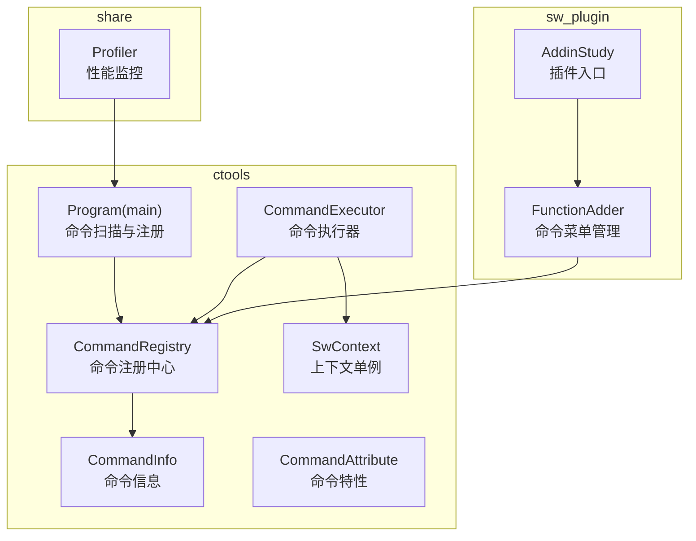
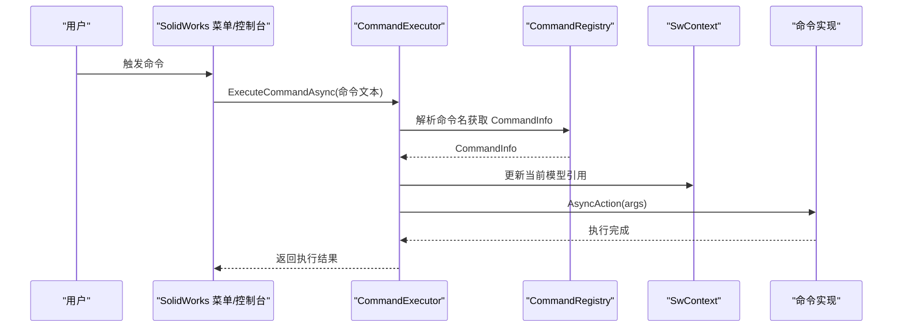
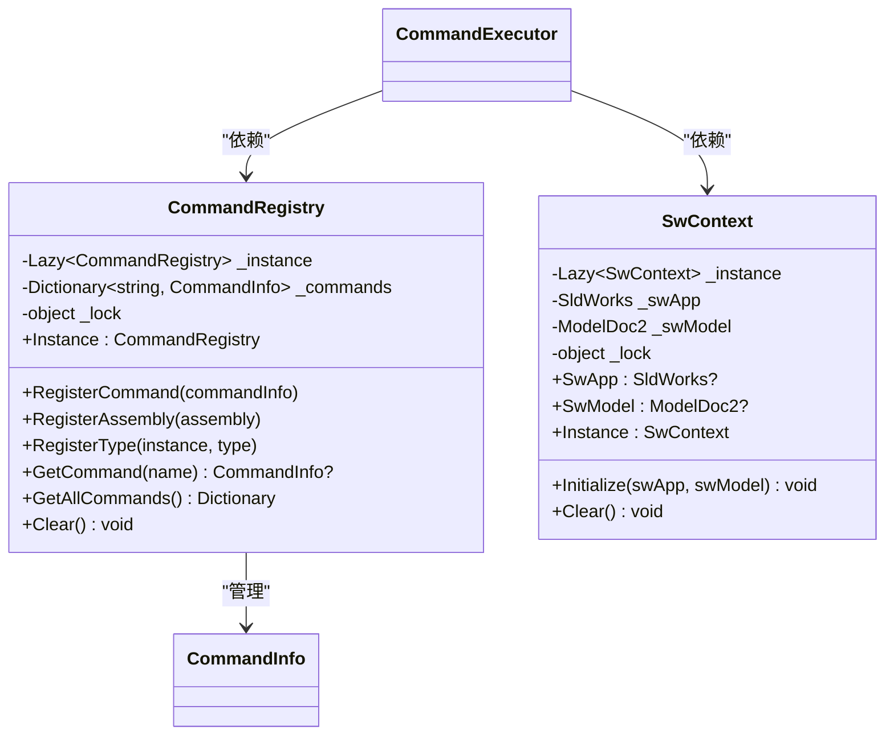
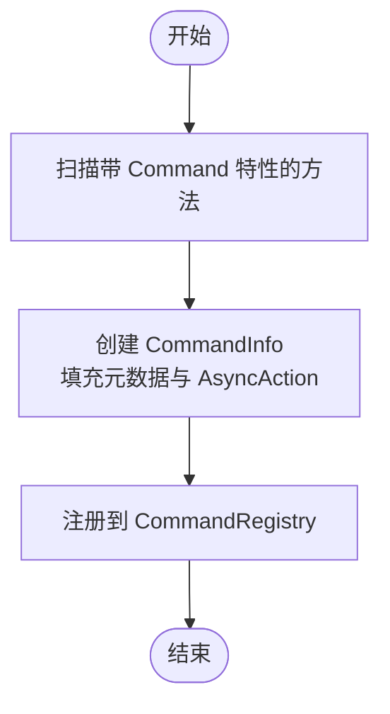
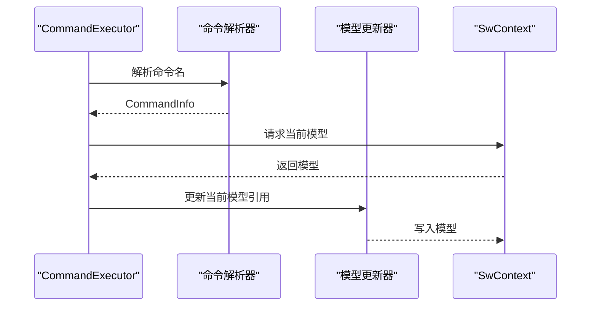
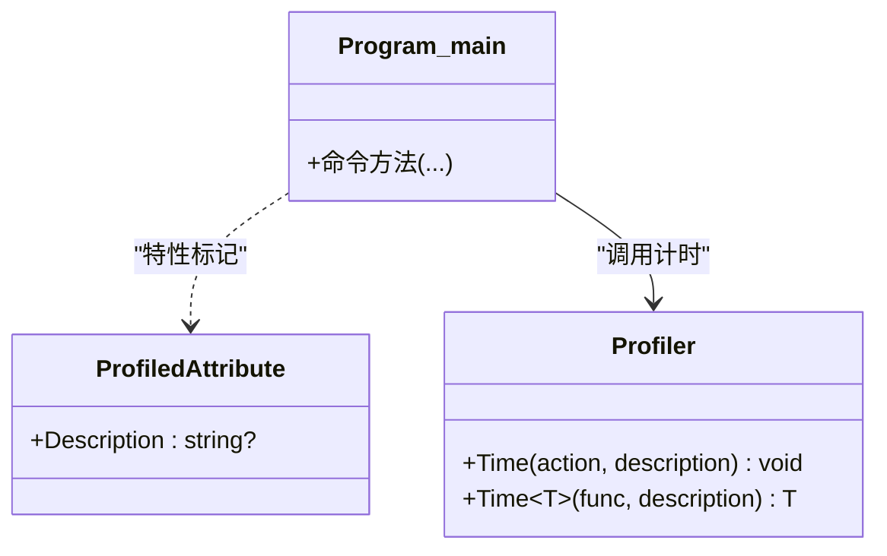
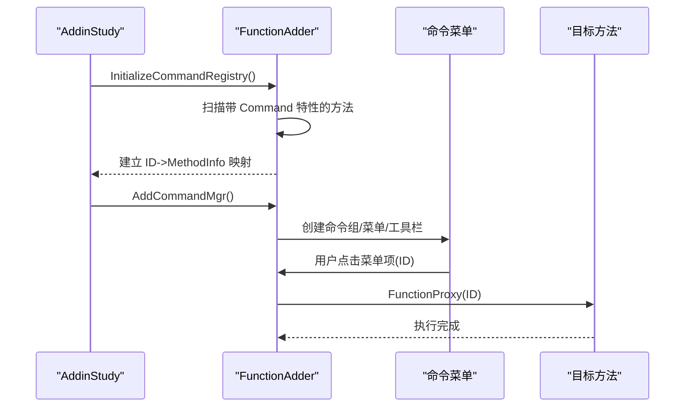
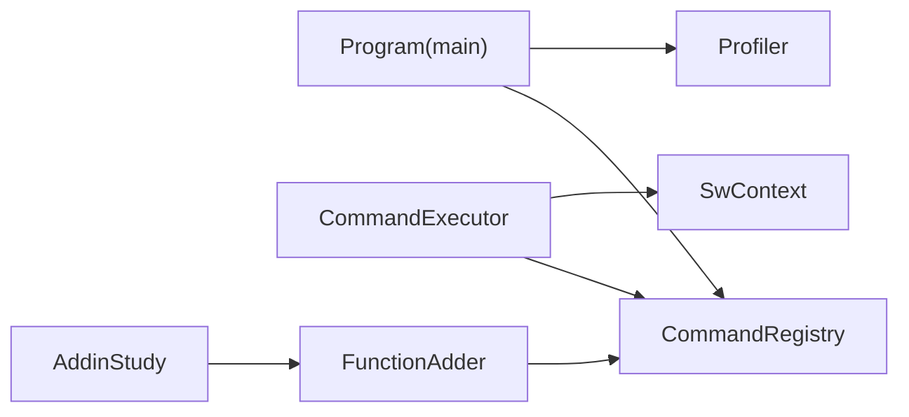

# 设计模式应用

<cite>
**本文引用的文件**
- [CommandRegistry.cs](file://ctools/CommandRegistry.cs)
- [SwContext.cs](file://ctools/SwContext.cs)
- [CommandAttribute.cs](file://ctools/CommandAttribute.cs)
- [CommandInfo.cs](file://ctools/CommandInfo.cs)
- [command_executor.cs](file://ctools/command_executor.cs)
- [main.cs](file://ctools/main.cs)
- [part_commands.cs](file://ctools/solidworks_commands/part_commands.cs)
- [asm_commands.cs](file://ctools/solidworks_commands/asm_commands.cs)
- [drw_commands.cs](file://ctools/solidworks_commands/drw_commands.cs)
- [function_adder.cs](file://sw_plugin/function_adder.cs)
- [addin.cs](file://sw_plugin/addin.cs)
- [Profiler.cs](file://share/nomal/Profiler.cs)
</cite>

## 目录
1. [引言](#引言)
2. [项目结构](#项目结构)
3. [核心组件](#核心组件)
4. [架构总览](#架构总览)
5. [详细组件分析](#详细组件分析)
6. [依赖关系分析](#依赖关系分析)
7. [性能考量](#性能考量)
8. [故障排查指南](#故障排查指南)
9. [结论](#结论)
10. [附录](#附录)

## 引言
本文件聚焦 my_ai 项目中设计模式的实际应用，系统梳理并解释以下模式在项目中的落地方式与价值：
- 单例模式：CommandRegistry、SwContext
- 工厂模式：命令注册与命令信息对象的创建
- 观察者模式：命令执行器与上下文更新的解耦
- 装饰器模式：性能监控装饰器 ProfiledAttribute 与 Profiler 的组合使用

通过对关键文件的逐段解析，结合流程图与类图，帮助读者理解这些模式在命令体系、插件集成与性能监控中的作用，并给出可复用的最佳实践与权衡建议。

## 项目结构
项目采用“模块化+插件化”的组织方式：
- ctools：命令注册、命令执行、上下文管理、命令实现集合
- sw_plugin：SolidWorks 插件入口与命令菜单管理
- share：通用工具与辅助能力（如性能监控）

图表来源
- [CommandRegistry.cs:12-242](file://ctools/CommandRegistry.cs#L12-L242)
- [SwContext.cs:9-87](file://ctools/SwContext.cs#L9-L87)
- [CommandAttribute.cs:5-20](file://ctools/CommandAttribute.cs#L5-L20)
- [CommandInfo.cs:17-41](file://ctools/CommandInfo.cs#L17-L41)
- [command_executor.cs:12-116](file://ctools/command_executor.cs#L12-L116)
- [main.cs:34-253](file://ctools/main.cs#L34-L253)
- [function_adder.cs:18-206](file://sw_plugin/function_adder.cs#L18-L206)
- [addin.cs:24-339](file://sw_plugin/addin.cs#L24-L339)
- [Profiler.cs:6-27](file://share/nomal/Profiler.cs#L6-L27)

章节来源
- [CommandRegistry.cs:12-242](file://ctools/CommandRegistry.cs#L12-L242)
- [SwContext.cs:9-87](file://ctools/SwContext.cs#L9-L87)
- [CommandAttribute.cs:5-20](file://ctools/CommandAttribute.cs#L5-L20)
- [CommandInfo.cs:17-41](file://ctools/CommandInfo.cs#L17-L41)
- [command_executor.cs:12-116](file://ctools/command_executor.cs#L12-L116)
- [main.cs:34-253](file://ctools/main.cs#L34-L253)
- [function_adder.cs:18-206](file://sw_plugin/function_adder.cs#L18-L206)
- [addin.cs:24-339](file://sw_plugin/addin.cs#L24-L339)
- [Profiler.cs:6-27](file://share/nomal/Profiler.cs#L6-L27)

## 核心组件
- CommandRegistry：全局命令注册中心，负责命令注册、批量注册、查询与清理，内部以懒汉单例实现线程安全。
- SwContext：全局 SolidWorks 上下文单例，统一持有 SldWorks 与当前激活文档，提供线程安全的访问器。
- CommandAttribute：命令特性，用于声明式注册命令及其元数据（名称、描述、分组、别名等）。
- CommandInfo：命令信息载体，封装命令名称、描述、参数、分组、别名、执行委托与同步/异步类型。
- CommandExecutor：命令执行器，负责解析命令文本、解析参数、校验 SolidWorks 连接、更新上下文并调用命令。
- Program(main)：扫描带 Command 特性的方法，动态构建命令字典与异步命令映射，支持性能监控装饰器。
- FunctionAdder：SolidWorks 插件侧的命令菜单管理，基于特性扫描建立命令 ID 到方法的映射，动态创建菜单项。
- Profiler：性能监控工具，提供对方法执行时间的测量与输出。

章节来源
- [CommandRegistry.cs:12-242](file://ctools/CommandRegistry.cs#L12-L242)
- [SwContext.cs:9-87](file://ctools/SwContext.cs#L9-L87)
- [CommandAttribute.cs:5-20](file://ctools/CommandAttribute.cs#L5-L20)
- [CommandInfo.cs:17-41](file://ctools/CommandInfo.cs#L17-L41)
- [command_executor.cs:12-116](file://ctools/command_executor.cs#L12-L116)
- [main.cs:34-253](file://ctools/main.cs#L34-L253)
- [function_adder.cs:18-206](file://sw_plugin/function_adder.cs#L18-L206)
- [Profiler.cs:6-27](file://share/nomal/Profiler.cs#L6-L27)

## 架构总览
整体架构围绕“命令注册—命令执行—上下文管理”展开，同时通过特性驱动与反射实现松耦合扩展；插件侧通过菜单管理器将命令暴露给 SolidWorks UI。

图表来源
- [command_executor.cs:32-113](file://ctools/command_executor.cs#L32-L113)
- [CommandRegistry.cs:113-131](file://ctools/CommandRegistry.cs#L113-L131)
- [SwContext.cs:71-84](file://ctools/SwContext.cs#L71-L84)
- [part_commands.cs:11-19](file://ctools/solidworks_commands/part_commands.cs#L11-L19)

## 详细组件分析

### 单例模式：CommandRegistry 与 SwContext
- CommandRegistry
  - 使用 Lazy<T> 实现延迟初始化与线程安全，提供全局唯一实例。
  - 通过锁保护命令字典的并发访问，保证注册、查询、清理的原子性。
  - 支持从静态方法与实例方法批量注册命令，利用特性反射构建 CommandInfo。
- SwContext
  - 同样采用 Lazy<T> 与锁机制，确保 SldWorks 与当前模型的线程安全访问。
  - 提供 Initialize/Clear 方法进行生命周期管理。

图表来源
- [CommandRegistry.cs:12-242](file://ctools/CommandRegistry.cs#L12-L242)
- [SwContext.cs:9-87](file://ctools/SwContext.cs#L9-L87)
- [CommandInfo.cs:17-41](file://ctools/CommandInfo.cs#L17-L41)
- [command_executor.cs:12-26](file://ctools/command_executor.cs#L12-L26)

章节来源
- [CommandRegistry.cs:12-242](file://ctools/CommandRegistry.cs#L12-L242)
- [SwContext.cs:9-87](file://ctools/SwContext.cs#L9-L87)

### 工厂模式：命令注册与命令信息创建
- 在 Program(main) 中，通过反射扫描带 Command 特性的方法，动态创建 CommandInfo 对象，并根据方法返回类型判断同步/异步，生成 AsyncAction 委托。
- CommandRegistry 同样提供从特性创建 CommandInfo 的工厂方法，支持静态方法与实例方法两种来源。
- 该工厂模式实现了“声明式注册 + 动态构建”，降低了命令实现与调度层的耦合。

图表来源
- [main.cs:196-253](file://ctools/main.cs#L196-L253)
- [CommandRegistry.cs:158-239](file://ctools/CommandRegistry.cs#L158-L239)

章节来源
- [main.cs:196-253](file://ctools/main.cs#L196-L253)
- [CommandRegistry.cs:158-239](file://ctools/CommandRegistry.cs#L158-L239)

### 观察者模式：命令执行器与上下文更新
- CommandExecutor 作为“观察者”，通过注入的解析器与更新器，间接感知命令注册中心与 SolidWorks 上下文的变化。
- 当命令执行时，CommandExecutor 主动拉取最新上下文（如 ActiveDoc），从而实现“事件驱动式”的上下文更新，而非显式的回调通知。
- 这种方式简化了跨模块通信，避免了复杂的事件订阅/发布机制。

图表来源
- [command_executor.cs:54-85](file://ctools/command_executor.cs#L54-L85)
- [SwContext.cs:71-84](file://ctools/SwContext.cs#L71-L84)

章节来源
- [command_executor.cs:54-85](file://ctools/command_executor.cs#L54-L85)
- [SwContext.cs:71-84](file://ctools/SwContext.cs#L71-L84)

### 装饰器模式：性能监控 ProfiledAttribute 与 Profiler
- ProfiledAttribute：方法级特性，用于标记需要性能监控的命令。
- Profiler：提供 Time(Action)/Time(Func<T>) 两个重载，用于测量方法执行耗时。
- 在 Program(main) 中，当方法带有 Profiled 特性时，会包裹一层计时逻辑，打印执行耗时，便于定位性能瓶颈。

图表来源
- [main.cs:27-32](file://ctools/main.cs#L27-L32)
- [Profiler.cs:6-27](file://share/nomal/Profiler.cs#L6-L27)

章节来源
- [main.cs:27-32](file://ctools/main.cs#L27-L32)
- [Profiler.cs:6-27](file://share/nomal/Profiler.cs#L6-L27)

### 插件侧命令菜单管理：特性驱动与动态菜单
- FunctionAdder 通过扫描自身实例方法上的 CommandAttribute，建立命令 ID 到 MethodInfo 的映射。
- AddCommandMgr 动态创建命令组、菜单与工具栏，按文档类型过滤命令，实现 UI 层的灵活展示。
- FunctionProxy 根据用户点击的菜单项 ID，调用对应方法；若特性标记 ShowOutputWindow，则先弹出输出窗口再执行。

图表来源
- [function_adder.cs:26-74](file://sw_plugin/function_adder.cs#L26-L74)
- [function_adder.cs:75-198](file://sw_plugin/function_adder.cs#L75-L198)
- [addin.cs:96-120](file://sw_plugin/addin.cs#L96-L120)

章节来源
- [function_adder.cs:26-74](file://sw_plugin/function_adder.cs#L26-L74)
- [function_adder.cs:75-198](file://sw_plugin/function_adder.cs#L75-L198)
- [addin.cs:96-120](file://sw_plugin/addin.cs#L96-L120)

## 依赖关系分析
- 命令侧：Program(main) 与 CommandRegistry 通过反射协作；CommandExecutor 依赖 CommandRegistry 与 SwContext。
- 插件侧：AddinStudy 与 FunctionAdder 协作，前者负责生命周期与注册，后者负责 UI 菜单与命令映射。
- 性能监控：Program(main) 与 Profiler 协作，通过特性与工具类实现非侵入式性能观测。

图表来源
- [main.cs:34-253](file://ctools/main.cs#L34-L253)
- [CommandRegistry.cs:12-242](file://ctools/CommandRegistry.cs#L12-L242)
- [command_executor.cs:12-26](file://ctools/command_executor.cs#L12-L26)
- [SwContext.cs:9-87](file://ctools/SwContext.cs#L9-L87)
- [addin.cs:24-339](file://sw_plugin/addin.cs#L24-L339)
- [function_adder.cs:18-206](file://sw_plugin/function_adder.cs#L18-L206)
- [Profiler.cs:6-27](file://share/nomal/Profiler.cs#L6-L27)

章节来源
- [main.cs:34-253](file://ctools/main.cs#L34-L253)
- [CommandRegistry.cs:12-242](file://ctools/CommandRegistry.cs#L12-L242)
- [command_executor.cs:12-26](file://ctools/command_executor.cs#L12-L26)
- [SwContext.cs:9-87](file://ctools/SwContext.cs#L9-L87)
- [addin.cs:24-339](file://sw_plugin/addin.cs#L24-L339)
- [function_adder.cs:18-206](file://sw_plugin/function_adder.cs#L18-L206)
- [Profiler.cs:6-27](file://share/nomal/Profiler.cs#L6-L27)

## 性能考量
- 单例与锁：CommandRegistry 与 SwContext 使用锁保护共享状态，避免竞态；在高频命令执行场景下，建议减少不必要的上下文切换与重复解析。
- 异步命令：CommandInfo 支持异步执行，CommandExecutor 通过 await 串行化异步命令，提升 UI 响应性；但需注意异常传播与超时控制。
- 性能监控：通过 ProfiledAttribute 与 Profiler 的组合，可在不修改业务代码的前提下采集性能数据；建议仅在开发/测试环境启用，避免生产环境的额外开销。
- 反射成本：命令扫描与特性解析存在运行时成本，建议在应用启动阶段完成一次性注册，后续只做查询与调用。

## 故障排查指南
- 命令未找到
  - 检查命令是否正确标注 Command 特性，以及是否在 Program(main) 的扫描范围内。
  - 确认 CommandRegistry 是否已注册该命令，或是否被 Clear 清理。
- 未连接 SolidWorks
  - CommandExecutor 在执行前会检查 SwApp，若为空则提示未连接；确认 AddinStudy.ConnectToSW 已正确初始化 SwContext。
- 执行异常
  - CommandExecutor 捕获异常并输出堆栈信息；检查命令实现中的参数解析与外部 COM 调用。
- 插件菜单不显示
  - 检查 FunctionAdder 的命令注册是否成功，以及 AddCommandMgr 是否正确创建命令组与菜单项。

章节来源
- [command_executor.cs:60-66](file://ctools/command_executor.cs#L60-L66)
- [command_executor.cs:107-112](file://ctools/command_executor.cs#L107-L112)
- [function_adder.cs:75-198](file://sw_plugin/function_adder.cs#L75-L198)

## 结论
本项目通过单例模式确保全局状态的一致性与线程安全；通过工厂模式实现命令的声明式注册与动态构建；通过观察者模式简化命令执行器与上下文的交互；通过装饰器模式在不侵入业务代码的前提下提供性能监控能力。这些设计模式共同构成了高内聚、低耦合、易扩展的命令体系与插件架构。

## 附录
- 常见使用场景
  - 新增命令：在 Program(main) 中新增带 Command 特性的方法，即可自动注册并参与命令解析。
  - 插件菜单：在插件类中新增带 Command 特性的方法，FunctionAdder 会自动扫描并生成菜单项。
  - 性能优化：为热点命令添加 Profiled 特性，使用 Profiler 辅助定位瓶颈。
- 技术决策与权衡
  - 单例：简化全局访问，但需谨慎处理生命周期与资源释放。
  - 工厂：反射带来一定开销，适合启动期一次性构建，运行期查询快速。
  - 观察者：此处采用“拉取式”上下文更新，避免复杂事件链，提高可维护性。
  - 装饰器：非侵入式监控，但需注意特性标记的成本与误用风险。