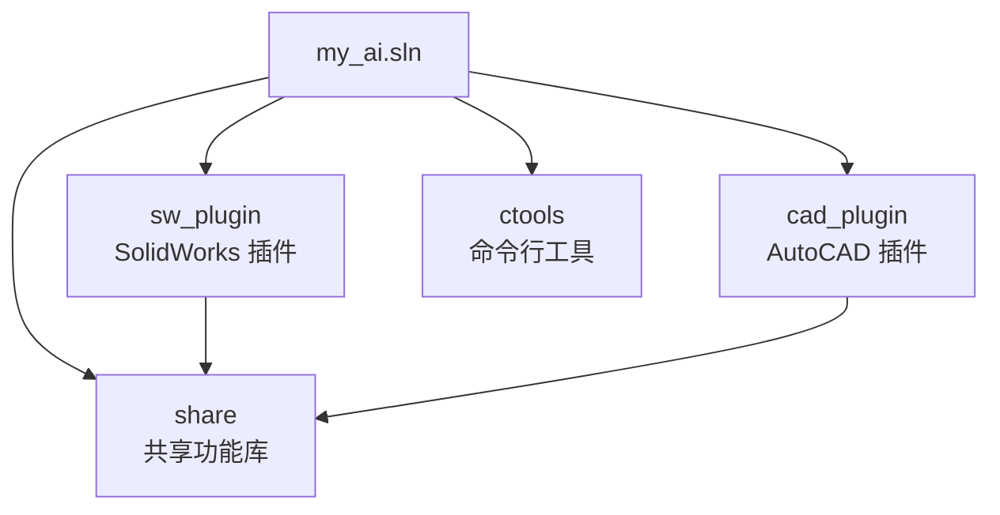
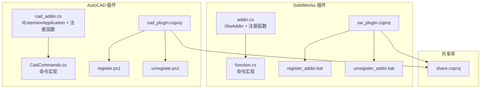
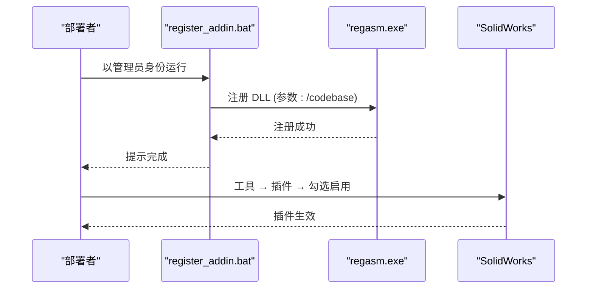
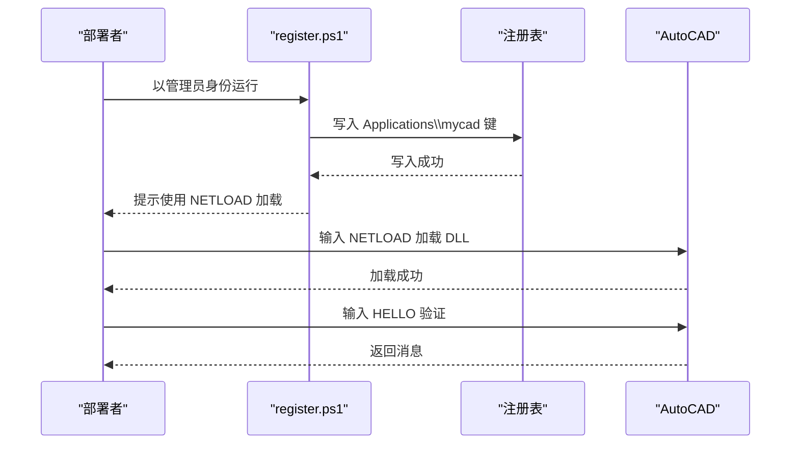
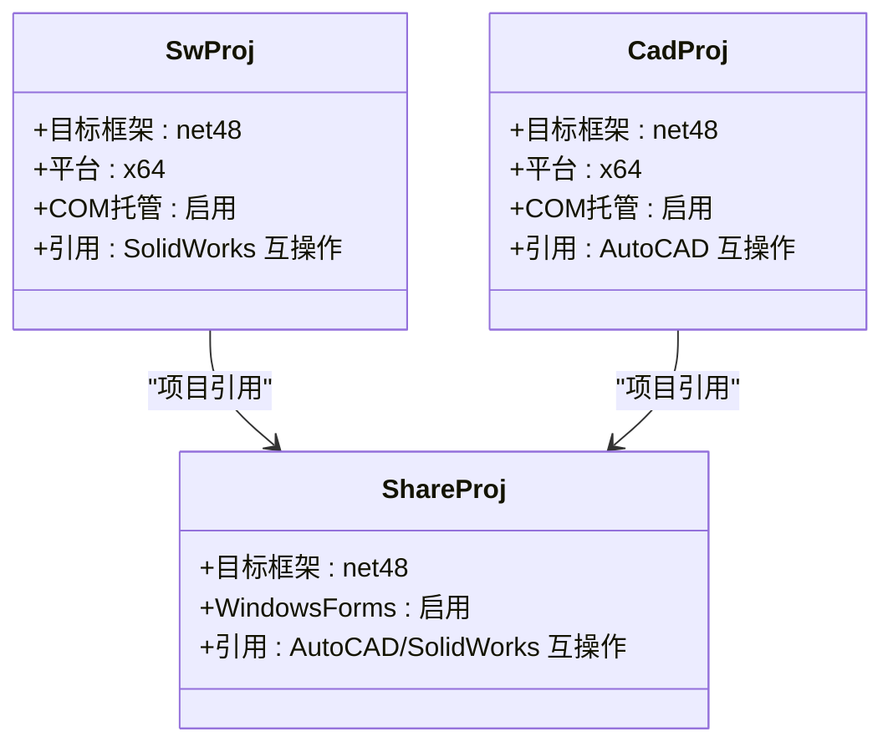

# 插件部署

<cite>
**本文引用的文件**
- [README.md](file://README.md)
- [register.ps1](file://cad_plugin/register.ps1)
- [unregister.ps1](file://cad_plugin/unregister.ps1)
- [register_addin.bat](file://sw_plugin/register_addin.bat)
- [unregister_addin.bat](file://sw_plugin/unregister_addin.bat)
- [cad_plugin.csproj](file://cad_plugin/cad_plugin.csproj)
- [sw_plugin.csproj](file://sw_plugin/sw_plugin.csproj)
- [cad_addin.cs](file://cad_plugin/cad_addin.cs)
- [CadCommands.cs](file://cad_plugin/CadCommands.cs)
- [addin.cs](file://sw_plugin/addin.cs)
- [function.cs](file://sw_plugin/function.cs)
- [share.csproj](file://share/share.csproj)
- [connect.cs](file://share/cad/connect.cs)
- [opendwg.cs](file://share/drw/opendwg.cs)
- [my_ai.sln](file://my_ai.sln)
</cite>

## 目录
1. [引言](#引言)
2. [项目结构](#项目结构)
3. [核心组件](#核心组件)
4. [架构总览](#架构总览)
5. [详细组件分析](#详细组件分析)
6. [依赖分析](#依赖分析)
7. [性能考虑](#性能考虑)
8. [故障排查指南](#故障排查指南)
9. [结论](#结论)
10. [附录](#附录)

## 引言
本文件面向部署工程师与技术支持人员，提供 SolidWorks 插件与 AutoCAD 插件的完整部署指南。内容涵盖：
- 注册脚本与手动注册流程
- 注册脚本工作原理（含 regasm 命令、DLL 路径与权限要求）
- 不同 CAD 版本的兼容性与部署注意事项
- 插件启用/禁用与部署验证方法
- 常见部署问题的诊断与修复

## 项目结构
本仓库采用多项目解决方案，包含：
- SolidWorks 插件项目：sw_plugin
- AutoCAD 插件项目：cad_plugin
- 共享功能库：share
- 命令行工具：ctools
- 解决方案文件：my_ai.sln

图表来源
- [my_ai.sln:1-23](file://my_ai.sln#L1-L23)
- [sw_plugin.csproj:24-26](file://sw_plugin/sw_plugin.csproj#L24-L26)
- [cad_plugin.csproj:42-44](file://cad_plugin/cad_plugin.csproj#L42-L44)

章节来源
- [my_ai.sln:1-23](file://my_ai.sln#L1-L23)

## 核心组件
- SolidWorks 插件（sw_plugin）
  - 通过 COM 注册并在 SolidWorks 中以“插件”形式加载
  - 使用注册/卸载脚本完成 regasm 操作，并在 SolidWorks 中勾选启用
- AutoCAD 插件（cad_plugin）
  - 通过 PowerShell 脚本扫描注册表并写入 Applications\mycad 键，配合 NETLOAD 命令加载
  - 提供注册/卸载脚本，自动提升权限并执行

章节来源
- [sw_plugin.csproj:1-74](file://sw_plugin/sw_plugin.csproj#L1-L74)
- [cad_plugin.csproj:1-46](file://cad_plugin/cad_plugin.csproj#L1-L46)
- [register.ps1:1-93](file://cad_plugin/register.ps1#L1-L93)
- [unregister.ps1:1-92](file://cad_plugin/unregister.ps1#L1-L92)
- [register_addin.bat:1-10](file://sw_plugin/register_addin.bat#L1-L10)
- [unregister_addin.bat:1-11](file://sw_plugin/unregister_addin.bat#L1-L11)

## 架构总览
SolidWorks 与 AutoCAD 插件均基于 .NET 4.8，分别通过 COM 注册与注册表键写入实现加载。

图表来源
- [sw_plugin.csproj:1-74](file://sw_plugin/sw_plugin.csproj#L1-L74)
- [cad_plugin.csproj:1-46](file://cad_plugin/cad_plugin.csproj#L1-L46)
- [addin.cs:18-339](file://sw_plugin/addin.cs#L18-L339)
- [function.cs:29-663](file://sw_plugin/function.cs#L29-L663)
- [cad_addin.cs:84-103](file://cad_plugin/cad_addin.cs#L84-L103)
- [CadCommands.cs:14-106](file://cad_plugin/CadCommands.cs#L14-L106)
- [register_addin.bat:1-10](file://sw_plugin/register_addin.bat#L1-L10)
- [unregister_addin.bat:1-11](file://sw_plugin/unregister_addin.bat#L1-L11)
- [register.ps1:1-93](file://cad_plugin/register.ps1#L1-L93)
- [unregister.ps1:1-92](file://cad_plugin/unregister.ps1#L1-L92)
- [share.csproj:1-40](file://share/share.csproj#L1-L40)

## 详细组件分析

### SolidWorks 插件部署流程
- 使用注册脚本（推荐）
  - 以管理员身份运行注册脚本，内部调用 regasm 完成 COM 注册
  - 在 SolidWorks 中通过“工具 → 插件”启用插件；可勾选“启动时加载”
- 手动注册（高级用户）
  - 以管理员身份打开命令行，执行 regasm 指令对 DLL 进行注册
- 卸载
  - 使用卸载脚本或 regasm /unregister
  - 如需彻底移除，可在 SolidWorks 插件对话框取消勾选

图表来源
- [register_addin.bat:6-8](file://sw_plugin/register_addin.bat#L6-L8)
- [unregister_addin.bat:7-7](file://sw_plugin/unregister_addin.bat#L7-L7)
- [addin.cs:262-307](file://sw_plugin/addin.cs#L262-L307)

章节来源
- [register_addin.bat:1-10](file://sw_plugin/register_addin.bat#L1-L10)
- [unregister_addin.bat:1-11](file://sw_plugin/unregister_addin.bat#L1-L11)
- [addin.cs:262-333](file://sw_plugin/addin.cs#L262-L333)
- [README.md:109-141](file://README.md#L109-L141)

### AutoCAD 插件部署流程
- 使用注册脚本（推荐）
  - 以管理员身份运行 register.ps1，脚本自动扫描注册表中的 AutoCAD 版本
  - 为每个版本写入 Applications\mycad 键，包含 DESCRIPTION、LOADCTRLS、LOADER、MANAGED 等属性
  - 加载后在 AutoCAD 中使用 NETLOAD 命令加载 DLL，并通过 HELLO 命令验证
- 手动注册（替代方案）
  - 以管理员身份运行 regasm 对 DLL 进行注册（不推荐用于 AutoCAD 插件）
- 卸载
  - 运行 unregister.ps1 删除注册表项，重启 AutoCAD 生效

图表来源
- [register.ps1:34-81](file://cad_plugin/register.ps1#L34-L81)
- [unregister.ps1:33-81](file://cad_plugin/unregister.ps1#L33-L81)
- [CadCommands.cs:14-19](file://cad_plugin/CadCommands.cs#L14-L19)

章节来源
- [register.ps1:1-93](file://cad_plugin/register.ps1#L1-L93)
- [unregister.ps1:1-92](file://cad_plugin/unregister.ps1#L1-L92)
- [CadCommands.cs:14-106](file://cad_plugin/CadCommands.cs#L14-L106)

### 注册脚本工作原理（PowerShell）
- 权限提升
  - 若非管理员，脚本会请求提权并以管理员身份重新运行
- DLL 路径
  - 默认路径为 bin\Debug\net48\插件名.dll
  - 若 DLL 不存在，脚本会提示先执行 dotnet build -c Debug
- AutoCAD 版本扫描
  - 读取 HKLM:\SOFTWARE\Autodesk\AutoCAD 下的子键，匹配形如 ACAD-* 的产品项
- 注册表写入
  - 为每个版本创建 Applications\mycad 键并写入必要属性（描述、加载控制、LOADER 指向 DLL、MANAGED=1）

章节来源
- [register.ps1:6-29](file://cad_plugin/register.ps1#L6-L29)
- [register.ps1:34-81](file://cad_plugin/register.ps1#L34-L81)
- [unregister.ps1:6-28](file://cad_plugin/unregister.ps1#L6-L28)
- [unregister.ps1:33-81](file://cad_plugin/unregister.ps1#L33-L81)

### 注册脚本工作原理（regasm）
- 作用
  - 将 .NET 程序集注册为 COM 类型库，使宿主（SolidWorks/AutoCAD）可通过 ProgID 或 GUID 调用
- 参数
  - /codebase：将程序集路径写入注册表，便于跨目录加载
  - /unregister：反向删除注册项
- 路径与权限
  - 路径指向 bin\Release\net48\插件名.dll（根据实际构建配置调整）
  - 必须以管理员身份运行命令提示符

章节来源
- [register_addin.bat:7-7](file://sw_plugin/register_addin.bat#L7-L7)
- [unregister_addin.bat:7-7](file://sw_plugin/unregister_addin.bat#L7-L7)
- [README.md:109-127](file://README.md#L109-L127)

### 插件启用与禁用
- SolidWorks
  - 启用：工具 → 插件 → 勾选插件名称；可勾选“启动时加载”
  - 禁用：取消勾选；卸载时可同时在 SolidWorks 中移除
- AutoCAD
  - 启用：使用 NETLOAD 命令加载 DLL；HELLO 命令验证
  - 禁用：卸载注册表项并重启 AutoCAD

章节来源
- [README.md:130-141](file://README.md#L130-L141)
- [CadCommands.cs:14-19](file://cad_plugin/CadCommands.cs#L14-L19)
- [register.ps1:89-91](file://cad_plugin/register.ps1#L89-L91)

### 部署验证
- SolidWorks
  - 打开 SolidWorks，确认插件出现在“工具 → 插件”列表中
  - 启用插件后，检查菜单栏/右键菜单/控制台输出是否正常
- AutoCAD
  - 使用 NETLOAD 加载 DLL，输入 HELLO 命令返回预期消息
  - 检查注册表 Applications\mycad 键是否存在且属性正确

章节来源
- [README.md:130-141](file://README.md#L130-L141)
- [CadCommands.cs:14-19](file://cad_plugin/CadCommands.cs#L14-L19)
- [register.ps1:69-81](file://cad_plugin/register.ps1#L69-L81)

## 依赖分析
- 目标框架与平台
  - 两个插件项目均以 .NET Framework 4.8（net48）为目标框架，x64 平台
- COM 与互操作
  - 启用 COM 托管（EnableComHosting=true），暴露 COM 接口
  - 引用 SolidWorks/AutoCAD 互操作程序集
- 共享库
  - 两个插件均引用 share 项目，提供通用功能（如文件处理、网络请求等）

图表来源
- [sw_plugin.csproj:3-14](file://sw_plugin/sw_plugin.csproj#L3-L14)
- [cad_plugin.csproj:3-14](file://cad_plugin/cad_plugin.csproj#L3-L14)
- [share.csproj:3-9](file://share/share.csproj#L3-L9)

章节来源
- [sw_plugin.csproj:1-74](file://sw_plugin/sw_plugin.csproj#L1-L74)
- [cad_plugin.csproj:1-46](file://cad_plugin/cad_plugin.csproj#L1-L46)
- [share.csproj:1-40](file://share/share.csproj#L1-L40)

## 性能考虑
- 构建配置
  - Debug 配置未启用优化，Release 更适合生产部署
- COM 注册
  - regasm 写入注册表后，首次加载可能略慢；后续加载性能稳定
- AutoCAD 加载
  - Applications\mycad MANAGED=1 指示托管程序集，加载速度较快

章节来源
- [sw_plugin.csproj:16-22](file://sw_plugin/sw_plugin.csproj#L16-L22)
- [cad_plugin.csproj:16-22](file://cad_plugin/cad_plugin.csproj#L16-L22)
- [register.ps1:74-77](file://cad_plugin/register.ps1#L74-L77)

## 故障排查指南
- 权限不足
  - 症状：regasm 或 PowerShell 脚本执行失败
  - 处理：以管理员身份运行命令提示符或 PowerShell
- DLL 未找到
  - 症状：脚本报错提示 DLL 不存在
  - 处理：先执行 dotnet build -c Debug 或对应 Release 构建；确认路径 bin\Debug\net48\ 或 bin\Release\net48\ 下存在 DLL
- 版本冲突
  - 症状：不同版本 AutoCAD/SolidWorks 无法加载同一 DLL
  - 处理：确保目标框架一致（net48）；为各版本单独构建并按版本部署
- 未检测到安装
  - AutoCAD：注册表扫描不到版本
  - 处理：确认已安装 AutoCAD；检查注册表键 HKLM:\SOFTWARE\Autodesk\AutoCAD 是否存在
- 插件未显示
  - SolidWorks：未在“工具 → 插件”中出现
  - 处理：重新运行注册脚本；重启 SolidWorks；检查注册表项 SOFTWARE\SolidWorks\Addins 与 AddInsStartup
- 加载失败
  - AutoCAD：NETLOAD 无法加载
  - 处理：确认 LOADER 指向的 DLL 路径正确；MANAGED=1；重启 AutoCAD

章节来源
- [register.ps1:24-29](file://cad_plugin/register.ps1#L24-L29)
- [unregister.ps1:24-28](file://cad_plugin/unregister.ps1#L24-L28)
- [README.md:281-340](file://README.md#L281-L340)
- [connect.cs:138-198](file://share/cad/connect.cs#L138-L198)

## 结论
- 推荐使用配套脚本完成部署，确保权限与路径正确
- SolidWorks 与 AutoCAD 插件分别通过 COM 注册与注册表键写入实现加载
- 部署完成后，务必在各自软件中启用插件并进行验证
- 遇到问题时，优先检查管理员权限、DLL 路径与版本兼容性

## 附录

### 不同 CAD 版本的兼容性说明
- AutoCAD
  - 通过注册表扫描多版本并逐个写入注册表键，适配多版本共存环境
- SolidWorks
  - 通过 COM 注册与 AddInsStartup 键控制加载，支持多版本并存

章节来源
- [register.ps1:34-63](file://cad_plugin/register.ps1#L34-L63)
- [connect.cs:138-198](file://share/cad/connect.cs#L138-L198)
- [addin.cs:283-296](file://sw_plugin/addin.cs#L283-L296)

### 命令与功能参考（SolidWorks 插件）
- 常用命令示例（来源于命令实现）
  - 导出展开、导出展开（部件）、工程图转 DWG、新建工程图、打开 DWG 工程图（CAXA/CAD）、装配体批量检查展开、检查 K 因子、装配体导出 BOM、批量导出 STEP、复制 DWG 文件到剪贴板、装配体排版、标折弯尺寸

章节来源
- [function.cs:29-663](file://sw_plugin/function.cs#L29-L663)