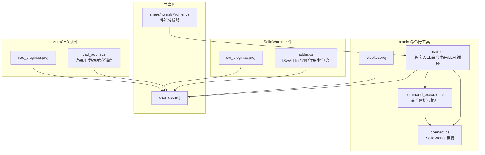
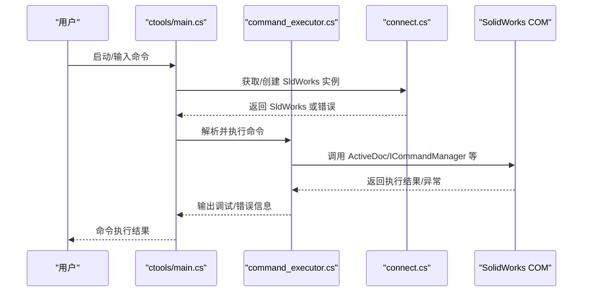
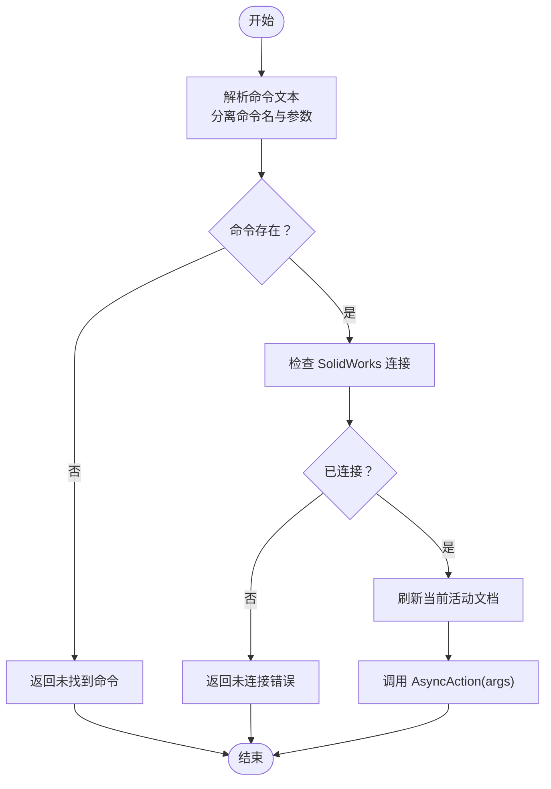
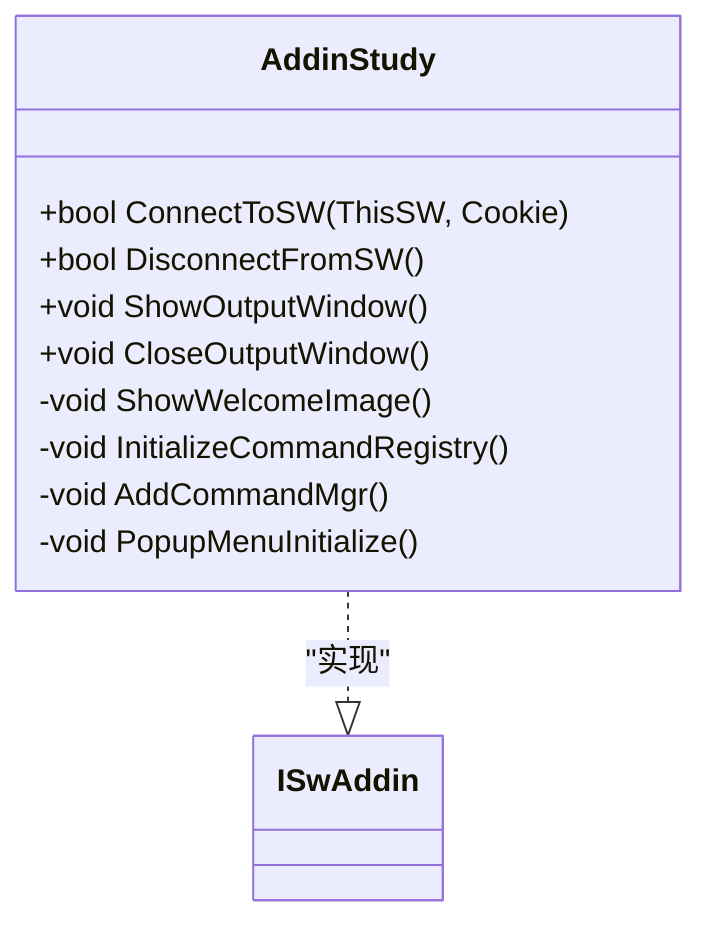
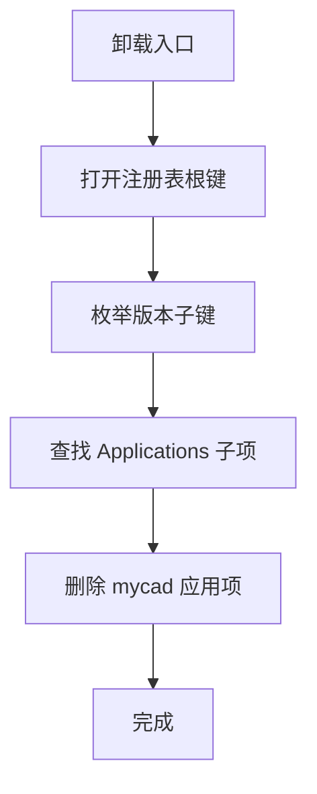
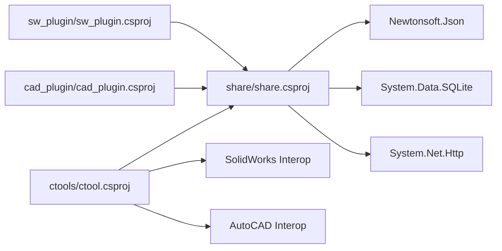

# 故障排除与维护

<cite>
**本文引用的文件**
- [README.md](file://README.md)
- [ctools\main.cs](file://ctools/main.cs)
- [ctools\command_executor.cs](file://ctools/command_executor.cs)
- [ctools\connect.cs](file://ctools/connect.cs)
- [sw_plugin\addin.cs](file://sw_plugin/addin.cs)
- [cad_plugin\cad_addin.cs](file://cad_plugin/cad_addin.cs)
- [share\nomal\Profiler.cs](file://share/nomal/Profiler.cs)
- [ctools\ctool.csproj](file://ctools/ctool.csproj)
- [sw_plugin\sw_plugin.csproj](file://sw_plugin/sw_plugin.csproj)
- [cad_plugin\cad_plugin.csproj](file://cad_plugin/cad_plugin.csproj)
- [share\share.csproj](file://share/share.csproj)
</cite>

## 目录
1. [简介](#简介)
2. [项目结构](#项目结构)
3. [核心组件](#核心组件)
4. [架构总览](#架构总览)
5. [详细组件分析](#详细组件分析)
6. [依赖关系分析](#依赖关系分析)
7. [性能考量](#性能考量)
8. [故障排除指南](#故障排除指南)
9. [结论](#结论)
10. [附录](#附录)

## 简介
本指南面向维护者与使用者，提供系统化的故障诊断与维护方法，覆盖插件加载失败、CAD 连接中断、命令执行错误等常见问题；详述调试工具（性能分析器、COM 组件监控、内存泄漏检测）的使用要点；给出日志分析方法与关键日志信息解读；总结系统维护最佳实践（清理、缓存、性能优化）；并提供备份与恢复策略及灾难恢复应急流程；最后列举常见错误代码与对应解决方法。

## 项目结构
该项目由三个主要子系统组成：
- ctools：命令行工具与 AI 对话循环，负责与 SolidWorks 交互、命令注册与执行、性能分析。
- sw_plugin：SolidWorks 插件，负责在 SolidWorks 中注册、加载、显示控制台输出窗口、右键菜单集成等。
- cad_plugin：AutoCAD 插件，负责在 AutoCAD 中注册、卸载与初始化消息输出。
- share：共享库，提供通用工具、COM 辅助、SQLite、HTTP 等基础能力，并被 ctools 与 sw_plugin 引用。

图表来源
- [ctools/main.cs:34-109](file://ctools/main.cs#L34-L109)
- [ctools/command_executor.cs:12-115](file://ctools/command_executor.cs#L12-L115)
- [ctools/connect.cs:9-55](file://ctools/connect.cs#L9-L55)
- [sw_plugin/addin.cs:18-120](file://sw_plugin/addin.cs#L18-L120)
- [cad_plugin/cad_addin.cs:13-81](file://cad_plugin/cad_addin.cs#L13-L81)
- [share/nomal/Profiler.cs:6-26](file://share/nomal/Profiler.cs#L6-L26)
- [ctools/ctool.csproj:1-55](file://ctools/ctool.csproj#L1-L55)
- [sw_plugin/sw_plugin.csproj:1-74](file://sw_plugin/sw_plugin.csproj#L1-L74)
- [cad_plugin/cad_plugin.csproj:1-46](file://cad_plugin/cad_plugin.csproj#L1-L46)
- [share/share.csproj:1-40](file://share/share.csproj#L1-L40)

章节来源
- [README.md:193-249](file://README.md#L193-L249)

## 核心组件
- 命令系统与注册中心
  - 命令特性与注册：通过特性标记命令元数据，统一注册到全局注册中心，便于集中管理与动态发现。
  - 命令执行器：负责解析命令文本、校验命令存在性、检查 SolidWorks 连接状态、刷新当前活动文档、执行命令并输出调试信息。
- 连接模块
  - 通过 COM 获取或创建 SolidWorks 应用实例，处理无运行实例与类型创建失败等异常。
- 插件加载与生命周期
  - SolidWorks 插件：实现 ISwAddin，完成注册表写入、命令管理器集成、控制台输出窗口、欢迎界面与倒计时清空功能。
  - AutoCAD 插件：实现 COM 注册/反注册，卸载时遍历注册表版本分支清理应用项。
- 性能分析器
  - 提供通用的 Stopwatch 包装，支持 Action 与 Func<T> 的耗时统计，便于定位慢命令与瓶颈。

章节来源
- [ctools/main.cs:170-253](file://ctools/main.cs#L170-L253)
- [ctools/command_executor.cs:12-115](file://ctools/command_executor.cs#L12-L115)
- [ctools/connect.cs:9-55](file://ctools/connect.cs#L9-L55)
- [sw_plugin/addin.cs:18-120](file://sw_plugin/addin.cs#L18-L120)
- [cad_plugin/cad_addin.cs:13-81](file://cad_plugin/cad_addin.cs#L13-L81)
- [share/nomal/Profiler.cs:6-26](file://share/nomal/Profiler.cs#L6-L26)

## 架构总览
系统采用“命令驱动 + COM 交互”的架构：
- ctools 作为 CLI 与 AI 对话入口，负责命令注册、解析与执行，并通过 connect.cs 与 SolidWorks 建立 COM 连接。
- sw_plugin 与 cad_plugin 分别在 SolidWorks 与 AutoCAD 中完成加载、注册与 UI 集成。
- share 提供跨项目共享的基础能力与工具。

图表来源
- [ctools/main.cs:54-109](file://ctools/main.cs#L54-L109)
- [ctools/command_executor.cs:32-113](file://ctools/command_executor.cs#L32-L113)
- [ctools/connect.cs:11-51](file://ctools/connect.cs#L11-L51)

## 详细组件分析

### 命令系统与执行器
- 命令注册
  - 通过反射扫描带特性标记的静态方法，构建命令字典，区分同步与异步命令类型。
  - 支持可选的性能分析装饰器，自动输出耗时统计。
- 命令执行
  - 解析命令文本，分离命令名与参数。
  - 校验命令存在性与 SolidWorks 连接状态。
  - 每次执行前刷新当前活动文档，确保上下文一致。
  - 输出详细的调试信息（当前模型、参数数量、命令类型），便于排障。

图表来源
- [ctools/command_executor.cs:32-113](file://ctools/command_executor.cs#L32-L113)

章节来源
- [ctools/main.cs:170-253](file://ctools/main.cs#L170-L253)
- [ctools/command_executor.cs:12-115](file://ctools/command_executor.cs#L12-L115)

### SolidWorks 插件（ISwAddin）
- 生命周期与注册
  - 实现 ISwAddin，设置回调、获取命令管理器、初始化命令注册表与菜单。
  - COM 注册/反注册：通过注册表写入/删除实现插件启用/禁用。
- 控制台输出与欢迎界面
  - 提供控制台输出窗口，支持置顶与拦截输出。
  - 启动时显示欢迎图片与版本信息，支持倒计时触发清空工程文件操作。

图表来源
- [sw_plugin/addin.cs:18-120](file://sw_plugin/addin.cs#L18-L120)

章节来源
- [sw_plugin/addin.cs:18-120](file://sw_plugin/addin.cs#L18-L120)

### AutoCAD 插件（COM 注册/反注册）
- 注册/反注册
  - 通过注册表路径遍历不同 AutoCAD 版本，删除插件的应用项。
- 初始化消息
  - 插件加载时向编辑器输出初始化消息，提示可用命令。

图表来源
- [cad_plugin/cad_addin.cs:24-80](file://cad_plugin/cad_addin.cs#L24-L80)

章节来源
- [cad_plugin/cad_addin.cs:13-81](file://cad_plugin/cad_addin.cs#L13-L81)

### 性能分析器
- 通用耗时统计
  - 支持 Action 与 Func<T> 的 Stopwatch 包装，输出毫秒级耗时，便于定位慢命令与热点路径。

章节来源
- [share/nomal/Profiler.cs:6-26](file://share/nomal/Profiler.cs#L6-L26)

## 依赖关系分析
- 项目间依赖
  - ctools 与 sw_plugin、cad_plugin 均引用 share，共享通用工具与 COM 能力。
  - ctools 依赖 SolidWorks Interop 与 AutoCAD Interop，用于与 CAD 应用通信。
- 关键依赖项
  - SolidWorks Interop：sldworks、swconst、swpublished、SolidWorksTools。
  - AutoCAD Interop：Autodesk.AutoCAD.Interop、Autodesk.AutoCAD.Interop.Common。
  - 第三方库：Newtonsoft.Json、System.Data.SQLite、System.Net.Http。

图表来源
- [ctools/ctool.csproj:20-41](file://ctools/ctool.csproj#L20-L41)
- [sw_plugin/sw_plugin.csproj:24-42](file://sw_plugin/sw_plugin.csproj#L24-L42)
- [cad_plugin/cad_plugin.csproj:24-40](file://cad_plugin/cad_plugin.csproj#L24-L40)
- [share/share.csproj:11-30](file://share/share.csproj#L11-L30)

章节来源
- [ctools/ctool.csproj:1-55](file://ctools/ctool.csproj#L1-L55)
- [sw_plugin/sw_plugin.csproj:1-74](file://sw_plugin/sw_plugin.csproj#L1-L74)
- [cad_plugin/cad_plugin.csproj:1-46](file://cad_plugin/cad_plugin.csproj#L1-L46)
- [share/share.csproj:1-40](file://share/share.csproj#L1-L40)

## 性能考量
- 命令执行性能
  - 使用命令注册中的可选性能分析装饰器，自动输出命令耗时，便于识别慢命令。
  - 在命令执行器中打印调试信息（命令类型、参数数量、当前模型），辅助定位上下文问题。
- 通用性能分析
  - 使用共享的性能分析器对关键路径进行 Stopwatch 包装，输出毫秒级耗时。
- 优化建议
  - 避免在命令中频繁创建/销毁大型对象。
  - 合理批处理操作，减少与 CAD 应用的往返调用次数。
  - 对耗时操作使用异步命令类型，避免阻塞 UI。

章节来源
- [ctools/main.cs:191-247](file://ctools/main.cs#L191-L247)
- [ctools/command_executor.cs:96-103](file://ctools/command_executor.cs#L96-L103)
- [share/nomal/Profiler.cs:6-26](file://share/nomal/Profiler.cs#L6-L26)

## 故障排除指南

### 一、插件加载失败
- 症状
  - SolidWorks 插件在“插件”列表中不可见或启用后无反应。
  - AutoCAD 插件无法加载或卸载不彻底。
- 排查步骤
  - 确认以管理员身份运行注册/卸载脚本或命令。
  - 检查目标 DLL 是否存在于发布输出目录。
  - 核对 SolidWorks/AutoCAD 版本兼容性与位数（x64）。
  - 查看注册表项是否存在（参考 README 中的注册表路径）。
- 解决方案
  - 重新运行注册脚本；若仍失败，手动执行 regasm 注册/反注册命令。
  - 对 AutoCAD 插件，确认卸载脚本已遍历到正确的版本分支并删除应用项。

章节来源
- [README.md:281-340](file://README.md#L281-L340)
- [sw_plugin/addin.cs:260-335](file://sw_plugin/addin.cs#L260-L335)
- [cad_plugin/cad_addin.cs:24-80](file://cad_plugin/cad_addin.cs#L24-L80)

### 二、CAD 连接中断
- 症状
  - ctools 启动后无法连接 SolidWorks，或命令执行时报“未连接”。
- 排查步骤
  - 确保 SolidWorks 已启动且存在激活文档。
  - 以管理员身份运行 ctool.exe。
  - 检查平台与位数（x64）与 .NET 版本要求。
- 解决方案
  - 先启动 SolidWorks，再运行 ctools；必要时重启 SolidWorks。
  - 若仍失败，检查 COM 类型获取与实例创建过程中的异常信息。

章节来源
- [README.md:297-303](file://README.md#L297-L303)
- [ctools/connect.cs:11-51](file://ctools/connect.cs#L11-L51)

### 三、命令执行错误
- 症状
  - 命令无响应、报错或执行异常。
- 排查步骤
  - 查看控制台输出的调试信息（当前模型、参数数量、命令类型）。
  - 确认当前文档类型满足命令要求。
  - 检查命令是否存在，或使用搜索命令查看可用命令列表。
- 解决方案
  - 使用更明确的命令描述；切换到直接命令模式；查看帮助信息。
  - 对慢命令启用性能分析，定位瓶颈。

章节来源
- [README.md:304-317](file://README.md#L304-L317)
- [ctools/command_executor.cs:68-103](file://ctools/command_executor.cs#L68-L103)
- [ctools/main.cs:114-145](file://ctools/main.cs#L114-L145)

### 四、调试工具使用
- 性能分析器
  - 在关键路径使用共享性能分析器包装方法，输出毫秒级耗时。
  - 结合命令执行器中的耗时输出，定位慢命令与异常耗时。
- COM 组件监控
  - 通过控制台输出与调试信息观察 ActiveDoc、ICommandManager 等对象状态。
  - 对异常进行捕获并记录堆栈信息，辅助定位问题。
- 内存泄漏检测
  - 建议结合外部工具（如 .NET 内存分析器）对长时间运行场景进行检测。
  - 关注命令执行器与插件生命周期中的对象释放情况。

章节来源
- [share/nomal/Profiler.cs:6-26](file://share/nomal/Profiler.cs#L6-L26)
- [ctools/command_executor.cs:96-113](file://ctools/command_executor.cs#L96-L113)

### 五、日志分析与关键信息解读
- 关键日志点
  - 命令执行器：当前模型标题、命令类型、参数数量、执行完成提示。
  - 连接模块：平台判断、COM 获取/创建结果、异常消息。
  - 插件：控制台窗口状态、欢迎界面显示、注册/反注册过程中的异常。
- 解读建议
  - “未连接”通常表示未启动 SolidWorks 或未获取到 COM 实例。
  - “未找到命令”提示命令拼写或注册问题。
  - 调试输出中的模型标题有助于确认上下文是否正确。

章节来源
- [ctools/command_executor.cs:70-103](file://ctools/command_executor.cs#L70-L103)
- [ctools/connect.cs:15-51](file://ctools/connect.cs#L15-L51)
- [sw_plugin/addin.cs:37-68](file://sw_plugin/addin.cs#L37-L68)

### 六、系统维护最佳实践
- 定期清理
  - 清空工程文件（插件欢迎界面提供一键清空选项，适合测试环境）。
  - 清理临时文件与缓存目录（如 SQLite 数据库文件）。
- 缓存管理
  - 对 AI 对话与命令描述内容进行合理缓存，避免重复生成。
  - 定期轮换缓存文件，防止体积膨胀。
- 性能优化
  - 使用异步命令类型处理耗时操作。
  - 合并多次调用，减少与 CAD 应用的交互次数。
  - 对热点路径启用性能分析器持续监控。

章节来源
- [sw_plugin/addin.cs:172-205](file://sw_plugin/addin.cs#L172-L205)
- [ctools/main.cs:191-247](file://ctools/main.cs#L191-L247)

### 七、备份与恢复策略
- 备份
  - 备份注册表项（SolidWorks 插件与 AutoCAD 插件的注册项）。
  - 备份插件 DLL 与资源文件（如欢迎图片）。
  - 备份 SQLite 数据库与配置文件。
- 恢复
  - 通过注册脚本或 regasm 命令恢复插件注册。
  - 将备份的 DLL 与资源文件还原到原位置并重新注册。
  - 恢复数据库与配置后重启 CAD 应用验证功能。

章节来源
- [README.md:320-340](file://README.md#L320-L340)
- [sw_plugin/addin.cs:260-335](file://sw_plugin/addin.cs#L260-L335)
- [cad_plugin/cad_addin.cs:24-80](file://cad_plugin/cad_addin.cs#L24-L80)

### 八、灾难恢复应急流程
- 立即措施
  - 停止使用受影响的插件与命令行工具。
  - 备份当前注册表与插件目录。
- 快速恢复
  - 使用卸载脚本/命令反注册插件，重启 CAD 应用。
  - 重新运行注册脚本/命令，确认插件出现在“插件”列表中。
- 根因分析
  - 检查最近变更（DLL 更新、注册表修改、系统补丁）。
  - 对比备份与当前状态，定位差异点。

章节来源
- [README.md:320-340](file://README.md#L320-L340)

### 九、常见错误代码与解决方法
- 插件注册失败
  - 症状：插件未出现在“插件”列表中。
  - 解决：以管理员身份运行注册脚本；检查 DLL 存在与版本兼容性；查看注册表项。
- 在 SolidWorks 中找不到插件
  - 症状：插件已注册但未启用。
  - 解决：重新运行注册脚本；重启 SolidWorks；检查注册表项。
- ctools 无法连接 SolidWorks
  - 症状：启动后提示未连接。
  - 解决：先启动 SolidWorks；确保存在激活文档；以管理员身份运行 ctool.exe。
- 命令执行无响应
  - 症状：命令无响应或报错。
  - 解决：查看控制台输出；确认文档类型；使用搜索命令查看可用命令。
- AI 对话无法识别命令
  - 症状：AI 无法识别自然语言意图。
  - 解决：使用更明确的命令描述；使用搜索命令；切换到直接命令模式。

章节来源
- [README.md:281-317](file://README.md#L281-L317)

## 结论
本指南提供了从架构到具体故障的系统化排解路径。通过掌握命令系统、连接模块、插件生命周期与调试工具的使用，能够高效定位并解决问题。建议在日常维护中坚持定期清理、缓存管理与性能监控，配合完善的备份与恢复策略，确保系统稳定运行。

## 附录
- 快速参考
  - 插件注册/卸载：使用脚本或 regasm 命令，以管理员身份运行。
  - 连接 CAD：先启动应用，再运行 CLI；确保 x64 与 .NET 版本匹配。
  - 命令排障：查看控制台调试输出，确认命令存在与文档类型匹配。
  - 性能分析：在关键路径使用性能分析器，结合命令执行器输出定位瓶颈。